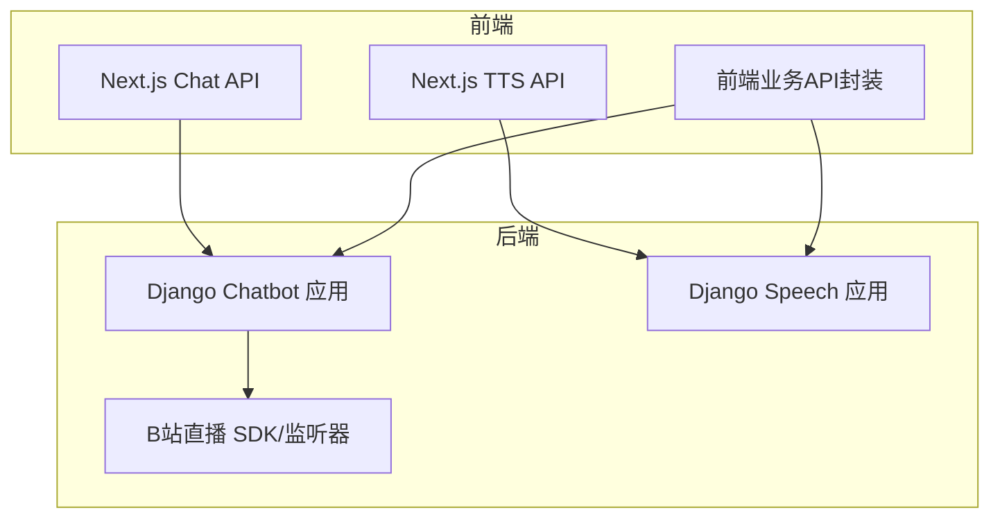
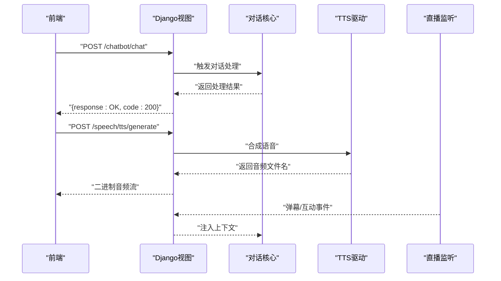
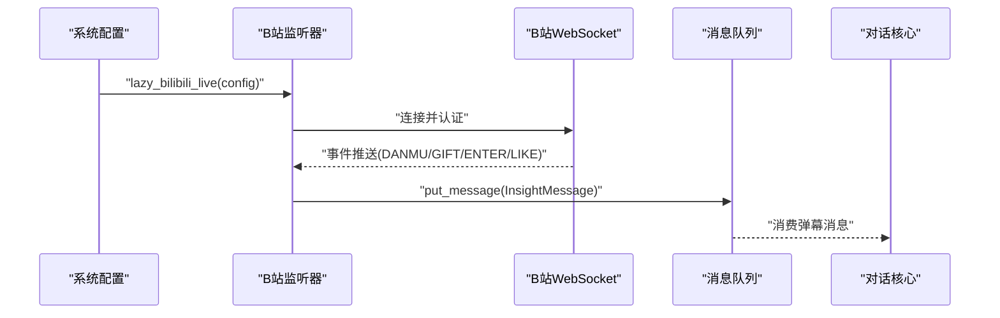
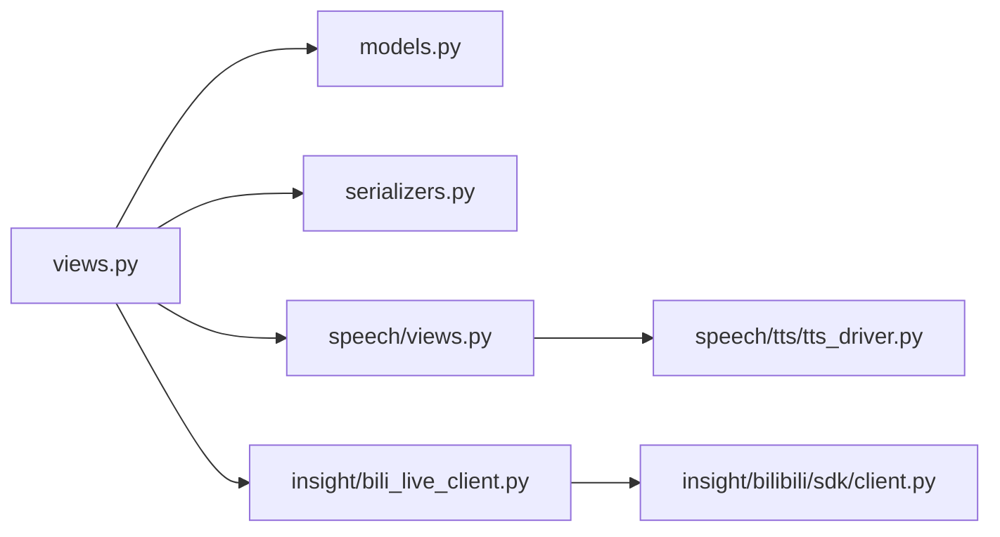

# API参考文档

<cite>
**本文档引用的文件**
- [domain-chatbot/apps/chatbot/urls.py](file://domain-chatbot/apps/chatbot/urls.py)
- [domain-chatbot/apps/chatbot/views.py](file://domain-chatbot/apps/chatbot/views.py)
- [domain-chatbot/apps/speech/urls.py](file://domain-chatbot/apps/speech/urls.py)
- [domain-chatbot/apps/speech/views.py](file://domain-chatbot/apps/speech/views.py)
- [domain-chatbot/apps/speech/tts/tts_driver.py](file://domain-chatbot/apps/speech/tts/tts_driver.py)
- [domain-chatbot/apps/chatbot/models.py](file://domain-chatbot/apps/chatbot/models.py)
- [domain-chatbot/apps/chatbot/serializers.py](file://domain-chatbot/apps/chatbot/serializers.py)
- [domain-chatbot/apps/chatbot/character/character.py](file://domain-chatbot/apps/chatbot/character/character.py)
- [domain-chatbot/apps/chatbot/insight/bilibili_api/bili_live_client.py](file://domain-chatbot/apps/chatbot/insight/bilibili_api/bili_live_client.py)
- [domain-chatbot/apps/chatbot/insight/bilibili/sdk/client.py](file://domain-chatbot/apps/chatbot/insight/bilibili/sdk/client.py)
- [domain-chatvrm/src/pages/api/chat.ts](file://domain-chatvrm/src/pages/api/chat.ts)
- [domain-chatvrm/src/pages/api/tts.ts](file://domain-chatvrm/src/pages/api/tts.ts)
- [domain-chatvrm/src/features/tts/ttsApi.ts](file://domain-chatvrm/src/features/tts/ttsApi.ts)
- [domain-chatvrm/src/features/customRole/customRoleApi.ts](file://domain-chatvrm/src/features/customRole/customRoleApi.ts)
- [domain-chatvrm/src/features/media/mediaApi.ts](file://domain-chatvrm/src/features/media/mediaApi.ts)
</cite>

## 目录
1. [简介](#简介)
2. [项目结构](#项目结构)
3. [核心组件](#核心组件)
4. [架构总览](#架构总览)
5. [详细组件分析](#详细组件分析)
6. [依赖分析](#依赖分析)
7. [性能考虑](#性能考虑)
8. [故障排除指南](#故障排除指南)
9. [结论](#结论)
10. [附录](#附录)

## 简介
本文件为VirtualWife项目的API参考文档，覆盖以下能力域：
- 对话API：消息发送与流式响应（含WebSocket弹幕监听与实时互动）
- 语音合成API：TTS参数、音频格式、语音列表获取
- 角色管理API：角色创建、更新、删除、查询
- 直播集成API：弹幕监听、实时互动
- 客户端实现指南与性能优化建议

文档以“RESTful API + WebSocket”双通道视角组织，提供端点清单、请求/响应模式、参数说明、错误码与处理策略，并给出客户端调用示例与最佳实践。

## 项目结构
后端采用Django应用划分：
- chatbot 应用：对话、角色管理、配置、媒体资源管理
- speech 应用：TTS与翻译服务
- insight 子模块：B站直播弹幕SDK与监听器
- 前端Next.js应用：聊天与TTS的前端适配API

图表来源
- [domain-chatbot/apps/chatbot/urls.py](file://domain-chatbot/apps/chatbot/urls.py#L1-L26)
- [domain-chatbot/apps/speech/urls.py](file://domain-chatbot/apps/speech/urls.py#L1-L9)
- [domain-chatbot/apps/chatbot/insight/bilibili_api/bili_live_client.py](file://domain-chatbot/apps/chatbot/insight/bilibili_api/bili_live_client.py#L1-L167)
- [domain-chatvrm/src/pages/api/chat.ts](file://domain-chatvrm/src/pages/api/chat.ts#L1-L39)
- [domain-chatvrm/src/pages/api/tts.ts](file://domain-chatvrm/src/pages/api/tts.ts#L1-L23)

章节来源
- [domain-chatbot/apps/chatbot/urls.py](file://domain-chatbot/apps/chatbot/urls.py#L1-L26)
- [domain-chatbot/apps/speech/urls.py](file://domain-chatbot/apps/speech/urls.py#L1-L9)

## 核心组件
- 对话服务：接收用户消息，触发核心对话流程
- 角色管理：自定义角色的增删改查与角色包安装
- 媒体资源：背景图与VRM模型的上传、展示与删除
- TTS服务：多引擎TTS合成与语音列表查询
- 直播监听：B站弹幕、礼物、进入直播间等事件的捕获与转发

章节来源
- [domain-chatbot/apps/chatbot/views.py](file://domain-chatbot/apps/chatbot/views.py#L20-L346)
- [domain-chatbot/apps/speech/views.py](file://domain-chatbot/apps/speech/views.py#L16-L74)
- [domain-chatbot/apps/chatbot/insight/bilibili_api/bili_live_client.py](file://domain-chatbot/apps/chatbot/insight/bilibili_api/bili_live_client.py#L16-L167)

## 架构总览
后端通过Django REST视图暴露REST端点；前端Next.js通过同构API路由或业务封装调用后端。直播弹幕通过独立的异步监听器接入，事件经消息队列传递至对话处理流程。

图表来源
- [domain-chatbot/apps/chatbot/views.py](file://domain-chatbot/apps/chatbot/views.py#L20-L346)
- [domain-chatbot/apps/speech/views.py](file://domain-chatbot/apps/speech/views.py#L16-L74)
- [domain-chatbot/apps/chatbot/insight/bilibili_api/bili_live_client.py](file://domain-chatbot/apps/chatbot/insight/bilibili_api/bili_live_client.py#L16-L167)

## 详细组件分析

### 对话API
- 端点：POST /chatbot/chat
- 功能：接收用户消息并触发对话处理
- 请求体
  - query: 字符串，用户输入
  - you_name: 字符串，用户名
- 响应
  - response: 字符串，固定为“OK”
  - code: 字符串，状态码“200”
- 错误码
  - 500：内部错误
- 安全与速率限制
  - 当前未实现鉴权与限流，建议在网关层增加鉴权与限流策略
- 使用示例（客户端）
  - POST /chatbot/chat
  - Content-Type: application/json
  - Body: {"query":"你好","you_name":"用户"}

章节来源
- [domain-chatbot/apps/chatbot/urls.py](file://domain-chatbot/apps/chatbot/urls.py#L5-L7)
- [domain-chatbot/apps/chatbot/views.py](file://domain-chatbot/apps/chatbot/views.py#L20-L32)

### 角色管理API
- 列表查询
  - GET /chatbot/customrole/list
  - 响应：角色数组（序列化后的模型数据）
- 详情查询
  - GET /chatbot/customrole/detail/{id}
  - 响应：单个角色对象
- 创建角色
  - POST /chatbot/customrole/create
  - 请求体字段：role_name, persona, personality, scenario, examples_of_dialogue, custom_role_template_type
  - 响应：成功信息
- 更新角色
  - POST /chatbot/customrole/edit/{id}
  - 请求体字段：id, role_name, persona, personality, scenario, examples_of_dialogue, custom_role_template_type
  - 响应：成功信息
- 删除角色
  - POST /chatbot/customrole/delete/{id}
  - 响应：ok
- 角色包上传与安装
  - POST /chatbot/rolepackage/upload
  - 请求体：multipart/form-data，字段为角色包文件
  - 响应：ok
- 媒体资源管理
  - 背景图
    - POST /chatbot/config/background/upload
    - POST /chatbot/config/background/delete/{id}
    - GET /chatbot/config/background/show
  - VRM模型
    - POST /chatbot/config/vrm/upload
    - POST /chatbot/config/vrm/delete/{id}
    - GET /chatbot/config/vrm/user/show
    - GET /chatbot/config/vrm/system/show
- 数据模型与序列化
  - CustomRoleModel：角色定义
  - BackgroundImageModel：背景图
  - VrmModel：VRM模型
  - RolePackageModel：角色包
  - 序列化器：CustomRoleSerializer、UploadedImageSerializer、UploadedVrmModelSerializer、UploadedRolePackageModelSerializer
- 使用示例（客户端）
  - GET /chatbot/customrole/list
  - POST /chatbot/customrole/create
  - Content-Type: application/json
  - Body: {"role_name":"角色名","persona":"角色信息","personality":"性格","scenario":"场景","examples_of_dialogue":"对话样例","custom_role_template_type":"zh"}

章节来源
- [domain-chatbot/apps/chatbot/urls.py](file://domain-chatbot/apps/chatbot/urls.py#L10-L25)
- [domain-chatbot/apps/chatbot/views.py](file://domain-chatbot/apps/chatbot/views.py#L88-L345)
- [domain-chatbot/apps/chatbot/models.py](file://domain-chatbot/apps/chatbot/models.py#L16-L92)
- [domain-chatbot/apps/chatbot/serializers.py](file://domain-chatbot/apps/chatbot/serializers.py#L5-L37)
- [domain-chatbot/apps/chatbot/character/character.py](file://domain-chatbot/apps/chatbot/character/character.py#L1-L39)

### 语音合成API（TTS）
- 端点
  - POST /speech/tts/generate
    - 功能：根据文本与语音ID生成音频
    - 请求体：text（字符串）、voice_id（字符串）、type（字符串，如“Edge”、“Bert-VITS2”）
    - 响应：audio/mpeg 二进制流（作为附件下载）
  - POST /speech/tts/voices
    - 功能：获取指定类型的可用语音列表
    - 请求体：type（字符串）
    - 响应：语音列表数组
- TTS驱动与引擎
  - BaseTTS：抽象接口，定义synthesis与get_voices
  - EdgeTTS：基于Edge的微软TTS
  - BertVITS2TTS：基于本地BERT-VITS2的中文TTS
  - TTSDriver：根据type选择具体引擎
- 参数说明
  - type：引擎类型
  - voice_id：目标语音标识
  - 其他参数（如噪声、音色比例）由具体引擎支持
- 使用示例（客户端）
  - POST /speech/tts/voices
    - Body: {"type":"Edge"}
  - POST /speech/tts/generate
    - Body: {"text":"你好","voice_id":"语音ID","type":"Edge"}

章节来源
- [domain-chatbot/apps/speech/urls.py](file://domain-chatbot/apps/speech/urls.py#L4-L8)
- [domain-chatbot/apps/speech/views.py](file://domain-chatbot/apps/speech/views.py#L16-L74)
- [domain-chatbot/apps/speech/tts/tts_driver.py](file://domain-chatbot/apps/speech/tts/tts_driver.py#L9-L74)

### 直播集成API（B站弹幕）
- 配置与启动
  - 通过系统配置启用直播监听，解析Cookie并建立弹幕连接
  - 监听事件：DANMU_MSG（弹幕）、SEND_GIFT（礼物）、INTERACT_WORD（用户进入）、LIKE_INFO_V3_CLICK（点赞）
- 事件处理
  - 将弹幕事件封装为消息并放入消息队列，供对话核心使用
- 前端对接
  - 前端Next.js通过同构API或业务封装调用后端，实现弹幕实时显示与互动
- 协议要点
  - WebSocket连接、认证、心跳、压缩与分包处理
- 使用示例（客户端）
  - 在系统配置中启用直播并设置房间号与Cookie
  - 前端监听消息队列并渲染弹幕

图表来源
- [domain-chatbot/apps/chatbot/insight/bilibili_api/bili_live_client.py](file://domain-chatbot/apps/chatbot/insight/bilibili_api/bili_live_client.py#L110-L139)
- [domain-chatbot/apps/chatbot/insight/bilibili/sdk/client.py](file://domain-chatbot/apps/chatbot/insight/bilibili/sdk/client.py#L380-L610)

章节来源
- [domain-chatbot/apps/chatbot/insight/bilibili_api/bili_live_client.py](file://domain-chatbot/apps/chatbot/insight/bilibili_api/bili_live_client.py#L16-L167)
- [domain-chatbot/apps/chatbot/insight/bilibili/sdk/client.py](file://domain-chatbot/apps/chatbot/insight/bilibili/sdk/client.py#L87-L610)

### 前端适配API（Next.js）
- 聊天API（OpenAI）
  - POST /api/chat
  - 用途：代理OpenAI聊天补全
  - 请求体：messages、apiKey（可选）
  - 响应：AI回复内容
- TTS API（Koeiromap）
  - POST /api/tts
  - 用途：合成语音
  - 请求体：message、speakerX、speakerY、style
  - 响应：语音数据
- 前端业务封装
  - ttsApi.ts：getVoices
  - customRoleApi.ts：角色管理
  - mediaApi.ts：媒体资源上传/查询/删除

章节来源
- [domain-chatvrm/src/pages/api/chat.ts](file://domain-chatvrm/src/pages/api/chat.ts#L9-L38)
- [domain-chatvrm/src/pages/api/tts.ts](file://domain-chatvrm/src/pages/api/tts.ts#L10-L22)
- [domain-chatvrm/src/features/tts/ttsApi.ts](file://domain-chatvrm/src/features/tts/ttsApi.ts#L11-L25)
- [domain-chatvrm/src/features/customRole/customRoleApi.ts](file://domain-chatvrm/src/features/customRole/customRoleApi.ts#L24-L71)
- [domain-chatvrm/src/features/media/mediaApi.ts](file://domain-chatvrm/src/features/media/mediaApi.ts#L20-L122)

## 依赖分析
- 组件耦合
  - 视图层对模型与序列化器存在直接依赖
  - TTS驱动按类型选择具体实现，降低耦合
  - 直播监听器通过消息队列与对话核心解耦
- 外部依赖
  - Django REST Framework、bilibili_api、aiohttp、OpenAI
- 可能的循环依赖
  - 未发现明显循环导入；监听器与视图通过配置与消息队列间接交互

图表来源
- [domain-chatbot/apps/chatbot/views.py](file://domain-chatbot/apps/chatbot/views.py#L1-L346)
- [domain-chatbot/apps/chatbot/models.py](file://domain-chatbot/apps/chatbot/models.py#L1-L92)
- [domain-chatbot/apps/chatbot/serializers.py](file://domain-chatbot/apps/chatbot/serializers.py#L1-L37)
- [domain-chatbot/apps/speech/views.py](file://domain-chatbot/apps/speech/views.py#L1-L74)
- [domain-chatbot/apps/speech/tts/tts_driver.py](file://domain-chatbot/apps/speech/tts/tts_driver.py#L1-L74)
- [domain-chatbot/apps/chatbot/insight/bilibili_api/bili_live_client.py](file://domain-chatbot/apps/chatbot/insight/bilibili_api/bili_live_client.py#L1-L167)
- [domain-chatbot/apps/chatbot/insight/bilibili/sdk/client.py](file://domain-chatbot/apps/chatbot/insight/bilibili/sdk/client.py#L1-L610)

## 性能考虑
- TTS合成
  - 优先选择轻量引擎（如Edge）用于高频场景；BERT-VITS2适合高质量中文语音但计算开销较大
  - 合成结果即时删除临时文件，避免磁盘占用
- 直播监听
  - 使用线程池与异步事件循环分离网络I/O与业务处理
  - 心跳与重连机制保证稳定性
- 媒体资源
  - 上传采用分块与校验，避免大文件传输失败
- 前端
  - 使用缓存与懒加载减少首屏压力
  - 对高频请求进行去抖与合并

## 故障排除指南
- 通用错误
  - 500：服务器内部错误；检查日志定位异常
  - 400：请求参数缺失或格式错误；核对Content-Type与必填字段
- TTS
  - 合成失败：确认type与voice_id有效；检查引擎可用性
- 直播
  - 连接失败：检查Cookie有效性与房间号；查看重连日志
- 媒体资源
  - 上传失败：确认文件大小与类型；检查权限与磁盘空间
- 前端
  - OpenAI API Key缺失：在请求体或环境变量中提供

章节来源
- [domain-chatbot/apps/speech/views.py](file://domain-chatbot/apps/speech/views.py#L45-L74)
- [domain-chatbot/apps/chatbot/insight/bilibili_api/bili_live_client.py](file://domain-chatbot/apps/chatbot/insight/bilibili_api/bili_live_client.py#L110-L139)

## 结论
本API参考文档梳理了VirtualWife项目的对话、TTS、角色管理与直播集成能力，提供了端点清单、参数说明、错误处理与前端对接示例。建议在生产环境中补充鉴权、限流与监控，并针对TTS与直播场景进行容量规划与弹性扩展。

## 附录

### 端点一览与规范

- 对话
  - POST /chatbot/chat
    - 请求体：query, you_name
    - 响应：{response: "OK", code: "200"}
- 角色管理
  - GET /chatbot/customrole/list
  - GET /chatbot/customrole/detail/{id}
  - POST /chatbot/customrole/create
  - POST /chatbot/customrole/edit/{id}
  - POST /chatbot/customrole/delete/{id}
  - POST /chatbot/rolepackage/upload
- 媒体资源
  - POST /chatbot/config/background/upload
  - POST /chatbot/config/background/delete/{id}
  - GET /chatbot/config/background/show
  - POST /chatbot/config/vrm/upload
  - POST /chatbot/config/vrm/delete/{id}
  - GET /chatbot/config/vrm/user/show
  - GET /chatbot/config/vrm/system/show
- 语音合成
  - POST /speech/tts/generate
    - 请求体：text, voice_id, type
    - 响应：audio/mpeg
  - POST /speech/tts/voices
    - 请求体：type
    - 响应：语音列表
- 直播（配置）
  - 通过系统配置启用直播监听，解析Cookie并建立弹幕连接

章节来源
- [domain-chatbot/apps/chatbot/urls.py](file://domain-chatbot/apps/chatbot/urls.py#L5-L25)
- [domain-chatbot/apps/speech/urls.py](file://domain-chatbot/apps/speech/urls.py#L4-L8)
- [domain-chatbot/apps/chatbot/views.py](file://domain-chatbot/apps/chatbot/views.py#L20-L345)
- [domain-chatbot/apps/speech/views.py](file://domain-chatbot/apps/speech/views.py#L16-L74)