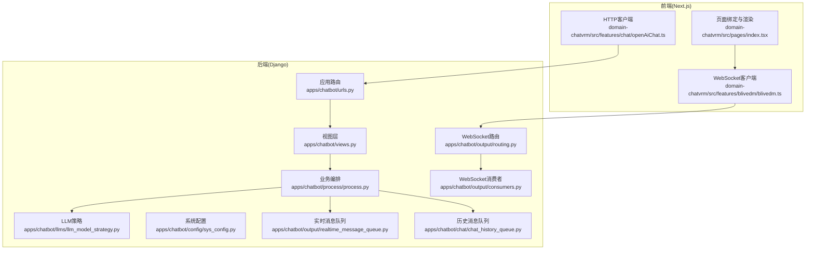
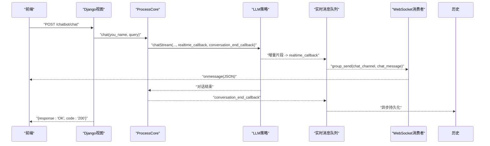
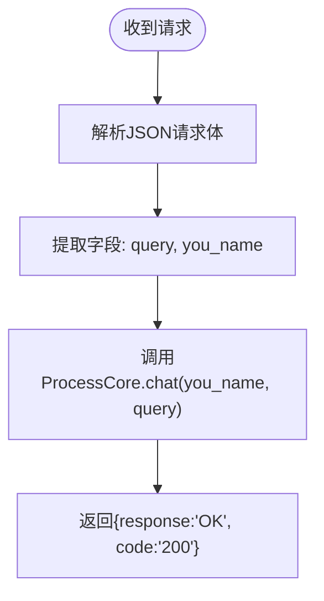
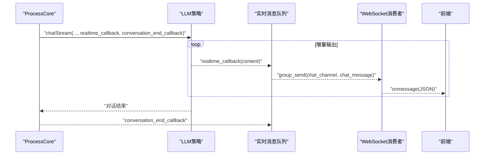
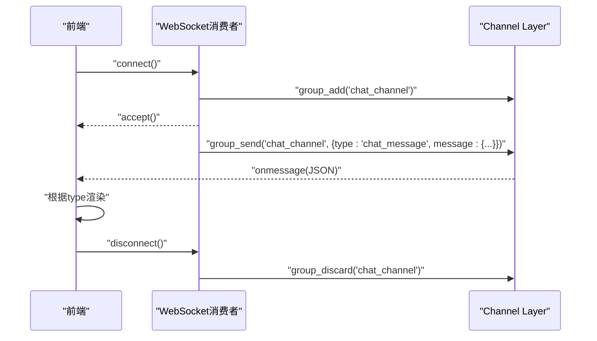
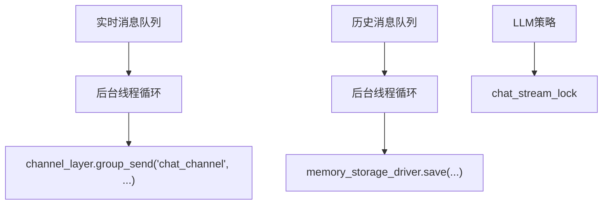
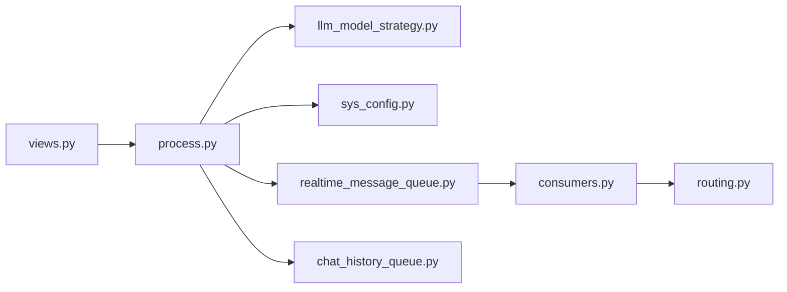

# 对话API

<cite>
**本文引用的文件**
- [domain-chatbot/apps/chatbot/urls.py](file://domain-chatbot/apps/chatbot/urls.py)
- [domain-chatbot/apps/chatbot/views.py](file://domain-chatbot/apps/chatbot/views.py)
- [domain-chatbot/VirtualWife/urls.py](file://domain-chatbot/VirtualWife/urls.py)
- [domain-chatbot/apps/chatbot/process/process.py](file://domain-chatbot/apps/chatbot/process/process.py)
- [domain-chatbot/apps/chatbot/llms/llm_model_strategy.py](file://domain-chatbot/apps/chatbot/llms/llm_model_strategy.py)
- [domain-chatbot/apps/chatbot/config/sys_config.py](file://domain-chatbot/apps/chatbot/config/sys_config.py)
- [domain-chatbot/apps/chatbot/utils/chat_message_utils.py](file://domain-chatbot/apps/chatbot/utils/chat_message_utils.py)
- [domain-chatbot/apps/chatbot/output/consumers.py](file://domain-chatbot/apps/chatbot/output/consumers.py)
- [domain-chatbot/apps/chatbot/output/routing.py](file://domain-chatbot/apps/chatbot/output/routing.py)
- [domain-chatbot/apps/chatbot/output/realtime_message_queue.py](file://domain-chatbot/apps/chatbot/output/realtime_message_queue.py)
- [domain-chatbot/apps/chatbot/chat/chat_history_queue.py](file://domain-chatbot/apps/chatbot/chat/chat_history_queue.py)
- [domain-chatvrm/src/features/chat/openAiChat.ts](file://domain-chatvrm/src/features/chat/openAiChat.ts)
- [domain-chatvrm/src/features/blivedm/blivedm.ts](file://domain-chatvrm/src/features/blivedm/blivedm.ts)
- [domain-chatvrm/src/pages/index.tsx](file://domain-chatvrm/src/pages/index.tsx)
</cite>

## 目录
1. [简介](#简介)
2. [项目结构](#项目结构)
3. [核心组件](#核心组件)
4. [架构总览](#架构总览)
5. [详细组件分析](#详细组件分析)
6. [依赖分析](#依赖分析)
7. [性能考量](#性能考量)
8. [故障排查指南](#故障排查指南)
9. [结论](#结论)
10. [附录](#附录)

## 简介
本文件为“对话API”的权威技术文档，覆盖以下内容：
- HTTP接口：POST /chatbot/api/chat 的方法、URL模式、请求/响应格式与认证方式
- 流式响应机制：基于大语言模型的增量输出与前端消费方式
- WebSocket实时交互：连接建立、消息格式、事件类型与实时展示模式
- 上下文管理：短期/长期记忆检索与对话提示词构建
- 消息队列与并发控制：后台线程、队列与锁的使用
- 错误处理与安全考虑：异常捕获、代理配置与输入净化
- 性能优化建议：线程池、缓存与资源隔离

## 项目结构
后端采用Django + Django REST Framework + Channels（WebSocket）实现；前端采用Next.js + TypeScript，通过HTTP与WebSocket与后端交互。

图表来源
- [domain-chatbot/apps/chatbot/urls.py](file://domain-chatbot/apps/chatbot/urls.py#L1-L26)
- [domain-chatbot/apps/chatbot/views.py](file://domain-chatbot/apps/chatbot/views.py#L1-L346)
- [domain-chatbot/apps/chatbot/process/process.py](file://domain-chatbot/apps/chatbot/process/process.py#L1-L77)
- [domain-chatbot/apps/chatbot/llms/llm_model_strategy.py](file://domain-chatbot/apps/chatbot/llms/llm_model_strategy.py#L1-L149)
- [domain-chatbot/apps/chatbot/config/sys_config.py](file://domain-chatbot/apps/chatbot/config/sys_config.py#L1-L208)
- [domain-chatbot/apps/chatbot/output/realtime_message_queue.py](file://domain-chatbot/apps/chatbot/output/realtime_message_queue.py#L1-L107)
- [domain-chatbot/apps/chatbot/chat/chat_history_queue.py](file://domain-chatbot/apps/chatbot/chat/chat_history_queue.py#L1-L119)
- [domain-chatbot/apps/chatbot/output/consumers.py](file://domain-chatbot/apps/chatbot/output/consumers.py#L1-L38)
- [domain-chatbot/apps/chatbot/output/routing.py](file://domain-chatbot/apps/chatbot/output/routing.py#L1-L9)
- [domain-chatvrm/src/features/chat/openAiChat.ts](file://domain-chatvrm/src/features/chat/openAiChat.ts#L1-L110)
- [domain-chatvrm/src/features/blivedm/blivedm.ts](file://domain-chatvrm/src/features/blivedm/blivedm.ts#L1-L31)
- [domain-chatvrm/src/pages/index.tsx](file://domain-chatvrm/src/pages/index.tsx#L56-L337)

章节来源
- [domain-chatbot/VirtualWife/urls.py](file://domain-chatbot/VirtualWife/urls.py#L17-L44)
- [domain-chatbot/apps/chatbot/urls.py](file://domain-chatbot/apps/chatbot/urls.py#L1-L26)

## 核心组件
- HTTP聊天接口：接收用户消息与昵称，触发对话流程，返回确认响应
- 流式对话引擎：通过LLM策略选择器调用OpenAI/Ollama/Zhipu等模型，支持增量输出回调
- 实时消息队列：将流式片段聚合为完整句段，生成表情并推送到WebSocket组
- 历史消息队列：异步持久化对话历史，支持短期/长期记忆检索
- WebSocket服务：将实时消息广播至所有订阅客户端
- 前端集成：HTTP提交消息，WebSocket接收实时消息并渲染

章节来源
- [domain-chatbot/apps/chatbot/views.py](file://domain-chatbot/apps/chatbot/views.py#L20-L31)
- [domain-chatbot/apps/chatbot/process/process.py](file://domain-chatbot/apps/chatbot/process/process.py#L33-L76)
- [domain-chatbot/apps/chatbot/llms/llm_model_strategy.py](file://domain-chatbot/apps/chatbot/llms/llm_model_strategy.py#L107-L149)
- [domain-chatbot/apps/chatbot/output/realtime_message_queue.py](file://domain-chatbot/apps/chatbot/output/realtime_message_queue.py#L49-L95)
- [domain-chatbot/apps/chatbot/chat/chat_history_queue.py](file://domain-chatbot/apps/chatbot/chat/chat_history_queue.py#L38-L106)
- [domain-chatbot/apps/chatbot/output/consumers.py](file://domain-chatbot/apps/chatbot/output/consumers.py#L10-L37)

## 架构总览
后端通过REST接口接收请求，交由ProcessCore编排，调用LLM策略进行流式生成，同时将中间片段写入实时消息队列并通过Channels广播。对话结束后，历史消息进入历史队列异步持久化。

图表来源
- [domain-chatbot/apps/chatbot/views.py](file://domain-chatbot/apps/chatbot/views.py#L20-L31)
- [domain-chatbot/apps/chatbot/process/process.py](file://domain-chatbot/apps/chatbot/process/process.py#L33-L76)
- [domain-chatbot/apps/chatbot/llms/llm_model_strategy.py](file://domain-chatbot/apps/chatbot/llms/llm_model_strategy.py#L122-L138)
- [domain-chatbot/apps/chatbot/output/realtime_message_queue.py](file://domain-chatbot/apps/chatbot/output/realtime_message_queue.py#L54-L95)
- [domain-chatbot/apps/chatbot/output/consumers.py](file://domain-chatbot/apps/chatbot/output/consumers.py#L33-L37)

## 详细组件分析

### HTTP接口：POST /chatbot/chat
- 方法与URL
  - 方法：POST
  - URL：/chatbot/chat
  - 基础路径：/chatbot/ 由根路由包含
- 请求体
  - 字段：
    - query: 用户消息文本
    - you_name: 用户昵称
  - 编码：UTF-8 JSON
- 响应体
  - 字段：
    - response: 固定字符串“OK”
    - code: HTTP状态码字符串“200”
- 认证
  - 当前实现未显式校验认证头；如需保护可扩展DRF权限类或中间件
- 处理流程
  - 解析JSON -> 提取字段 -> 调用ProcessCore.chat(you_name, query) -> 返回固定响应

图表来源
- [domain-chatbot/apps/chatbot/views.py](file://domain-chatbot/apps/chatbot/views.py#L20-L31)

章节来源
- [domain-chatbot/apps/chatbot/views.py](file://domain-chatbot/apps/chatbot/views.py#L20-L31)
- [domain-chatbot/VirtualWife/urls.py](file://domain-chatbot/VirtualWife/urls.py#L35-L41)
- [domain-chatbot/apps/chatbot/urls.py](file://domain-chatbot/apps/chatbot/urls.py#L5-L6)

### 流式响应机制
- 触发点
  - ProcessCore.chat内部调用LLM策略的chatStream方法
- 回调链
  - realtime_callback：接收增量片段，按句号/换行/长度阈值聚合，清洗文本，生成表情，封装为RealtimeMessage并入队
  - conversation_end_callback：对话结束时将最终对话写入历史队列
- 前端消费
  - 前端通过HTTP提交消息，随后通过WebSocket接收实时消息
  - 前端示例中展示了如何解析消息类型并渲染不同内容

图表来源
- [domain-chatbot/apps/chatbot/process/process.py](file://domain-chatbot/apps/chatbot/process/process.py#L62-L70)
- [domain-chatbot/apps/chatbot/output/realtime_message_queue.py](file://domain-chatbot/apps/chatbot/output/realtime_message_queue.py#L70-L95)
- [domain-chatbot/apps/chatbot/chat/chat_history_queue.py](file://domain-chatbot/apps/chatbot/chat/chat_history_queue.py#L99-L106)

章节来源
- [domain-chatbot/apps/chatbot/process/process.py](file://domain-chatbot/apps/chatbot/process/process.py#L33-L76)
- [domain-chatbot/apps/chatbot/llms/llm_model_strategy.py](file://domain-chatbot/apps/chatbot/llms/llm_model_strategy.py#L122-L138)
- [domain-chatbot/apps/chatbot/output/realtime_message_queue.py](file://domain-chatbot/apps/chatbot/output/realtime_message_queue.py#L70-L95)
- [domain-chatvrm/src/features/chat/openAiChat.ts](file://domain-chatvrm/src/features/chat/openAiChat.ts#L90-L110)

### WebSocket连接与实时消息
- 连接建立
  - 前端通过blivedm.ts连接ws://<host>/api/chatbot/ws/
  - 消费者接受连接并将客户端加入chat_channel组
- 消息格式
  - 服务器向组内广播的消息结构：
    - type: chat_message
    - message: 包含字段
      - type: 消息类型（如"user","behavior_action","danmaku","welcome")
      - user_name: 用户昵称
      - content: 文本内容
      - emote: 表情
      - action: 动作（可选）
      - expand: 扩展（可选）
- 事件类型
  - user：普通用户消息
  - behavior_action：行为动作
  - danmaku：弹幕风格消息
  - welcome：欢迎消息
- 前端渲染
  - 页面监听onmessage，根据type分派到不同处理器

图表来源
- [domain-chatbot/apps/chatbot/output/consumers.py](file://domain-chatbot/apps/chatbot/output/consumers.py#L12-L37)
- [domain-chatbot/apps/chatbot/output/routing.py](file://domain-chatbot/apps/chatbot/output/routing.py#L6-L8)
- [domain-chatbot/apps/chatbot/output/realtime_message_queue.py](file://domain-chatbot/apps/chatbot/output/realtime_message_queue.py#L54-L68)
- [domain-chatvrm/src/features/blivedm/blivedm.ts](file://domain-chatvrm/src/features/blivedm/blivedm.ts#L15-L31)
- [domain-chatvrm/src/pages/index.tsx](file://domain-chatvrm/src/pages/index.tsx#L296-L324)

章节来源
- [domain-chatbot/apps/chatbot/output/consumers.py](file://domain-chatbot/apps/chatbot/output/consumers.py#L10-L37)
- [domain-chatbot/apps/chatbot/output/routing.py](file://domain-chatbot/apps/chatbot/output/routing.py#L6-L8)
- [domain-chatbot/apps/chatbot/output/realtime_message_queue.py](file://domain-chatbot/apps/chatbot/output/realtime_message_queue.py#L38-L46)
- [domain-chatvrm/src/features/blivedm/blivedm.ts](file://domain-chatvrm/src/features/blivedm/blivedm.ts#L15-L31)
- [domain-chatvrm/src/pages/index.tsx](file://domain-chatvrm/src/pages/index.tsx#L296-L324)

### 对话上下文管理与消息队列
- 上下文管理
  - ProcessCore在生成prompt时，结合角色模板、短期记忆、长期记忆与当前时间
  - 支持从角色安装包动态注入对话示例
- 消息队列
  - 实时消息队列：SimpleQueue + 后台线程循环，将消息推送到chat_channel
  - 历史消息队列：SimpleQueue + 后台线程循环，异步持久化对话历史
- 并发控制
  - LLM策略持有chat_stream_lock，确保同一时间仅有一个流式对话在运行
  - 后台线程均设为守护线程，随主进程退出而终止

图表来源
- [domain-chatbot/apps/chatbot/output/realtime_message_queue.py](file://domain-chatbot/apps/chatbot/output/realtime_message_queue.py#L54-L68)
- [domain-chatbot/apps/chatbot/chat/chat_history_queue.py](file://domain-chatbot/apps/chatbot/chat/chat_history_queue.py#L42-L51)
- [domain-chatbot/apps/chatbot/llms/llm_model_strategy.py](file://domain-chatbot/apps/chatbot/llms/llm_model_strategy.py#L113-L113)

章节来源
- [domain-chatbot/apps/chatbot/process/process.py](file://domain-chatbot/apps/chatbot/process/process.py#L33-L76)
- [domain-chatbot/apps/chatbot/output/realtime_message_queue.py](file://domain-chatbot/apps/chatbot/output/realtime_message_queue.py#L97-L107)
- [domain-chatbot/apps/chatbot/chat/chat_history_queue.py](file://domain-chatbot/apps/chatbot/chat/chat_history_queue.py#L109-L119)
- [domain-chatbot/apps/chatbot/llms/llm_model_strategy.py](file://domain-chatbot/apps/chatbot/llms/llm_model_strategy.py#L113-L113)

### 安全与错误处理
- 输入净化
  - 使用工具函数去除特殊字符、表情符号与多余标记，降低TTS合成失败风险
- 异常兜底
  - 流式对话异常时，向实时回调发送预设错误消息
- 代理与环境变量
  - 通过系统配置加载OPENAI_BASE_URL、OLLAMA_API_BASE、ZHIPUAI_API_KEY等
  - 可配置HTTP/HTTPS/SOCKS5代理
- 认证
  - 当前未实现鉴权；如需可扩展DRF权限类或中间件

章节来源
- [domain-chatbot/apps/chatbot/utils/chat_message_utils.py](file://domain-chatbot/apps/chatbot/utils/chat_message_utils.py#L4-L27)
- [domain-chatbot/apps/chatbot/process/process.py](file://domain-chatbot/apps/chatbot/process/process.py#L71-L76)
- [domain-chatbot/apps/chatbot/config/sys_config.py](file://domain-chatbot/apps/chatbot/config/sys_config.py#L122-L151)

## 依赖分析
- 组件耦合
  - views依赖process，process依赖llm策略与系统配置，llm策略依赖具体模型实现
  - 实时消息与历史消息通过队列解耦，避免阻塞主线程
- 外部依赖
  - Channels用于WebSocket广播
  - LLM提供商（OpenAI/Ollama/Zhipu）通过环境变量配置
- 循环依赖
  - 未发现直接循环导入；各模块职责清晰

图表来源
- [domain-chatbot/apps/chatbot/views.py](file://domain-chatbot/apps/chatbot/views.py#L1-L346)
- [domain-chatbot/apps/chatbot/process/process.py](file://domain-chatbot/apps/chatbot/process/process.py#L1-L77)
- [domain-chatbot/apps/chatbot/llms/llm_model_strategy.py](file://domain-chatbot/apps/chatbot/llms/llm_model_strategy.py#L1-L149)
- [domain-chatbot/apps/chatbot/config/sys_config.py](file://domain-chatbot/apps/chatbot/config/sys_config.py#L1-L208)
- [domain-chatbot/apps/chatbot/output/realtime_message_queue.py](file://domain-chatbot/apps/chatbot/output/realtime_message_queue.py#L1-L107)
- [domain-chatbot/apps/chatbot/chat/chat_history_queue.py](file://domain-chatbot/apps/chatbot/chat/chat_history_queue.py#L1-L119)
- [domain-chatbot/apps/chatbot/output/consumers.py](file://domain-chatbot/apps/chatbot/output/consumers.py#L1-L38)
- [domain-chatbot/apps/chatbot/output/routing.py](file://domain-chatbot/apps/chatbot/output/routing.py#L1-L9)

章节来源
- [domain-chatbot/apps/chatbot/urls.py](file://domain-chatbot/apps/chatbot/urls.py#L5-L6)
- [domain-chatbot/VirtualWife/urls.py](file://domain-chatbot/VirtualWife/urls.py#L35-L41)

## 性能考量
- 流式输出
  - 使用chatStream异步增量返回，减少首字延迟
- 线程与锁
  - 单流式对话加锁，避免并发冲突；后台线程守护，保证消息可靠投递
- 内存与I/O
  - 实时/历史队列采用SimpleQueue，避免复杂锁竞争
- LLM配置
  - 通过环境变量切换模型与代理，便于横向扩展与容灾

[本节为通用指导，无需列出章节来源]

## 故障排查指南
- HTTP 200但无实时消息
  - 检查WebSocket是否成功连接与加入chat_channel
  - 确认实时消息队列后台线程已启动
- 实时消息乱码或表情异常
  - 检查文本清洗逻辑与表情生成是否正常
- 对话异常中断
  - 查看后端日志中的异常堆栈，确认LLM策略可用性与网络代理配置
- 前端无法连接WebSocket
  - 核对前端blivedm.ts中的ws地址与路由配置

章节来源
- [domain-chatbot/apps/chatbot/output/consumers.py](file://domain-chatbot/apps/chatbot/output/consumers.py#L12-L18)
- [domain-chatbot/apps/chatbot/output/realtime_message_queue.py](file://domain-chatbot/apps/chatbot/output/realtime_message_queue.py#L102-L106)
- [domain-chatbot/apps/chatbot/process/process.py](file://domain-chatbot/apps/chatbot/process/process.py#L71-L76)
- [domain-chatvrm/src/features/blivedm/blivedm.ts](file://domain-chatvrm/src/features/blivedm/blivedm.ts#L15-L31)

## 结论
该对话API以清晰的分层设计实现了从HTTP请求到流式LLM生成再到WebSocket实时推送的完整闭环。通过队列与锁保障了高并发下的稳定性，通过配置中心灵活适配多模型与代理。建议后续增强鉴权与可观测性，以满足生产环境的安全与运维需求。

[本节为总结性内容，无需列出章节来源]

## 附录

### 接口清单与示例

- HTTP接口
  - 方法：POST
  - URL：/chatbot/chat
  - 请求体
    - query: 用户消息文本
    - you_name: 用户昵称
  - 响应体
    - response: “OK”
    - code: “200”

- WebSocket
  - URL：ws://<host>/api/chatbot/ws/
  - 消息格式
    - type: “chat_message”
    - message.type: “user” | “behavior_action” | “danmaku” | “welcome”
    - message.user_name: 昵称
    - message.content: 文本
    - message.emote: 表情
    - message.action: 动作（可选）
    - message.expand: 扩展（可选）

- 前端调用参考
  - HTTP提交消息：见domain-chatvrm/src/features/chat/openAiChat.ts
  - WebSocket连接与消息处理：见domain-chatvrm/src/features/blivedm/blivedm.ts与domain-chatvrm/src/pages/index.tsx

章节来源
- [domain-chatbot/apps/chatbot/views.py](file://domain-chatbot/apps/chatbot/views.py#L20-L31)
- [domain-chatbot/apps/chatbot/output/consumers.py](file://domain-chatbot/apps/chatbot/output/consumers.py#L33-L37)
- [domain-chatvrm/src/features/chat/openAiChat.ts](file://domain-chatvrm/src/features/chat/openAiChat.ts#L90-L110)
- [domain-chatvrm/src/features/blivedm/blivedm.ts](file://domain-chatvrm/src/features/blivedm/blivedm.ts#L15-L31)
- [domain-chatvrm/src/pages/index.tsx](file://domain-chatvrm/src/pages/index.tsx#L296-L324)