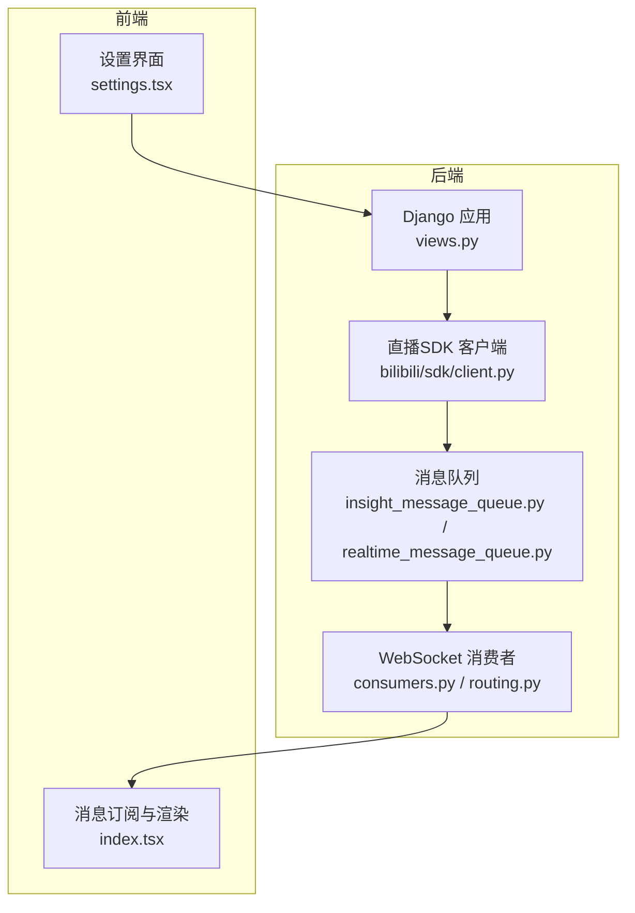
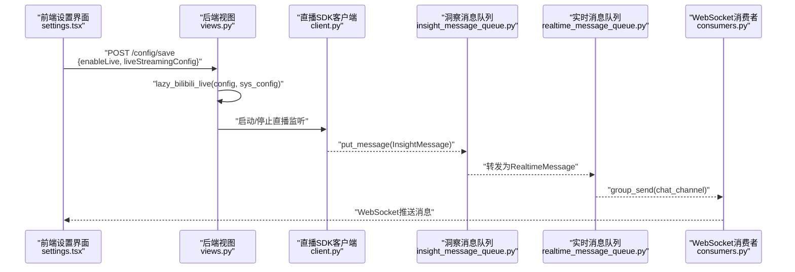
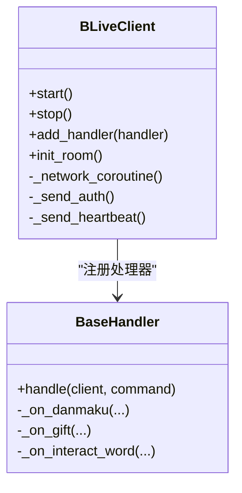
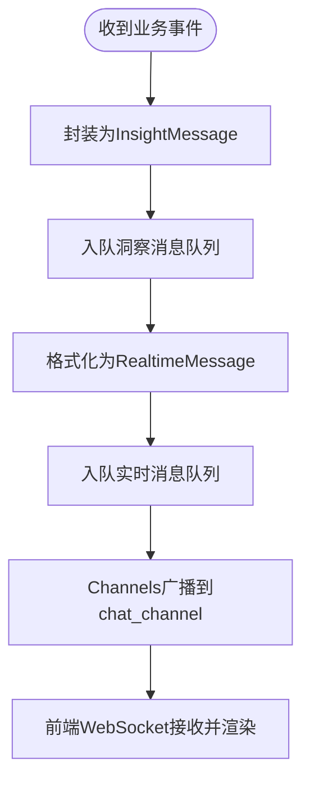
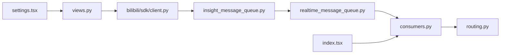

# 直播集成API

<cite>
**本文档引用的文件**
- [bili_live_client.py](file://domain-chatbot/apps/chatbot/insight/bilibili/bili_live_client.py)
- [client.py](file://domain-chatbot/apps/chatbot/insight/bilibili/sdk/client.py)
- [handlers.py](file://domain-chatbot/apps/chatbot/insight/bilibili/sdk/handlers.py)
- [models.py](file://domain-chatbot/apps/chatbot/insight/bilibili/sdk/models.py)
- [bili_live_client.py](file://domain-chatbot/apps/chatbot/insight/bilibili_api/bili_live_client.py)
- [insight_message_queue.py](file://domain-chatbot/apps/chatbot/insight/insight_message_queue.py)
- [realtime_message_queue.py](file://domain-chatbot/apps/chatbot/output/realtime_message_queue.py)
- [consumers.py](file://domain-chatbot/apps/chatbot/output/consumers.py)
- [routing.py](file://domain-chatbot/apps/chatbot/output/routing.py)
- [views.py](file://domain-chatbot/apps/chatbot/views.py)
- [urls.py](file://domain-chatbot/apps/chatbot/urls.py)
- [sys_config.py](file://domain-chatbot/apps/chatbot/config/sys_config.py)
- [sys_config.json](file://domain-chatbot/apps/chatbot/config/sys_config.json)
- [settings.tsx](file://domain-chatvrm/src/components/settings.tsx)
- [index.tsx](file://domain-chatvrm/src/pages/index.tsx)
</cite>

## 目录
1. [简介](#简介)
2. [项目结构](#项目结构)
3. [核心组件](#核心组件)
4. [架构总览](#架构总览)
5. [详细组件分析](#详细组件分析)
6. [依赖关系分析](#依赖关系分析)
7. [性能考虑](#性能考虑)
8. [故障排查指南](#故障排查指南)
9. [结论](#结论)
10. [附录](#附录)

## 简介
本文件为“直播集成API”的技术文档，覆盖以下目标：
- 记录直播相关接口的HTTP方法、URL模式、请求/响应模式和认证方法
- 详细说明直播弹幕监听接口的实现，包括B站直播连接、弹幕解析、实时消息推送机制
- 文档化直播配置管理接口，包括直播房间设置、弹幕过滤规则、互动触发条件
- 记录实时消息队列处理机制和消息格式规范
- 提供直播集成的完整使用示例，包括连接建立、消息订阅、断线重连处理
- 说明直播数据的存储、缓存和转发机制，以及性能优化和错误处理策略

## 项目结构
直播集成涉及后端Python服务与前端Web应用两部分：
- 后端（Django + Channels）：负责直播配置管理、弹幕监听、消息队列与WebSocket推送
- 前端（Next.js）：负责订阅WebSocket消息、渲染弹幕与角色动作

图表来源
- [views.py](file://domain-chatbot/apps/chatbot/views.py#L34-L60)
- [client.py](file://domain-chatbot/apps/chatbot/insight/bilibili/sdk/client.py#L386-L428)
- [insight_message_queue.py](file://domain-chatbot/apps/chatbot/insight/insight_message_queue.py#L47-L70)
- [realtime_message_queue.py](file://domain-chatbot/apps/chatbot/output/realtime_message_queue.py#L49-L68)
- [consumers.py](file://domain-chatbot/apps/chatbot/output/consumers.py#L10-L37)
- [routing.py](file://domain-chatbot/apps/chatbot/output/routing.py#L6-L8)
- [settings.tsx](file://domain-chatvrm/src/components/settings.tsx#L744-L787)
- [index.tsx](file://domain-chatvrm/src/pages/index.tsx#L296-L337)

章节来源
- [views.py](file://domain-chatbot/apps/chatbot/views.py#L34-L60)
- [urls.py](file://domain-chatbot/apps/chatbot/urls.py#L1-L26)

## 核心组件
- 配置管理接口
  - GET /config/get：获取系统配置
  - POST /config/save：保存系统配置，并按配置动态启用/停用直播监听
- 直播监听组件
  - B站直播SDK客户端：基于WebSocket的弹幕/礼物/互动事件监听
  - 消息处理器：将业务事件转为统一消息结构并入队
- 实时消息队列
  - 弹幕洞察队列：将弹幕事件转化为实时消息并投递至WebSocket通道
  - WebSocket通道：通过Channels向前端推送消息
- 前端订阅
  - 设置界面：开启/关闭直播监听、填写房间ID与Cookie
  - 消息订阅：建立WebSocket连接，接收并渲染弹幕与角色动作

章节来源
- [views.py](file://domain-chatbot/apps/chatbot/views.py#L34-L60)
- [client.py](file://domain-chatbot/apps/chatbot/insight/bilibili/sdk/client.py#L87-L208)
- [handlers.py](file://domain-chatbot/apps/chatbot/insight/bilibili/sdk/handlers.py#L45-L140)
- [insight_message_queue.py](file://domain-chatbot/apps/chatbot/insight/insight_message_queue.py#L14-L70)
- [realtime_message_queue.py](file://domain-chatbot/apps/chatbot/output/realtime_message_queue.py#L21-L95)
- [consumers.py](file://domain-chatbot/apps/chatbot/output/consumers.py#L10-L37)
- [settings.tsx](file://domain-chatvrm/src/components/settings.tsx#L744-L787)
- [index.tsx](file://domain-chatvrm/src/pages/index.tsx#L296-L337)

## 架构总览
直播集成的端到端流程如下：

图表来源
- [views.py](file://domain-chatbot/apps/chatbot/views.py#L34-L60)
- [client.py](file://domain-chatbot/apps/chatbot/insight/bilibili/sdk/client.py#L386-L428)
- [insight_message_queue.py](file://domain-chatbot/apps/chatbot/insight/insight_message_queue.py#L47-L70)
- [realtime_message_queue.py](file://domain-chatbot/apps/chatbot/output/realtime_message_queue.py#L49-L68)
- [consumers.py](file://domain-chatbot/apps/chatbot/output/consumers.py#L33-L37)
- [settings.tsx](file://domain-chatvrm/src/components/settings.tsx#L744-L787)

## 详细组件分析

### 配置管理接口
- GET /config/get
  - 功能：获取当前系统配置（含直播开关、房间ID、Cookie等）
  - 返回：包含配置对象的JSON
- POST /config/save
  - 功能：保存配置并根据配置动态启用/停用直播监听
  - 请求体：包含完整配置对象
  - 行为：保存后调用直播懒加载函数，按需启动或关闭监听

章节来源
- [views.py](file://domain-chatbot/apps/chatbot/views.py#L34-L60)
- [urls.py](file://domain-chatbot/apps/chatbot/urls.py#L15-L16)
- [sys_config.py](file://domain-chatbot/apps/chatbot/config/sys_config.py#L57-L76)
- [sys_config.json](file://domain-chatbot/apps/chatbot/config/sys_config.json#L1-L60)

### 直播弹幕监听实现
- B站直播SDK客户端
  - 初始化：读取环境变量中的房间ID、UID、Cookie，建立WebSocket连接
  - 认证与心跳：发送认证包，周期性发送心跳包维持连接
  - 断线重连：异常/超时自动重连，必要时重新获取房间与服务器配置
- 消息处理器
  - 将不同业务事件（弹幕、礼物、互动等）映射为统一消息结构
  - 入队至洞察消息队列，后续由实时队列转发并推送

图表来源
- [client.py](file://domain-chatbot/apps/chatbot/insight/bilibili/sdk/client.py#L87-L208)
- [handlers.py](file://domain-chatbot/apps/chatbot/insight/bilibili/sdk/handlers.py#L45-L140)

章节来源
- [client.py](file://domain-chatbot/apps/chatbot/insight/bilibili/sdk/client.py#L250-L428)
- [handlers.py](file://domain-chatbot/apps/chatbot/insight/bilibili/sdk/handlers.py#L89-L122)

### 实时消息队列与推送机制
- 洞察消息队列
  - 统一消息结构：包含类型、用户信息、内容、表情、动作等
  - 弹幕事件：将弹幕内容格式化后投递至实时消息队列
- 实时消息队列
  - 通过Channels将消息广播到指定组（chat_channel）
  - 前端消费者订阅该组，接收并渲染
- 消息格式规范
  - 弹幕/欢迎/用户消息：type=user；弹幕事件：type=danmaku
  - 字段：type、user_name、content、emote、action、expand、is_recite

图表来源
- [insight_message_queue.py](file://domain-chatbot/apps/chatbot/insight/insight_message_queue.py#L47-L70)
- [realtime_message_queue.py](file://domain-chatbot/apps/chatbot/output/realtime_message_queue.py#L49-L68)
- [consumers.py](file://domain-chatbot/apps/chatbot/output/consumers.py#L33-L37)

章节来源
- [insight_message_queue.py](file://domain-chatbot/apps/chatbot/insight/insight_message_queue.py#L14-L70)
- [realtime_message_queue.py](file://domain-chatbot/apps/chatbot/output/realtime_message_queue.py#L21-L95)
- [consumers.py](file://domain-chatbot/apps/chatbot/output/consumers.py#L10-L37)
- [routing.py](file://domain-chatbot/apps/chatbot/output/routing.py#L6-L8)

### 前端订阅与渲染
- 设置界面
  - 支持开启/关闭直播监听，输入房间ID与Cookie
  - 保存配置后触发后端懒加载逻辑
- 消息订阅
  - 建立WebSocket连接，订阅chat_channel
  - 根据消息类型渲染弹幕、表情与角色动作

章节来源
- [settings.tsx](file://domain-chatvrm/src/components/settings.tsx#L744-L787)
- [index.tsx](file://domain-chatvrm/src/pages/index.tsx#L296-L337)

## 依赖关系分析
- 后端依赖
  - Django路由与视图：提供配置管理接口
  - bilibili-api（或blivedm）：负责B站直播连接与事件解析
  - Channels：提供WebSocket广播能力
- 前端依赖
  - Next.js页面与组件：负责UI交互与消息渲染
  - WebSocket客户端：订阅后端推送

图表来源
- [views.py](file://domain-chatbot/apps/chatbot/views.py#L34-L60)
- [client.py](file://domain-chatbot/apps/chatbot/insight/bilibili/sdk/client.py#L386-L428)
- [insight_message_queue.py](file://domain-chatbot/apps/chatbot/insight/insight_message_queue.py#L47-L70)
- [realtime_message_queue.py](file://domain-chatbot/apps/chatbot/output/realtime_message_queue.py#L49-L68)
- [consumers.py](file://domain-chatbot/apps/chatbot/output/consumers.py#L10-L37)
- [routing.py](file://domain-chatbot/apps/chatbot/output/routing.py#L6-L8)
- [settings.tsx](file://domain-chatvrm/src/components/settings.tsx#L744-L787)
- [index.tsx](file://domain-chatvrm/src/pages/index.tsx#L296-L337)

章节来源
- [urls.py](file://domain-chatbot/apps/chatbot/urls.py#L1-L26)
- [sys_config.py](file://domain-chatbot/apps/chatbot/config/sys_config.py#L57-L76)

## 性能考虑
- 连接与重连
  - SDK内置断线重连与认证失败重试逻辑，降低连接抖动对稳定性的影响
- 队列与并发
  - 使用线程安全队列与后台线程处理消息，避免阻塞主事件循环
- 压缩与解压
  - 对压缩消息采用异步解压，减少网络线程阻塞
- 前端渲染
  - 前端按消息类型进行差异化渲染，避免重复渲染与闪烁

章节来源
- [client.py](file://domain-chatbot/apps/chatbot/insight/bilibili/sdk/client.py#L40-L46)
- [client.py](file://domain-chatbot/apps/chatbot/insight/bilibili/sdk/client.py#L563-L567)
- [realtime_message_queue.py](file://domain-chatbot/apps/chatbot/output/realtime_message_queue.py#L97-L106)

## 故障排查指南
- 配置问题
  - 确认配置项enableLive为true且liveStreamingConfig包含有效房间ID与Cookie
  - 通过GET /config/get核对当前配置
- 连接问题
  - 查看后端日志中“Start/Stop BLiveClient Success”与重连日志
  - 若出现认证失败，检查Cookie有效性与过期时间
- 消息不推送
  - 确认实时消息队列后台线程已启动
  - 检查WebSocket消费者是否加入chat_channel
- 前端无弹幕
  - 确认WebSocket连接成功并订阅chat_channel
  - 检查前端消息类型分支与渲染逻辑

章节来源
- [views.py](file://domain-chatbot/apps/chatbot/views.py#L34-L60)
- [client.py](file://domain-chatbot/apps/chatbot/insight/bilibili/sdk/client.py#L410-L428)
- [insight_message_queue.py](file://domain-chatbot/apps/chatbot/insight/insight_message_queue.py#L77-L82)
- [consumers.py](file://domain-chatbot/apps/chatbot/output/consumers.py#L12-L18)
- [index.tsx](file://domain-chatvrm/src/pages/index.tsx#L296-L337)

## 结论
本直播集成方案通过后端配置管理、SDK监听、消息队列与WebSocket推送形成闭环，前端负责订阅与渲染。整体具备断线重连、消息格式标准化与前后端解耦的特点，适合在多场景下扩展弹幕过滤、互动触发与角色行为联动。

## 附录

### API定义与使用示例

- 获取配置
  - 方法：GET
  - URL：/config/get
  - 成功响应：包含配置对象的JSON
- 保存配置并启用直播监听
  - 方法：POST
  - URL：/config/save
  - 请求体：包含完整配置对象
  - 行为：保存配置后按配置启动/停止直播监听
- 前端设置与订阅
  - 设置界面：开启/关闭直播监听，填写房间ID与Cookie
  - 订阅：建立WebSocket连接，订阅chat_channel，接收并渲染弹幕与动作

章节来源
- [urls.py](file://domain-chatbot/apps/chatbot/urls.py#L15-L16)
- [views.py](file://domain-chatbot/apps/chatbot/views.py#L34-L60)
- [settings.tsx](file://domain-chatvrm/src/components/settings.tsx#L744-L787)
- [index.tsx](file://domain-chatvrm/src/pages/index.tsx#L296-L337)