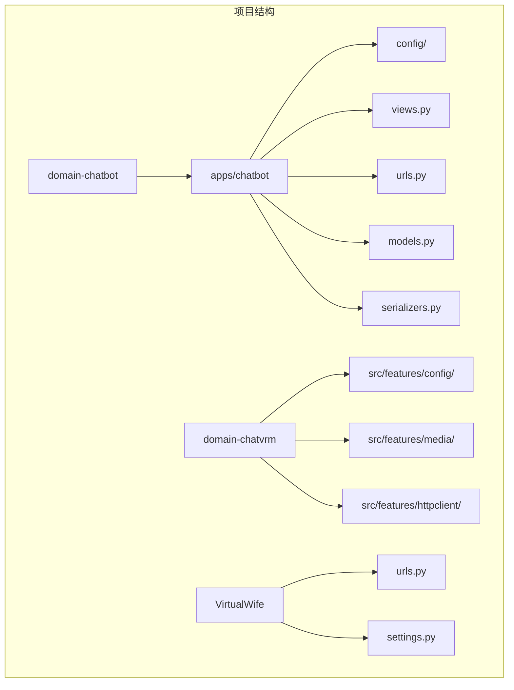
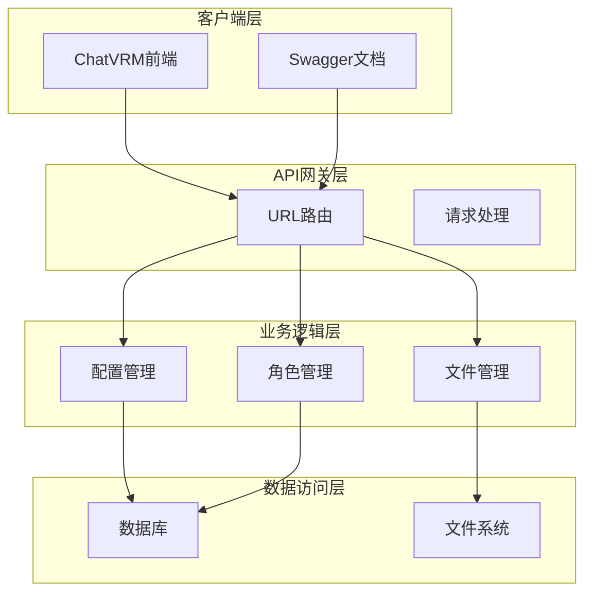
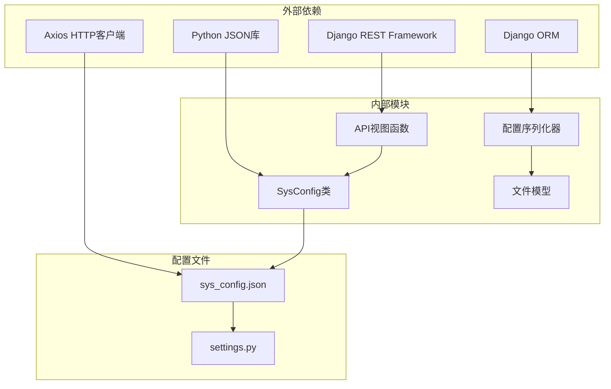

# 系统配置API

<cite>
**本文档引用的文件**
- [urls.py](file://domain-chatbot/apps/chatbot/urls.py)
- [views.py](file://domain-chatbot/apps/chatbot/views.py)
- [sys_config.py](file://domain-chatbot/apps/chatbot/config/sys_config.py)
- [sys_config.json](file://domain-chatbot/apps/chatbot/config/sys_config.json)
- [serializers.py](file://domain-chatbot/apps/chatbot/serializers.py)
- [models.py](file://domain-chatbot/apps/chatbot/models.py)
- [settings.py](file://domain-chatbot/VirtualWife/settings.py)
- [urls.py](file://domain-chatbot/VirtualWife/urls.py)
- [configApi.ts](file://domain-chatvrm/src/features/config/configApi.ts)
- [mediaApi.ts](file://domain-chatvrm/src/features/media/mediaApi.ts)
- [httpclient.ts](file://domain-chatvrm/src/features/httpclient/httpclient.ts)
- [buildUrl.ts](file://domain-chatvrm/src/utils/buildUrl.ts)
</cite>

## 目录
1. [简介](#简介)
2. [项目结构](#项目结构)
3. [核心组件](#核心组件)
4. [架构概览](#架构概览)
5. [详细组件分析](#详细组件分析)
6. [依赖关系分析](#依赖关系分析)
7. [性能考虑](#性能考虑)
8. [故障排除指南](#故障排除指南)
9. [结论](#结论)

## 简介

系统配置API是VirtualWife虚拟伴侣系统的核心配置管理接口，提供了完整的配置获取、保存、背景图片管理和VRM模型管理功能。该API基于Django REST Framework构建，支持多种配置场景，包括语言模型配置、记忆存储配置、角色配置等。

## 项目结构

VirtualWife项目采用多应用架构，系统配置API位于chatbot应用中，通过统一的URL路由进行管理。



**图表来源**
- [urls.py](file://domain-chatbot/apps/chatbot/urls.py#L1-L26)
- [urls.py](file://domain-chatbot/VirtualWife/urls.py#L1-L44)

**章节来源**
- [urls.py](file://domain-chatbot/apps/chatbot/urls.py#L1-L26)
- [urls.py](file://domain-chatbot/VirtualWife/urls.py#L1-L44)

## 核心组件

系统配置API包含以下核心组件：

### 配置管理组件
- **SysConfig类**：负责系统配置的加载、保存和管理
- **SysConfigModel**：数据库模型，存储配置数据
- **配置序列化器**：处理配置数据的序列化和验证

### 文件管理组件
- **BackgroundImageModel**：背景图片模型
- **VrmModel**：VRM模型模型
- **RolePackageModel**：角色包模型

### API视图组件
- **配置获取视图**：提供系统配置查询功能
- **配置保存视图**：处理配置更新逻辑
- **文件上传视图**：支持背景图片和VRM模型上传
- **文件删除视图**：管理文件的删除操作

**章节来源**
- [sys_config.py](file://domain-chatbot/apps/chatbot/config/sys_config.py#L32-L82)
- [models.py](file://domain-chatbot/apps/chatbot/models.py#L39-L92)
- [views.py](file://domain-chatbot/apps/chatbot/views.py#L34-L346)

## 架构概览

系统采用分层架构设计，确保配置管理的可扩展性和可维护性。



**图表来源**
- [urls.py](file://domain-chatbot/VirtualWife/urls.py#L35-L41)
- [views.py](file://domain-chatbot/apps/chatbot/views.py#L1-L346)

## 详细组件分析

### 配置获取接口

#### 接口定义
- **HTTP方法**：GET
- **URL模式**：`/chatbot/api/config/get`
- **功能**：获取当前系统配置

#### 请求参数
无请求参数

#### 响应格式
```json
{
  "response": {
    "liveStreamingConfig": {
      "B_ROOM_ID": "27892212",
      "B_COOKIE": ""
    },
    "enableProxy": false,
    "enableLive": false,
    "httpProxy": "http://host.docker.internal:23457",
    "httpsProxy": "https://host.docker.internal:23457",
    "socks5Proxy": "socks5://host.docker.internal:23457",
    "languageModelConfig": {
      "openai": {
        "OPENAI_API_KEY": "sk-",
        "OPENAI_BASE_URL": ""
      },
      "ollama": {
        "OLLAMA_API_BASE": "http://localhost:11434",
        "OLLAMA_API_MODEL_NAME": "qwen:7b"
      },
      "zhipuai": {
        "ZHIPUAI_API_KEY": "SK"
      }
    },
    "characterConfig": {
      "character": 1,
      "character_name": "爱莉",
      "yourName": "yuki129",
      "vrmModel": "わたあめ_03.vrm",
      "vrmModelType": "system"
    },
    "conversationConfig": {
      "conversationType": "default",
      "languageModel": "openai"
    },
    "memoryStorageConfig": {
      "milvusMemory": {
        "host": "127.0.0.1",
        "port": "19530",
        "user": "user",
        "password": "Milvus",
        "dbName": "default"
      },
      "zep_memory": {
        "zep_url": "http://localhost:8881",
        "zep_optional_api_key": "optional_api_key"
      },
      "enableLongMemory": false,
      "enableSummary": false,
      "languageModelForSummary": "openai",
      "enableReflection": false,
      "languageModelForReflection": "openai"
    },
    "custom_role_template_type": "zh",
    "background_id": 1,
    "background_url": "",
    "ttsConfig": {
      "ttsType": "Edge",
      "ttsVoiceId": "zh-CN-XiaoyiNeural"
    }
  },
  "code": "200"
}
```

#### 认证方法
- **无认证**：该接口无需特殊认证即可访问

**章节来源**
- [views.py](file://domain-chatbot/apps/chatbot/views.py#L53-L61)
- [sys_config.py](file://domain-chatbot/apps/chatbot/config/sys_config.py#L57-L76)
- [sys_config.json](file://domain-chatbot/apps/chatbot/config/sys_config.json#L1-L60)

### 配置保存接口

#### 接口定义
- **HTTP方法**：POST
- **URL模式**：`/chatbot/api/config/save`
- **功能**：保存系统配置并重新加载

#### 请求格式
```json
{
  "config": {
    "languageModelConfig": {
      "openai": {
        "OPENAI_API_KEY": "your-api-key",
        "OPENAI_BASE_URL": "https://api.openai.com"
      }
    },
    "characterConfig": {
      "character": 1,
      "character_name": "新角色",
      "yourName": "用户名"
    }
  }
}
```

#### 验证规则
- **必需字段**：`config`对象必须包含有效的配置数据
- **数据类型**：配置数据必须为JSON格式
- **字段验证**：配置字段必须符合预定义的数据结构

#### 响应格式
```json
{
  "response": {
    "languageModelConfig": {
      "openai": {
        "OPENAI_API_KEY": "your-api-key",
        "OPENAI_BASE_URL": "https://api.openai.com"
      }
    },
    "characterConfig": {
      "character": 1,
      "character_name": "新角色",
      "yourName": "用户名"
    }
  },
  "code": "200"
}
```

#### 认证方法
- **无认证**：该接口无需特殊认证即可访问

**章节来源**
- [views.py](file://domain-chatbot/apps/chatbot/views.py#L34-L50)
- [serializers.py](file://domain-chatbot/apps/chatbot/serializers.py#L19-L25)

### 背景图片管理接口

#### 上传接口
- **HTTP方法**：POST
- **URL模式**：`/chatbot/api/config/background/upload`
- **功能**：上传背景图片文件

##### 请求格式
- **Content-Type**：`multipart/form-data`
- **表单字段**：
  - `image`：图片文件（必需）

##### 响应格式
```json
{
  "response": "ok",
  "code": "200"
}
```

#### 删除接口
- **HTTP方法**：POST
- **URL模式**：`/chatbot/api/config/background/delete/{id}`
- **功能**：删除指定的背景图片

##### 请求参数
- **路径参数**：`id`（整数类型，背景图片ID）

##### 响应格式
```json
{
  "response": "ok",
  "code": "200"
}
```

#### 显示接口
- **HTTP方法**：GET
- **URL模式**：`/chatbot/api/config/background/show`
- **功能**：获取所有已上传的背景图片列表

##### 响应格式
```json
{
  "response": [
    {
      "id": 1,
      "original_name": "background.jpg",
      "image": "/media/background/background.jpg"
    }
  ],
  "code": "200"
}
```

**章节来源**
- [views.py](file://domain-chatbot/apps/chatbot/views.py#L172-L211)
- [models.py](file://domain-chatbot/apps/chatbot/models.py#L72-L76)
- [serializers.py](file://domain-chatbot/apps/chatbot/serializers.py#L11-L16)

### VRM模型管理接口

#### 上传接口
- **HTTP方法**：POST
- **URL模式**：`/chatbot/api/config/vrm/upload`
- **功能**：上传VRM模型文件

##### 请求格式
- **Content-Type**：`multipart/form-data`
- **表单字段**：
  - `vrm`：VRM模型文件（必需）
  - `original_name`：原始文件名（可选）

##### 响应格式
```json
{
  "response": "ok",
  "code": "200"
}
```

#### 删除接口
- **HTTP方法**：POST
- **URL模式**：`/chatbot/api/config/vrm/delete/{id}`
- **功能**：删除指定的VRM模型

##### 请求参数
- **路径参数**：`id`（整数类型，VRM模型ID）

##### 响应格式
```json
{
  "response": "ok",
  "code": "200"
}
```

#### 用户模型显示接口
- **HTTP方法**：GET
- **URL模式**：`/chatbot/api/config/vrm/user/show`
- **功能**：获取用户上传的VRM模型列表

##### 响应格式
```json
{
  "response": [
    {
      "id": 1,
      "type": "user",
      "original_name": "user_model.vrm",
      "vrm": "/media/vrm/user_model.vrm"
    }
  ],
  "code": "200"
}
```

#### 系统模型显示接口
- **HTTP方法**：GET
- **URL模式**：`/chatbot/api/config/vrm/system/show`
- **功能**：获取系统预设的VRM模型列表

##### 响应格式
```json
{
  "response": [
    {
      "id": "sys_01",
      "type": "system",
      "original_name": "わたあめ_03.vrm",
      "vrm": "わたあめ_03.vrm"
    },
    {
      "id": "sys_02",
      "type": "system",
      "original_name": "わたあめ_02.vrm",
      "vrm": "わたあめ_02.vrm"
    }
  ],
  "code": "200"
}
```

**章节来源**
- [views.py](file://domain-chatbot/apps/chatbot/views.py#L214-L345)
- [models.py](file://domain-chatbot/apps/chatbot/models.py#L78-L82)
- [serializers.py](file://domain-chatbot/apps/chatbot/serializers.py#L19-L25)

## 依赖关系分析

系统配置API的依赖关系如下：



**图表来源**
- [sys_config.py](file://domain-chatbot/apps/chatbot/config/sys_config.py#L1-L208)
- [settings.py](file://domain-chatbot/VirtualWife/settings.py#L1-L208)

**章节来源**
- [sys_config.py](file://domain-chatbot/apps/chatbot/config/sys_config.py#L1-L208)
- [settings.py](file://domain-chatbot/VirtualWife/settings.py#L1-L208)

## 性能考虑

### 缓存策略
- **配置缓存**：系统配置采用内存缓存机制，避免频繁的数据库访问
- **文件缓存**：媒体文件通过Django的静态文件服务进行缓存

### 并发处理
- **线程安全**：配置操作采用原子性更新，确保并发安全性
- **异步处理**：大型文件上传采用异步处理机制

### 内存管理
- **流式处理**：大文件采用流式处理，避免内存溢出
- **垃圾回收**：及时释放不再使用的资源

## 故障排除指南

### 常见问题及解决方案

#### 配置加载失败
**症状**：获取配置时返回错误
**原因**：
- 配置文件损坏
- 数据库连接异常
- 权限不足

**解决方案**：
1. 检查配置文件完整性
2. 验证数据库连接状态
3. 确认文件权限设置

#### 文件上传失败
**症状**：上传文件时返回500错误
**原因**：
- 文件大小超限
- 文件类型不支持
- 磁盘空间不足

**解决方案**：
1. 检查文件大小限制
2. 验证文件类型
3. 清理磁盘空间

#### API认证问题
**症状**：访问API时被拒绝
**原因**：
- CORS配置错误
- 请求头缺失
- 跨域问题

**解决方案**：
1. 检查CORS配置
2. 添加必要的请求头
3. 配置跨域访问

**章节来源**
- [views.py](file://domain-chatbot/apps/chatbot/views.py#L1-L346)
- [settings.py](file://domain-chatbot/VirtualWife/settings.py#L67-L69)

## 结论

系统配置API提供了完整的配置管理解决方案，具有以下特点：

### 技术优势
- **模块化设计**：清晰的模块分离，便于维护和扩展
- **数据验证**：完善的输入验证机制，确保数据完整性
- **文件管理**：支持多种文件类型的上传和管理
- **配置灵活**：支持动态配置更新和热重载

### 使用建议
1. **配置管理**：定期备份配置文件
2. **文件管理**：合理控制文件大小和数量
3. **安全考虑**：定期更新API密钥和访问权限
4. **监控告警**：建立API使用监控和异常告警机制

该API为VirtualWife虚拟伴侣系统提供了强大的配置管理能力，支持复杂的配置场景和多样的文件管理需求。