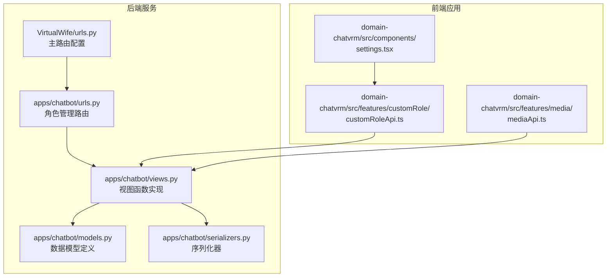
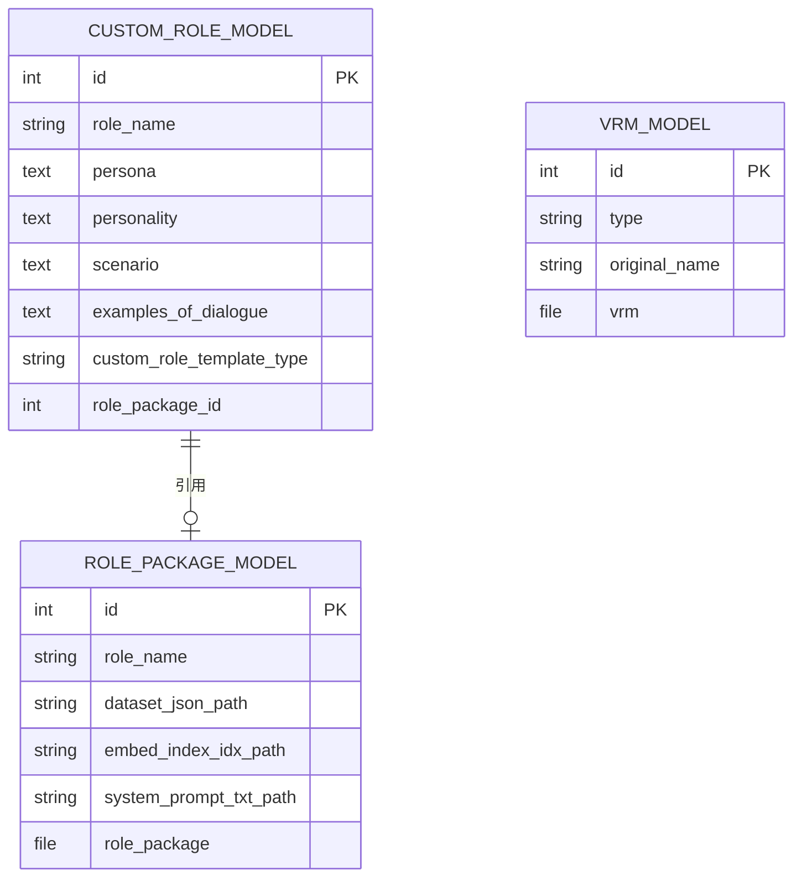
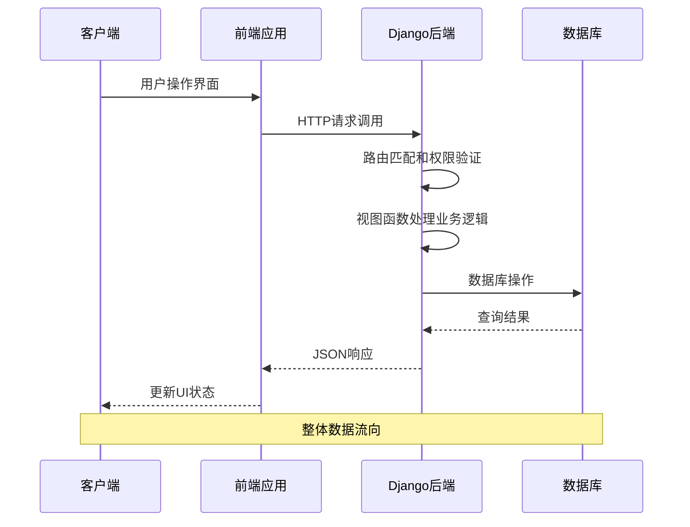
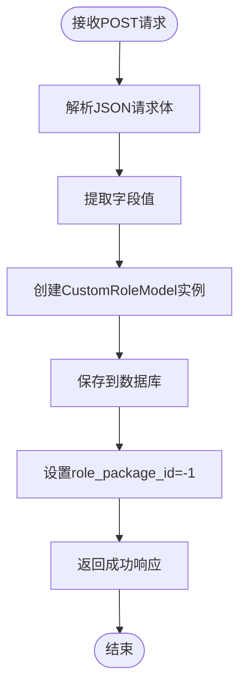
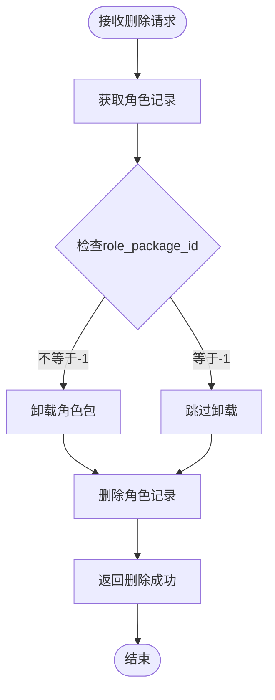
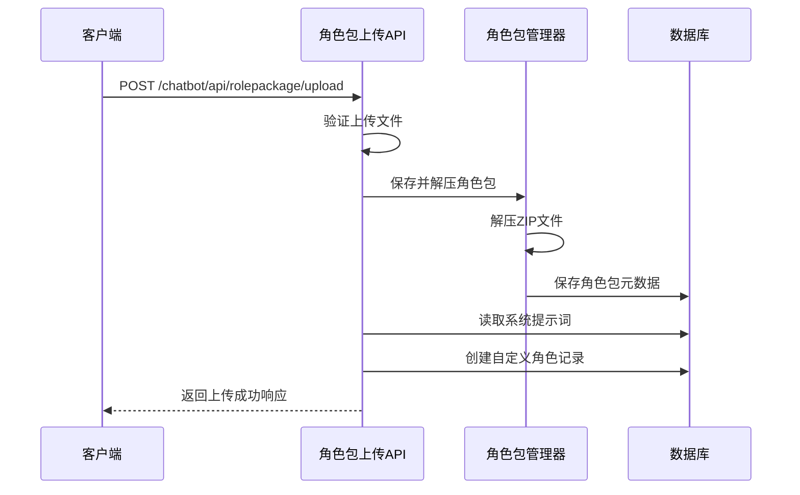
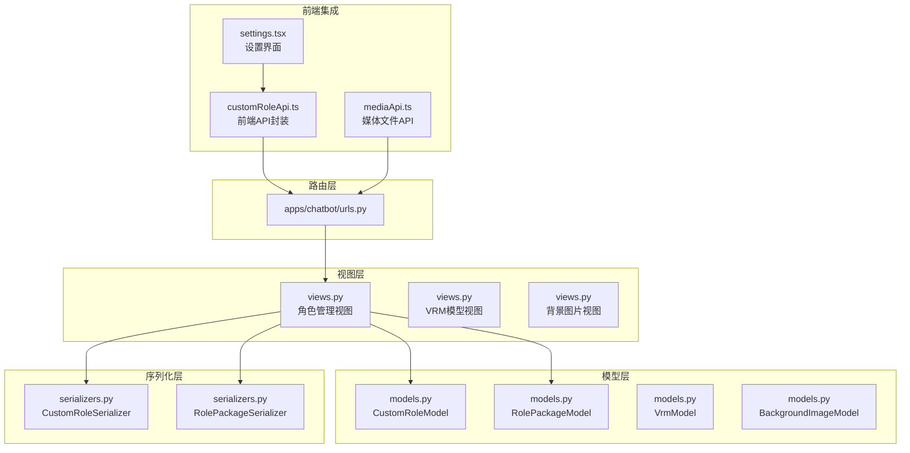

# 角色管理API

<cite>
**本文档引用的文件**
- [urls.py](file://domain-chatbot/apps/chatbot/urls.py)
- [views.py](file://domain-chatbot/apps/chatbot/views.py)
- [models.py](file://domain-chatbot/apps/chatbot/models.py)
- [serializers.py](file://domain-chatbot/apps/chatbot/serializers.py)
- [role_package_manage.py](file://domain-chatbot/apps/chatbot/character/role_package_manage.py)
- [customRoleApi.ts](file://domain-chatvrm/src/features/customRole/customRoleApi.ts)
- [mediaApi.ts](file://domain-chatvrm/src/features/media/mediaApi.ts)
- [settings.tsx](file://domain-chatvrm/src/components/settings.tsx)
- [urls.py](file://domain-chatbot/VirtualWife/urls.py)
</cite>

## 目录
1. [简介](#简介)
2. [项目结构](#项目结构)
3. [核心组件](#核心组件)
4. [架构概览](#架构概览)
5. [详细组件分析](#详细组件分析)
6. [依赖关系分析](#依赖关系分析)
7. [性能考虑](#性能考虑)
8. [故障排除指南](#故障排除指南)
9. [结论](#结论)

## 简介

本文件为虚拟女友聊天机器人项目中的角色管理API提供完整的技术文档。该API允许用户进行自定义角色的创建、编辑、删除、查询以及角色包的上传管理。系统采用Django REST Framework构建，前端使用React技术栈，通过Swagger进行API文档展示。

## 项目结构

角色管理功能分布在以下模块中：



**图表来源**
- [urls.py](file://domain-chatbot/VirtualWife/urls.py#L35-L41)
- [urls.py](file://domain-chatbot/apps/chatbot/urls.py#L1-L26)

**章节来源**
- [urls.py](file://domain-chatbot/VirtualWife/urls.py#L35-L41)
- [urls.py](file://domain-chatbot/apps/chatbot/urls.py#L1-L26)

## 核心组件

### 数据模型

角色管理系统的核心数据模型定义如下：



**图表来源**
- [models.py](file://domain-chatbot/apps/chatbot/models.py#L16-L36)
- [models.py](file://domain-chatbot/apps/chatbot/models.py#L85-L92)

### API端点概览

系统提供以下角色管理相关API端点：

| HTTP方法 | URL模式 | 功能描述 |
|---------|---------|----------|
| GET | `/chatbot/api/customrole/list` | 获取角色列表 |
| POST | `/chatbot/api/customrole/create` | 创建新角色 |
| PUT | `/chatbot/api/customrole/edit/<id>` | 编辑现有角色 |
| DELETE | `/chatbot/api/customrole/delete/<id>` | 删除角色 |
| GET | `/chatbot/api/customrole/detail/<id>` | 获取角色详情 |
| POST | `/chatbot/api/rolepackage/upload` | 上传角色包 |

**章节来源**
- [urls.py](file://domain-chatbot/apps/chatbot/urls.py#L10-L24)

## 架构概览



**图表来源**
- [urls.py](file://domain-chatbot/VirtualWife/urls.py#L35-L41)
- [views.py](file://domain-chatbot/apps/chatbot/views.py#L88-L170)

## 详细组件分析

### 角色列表接口

#### 接口定义
- **HTTP方法**: GET
- **URL模式**: `/chatbot/api/customrole/list`
- **功能**: 获取所有自定义角色的列表

#### 请求参数
- **无参数**: 该接口不需要任何查询参数

#### 响应格式
```json
{
    "response": [
        {
            "id": 1,
            "role_name": "角色名称",
            "persona": "角色基本信息",
            "personality": "性格描述",
            "scenario": "对话场景",
            "examples_of_dialogue": "对话示例",
            "custom_role_template_type": "模板类型",
            "role_package_id": -1
        }
    ],
    "code": "200"
}
```

#### 实现细节
- 使用`CustomRoleModel.objects.all()`获取所有角色
- 通过`CustomRoleSerializer`进行数据序列化
- 返回标准响应格式包含状态码和数据

**章节来源**
- [views.py](file://domain-chatbot/apps/chatbot/views.py#L88-L94)
- [urls.py](file://domain-chatbot/apps/chatbot/urls.py#L10-L10)

### 角色创建接口

#### 接口定义
- **HTTP方法**: POST
- **URL模式**: `/chatbot/api/customrole/create`
- **功能**: 创建新的自定义角色

#### 请求格式
```json
{
    "role_name": "角色名称",
    "persona": "角色基本信息",
    "personality": "性格描述",
    "scenario": "对话场景",
    "examples_of_dialogue": "对话示例",
    "custom_role_template_type": "模板类型"
}
```

#### 验证规则
- 所有字段均为必填项
- `role_name`: 字符串类型，最大长度100
- `persona`: 文本类型，必需
- `personality`: 文本类型，必需
- `scenario`: 文本类型，必需
- `examples_of_dialogue`: 文本类型，必需
- `custom_role_template_type`: 字符串类型，最大长度50

#### 响应格式
```json
{
    "response": "Data added to database",
    "code": "200"
}
```

#### 实现流程


**图表来源**
- [views.py](file://domain-chatbot/apps/chatbot/views.py#L103-L127)
- [models.py](file://domain-chatbot/apps/chatbot/models.py#L16-L36)

**章节来源**
- [views.py](file://domain-chatbot/apps/chatbot/views.py#L103-L127)
- [serializers.py](file://domain-chatbot/apps/chatbot/serializers.py#L5-L8)

### 角色编辑接口

#### 接口定义
- **HTTP方法**: POST (注意：虽然使用POST方法，但语义上是更新操作)
- **URL模式**: `/chatbot/api/customrole/edit/<id>`
- **功能**: 更新指定ID的自定义角色信息

#### 请求格式
```json
{
    "id": 1,
    "role_name": "更新后的角色名称",
    "persona": "更新后的角色基本信息",
    "personality": "更新后的性格描述",
    "scenario": "更新后的对话场景",
    "examples_of_dialogue": "更新后的对话示例",
    "custom_role_template_type": "更新后的模板类型"
}
```

#### 参数说明
- `id`: 必填，目标角色的唯一标识符
- 其他字段与创建接口相同

#### 响应格式
```json
{
    "response": "Data edit to database",
    "code": "200"
}
```

#### 实现逻辑
- 从请求数据中提取所有字段
- 创建包含ID的`CustomRoleModel`实例
- 调用`save()`方法更新数据库记录

**章节来源**
- [views.py](file://domain-chatbot/apps/chatbot/views.py#L130-L153)
- [urls.py](file://domain-chatbot/apps/chatbot/urls.py#L12-L12)

### 角色删除接口

#### 接口定义
- **HTTP方法**: POST
- **URL模式**: `/chatbot/api/customrole/delete/<id>`
- **功能**: 删除指定ID的自定义角色

#### 请求参数
- **路径参数**: `id` - 要删除角色的唯一标识符

#### 响应格式
```json
{
    "response": "ok",
    "code": "200"
}
```

#### 删除逻辑


**图表来源**
- [views.py](file://domain-chatbot/apps/chatbot/views.py#L156-L169)

**章节来源**
- [views.py](file://domain-chatbot/apps/chatbot/views.py#L156-L169)

### 角色详情查询接口

#### 接口定义
- **HTTP方法**: GET
- **URL模式**: `/chatbot/api/customrole/detail/<id>`
- **功能**: 获取指定ID角色的详细信息

#### 请求参数
- **路径参数**: `id` - 目标角色的唯一标识符

#### 响应格式
```json
{
    "response": {
        "id": 1,
        "role_name": "角色名称",
        "persona": "角色基本信息",
        "personality": "性格描述",
        "scenario": "对话场景",
        "examples_of_dialogue": "对话示例",
        "custom_role_template_type": "模板类型",
        "role_package_id": -1
    },
    "code": "200"
}
```

**章节来源**
- [views.py](file://domain-chatbot/apps/chatbot/views.py#L97-L100)
- [urls.py](file://domain-chatbot/apps/chatbot/urls.py#L13-L13)

### 角色包上传接口

#### 接口定义
- **HTTP方法**: POST
- **URL模式**: `/chatbot/api/rolepackage/upload`
- **功能**: 上传角色安装包并自动创建对应的角色

#### 请求格式
- **内容类型**: `multipart/form-data`
- **表单字段**: `role_package` - ZIP格式的角色包文件

#### 响应格式
```json
{
    "response": "ok",
    "code": "200"
}
```

#### 处理流程


**图表来源**
- [views.py](file://domain-chatbot/apps/chatbot/views.py#L249-L293)
- [role_package_manage.py](file://domain-chatbot/apps/chatbot/character/role_package_manage.py#L103-L148)

#### 上传流程详解
1. **文件验证**: 使用`UploadedRolePackageModelSerializer`验证上传的文件
2. **解压处理**: 通过`RolePackageManage.install()`方法解压ZIP文件
3. **元数据保存**: 将解压后的文件路径信息保存到数据库
4. **角色创建**: 从系统提示词文件中读取角色信息并创建自定义角色
5. **关联绑定**: 将角色与对应的安装包建立关联关系

**章节来源**
- [views.py](file://domain-chatbot/apps/chatbot/views.py#L249-L293)
- [role_package_manage.py](file://domain-chatbot/apps/chatbot/character/role_package_manage.py#L103-L148)

## 依赖关系分析



**图表来源**
- [urls.py](file://domain-chatbot/apps/chatbot/urls.py#L1-L26)
- [views.py](file://domain-chatbot/apps/chatbot/views.py#L1-L346)
- [models.py](file://domain-chatbot/apps/chatbot/models.py#L1-L92)

**章节来源**
- [urls.py](file://domain-chatbot/apps/chatbot/urls.py#L1-L26)
- [views.py](file://domain-chatbot/apps/chatbot/views.py#L1-L346)

## 性能考虑

### 数据库优化
- 使用`select_related()`或`prefetch_related()`减少N+1查询问题
- 对常用查询字段建立适当的数据库索引
- 考虑分页处理大量角色数据

### 序列化优化
- 使用`many=True`时确保批量序列化的效率
- 避免不必要的字段序列化，只返回必要数据

### 文件处理优化
- 角色包上传采用异步处理机制
- 大文件上传建议添加进度反馈
- 文件验证在上传前完成，避免无效IO操作

## 故障排除指南

### 常见错误及解决方案

#### 1. 角色创建失败
**症状**: 创建角色返回500错误
**可能原因**:
- 必填字段缺失
- 数据库连接异常
- 权限不足

**解决步骤**:
1. 检查请求JSON格式是否正确
2. 验证数据库连接状态
3. 确认用户权限

#### 2. 角色包上传失败
**症状**: 上传角色包后无法显示新角色
**可能原因**:
- ZIP文件损坏
- 解压路径权限问题
- 系统提示词文件格式错误

**解决步骤**:
1. 验证ZIP文件完整性
2. 检查服务器磁盘空间
3. 确认系统提示词文件格式

#### 3. 角色删除异常
**症状**: 删除角色后仍有残留文件
**可能原因**:
- 角色包文件未正确删除
- 数据库事务未提交

**解决步骤**:
1. 手动清理残留文件
2. 检查数据库事务日志
3. 重新执行删除操作

### 错误响应格式
所有API接口遵循统一的响应格式：
```json
{
    "response": "错误描述或业务数据",
    "code": "状态码"
}
```

**状态码说明**:
- `"200"`: 成功
- `"500"`: 服务器内部错误

**章节来源**
- [views.py](file://domain-chatbot/apps/chatbot/views.py#L127-L127)
- [views.py](file://domain-chatbot/apps/chatbot/views.py#L293-L293)

## 结论

角色管理API提供了完整的自定义角色生命周期管理功能，包括角色的创建、编辑、删除、查询以及角色包的自动化处理。系统采用模块化设计，前后端分离架构，具有良好的可扩展性和维护性。

主要特点：
- **RESTful设计**: 符合REST API最佳实践
- **数据一致性**: 通过序列化器确保数据格式规范
- **文件管理**: 支持角色包的自动解压和关联管理
- **错误处理**: 统一的错误响应格式便于前端处理
- **安全性**: 基于Django的权限控制机制

未来改进方向：
- 添加角色版本管理和历史记录
- 实现角色包的增量更新
- 增加角色导入导出功能
- 优化大角色包的上传体验