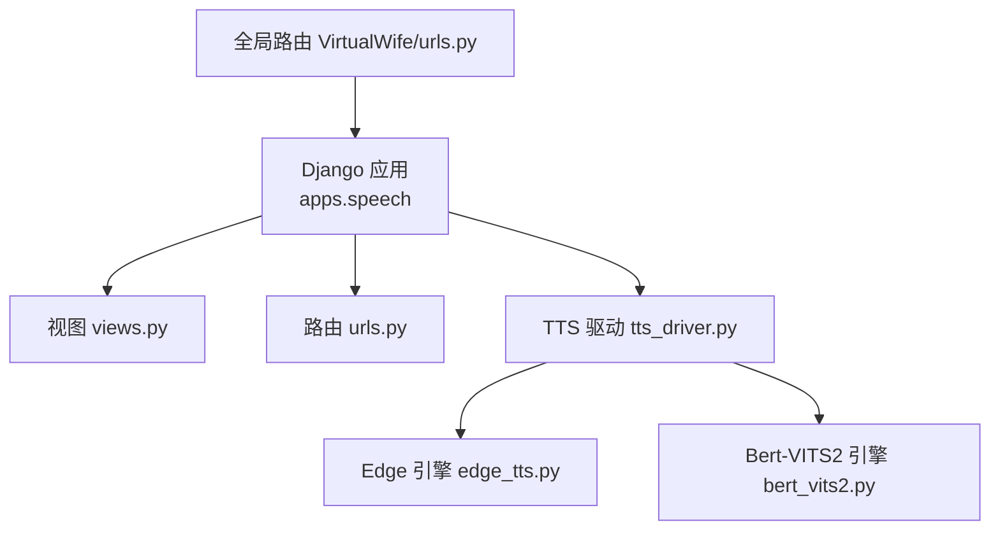
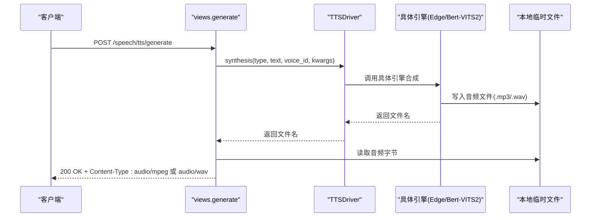
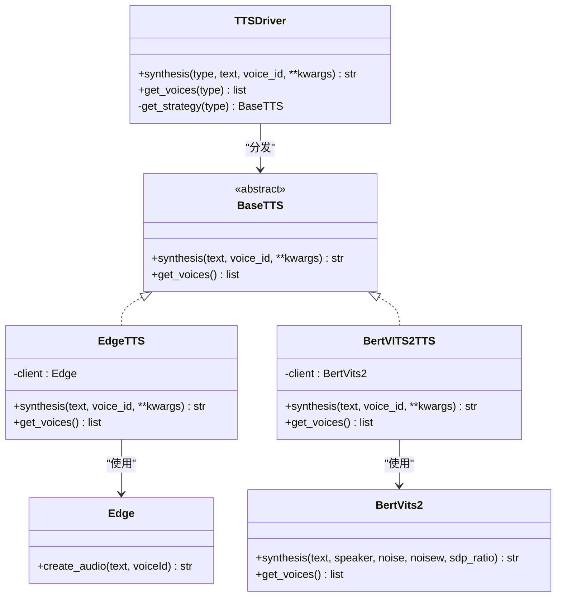
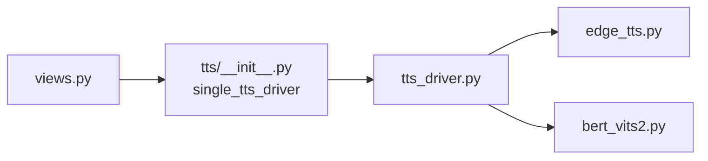

# 语音合成API

<cite>
**本文引用的文件**
- [views.py](file://domain-chatbot/apps/speech/views.py)
- [urls.py](file://domain-chatbot/apps/speech/urls.py)
- [tts_driver.py](file://domain-chatbot/apps/speech/tts/tts_driver.py)
- [bert_vits2.py](file://domain-chatbot/apps/speech/tts/bert_vits2.py)
- [edge_tts.py](file://domain-chatbot/apps/speech/tts/edge_tts.py)
- [__init__.py](file://domain-chatbot/apps/speech/tts/__init__.py)
- [urls.py](file://domain-chatbot/VirtualWife/urls.py)
</cite>

## 目录
1. [简介](#简介)
2. [项目结构](#项目结构)
3. [核心组件](#核心组件)
4. [架构总览](#架构总览)
5. [详细组件分析](#详细组件分析)
6. [依赖分析](#依赖分析)
7. [性能考虑](#性能考虑)
8. [故障排查指南](#故障排查指南)
9. [结论](#结论)
10. [附录：API定义与使用示例](#附录api定义与使用示例)

## 简介
本文件为语音合成服务的完整API文档，覆盖以下内容：
- HTTP接口定义：POST /speech/tts/generate、POST /speech/tts/voices
- 请求/响应模式与字段说明
- 认证方式与安全注意事项
- 语音合成实现细节：多引擎支持（Edge、Bert-VITS2）、参数与音频格式
- 使用示例：不同引擎配置、音频质量设置、批量处理思路
- 驱动架构与性能优化策略

## 项目结构
语音合成模块位于 domain-chatbot/apps/speech，包含视图层、路由与TTS驱动层：
- 视图层：生成音频、获取语音列表、翻译（非TTS主流程）
- 路由层：将 /speech 前缀下的子路径映射到对应视图
- TTS驱动层：抽象统一接口，按类型分发至具体引擎（Edge、Bert-VITS2）

图表来源
- [views.py](file://domain-chatbot/apps/speech/views.py#L1-L74)
- [urls.py](file://domain-chatbot/apps/speech/urls.py#L1-L9)
- [tts_driver.py](file://domain-chatbot/apps/speech/tts/tts_driver.py#L1-L74)
- [edge_tts.py](file://domain-chatbot/apps/speech/tts/edge_tts.py#L1-L51)
- [bert_vits2.py](file://domain-chatbot/apps/speech/tts/bert_vits2.py#L1-L669)
- [urls.py](file://domain-chatbot/VirtualWife/urls.py#L35-L41)

章节来源
- [views.py](file://domain-chatbot/apps/speech/views.py#L1-L74)
- [urls.py](file://domain-chatbot/apps/speech/urls.py#L1-L9)
- [urls.py](file://domain-chatbot/VirtualWife/urls.py#L35-L41)

## 核心组件
- 视图函数
  - generate：接收文本、语音ID与引擎类型，调用单例驱动进行合成，返回MP3或WAV音频文件
  - get_voices：根据引擎类型返回可用语音列表
- TTS驱动
  - TTSDriver：根据type选择具体引擎，统一分发synthesis与get_voices
  - BaseTTS：抽象接口，约束合成与语音列表获取
  - EdgeTTS/BertVITS2TTS：具体引擎实现
- 引擎实现
  - Edge：通过系统命令调用 edge-tts 生成MP3
  - Bert-VITS2：向远程服务发起请求，下载WAV音频

章节来源
- [views.py](file://domain-chatbot/apps/speech/views.py#L16-L57)
- [tts_driver.py](file://domain-chatbot/apps/speech/tts/tts_driver.py#L9-L74)
- [edge_tts.py](file://domain-chatbot/apps/speech/tts/edge_tts.py#L27-L51)
- [bert_vits2.py](file://domain-chatbot/apps/speech/tts/bert_vits2.py#L621-L663)

## 架构总览
下图展示从HTTP请求到音频输出的整体流程，以及多引擎支持的分发机制。

图表来源
- [views.py](file://domain-chatbot/apps/speech/views.py#L16-L47)
- [tts_driver.py](file://domain-chatbot/apps/speech/tts/tts_driver.py#L54-L61)
- [edge_tts.py](file://domain-chatbot/apps/speech/tts/edge_tts.py#L35-L50)
- [bert_vits2.py](file://domain-chatbot/apps/speech/tts/bert_vits2.py#L621-L644)

## 详细组件分析

### 接口定义与字段说明

- POST /speech/tts/generate
  - 方法：POST
  - 路径：/speech/tts/generate
  - 请求体字段
    - text：字符串，待合成的文本
    - voice_id：字符串，目标语音ID
    - type：字符串，引擎类型，取值范围："Edge" 或 "Bert-VITS2"
    - 可选参数（仅Bert-VITS2生效）：noise、noisew、sdp_ratio
  - 响应
    - 成功：200 OK，Content-Type: audio/mpeg（Edge）或 audio/wav（Bert-VITS2），响应体为音频文件字节
    - 失败：500 Internal Server Error，错误信息
  - 认证：未在代码中实现鉴权逻辑，建议在生产环境接入鉴权中间件

- POST /speech/tts/voices
  - 方法：POST
  - 路径：/speech/tts/voices
  - 请求体字段
    - type：字符串，引擎类型，取值范围："Edge" 或 "Bert-VITS2"
  - 响应
    - 成功：200 OK，JSON对象包含 voices 列表与状态码
    - 失败：500 Internal Server Error，错误信息

章节来源
- [views.py](file://domain-chatbot/apps/speech/views.py#L16-L57)
- [urls.py](file://domain-chatbot/apps/speech/urls.py#L4-L8)

### 参数与音频格式

- 引擎类型与默认参数
  - Edge（微软）
    - 输出格式：MP3
    - 语音列表：见 edge_voices
    - 关键参数：voiceId（来自语音列表）
  - Bert-VITS2
    - 输出格式：WAV
    - 语音列表：内置角色列表
    - 关键参数：speaker（来自语音列表），noise、noisew、sdp_ratio（可选，默认值见驱动层）

- 参数传递链路
  - views.generate 将 text、voice_id、type 透传给驱动
  - 驱动根据 type 选择具体引擎
  - BertVITS2TTS 将可选参数合并后调用 BertVits2 合成
  - EdgeTTS 直接调用 Edge.create_audio

章节来源
- [tts_driver.py](file://domain-chatbot/apps/speech/tts/tts_driver.py#L44-L48)
- [bert_vits2.py](file://domain-chatbot/apps/speech/tts/bert_vits2.py#L653-L660)
- [edge_tts.py](file://domain-chatbot/apps/speech/tts/edge_tts.py#L35-L50)

### 类关系与职责

图表来源
- [tts_driver.py](file://domain-chatbot/apps/speech/tts/tts_driver.py#L9-L74)
- [edge_tts.py](file://domain-chatbot/apps/speech/tts/edge_tts.py#L27-L51)
- [bert_vits2.py](file://domain-chatbot/apps/speech/tts/bert_vits2.py#L647-L663)

## 依赖分析
- 模块耦合
  - views 依赖 single_tts_driver（TTSDriver单例）
  - TTSDriver 依赖具体引擎实现（Edge、Bert-VITS2）
  - Edge 引擎依赖系统命令 edge-tts
  - Bert-VITS2 引擎依赖远程服务接口
- 外部依赖
  - edge-tts 命令行工具
  - 远程服务（Bert-VITS2）
- 可能的循环依赖
  - 当前结构为单向依赖，无循环

图表来源
- [views.py](file://domain-chatbot/apps/speech/views.py#L11-L11)
- [__init__.py](file://domain-chatbot/apps/speech/tts/__init__.py#L2-L4)
- [tts_driver.py](file://domain-chatbot/apps/speech/tts/tts_driver.py#L1-L74)
- [edge_tts.py](file://domain-chatbot/apps/speech/tts/edge_tts.py#L1-L51)
- [bert_vits2.py](file://domain-chatbot/apps/speech/tts/bert_vits2.py#L1-L669)

章节来源
- [views.py](file://domain-chatbot/apps/speech/views.py#L11-L11)
- [__init__.py](file://domain-chatbot/apps/speech/tts/__init__.py#L2-L4)
- [tts_driver.py](file://domain-chatbot/apps/speech/tts/tts_driver.py#L1-L74)

## 性能考虑
- I/O与文件管理
  - 合成结果写入 tmp 目录，随后读取并返回，最后删除文件；建议在高并发场景下增加异步任务队列与缓存清理策略
- 引擎差异
  - Edge 依赖系统命令，适合轻量快速合成；Bert-VITS2 依赖网络请求，需关注超时与重试
- 批量处理
  - 当前接口为单次合成；如需批量，建议在应用层排队并异步执行，避免阻塞请求线程
- 缓存与复用
  - 对于重复文本/语音组合，可在业务层引入缓存以减少重复合成

## 故障排查指南
- 常见错误与定位
  - 500 错误：查看视图层异常捕获日志，确认引擎初始化与外部依赖是否正常
  - Edge 合成失败：检查 edge-tts 是否安装且可执行，确认 voiceId 是否在语音列表中
  - Bert-VITS2 合成失败：检查远程服务可达性、网络代理与证书校验设置
- 日志与调试
  - 视图与驱动均包含日志记录，建议结合日志定位问题
- 临时文件清理
  - 合成完成后会删除临时文件，若出现磁盘占用异常，请检查是否存在异常未触发清理的场景

章节来源
- [views.py](file://domain-chatbot/apps/speech/views.py#L45-L47)
- [tts_driver.py](file://domain-chatbot/apps/speech/tts/tts_driver.py#L60-L61)

## 结论
该语音合成API通过统一驱动层实现了多引擎支持，具备清晰的扩展点。当前实现以同步方式返回音频文件，适合中小规模并发；在高并发与大规模批量场景下，建议引入异步任务、缓存与限流等机制以提升稳定性与吞吐量。

## 附录：API定义与使用示例

### 接口清单
- POST /speech/tts/generate
  - 请求体字段
    - text：字符串
    - voice_id：字符串
    - type：字符串，"Edge" 或 "Bert-VITS2"
    - 可选：noise、noisew、sdp_ratio（仅Bert-VITS2生效）
  - 响应
    - 200 OK + 音频文件（MP3 或 WAV）
    - 500 错误：服务器内部错误

- POST /speech/tts/voices
  - 请求体字段
    - type：字符串，"Edge" 或 "Bert-VITS2"
  - 响应
    - 200 OK + voices 列表
    - 500 错误：服务器内部错误

### 使用示例

- 示例一：使用 Edge 引擎
  - 步骤
    - 获取语音列表：POST /speech/tts/voices，type=Edge
    - 选择 voice_id（例如 zh-CN-XiaoxiaoNeural）
    - 调用合成：POST /speech/tts/generate，type=Edge，voice_id=所选ID，text=待合成文本
  - 预期响应：200 OK，Content-Type: audio/mpeg

- 示例二：使用 Bert-VITS2 引擎
  - 步骤
    - 获取语音列表：POST /speech/tts/voices，type=Bert-VITS2
    - 选择 speaker（例如 派蒙_ZH）
    - 调用合成：POST /speech/tts/generate，type=Bert-VITS2，voice_id=speaker，text=待合成文本，可选 noise/noisew/sdp_ratio
  - 预期响应：200 OK，Content-Type: audio/wav

- 示例三：批量处理思路
  - 在应用层维护一个待合成队列，逐条提交至后台任务（如消息队列），每个任务独立调用 /speech/tts/generate，完成后聚合结果或直接推送通知

### 认证与安全
- 当前实现未包含鉴权逻辑，建议在网关或中间件层添加鉴权方案（如API Key、Token等），并在生产环境启用HTTPS与访问控制。