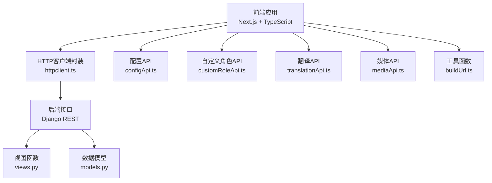
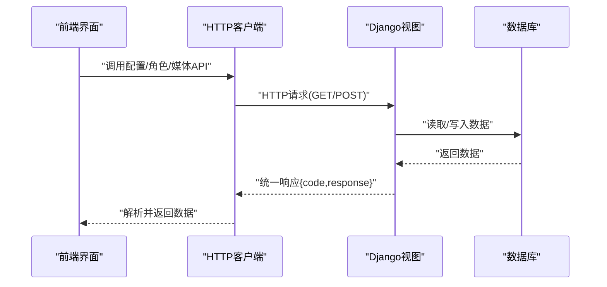
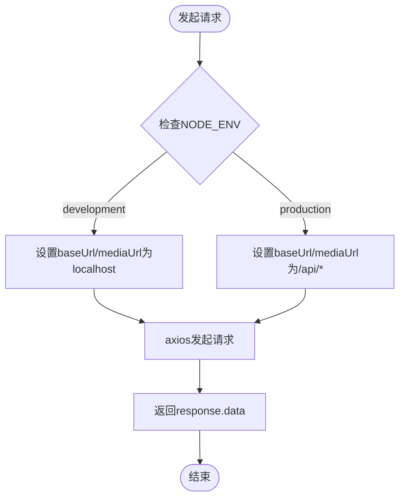
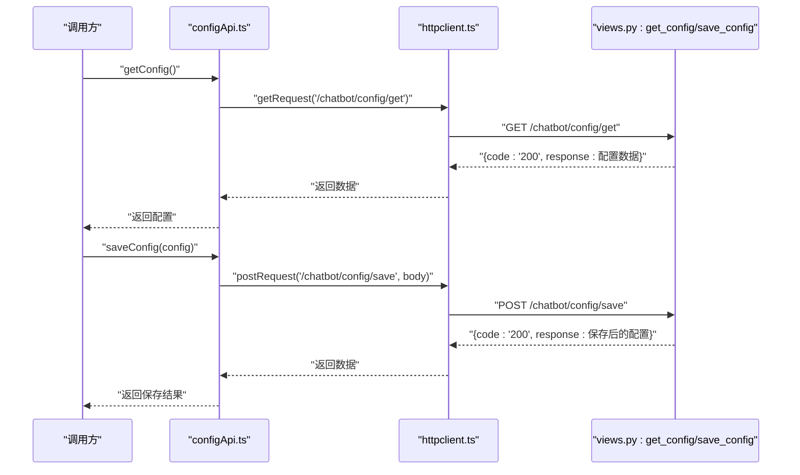
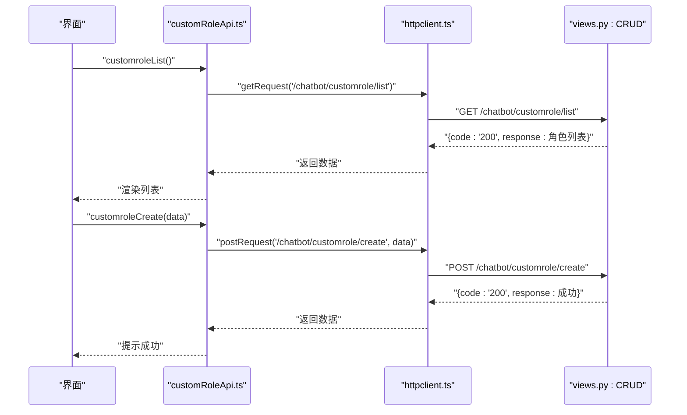
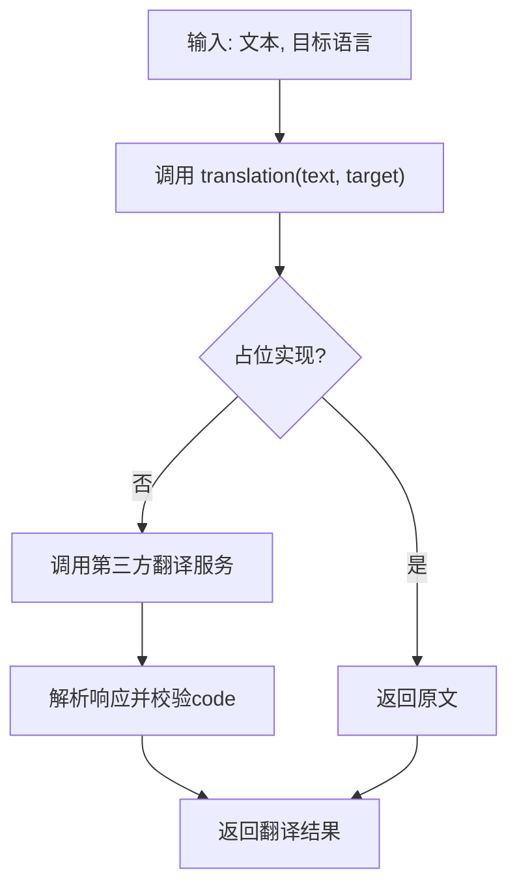
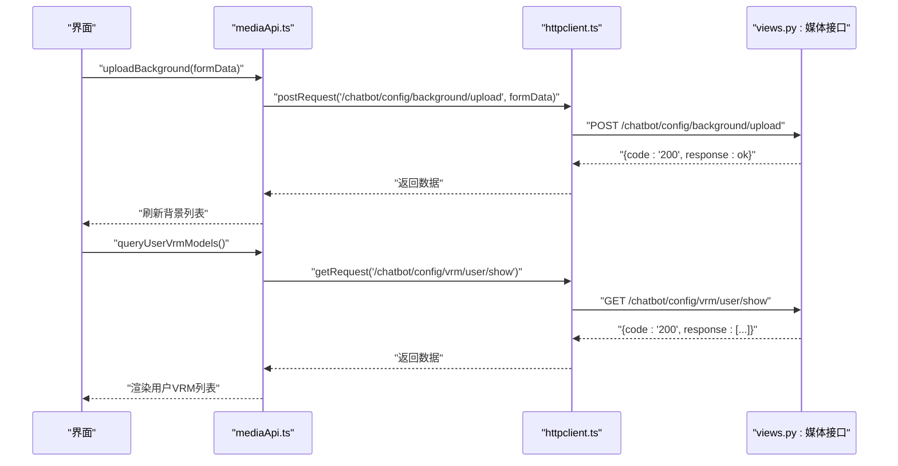
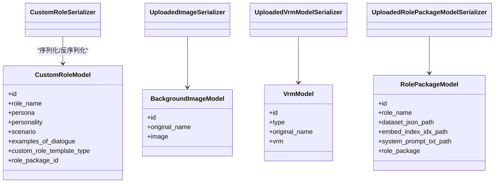
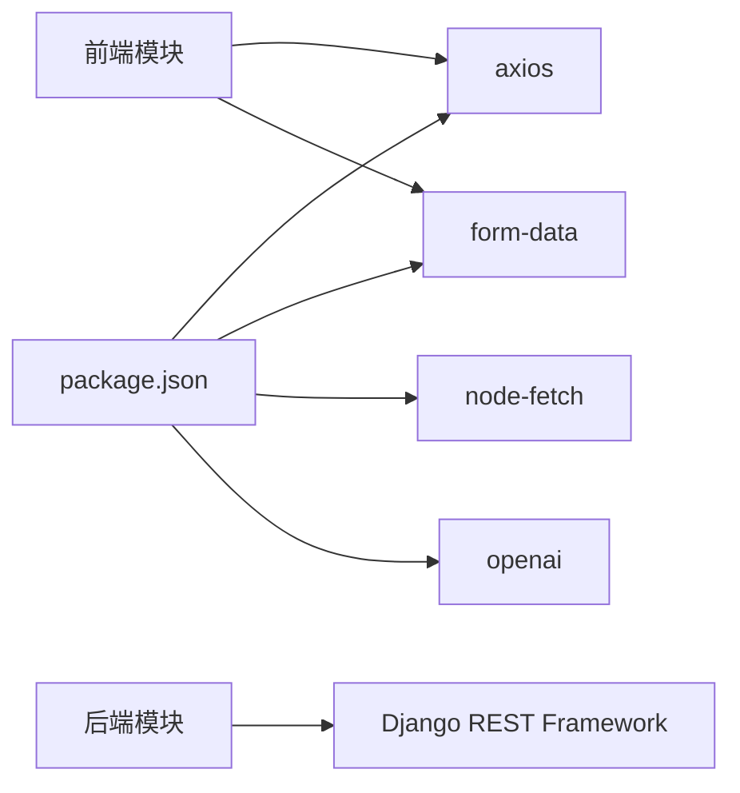

# API通信与数据管理

<cite>
**本文引用的文件**
- [httpclient.ts](file://domain-chatvrm/src/features/httpclient/httpclient.ts)
- [configApi.ts](file://domain-chatvrm/src/features/config/configApi.ts)
- [customRoleApi.ts](file://domain-chatvrm/src/features/customRole/customRoleApi.ts)
- [translationApi.ts](file://domain-chatvrm/src/features/translation/translationApi.ts)
- [mediaApi.ts](file://domain-chatvrm/src/features/media/mediaApi.ts)
- [buildUrl.ts](file://domain-chatvrm/src/utils/buildUrl.ts)
- [views.py](file://domain-chatbot/apps/chatbot/views.py)
- [urls.py](file://domain-chatbot/apps/chatbot/urls.py)
- [models.py](file://domain-chatbot/apps/chatbot/models.py)
- [openAiChat.ts](file://domain-chatvrm/src/features/chat/openAiChat.ts)
- [package.json](file://domain-chatvrm/package.json)
</cite>

## 目录
1. [简介](#简介)
2. [项目结构](#项目结构)
3. [核心组件](#核心组件)
4. [架构总览](#架构总览)
5. [详细组件分析](#详细组件分析)
6. [依赖关系分析](#依赖关系分析)
7. [性能考虑](#性能考虑)
8. [故障排查指南](#故障排查指南)
9. [结论](#结论)
10. [附录](#附录)

## 简介
本文件面向开发者，系统性梳理前端聊天VRM应用与后端聊天机器人服务之间的API通信与数据管理机制。重点覆盖以下方面：
- HTTP客户端封装：请求/响应处理、环境适配、媒体资源URL构建
- 配置API：获取与保存系统配置、版本控制与增量更新建议
- 自定义角色API：CRUD操作（创建、编辑、删除、列表）、权限与校验
- 翻译API：调用流程、多语言支持、缓存与离线策略
- 媒体API：文件上传/下载、进度跟踪、断点续传、格式校验
- 错误处理策略与性能优化建议
- API调用示例与最佳实践

## 项目结构
前端采用Next.js + TypeScript，后端采用Django REST Framework。前端通过统一HTTP客户端访问后端接口；后端提供REST接口，负责业务逻辑与数据持久化。

图表来源
- [httpclient.ts](file://domain-chatvrm/src/features/httpclient/httpclient.ts#L1-L43)
- [configApi.ts](file://domain-chatvrm/src/features/config/configApi.ts#L1-L100)
- [customRoleApi.ts](file://domain-chatvrm/src/features/customRole/customRoleApi.ts#L1-L71)
- [translationApi.ts](file://domain-chatvrm/src/features/translation/translationApi.ts#L1-L23)
- [mediaApi.ts](file://domain-chatvrm/src/features/media/mediaApi.ts#L1-L122)
- [buildUrl.ts](file://domain-chatvrm/src/utils/buildUrl.ts#L1-L16)
- [views.py](file://domain-chatbot/apps/chatbot/views.py#L1-L346)
- [models.py](file://domain-chatbot/apps/chatbot/models.py#L1-L92)

章节来源
- [httpclient.ts](file://domain-chatvrm/src/features/httpclient/httpclient.ts#L1-L43)
- [views.py](file://domain-chatbot/apps/chatbot/views.py#L1-L346)
- [urls.py](file://domain-chatbot/apps/chatbot/urls.py#L1-L26)

## 核心组件
- HTTP客户端封装：基于axios，按环境自动选择基础URL，提供GET/POST通用方法与媒体URL拼接能力
- 配置API：提供系统配置的获取与保存，返回统一结构（含code与response）
- 自定义角色API：提供角色的增删改查接口，配合后端序列化器与模型
- 翻译API：当前为占位实现，便于后续接入第三方翻译服务
- 媒体API：提供背景图、VRM模型、角色包的上传、查询与删除，支持multipart/form-data
- 工具函数：buildUrl用于静态资源路径拼接，mediaUrl用于媒体资源访问

章节来源
- [httpclient.ts](file://domain-chatvrm/src/features/httpclient/httpclient.ts#L1-L43)
- [configApi.ts](file://domain-chatvrm/src/features/config/configApi.ts#L1-L100)
- [customRoleApi.ts](file://domain-chatvrm/src/features/customRole/customRoleApi.ts#L1-L71)
- [translationApi.ts](file://domain-chatvrm/src/features/translation/translationApi.ts#L1-L23)
- [mediaApi.ts](file://domain-chatvrm/src/features/media/mediaApi.ts#L1-L122)
- [buildUrl.ts](file://domain-chatvrm/src/utils/buildUrl.ts#L1-L16)

## 架构总览
前端通过HTTP客户端发起请求，后端视图函数处理业务逻辑并返回统一结构；媒体资源通过独立的媒体URL访问。

图表来源
- [httpclient.ts](file://domain-chatvrm/src/features/httpclient/httpclient.ts#L21-L39)
- [views.py](file://domain-chatbot/apps/chatbot/views.py#L34-L60)
- [urls.py](file://domain-chatbot/apps/chatbot/urls.py#L1-L26)

## 详细组件分析

### HTTP客户端封装
- 环境适配：开发环境使用本地地址，生产环境通过反向代理访问后端
- 请求方法：提供通用POST、POST ArrayBuffer、GET方法
- 响应处理：直接返回response.data，上层统一处理code
- 媒体URL：buildMediaUrl用于拼接媒体资源访问URL

图表来源
- [httpclient.ts](file://domain-chatvrm/src/features/httpclient/httpclient.ts#L5-L19)
- [httpclient.ts](file://domain-chatvrm/src/features/httpclient/httpclient.ts#L21-L39)

章节来源
- [httpclient.ts](file://domain-chatvrm/src/features/httpclient/httpclient.ts#L1-L43)

### 配置API：获取与保存
- 获取配置：GET /chatbot/config/get，返回统一结构
- 保存配置：POST /chatbot/config/save，携带config字段
- 统一校验：上层检查code是否为200，非200时抛出异常

图表来源
- [configApi.ts](file://domain-chatvrm/src/features/config/configApi.ts#L68-L100)
- [httpclient.ts](file://domain-chatvrm/src/features/httpclient/httpclient.ts#L35-L39)
- [views.py](file://domain-chatbot/apps/chatbot/views.py#L53-L60)
- [views.py](file://domain-chatbot/apps/chatbot/views.py#L34-L50)

章节来源
- [configApi.ts](file://domain-chatvrm/src/features/config/configApi.ts#L1-L100)
- [views.py](file://domain-chatbot/apps/chatbot/views.py#L34-L60)

### 自定义角色API：CRUD
- 列表：GET /chatbot/customrole/list
- 详情：GET /chatbot/customrole/detail/{id}
- 创建：POST /chatbot/customrole/create
- 编辑：POST /chatbot/customrole/edit/{id}
- 删除：POST /chatbot/customrole/delete/{id}
- 前端封装：每个操作均返回统一结构并校验code

图表来源
- [customRoleApi.ts](file://domain-chatvrm/src/features/customRole/customRoleApi.ts#L59-L71)
- [customRoleApi.ts](file://domain-chatvrm/src/features/customRole/customRoleApi.ts#L35-L45)
- [urls.py](file://domain-chatbot/apps/chatbot/urls.py#L10-L14)
- [views.py](file://domain-chatbot/apps/chatbot/views.py#L88-L170)

章节来源
- [customRoleApi.ts](file://domain-chatvrm/src/features/customRole/customRoleApi.ts#L1-L71)
- [urls.py](file://domain-chatbot/apps/chatbot/urls.py#L10-L14)
- [views.py](file://domain-chatbot/apps/chatbot/views.py#L88-L170)

### 翻译API：调用流程与扩展
- 当前实现：占位返回原文，便于后续接入第三方翻译服务
- 建议扩展：在translationApi.ts中实现具体调用，统一返回结构与错误处理

图表来源
- [translationApi.ts](file://domain-chatvrm/src/features/translation/translationApi.ts#L1-L23)

章节来源
- [translationApi.ts](file://domain-chatvrm/src/features/translation/translationApi.ts#L1-L23)

### 媒体API：上传/下载/删除与URL构建
- 背景图
  - 上传：POST /chatbot/config/background/upload（multipart/form-data）
  - 查询：GET /chatbot/config/background/show
  - 删除：POST /chatbot/config/background/delete/{id}
- VRM模型
  - 上传：POST /chatbot/config/vrm/upload（multipart/form-data）
  - 用户列表：GET /chatbot/config/vrm/user/show
  - 系统列表：GET /chatbot/config/vrm/system/show
  - 删除：POST /chatbot/config/vrm/delete/{id}
- 角色包
  - 上传：POST /chatbot/rolepackage/upload（multipart/form-data）
- URL构建
  - generateMediaUrl：拼接媒体URL
  - buildVrmModelUrl：区分用户/系统资源的URL策略

图表来源
- [mediaApi.ts](file://domain-chatvrm/src/features/media/mediaApi.ts#L31-L51)
- [mediaApi.ts](file://domain-chatvrm/src/features/media/mediaApi.ts#L86-L95)
- [urls.py](file://domain-chatbot/apps/chatbot/urls.py#L17-L24)
- [views.py](file://domain-chatbot/apps/chatbot/views.py#L188-L211)
- [views.py](file://domain-chatbot/apps/chatbot/views.py#L296-L303)

章节来源
- [mediaApi.ts](file://domain-chatvrm/src/features/media/mediaApi.ts#L1-L122)
- [urls.py](file://domain-chatbot/apps/chatbot/urls.py#L17-L24)
- [views.py](file://domain-chatbot/apps/chatbot/views.py#L188-L211)
- [views.py](file://domain-chatbot/apps/chatbot/views.py#L296-L303)

### 数据模型与序列化
- 模型：CustomRoleModel、SysConfigModel、LocalMemoryModel、BackgroundImageModel、VrmModel、RolePackageModel
- 序列化器：CustomRoleSerializer、UploadedImageSerializer、UploadedVrmModelSerializer、UploadedRolePackageModelSerializer
- 作用：保证前后端数据结构一致，简化接口返回与校验

图表来源
- [models.py](file://domain-chatbot/apps/chatbot/models.py#L16-L92)
- [serializers.py](file://domain-chatbot/apps/chatbot/serializers.py#L1-L36)

章节来源
- [models.py](file://domain-chatbot/apps/chatbot/models.py#L1-L92)
- [serializers.py](file://domain-chatbot/apps/chatbot/serializers.py#L1-L36)

## 依赖关系分析
- 前端依赖
  - axios：HTTP请求库
  - form-data：multipart/form-data支持
  - node-fetch/openai等：其他功能模块依赖
- 后端依赖
  - Django REST Framework：视图与序列化
  - 模型与数据库：数据持久化

图表来源
- [package.json](file://domain-chatvrm/package.json#L13-L32)

章节来源
- [package.json](file://domain-chatvrm/package.json#L1-L51)

## 性能考虑
- 请求合并与去重：对频繁触发的配置/列表请求进行防抖或缓存
- 增量更新：配置与角色列表支持按需刷新，避免全量拉取
- 媒体资源：使用CDN与缓存头，减少重复加载
- 流式传输：大文件上传可考虑分片与断点续传（见“断点续传”建议）
- 错误快速失败：统一校验code，异常尽早暴露，避免无效重试

## 故障排查指南
- 统一错误处理
  - 前端：所有API返回统一结构，若code不为200则抛出异常
  - 后端：视图函数返回{"code":"200"/"500","response":...}
- 常见问题定位
  - 网络：确认环境变量与基础URL配置正确
  - 权限：确保Content-Type与multipart/form-data设置正确
  - 文件：检查上传文件大小、格式与后端序列化器校验
- 日志与监控
  - 后端：记录序列化错误与文件操作日志
  - 前端：捕获异常并上报，提供用户友好的提示

章节来源
- [configApi.ts](file://domain-chatvrm/src/features/config/configApi.ts#L74-L77)
- [customRoleApi.ts](file://domain-chatvrm/src/features/customRole/customRoleApi.ts#L28-L32)
- [mediaApi.ts](file://domain-chatvrm/src/features/media/mediaApi.ts#L35-L38)
- [views.py](file://domain-chatbot/apps/chatbot/views.py#L245-L246)

## 结论
该系统通过统一的HTTP客户端与规范化的接口设计，实现了配置、角色、媒体等模块的稳定交互。建议在现有基础上进一步完善翻译API、媒体上传的断点续传与格式校验，并引入缓存与版本控制策略以提升用户体验与系统稳定性。

## 附录

### API调用示例（路径参考）
- 获取配置
  - GET /chatbot/config/get
  - 参考：[configApi.ts](file://domain-chatvrm/src/features/config/configApi.ts#L68-L80)
- 保存配置
  - POST /chatbot/config/save
  - 参考：[configApi.ts](file://domain-chatvrm/src/features/config/configApi.ts#L82-L100)
- 自定义角色
  - GET /chatbot/customrole/list
  - POST /chatbot/customrole/create
  - POST /chatbot/customrole/edit/{id}
  - POST /chatbot/customrole/delete/{id}
  - 参考：[urls.py](file://domain-chatbot/apps/chatbot/urls.py#L10-L14)
- 媒体资源
  - POST /chatbot/config/background/upload
  - GET /chatbot/config/background/show
  - POST /chatbot/config/background/delete/{id}
  - POST /chatbot/config/vrm/upload
  - GET /chatbot/config/vrm/user/show
  - GET /chatbot/config/vrm/system/show
  - POST /chatbot/config/vrm/delete/{id}
  - POST /chatbot/rolepackage/upload
  - 参考：[urls.py](file://domain-chatbot/apps/chatbot/urls.py#L17-L24)

### 错误处理策略
- 前端：统一校验code，非200时抛错并提示
- 后端：序列化失败返回500，文件操作失败记录日志
- 建议：增加重试与降级策略（如离线缓存）

### 性能优化方案
- 配置与角色列表：按需刷新、本地缓存、版本号对比
- 媒体上传：分片上传、断点续传、进度回调
- 翻译：本地缓存常用词条、离线兜底文案