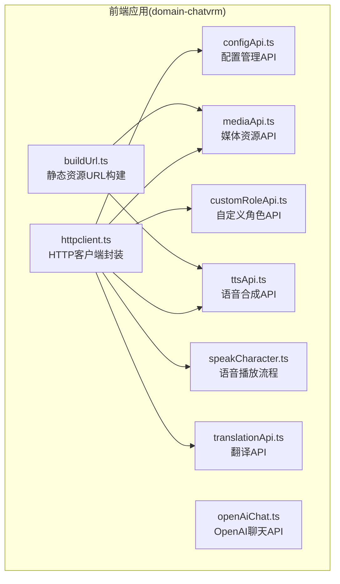
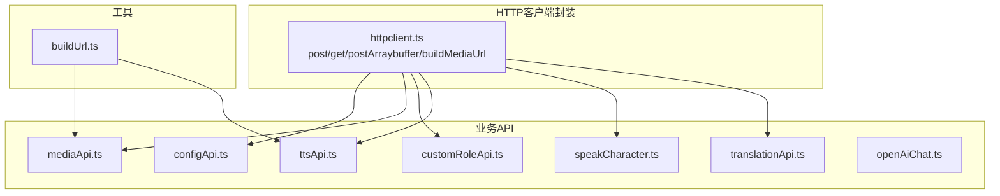
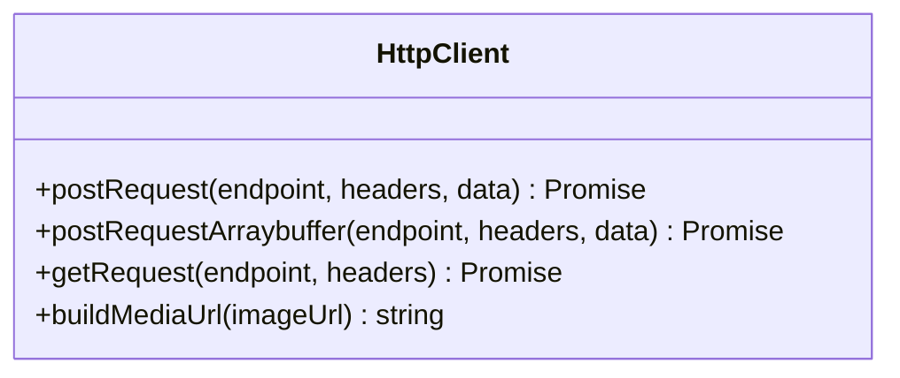
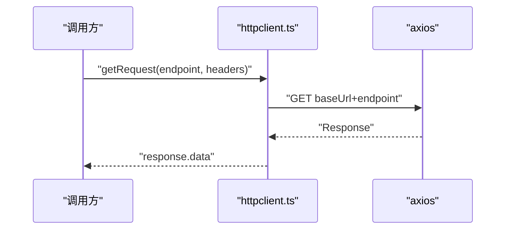
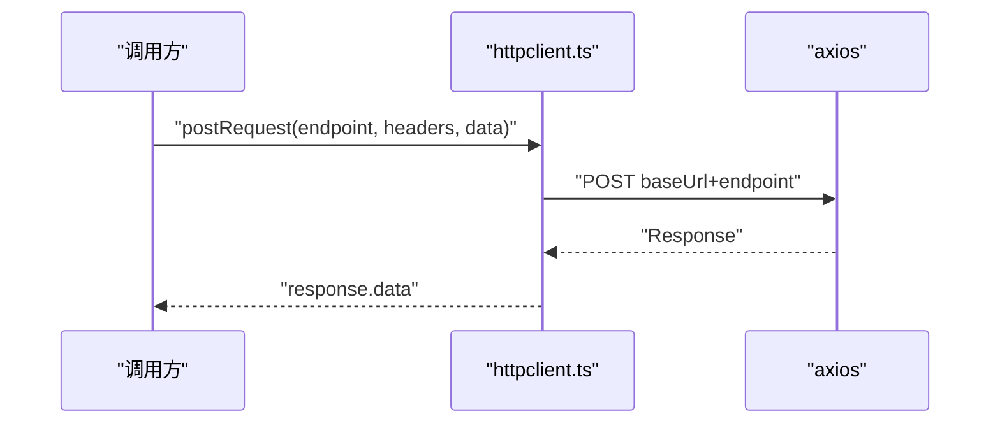
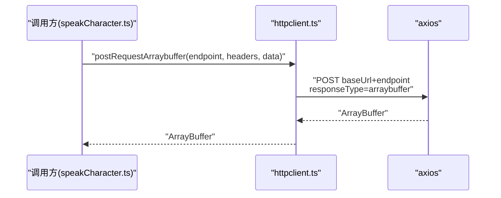
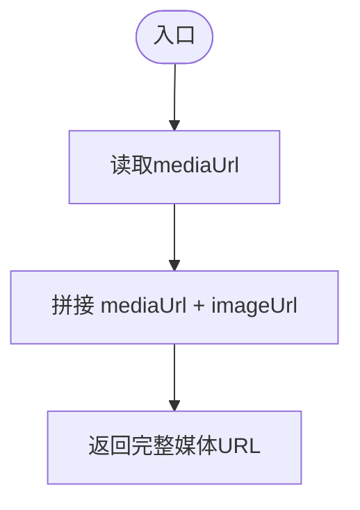
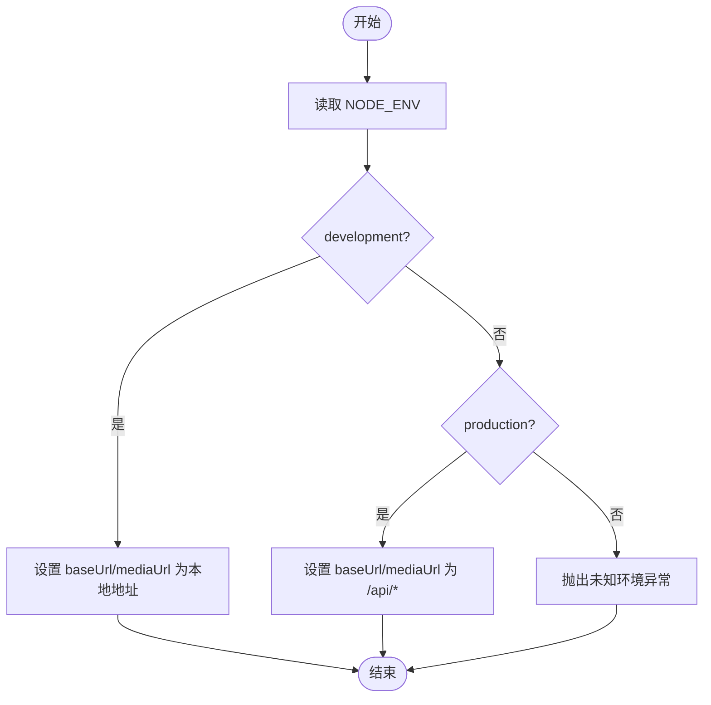
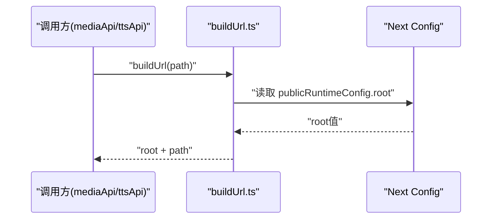
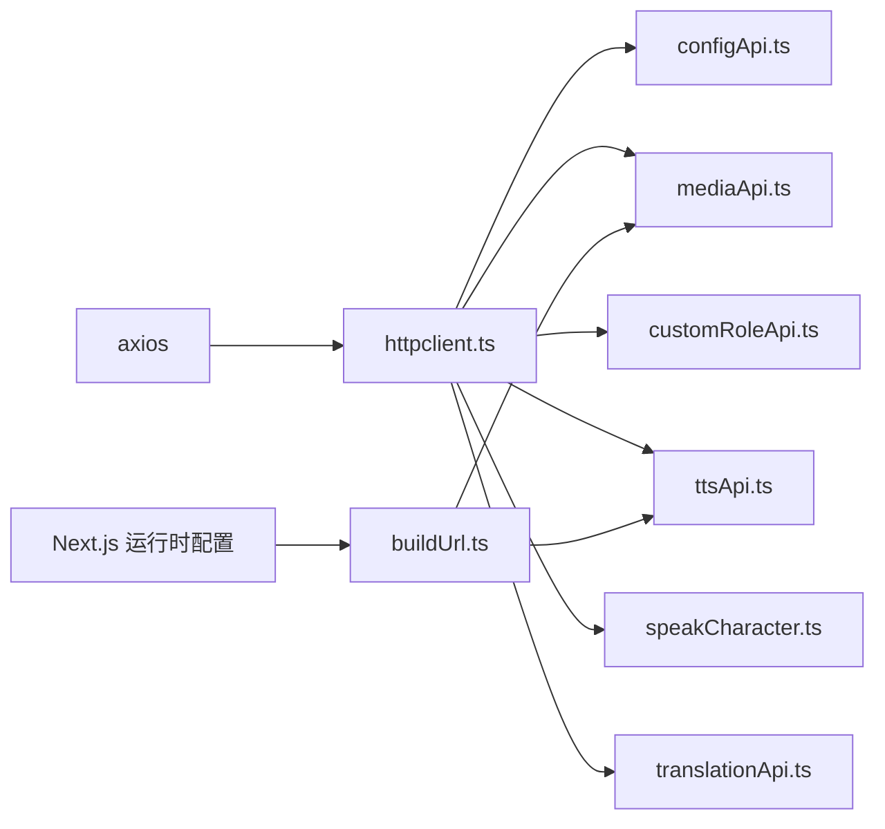

# HTTP客户端封装

<cite>
**本文引用的文件**
- [httpclient.ts](file://domain-chatvrm/src/features/httpclient/httpclient.ts)
- [mediaApi.ts](file://domain-chatvrm/src/features/media/mediaApi.ts)
- [configApi.ts](file://domain-chatvrm/src/features/config/configApi.ts)
- [customRoleApi.ts](file://domain-chatvrm/src/features/customRole/customRoleApi.ts)
- [speakCharacter.ts](file://domain-chatvrm/src/features/messages/speakCharacter.ts)
- [ttsApi.ts](file://domain-chatvrm/src/features/tts/ttsApi.ts)
- [translationApi.ts](file://domain-chatvrm/src/features/translation/translationApi.ts)
- [openAiChat.ts](file://domain-chatvrm/src/features/chat/openAiChat.ts)
- [buildUrl.ts](file://domain-chatvrm/src/utils/buildUrl.ts)
- [next.config.js](file://domain-chatvrm/next.config.js)
- [package.json](file://domain-chatvrm/package.json)
</cite>

## 目录
1. [简介](#简介)
2. [项目结构](#项目结构)
3. [核心组件](#核心组件)
4. [架构总览](#架构总览)
5. [详细组件分析](#详细组件分析)
6. [依赖关系分析](#依赖关系分析)
7. [性能考虑](#性能考虑)
8. [故障排查指南](#故障排查指南)
9. [结论](#结论)
10. [附录：API调用示例与最佳实践](#附录api调用示例与最佳实践)

## 简介
本文件针对前端HTTP客户端封装模块进行系统化技术文档整理，重点覆盖：
- 基础URL与媒体URL的环境差异化配置
- GET与POST请求的封装方法、请求头与数据序列化策略
- ArrayBuffer响应类型的特殊处理，用于二进制数据（如音频）传输
- 媒体URL构建函数的实现原理与使用场景
- 完整的API调用示例、错误处理策略、超时与重试建议
- 面向开发者的HTTP通信最佳实践与性能优化建议

## 项目结构
该模块位于 domain-chatvrm 前端工程中，采用按功能域分层组织：
- httpclient 封装层：统一管理基础URL、媒体URL、GET/POST与ArrayBuffer请求
- 功能API层：各业务域通过导入httpclient提供的方法发起请求
- 工具层：buildUrl用于构建静态资源URL，结合Next.js运行时配置

图表来源
- [httpclient.ts](file://domain-chatvrm/src/features/httpclient/httpclient.ts#L1-L43)
- [mediaApi.ts](file://domain-chatvrm/src/features/media/mediaApi.ts#L1-L122)
- [configApi.ts](file://domain-chatvrm/src/features/config/configApi.ts#L1-L100)
- [customRoleApi.ts](file://domain-chatvrm/src/features/customRole/customRoleApi.ts#L1-L71)
- [ttsApi.ts](file://domain-chatvrm/src/features/tts/ttsApi.ts#L1-L26)
- [speakCharacter.ts](file://domain-chatvrm/src/features/messages/speakCharacter.ts#L1-L82)
- [translationApi.ts](file://domain-chatvrm/src/features/translation/translationApi.ts#L1-L23)
- [openAiChat.ts](file://domain-chatvrm/src/features/chat/openAiChat.ts#L1-L113)
- [buildUrl.ts](file://domain-chatvrm/src/utils/buildUrl.ts#L1-L16)

章节来源
- [httpclient.ts](file://domain-chatvrm/src/features/httpclient/httpclient.ts#L1-L43)
- [buildUrl.ts](file://domain-chatvrm/src/utils/buildUrl.ts#L1-L16)
- [next.config.js](file://domain-chatvrm/next.config.js#L1-L13)

## 核心组件
- 基础URL与媒体URL
  - 开发环境：基础URL与媒体URL均指向本地后端服务
  - 生产环境：基础URL与媒体URL分别映射到网关代理路径，便于反向代理与跨域处理
  - 未识别环境将抛出异常，避免误配置导致的请求失败
- GET请求封装
  - 统一通过axios发起GET请求，返回response.data
  - 调用方负责校验响应码并处理业务错误
- POST请求封装
  - 统一通过axios发起POST请求，返回response.data
  - 调用方负责校验响应码并处理业务错误
- ArrayBuffer请求封装
  - 通过设置responseType为'arraybuffer'获取二进制数据
  - 适用于音频等二进制资源下载与播放
- 媒体URL构建
  - 将mediaUrl与相对路径拼接，生成可直接访问的媒体资源URL
  - 结合业务场景选择使用buildMediaUrl或buildUrl（静态资源）

章节来源
- [httpclient.ts](file://domain-chatvrm/src/features/httpclient/httpclient.ts#L1-L43)

## 架构总览
下图展示了HTTP客户端封装与各业务API之间的交互关系，以及媒体URL构建的参与位置。

图表来源
- [httpclient.ts](file://domain-chatvrm/src/features/httpclient/httpclient.ts#L1-L43)
- [mediaApi.ts](file://domain-chatvrm/src/features/media/mediaApi.ts#L1-L122)
- [configApi.ts](file://domain-chatvrm/src/features/config/configApi.ts#L1-L100)
- [customRoleApi.ts](file://domain-chatvrm/src/features/customRole/customRoleApi.ts#L1-L71)
- [ttsApi.ts](file://domain-chatvrm/src/features/tts/ttsApi.ts#L1-L26)
- [speakCharacter.ts](file://domain-chatvrm/src/features/messages/speakCharacter.ts#L1-L82)
- [translationApi.ts](file://domain-chatvrm/src/features/translation/translationApi.ts#L1-L23)
- [openAiChat.ts](file://domain-chatvrm/src/features/chat/openAiChat.ts#L1-L113)
- [buildUrl.ts](file://domain-chatvrm/src/utils/buildUrl.ts#L1-L16)

## 详细组件分析

### HTTP客户端封装类图

图表来源
- [httpclient.ts](file://domain-chatvrm/src/features/httpclient/httpclient.ts#L21-L43)

章节来源
- [httpclient.ts](file://domain-chatvrm/src/features/httpclient/httpclient.ts#L1-L43)

### GET请求封装流程
- 输入参数：endpoint（相对路径）、headers（请求头）
- 处理逻辑：拼接baseUrl与endpoint，发起GET请求，返回response.data
- 错误处理：由调用方检查响应码并抛出错误

图表来源
- [httpclient.ts](file://domain-chatvrm/src/features/httpclient/httpclient.ts#L35-L39)

章节来源
- [httpclient.ts](file://domain-chatvrm/src/features/httpclient/httpclient.ts#L35-L39)

### POST请求封装流程
- 输入参数：endpoint（相对路径）、headers（请求头）、data（请求体）
- 处理逻辑：拼接baseUrl与endpoint，发起POST请求，返回response.data
- 错误处理：由调用方检查响应码并抛出错误

图表来源
- [httpclient.ts](file://domain-chatvrm/src/features/httpclient/httpclient.ts#L21-L25)

章节来源
- [httpclient.ts](file://domain-chatvrm/src/features/httpclient/httpclient.ts#L21-L25)

### ArrayBuffer请求封装流程
- 输入参数：endpoint（相对路径）、headers（请求头）、data（请求体）
- 处理逻辑：设置responseType为'arraybuffer'，返回ArrayBuffer
- 典型用途：音频下载与播放

图表来源
- [httpclient.ts](file://domain-chatvrm/src/features/httpclient/httpclient.ts#L27-L33)
- [speakCharacter.ts](file://domain-chatvrm/src/features/messages/speakCharacter.ts#L79-L81)

章节来源
- [httpclient.ts](file://domain-chatvrm/src/features/httpclient/httpclient.ts#L27-L33)
- [speakCharacter.ts](file://domain-chatvrm/src/features/messages/speakCharacter.ts#L79-L81)

### 媒体URL构建流程
- 输入参数：相对媒体路径
- 处理逻辑：拼接mediaUrl与相对路径，生成可访问的媒体URL
- 使用场景：图片、音频等资源的展示与播放

图表来源
- [httpclient.ts](file://domain-chatvrm/src/features/httpclient/httpclient.ts#L41-L43)

章节来源
- [httpclient.ts](file://domain-chatvrm/src/features/httpclient/httpclient.ts#L41-L43)

### 环境与URL配置流程
- 环境判断：基于NODE_ENV选择开发或生产配置
- 开发环境：基础URL与媒体URL指向本地后端
- 生产环境：基础URL与媒体URL映射到网关代理路径
- 未知环境：抛出异常，防止误配置

图表来源
- [httpclient.ts](file://domain-chatvrm/src/features/httpclient/httpclient.ts#L5-L19)

章节来源
- [httpclient.ts](file://domain-chatvrm/src/features/httpclient/httpclient.ts#L5-L19)

### 静态资源URL构建（buildUrl）
- 作用：在某些部署环境下（如GitHub Pages），需要在URL前缀添加仓库名
- 实现：读取Next.js运行时配置publicRuntimeConfig.root，并与传入路径拼接

图表来源
- [buildUrl.ts](file://domain-chatvrm/src/utils/buildUrl.ts#L7-L15)
- [next.config.js](file://domain-chatvrm/next.config.js#L7-L9)

章节来源
- [buildUrl.ts](file://domain-chatvrm/src/utils/buildUrl.ts#L1-L16)
- [next.config.js](file://domain-chatvrm/next.config.js#L1-L13)

## 依赖关系分析
- 模块内聚性
  - httpclient.ts高度内聚，集中处理所有HTTP请求封装与URL构建
- 模块耦合性
  - 各业务API仅依赖httpclient.ts导出的方法，耦合度低
  - buildUrl.ts作为通用工具被媒体与TTS等模块复用
- 外部依赖
  - axios：HTTP请求库
  - Next.js：运行时配置与静态资源前缀支持

图表来源
- [httpclient.ts](file://domain-chatvrm/src/features/httpclient/httpclient.ts#L1-L2)
- [buildUrl.ts](file://domain-chatvrm/src/utils/buildUrl.ts#L1-L2)
- [mediaApi.ts](file://domain-chatvrm/src/features/media/mediaApi.ts#L1-L2)
- [ttsApi.ts](file://domain-chatvrm/src/features/tts/ttsApi.ts#L1-L2)
- [speakCharacter.ts](file://domain-chatvrm/src/features/messages/speakCharacter.ts#L6-L7)
- [next.config.js](file://domain-chatvrm/next.config.js#L7-L9)

章节来源
- [httpclient.ts](file://domain-chatvrm/src/features/httpclient/httpclient.ts#L1-L43)
- [buildUrl.ts](file://domain-chatvrm/src/utils/buildUrl.ts#L1-L16)
- [mediaApi.ts](file://domain-chatvrm/src/features/media/mediaApi.ts#L1-L122)
- [ttsApi.ts](file://domain-chatvrm/src/features/tts/ttsApi.ts#L1-L26)
- [speakCharacter.ts](file://domain-chatvrm/src/features/messages/speakCharacter.ts#L1-L82)
- [next.config.js](file://domain-chatvrm/next.config.js#L1-L13)

## 性能考虑
- 请求合并与节流
  - 在语音播放流程中，对连续请求进行节流与串行化，避免短时间内大量并发请求
- 响应缓存
  - 对于不频繁变化的静态资源，可在上层增加缓存策略
- 二进制数据处理
  - 使用ArrayBuffer减少中间转换开销；在播放前确保解码器可用
- 超时与重试
  - 当前封装未内置超时与重试逻辑，建议在调用方或上层中间件中补充
- 网络优化
  - 生产环境使用网关代理路径，减少跨域与代理链路复杂度

[本节为通用指导，无需列出章节来源]

## 故障排查指南
- 环境配置错误
  - 症状：请求失败或返回未知环境异常
  - 排查：确认NODE_ENV是否为development或production
- 响应码校验
  - 症状：业务逻辑异常但网络请求成功
  - 排查：检查各API返回的code字段，非200时抛出错误
- 媒体URL不可访问
  - 症状：图片或音频无法加载
  - 排查：确认buildMediaUrl与buildUrl的使用场景正确；核对mediaUrl与静态资源路径
- 二进制数据播放失败
  - 症状：ArrayBuffer无法播放
  - 排查：确认responseType为'arraybuffer'；检查浏览器解码器与音频格式兼容性

章节来源
- [httpclient.ts](file://domain-chatvrm/src/features/httpclient/httpclient.ts#L5-L19)
- [mediaApi.ts](file://domain-chatvrm/src/features/media/mediaApi.ts#L20-L51)
- [ttsApi.ts](file://domain-chatvrm/src/features/tts/ttsApi.ts#L11-L25)
- [speakCharacter.ts](file://domain-chatvrm/src/features/messages/speakCharacter.ts#L79-L81)

## 结论
该HTTP客户端封装模块以简洁的方式实现了环境差异化配置、统一的GET/POST与ArrayBuffer请求封装，并提供了媒体URL构建能力。通过与业务API的低耦合配合，满足了多场景下的HTTP通信需求。建议后续增强超时与重试机制，并完善日志与监控以便问题定位。

[本节为总结性内容，无需列出章节来源]

## 附录：API调用示例与最佳实践

### 环境变量与URL配置
- 开发环境：基础URL与媒体URL指向本地后端
- 生产环境：基础URL与媒体URL映射到网关代理路径
- 未知环境：抛出异常，避免误配置

章节来源
- [httpclient.ts](file://domain-chatvrm/src/features/httpclient/httpclient.ts#L5-L19)

### GET请求示例
- 配置请求头：Content-Type为application/json
- 发起请求：调用getRequest('/chatbot/config/get', headers)
- 错误处理：若响应码非200，抛出错误

章节来源
- [configApi.ts](file://domain-chatvrm/src/features/config/configApi.ts#L68-L80)

### POST请求示例
- 配置请求头：Content-Type为application/json
- 组装请求体：包含业务参数的对象
- 发起请求：调用postRequest('/chatbot/chat', headers, body)
- 错误处理：若响应码非200，抛出错误

章节来源
- [openAiChat.ts](file://domain-chatvrm/src/features/chat/openAiChat.ts#L90-L110)
- [customRoleApi.ts](file://domain-chatvrm/src/features/customRole/customRoleApi.ts#L35-L45)

### POST上传文件示例
- 配置请求头：Content-Type为multipart/form-data
- 组装请求体：FormData对象
- 发起请求：调用postRequest('/chatbot/config/background/upload', headers, formData)
- 错误处理：若响应码非200，抛出错误

章节来源
- [mediaApi.ts](file://domain-chatvrm/src/features/media/mediaApi.ts#L31-L40)

### ArrayBuffer响应示例
- 配置请求头：Content-Type为application/json
- 设置responseType为'arraybuffer'
- 发起请求：调用postRequestArraybuffer('/speech/tts/generate', headers, body)
- 返回：ArrayBuffer，用于音频播放

章节来源
- [speakCharacter.ts](file://domain-chatvrm/src/features/messages/speakCharacter.ts#L79-L81)
- [httpclient.ts](file://domain-chatvrm/src/features/httpclient/httpclient.ts#L27-L33)

### 媒体URL构建示例
- 媒体资源：使用buildMediaUrl拼接mediaUrl与相对路径
- 静态资源：使用buildUrl拼接publicRuntimeConfig.root与相对路径

章节来源
- [mediaApi.ts](file://domain-chatvrm/src/features/media/mediaApi.ts#L109-L121)
- [ttsApi.ts](file://domain-chatvrm/src/features/tts/ttsApi.ts#L1-L26)
- [buildUrl.ts](file://domain-chatvrm/src/utils/buildUrl.ts#L7-L15)

### 错误处理策略
- 统一校验响应码：非200时抛出错误
- 明确错误信息：在业务层提供可读的错误提示
- 异常捕获：在调用方使用try/catch处理Promise拒绝

章节来源
- [mediaApi.ts](file://domain-chatvrm/src/features/media/mediaApi.ts#L25-L27)
- [configApi.ts](file://domain-chatvrm/src/features/config/configApi.ts#L75-L77)

### 超时与重试建议
- 超时：在调用方或上层中间件中设置请求超时时间
- 重试：对幂等请求（如GET）进行有限次数的指数退避重试
- 限流：对高频请求进行节流或队列化处理（参考语音播放流程）

章节来源
- [speakCharacter.ts](file://domain-chatvrm/src/features/messages/speakCharacter.ts#L23-L47)

### 最佳实践
- 请求头规范：统一使用application/json或multipart/form-data
- 数据序列化：POST请求体为JSON对象或FormData
- 响应解析：统一返回response.data，业务层再做二次校验
- URL构建：媒体资源使用buildMediaUrl，静态资源使用buildUrl
- 环境隔离：严格区分development与production配置，避免误用

章节来源
- [httpclient.ts](file://domain-chatvrm/src/features/httpclient/httpclient.ts#L21-L43)
- [mediaApi.ts](file://domain-chatvrm/src/features/media/mediaApi.ts#L109-L121)
- [ttsApi.ts](file://domain-chatvrm/src/features/tts/ttsApi.ts#L11-L25)