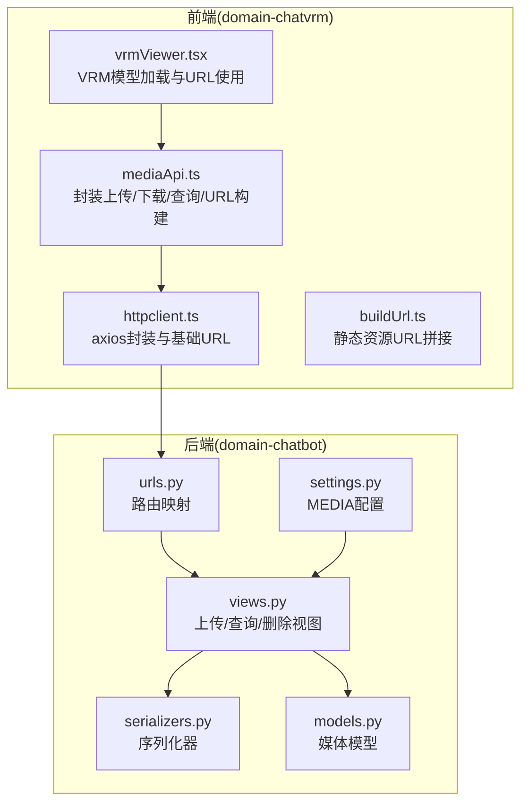
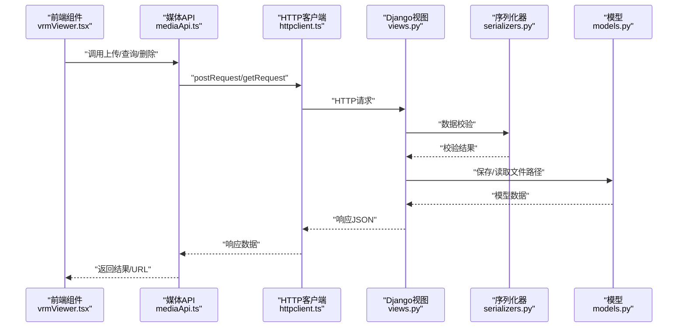
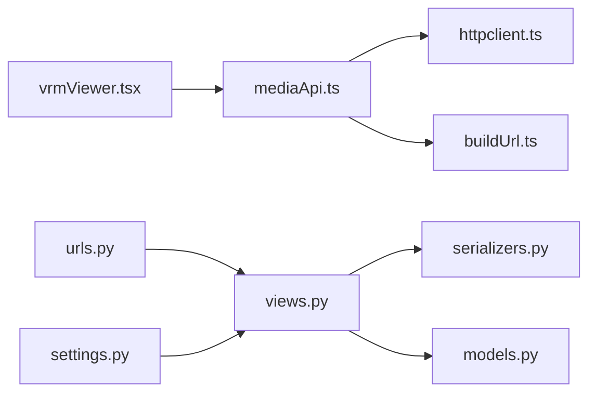

# 媒体资源API

<cite>
**本文档引用的文件**
- [mediaApi.ts](file://domain-chatvrm/src/features/media/mediaApi.ts)
- [httpclient.ts](file://domain-chatvrm/src/features/httpclient/httpclient.ts)
- [buildUrl.ts](file://domain-chatvrm/src/utils/buildUrl.ts)
- [views.py](file://domain-chatbot/apps/chatbot/views.py)
- [serializers.py](file://domain-chatbot/apps/chatbot/serializers.py)
- [models.py](file://domain-chatbot/apps/chatbot/models.py)
- [urls.py](file://domain-chatbot/apps/chatbot/urls.py)
- [settings.py](file://domain-chatbot/VirtualWife/settings.py)
- [vrmViewer.tsx](file://domain-chatvrm/src/components/vrmViewer.tsx)
</cite>

## 目录
1. [简介](#简介)
2. [项目结构](#项目结构)
3. [核心组件](#核心组件)
4. [架构总览](#架构总览)
5. [详细组件分析](#详细组件分析)
6. [依赖关系分析](#依赖关系分析)
7. [性能考虑](#性能考虑)
8. [故障排查指南](#故障排查指南)
9. [结论](#结论)
10. [附录](#附录)

## 简介
本文件为媒体资源API模块的技术文档，聚焦于媒体文件的上传、下载、URL构建与管理、以及前端展示流程。当前仓库中媒体资源API主要由前端特性层封装（domain-chatvrm）与后端Django DRF接口（domain-chatbot）共同组成，覆盖背景图与VRM模型两类媒体资源的增删查与上传流程，并通过统一的HTTP客户端进行请求转发。

该文档将：
- 深入说明媒体文件上传/下载实现与安全校验现状
- 介绍进度跟踪机制的实现现状与扩展建议
- 解释断点续传功能的实现现状与改造方向
- 文档化媒体URL的构建与管理（含CDN/代理路径）
- 说明媒体文件的预处理能力现状与可选方案
- 提供媒体API的完整使用示例与最佳实践

## 项目结构
媒体资源API涉及前后端协作的关键文件如下：
- 前端特性层（domain-chatvrm）
  - 媒体API封装：features/media/mediaApi.ts
  - HTTP客户端：features/httpclient/httpclient.ts
  - URL工具：utils/buildUrl.ts
  - 前端组件使用示例：components/vrmViewer.tsx
- 后端服务（domain-chatbot）
  - 视图函数：apps/chatbot/views.py
  - 序列化器：apps/chatbot/serializers.py
  - 模型定义：apps/chatbot/models.py
  - 路由配置：apps/chatbot/urls.py
  - Django设置：VirtualWife/settings.py

图表来源
- [mediaApi.ts](file://domain-chatvrm/src/features/media/mediaApi.ts#L1-L122)
- [httpclient.ts](file://domain-chatvrm/src/features/httpclient/httpclient.ts#L1-L43)
- [buildUrl.ts](file://domain-chatvrm/src/utils/buildUrl.ts#L1-L16)
- [vrmViewer.tsx](file://domain-chatvrm/src/components/vrmViewer.tsx#L1-L59)
- [views.py](file://domain-chatbot/apps/chatbot/views.py#L188-L345)
- [serializers.py](file://domain-chatbot/apps/chatbot/serializers.py#L11-L36)
- [models.py](file://domain-chatbot/apps/chatbot/models.py#L72-L92)
- [urls.py](file://domain-chatbot/apps/chatbot/urls.py#L17-L24)
- [settings.py](file://domain-chatbot/VirtualWife/settings.py#L102-L103)

章节来源
- [mediaApi.ts](file://domain-chatvrm/src/features/media/mediaApi.ts#L1-L122)
- [httpclient.ts](file://domain-chatvrm/src/features/httpclient/httpclient.ts#L1-L43)
- [buildUrl.ts](file://domain-chatvrm/src/utils/buildUrl.ts#L1-L16)
- [views.py](file://domain-chatbot/apps/chatbot/views.py#L188-L345)
- [serializers.py](file://domain-chatbot/apps/chatbot/serializers.py#L11-L36)
- [models.py](file://domain-chatbot/apps/chatbot/models.py#L72-L92)
- [urls.py](file://domain-chatbot/apps/chatbot/urls.py#L17-L24)
- [settings.py](file://domain-chatbot/VirtualWife/settings.py#L102-L103)

## 核心组件
- 前端媒体API封装（mediaApi.ts）
  - 提供背景图与VRM模型的上传、删除、查询等方法
  - 封装媒体URL构建与类型区分逻辑
- 前端HTTP客户端（httpclient.ts）
  - 基于axios封装post/get请求，支持ArrayBuffer响应
  - 根据环境变量选择基础URL（开发/生产）
  - 提供媒体URL拼接工具
- URL工具（buildUrl.ts）
  - 在Next.js运行时根据publicRuntimeConfig.root拼接静态资源URL
- 后端视图（views.py）
  - 实现上传、查询、删除接口，使用序列化器进行数据校验
  - 使用Django模型存储文件路径与元数据
- 序列化器（serializers.py）
  - 定义上传文件字段与返回字段
- 模型（models.py）
  - 定义背景图与VRM模型的数据结构与文件字段
- 路由（urls.py）
  - 映射媒体资源相关API端点
- Django设置（settings.py）
  - 配置MEDIA_URL与MEDIA_ROOT，启用CORS

章节来源
- [mediaApi.ts](file://domain-chatvrm/src/features/media/mediaApi.ts#L20-L121)
- [httpclient.ts](file://domain-chatvrm/src/features/httpclient/httpclient.ts#L21-L43)
- [buildUrl.ts](file://domain-chatvrm/src/utils/buildUrl.ts#L7-L15)
- [views.py](file://domain-chatbot/apps/chatbot/views.py#L188-L345)
- [serializers.py](file://domain-chatbot/apps/chatbot/serializers.py#L11-L36)
- [models.py](file://domain-chatbot/apps/chatbot/models.py#L72-L92)
- [urls.py](file://domain-chatbot/apps/chatbot/urls.py#L17-L24)
- [settings.py](file://domain-chatbot/VirtualWife/settings.py#L102-L103)

## 架构总览
媒体资源API采用“前端特性层 + 后端DRF接口”的分层设计：
- 前端通过mediaApi.ts调用httpclient.ts发起HTTP请求
- 请求路由至Django后端的相应视图函数
- 视图函数使用序列化器进行数据校验，使用模型持久化文件路径与元数据
- 前端根据返回结果更新UI或触发后续操作

图表来源
- [vrmViewer.tsx](file://domain-chatvrm/src/components/vrmViewer.tsx#L20-L22)
- [mediaApi.ts](file://domain-chatvrm/src/features/media/mediaApi.ts#L31-L106)
- [httpclient.ts](file://domain-chatvrm/src/features/httpclient/httpclient.ts#L21-L39)
- [views.py](file://domain-chatbot/apps/chatbot/views.py#L188-L345)
- [serializers.py](file://domain-chatbot/apps/chatbot/serializers.py#L11-L36)
- [models.py](file://domain-chatbot/apps/chatbot/models.py#L72-L92)

## 详细组件分析

### 前端媒体API封装（mediaApi.ts）
- 功能概览
  - 背景图：上传、删除、查询
  - VRM模型：上传、删除、查询（用户/系统）
  - URL构建：generateMediaUrl用于媒体URL拼接；buildVrmModelUrl根据类型选择不同拼接策略
- 错误处理
  - 统一检查响应码，非200抛出异常
- 上传流程要点
  - 使用FormData作为multipart/form-data提交
  - 上传成功后返回响应数据

章节来源
- [mediaApi.ts](file://domain-chatvrm/src/features/media/mediaApi.ts#L20-L121)

### 前端HTTP客户端（httpclient.ts）
- 环境配置
  - 开发环境：本地8000端口
  - 生产环境：通过反向代理访问/api/chatbot与/api/media
- 请求封装
  - postRequest/postRequestArraybuffer/getRequest
  - 支持ArrayBuffer响应（便于二进制下载）
- URL拼接
  - buildMediaUrl用于媒体资源URL拼接

章节来源
- [httpclient.ts](file://domain-chatvrm/src/features/httpclient/httpclient.ts#L11-L43)

### URL工具（buildUrl.ts）
- 作用
  - 在Next.js运行时根据publicRuntimeConfig.root拼接静态资源URL
- 适用场景
  - 非媒体资源的静态资源URL构建

章节来源
- [buildUrl.ts](file://domain-chatvrm/src/utils/buildUrl.ts#L7-L15)

### 后端视图与序列化（views.py, serializers.py）
- 上传接口
  - 背景图上传：校验并保存图片文件
  - VRM模型上传：校验并保存VRM文件
  - 角色安装包上传：解压安装并生成角色
- 查询接口
  - 背景图列表查询
  - 用户VRM模型列表查询
  - 系统VRM模型列表查询（硬编码返回）
- 删除接口
  - 删除数据库记录并移除磁盘文件
- 序列化器
  - UploadedImageSerializer/UploadedVrmModelSerializer/UploadedRolePackageModelSerializer
- 文件存储
  - MEDIA_ROOT下按子目录存储文件

章节来源
- [views.py](file://domain-chatbot/apps/chatbot/views.py#L188-L345)
- [serializers.py](file://domain-chatbot/apps/chatbot/serializers.py#L11-L36)

### 模型与路由（models.py, urls.py）
- 模型
  - BackgroundImageModel：背景图字段与路径
  - VrmModel：VRM模型字段与路径
  - RolePackageModel：角色安装包字段与路径
- 路由
  - 媒体资源相关端点映射

章节来源
- [models.py](file://domain-chatbot/apps/chatbot/models.py#L72-L92)
- [urls.py](file://domain-chatbot/apps/chatbot/urls.py#L17-L24)

### 前端组件使用示例（vrmViewer.tsx）
- 使用buildVrmModelUrl根据类型选择URL拼接策略
- 从全局配置获取VRM模型URL并加载

章节来源
- [vrmViewer.tsx](file://domain-chatvrm/src/components/vrmViewer.tsx#L20-L22)

## 依赖关系分析
- 前端依赖
  - mediaApi.ts依赖httpclient.ts与buildUrl.ts
  - vrmViewer.tsx依赖mediaApi.ts与配置API
- 后端依赖
  - views.py依赖serializers.py与models.py
  - settings.py提供MEDIA配置
- 路由依赖
  - urls.py将前端请求映射到后端视图

图表来源
- [mediaApi.ts](file://domain-chatvrm/src/features/media/mediaApi.ts#L1-L122)
- [httpclient.ts](file://domain-chatvrm/src/features/httpclient/httpclient.ts#L1-L43)
- [buildUrl.ts](file://domain-chatvrm/src/utils/buildUrl.ts#L1-L16)
- [vrmViewer.tsx](file://domain-chatvrm/src/components/vrmViewer.tsx#L1-L59)
- [views.py](file://domain-chatbot/apps/chatbot/views.py#L188-L345)
- [serializers.py](file://domain-chatbot/apps/chatbot/serializers.py#L11-L36)
- [models.py](file://domain-chatbot/apps/chatbot/models.py#L72-L92)
- [urls.py](file://domain-chatbot/apps/chatbot/urls.py#L17-L24)
- [settings.py](file://domain-chatbot/VirtualWife/settings.py#L102-L103)

章节来源
- [mediaApi.ts](file://domain-chatvrm/src/features/media/mediaApi.ts#L1-L122)
- [httpclient.ts](file://domain-chatvrm/src/features/httpclient/httpclient.ts#L1-L43)
- [buildUrl.ts](file://domain-chatvrm/src/utils/buildUrl.ts#L1-L16)
- [vrmViewer.tsx](file://domain-chatvrm/src/components/vrmViewer.tsx#L1-L59)
- [views.py](file://domain-chatbot/apps/chatbot/views.py#L188-L345)
- [serializers.py](file://domain-chatbot/apps/chatbot/serializers.py#L11-L36)
- [models.py](file://domain-chatbot/apps/chatbot/models.py#L72-L92)
- [urls.py](file://domain-chatbot/apps/chatbot/urls.py#L17-L24)
- [settings.py](file://domain-chatbot/VirtualWife/settings.py#L102-L103)

## 性能考虑
- 上传性能
  - 当前前端未实现分片与断点续传，建议在大文件场景引入分片上传与断点续传机制
  - 合理设置后端文件大小限制与超时时间
- 下载性能
  - 后端可结合CDN与缓存策略提升静态资源访问速度
  - 前端可利用ArrayBuffer响应进行二进制流式处理
- 并发与重试
  - 前端可在网络不稳定时增加重试与退避策略
- 前端渲染
  - VRM模型加载前可加入占位图与加载指示，提升用户体验

## 故障排查指南
- 常见问题
  - 上传失败：检查序列化器校验是否通过，确认文件类型与大小
  - URL无法访问：确认MEDIA_URL/MEDIA_ROOT配置与部署路径一致
  - CORS跨域：确认CORS_ALLOW_ALL_ORIGINS/CORS_ALLOW_HEADERS设置
- 排查步骤
  - 查看后端日志与序列化器错误输出
  - 使用浏览器开发者工具检查请求与响应
  - 确认文件是否正确写入MEDIA_ROOT指定目录

章节来源
- [views.py](file://domain-chatbot/apps/chatbot/views.py#L188-L345)
- [serializers.py](file://domain-chatbot/apps/chatbot/serializers.py#L11-L36)
- [settings.py](file://domain-chatbot/VirtualWife/settings.py#L67-L69)

## 结论
当前媒体资源API已具备基础的上传、查询与删除能力，并通过统一的HTTP客户端与URL工具完成前后端交互。对于断点续传、进度跟踪、格式转换与CDN集成等高级需求，可在现有架构上进行扩展与增强，以满足更大规模与更高性能的媒体资源管理场景。

## 附录

### 媒体文件上传/下载实现与安全检查现状
- 上传
  - 前端使用FormData提交multipart/form-data
  - 后端使用序列化器进行数据校验
  - 文件存储于MEDIA_ROOT下的子目录
- 下载
  - 通过MEDIA_URL拼接访问
  - 前端可使用ArrayBuffer响应进行二进制处理
- 安全检查
  - 当前未见显式的文件类型白名单与大小限制校验
  - 建议在后端增加文件类型与大小限制，并对文件内容进行二次校验

章节来源
- [mediaApi.ts](file://domain-chatvrm/src/features/media/mediaApi.ts#L31-L84)
- [views.py](file://domain-chatbot/apps/chatbot/views.py#L188-L246)
- [serializers.py](file://domain-chatbot/apps/chatbot/serializers.py#L11-L36)
- [settings.py](file://domain-chatbot/VirtualWife/settings.py#L102-L103)

### 进度跟踪机制现状与建议
- 现状
  - 前端未实现上传/下载进度回调
- 建议
  - 在httpclient.ts中基于axios的onUploadProgress/onDownloadProgress实现进度回调
  - 在mediaApi.ts中暴露进度事件供组件订阅

章节来源
- [httpclient.ts](file://domain-chatvrm/src/features/httpclient/httpclient.ts#L21-L39)

### 断点续传功能现状与改造方向
- 现状
  - 未实现分片与断点续传
- 建议
  - 前端：将大文件切分为固定大小的块，记录已上传块索引
  - 后端：提供分片接收、合并与去重接口
  - 状态管理：在数据库或缓存中记录上传会话状态

章节来源
- [mediaApi.ts](file://domain-chatvrm/src/features/media/mediaApi.ts#L31-L84)
- [views.py](file://domain-chatbot/apps/chatbot/views.py#L188-L246)

### 媒体URL构建与管理（CDN/缓存/防盗链）
- URL构建
  - generateMediaUrl用于媒体资源URL拼接
  - buildVrmModelUrl根据类型选择不同拼接策略
- CDN集成
  - 建议将MEDIA_URL指向CDN域名，并在生产环境配置缓存策略
- 缓存策略
  - 静态资源可设置长缓存，版本化文件名避免缓存污染
- 防盗链
  - 可在CDN侧配置Referer白名单或Token鉴权

章节来源
- [mediaApi.ts](file://domain-chatvrm/src/features/media/mediaApi.ts#L109-L121)
- [buildUrl.ts](file://domain-chatvrm/src/utils/buildUrl.ts#L7-L15)
- [settings.py](file://domain-chatbot/VirtualWife/settings.py#L102-L103)

### 媒体文件预处理（压缩/转码/格式转换）
- 现状
  - 未见预处理逻辑
- 建议
  - 在上传后异步执行转码/压缩任务，生成多规格资源
  - 使用队列或消息中间件进行任务编排

章节来源
- [views.py](file://domain-chatbot/apps/chatbot/views.py#L249-L293)

### 媒体API使用示例与最佳实践
- 示例流程
  - 上传背景图：构造FormData并调用上传方法，处理响应码
  - 查询列表：调用查询接口获取数据
  - 删除资源：调用删除接口并清理磁盘文件
  - 加载VRM：使用buildVrmModelUrl构建URL并加载
- 最佳实践
  - 前端：对输入进行基本校验，提供错误提示与重试
  - 后端：严格控制文件类型与大小，记录日志
  - 部署：配置CDN与缓存，开启CORS与HTTPS

章节来源
- [mediaApi.ts](file://domain-chatvrm/src/features/media/mediaApi.ts#L31-L106)
- [vrmViewer.tsx](file://domain-chatvrm/src/components/vrmViewer.tsx#L20-L22)
- [views.py](file://domain-chatbot/apps/chatbot/views.py#L188-L345)
- [settings.py](file://domain-chatbot/VirtualWife/settings.py#L67-L69)