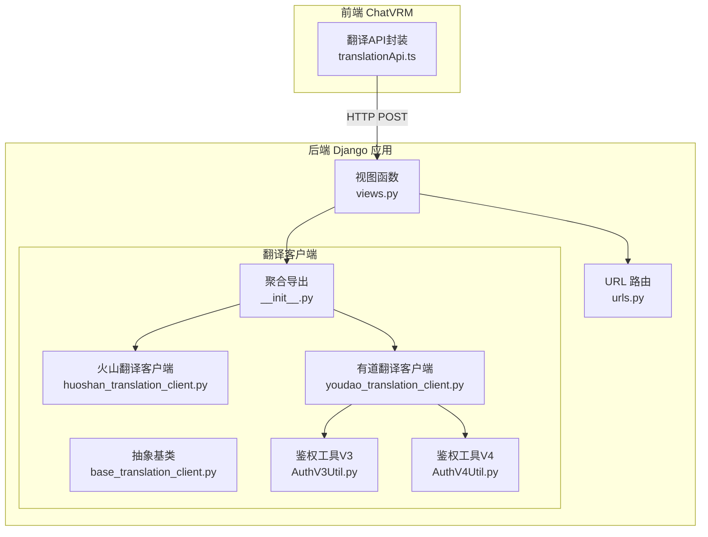
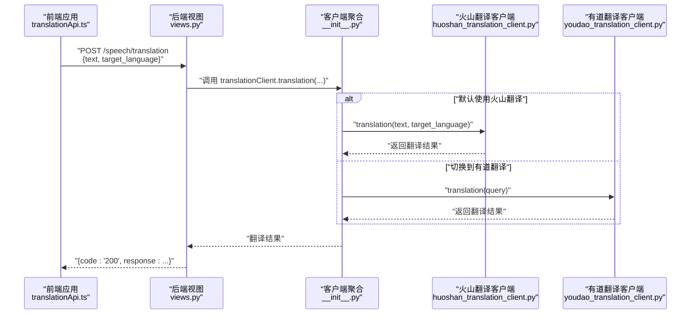
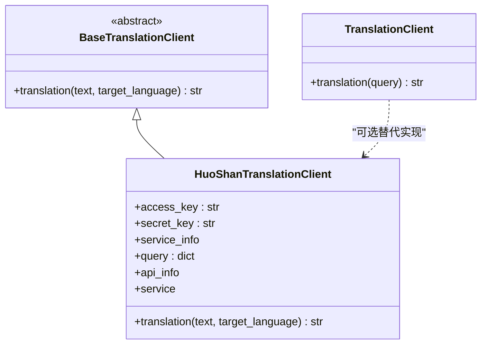
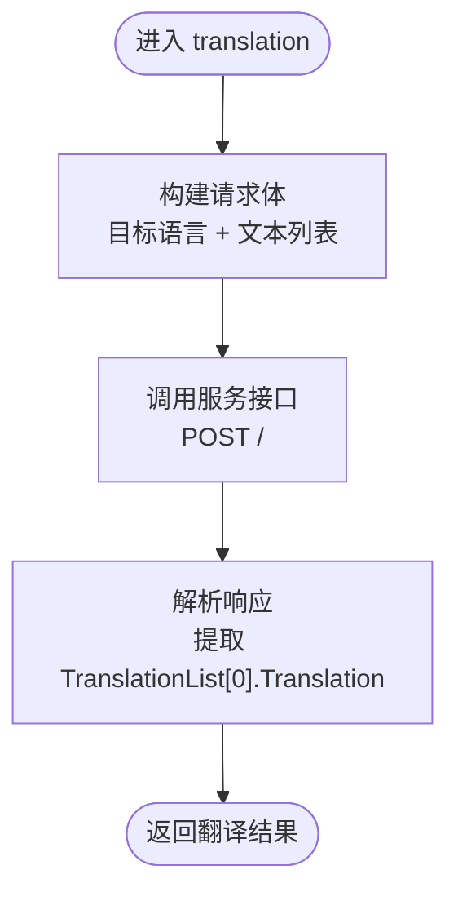
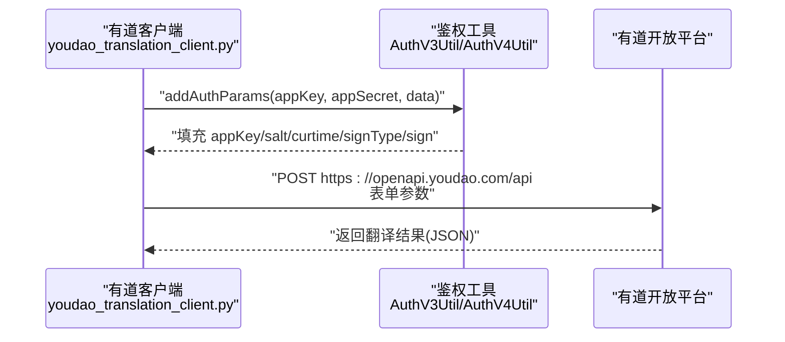
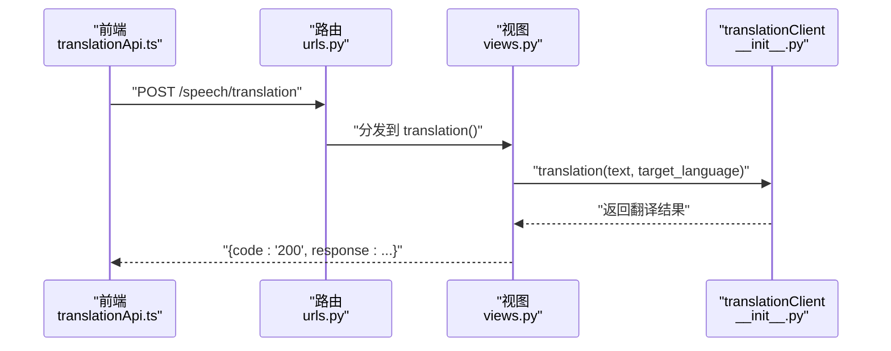
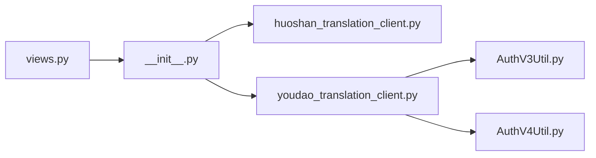

# 翻译服务API

<cite>
**本文引用的文件**
- [domain-chatbot/apps/speech/translation/base_translation_client.py](file://domain-chatbot/apps/speech/translation/base_translation_client.py)
- [domain-chatbot/apps/speech/translation/huoshan/huoshan_translation_client.py](file://domain-chatbot/apps/speech/translation/huoshan/huoshan_translation_client.py)
- [domain-chatbot/apps/speech/translation/youdao/youdao_translation_client.py](file://domain-chatbot/apps/speech/translation/youdao/youdao_translation_client.py)
- [domain-chatbot/apps/speech/translation/youdao/AuthV3Util.py](file://domain-chatbot/apps/speech/translation/youdao/AuthV3Util.py)
- [domain-chatbot/apps/speech/translation/youdao/AuthV4Util.py](file://domain-chatbot/apps/speech/translation/youdao/AuthV4Util.py)
- [domain-chatbot/apps/speech/translation/__init__.py](file://domain-chatbot/apps/speech/translation/__init__.py)
- [domain-chatbot/apps/speech/views.py](file://domain-chatbot/apps/speech/views.py)
- [domain-chatbot/apps/speech/urls.py](file://domain-chatbot/apps/speech/urls.py)
- [domain-chatvrm/src/features/translation/translationApi.ts](file://domain-chatvrm/src/features/translation/translationApi.ts)
</cite>

## 目录
1. [简介](#简介)
2. [项目结构](#项目结构)
3. [核心组件](#核心组件)
4. [架构总览](#架构总览)
5. [详细组件分析](#详细组件分析)
6. [依赖分析](#依赖分析)
7. [性能考虑](#性能考虑)
8. [故障排查指南](#故障排查指南)
9. [结论](#结论)
10. [附录](#附录)

## 简介
本文件为“翻译服务API”模块的技术文档，聚焦于多语言翻译的实现机制与集成实践。当前仓库中包含两类翻译能力：
- 云端翻译：火山翻译（HuoShan）与有道翻译（YouDao），均通过HTTP接口调用第三方翻译服务。
- 前端翻译API封装：提供调用后端翻译接口的前端方法。

文档将从系统架构、组件关系、数据流、处理逻辑、集成示例、质量控制与优化建议等维度展开，帮助开发者快速理解与扩展翻译能力。

## 项目结构
翻译服务位于后端 Django 应用的 speech 子模块中，前端在 ChatVRM 的 features/translation 中提供调用封装。关键文件如下：
- 后端翻译客户端与视图
  - 抽象基类：[domain-chatbot/apps/speech/translation/base_translation_client.py](file://domain-chatbot/apps/speech/translation/base_translation_client.py#L1-L12)
  - 火山翻译客户端：[domain-chatbot/apps/speech/translation/huoshan/huoshan_translation_client.py](file://domain-chatbot/apps/speech/translation/huoshan/huoshan_translation_client.py#L1-L47)
  - 有道翻译客户端：[domain-chatbot/apps/speech/translation/youdao/youdao_translation_client.py](file://domain-chatbot/apps/speech/translation/youdao/youdao_translation_client.py#L1-L24)
  - 有道鉴权工具（V3/V4）：[domain-chatbot/apps/speech/translation/youdao/AuthV3Util.py](file://domain-chatbot/apps/speech/translation/youdao/AuthV3Util.py#L1-L56)、[domain-chatbot/apps/speech/translation/youdao/AuthV4Util.py](file://domain-chatbot/apps/speech/translation/youdao/AuthV4Util.py#L1-L46)
  - 翻译客户端聚合导出：[domain-chatbot/apps/speech/translation/__init__.py](file://domain-chatbot/apps/speech/translation/__init__.py#L1-L4)
  - 视图与路由：[domain-chatbot/apps/speech/views.py](file://domain-chatbot/apps/speech/views.py#L1-L74)、[domain-chatbot/apps/speech/urls.py](file://domain-chatbot/apps/speech/urls.py#L1-L9)
- 前端翻译API封装
  - [domain-chatvrm/src/features/translation/translationApi.ts](file://domain-chatvrm/src/features/translation/translationApi.ts#L1-L23)

图表来源
- [domain-chatbot/apps/speech/views.py](file://domain-chatbot/apps/speech/views.py#L1-L74)
- [domain-chatbot/apps/speech/urls.py](file://domain-chatbot/apps/speech/urls.py#L1-L9)
- [domain-chatbot/apps/speech/translation/base_translation_client.py](file://domain-chatbot/apps/speech/translation/base_translation_client.py#L1-L12)
- [domain-chatbot/apps/speech/translation/huoshan/huoshan_translation_client.py](file://domain-chatbot/apps/speech/translation/huoshan/huoshan_translation_client.py#L1-L47)
- [domain-chatbot/apps/speech/translation/youdao/youdao_translation_client.py](file://domain-chatbot/apps/speech/translation/youdao/youdao_translation_client.py#L1-L24)
- [domain-chatbot/apps/speech/translation/youdao/AuthV3Util.py](file://domain-chatbot/apps/speech/translation/youdao/AuthV3Util.py#L1-L56)
- [domain-chatbot/apps/speech/translation/youdao/AuthV4Util.py](file://domain-chatbot/apps/speech/translation/youdao/AuthV4Util.py#L1-L46)
- [domain-chatbot/apps/speech/translation/__init__.py](file://domain-chatbot/apps/speech/translation/__init__.py#L1-L4)
- [domain-chatvrm/src/features/translation/translationApi.ts](file://domain-chatvrm/src/features/translation/translationApi.ts#L1-L23)

章节来源
- [domain-chatbot/apps/speech/views.py](file://domain-chatbot/apps/speech/views.py#L1-L74)
- [domain-chatbot/apps/speech/urls.py](file://domain-chatbot/apps/speech/urls.py#L1-L9)
- [domain-chatbot/apps/speech/translation/__init__.py](file://domain-chatbot/apps/speech/translation/__init__.py#L1-L4)

## 核心组件
- 抽象基类：定义统一的翻译接口契约，便于扩展不同供应商的实现。
- 火山翻译客户端：基于火山引擎的翻译服务，通过 ServiceInfo 与 ApiInfo 组织请求，使用 JSON 体提交文本与目标语言。
- 有道翻译客户端：基于有道开放平台，使用鉴权工具生成签名参数，发送 POST 请求获取翻译结果。
- 前端翻译API封装：提供 text 与 target_language 参数，构造 JSON 请求体，调用后端 /speech/translation 接口。
- 视图与路由：接收前端请求，解析参数，调用 translationClient，返回标准响应结构；未捕获异常时返回 500。

章节来源
- [domain-chatbot/apps/speech/translation/base_translation_client.py](file://domain-chatbot/apps/speech/translation/base_translation_client.py#L1-L12)
- [domain-chatbot/apps/speech/translation/huoshan/huoshan_translation_client.py](file://domain-chatbot/apps/speech/translation/huoshan/huoshan_translation_client.py#L1-L47)
- [domain-chatbot/apps/speech/translation/youdao/youdao_translation_client.py](file://domain-chatbot/apps/speech/translation/youdao/youdao_translation_client.py#L1-L24)
- [domain-chatbot/apps/speech/translation/youdao/AuthV3Util.py](file://domain-chatbot/apps/speech/translation/youdao/AuthV3Util.py#L1-L56)
- [domain-chatbot/apps/speech/translation/youdao/AuthV4Util.py](file://domain-chatbot/apps/speech/translation/youdao/AuthV4Util.py#L1-L46)
- [domain-chatbot/apps/speech/translation/__init__.py](file://domain-chatbot/apps/speech/translation/__init__.py#L1-L4)
- [domain-chatbot/apps/speech/views.py](file://domain-chatbot/apps/speech/views.py#L1-L74)
- [domain-chatvrm/src/features/translation/translationApi.ts](file://domain-chatvrm/src/features/translation/translationApi.ts#L1-L23)

## 架构总览
翻译服务采用“前端请求 → 后端视图 → 翻译客户端聚合 → 第三方云翻译服务”的链路。当前默认使用火山翻译客户端作为 translationClient 实例。

图表来源
- [domain-chatbot/apps/speech/views.py](file://domain-chatbot/apps/speech/views.py#L60-L74)
- [domain-chatbot/apps/speech/translation/__init__.py](file://domain-chatbot/apps/speech/translation/__init__.py#L1-L4)
- [domain-chatbot/apps/speech/translation/huoshan/huoshan_translation_client.py](file://domain-chatbot/apps/speech/translation/huoshan/huoshan_translation_client.py#L38-L47)
- [domain-chatbot/apps/speech/translation/youdao/youdao_translation_client.py](file://domain-chatbot/apps/speech/translation/youdao/youdao_translation_client.py#L12-L24)
- [domain-chatvrm/src/features/translation/translationApi.ts](file://domain-chatvrm/src/features/translation/translationApi.ts#L1-L23)

## 详细组件分析

### 抽象基类与客户端聚合
- 抽象基类定义统一的 translation 方法签名，确保不同供应商实现遵循一致接口。
- 客户端聚合导出 translationClient，默认实例化火山翻译客户端，便于在视图中直接调用。

图表来源
- [domain-chatbot/apps/speech/translation/base_translation_client.py](file://domain-chatbot/apps/speech/translation/base_translation_client.py#L1-L12)
- [domain-chatbot/apps/speech/translation/huoshan/huoshan_translation_client.py](file://domain-chatbot/apps/speech/translation/huoshan/huoshan_translation_client.py#L10-L47)
- [domain-chatbot/apps/speech/translation/youdao/youdao_translation_client.py](file://domain-chatbot/apps/speech/translation/youdao/youdao_translation_client.py#L12-L24)

章节来源
- [domain-chatbot/apps/speech/translation/base_translation_client.py](file://domain-chatbot/apps/speech/translation/base_translation_client.py#L1-L12)
- [domain-chatbot/apps/speech/translation/__init__.py](file://domain-chatbot/apps/speech/translation/__init__.py#L1-L4)

### 火山翻译客户端
- 初始化：从环境变量读取访问密钥，构建 ServiceInfo 与 ApiInfo，设置超时与区域信息。
- 翻译流程：组织请求体（目标语言与文本列表），调用服务接口，解析返回的翻译结果字段。
- 特点：面向文本翻译，支持多语种，请求体为 JSON，返回结构包含翻译列表。

图表来源
- [domain-chatbot/apps/speech/translation/huoshan/huoshan_translation_client.py](file://domain-chatbot/apps/speech/translation/huoshan/huoshan_translation_client.py#L38-L47)

章节来源
- [domain-chatbot/apps/speech/translation/huoshan/huoshan_translation_client.py](file://domain-chatbot/apps/speech/translation/huoshan/huoshan_translation_client.py#L1-L47)

### 有道翻译客户端与鉴权
- 有道客户端：固定源语言与目标语言，构造表单参数，附加鉴权参数后发送 POST 请求。
- 鉴权工具：提供 V3 与 V4 两种签名算法，分别对请求内容与随机盐、时间戳进行哈希计算，生成签名字段。
- 注意：当前实现中，有道客户端未在视图层被默认使用，如需启用需修改聚合导出或视图逻辑。

图表来源
- [domain-chatbot/apps/speech/translation/youdao/youdao_translation_client.py](file://domain-chatbot/apps/speech/translation/youdao/youdao_translation_client.py#L12-L24)
- [domain-chatbot/apps/speech/translation/youdao/AuthV3Util.py](file://domain-chatbot/apps/speech/translation/youdao/AuthV3Util.py#L17-L48)
- [domain-chatbot/apps/speech/translation/youdao/AuthV4Util.py](file://domain-chatbot/apps/speech/translation/youdao/AuthV4Util.py#L17-L45)

章节来源
- [domain-chatbot/apps/speech/translation/youdao/youdao_translation_client.py](file://domain-chatbot/apps/speech/translation/youdao/youdao_translation_client.py#L1-L24)
- [domain-chatbot/apps/speech/translation/youdao/AuthV3Util.py](file://domain-chatbot/apps/speech/translation/youdao/AuthV3Util.py#L1-L56)
- [domain-chatbot/apps/speech/translation/youdao/AuthV4Util.py](file://domain-chatbot/apps/speech/translation/youdao/AuthV4Util.py#L1-L46)

### 视图与路由
- 路由：/speech/translation 对应 translation 视图。
- 视图：解析请求体中的 text 与 target_language，调用 translationClient.translation，返回 {code: "200", response: 结果}；异常时返回 500。
- 前端调用：前端 translationApi.ts 提供方法，构造 JSON 请求体，调用后端接口。

图表来源
- [domain-chatbot/apps/speech/urls.py](file://domain-chatbot/apps/speech/urls.py#L1-L9)
- [domain-chatbot/apps/speech/views.py](file://domain-chatbot/apps/speech/views.py#L60-L74)
- [domain-chatbot/apps/speech/translation/__init__.py](file://domain-chatbot/apps/speech/translation/__init__.py#L1-L4)
- [domain-chatvrm/src/features/translation/translationApi.ts](file://domain-chatvrm/src/features/translation/translationApi.ts#L1-L23)

章节来源
- [domain-chatbot/apps/speech/urls.py](file://domain-chatbot/apps/speech/urls.py#L1-L9)
- [domain-chatbot/apps/speech/views.py](file://domain-chatbot/apps/speech/views.py#L60-L74)
- [domain-chatvrm/src/features/translation/translationApi.ts](file://domain-chatvrm/src/features/translation/translationApi.ts#L1-L23)

## 依赖分析
- 组件耦合
  - 视图层仅依赖 translationClient 抽象，通过聚合导出实现具体供应商替换。
  - 火山客户端依赖 volcengine SDK；有道客户端依赖 requests 与鉴权工具。
- 外部依赖
  - 火山引擎翻译服务（域名与凭据）
  - 有道开放平台 API（域名与鉴权）
- 可能的循环依赖
  - 当前模块间为单向依赖（视图 → 客户端聚合 → 具体客户端），无循环依赖迹象。

图表来源
- [domain-chatbot/apps/speech/views.py](file://domain-chatbot/apps/speech/views.py#L1-L74)
- [domain-chatbot/apps/speech/translation/__init__.py](file://domain-chatbot/apps/speech/translation/__init__.py#L1-L4)
- [domain-chatbot/apps/speech/translation/huoshan/huoshan_translation_client.py](file://domain-chatbot/apps/speech/translation/huoshan/huoshan_translation_client.py#L1-L47)
- [domain-chatbot/apps/speech/translation/youdao/youdao_translation_client.py](file://domain-chatbot/apps/speech/translation/youdao/youdao_translation_client.py#L1-L24)
- [domain-chatbot/apps/speech/translation/youdao/AuthV3Util.py](file://domain-chatbot/apps/speech/translation/youdao/AuthV3Util.py#L1-L56)
- [domain-chatbot/apps/speech/translation/youdao/AuthV4Util.py](file://domain-chatbot/apps/speech/translation/youdao/AuthV4Util.py#L1-L46)

章节来源
- [domain-chatbot/apps/speech/views.py](file://domain-chatbot/apps/speech/views.py#L1-L74)
- [domain-chatbot/apps/speech/translation/__init__.py](file://domain-chatbot/apps/speech/translation/__init__.py#L1-L4)

## 性能考虑
- 网络请求开销
  - 火山与有道均为远程 HTTP 调用，建议在网关层或服务侧增加连接池与超时控制，避免阻塞。
- 缓存策略（建议）
  - 缓存键设计：hash(文本 + 目标语言) 或基于内容摘要的键，避免重复翻译相同内容。
  - 过期时间：根据业务场景设定 TTL（如 1 小时），热点内容可缩短过期以提升一致性。
  - 命中率优化：对批量翻译任务进行去重与合并，减少重复请求；对长会话上下文进行片段缓存。
- 并发与限流
  - 对第三方翻译服务进行并发限制与重试退避，防止触发配额限制。
- 本地化与降级
  - 在网络异常时，可返回空结果或兜底文案，并记录日志以便后续补偿处理。

## 故障排查指南
- 常见问题
  - 火山客户端：检查环境变量是否正确（访问密钥、区域等），确认服务域名与版本号。
  - 有道客户端：确认鉴权参数是否正确生成，检查 appKey/appSecret 是否有效，网络是否可达。
  - 视图层：查看日志输出，定位解析请求体失败或调用 translationClient 异常的具体位置。
- 错误码与响应
  - 视图返回标准结构 {code: "200", response: ...}，异常时返回 500；建议在视图层补充更细粒度的错误码与消息。
- 日志与监控
  - 建议在 translationClient 层增加请求耗时、状态码统计与异常堆栈记录，便于定位性能瓶颈与故障根因。

章节来源
- [domain-chatbot/apps/speech/views.py](file://domain-chatbot/apps/speech/views.py#L60-L74)
- [domain-chatbot/apps/speech/translation/huoshan/huoshan_translation_client.py](file://domain-chatbot/apps/speech/translation/huoshan/huoshan_translation_client.py#L19-L36)
- [domain-chatbot/apps/speech/translation/youdao/youdao_translation_client.py](file://domain-chatbot/apps/speech/translation/youdao/youdao_translation_client.py#L6-L9)

## 结论
当前翻译服务已具备清晰的抽象与可替换的客户端实现，支持火山与有道两大云翻译能力。建议在现有基础上完善缓存与降级策略、细化错误码与日志、扩展支持的语言列表与质量评估机制，以满足生产环境的稳定性与可维护性要求。

## 附录

### 翻译API调用流程与参数规范
- 请求
  - 路径：/speech/translation
  - 方法：POST
  - 请求头：Content-Type: application/json
  - 请求体字段：
    - text: 待翻译文本（字符串）
    - target_language: 目标语言代码（字符串）
- 响应
  - 成功：{code: "200", response: 翻译结果字符串}
  - 失败：HTTP 500（当前视图返回通用错误信息）

章节来源
- [domain-chatbot/apps/speech/views.py](file://domain-chatbot/apps/speech/views.py#L60-L74)
- [domain-chatbot/apps/speech/urls.py](file://domain-chatbot/apps/speech/urls.py#L1-L9)
- [domain-chatvrm/src/features/translation/translationApi.ts](file://domain-chatvrm/src/features/translation/translationApi.ts#L1-L23)

### 支持的语言列表与引擎选择
- 火山翻译：支持多语种文本翻译，具体语言列表以火山引擎官方文档为准。
- 有道翻译：当前实现固定源语言与目标语言，如需扩展请参考其开放平台文档与鉴权参数。
- 引擎选择：通过修改聚合导出或视图逻辑，可在火山与有道之间切换。

章节来源
- [domain-chatbot/apps/speech/translation/huoshan/huoshan_translation_client.py](file://domain-chatbot/apps/speech/translation/huoshan/huoshan_translation_client.py#L38-L47)
- [domain-chatbot/apps/speech/translation/youdao/youdao_translation_client.py](file://domain-chatbot/apps/speech/translation/youdao/youdao_translation_client.py#L17-L18)

### 离线翻译与降级策略（建议）
- 本地翻译模型：可引入本地 LLM 或轻量翻译模型作为备选，降低对外部服务依赖。
- 降级策略：在网络异常或第三方服务不可用时，返回空结果或兜底文案，并记录事件以便后续补偿。
- 上下文保持：对长对话进行片段缓存与上下文拼接，减少重复翻译与上下文丢失。

### 翻译质量控制与用户反馈（建议）
- 质量评估：对翻译结果进行一致性、流畅度与语义准确度的自动化评估指标。
- 用户反馈：提供评分与纠错入口，收集反馈数据用于模型微调与规则优化。
- A/B 测试：对不同翻译引擎与参数组合进行灰度发布与效果对比。