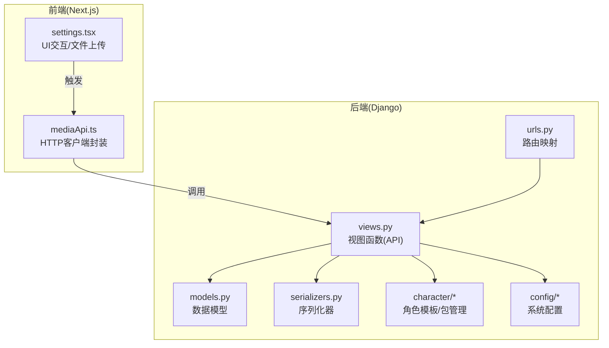
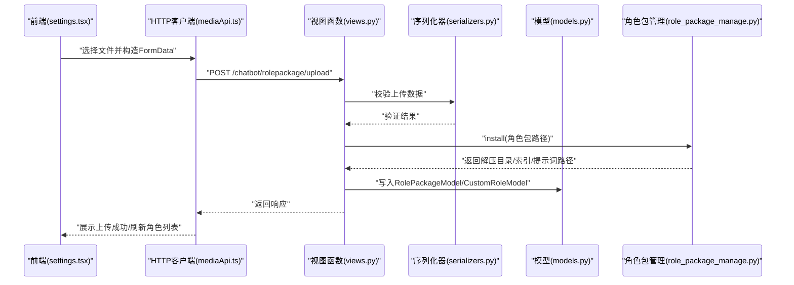
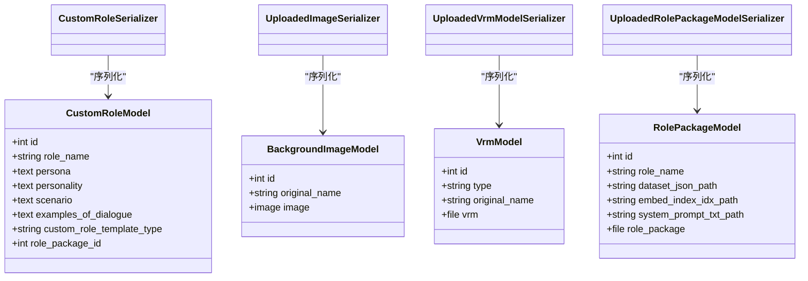
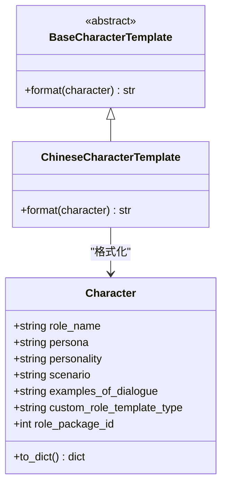
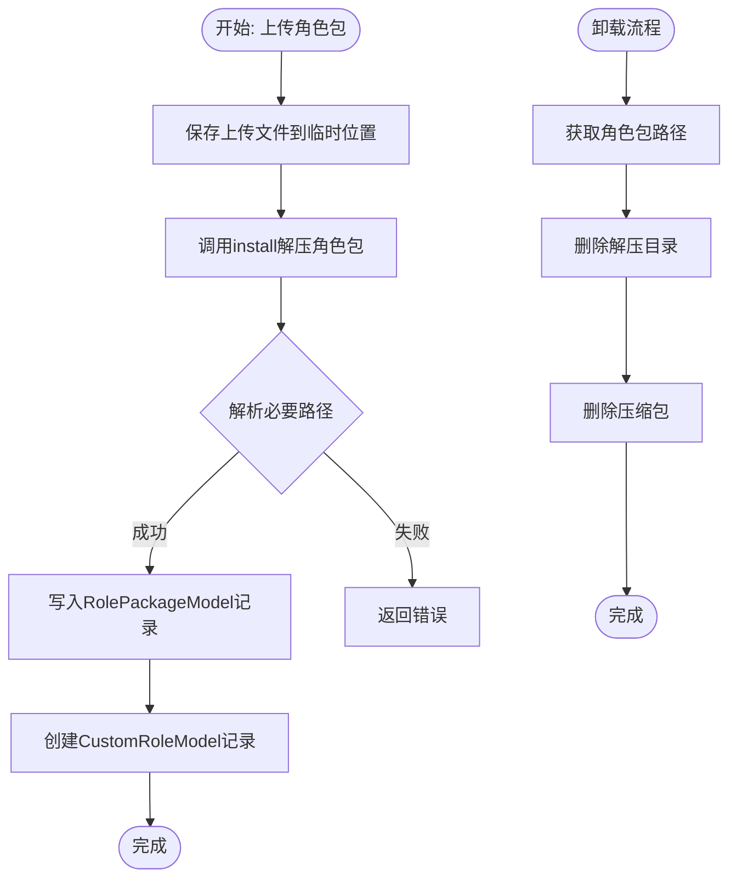
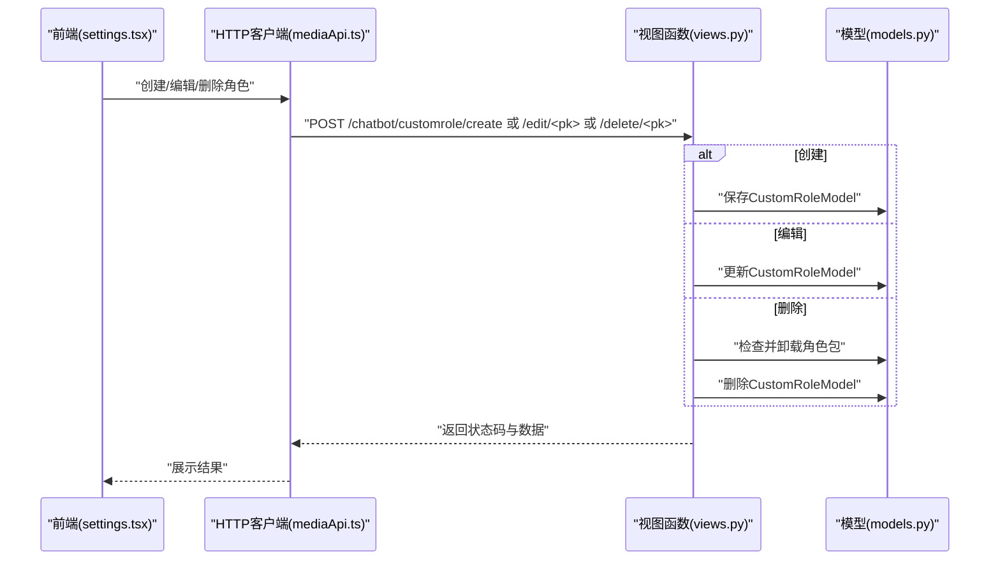
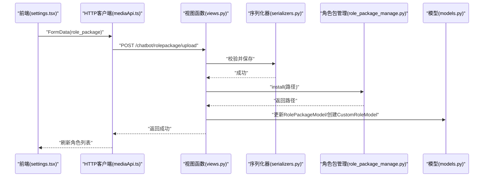
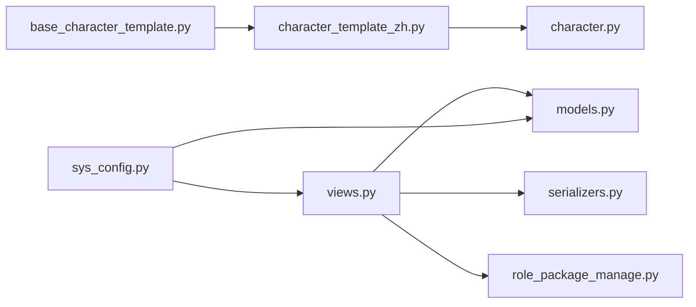

# 自定义角色API

<cite>
**本文引用的文件**
- [character.py](file://domain-chatbot/apps/chatbot/character/character.py)
- [base_character_template.py](file://domain-chatbot/apps/chatbot/character/base_character_template.py)
- [character_template_zh.py](file://domain-chatbot/apps/chatbot/character/character_template_zh.py)
- [role_package_manage.py](file://domain-chatbot/apps/chatbot/character/role_package_manage.py)
- [models.py](file://domain-chatbot/apps/chatbot/models.py)
- [serializers.py](file://domain-chatbot/apps/chatbot/serializers.py)
- [views.py](file://domain-chatbot/apps/chatbot/views.py)
- [urls.py](file://domain-chatbot/apps/chatbot/urls.py)
- [sys_config.py](file://domain-chatbot/apps/chatbot/config/sys_config.py)
- [sys_config.json](file://domain-chatbot/apps/chatbot/config/sys_config.json)
- [mediaApi.ts](file://domain-chatvrm/src/features/media/mediaApi.ts)
- [settings.tsx](file://domain-chatvrm/src/components/settings.tsx)
</cite>

## 目录
1. [简介](#简介)
2. [项目结构](#项目结构)
3. [核心组件](#核心组件)
4. [架构总览](#架构总览)
5. [详细组件分析](#详细组件分析)
6. [依赖分析](#依赖分析)
7. [性能考虑](#性能考虑)
8. [故障排查指南](#故障排查指南)
9. [结论](#结论)
10. [附录](#附录)

## 简介
本文件为“自定义角色API”模块的技术文档，聚焦于角色数据模型设计、模板结构与权限控制，以及角色的CRUD操作、角色包上传与安装、对话提示词生成、前端调用示例与错误处理策略。文档旨在帮助开发者快速理解并实现角色管理的完整技术方案。

## 项目结构
该模块位于 Django 应用 domain-chatbot 的 chatbot 子应用内，采用“模型-序列化器-视图-路由”的分层组织方式；同时包含角色模板与角色包管理逻辑，以及前端调用接口的参考实现。

图表来源
- [views.py](file://domain-chatbot/apps/chatbot/views.py#L1-L346)
- [urls.py](file://domain-chatbot/apps/chatbot/urls.py#L1-L26)
- [models.py](file://domain-chatbot/apps/chatbot/models.py#L1-L92)
- [serializers.py](file://domain-chatbot/apps/chatbot/serializers.py#L1-L37)
- [character.py](file://domain-chatbot/apps/chatbot/character/character.py#L1-L39)
- [role_package_manage.py](file://domain-chatbot/apps/chatbot/character/role_package_manage.py#L1-L163)
- [sys_config.py](file://domain-chatbot/apps/chatbot/config/sys_config.py#L1-L208)
- [mediaApi.ts](file://domain-chatvrm/src/features/media/mediaApi.ts#L42-L84)
- [settings.tsx](file://domain-chatvrm/src/components/settings.tsx#L403-L448)

章节来源
- [views.py](file://domain-chatbot/apps/chatbot/views.py#L1-L346)
- [urls.py](file://domain-chatbot/apps/chatbot/urls.py#L1-L26)

## 核心组件
- 角色数据模型与序列化器：负责角色实体的持久化与传输。
- 角色模板：提供角色提示词格式化能力，支持多语言模板扩展。
- 角色包管理：负责角色包的上传、解压、安装、卸载与系统提示词加载。
- 视图与路由：暴露角色CRUD、角色包上传、VRM/背景图上传等REST接口。
- 前端调用：通过HTTP客户端封装与UI组件触发后端API。

章节来源
- [models.py](file://domain-chatbot/apps/chatbot/models.py#L16-L36)
- [serializers.py](file://domain-chatbot/apps/chatbot/serializers.py#L5-L8)
- [character.py](file://domain-chatbot/apps/chatbot/character/character.py#L1-L39)
- [base_character_template.py](file://domain-chatbot/apps/chatbot/character/base_character_template.py#L1-L12)
- [character_template_zh.py](file://domain-chatbot/apps/chatbot/character/character_template_zh.py#L1-L67)
- [role_package_manage.py](file://domain-chatbot/apps/chatbot/character/role_package_manage.py#L103-L163)
- [views.py](file://domain-chatbot/apps/chatbot/views.py#L88-L294)
- [urls.py](file://domain-chatbot/apps/chatbot/urls.py#L10-L25)
- [mediaApi.ts](file://domain-chatvrm/src/features/media/mediaApi.ts#L42-L84)
- [settings.tsx](file://domain-chatvrm/src/components/settings.tsx#L422-L438)

## 架构总览
后端采用DRY原则，视图函数直接对接模型与序列化器，角色模板与角色包管理逻辑内聚在character子模块。前端通过HTTP客户端封装统一调用后端接口，UI组件负责文件选择与表单提交。

图表来源
- [views.py](file://domain-chatbot/apps/chatbot/views.py#L249-L294)
- [role_package_manage.py](file://domain-chatbot/apps/chatbot/character/role_package_manage.py#L103-L148)
- [serializers.py](file://domain-chatbot/apps/chatbot/serializers.py#L28-L36)
- [models.py](file://domain-chatbot/apps/chatbot/models.py#L85-L92)
- [mediaApi.ts](file://domain-chatvrm/src/features/media/mediaApi.ts#L75-L84)
- [settings.tsx](file://domain-chatvrm/src/components/settings.tsx#L422-L438)

## 详细组件分析

### 角色数据模型与序列化器
- 角色模型字段：角色名、人物设定、性格、场景、对话样例、模板类型、角色包ID。
- 序列化器：提供角色、图片、VRM、角色包的序列化/反序列化能力，支持部分字段可选。

图表来源
- [models.py](file://domain-chatbot/apps/chatbot/models.py#L16-L92)
- [serializers.py](file://domain-chatbot/apps/chatbot/serializers.py#L5-L36)

章节来源
- [models.py](file://domain-chatbot/apps/chatbot/models.py#L16-L92)
- [serializers.py](file://domain-chatbot/apps/chatbot/serializers.py#L5-L36)

### 角色模板与提示词生成
- 抽象模板基类：定义统一格式化接口，便于扩展不同语言/风格的模板。
- 中文模板：将角色属性注入预设提示词模板，形成可直接输入大模型的系统提示。

图表来源
- [base_character_template.py](file://domain-chatbot/apps/chatbot/character/base_character_template.py#L5-L11)
- [character_template_zh.py](file://domain-chatbot/apps/chatbot/character/character_template_zh.py#L30-L67)
- [character.py](file://domain-chatbot/apps/chatbot/character/character.py#L1-L39)

章节来源
- [base_character_template.py](file://domain-chatbot/apps/chatbot/character/base_character_template.py#L1-L12)
- [character_template_zh.py](file://domain-chatbot/apps/chatbot/character/character_template_zh.py#L1-L67)
- [character.py](file://domain-chatbot/apps/chatbot/character/character.py#L1-L39)

### 角色包管理与RAG检索
- 安装流程：解压ZIP包至独立目录，解析必要文件路径（数据集、向量索引、系统提示词）。
- 卸载流程：删除解压目录与压缩包。
- RAG检索：基于嵌入模型召回候选问答对，再用重排模型打分排序，最终拼接为对话样例。

图表来源
- [views.py](file://domain-chatbot/apps/chatbot/views.py#L249-L294)
- [role_package_manage.py](file://domain-chatbot/apps/chatbot/character/role_package_manage.py#L103-L148)

章节来源
- [role_package_manage.py](file://domain-chatbot/apps/chatbot/character/role_package_manage.py#L103-L163)
- [views.py](file://domain-chatbot/apps/chatbot/views.py#L249-L294)

### 角色CRUD流程
- 列表与详情：查询所有角色或按ID查询。
- 创建：接收JSON字段，保存为角色记录。
- 编辑：按ID更新角色记录。
- 删除：若角色绑定角色包，先卸载角色包再删除角色。

图表来源
- [views.py](file://domain-chatbot/apps/chatbot/views.py#L88-L170)
- [models.py](file://domain-chatbot/apps/chatbot/models.py#L16-L36)
- [mediaApi.ts](file://domain-chatvrm/src/features/media/mediaApi.ts#L75-L84)
- [settings.tsx](file://domain-chatvrm/src/components/settings.tsx#L929-L960)

章节来源
- [views.py](file://domain-chatbot/apps/chatbot/views.py#L88-L170)
- [models.py](file://domain-chatbot/apps/chatbot/models.py#L16-L36)
- [mediaApi.ts](file://domain-chatvrm/src/features/media/mediaApi.ts#L42-L84)
- [settings.tsx](file://domain-chatvrm/src/components/settings.tsx#L929-L960)

### 角色包上传与下载机制
- 上传：前端构造FormData，后端通过序列化器校验，保存到RolePackageModel，随后调用安装逻辑并回填路径信息。
- 下载：当前后端未提供角色包下载接口，前端可通过已存在的角色包路径进行二次开发实现。

图表来源
- [views.py](file://domain-chatbot/apps/chatbot/views.py#L249-L294)
- [serializers.py](file://domain-chatbot/apps/chatbot/serializers.py#L28-L36)
- [role_package_manage.py](file://domain-chatbot/apps/chatbot/character/role_package_manage.py#L103-L148)
- [models.py](file://domain-chatbot/apps/chatbot/models.py#L85-L92)
- [mediaApi.ts](file://domain-chatvrm/src/features/media/mediaApi.ts#L75-L84)
- [settings.tsx](file://domain-chatvrm/src/components/settings.tsx#L422-L438)

章节来源
- [views.py](file://domain-chatbot/apps/chatbot/views.py#L249-L294)
- [serializers.py](file://domain-chatbot/apps/chatbot/serializers.py#L28-L36)
- [role_package_manage.py](file://domain-chatbot/apps/chatbot/character/role_package_manage.py#L103-L148)
- [models.py](file://domain-chatbot/apps/chatbot/models.py#L85-L92)
- [mediaApi.ts](file://domain-chatvrm/src/features/media/mediaApi.ts#L75-L84)
- [settings.tsx](file://domain-chatvrm/src/components/settings.tsx#L422-L438)

### 权限验证与访问控制
- 当前后端未实现显式的鉴权/授权中间件，所有接口均以明文JSON或multipart/form-data形式接收。
- 建议在生产环境增加：
  - 请求头校验（如Authorization）
  - 用户会话/令牌校验
  - 资源级权限控制（仅允许操作自己的资源）
  - 文件上传白名单与大小限制
- 前端调用时应确保只在受信任网络环境下使用，避免泄露敏感数据。

章节来源
- [views.py](file://domain-chatbot/apps/chatbot/views.py#L1-L346)
- [urls.py](file://domain-chatbot/apps/chatbot/urls.py#L1-L26)

### 使用示例与最佳实践
- 角色创建/编辑/删除：通过前端按钮触发，调用对应API，注意错误码判断与日志输出。
- 角色包上传：选择ZIP文件后提交，等待后端安装完成并刷新角色列表。
- 数据校验：后端使用序列化器进行基础校验，建议在前端也做格式与大小限制。
- 性能优化：角色包安装涉及磁盘IO与文件解压，建议异步处理并在UI上显示进度提示。

章节来源
- [mediaApi.ts](file://domain-chatvrm/src/features/media/mediaApi.ts#L42-L84)
- [settings.tsx](file://domain-chatvrm/src/components/settings.tsx#L403-L448)
- [views.py](file://domain-chatbot/apps/chatbot/views.py#L249-L294)

## 依赖分析
- 组件耦合：视图函数依赖序列化器与模型；角色包管理独立于视图，被视图调用；模板与角色模型解耦，通过格式化接口连接。
- 外部依赖：角色包管理使用zipfile、os、shutil等标准库；RAG检索使用faiss与FlagEmbedding（需额外安装）。
- 可能的循环依赖：当前文件间无循环导入迹象。

图表来源
- [views.py](file://domain-chatbot/apps/chatbot/views.py#L1-L346)
- [serializers.py](file://domain-chatbot/apps/chatbot/serializers.py#L1-L37)
- [models.py](file://domain-chatbot/apps/chatbot/models.py#L1-L92)
- [role_package_manage.py](file://domain-chatbot/apps/chatbot/character/role_package_manage.py#L1-L163)
- [character_template_zh.py](file://domain-chatbot/apps/chatbot/character/character_template_zh.py#L1-L67)
- [base_character_template.py](file://domain-chatbot/apps/chatbot/character/base_character_template.py#L1-L12)
- [sys_config.py](file://domain-chatbot/apps/chatbot/config/sys_config.py#L1-L208)

章节来源
- [views.py](file://domain-chatbot/apps/chatbot/views.py#L1-L346)
- [serializers.py](file://domain-chatbot/apps/chatbot/serializers.py#L1-L37)
- [models.py](file://domain-chatbot/apps/chatbot/models.py#L1-L92)
- [role_package_manage.py](file://domain-chatbot/apps/chatbot/character/role_package_manage.py#L1-L163)
- [character_template_zh.py](file://domain-chatbot/apps/chatbot/character/character_template_zh.py#L1-L67)
- [base_character_template.py](file://domain-chatbot/apps/chatbot/character/base_character_template.py#L1-L12)
- [sys_config.py](file://domain-chatbot/apps/chatbot/config/sys_config.py#L1-L208)

## 性能考虑
- 角色包安装：解压与索引构建为IO密集型操作，建议：
  - 异步执行并返回任务ID，前端轮询进度。
  - 对大文件进行分块校验与断点续传（需扩展）。
- RAG检索：向量搜索与重排计算成本较高，建议：
  - 预热模型与索引，减少首次延迟。
  - 控制召回与重排数量，平衡质量与速度。
- 序列化与数据库：批量操作时使用事务，避免频繁往返。

## 故障排查指南
- 角色包上传失败：
  - 检查文件是否为ZIP格式、是否包含必需文件（数据集、索引、提示词）。
  - 查看后端日志中的错误码与异常堆栈。
- 角色删除异常：
  - 若角色绑定了角色包，确认卸载流程是否成功删除目录与文件。
- 前端调用异常：
  - 确认请求头Content-Type是否正确（multipart/form-data或application/json）。
  - 检查返回码与响应体，结合后端日志定位问题。

章节来源
- [views.py](file://domain-chatbot/apps/chatbot/views.py#L188-L201)
- [views.py](file://domain-chatbot/apps/chatbot/views.py#L232-L247)
- [views.py](file://domain-chatbot/apps/chatbot/views.py#L249-L294)
- [mediaApi.ts](file://domain-chatvrm/src/features/media/mediaApi.ts#L64-L84)

## 结论
该自定义角色API模块以清晰的数据模型与模板化设计为核心，配合角色包管理与RAG检索，实现了角色的全生命周期管理。当前实现简洁可靠，建议在生产环境中补充鉴权、文件校验与异步处理等能力，以提升安全性与用户体验。

## 附录
- 系统配置：包含语言模型、记忆存储、代理等配置项，影响角色运行环境。
- 前端集成：通过HTTP客户端封装与UI组件触发后端API，建议在前端实现更完善的错误提示与进度反馈。

章节来源
- [sys_config.py](file://domain-chatbot/apps/chatbot/config/sys_config.py#L32-L208)
- [sys_config.json](file://domain-chatbot/apps/chatbot/config/sys_config.json#L1-L60)
- [mediaApi.ts](file://domain-chatvrm/src/features/media/mediaApi.ts#L42-L84)
- [settings.tsx](file://domain-chatvrm/src/components/settings.tsx#L403-L448)