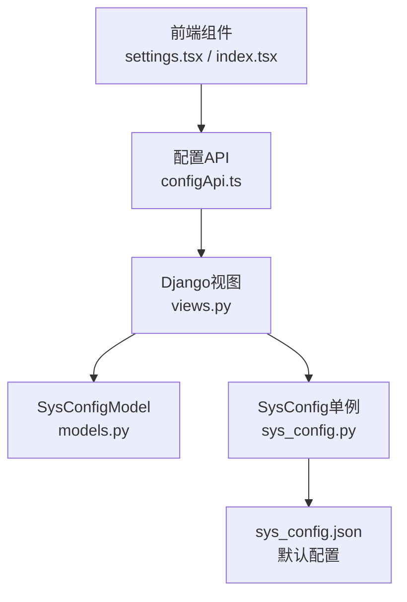
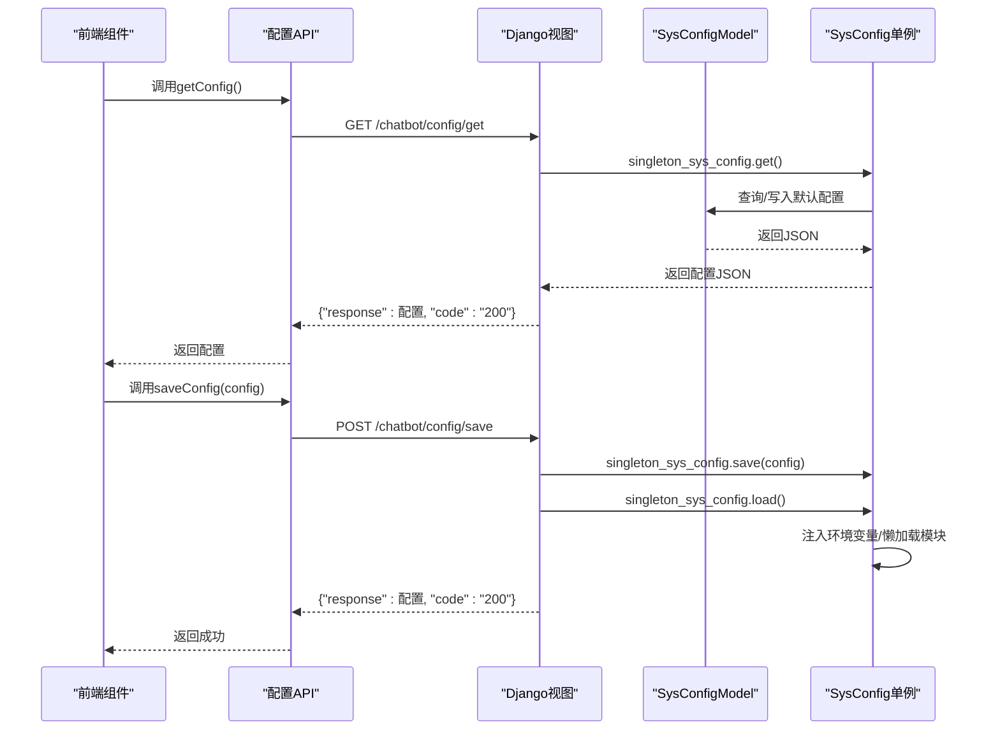
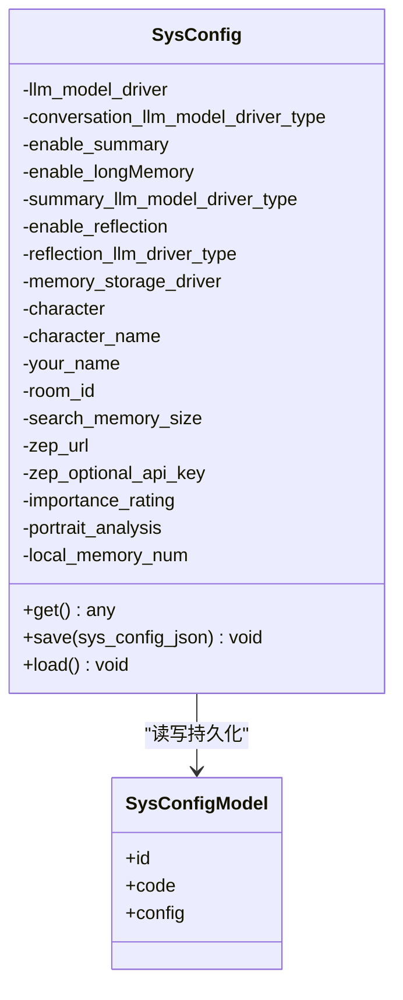
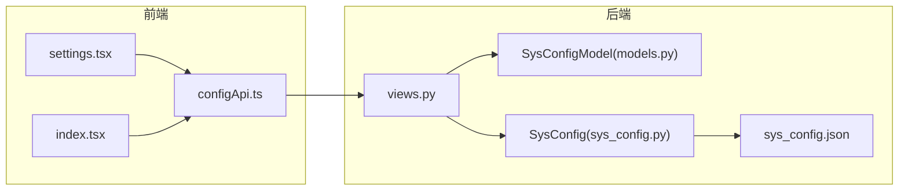

# 配置管理API

<cite>
**本文引用的文件**
- [configApi.ts](file://domain-chatvrm/src/features/config/configApi.ts)
- [settings.tsx](file://domain-chatvrm/src/components/settings.tsx)
- [index.tsx](file://domain-chatvrm/src/pages/index.tsx)
- [sys_config.py](file://domain-chatbot/apps/chatbot/config/sys_config.py)
- [sys_config.json](file://domain-chatbot/apps/chatbot/config/sys_config.json)
- [views.py](file://domain-chatbot/apps/chatbot/views.py)
- [urls.py](file://domain-chatbot/apps/chatbot/urls.py)
- [models.py](file://domain-chatbot/apps/chatbot/models.py)
- [__init__.py](file://domain-chatbot/apps/chatbot/config/__init__.py)
</cite>

## 目录
1. [简介](#简介)
2. [项目结构](#项目结构)
3. [核心组件](#核心组件)
4. [架构总览](#架构总览)
5. [详细组件分析](#详细组件分析)
6. [依赖分析](#依赖分析)
7. [性能考虑](#性能考虑)
8. [故障排查指南](#故障排查指南)
9. [结论](#结论)
10. [附录](#附录)

## 简介
本文件为配置管理API模块的技术文档，覆盖系统配置的获取与更新机制、配置数据结构与字段定义、默认值处理策略、缓存与持久化、版本控制与增量更新、变更通知与监听回调、前端状态管理与持久化、以及完整的调用示例与最佳实践。目标是帮助开发者快速理解并正确使用配置管理能力。

## 项目结构
配置管理涉及前后端协作：
- 前端（Next.js）通过配置API读取与保存配置，并在设置面板中进行交互。
- 后端（Django + DRF）提供REST接口，负责配置的持久化与运行时加载。

图表来源
- [configApi.ts](file://domain-chatvrm/src/features/config/configApi.ts#L1-L100)
- [views.py](file://domain-chatbot/apps/chatbot/views.py#L34-L60)
- [models.py](file://domain-chatbot/apps/chatbot/models.py#L39-L50)
- [sys_config.py](file://domain-chatbot/apps/chatbot/config/sys_config.py#L32-L82)
- [sys_config.json](file://domain-chatbot/apps/chatbot/config/sys_config.json#L1-L60)

章节来源
- [configApi.ts](file://domain-chatvrm/src/features/config/configApi.ts#L1-L100)
- [views.py](file://domain-chatbot/apps/chatbot/views.py#L34-L60)
- [models.py](file://domain-chatbot/apps/chatbot/models.py#L39-L50)
- [sys_config.py](file://domain-chatbot/apps/chatbot/config/sys_config.py#L32-L82)
- [sys_config.json](file://domain-chatbot/apps/chatbot/config/sys_config.json#L1-L60)

## 核心组件
- 前端配置API
  - 提供获取与保存配置的方法，返回统一响应结构，包含业务码与响应体。
  - 定义全局配置类型别名，确保类型安全。
- Django配置视图
  - GET /chatbot/config/get：返回当前系统配置。
  - POST /chatbot/config/save：接收前端传入的配置并持久化，随后触发运行时重载。
- SysConfig单例与持久化
  - SysConfig负责读取默认配置、与数据库SysConfigModel交互、环境变量注入、懒加载记忆模块等。
  - 单例在应用启动时加载一次，后续通过视图层的save/load进行更新。

章节来源
- [configApi.ts](file://domain-chatvrm/src/features/config/configApi.ts#L68-L100)
- [views.py](file://domain-chatbot/apps/chatbot/views.py#L34-L60)
- [sys_config.py](file://domain-chatbot/apps/chatbot/config/sys_config.py#L32-L82)
- [models.py](file://domain-chatbot/apps/chatbot/models.py#L39-L50)

## 架构总览
配置管理采用“前端读写 → 后端持久化/重载”的分层设计。前端通过API获取初始配置并支持动态更新；后端以SysConfig单例为核心，结合数据库SysConfigModel实现持久化与运行时生效。

图表来源
- [configApi.ts](file://domain-chatvrm/src/features/config/configApi.ts#L68-L100)
- [views.py](file://domain-chatbot/apps/chatbot/views.py#L34-L60)
- [sys_config.py](file://domain-chatbot/apps/chatbot/config/sys_config.py#L57-L82)
- [models.py](file://domain-chatbot/apps/chatbot/models.py#L39-L50)

## 详细组件分析

### 前端配置API与类型定义
- 初始配置形状与默认值
  - 前端定义initialFormData作为初始配置模板，包含直播、代理、大模型、角色、对话、记忆存储、背景、TTS等子配置段。
  - 默认值来源于后端sys_config.json，前端在首次拉取时获得。
- 类型别名
  - 使用GlobalConfig对initialFormData进行类型约束，便于组件间传递与校验。
- 获取与保存
  - getConfig：向后端发起GET请求，解析响应并返回配置。
  - saveConfig：向后端发起POST请求，携带config字段，保存后返回最新配置。

章节来源
- [configApi.ts](file://domain-chatvrm/src/features/config/configApi.ts#L3-L63)
- [configApi.ts](file://domain-chatvrm/src/features/config/configApi.ts#L68-L100)

### Django配置视图与路由
- 路由
  - /chatbot/config/get → get_config
  - /chatbot/config/save → save_config
- 视图逻辑
  - get_config：返回singleton_sys_config.get()的结果。
  - save_config：解析请求体中的config，调用singleton_sys_config.save与load，随后返回保存后的配置。

章节来源
- [urls.py](file://domain-chatbot/apps/chatbot/urls.py#L15-L16)
- [views.py](file://domain-chatbot/apps/chatbot/views.py#L53-L60)
- [views.py](file://domain-chatbot/apps/chatbot/views.py#L34-L50)

### SysConfig单例与持久化
- 配置来源与默认值
  - 优先从SysConfigModel中读取；若不存在则从sys_config.json读取默认值并写入数据库。
- 运行时加载
  - load方法中完成环境变量注入（如API密钥、代理）、默认角色初始化、对话与记忆模块参数解析、懒加载记忆驱动等。
- 保存流程
  - save将前端提交的配置序列化后写入SysConfigModel。

图表来源
- [sys_config.py](file://domain-chatbot/apps/chatbot/config/sys_config.py#L32-L82)
- [models.py](file://domain-chatbot/apps/chatbot/models.py#L39-L50)

章节来源
- [sys_config.py](file://domain-chatbot/apps/chatbot/config/sys_config.py#L57-L82)
- [sys_config.py](file://domain-chatbot/apps/chatbot/config/sys_config.py#L83-L192)
- [models.py](file://domain-chatbot/apps/chatbot/models.py#L39-L50)

### 配置数据结构与字段定义
- 字段分类
  - 直播配置：房间ID、Cookie等。
  - 代理配置：enableProxy与http/https/socks5代理地址。
  - 大语言模型配置：OpenAI、Ollama、智谱等键值。
  - 角色配置：角色ID、角色名、你的名字、VRM模型与类型。
  - 对话配置：对话类型、语言模型。
  - 记忆存储配置：enableLongMemory、enableSummary、enableReflection、语言模型选择、Milvus连接参数、Zep配置。
  - 背景配置：背景ID与URL。
  - TTS配置：TTS类型与语音ID。
- 默认值来源
  - sys_config.json提供默认值；若数据库中无记录，则首次访问时写入。

章节来源
- [sys_config.json](file://domain-chatbot/apps/chatbot/config/sys_config.json#L1-L60)
- [sys_config.py](file://domain-chatbot/apps/chatbot/config/sys_config.py#L110-L188)

### 缓存策略与失效机制
- 本地缓存
  - 前端在页面挂载时调用getConfig获取初始配置，并将其存入组件状态；后续修改通过表单控件实时更新状态，避免频繁请求。
- 内存缓存
  - 后端SysConfig单例在进程生命周期内保持一份配置实例，减少重复IO。
- 缓存失效
  - 保存配置后，后端调用load重新注入环境变量与懒加载模块，使新配置立即生效。
  - 前端在保存成功后可选择刷新或直接使用最新状态，避免UI与后端不一致。

章节来源
- [configApi.ts](file://domain-chatvrm/src/features/config/configApi.ts#L68-L100)
- [views.py](file://domain-chatbot/apps/chatbot/views.py#L34-L50)
- [sys_config.py](file://domain-chatbot/apps/chatbot/config/sys_config.py#L83-L192)

### 版本控制与增量更新
- 版本控制
  - 当前实现未显式引入版本号字段；建议在SysConfigModel中增加version字段，用于并发冲突检测与回滚。
- 增量更新
  - 前端可仅提交变更字段，后端在save前合并默认值后再持久化，保证结构完整性。
  - 建议在SysConfig.load中加入字段白名单校验，防止未知字段导致异常。

章节来源
- [models.py](file://domain-chatbot/apps/chatbot/models.py#L39-L50)
- [sys_config.py](file://domain-chatbot/apps/chatbot/config/sys_config.py#L78-L82)

### 变更通知与监听回调
- 前端监听
  - 设置面板组件在挂载时拉取配置并初始化表单；保存成功后可触发onChange回调更新全局状态。
  - 组件内部通过useState/useEffect监听表单变化，实时更新webGlobalConfig与本地状态。
- 后端监听
  - 保存后通过lazy_bilibili_live等函数按需重载外部服务配置，但未实现跨进程广播。

章节来源
- [settings.tsx](file://domain-chatvrm/src/components/settings.tsx#L150-L153)
- [index.tsx](file://domain-chatvrm/src/pages/index.tsx#L76-L82)
- [views.py](file://domain-chatbot/apps/chatbot/views.py#L46-L48)

### 前端状态管理与持久化
- 全局状态
  - 页面入口index.tsx在初始化时调用getConfig并将结果赋给webGlobalConfig与React状态，实现全局共享。
- 本地持久化
  - 组件中使用localStorage存储聊天参数（如systemPrompt、koeiroParam、chatLog），提升用户体验。
- 表单状态
  - 设置面板使用useState维护表单状态，保存时一次性提交至后端。

章节来源
- [index.tsx](file://domain-chatvrm/src/pages/index.tsx#L76-L90)
- [settings.tsx](file://domain-chatvrm/src/components/settings.tsx#L150-L153)

### API调用示例与最佳实践
- 初始化配置
  - 在页面挂载时调用getConfig，将返回的配置设置为组件状态与全局变量。
- 动态更新
  - 用户在设置面板修改后，点击保存按钮调用saveConfig，提交当前表单状态。
- 错误处理
  - 前端在响应码非200时抛出错误，调用方应捕获并提示用户。
- 最佳实践
  - 保存前进行字段校验与默认值合并。
  - 保存后立即刷新UI，避免异步延迟导致的不一致。
  - 对敏感字段（如API Key）在前端隐藏显示，仅展示部分掩码。

章节来源
- [configApi.ts](file://domain-chatvrm/src/features/config/configApi.ts#L68-L100)
- [settings.tsx](file://domain-chatvrm/src/components/settings.tsx#L150-L153)

## 依赖分析
- 前端依赖
  - configApi.ts依赖httpclient工具进行请求封装。
  - settings.tsx依赖configApi.ts进行配置读写。
  - index.tsx在页面初始化时调用getConfig并设置全局状态。
- 后端依赖
  - views.py依赖singleton_sys_config与SysConfigModel。
  - sys_config.py依赖SysConfigModel与默认配置文件sys_config.json。

图表来源
- [settings.tsx](file://domain-chatvrm/src/components/settings.tsx#L27-L27)
- [configApi.ts](file://domain-chatvrm/src/features/config/configApi.ts#L1-L100)
- [index.tsx](file://domain-chatvrm/src/pages/index.tsx#L76-L82)
- [views.py](file://domain-chatbot/apps/chatbot/views.py#L13-L13)
- [models.py](file://domain-chatbot/apps/chatbot/models.py#L39-L50)
- [sys_config.py](file://domain-chatbot/apps/chatbot/config/sys_config.py#L10-L11)
- [sys_config.json](file://domain-chatbot/apps/chatbot/config/sys_config.json#L1-L60)

章节来源
- [settings.tsx](file://domain-chatvrm/src/components/settings.tsx#L27-L27)
- [configApi.ts](file://domain-chatvrm/src/features/config/configApi.ts#L1-L100)
- [index.tsx](file://domain-chatvrm/src/pages/index.tsx#L76-L82)
- [views.py](file://domain-chatbot/apps/chatbot/views.py#L13-L13)
- [models.py](file://domain-chatbot/apps/chatbot/models.py#L39-L50)
- [sys_config.py](file://domain-chatbot/apps/chatbot/config/sys_config.py#L10-L11)
- [sys_config.json](file://domain-chatbot/apps/chatbot/config/sys_config.json#L1-L60)

## 性能考虑
- 减少IO
  - 前端仅在初始化与保存后进行配置读写，避免频繁请求。
  - 后端SysConfig单例在进程内复用，降低磁盘与数据库访问频率。
- 懒加载
  - 记忆模块等重型组件按需初始化，缩短启动时间。
- 并发与一致性
  - 建议在SysConfigModel中引入版本号与乐观锁，避免并发保存导致的数据覆盖。

## 故障排查指南
- 前端
  - getConfig返回非200：检查后端路由与视图是否正确映射，确认网络连通性。
  - saveConfig失败：检查请求体格式（必须包含config字段），查看后端日志定位异常。
- 后端
  - 首次访问无配置：确认SysConfigModel中是否存在对应code的记录；若无则会从sys_config.json写入默认值。
  - 环境变量未生效：检查SysConfig.load中对应键的注入逻辑，确认保存后已调用load。
- 数据库
  - SysConfigModel字段缺失：确保迁移脚本已执行，字段与默认配置一致。

章节来源
- [configApi.ts](file://domain-chatvrm/src/features/config/configApi.ts#L68-L100)
- [views.py](file://domain-chatbot/apps/chatbot/views.py#L34-L60)
- [sys_config.py](file://domain-chatbot/apps/chatbot/config/sys_config.py#L57-L82)
- [models.py](file://domain-chatbot/apps/chatbot/models.py#L39-L50)

## 结论
配置管理API通过前后端清晰的职责划分实现了“读取—保存—生效”的闭环。前端负责交互与状态管理，后端负责持久化与运行时加载。当前实现简洁可靠，建议后续引入版本控制、字段白名单校验与跨进程通知机制，进一步提升稳定性与可观测性。

## 附录
- 接口定义
  - GET /chatbot/config/get
    - 请求：无
    - 响应：包含response（配置JSON）与code（字符串）字段
  - POST /chatbot/config/save
    - 请求体：{"config": {...}}
    - 响应：包含response（保存后的配置）与code（字符串）

章节来源
- [urls.py](file://domain-chatbot/apps/chatbot/urls.py#L15-L16)
- [views.py](file://domain-chatbot/apps/chatbot/views.py#L34-L60)
- [configApi.ts](file://domain-chatvrm/src/features/config/configApi.ts#L68-L100)