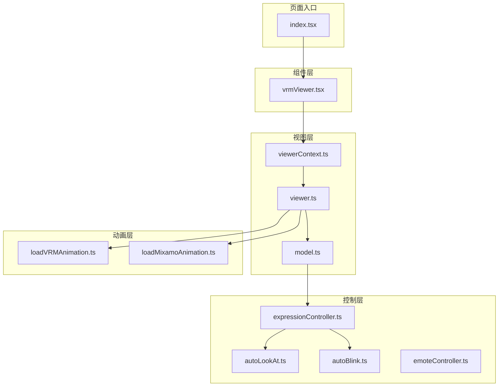
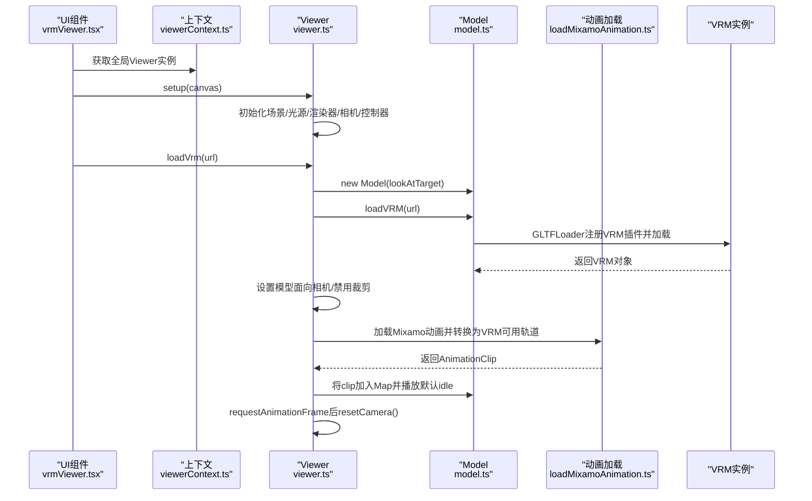
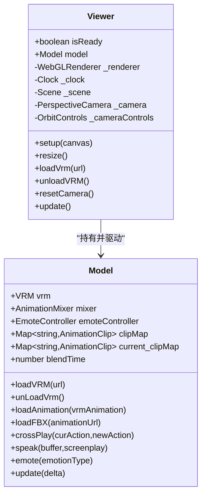
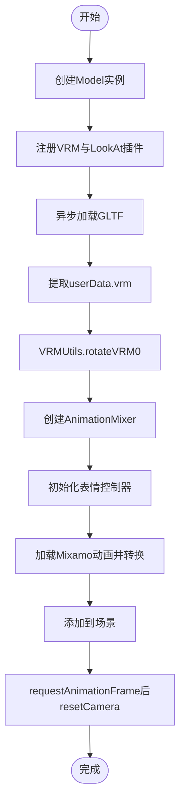
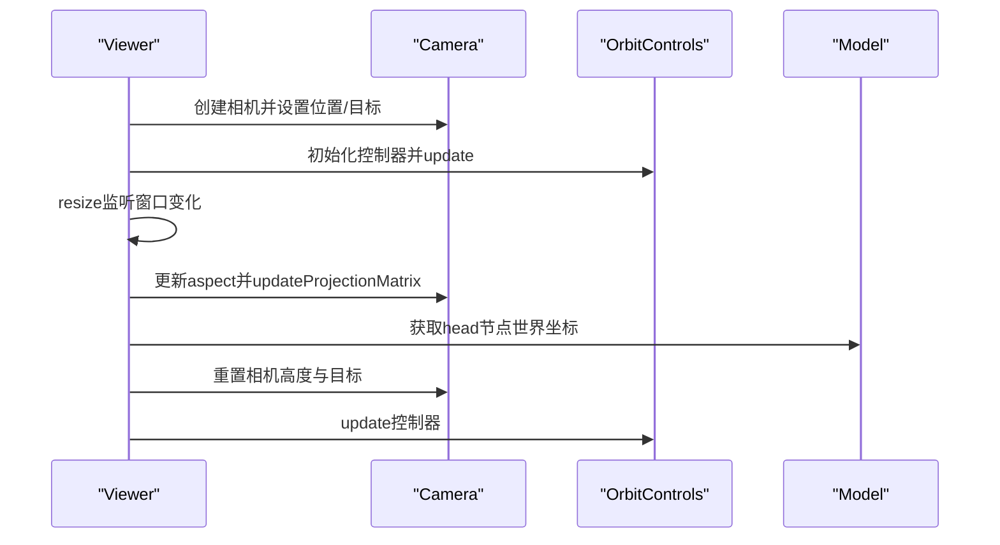
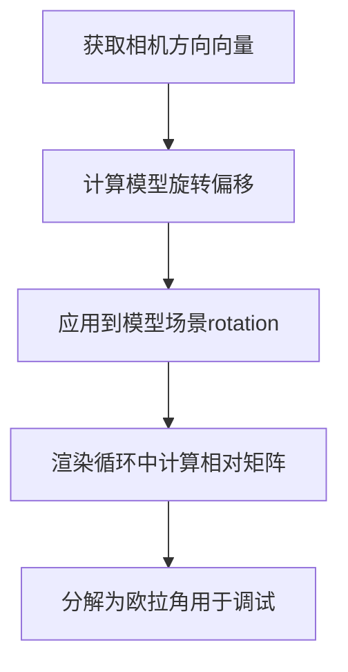
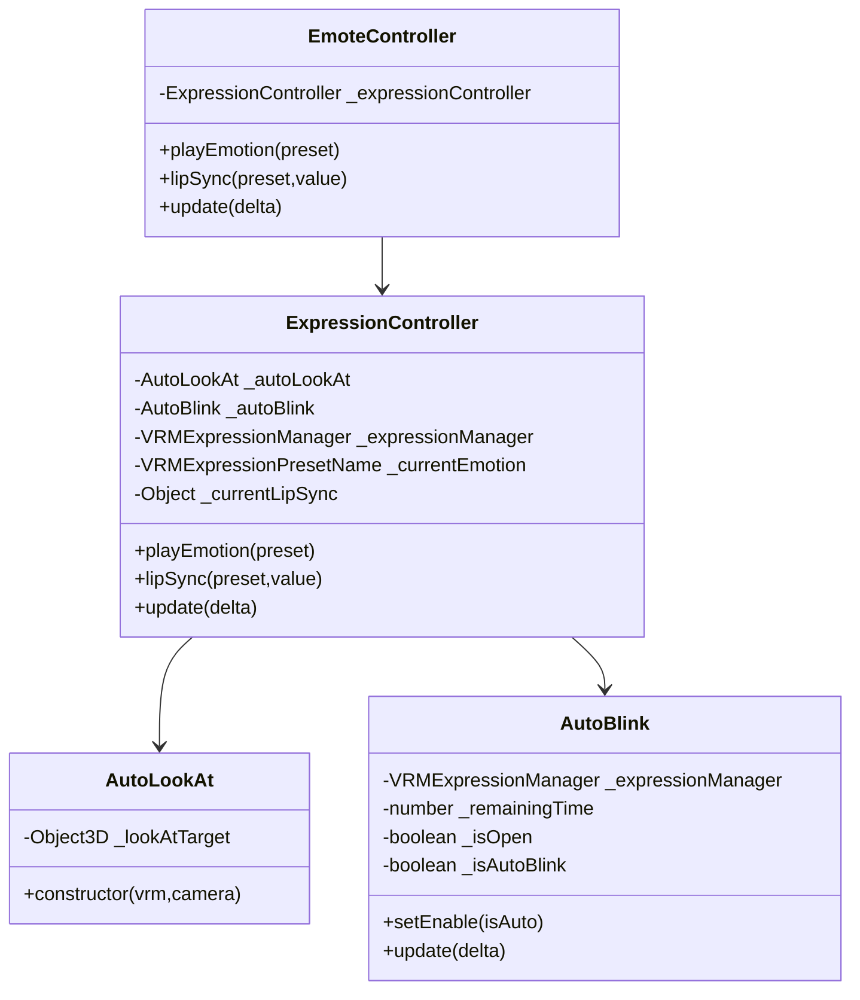
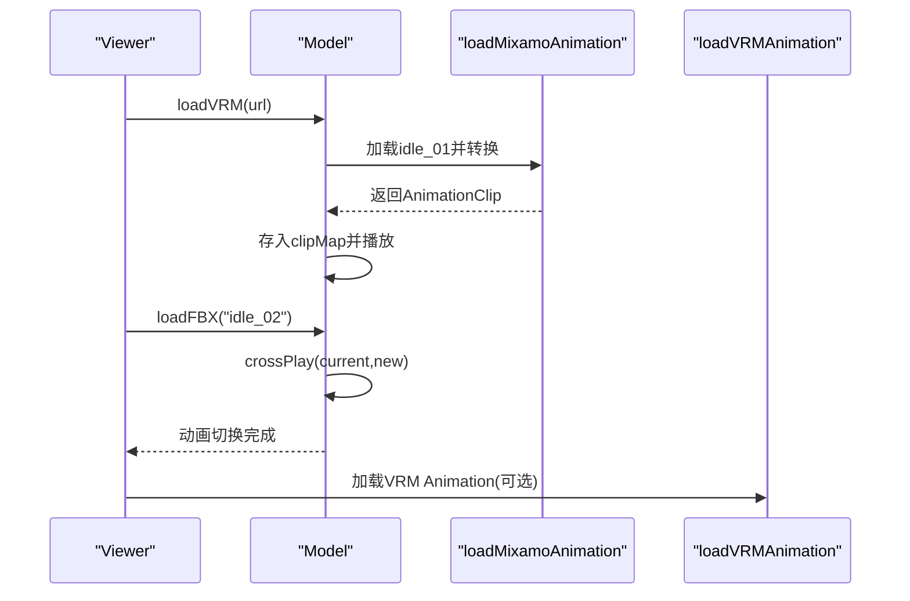
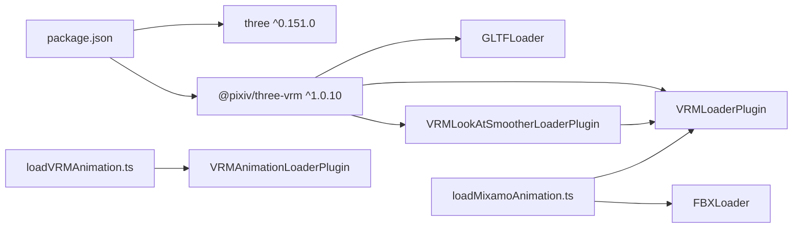

# Three.js与VRM模型集成

<cite>
**本文引用的文件**
- [vrmViewer.tsx](file://domain-chatvrm/src/components/vrmViewer.tsx)
- [viewer.ts](file://domain-chatvrm/src/features/vrmViewer/viewer.ts)
- [model.ts](file://domain-chatvrm/src/features/vrmViewer/model.ts)
- [viewerContext.ts](file://domain-chatvrm/src/features/vrmViewer/viewerContext.ts)
- [loadVRMAnimation.ts](file://domain-chatvrm/src/lib/VRMAnimation/loadVRMAnimation.ts)
- [loadMixamoAnimation.ts](file://domain-chatvrm/src/features/mixamo/loadMixamoAnimation.ts)
- [emoteController.ts](file://domain-chatvrm/src/features/emoteController/emoteController.ts)
- [expressionController.ts](file://domain-chatvrm/src/features/emoteController/expressionController.ts)
- [autoBlink.ts](file://domain-chatvrm/src/features/emoteController/autoBlink.ts)
- [autoLookAt.ts](file://domain-chatvrm/src/features/emoteController/autoLookAt.ts)
- [index.tsx](file://domain-chatvrm/src/pages/index.tsx)
- [package.json](file://domain-chatvrm/package.json)
</cite>

## 目录
1. [简介](#简介)
2. [项目结构](#项目结构)
3. [核心组件](#核心组件)
4. [架构总览](#架构总览)
5. [详细组件分析](#详细组件分析)
6. [依赖关系分析](#依赖关系分析)
7. [性能考虑](#性能考虑)
8. [故障排查指南](#故障排查指南)
9. [结论](#结论)
10. [附录](#附录)

## 简介
本技术文档围绕 Three.js 与 VRM 模型在前端 Next.js 应用中的集成方案展开，重点阐述 Viewer 类的设计架构（场景初始化、光源设置、渲染器配置）、VRM 模型加载流程（从 URL 到实例化）、相机控制系统（OrbitControls 的配置与动态重置）、模型面向相机的算法实现（旋转矩阵与坐标系转换），以及场景管理、内存清理与性能优化的最佳实践。文档同时提供可定位的代码片段路径与常见问题解决方案，帮助开发者快速理解与扩展该模块。

## 项目结构
该模块位于 domain-chatvrm 子项目中，采用 React + Next.js + Three.js + @pixiv/three-vrm 的技术栈。关键目录与文件如下：
- 组件层：负责挂载 Canvas 并触发 Viewer 初始化与 VRM 加载
- 视图层：封装 Three.js 场景、相机、渲染器与控制器
- 动画层：支持 Mixamo 动画与 VRM Animation 的加载与混合
- 控制层：表情控制、眨眼与自动看功能
- 页面入口：首页组件负责全局配置与交互事件分发

图表来源
- [vrmViewer.tsx](file://domain-chatvrm/src/components/vrmViewer.tsx#L1-L59)
- [viewerContext.ts](file://domain-chatvrm/src/features/vrmViewer/viewerContext.ts#L1-L7)
- [viewer.ts](file://domain-chatvrm/src/features/vrmViewer/viewer.ts#L1-L205)
- [model.ts](file://domain-chatvrm/src/features/vrmViewer/model.ts#L1-L136)
- [loadVRMAnimation.ts](file://domain-chatvrm/src/lib/VRMAnimation/loadVRMAnimation.ts#L1-L16)
- [loadMixamoAnimation.ts](file://domain-chatvrm/src/features/mixamo/loadMixamoAnimation.ts#L1-L104)
- [expressionController.ts](file://domain-chatvrm/src/features/emoteController/expressionController.ts#L1-L77)
- [autoLookAt.ts](file://domain-chatvrm/src/features/emoteController/autoLookAt.ts#L1-L18)
- [autoBlink.ts](file://domain-chatvrm/src/features/emoteController/autoBlink.ts#L1-L65)
- [emoteController.ts](file://domain-chatvrm/src/features/emoteController/emoteController.ts#L1-L28)
- [index.tsx](file://domain-chatvrm/src/pages/index.tsx#L1-L390)

章节来源
- [package.json](file://domain-chatvrm/package.json#L1-L51)

## 核心组件
- Viewer：封装 Three.js 场景、相机、渲染器、控制器与更新循环；负责 VRM 加载、动画装载与相机重置。
- Model：封装 VRM 实例、AnimationMixer、表情与口型同步控制；提供动作切换与跨淡入淡出。
- EmoteController/ExpressionController/AutoLookAt/AutoBlink：统一管理表情、眨眼与视线控制。
- vrmViewer.tsx：React 组件，负责 Canvas 生命周期与拖拽上传 VRM 文件。
- viewerContext.ts：全局上下文，提供单例 Viewer 实例供组件树共享。

章节来源
- [viewer.ts](file://domain-chatvrm/src/features/vrmViewer/viewer.ts#L13-L205)
- [model.ts](file://domain-chatvrm/src/features/vrmViewer/model.ts#L18-L136)
- [emoteController.ts](file://domain-chatvrm/src/features/emoteController/emoteController.ts#L9-L28)
- [expressionController.ts](file://domain-chatvrm/src/features/emoteController/expressionController.ts#L16-L77)
- [autoLookAt.ts](file://domain-chatvrm/src/features/emoteController/autoLookAt.ts#L9-L18)
- [autoBlink.ts](file://domain-chatvrm/src/features/emoteController/autoBlink.ts#L7-L65)
- [vrmViewer.tsx](file://domain-chatvrm/src/components/vrmViewer.tsx#L10-L59)
- [viewerContext.ts](file://domain-chatvrm/src/features/vrmViewer/viewerContext.ts#L1-L7)

## 架构总览
整体架构采用“组件驱动 + 视图层封装 + 动画与控制分离”的设计模式。React 组件负责生命周期与用户交互，Viewer 封装 Three.js 渲染管线，Model 负责 VRM 数据与动画，表情与自动行为由独立控制器管理。

图表来源
- [vrmViewer.tsx](file://domain-chatvrm/src/components/vrmViewer.tsx#L16-L51)
- [viewerContext.ts](file://domain-chatvrm/src/features/vrmViewer/viewerContext.ts#L4-L6)
- [viewer.ts](file://domain-chatvrm/src/features/vrmViewer/viewer.ts#L104-L136)
- [viewer.ts](file://domain-chatvrm/src/features/vrmViewer/viewer.ts#L43-L92)
- [model.ts](file://domain-chatvrm/src/features/vrmViewer/model.ts#L34-L53)
- [loadMixamoAnimation.ts](file://domain-chatvrm/src/features/mixamo/loadMixamoAnimation.ts#L13-L104)

## 详细组件分析

### Viewer 类设计与渲染管线
- 场景初始化：构造函数创建 Scene，并添加 DirectionalLight 与 AmbientLight；启动 Clock 用于帧间时间计算。
- 渲染器配置：setup(canvas) 中创建 WebGLRenderer，启用透明背景与抗锯齿；根据父容器尺寸设置渲染尺寸与像素比。
- 相机与控制器：创建 PerspectiveCamera，设置初始位置与目标；初始化 OrbitControls，允许屏幕空间平移。
- 更新循环：update 使用 requestAnimationFrame 驱动，先更新 Model 的 mixer 与 VRM，再执行渲染。
- 尺寸适配：resize 监听窗口变化，按设备像素比重设渲染尺寸并更新投影矩阵。
- 相机重置：resetCamera 通过 VRM Humanoid 的 head 节点世界坐标调整相机高度与目标，提升观看体验。

图表来源
- [viewer.ts](file://domain-chatvrm/src/features/vrmViewer/viewer.ts#L13-L205)
- [model.ts](file://domain-chatvrm/src/features/vrmViewer/model.ts#L18-L136)

章节来源
- [viewer.ts](file://domain-chatvrm/src/features/vrmViewer/viewer.ts#L23-L41)
- [viewer.ts](file://domain-chatvrm/src/features/vrmViewer/viewer.ts#L104-L136)
- [viewer.ts](file://domain-chatvrm/src/features/vrmViewer/viewer.ts#L141-L157)
- [viewer.ts](file://domain-chatvrm/src/features/vrmViewer/viewer.ts#L162-L175)
- [viewer.ts](file://domain-chatvrm/src/features/vrmViewer/viewer.ts#L177-L203)

### VRM 模型加载流程
- 插件注册：GLTFLoader 注册 VRMLoaderPlugin 与 LookAt 平滑插件，确保 VRM 元数据与表情系统可用。
- 加载与初始化：loadVRM(url) 异步加载 GLTF，提取 glTF.userData.vrm 作为 VRM 实例；调用 VRMUtils.rotateVRM0 修正姿态；创建 AnimationMixer；初始化表情控制器。
- 动画装载：Viewer.loadVrm 中加载多条 Mixamo 动画（idle、greeting、thinking、excited 等），转换为 VRM 可用轨道后存入 Map；首次播放 idle_01。
- 面向相机与裁剪：设置模型面向相机方向，禁用 frustumCulling 提升稳定性；渲染前进行一次 resetCamera 以对齐头部。

图表来源
- [model.ts](file://domain-chatvrm/src/features/vrmViewer/model.ts#L34-L53)
- [viewer.ts](file://domain-chatvrm/src/features/vrmViewer/viewer.ts#L43-L92)
- [loadMixamoAnimation.ts](file://domain-chatvrm/src/features/mixamo/loadMixamoAnimation.ts#L13-L104)

章节来源
- [model.ts](file://domain-chatvrm/src/features/vrmViewer/model.ts#L34-L53)
- [viewer.ts](file://domain-chatvrm/src/features/vrmViewer/viewer.ts#L43-L92)

### 相机控制系统与动态重置
- OrbitControls 配置：启用 screenSpacePanning，使相机在屏幕空间内平移；初始化时设置目标与 update。
- 视角调整：setup 中设置相机位置与目标，随后 update 控制器；resize 时更新投影矩阵。
- 动态重置：resetCamera 读取 VRM Head 节点的世界坐标，将相机 Y 轴对齐至头部高度，并将目标对准头部位置，保证观看稳定。

图表来源
- [viewer.ts](file://domain-chatvrm/src/features/vrmViewer/viewer.ts#L118-L129)
- [viewer.ts](file://domain-chatvrm/src/features/vrmViewer/viewer.ts#L141-L157)
- [viewer.ts](file://domain-chatvrm/src/features/vrmViewer/viewer.ts#L162-L175)

章节来源
- [viewer.ts](file://domain-chatvrm/src/features/vrmViewer/viewer.ts#L118-L129)
- [viewer.ts](file://domain-chatvrm/src/features/vrmViewer/viewer.ts#L141-L157)
- [viewer.ts](file://domain-chatvrm/src/features/vrmViewer/viewer.ts#L162-L175)

### 模型面向相机的算法实现
- 方向计算：Viewer.loadVrm 中获取相机方向向量，作为模型朝向参考。
- 旋转调整：通过给模型场景的旋转分量增加偏移，使模型面向相机。
- 相对旋转矩阵：在 update 循环中计算模型矩阵与相机矩阵逆的乘积，得到相对变换矩阵并转为欧拉角，便于调试与分析。

图表来源
- [viewer.ts](file://domain-chatvrm/src/features/vrmViewer/viewer.ts#L53-L63)
- [viewer.ts](file://domain-chatvrm/src/features/vrmViewer/viewer.ts#L192-L202)

章节来源
- [viewer.ts](file://domain-chatvrm/src/features/vrmViewer/viewer.ts#L53-L63)
- [viewer.ts](file://domain-chatvrm/src/features/vrmViewer/viewer.ts#L192-L202)

### 表情控制与自动行为
- 表情控制器：EmoteController 聚合 ExpressionController，统一播放预设表情与口型同步。
- 自动眨眼：AutoBlink 在表情切换期间保护闭眼状态，避免不自然的视觉冲突。
- 自动看：AutoLookAt 将 LookAt 目标附加到相机，配合 VRMLookAtSmoother 实现顺滑视线。
- 更新顺序：ExpressionController 在每帧更新时处理眨眼与口型权重，确保与当前表情状态一致。

图表来源
- [emoteController.ts](file://domain-chatvrm/src/features/emoteController/emoteController.ts#L9-L28)
- [expressionController.ts](file://domain-chatvrm/src/features/emoteController/expressionController.ts#L16-L77)
- [autoLookAt.ts](file://domain-chatvrm/src/features/emoteController/autoLookAt.ts#L9-L18)
- [autoBlink.ts](file://domain-chatvrm/src/features/emoteController/autoBlink.ts#L7-L65)

章节来源
- [emoteController.ts](file://domain-chatvrm/src/features/emoteController/emoteController.ts#L9-L28)
- [expressionController.ts](file://domain-chatvrm/src/features/emoteController/expressionController.ts#L16-L77)
- [autoLookAt.ts](file://domain-chatvrm/src/features/emoteController/autoLookAt.ts#L9-L18)
- [autoBlink.ts](file://domain-chatvrm/src/features/emoteController/autoBlink.ts#L7-L65)

### 动画加载与混合
- VRM Animation：loadVRMAnimation 通过 GLTFLoader 与 VRMAnimationLoaderPlugin 解析 .vrma 文件，返回可直接使用的动画。
- Mixamo 动画：loadMixamoAnimation 从 FBX 中提取指定动画名的 AnimationClip，按 VRM 骨骼映射转换轨道，生成可在 VRM 上播放的 AnimationClip。
- 动作切换：Model.loadFBX 从 Map 中取出目标动画，若存在当前动作则使用 crossPlay 实现淡入淡出过渡，避免抖动。

图表来源
- [viewer.ts](file://domain-chatvrm/src/features/vrmViewer/viewer.ts#L72-L86)
- [model.ts](file://domain-chatvrm/src/features/vrmViewer/model.ts#L78-L106)
- [loadMixamoAnimation.ts](file://domain-chatvrm/src/features/mixamo/loadMixamoAnimation.ts#L13-L104)
- [loadVRMAnimation.ts](file://domain-chatvrm/src/lib/VRMAnimation/loadVRMAnimation.ts#L8-L15)

章节来源
- [viewer.ts](file://domain-chatvrm/src/features/vrmViewer/viewer.ts#L72-L86)
- [model.ts](file://domain-chatvrm/src/features/vrmViewer/model.ts#L78-L106)
- [loadMixamoAnimation.ts](file://domain-chatvrm/src/features/mixamo/loadMixamoAnimation.ts#L13-L104)
- [loadVRMAnimation.ts](file://domain-chatvrm/src/lib/VRMAnimation/loadVRMAnimation.ts#L8-L15)

### React 集成与交互
- vrmViewer.tsx：在 canvas 挂载后调用 Viewer.setup，并在配置加载完成后根据配置构建 VRM URL 并加载；支持拖拽上传本地 .vrm 文件。
- index.tsx：首页组件负责全局配置、WebSocket 消息分发、表情与动作控制，通过 viewer.model 触发表情与动作切换。

章节来源
- [vrmViewer.tsx](file://domain-chatvrm/src/components/vrmViewer.tsx#L16-L51)
- [index.tsx](file://domain-chatvrm/src/pages/index.tsx#L326-L337)
- [index.tsx](file://domain-chatvrm/src/pages/index.tsx#L223-L232)

## 依赖关系分析
- 运行时依赖：three、@pixiv/three-vrm、@types/three 等。
- 插件与工具：GLTFLoader、VRMLoaderPlugin、VRMAnimationLoaderPlugin、FBXLoader、VRMLookAtSmootherLoaderPlugin。
- 动画资源：Mixamo 动画与 VRM Animation 文件，通过 buildUrl 或远程 URL 加载。

图表来源
- [package.json](file://domain-chatvrm/package.json#L31-L37)
- [loadMixamoAnimation.ts](file://domain-chatvrm/src/features/mixamo/loadMixamoAnimation.ts#L1-L4)
- [loadVRMAnimation.ts](file://domain-chatvrm/src/lib/VRMAnimation/loadVRMAnimation.ts#L1-L6)

章节来源
- [package.json](file://domain-chatvrm/package.json#L13-L51)

## 性能考虑
- 帧率与更新：使用 Clock.getDelta 与 requestAnimationFrame 控制更新频率，避免过度计算。
- 渲染设置：启用 antialias 与 sRGBEncoding，合理设置像素比以平衡清晰度与性能。
- 裁剪策略：禁用 frustumCulling 以避免 VRM 模型被错误剔除，但需注意场景复杂度带来的开销。
- 动画混合：crossPlay 淡入淡出减少抖动，但会增加 Mixer 的工作量，建议在动作切换频繁时适度降低混合时间。
- 资源释放：unLoadVrm 使用 VRMUtils.deepDispose 释放场景树，避免内存泄漏；卸载 VRM 后及时从场景移除。
- 相机重置：仅在动画初始化后进行一次 resetCamera，避免每帧重复计算。

章节来源
- [viewer.ts](file://domain-chatvrm/src/features/vrmViewer/viewer.ts#L109-L116)
- [viewer.ts](file://domain-chatvrm/src/features/vrmViewer/viewer.ts#L66-L68)
- [model.ts](file://domain-chatvrm/src/features/vrmViewer/model.ts#L55-L60)
- [model.ts](file://domain-chatvrm/src/features/vrmViewer/model.ts#L99-L106)

## 故障排查指南
- 模型未显示或闪烁
  - 检查是否已调用 setup(canvas) 完成渲染器与相机初始化。
  - 确认 loadVRM 成功返回 VRM 对象后再进行后续操作。
  - 若出现闪烁，尝试禁用 frustumCulling 或检查材质与纹理加载状态。
- 相机视角异常
  - 确认 resetCamera 是否在动画初始化后执行；检查 head 节点是否存在。
  - 调整 OrbitControls 的 target 与相机位置，确保初始目标指向模型中心。
- 动画播放不流畅
  - 检查 AnimationMixer 的更新频率与帧间时间 delta。
  - 减少同时播放的动作数量，优先使用 crossPlay 平滑过渡。
- 表情与眨眼冲突
  - 使用 AutoBlink 的 setEnable 控制在闭眼期间暂停表情切换。
  - ExpressionController 在 update 中按权重设置口型与表情，避免叠加冲突。
- VRM 文件加载失败
  - 确认 GLTFLoader 已注册 VRMLoaderPlugin 与 LookAt 平滑插件。
  - 检查 URL 是否正确，网络请求是否成功，跨域与权限问题。
- 内存泄漏
  - 卸载 VRM 时调用 unLoadVrm 并从场景移除；避免保留过期引用。

章节来源
- [viewer.ts](file://domain-chatvrm/src/features/vrmViewer/viewer.ts#L104-L136)
- [viewer.ts](file://domain-chatvrm/src/features/vrmViewer/viewer.ts#L162-L175)
- [model.ts](file://domain-chatvrm/src/features/vrmViewer/model.ts#L55-L60)
- [expressionController.ts](file://domain-chatvrm/src/features/emoteController/expressionController.ts#L35-L51)
- [autoBlink.ts](file://domain-chatvrm/src/features/emoteController/autoBlink.ts#L28-L37)

## 结论
该模块通过清晰的职责划分与稳定的 Three.js + VRM 技术栈，实现了从场景初始化、相机控制到 VRM 加载与动画播放的完整链路。Viewer 与 Model 的解耦设计便于扩展与维护，表情与自动行为的模块化封装提升了表现力与可控性。结合性能优化与故障排查建议，可为生产环境提供可靠的 VRM 展示能力。

## 附录
- 代码片段路径示例（不展示具体代码内容）：
  - 场景与相机初始化：[viewer.ts](file://domain-chatvrm/src/features/vrmViewer/viewer.ts#L104-L136)
  - VRM 加载与动画装载：[viewer.ts](file://domain-chatvrm/src/features/vrmViewer/viewer.ts#L43-L92)、[model.ts](file://domain-chatvrm/src/features/vrmViewer/model.ts#L34-L53)
  - 相机重置逻辑：[viewer.ts](file://domain-chatvrm/src/features/vrmViewer/viewer.ts#L162-L175)
  - 动作切换与交叉淡化：[model.ts](file://domain-chatvrm/src/features/vrmViewer/model.ts#L78-L106)
  - 表情与自动行为：[emoteController.ts](file://domain-chatvrm/src/features/emoteController/emoteController.ts#L9-L28)、[expressionController.ts](file://domain-chatvrm/src/features/emoteController/expressionController.ts#L16-L77)、[autoBlink.ts](file://domain-chatvrm/src/features/emoteController/autoBlink.ts#L7-L65)、[autoLookAt.ts](file://domain-chatvrm/src/features/emoteController/autoLookAt.ts#L9-L18)
  - React 集成与拖拽上传：[vrmViewer.tsx](file://domain-chatvrm/src/components/vrmViewer.tsx#L16-L51)、[index.tsx](file://domain-chatvrm/src/pages/index.tsx#L326-L337)