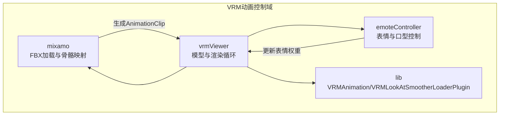
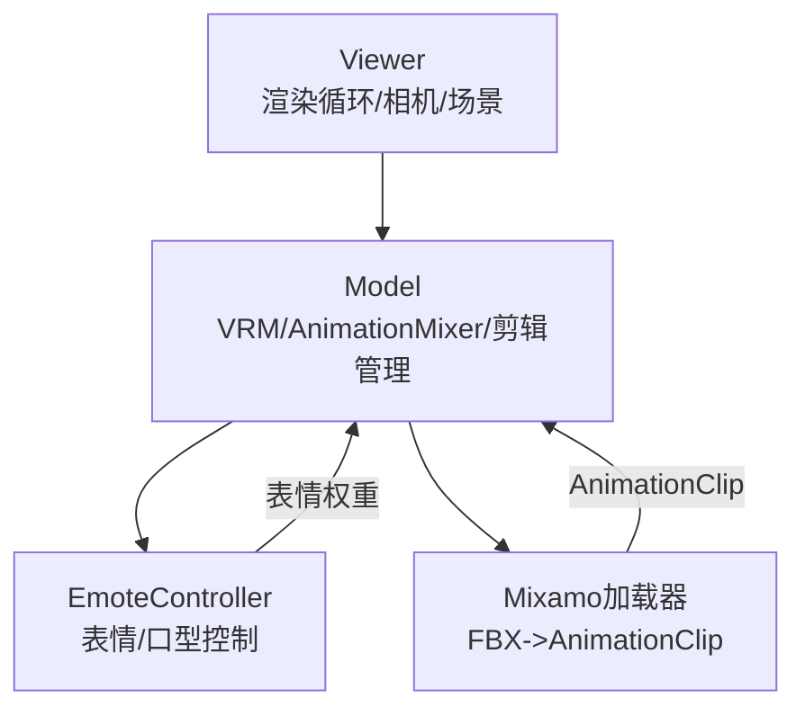
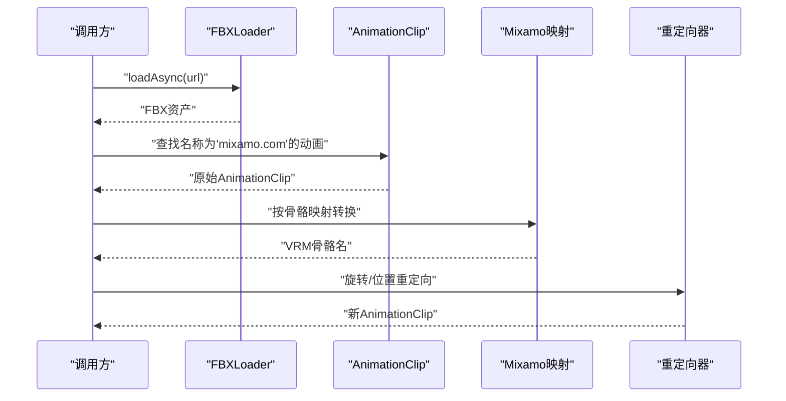
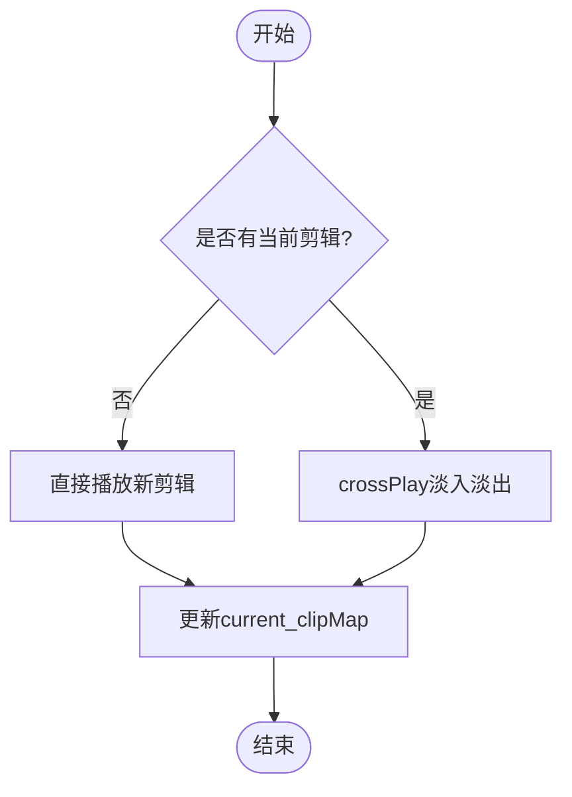
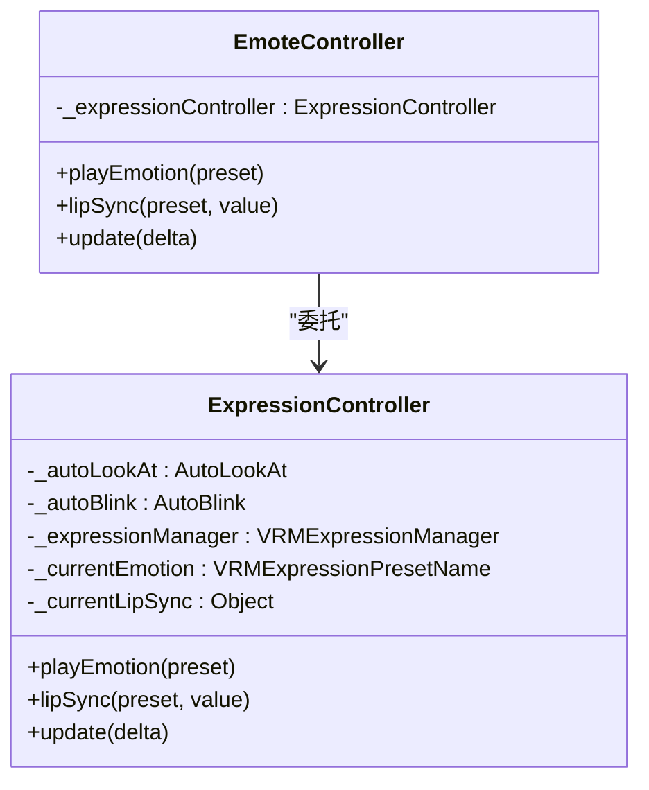
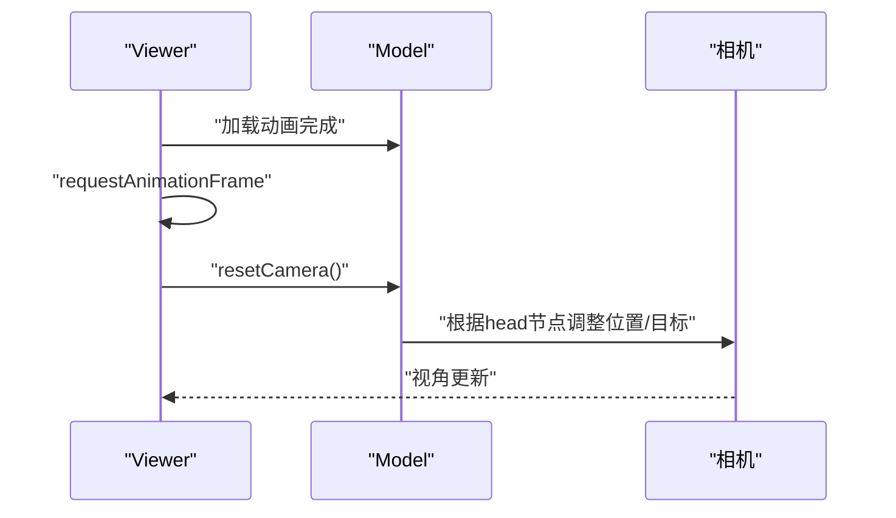
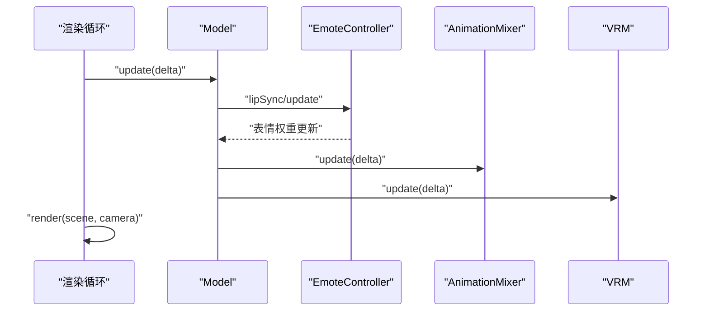
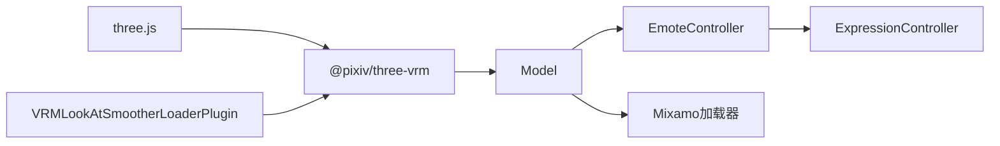

# VRM动画控制系统

<cite>
**本文档引用的文件**
- [loadMixamoAnimation.ts](file://domain-chatvrm/src/features/mixamo/loadMixamoAnimation.ts)
- [mixamoVRMRigMap.ts](file://domain-chatvrm/src/features/mixamo/mixamoVRMRigMap.ts)
- [expressionController.ts](file://domain-chatvrm/src/features/emoteController/expressionController.ts)
- [emoteController.ts](file://domain-chatvrm/src/features/emoteController/emoteController.ts)
- [model.ts](file://domain-chatvrm/src/features/vrmViewer/model.ts)
- [viewer.ts](file://domain-chatvrm/src/features/vrmViewer/viewer.ts)
- [viewerContext.ts](file://domain-chatvrm/src/features/vrmViewer/viewerContext.ts)
</cite>

## 目录
1. [简介](#简介)
2. [项目结构](#项目结构)
3. [核心组件](#核心组件)
4. [架构总览](#架构总览)
5. [详细组件分析](#详细组件分析)
6. [依赖关系分析](#依赖关系分析)
7. [性能考虑](#性能考虑)
8. [故障排除指南](#故障排除指南)
9. [结论](#结论)
10. [附录](#附录)

## 简介
本技术文档围绕VRM动画控制系统展开，系统基于Three.js与@pixiv/three-vrm实现，涵盖以下关键能力：
- VRM模型加载与初始化（含LookAt平滑插件）
- 动画文件加载与剪辑管理（支持VRMAnimation与FBX/Mixamo）
- 表情与口型同步控制（表情切换、自动眨眼、口型同步）
- 动作切换与混合（交叉淡化过渡）
- 动画原点校正与相机位置调整
- 性能优化策略（内存管理、帧率控制、GPU加速）

该系统同时提供Mixamo动画集成方案，包括FBX文件处理、骨骼映射与动画绑定流程，并通过统一的动画状态机实现idle循环、表情动画与动作切换。

## 项目结构
系统采用功能域划分，VRM动画相关代码集中在domain-chatvrm/src/features下，主要模块如下：
- mixamo：Mixamo动画加载与骨骼映射
- emoteController：表情与口型同步控制
- vrmViewer：模型管理、动画加载与渲染循环
- lib：VRMAnimation与VRMLookAtSmootherLoaderPlugin（外部库，由包管理器提供）

**图表来源**
- [viewer.ts](file://domain-chatvrm/src/features/vrmViewer/viewer.ts#L43-L92)
- [model.ts](file://domain-chatvrm/src/features/vrmViewer/model.ts#L34-L76)
- [loadMixamoAnimation.ts](file://domain-chatvrm/src/features/mixamo/loadMixamoAnimation.ts#L13-L103)

**章节来源**
- [viewer.ts](file://domain-chatvrm/src/features/vrmViewer/viewer.ts#L1-L205)
- [model.ts](file://domain-chatvrm/src/features/vrmViewer/model.ts#L1-L136)

## 核心组件
- Model：负责VRM模型加载、动画剪辑管理、动作播放与更新
- Viewer：场景搭建、渲染循环、相机控制、动画加载入口
- EmoteController/ExpressionController：表情与口型同步控制
- Mixamo加载器：FBX转VRM可用AnimationClip并进行骨骼重定向

**章节来源**
- [model.ts](file://domain-chatvrm/src/features/vrmViewer/model.ts#L18-L136)
- [viewer.ts](file://domain-chatvrm/src/features/vrmViewer/viewer.ts#L13-L205)
- [emoteController.ts](file://domain-chatvrm/src/features/emoteController/emoteController.ts#L9-L28)
- [expressionController.ts](file://domain-chatvrm/src/features/emoteController/expressionController.ts#L16-L77)
- [loadMixamoAnimation.ts](file://domain-chatvrm/src/features/mixamo/loadMixamoAnimation.ts#L13-L103)

## 架构总览
系统采用分层架构：
- 视图层：Viewer负责场景、相机与渲染循环
- 控制层：Model管理VRM与动画状态
- 表达层：EmoteController协调表情与口型
- 数据层：Mixamo加载器将FBX转换为VRM可用动画

**图表来源**
- [viewer.ts](file://domain-chatvrm/src/features/vrmViewer/viewer.ts#L13-L205)
- [model.ts](file://domain-chatvrm/src/features/vrmViewer/model.ts#L18-L136)
- [emoteController.ts](file://domain-chatvrm/src/features/emoteController/emoteController.ts#L9-L28)
- [expressionController.ts](file://domain-chatvrm/src/features/emoteController/expressionController.ts#L16-L77)
- [loadMixamoAnimation.ts](file://domain-chatvrm/src/features/mixamo/loadMixamoAnimation.ts#L13-L103)

## 详细组件分析

### Mixamo动画集成与骨骼映射
- 功能概述：从Mixamo下载的FBX动画导入，提取AnimationClip并进行骨骼重定向，适配VRM Humanoid骨骼体系
- 关键流程：
  1) 使用FBXLoader加载FBX资源
  2) 从animations集合中筛选名为'mixamo.com'的AnimationClip
  3) 遍历KeyframeTracks，按映射表将Mixamo骨骼名转换为VRM HumanBoneName
  4) 对旋转轨道应用rest-pose修正与坐标轴方向调整
  5) 对位置轨道按hips高度比例缩放以匹配VRM模型
  6) 生成新的AnimationClip并返回

**图表来源**
- [loadMixamoAnimation.ts](file://domain-chatvrm/src/features/mixamo/loadMixamoAnimation.ts#L13-L103)
- [mixamoVRMRigMap.ts](file://domain-chatvrm/src/features/mixamo/mixamoVRMRigMap.ts#L4-L57)

**章节来源**
- [loadMixamoAnimation.ts](file://domain-chatvrm/src/features/mixamo/loadMixamoAnimation.ts#L13-L103)
- [mixamoVRMRigMap.ts](file://domain-chatvrm/src/features/mixamo/mixamoVRMRigMap.ts#L4-L57)

### 动画状态机与剪辑管理
- 状态机设计要点：
  - idle循环：通过预加载多个idle动画，随机或条件切换
  - 表情动画：通过表情预设与权重控制实现平滑过渡
  - 动作切换：使用crossPlay实现淡入淡出，避免抖动
- 剪辑管理：
  - clipMap缓存已加载的AnimationClip
  - current_clipMap跟踪当前播放剪辑
  - 支持重复播放与跨剪辑过渡

**图表来源**
- [model.ts](file://domain-chatvrm/src/features/vrmViewer/model.ts#L78-L106)

**章节来源**
- [model.ts](file://domain-chatvrm/src/features/vrmViewer/model.ts#L18-L136)

### 表情与口型同步控制
- 表情控制：
  - ExpressionController维护当前表情与唇语状态
  - 切换表情时先将前一表情归零，再设置新表情
  - neutral时启用自动眨眼，其他表情禁用
- 口型同步：
  - LipSync分析音频音量，动态设置表情权重
  - 根据当前情绪调整权重比例，保证自然表现

**图表来源**
- [emoteController.ts](file://domain-chatvrm/src/features/emoteController/emoteController.ts#L9-L28)
- [expressionController.ts](file://domain-chatvrm/src/features/emoteController/expressionController.ts#L16-L77)

**章节来源**
- [emoteController.ts](file://domain-chatvrm/src/features/emoteController/emoteController.ts#L9-L28)
- [expressionController.ts](file://domain-chatvrm/src/features/emoteController/expressionController.ts#L16-L77)

### 动画原点校正与相机位置调整
- 问题背景：Mixamo动画原点与VRM模型不一致，导致初始播放时模型位置偏移
- 解决方案：
  1) 加载动画后延迟一帧执行resetCamera
  2) 通过head节点的世界坐标调整相机位置与目标
  3) 同步更新OrbitControls，确保视角稳定

**图表来源**
- [viewer.ts](file://domain-chatvrm/src/features/vrmViewer/viewer.ts#L87-L91)
- [viewer.ts](file://domain-chatvrm/src/features/vrmViewer/viewer.ts#L162-L175)

**章节来源**
- [viewer.ts](file://domain-chatvrm/src/features/vrmViewer/viewer.ts#L87-L91)
- [viewer.ts](file://domain-chatvrm/src/features/vrmViewer/viewer.ts#L162-L175)

### 渲染循环与更新流程
- 渲染循环：
  - 使用THREE.Clock获取delta
  - 更新Model.update，驱动AnimationMixer与VRM
  - 渲染场景与相机
- 更新顺序：
  1) LipSync分析音频并更新表情权重
  2) EmoteController.update处理表情与眨眼
  3) AnimationMixer.update推进动画
  4) VRM.update执行骨架与材质更新

**图表来源**
- [viewer.ts](file://domain-chatvrm/src/features/vrmViewer/viewer.ts#L177-L203)
- [model.ts](file://domain-chatvrm/src/features/vrmViewer/model.ts#L125-L134)

**章节来源**
- [viewer.ts](file://domain-chatvrm/src/features/vrmViewer/viewer.ts#L177-L203)
- [model.ts](file://domain-chatvrm/src/features/vrmViewer/model.ts#L125-L134)

## 依赖关系分析
- 外部依赖：
  - three.js：3D渲染与动画
  - @pixiv/three-vrm：VRM模型与动画管理
  - three-vrm插件：LookAt平滑与VRM扩展
- 内部依赖：
  - Viewer依赖Model与Mixamo加载器
  - Model依赖EmoteController与LipSync
  - EmoteController依赖ExpressionController与AutoBlink/AutoLookAt

**图表来源**
- [viewer.ts](file://domain-chatvrm/src/features/vrmViewer/viewer.ts#L1-L205)
- [model.ts](file://domain-chatvrm/src/features/vrmViewer/model.ts#L1-L136)
- [emoteController.ts](file://domain-chatvrm/src/features/emoteController/emoteController.ts#L1-L28)
- [expressionController.ts](file://domain-chatvrm/src/features/emoteController/expressionController.ts#L1-L77)
- [loadMixamoAnimation.ts](file://domain-chatvrm/src/features/mixamo/loadMixamoAnimation.ts#L1-L104)

**章节来源**
- [viewer.ts](file://domain-chatvrm/src/features/vrmViewer/viewer.ts#L1-L205)
- [model.ts](file://domain-chatvrm/src/features/vrmViewer/model.ts#L1-L136)

## 性能考虑
- 内存管理：
  - 使用VRMUtils.deepDispose卸载VRM场景树，防止内存泄漏
  - clipMap与current_clipMap复用AnimationClip，减少重复加载
- 帧率控制：
  - 使用THREE.Clock获取delta，确保动画与渲染同步
  - 合理设置blendTime与fade时间，平衡流畅度与性能
- GPU加速：
  - 启用WebGL渲染器与抗锯齿
  - 设置合适的像素比与渲染尺寸，避免过度渲染
- 渲染优化：
  - 禁用FrustumCulling以确保VRM在移动时可见
  - 合理设置光源与相机参数，减少不必要的计算

**章节来源**
- [model.ts](file://domain-chatvrm/src/features/vrmViewer/model.ts#L55-L60)
- [viewer.ts](file://domain-chatvrm/src/features/vrmViewer/viewer.ts#L65-L68)
- [viewer.ts](file://domain-chatvrm/src/features/vrmViewer/viewer.ts#L109-L116)

## 故障排除指南
- VRM未加载即调用动画：
  - 现象：抛出错误提示需先加载VRM
  - 处理：确保loadVRM完成后才调用loadAnimation或loadFBX
- 动画播放异常：
  - 检查clipMap是否正确填充
  - 确认AnimationMixer存在且未被释放
- 表情切换闪烁：
  - 检查表情权重归零逻辑与过渡时间
  - 确保neutral时启用自动眨眼
- 相机视角异常：
  - 确认resetCamera在动画加载后执行
  - 检查head节点是否存在且可获取世界坐标

**章节来源**
- [model.ts](file://domain-chatvrm/src/features/vrmViewer/model.ts#L67-L76)
- [model.ts](file://domain-chatvrm/src/features/vrmViewer/model.ts#L78-L97)
- [expressionController.ts](file://domain-chatvrm/src/features/emoteController/expressionController.ts#L35-L51)
- [viewer.ts](file://domain-chatvrm/src/features/vrmViewer/viewer.ts#L87-L91)

## 结论
本VRM动画控制系统通过清晰的模块划分与稳健的实现，提供了完整的动画加载、剪辑管理、表情与口型同步以及动作切换能力。Mixamo集成方案有效解决了骨骼映射与坐标系差异问题；原点校正与相机调整确保了良好的视觉体验；性能优化策略覆盖内存、帧率与GPU层面，适合在Web端稳定运行。建议后续扩展更多表情预设与动作类型，并引入动画压缩与流式加载以进一步提升性能。

## 附录
- 实际支持的动画文件格式：
  - FBX（Mixamo动画）
  - VRMA（VRM Animation规范）
- 加载示例路径：
  - Mixamo动画加载：[loadMixamoAnimation.ts](file://domain-chatvrm/src/features/mixamo/loadMixamoAnimation.ts#L13-L103)
  - VRM动画加载：[model.ts](file://domain-chatvrm/src/features/vrmViewer/model.ts#L67-L76)
- 调试技巧：
  - 使用console输出相对旋转值定位模型朝向问题
  - 逐步验证head节点坐标以确认相机重置效果
  - 通过交叉淡化测试动作切换流畅度