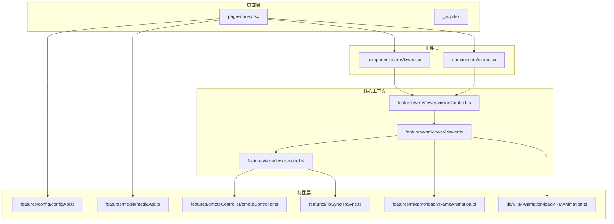
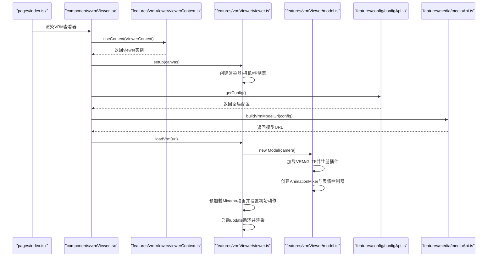
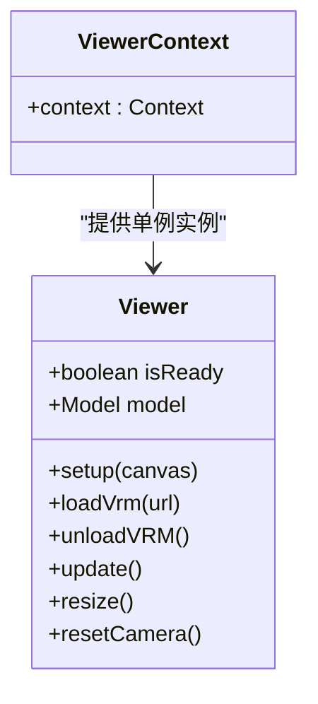
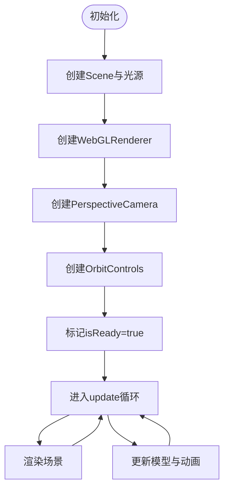
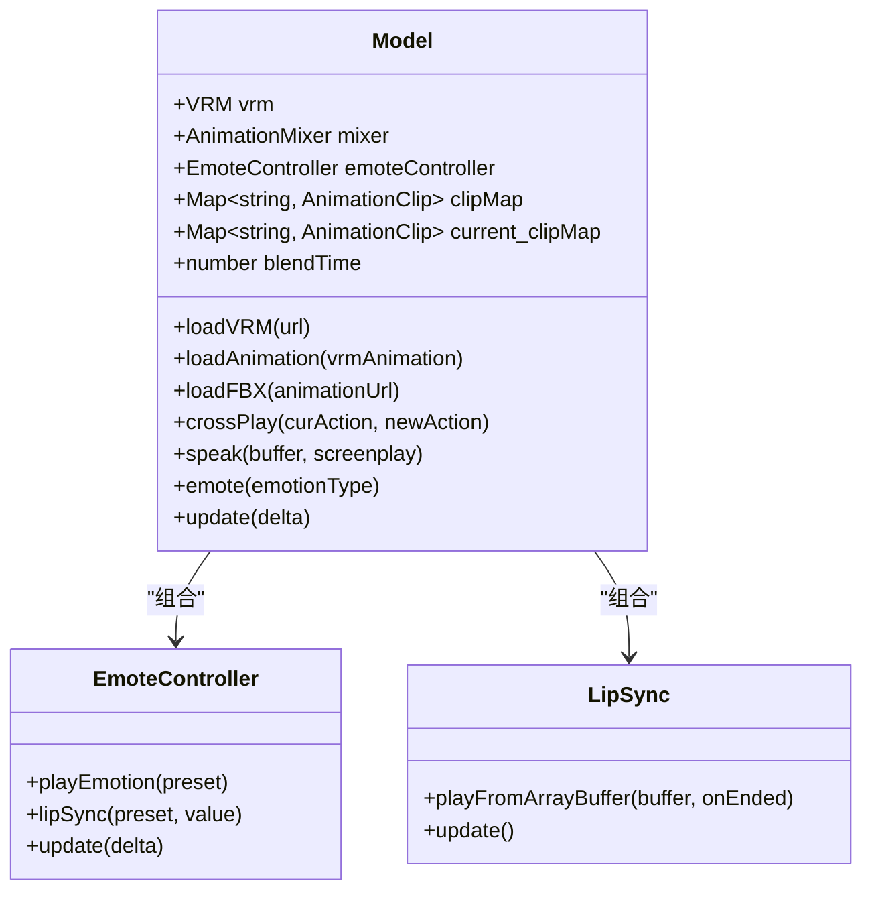
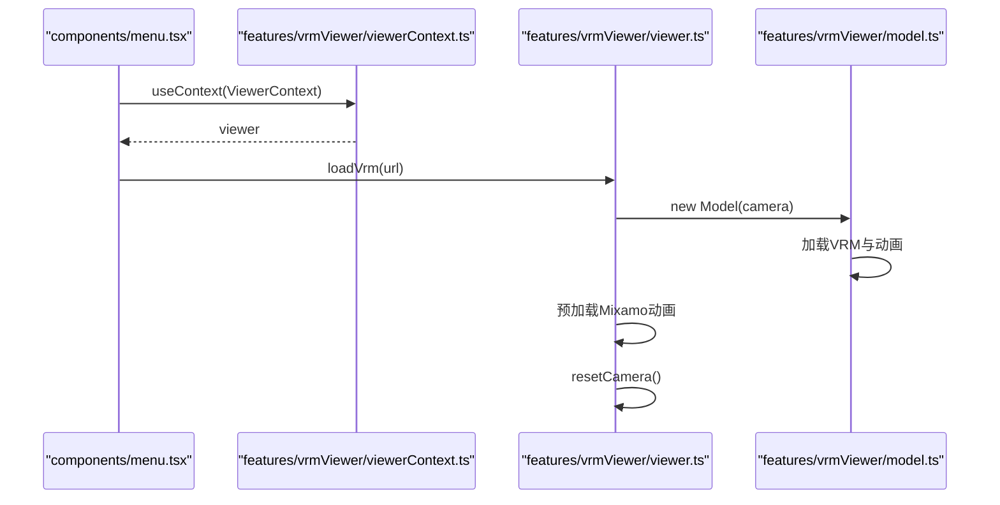
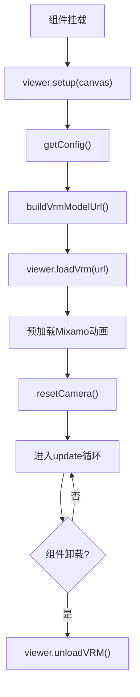
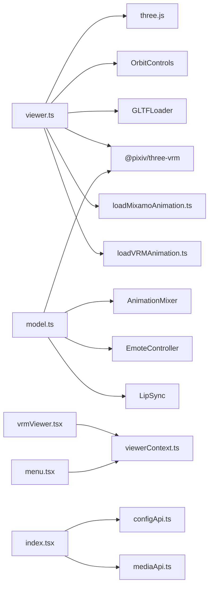

# VRM查看器上下文管理

<cite>
**本文档引用的文件**
- [viewerContext.ts](file://domain-chatvrm/src/features/vrmViewer/viewerContext.ts)
- [viewer.ts](file://domain-chatvrm/src/features/vrmViewer/viewer.ts)
- [model.ts](file://domain-chatvrm/src/features/vrmViewer/model.ts)
- [vrmViewer.tsx](file://domain-chatvrm/src/components/vrmViewer.tsx)
- [index.tsx](file://domain-chatvrm/src/pages/index.tsx)
- [menu.tsx](file://domain-chatvrm/src/components/menu.tsx)
- [configApi.ts](file://domain-chatvrm/src/features/config/configApi.ts)
- [mediaApi.ts](file://domain-chatvrm/src/features/media/mediaApi.ts)
- [_app.tsx](file://domain-chatvrm/src/pages/_app.tsx)
- [loadMixamoAnimation.ts](file://domain-chatvrm/src/features/mixamo/loadMixamoAnimation.ts)
- [loadVRMAnimation.ts](file://domain-chatvrm/src/lib/VRMAnimation/loadVRMAnimation.ts)
- [emoteController.ts](file://domain-chatvrm/src/features/emoteController/emoteController.ts)
- [lipSync.ts](file://domain-chatvrm/src/features/lipSync/lipSync.ts)
</cite>

## 目录
1. [简介](#简介)
2. [项目结构](#项目结构)
3. [核心组件](#核心组件)
4. [架构总览](#架构总览)
5. [详细组件分析](#详细组件分析)
6. [依赖关系分析](#依赖关系分析)
7. [性能考虑](#性能考虑)
8. [故障排除指南](#故障排除指南)
9. [结论](#结论)
10. [附录](#附录)

## 简介
本文件针对VRM查看器的上下文管理模块进行深入技术文档化，重点覆盖以下方面：
- ViewerContext的设计模式：单例式上下文、全局状态容器、组件间通信机制
- 上下文数据结构：模型状态、相机状态、动画状态、用户偏好设置
- 生命周期管理：初始化流程、状态更新、资源清理、错误处理
- 与React组件的集成：Hook使用、状态订阅、事件传播
- 扩展开发指南：自定义状态添加、第三方库集成、性能监控
- 调试工具与最佳实践建议

## 项目结构
VRM查看器上下文管理位于domain-chatvrm前端工程中，采用按功能域划分的组织方式：
- features/vrmViewer：VRM渲染与上下文核心逻辑
- components：UI组件（如vrmViewer、menu等）
- features/*：业务特性模块（配置、媒体、表情控制、唇同步等）
- pages：页面入口（Next.js）

图表来源
- [index.tsx](file://domain-chatvrm/src/pages/index.tsx#L1-L390)
- [vrmViewer.tsx](file://domain-chatvrm/src/components/vrmViewer.tsx#L1-L59)
- [menu.tsx](file://domain-chatvrm/src/components/menu.tsx#L1-L165)
- [viewerContext.ts](file://domain-chatvrm/src/features/vrmViewer/viewerContext.ts#L1-L7)
- [viewer.ts](file://domain-chatvrm/src/features/vrmViewer/viewer.ts#L1-L205)
- [model.ts](file://domain-chatvrm/src/features/vrmViewer/model.ts#L1-L136)

章节来源
- [index.tsx](file://domain-chatvrm/src/pages/index.tsx#L1-L390)
- [viewerContext.ts](file://domain-chatvrm/src/features/vrmViewer/viewerContext.ts#L1-L7)

## 核心组件
本节从设计模式、数据结构、生命周期三个维度解析上下文管理。

- 设计模式
  - 单例式上下文：通过React Context创建全局共享的Viewer实例，避免重复构造与状态分散
  - 命令式渲染器：Viewer封装three.js场景、相机、渲染器、控制器与动画循环，提供命令式方法供组件调用
  - 组合式状态：Model聚合VRM模型、AnimationMixer、表情与唇同步控制器，统一管理动画与表现

- 数据结构
  - 模型状态：VRM对象、AnimationMixer、表情控制器、当前动画剪辑映射
  - 相机状态：PerspectiveCamera、OrbitControls目标与位置
  - 动画状态：clipMap（预加载动画）、current_clipMap（当前播放剪辑）、crossFade混合参数
  - 用户偏好设置：来自全局配置API的characterConfig、ttsConfig等

- 生命周期
  - 初始化：组件挂载时传入canvas给Viewer.setup，建立渲染器、相机与控制器
  - 加载：Viewer.loadVrm异步加载VRM/GLTF，注册VRM插件，构建AnimationMixer与表情控制器
  - 更新：Viewer.update驱动requestAnimationFrame循环，逐帧更新模型、表情与渲染
  - 清理：Viewer.unloadVRM释放场景与资源；组件卸载时可触发清理逻辑

章节来源
- [viewerContext.ts](file://domain-chatvrm/src/features/vrmViewer/viewerContext.ts#L1-L7)
- [viewer.ts](file://domain-chatvrm/src/features/vrmViewer/viewer.ts#L13-L205)
- [model.ts](file://domain-chatvrm/src/features/vrmViewer/model.ts#L18-L136)
- [vrmViewer.tsx](file://domain-chatvrm/src/components/vrmViewer.tsx#L10-L59)
- [configApi.ts](file://domain-chatvrm/src/features/config/configApi.ts#L68-L100)
- [mediaApi.ts](file://domain-chatvrm/src/features/media/mediaApi.ts#L113-L122)

## 架构总览
下图展示从页面到上下文再到渲染器的整体交互：

图表来源
- [index.tsx](file://domain-chatvrm/src/pages/index.tsx#L67-L82)
- [vrmViewer.tsx](file://domain-chatvrm/src/components/vrmViewer.tsx#L16-L48)
- [viewerContext.ts](file://domain-chatvrm/src/features/vrmViewer/viewerContext.ts#L1-L7)
- [viewer.ts](file://domain-chatvrm/src/features/vrmViewer/viewer.ts#L104-L136)
- [model.ts](file://domain-chatvrm/src/features/vrmViewer/model.ts#L34-L53)
- [configApi.ts](file://domain-chatvrm/src/features/config/configApi.ts#L68-L80)
- [mediaApi.ts](file://domain-chatvrm/src/features/media/mediaApi.ts#L113-L122)

## 详细组件分析

### ViewerContext与单例模式
- 单例实现：在viewerContext.ts中创建单例Viewer实例，并通过React Context导出，确保全局唯一
- 全局状态：Viewer持有isReady、model等状态，供各组件读取
- 组件通信：组件通过useContext读取viewer，直接调用setup、loadVrm、unloadVRM等方法

图表来源
- [viewerContext.ts](file://domain-chatvrm/src/features/vrmViewer/viewerContext.ts#L1-L7)
- [viewer.ts](file://domain-chatvrm/src/features/vrmViewer/viewer.ts#L13-L205)

章节来源
- [viewerContext.ts](file://domain-chatvrm/src/features/vrmViewer/viewerContext.ts#L1-L7)

### Viewer类：渲染器与相机管理
- 场景与光照：初始化Scene、DirectionalLight、AmbientLight
- 渲染器：WebGLRenderer，alpha透明、抗锯齿、像素比适配
- 相机与控制器：PerspectiveCamera与OrbitControls，支持拖拽旋转、平移
- 动画循环：Clock驱动update，逐帧渲染与模型更新
- 生命周期：setup建立渲染环境；resize响应窗口变化；resetCamera基于头部节点校准

图表来源
- [viewer.ts](file://domain-chatvrm/src/features/vrmViewer/viewer.ts#L23-L41)
- [viewer.ts](file://domain-chatvrm/src/features/vrmViewer/viewer.ts#L104-L136)
- [viewer.ts](file://domain-chatvrm/src/features/vrmViewer/viewer.ts#L177-L203)

章节来源
- [viewer.ts](file://domain-chatvrm/src/features/vrmViewer/viewer.ts#L13-L205)

### Model类：VRM模型与动画管理
- VRM加载：GLTFLoader注册VRMLoaderPlugin与LookAt插件，提取userData.vrm
- AnimationMixer：为VRM场景创建混合器，支持多动画剪辑播放与交叉淡化
- 表情与唇同步：EmoteController负责表情播放，LipSync分析音频振幅驱动口型
- 动画切换：loadFBX根据clipMap与current_clipMap选择剪辑，crossPlay实现淡入淡出

图表来源
- [model.ts](file://domain-chatvrm/src/features/vrmViewer/model.ts#L18-L136)
- [emoteController.ts](file://domain-chatvrm/src/features/emoteController/emoteController.ts#L9-L28)
- [lipSync.ts](file://domain-chatvrm/src/features/lipSync/lipSync.ts#L5-L80)

章节来源
- [model.ts](file://domain-chatvrm/src/features/vrmViewer/model.ts#L18-L136)
- [emoteController.ts](file://domain-chatvrm/src/features/emoteController/emoteController.ts#L1-L28)
- [lipSync.ts](file://domain-chatvrm/src/features/lipSync/lipSync.ts#L1-L80)

### 组件集成：React Hook与事件传播
- 页面集成：index.tsx作为主页面，注入全局配置与媒体URL，调用speakCharacter触发VRM说话与表情
- 查看器组件：vrmViewer.tsx在canvas回调中调用viewer.setup与viewer.loadVrm，支持拖拽替换VRM
- 菜单组件：menu.tsx通过ViewerContext访问viewer，支持本地文件与远程URL加载VRM
- Hook使用：useContext读取上下文；useCallback优化回调；useEffect处理副作用

图表来源
- [menu.tsx](file://domain-chatvrm/src/components/menu.tsx#L44-L102)
- [viewerContext.ts](file://domain-chatvrm/src/features/vrmViewer/viewerContext.ts#L1-L7)
- [viewer.ts](file://domain-chatvrm/src/features/vrmViewer/viewer.ts#L43-L92)
- [model.ts](file://domain-chatvrm/src/features/vrmViewer/model.ts#L34-L53)

章节来源
- [index.tsx](file://domain-chatvrm/src/pages/index.tsx#L116-L126)
- [vrmViewer.tsx](file://domain-chatvrm/src/components/vrmViewer.tsx#L16-L48)
- [menu.tsx](file://domain-chatvrm/src/components/menu.tsx#L72-L98)

### 生命周期管理：初始化、更新、清理与错误处理
- 初始化流程：组件挂载→setup(canvas)→getConfig()→buildVrmModelUrl()→loadVrm()
- 状态更新：update循环逐帧调用model.update、emoteController.update、mixer.update
- 资源清理：unloadVRM释放场景与VRM对象；组件卸载时可触发清理
- 错误处理：loadVRM与playFromArrayBuffer包含异常捕获与日志输出

图表来源
- [vrmViewer.tsx](file://domain-chatvrm/src/components/vrmViewer.tsx#L16-L48)
- [viewer.ts](file://domain-chatvrm/src/features/vrmViewer/viewer.ts#L104-L136)
- [viewer.ts](file://domain-chatvrm/src/features/vrmViewer/viewer.ts#L162-L175)
- [viewer.ts](file://domain-chatvrm/src/features/vrmViewer/viewer.ts#L94-L99)

章节来源
- [viewer.ts](file://domain-chatvrm/src/features/vrmViewer/viewer.ts#L104-L136)
- [viewer.ts](file://domain-chatvrm/src/features/vrmViewer/viewer.ts#L162-L175)
- [viewer.ts](file://domain-chatvrm/src/features/vrmViewer/viewer.ts#L94-L99)
- [lipSync.ts](file://domain-chatvrm/src/features/lipSync/lipSync.ts#L51-L72)

### 数据结构与状态管理
- 模型状态：vrm、mixer、emoteController、clipMap、current_clipMap、blendTime
- 相机状态：camera位置、控制器目标、投影矩阵
- 动画状态：预加载动画集合、当前播放剪辑、交叉淡化权重
- 用户偏好设置：characterConfig、ttsConfig、conversationConfig等

章节来源
- [model.ts](file://domain-chatvrm/src/features/vrmViewer/model.ts#L18-L32)
- [viewer.ts](file://domain-chatvrm/src/features/vrmViewer/viewer.ts#L17-L21)
- [configApi.ts](file://domain-chatvrm/src/features/config/configApi.ts#L27-L63)

## 依赖关系分析
- Viewer依赖three.js、@pixiv/three-vrm、OrbitControls与GLTFLoader
- Model依赖VRMLoaderPlugin、VRMLookAtSmootherLoaderPlugin、AnimationMixer
- 动画加载依赖loadMixamoAnimation与loadVRMAnimation
- 组件依赖React Context与Hook，通过ViewerContext共享状态

图表来源
- [viewer.ts](file://domain-chatvrm/src/features/vrmViewer/viewer.ts#L1-L7)
- [model.ts](file://domain-chatvrm/src/features/vrmViewer/model.ts#L1-L10)
- [loadMixamoAnimation.ts](file://domain-chatvrm/src/features/mixamo/loadMixamoAnimation.ts#L1-L104)
- [loadVRMAnimation.ts](file://domain-chatvrm/src/lib/VRMAnimation/loadVRMAnimation.ts#L1-L16)
- [vrmViewer.tsx](file://domain-chatvrm/src/components/vrmViewer.tsx#L1-L2)
- [menu.tsx](file://domain-chatvrm/src/components/menu.tsx#L5-L7)
- [index.tsx](file://domain-chatvrm/src/pages/index.tsx#L17-L19)
- [configApi.ts](file://domain-chatvrm/src/features/config/configApi.ts#L1-L2)
- [mediaApi.ts](file://domain-chatvrm/src/features/media/mediaApi.ts#L1-L2)

章节来源
- [viewer.ts](file://domain-chatvrm/src/features/vrmViewer/viewer.ts#L1-L7)
- [model.ts](file://domain-chatvrm/src/features/vrmViewer/model.ts#L1-L10)
- [loadMixamoAnimation.ts](file://domain-chatvrm/src/features/mixamo/loadMixamoAnimation.ts#L1-L104)
- [loadVRMAnimation.ts](file://domain-chatvrm/src/lib/VRMAnimation/loadVRMAnimation.ts#L1-L16)
- [vrmViewer.tsx](file://domain-chatvrm/src/components/vrmViewer.tsx#L1-L2)
- [menu.tsx](file://domain-chatvrm/src/components/menu.tsx#L5-L7)
- [index.tsx](file://domain-chatvrm/src/pages/index.tsx#L17-L19)
- [configApi.ts](file://domain-chatvrm/src/features/config/configApi.ts#L1-L2)
- [mediaApi.ts](file://domain-chatvrm/src/features/media/mediaApi.ts#L1-L2)

## 性能考虑
- 渲染性能
  - 抗锯齿与sRGB编码提升视觉质量
  - frustumCulled禁用避免小模型被剔除
  - requestAnimationFrame驱动渲染，避免阻塞主线程
- 动画性能
  - AnimationMixer集中管理动画剪辑，减少重复创建
  - crossPlay淡入淡出避免抖动，提升观感
- 资源管理
  - VRM资源释放使用deepDispose，防止内存泄漏
  - 动画剪辑预加载减少首帧卡顿
- 网络与I/O
  - URL构建与代理配置由configApi与mediaApi统一管理
  - 拖拽上传与远程加载双通道，提升用户体验

[本节为通用性能指导，无需特定文件引用]

## 故障排除指南
- VRM加载失败
  - 检查loadVrm返回路径与权限
  - 确认GLTFLoader已注册VRM插件
  - 查看控制台错误日志
- 相机视角异常
  - 调用resetCamera基于头部节点重置目标
  - 检查OrbitControls目标与相机位置
- 动画切换抖动
  - 使用crossPlay替代直接切换
  - 调整blendTime参数
- 唇同步无声或异常
  - 检查AudioContext与AnalyserNode连接
  - 确认playFromArrayBuffer成功解码音频
- 资源未释放
  - 调用unloadVRM并确认场景移除
  - 在组件卸载时触发清理逻辑

章节来源
- [viewer.ts](file://domain-chatvrm/src/features/vrmViewer/viewer.ts#L43-L92)
- [viewer.ts](file://domain-chatvrm/src/features/vrmViewer/viewer.ts#L162-L175)
- [model.ts](file://domain-chatvrm/src/features/vrmViewer/model.ts#L99-L106)
- [lipSync.ts](file://domain-chatvrm/src/features/lipSync/lipSync.ts#L51-L72)
- [model.ts](file://domain-chatvrm/src/features/vrmViewer/model.ts#L55-L60)

## 结论
VRM查看器上下文管理通过单例式React Context与命令式Viewer封装，实现了清晰的状态边界与高效的组件通信。Viewer统一管理three.js渲染管线，Model聚合VRM动画与表现层，配合配置与媒体API完成端到端的VRM查看体验。该架构具备良好的扩展性，便于后续添加自定义状态、集成第三方库与引入性能监控工具。

[本节为总结性内容，无需特定文件引用]

## 附录

### 扩展开发指南
- 自定义状态添加
  - 在Viewer或Model中新增字段，暴露只读getter或受控setter
  - 在组件中通过useContext读取并使用
- 第三方库集成
  - 通过loadMixamoAnimation与loadVRMAnimation统一接入新动画格式
  - 在Model中扩展clipMap与current_clipMap，保持接口一致
- 性能监控
  - 在update循环中统计帧耗时，输出到控制台或指标系统
  - 对大模型与复杂动画启用LOD或裁剪策略

[本节为通用指导，无需特定文件引用]

### 调试工具与最佳实践
- 调试工具
  - 使用浏览器开发者工具观察three.js场景与渲染状态
  - 在viewer.update中打印关键变量（如相对旋转）辅助定位问题
- 最佳实践
  - 组件内仅通过ViewerContext读取与调用，避免直接操作底层three.js对象
  - 将URL构建与配置管理集中在configApi与mediaApi，统一入口
  - 对外暴露稳定的方法签名，内部实现可演进

[本节为通用指导，无需特定文件引用]