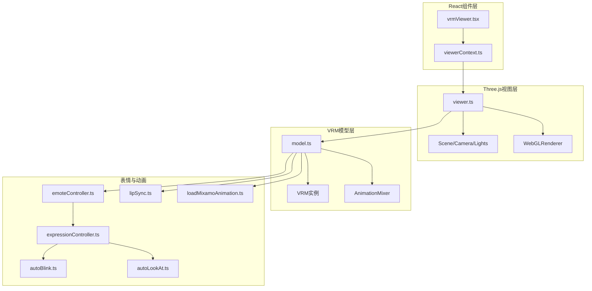
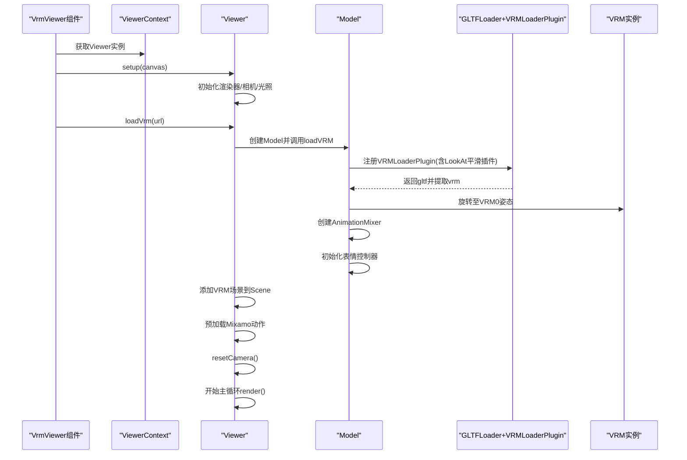
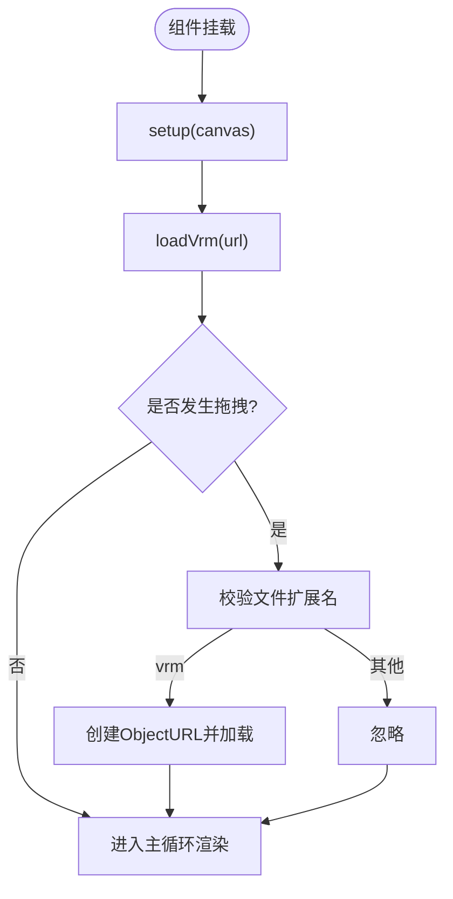
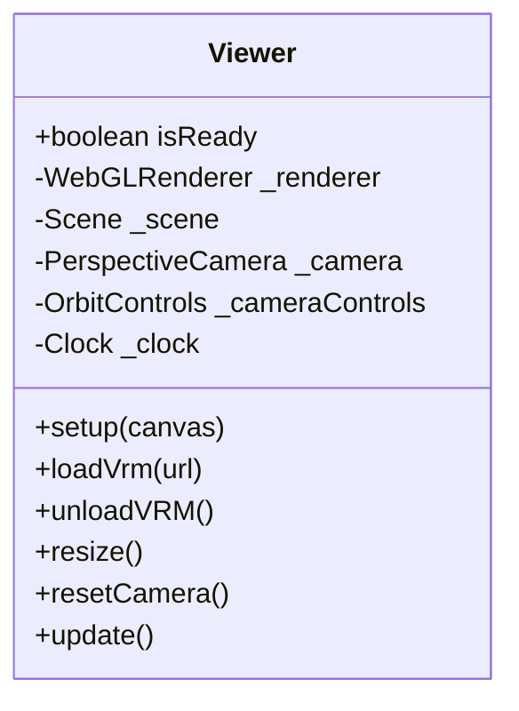
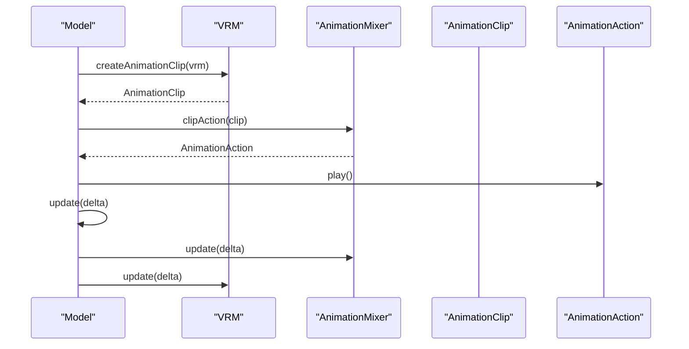
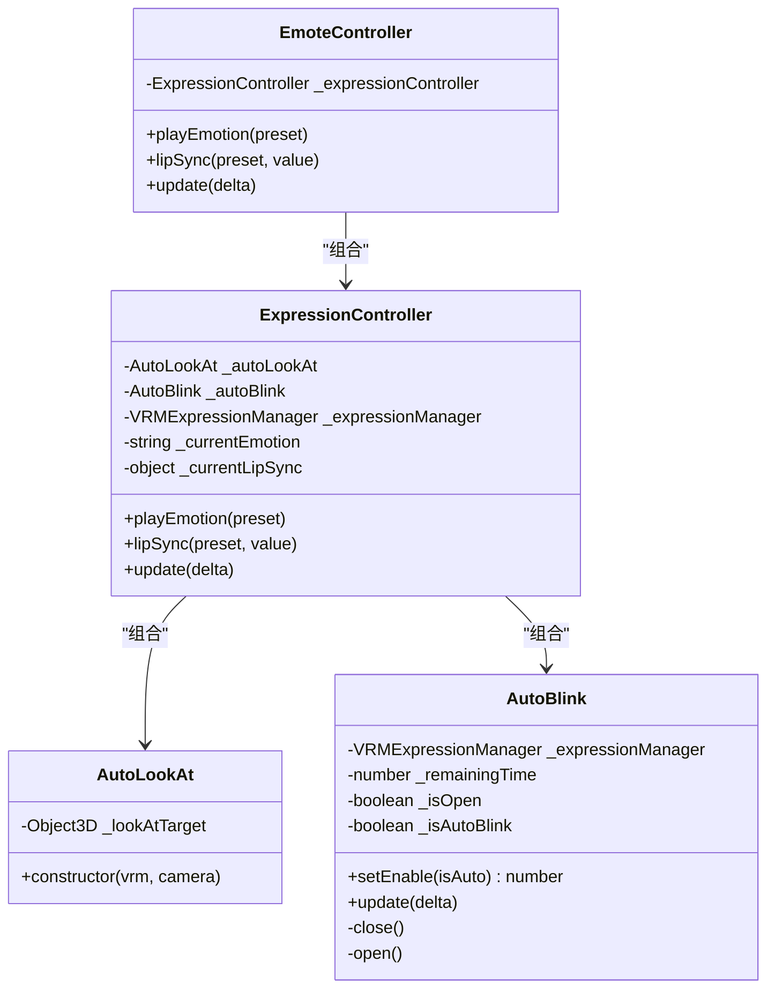
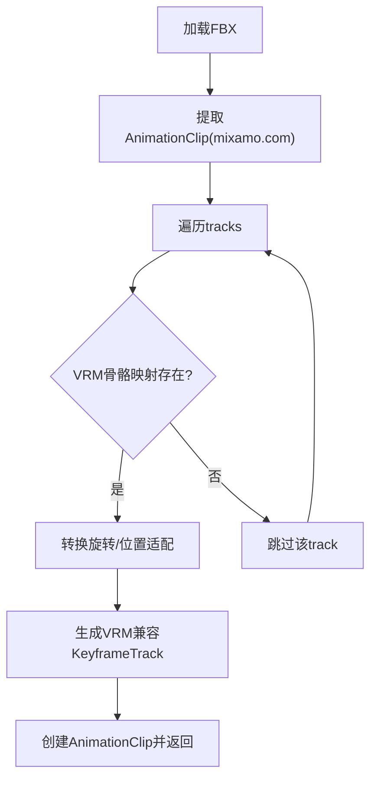
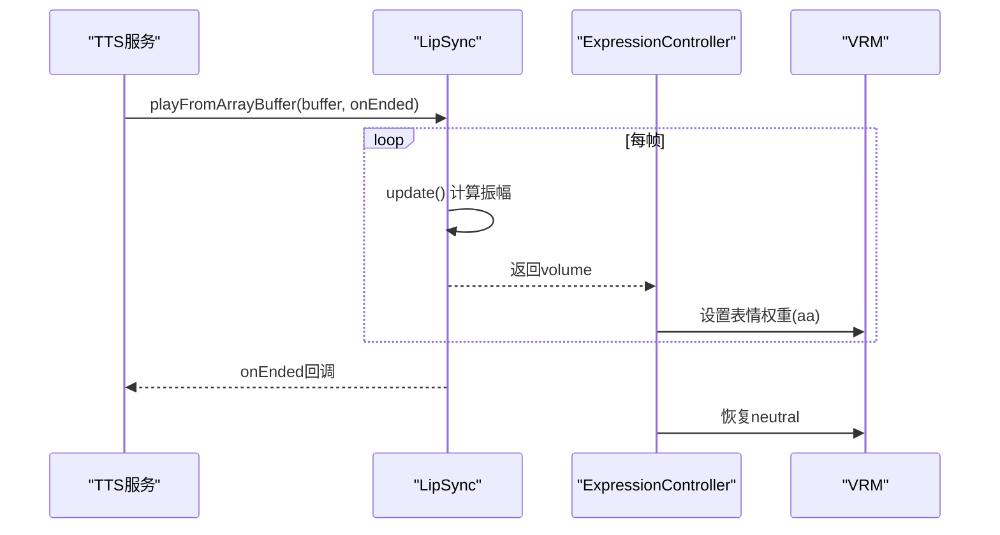
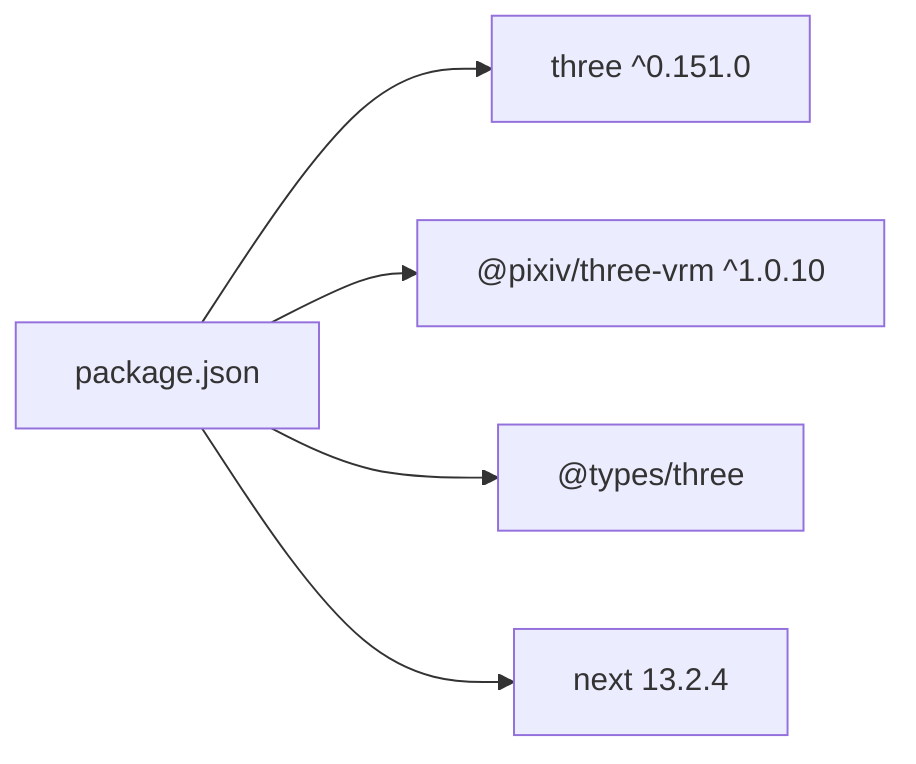

# VRM模型展示系统

<cite>
**本文档引用的文件**
- [vrmViewer.tsx](file://domain-chatvrm/src/components/vrmViewer.tsx)
- [viewer.ts](file://domain-chatvrm/src/features/vrmViewer/viewer.ts)
- [model.ts](file://domain-chatvrm/src/features/vrmViewer/model.ts)
- [viewerContext.ts](file://domain-chatvrm/src/features/vrmViewer/viewerContext.ts)
- [emoteController.ts](file://domain-chatvrm/src/features/emoteController/emoteController.ts)
- [expressionController.ts](file://domain-chatvrm/src/features/emoteController/expressionController.ts)
- [autoBlink.ts](file://domain-chatvrm/src/features/emoteController/autoBlink.ts)
- [autoLookAt.ts](file://domain-chatvrm/src/features/emoteController/autoLookAt.ts)
- [emoteConstants.ts](file://domain-chatvrm/src/features/emoteController/emoteConstants.ts)
- [loadMixamoAnimation.ts](file://domain-chatvrm/src/features/mixamo/loadMixamoAnimation.ts)
- [lipSync.ts](file://domain-chatvrm/src/features/lipSync/lipSync.ts)
- [package.json](file://domain-chatvrm/package.json)
</cite>

## 目录
1. [简介](#简介)
2. [项目结构](#项目结构)
3. [核心组件](#核心组件)
4. [架构总览](#架构总览)
5. [详细组件分析](#详细组件分析)
6. [依赖关系分析](#依赖关系分析)
7. [性能考虑](#性能考虑)
8. [故障排除指南](#故障排除指南)
9. [结论](#结论)
10. [附录](#附录)

## 简介
本项目是一个基于 Three.js 的 VRM 模型展示系统，集成了 VRM Viewer 组件、动画系统、表情与语音同步（Lip Sync）、自动眨眼与视线跟随功能。系统通过 React + Next.js 提供前端界面，Three.js 负责 3D 渲染，@pixiv/three-vrm 提供 VRM 规范支持，结合 Mixamo 动作数据与 VRMAnimation 库实现丰富的角色表现。

## 项目结构
前端位于 domain-chatvrm 目录，采用 Next.js + TypeScript 构建。核心模块包括：
- 组件层：vrmViewer.tsx 提供 React 展示容器
- 视图层：viewer.ts 实现 Three.js 场景、相机、渲染器与主循环
- 模型层：model.ts 封装 VRM 加载、动画混音、表情与语音同步
- 表情与动画：emoteController、expressionController、autoBlink、autoLookAt
- 动画转换：loadMixamoAnimation 将 Mixamo 动作适配到 VRM 骨骼
- 语音同步：lipSync 基于 Web Audio 分析音频振幅驱动表情

**图表来源**
- [vrmViewer.tsx](file://domain-chatvrm/src/components/vrmViewer.tsx#L1-L59)
- [viewer.ts](file://domain-chatvrm/src/features/vrmViewer/viewer.ts#L1-L205)
- [model.ts](file://domain-chatvrm/src/features/vrmViewer/model.ts#L1-L136)
- [emoteController.ts](file://domain-chatvrm/src/features/emoteController/emoteController.ts#L1-L28)
- [expressionController.ts](file://domain-chatvrm/src/features/emoteController/expressionController.ts#L1-L77)
- [autoBlink.ts](file://domain-chatvrm/src/features/emoteController/autoBlink.ts#L1-L65)
- [autoLookAt.ts](file://domain-chatvrm/src/features/emoteController/autoLookAt.ts#L1-L18)
- [lipSync.ts](file://domain-chatvrm/src/features/lipSync/lipSync.ts#L1-L80)
- [loadMixamoAnimation.ts](file://domain-chatvrm/src/features/mixamo/loadMixamoAnimation.ts#L1-L104)

**章节来源**
- [vrmViewer.tsx](file://domain-chatvrm/src/components/vrmViewer.tsx#L1-L59)
- [viewer.ts](file://domain-chatvrm/src/features/vrmViewer/viewer.ts#L1-L205)
- [model.ts](file://domain-chatvrm/src/features/vrmViewer/model.ts#L1-L136)

## 核心组件
- VRMViewer 组件：负责挂载 Canvas、初始化 Viewer、加载 VRM 模型，并支持拖拽替换模型。
- Viewer 类：管理场景、相机、渲染器、光照、主循环与窗口尺寸自适应；负责模型加载与动作预加载。
- Model 类：封装 VRM 加载、动画混音、表情控制器、语音同步与更新逻辑。
- 表情控制器：统一管理表情、自动眨眼、视线跟随与 Lip Sync 同步。
- 动画加载：支持 Mixamo FBX 动作转换与播放，以及跨淡入淡出切换。
- 语音同步：基于 Web Audio 分析音频振幅，驱动 VRM 表情权重。

**章节来源**
- [vrmViewer.tsx](file://domain-chatvrm/src/components/vrmViewer.tsx#L10-L58)
- [viewer.ts](file://domain-chatvrm/src/features/vrmViewer/viewer.ts#L13-L205)
- [model.ts](file://domain-chatvrm/src/features/vrmViewer/model.ts#L18-L136)
- [emoteController.ts](file://domain-chatvrm/src/features/emoteController/emoteController.ts#L9-L27)

## 架构总览
系统采用分层架构：
- 表现层：React 组件负责用户交互与事件（拖拽、窗口大小变化）
- 视图层：Viewer 管理 Three.js 场景与渲染管线
- 模型层：Model 封装 VRM 加载、动画与行为逻辑
- 动作与表情层：表情控制器与动作加载器
- 数据与资源层：音频分析、动画文件与 VRM 文件

**图表来源**
- [vrmViewer.tsx](file://domain-chatvrm/src/components/vrmViewer.tsx#L16-L51)
- [viewer.ts](file://domain-chatvrm/src/features/vrmViewer/viewer.ts#L43-L92)
- [model.ts](file://domain-chatvrm/src/features/vrmViewer/model.ts#L34-L53)

## 详细组件分析

### VRMViewer 组件
职责：
- 接收全局配置，初始化 Viewer
- 从配置中构建 VRM 模型 URL 并加载
- 支持拖拽替换模型（仅接受 .vrm 文件）

关键流程：
- setup(canvas)：初始化渲染器、相机、轨道控制器
- loadVrm(url)：通过 Model 加载 VRM
- 拖拽事件监听：读取本地文件并加载

**图表来源**
- [vrmViewer.tsx](file://domain-chatvrm/src/components/vrmViewer.tsx#L16-L51)

**章节来源**
- [vrmViewer.tsx](file://domain-chatvrm/src/components/vrmViewer.tsx#L10-L58)

### Viewer 类（场景与渲染）
职责：
- 场景初始化与光照设置（方向光 + 环境光）
- 渲染器配置（透明背景、抗锯齿、像素比）
- 相机与轨道控制器初始化
- 主循环：delta 更新、渲染
- 尺寸自适应与相机重置（基于 VRM Head 节点）

关键点：
- 使用 Clock 计算帧间隔
- frustumCulled 关闭以避免模型被剔除
- 相机位置与目标根据 VRM 头部节点动态调整

**图表来源**
- [viewer.ts](file://domain-chatvrm/src/features/vrmViewer/viewer.ts#L13-L205)

**章节来源**
- [viewer.ts](file://domain-chatvrm/src/features/vrmViewer/viewer.ts#L23-L136)

### Model 类（VRM与动画）
职责：
- 通过 GLTFLoader + VRMLoaderPlugin 加载 VRM
- VRMUtils.rotateVRM0 修正姿态
- 创建 AnimationMixer 管理动画
- 初始化表情控制器
- 加载 Mixamo 动作并支持跨淡入淡出切换
- speak 与表情同步：播放音频并驱动 Lip Sync

关键流程：
- loadVRM：注册 LookAt 平滑插件，提取 vrm，创建 mixer，初始化表情控制器
- loadAnimation：使用 VRMAnimation 库创建 AnimationClip 并播放
- loadFBX：从缓存 clipMap 中获取 AnimationClip，支持 crossPlay
- update：驱动 Lip Sync、表情控制器与 mixer 更新

**图表来源**
- [model.ts](file://domain-chatvrm/src/features/vrmViewer/model.ts#L67-L76)

**章节来源**
- [model.ts](file://domain-chatvrm/src/features/vrmViewer/model.ts#L18-L136)

### 表情与动画系统
- EmoteController：对外暴露 playEmotion、lipSync、update
- ExpressionController：管理当前表情、Lip Sync 权重、自动眨眼与视线跟随
- AutoBlink：控制眨眼周期（闭合/开启时间常量来自 emoteConstants）
- AutoLookAt：将 LookAt 目标附加到相机子节点，配合 VRMLookAtSmoother 实现平滑视线

**图表来源**
- [emoteController.ts](file://domain-chatvrm/src/features/emoteController/emoteController.ts#L9-L27)
- [expressionController.ts](file://domain-chatvrm/src/features/emoteController/expressionController.ts#L16-L76)
- [autoBlink.ts](file://domain-chatvrm/src/features/emoteController/autoBlink.ts#L7-L64)
- [autoLookAt.ts](file://domain-chatvrm/src/features/emoteController/autoLookAt.ts#L9-L17)

**章节来源**
- [emoteController.ts](file://domain-chatvrm/src/features/emoteController/emoteController.ts#L1-L28)
- [expressionController.ts](file://domain-chatvrm/src/features/emoteController/expressionController.ts#L1-L77)
- [autoBlink.ts](file://domain-chatvrm/src/features/emoteController/autoBlink.ts#L1-L65)
- [autoLookAt.ts](file://domain-chatvrm/src/features/emoteController/autoLookAt.ts#L1-L18)
- [emoteConstants.ts](file://domain-chatvrm/src/features/emoteController/emoteConstants.ts#L1-L5)

### Mixamo 动作加载与适配
- loadMixamoAnimation：从 FBX 中提取 Mixamo 动作，按 VRM 骨骼映射转换为 AnimationClip
- 支持旋转与位置缩放适配（基于 hips 高度）
- 输出与 VRM 兼容的 Quaternion/Vector KeyframeTracks

**图表来源**
- [loadMixamoAnimation.ts](file://domain-chatvrm/src/features/mixamo/loadMixamoAnimation.ts#L13-L103)

**章节来源**
- [loadMixamoAnimation.ts](file://domain-chatvrm/src/features/mixamo/loadMixamoAnimation.ts#L1-L104)

### 语音同步（Lip Sync）
- LipSync：基于 Web Audio Analyser 分析音频时域数据，计算振幅并应用平滑与阈值
- 与表情控制器联动：在说话期间驱动 aa 表情权重
- 支持 ArrayBuffer 与 URL 两种播放方式

**图表来源**
- [lipSync.ts](file://domain-chatvrm/src/features/lipSync/lipSync.ts#L18-L49)
- [model.ts](file://domain-chatvrm/src/features/vrmViewer/model.ts#L111-L119)
- [expressionController.ts](file://domain-chatvrm/src/features/emoteController/expressionController.ts#L53-L75)

**章节来源**
- [lipSync.ts](file://domain-chatvrm/src/features/lipSync/lipSync.ts#L1-L80)
- [model.ts](file://domain-chatvrm/src/features/vrmViewer/model.ts#L111-L119)

## 依赖关系分析
- 运行时依赖：three、@pixiv/three-vrm、@types/three
- 开发依赖：用于 GLTF 转换与类型定义
- 版本约束：three ^0.151.0，@pixiv/three-vrm ^1.0.10

**图表来源**
- [package.json](file://domain-chatvrm/package.json#L31-L45)

**章节来源**
- [package.json](file://domain-chatvrm/package.json#L1-L51)

## 性能考虑
- 帧率与更新
  - 使用 THREE.Clock 获取 delta，确保动画与语音同步稳定
  - 在主循环中顺序更新 Lip Sync、表情控制器、AnimationMixer 与 VRM
- 渲染优化
  - 启用抗锯齿与 sRGB 编码提升视觉质量
  - 关闭 frustumCulled 避免模型被剔除导致闪烁
  - 使用设备像素比设置保证高分辨率屏幕清晰度
- 动画与内存
  - 动作预加载到 Map，避免重复 IO
  - crossPlay 淡入淡出减少动作切换抖动
  - 卸载模型时使用 VRMUtils.deepDispose 清理场景树
- 资源管理
  - 对象 URL 仅在临时加载时使用，避免内存泄漏
  - 监听音频 ended 事件清理事件监听器

**章节来源**
- [viewer.ts](file://domain-chatvrm/src/features/vrmViewer/viewer.ts#L109-L117)
- [viewer.ts](file://domain-chatvrm/src/features/vrmViewer/viewer.ts#L66-L68)
- [viewer.ts](file://domain-chatvrm/src/features/vrmViewer/viewer.ts#L177-L203)
- [model.ts](file://domain-chatvrm/src/features/vrmViewer/model.ts#L99-L106)
- [model.ts](file://domain-chatvrm/src/features/vrmViewer/model.ts#L55-L60)
- [vrmViewer.tsx](file://domain-chatvrm/src/components/vrmViewer.tsx#L42-L44)

## 故障排除指南
- 模型无法显示或闪烁
  - 检查是否关闭 frustumCulled（Viewer 已默认处理）
  - 确认相机位置与目标正确（resetCamera 基于头部节点）
- 动作不匹配或骨骼错位
  - 确认 Mixamo 动作已按 VRM 骨骼映射转换
  - 检查 hips 高度适配是否正确
- 表情与眨眼异常
  - 检查 blink 表情权重是否被覆盖
  - 确认表情切换时等待眨眼完成（AutoBlink 返回剩余时间）
- 语音同步无效
  - 确认音频分析器已连接到 BufferSource
  - 检查 Lip Sync 阈值与平滑参数
- 模型替换失败
  - 确保拖拽文件扩展名为 .vrm
  - 检查对象 URL 是否正确创建与释放

**章节来源**
- [viewer.ts](file://domain-chatvrm/src/features/vrmViewer/viewer.ts#L162-L175)
- [loadMixamoAnimation.ts](file://domain-chatvrm/src/features/mixamo/loadMixamoAnimation.ts#L31-L37)
- [expressionController.ts](file://domain-chatvrm/src/features/emoteController/expressionController.ts#L35-L51)
- [autoBlink.ts](file://domain-chatvrm/src/features/emoteController/autoBlink.ts#L28-L37)
- [lipSync.ts](file://domain-chatvrm/src/features/lipSync/lipSync.ts#L51-L72)
- [vrmViewer.tsx](file://domain-chatvrm/src/components/vrmViewer.tsx#L40-L46)

## 结论
本系统通过清晰的分层设计实现了 VRM 模型的高效展示与丰富表现。Three.js 提供稳定的渲染基础，@pixiv/three-vrm 完成 VRM 规范支持，表情与动作系统提供了自然的面部与身体表达。配合 Mixamo 动作与 Lip Sync 技术，系统能够实现较为真实的虚拟角色演示。建议在生产环境中进一步完善资源缓存、错误恢复与性能监控机制。

## 附录
- 模型文件格式支持
  - VRM：通过 GLTFLoader + VRMLoaderPlugin 加载
  - 动作：Mixamo FBX（经转换后适配 VRM）
- VRMAnimation 库使用
  - 通过 createAnimationClip 创建 AnimationClip 并由 AnimationMixer 播放
- VRMLookAtSmootherLoaderPlugin
  - 作为 VRMLoaderPlugin 的 lookAt 插件，提供平滑的视线跟随效果
- 性能优化与内存管理
  - 预加载动作、跨淡入淡出切换、深拷贝销毁场景树、对象 URL 生命周期管理

**章节来源**
- [model.ts](file://domain-chatvrm/src/features/vrmViewer/model.ts#L34-L41)
- [model.ts](file://domain-chatvrm/src/features/vrmViewer/model.ts#L67-L76)
- [viewer.ts](file://domain-chatvrm/src/features/vrmViewer/viewer.ts#L72-L85)
- [model.ts](file://domain-chatvrm/src/features/vrmViewer/model.ts#L55-L60)
- [vrmViewer.tsx](file://domain-chatvrm/src/components/vrmViewer.tsx#L42-L46)