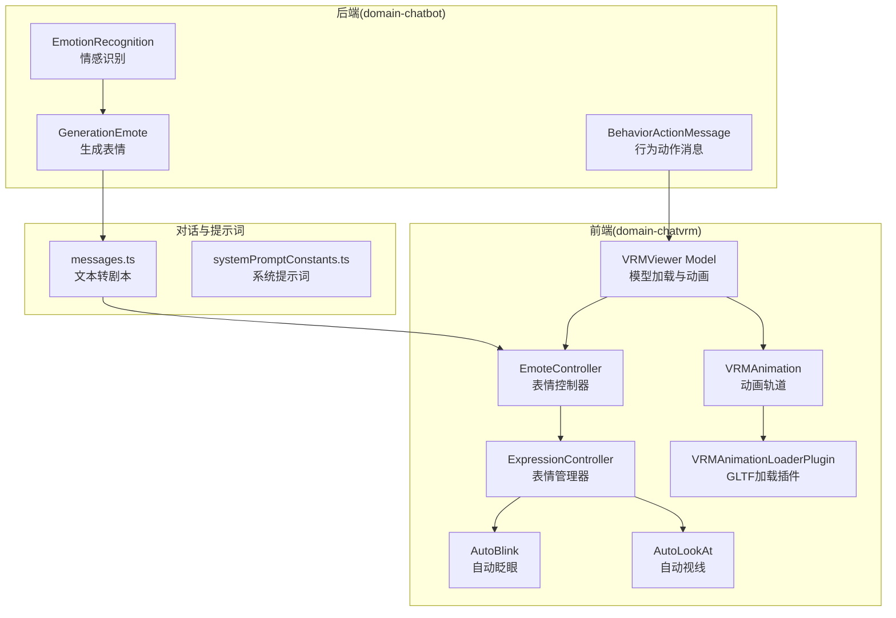
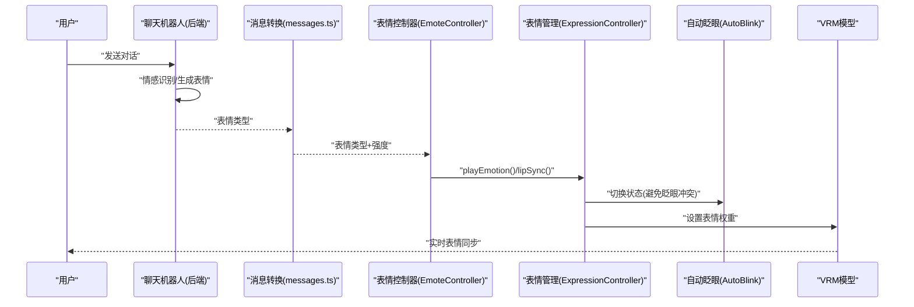
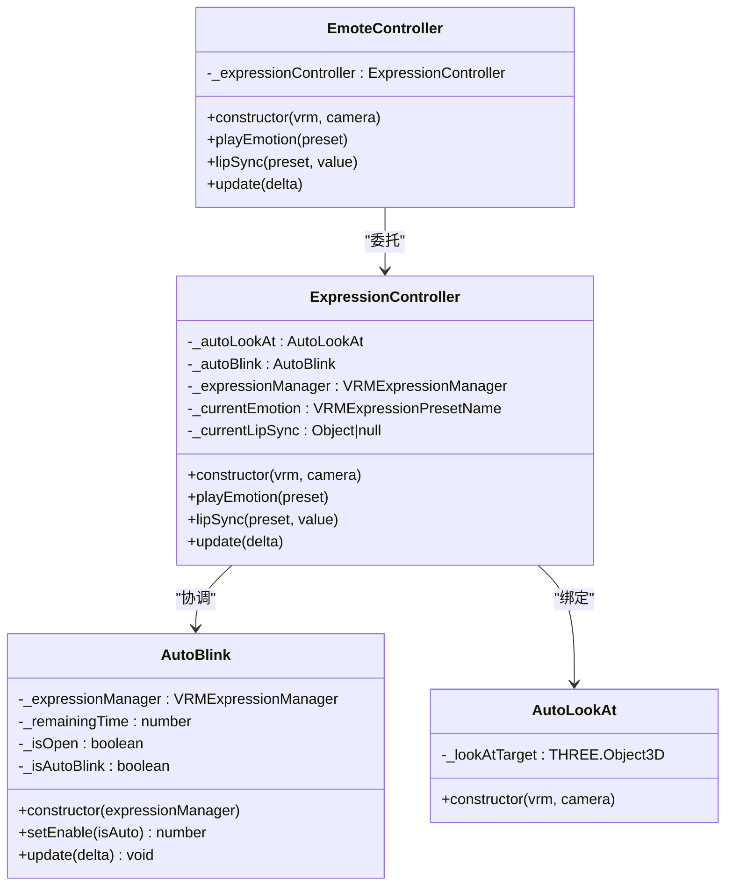
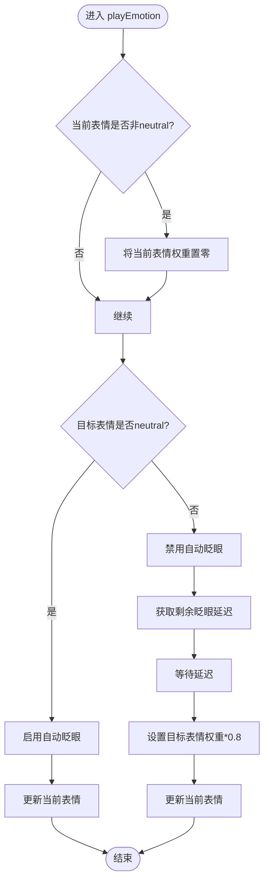
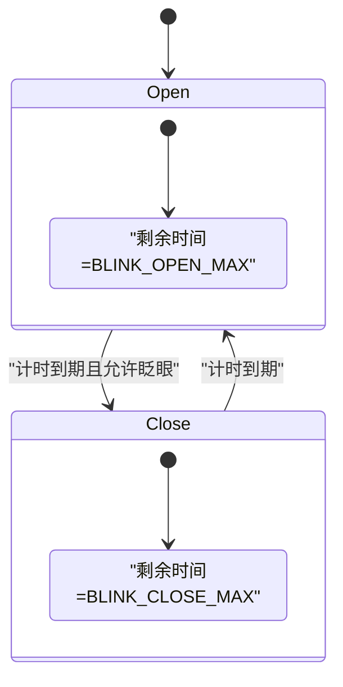
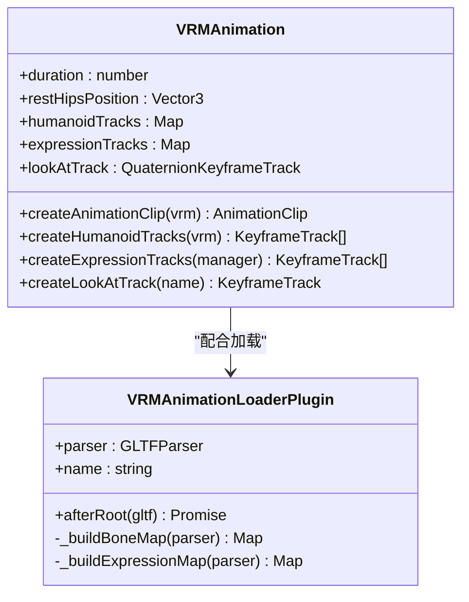
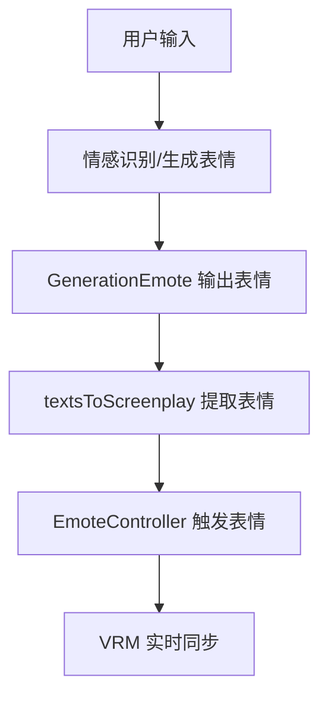
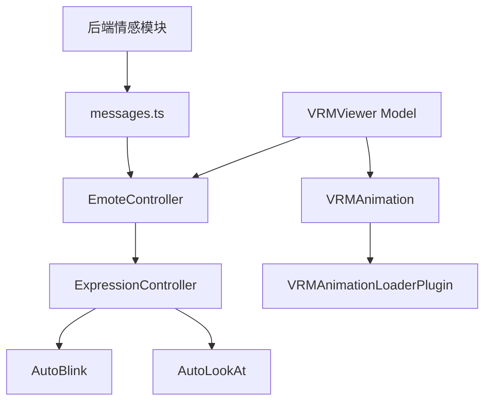

# VRM表情同步系统

<cite>
**本文档引用的文件**
- [emoteController.ts](file://domain-chatvrm/src/features/emoteController/emoteController.ts)
- [expressionController.ts](file://domain-chatvrm/src/features/emoteController/expressionController.ts)
- [autoBlink.ts](file://domain-chatvrm/src/features/emoteController/autoBlink.ts)
- [autoLookAt.ts](file://domain-chatvrm/src/features/emoteController/autoLookAt.ts)
- [emoteConstants.ts](file://domain-chatvrm/src/features/emoteController/emoteConstants.ts)
- [model.ts](file://domain-chatvrm/src/features/vrmViewer/model.ts)
- [VRMAnimation.ts](file://domain-chatvrm/src/lib/VRMAnimation/VRMAnimation.ts)
- [VRMAnimationLoaderPlugin.ts](file://domain-chatvrm/src/lib/VRMAnimation/VRMAnimationLoaderPlugin.ts)
- [mixamoVRMRigMap.ts](file://domain-chatvrm/src/features/mixamo/mixamoVRMRigMap.ts)
- [emotion_manage.py](file://domain-chatbot/apps/chatbot/emotion/emotion_manage.py)
- [behavior_action_management.py](file://domain-chatbot/apps/chatbot/emotion/behavior_action_management.py)
- [messages.ts](file://domain-chatvrm/src/features/messages/messages.ts)
- [systemPromptConstants.ts](file://domain-chatvrm/src/features/constants/systemPromptConstants.ts)
</cite>

## 目录
1. [简介](#简介)
2. [项目结构](#项目结构)
3. [核心组件](#核心组件)
4. [架构总览](#架构总览)
5. [详细组件分析](#详细组件分析)
6. [依赖关系分析](#依赖关系分析)
7. [性能考虑](#性能考虑)
8. [故障排查指南](#故障排查指南)
9. [结论](#结论)
10. [附录](#附录)

## 简介
本技术文档面向VRM表情同步系统，聚焦于表情控制器的设计架构、表情状态管理、动画混合与实时同步机制。文档还涵盖表情常量定义（表情类型、强度参数、持续时间）、表情与对话内容的关联逻辑（情感分析、表情触发条件、自然度控制）、表情动画的平滑过渡算法（插值计算、缓动函数、避免闪烁），以及系统的扩展方法（自定义表情添加、第三方表情包集成）。最后提供表情调试工具、性能监控与用户体验优化建议。

## 项目结构
该系统由前端VRM Viewer与后端聊天机器人两部分协作构成：
- 前端 domain-chatvrm：负责VRM模型加载、表情控制器、自动眨眼与视线控制、VRM动画加载与播放。
- 后端 domain-chatbot：负责情感识别与生成表情，提供表情与对话的语义关联。

图表来源
- [emoteController.ts](file://domain-chatvrm/src/features/emoteController/emoteController.ts#L1-L28)
- [expressionController.ts](file://domain-chatvrm/src/features/emoteController/expressionController.ts#L1-L77)
- [autoBlink.ts](file://domain-chatvrm/src/features/emoteController/autoBlink.ts#L1-L65)
- [autoLookAt.ts](file://domain-chatvrm/src/features/emoteController/autoLookAt.ts#L1-L18)
- [model.ts](file://domain-chatvrm/src/features/vrmViewer/model.ts#L34-L80)
- [VRMAnimation.ts](file://domain-chatvrm/src/lib/VRMAnimation/VRMAnimation.ts#L1-L116)
- [VRMAnimationLoaderPlugin.ts](file://domain-chatvrm/src/lib/VRMAnimation/VRMAnimationLoaderPlugin.ts#L1-L149)
- [emotion_manage.py](file://domain-chatbot/apps/chatbot/emotion/emotion_manage.py#L138-L182)
- [behavior_action_management.py](file://domain-chatbot/apps/chatbot/emotion/behavior_action_management.py#L10-L44)
- [messages.ts](file://domain-chatvrm/src/features/messages/messages.ts#L44-L79)
- [systemPromptConstants.ts](file://domain-chatvrm/src/features/constants/systemPromptConstants.ts#L1-L18)

章节来源
- [emoteController.ts](file://domain-chatvrm/src/features/emoteController/emoteController.ts#L1-L28)
- [model.ts](file://domain-chatvrm/src/features/vrmViewer/model.ts#L34-L80)

## 核心组件
- 表情控制器 EmoteController：对外暴露表情播放与唇同步接口，并统一调度内部表达控制器。
- 表情管理器 ExpressionController：维护当前表情状态、处理表情切换与权重更新、协调自动眨眼与视线。
- 自动眨眼 AutoBlink：基于状态机的时间计数实现自然眨眼，避免与表情切换冲突。
- 自动视线 AutoLookAt：将VRM的LookAt目标绑定到相机坐标系，支持较大范围的视线运动。
- VRM模型加载与动画：通过GLTF加载器与VRM动画插件，构建动画剪辑并驱动表情轨道。
- 后端情感模块：识别与生成表情，结合系统提示词与消息转换逻辑，形成表情触发条件。

章节来源
- [emoteController.ts](file://domain-chatvrm/src/features/emoteController/emoteController.ts#L9-L27)
- [expressionController.ts](file://domain-chatvrm/src/features/emoteController/expressionController.ts#L16-L76)
- [autoBlink.ts](file://domain-chatvrm/src/features/emoteController/autoBlink.ts#L7-L64)
- [autoLookAt.ts](file://domain-chatvrm/src/features/emoteController/autoLookAt.ts#L9-L17)
- [model.ts](file://domain-chatvrm/src/features/vrmViewer/model.ts#L34-L80)
- [emotion_manage.py](file://domain-chatbot/apps/chatbot/emotion/emotion_manage.py#L138-L182)

## 架构总览
系统采用前后端分离的表情触发链路：
- 后端根据用户输入进行情感分析与表情生成，输出表情类型。
- 前端接收表情类型与语音强度，通过表情管理器进行权重过渡与同步。
- VRM动画轨道与表情轨道并行驱动，确保自然度与流畅性。

图表来源
- [emotion_manage.py](file://domain-chatbot/apps/chatbot/emotion/emotion_manage.py#L138-L182)
- [messages.ts](file://domain-chatvrm/src/features/messages/messages.ts#L44-L79)
- [emoteController.ts](file://domain-chatvrm/src/features/emoteController/emoteController.ts#L16-L22)
- [expressionController.ts](file://domain-chatvrm/src/features/emoteController/expressionController.ts#L35-L51)
- [autoBlink.ts](file://domain-chatvrm/src/features/emoteController/autoBlink.ts#L28-L37)
- [model.ts](file://domain-chatvrm/src/features/vrmViewer/model.ts#L34-L53)

## 详细组件分析

### 表情控制器 EmoteController
- 职责：封装表情播放与唇同步调用，统一入口，便于扩展其他动作同步。
- 接口：playEmotion、lipSync、update。
- 协调：委托给 ExpressionController 执行具体的状态切换与权重更新。

图表来源
- [emoteController.ts](file://domain-chatvrm/src/features/emoteController/emoteController.ts#L9-L27)
- [expressionController.ts](file://domain-chatvrm/src/features/emoteController/expressionController.ts#L16-L33)
- [autoBlink.ts](file://domain-chatvrm/src/features/emoteController/autoBlink.ts#L7-L18)
- [autoLookAt.ts](file://domain-chatvrm/src/features/emoteController/autoLookAt.ts#L9-L16)

章节来源
- [emoteController.ts](file://domain-chatvrm/src/features/emoteController/emoteController.ts#L9-L27)

### 表情管理器 ExpressionController
- 表情状态管理：记录当前表情，切换时先将上一表情权重置零，避免残留。
- 切换策略：当目标为 neutral 时启用自动眨眼；非 neutral 时禁用眨眼并延时后设置目标表情权重。
- 唇同步：根据当前表情是否为 neutral 动态调整权重比例，保证自然度。

图表来源
- [expressionController.ts](file://domain-chatvrm/src/features/emoteController/expressionController.ts#L35-L51)

章节来源
- [expressionController.ts](file://domain-chatvrm/src/features/emoteController/expressionController.ts#L16-L76)

### 自动眨眼 AutoBlink
- 状态机：open/close 两个状态，分别对应开眼与闭眼的剩余时间。
- 时间常量：BLINK_CLOSE_MAX（闭眼最长时间）、BLINK_OPEN_MAX（开眼最长时间）。
- 同步策略：在表情切换前若正在闭眼，返回剩余时间，等待开眼后再执行表情切换，避免不自然。

图表来源
- [autoBlink.ts](file://domain-chatvrm/src/features/emoteController/autoBlink.ts#L39-L63)
- [emoteConstants.ts](file://domain-chatvrm/src/features/emoteController/emoteConstants.ts#L1-L5)

章节来源
- [autoBlink.ts](file://domain-chatvrm/src/features/emoteController/autoBlink.ts#L7-L64)
- [emoteConstants.ts](file://domain-chatvrm/src/features/emoteController/emoteConstants.ts#L1-L5)

### 自动视线 AutoLookAt
- 将 LookAt 目标绑定到相机坐标系，便于在需要时扩大视线范围。
- 与眨眼/表情切换解耦，仅负责方向控制。

章节来源
- [autoLookAt.ts](file://domain-chatvrm/src/features/emoteController/autoLookAt.ts#L9-L17)

### VRM动画与表情轨道
- VRMAnimation：封装人类骨骼轨道、表情轨道与视线轨道，生成 AnimationClip 并驱动 VRM。
- VRMAnimationLoaderPlugin：解析GLTF扩展，建立骨骼与表情索引映射，支持自定义表情与预设表情。
- Mixamo Rig 映射：将 Mixamo 骨骼名映射到 VRM Humanoid 名称，便于第三方动画集成。

图表来源
- [VRMAnimation.ts](file://domain-chatvrm/src/lib/VRMAnimation/VRMAnimation.ts#L4-L46)
- [VRMAnimationLoaderPlugin.ts](file://domain-chatvrm/src/lib/VRMAnimation/VRMAnimationLoaderPlugin.ts#L32-L149)
- [mixamoVRMRigMap.ts](file://domain-chatvrm/src/features/mixamo/mixamoVRMRigMap.ts#L4-L57)

章节来源
- [VRMAnimation.ts](file://domain-chatvrm/src/lib/VRMAnimation/VRMAnimation.ts#L1-L116)
- [VRMAnimationLoaderPlugin.ts](file://domain-chatvrm/src/lib/VRMAnimation/VRMAnimationLoaderPlugin.ts#L1-L149)
- [mixamoVRMRigMap.ts](file://domain-chatvrm/src/features/mixamo/mixamoVRMRigMap.ts#L1-L58)

### 表情与对话内容的关联逻辑
- 后端情感模块：通过 GenerationEmote 生成表情类型，结合系统提示词约束表情集合。
- 剧本转换：messages.ts 将带表情标记的文本转换为剧本对象，提取表情字段并映射到说话风格。
- 表情触发条件：当前实现以“中性/高兴/愤怒/悲伤/放松”五类表情为主，后续可扩展更多类型。

图表来源
- [emotion_manage.py](file://domain-chatbot/apps/chatbot/emotion/emotion_manage.py#L138-L182)
- [messages.ts](file://domain-chatvrm/src/features/messages/messages.ts#L44-L79)
- [systemPromptConstants.ts](file://domain-chatvrm/src/features/constants/systemPromptConstants.ts#L1-L18)

章节来源
- [emotion_manage.py](file://domain-chatbot/apps/chatbot/emotion/emotion_manage.py#L138-L182)
- [messages.ts](file://domain-chatvrm/src/features/messages/messages.ts#L44-L79)
- [systemPromptConstants.ts](file://domain-chatvrm/src/features/constants/systemPromptConstants.ts#L1-L18)

## 依赖关系分析
- 组件耦合：EmoteController 依赖 ExpressionController；ExpressionController 依赖 AutoBlink/AutoLookAt；VRMViewer Model 依赖 EmoteController 与 VRMAnimation。
- 外部依赖：@pixiv/three-vrm 提供 VRM 表情管理与动画混音器；GLTFLoader 插件负责扩展解析。
- 数据流：后端情感模块 → 剧本转换 → 前端表情控制器 → VRM 表情轨道。

图表来源
- [emoteController.ts](file://domain-chatvrm/src/features/emoteController/emoteController.ts#L9-L27)
- [expressionController.ts](file://domain-chatvrm/src/features/emoteController/expressionController.ts#L16-L33)
- [model.ts](file://domain-chatvrm/src/features/vrmViewer/model.ts#L34-L53)
- [VRMAnimation.ts](file://domain-chatvrm/src/lib/VRMAnimation/VRMAnimation.ts#L28-L46)
- [VRMAnimationLoaderPlugin.ts](file://domain-chatvrm/src/lib/VRMAnimation/VRMAnimationLoaderPlugin.ts#L32-L149)
- [emotion_manage.py](file://domain-chatbot/apps/chatbot/emotion/emotion_manage.py#L138-L182)
- [messages.ts](file://domain-chatvrm/src/features/messages/messages.ts#L44-L79)

章节来源
- [model.ts](file://domain-chatvrm/src/features/vrmViewer/model.ts#L34-L80)

## 性能考虑
- 表情切换去抖：通过自动眨眼的剩余时间返回值，避免在闭眼瞬间切换表情，减少视觉闪烁。
- 权重衰减：表情切换时使用 0.8 的权重系数，配合 LipSync 的比例衰减，降低突变带来的不自然感。
- 动画混音器：使用 AnimationMixer 驱动 VRM，避免频繁重建动画剪辑，提升渲染效率。
- 第三方动画集成：通过 VRMAnimationLoaderPlugin 与 Mixamo 映射，降低资源适配成本。

章节来源
- [expressionController.ts](file://domain-chatvrm/src/features/emoteController/expressionController.ts#L48-L50)
- [expressionController.ts](file://domain-chatvrm/src/features/emoteController/expressionController.ts#L68-L73)
- [model.ts](file://domain-chatvrm/src/features/vrmViewer/model.ts#L49-L76)
- [VRMAnimationLoaderPlugin.ts](file://domain-chatvrm/src/lib/VRMAnimation/VRMAnimationLoaderPlugin.ts#L103-L149)
- [mixamoVRMRigMap.ts](file://domain-chatvrm/src/features/mixamo/mixamoVRMRigMap.ts#L4-L57)

## 故障排查指南
- 表情不生效
  - 检查 VRM 是否正确加载并存在 expressionManager。
  - 确认表情名称与 VRM 预设一致，必要时使用自定义表情映射。
- 眨眼与表情冲突
  - 若出现闭眼时切换表情，检查 AutoBlink 的 setEnable 返回值是否被正确等待。
- 唇同步异常
  - 检查 LipSync 权重比例与当前表情状态，确保在非 neutral 时权重更低。
- 动画播放问题
  - 确认 AnimationMixer 已正确创建并播放，GLTF 扩展解析无误。

章节来源
- [expressionController.ts](file://domain-chatvrm/src/features/emoteController/expressionController.ts#L35-L51)
- [expressionController.ts](file://domain-chatvrm/src/features/emoteController/expressionController.ts#L68-L74)
- [autoBlink.ts](file://domain-chatvrm/src/features/emoteController/autoBlink.ts#L28-L37)
- [model.ts](file://domain-chatvrm/src/features/vrmViewer/model.ts#L49-L76)
- [VRMAnimationLoaderPlugin.ts](file://domain-chatvrm/src/lib/VRMAnimation/VRMAnimationLoaderPlugin.ts#L103-L149)

## 结论
本系统通过前后端协同实现了从情感到表情的完整链路：后端负责语义理解与表情生成，前端负责状态管理与自然过渡。表情控制器以状态机与权重控制为核心，结合自动眨眼与视线控制，确保同步过程的自然与稳定。通过 VRM 动画轨道与第三方资源映射，系统具备良好的扩展性与集成能力。

## 附录

### 表情常量定义
- 瞬间闭眼时间：BLINK_CLOSE_MAX（秒）
- 连续开眼时间：BLINK_OPEN_MAX（秒）

章节来源
- [emoteConstants.ts](file://domain-chatvrm/src/features/emoteController/emoteConstants.ts#L1-L5)

### 表情类型与强度参数
- 表情类型：neutral、happy、angry、sad、relaxed（由系统提示词约束）
- 强度参数：LipSync 的 value 作为权重输入，表情切换时乘以固定系数
- 持续时间：由自动眨眼与表情切换流程决定，避免冲突

章节来源
- [systemPromptConstants.ts](file://domain-chatvrm/src/features/constants/systemPromptConstants.ts#L1-L18)
- [expressionController.ts](file://domain-chatvrm/src/features/emoteController/expressionController.ts#L68-L73)

### 平滑过渡算法与自然度控制
- 插值与权重：表情切换使用 0.8 权重，LipSync 在 neutral 时权重更高，非 neutral 时更低
- 缓动函数：通过时间计数与状态机实现平滑过渡，避免突变
- 避免闪烁：闭眼期间延迟表情切换，减少视觉闪烁

章节来源
- [expressionController.ts](file://domain-chatvrm/src/features/emoteController/expressionController.ts#L48-L50)
- [expressionController.ts](file://domain-chatvrm/src/features/emoteController/expressionController.ts#L68-L73)
- [autoBlink.ts](file://domain-chatvrm/src/features/emoteController/autoBlink.ts#L39-L63)

### 扩展方法
- 自定义表情添加：通过 VRMAnimationLoaderPlugin 的表情索引映射，将自定义表情加入 VRM 表情管理器
- 第三方表情包集成：使用 Mixamo 动画与骨骼映射，快速适配第三方资源
- 新表情类型：在系统提示词与前端表情管理器中增加新类型，并确保权重与自然度策略一致

章节来源
- [VRMAnimationLoaderPlugin.ts](file://domain-chatvrm/src/lib/VRMAnimation/VRMAnimationLoaderPlugin.ts#L113-L135)
- [mixamoVRMRigMap.ts](file://domain-chatvrm/src/features/mixamo/mixamoVRMRigMap.ts#L4-L57)
- [systemPromptConstants.ts](file://domain-chatvrm/src/features/constants/systemPromptConstants.ts#L1-L18)

### 调试工具与性能监控建议
- 调试工具：在 ExpressionController 中打印当前表情与权重变化，观察 LipSync 与眨眼的交互
- 性能监控：关注 AnimationMixer 的帧率与剪辑数量，避免过多并行动画导致掉帧
- 用户体验优化：根据场景动态调整表情强度与切换频率，避免过度刺激；在关键对话时增强自然度策略

章节来源
- [expressionController.ts](file://domain-chatvrm/src/features/emoteController/expressionController.ts#L63-L75)
- [model.ts](file://domain-chatvrm/src/features/vrmViewer/model.ts#L49-L76)