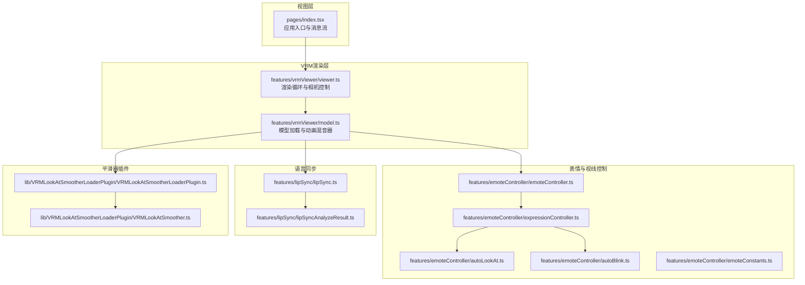
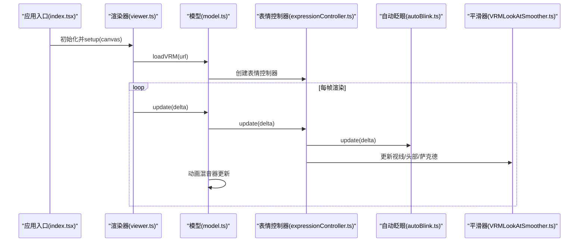
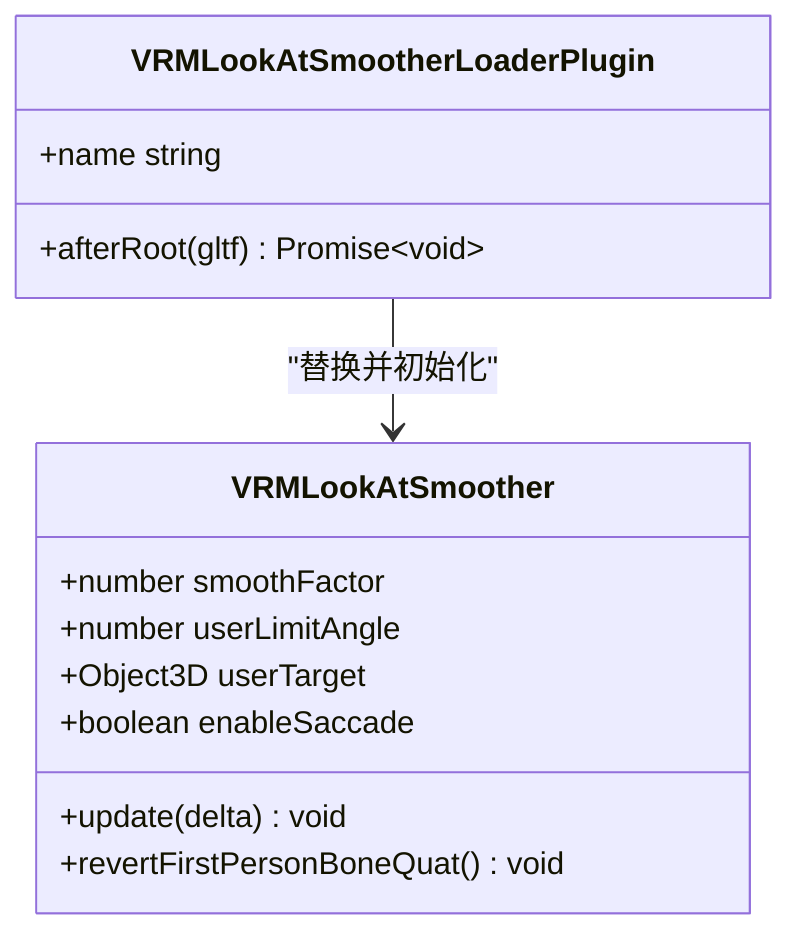
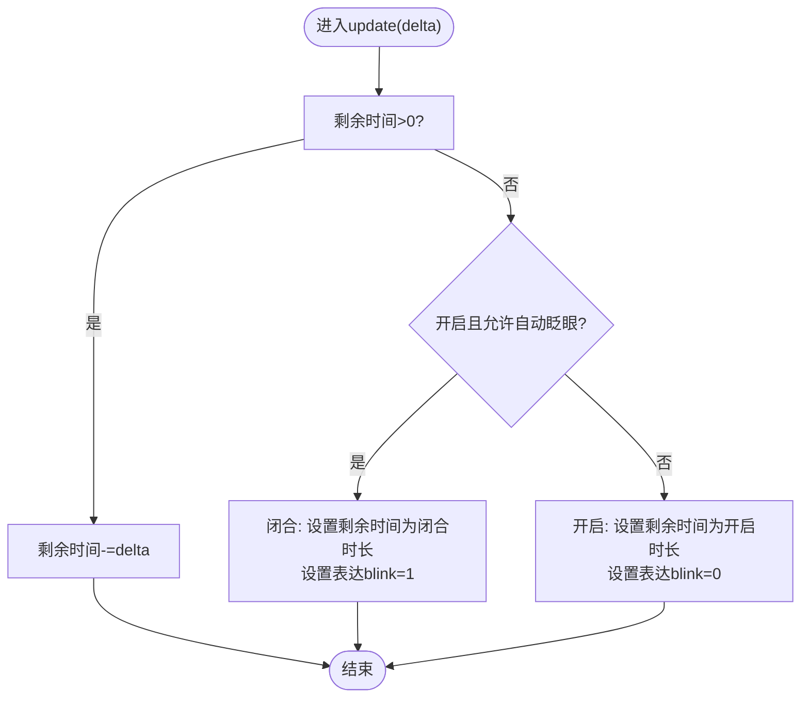
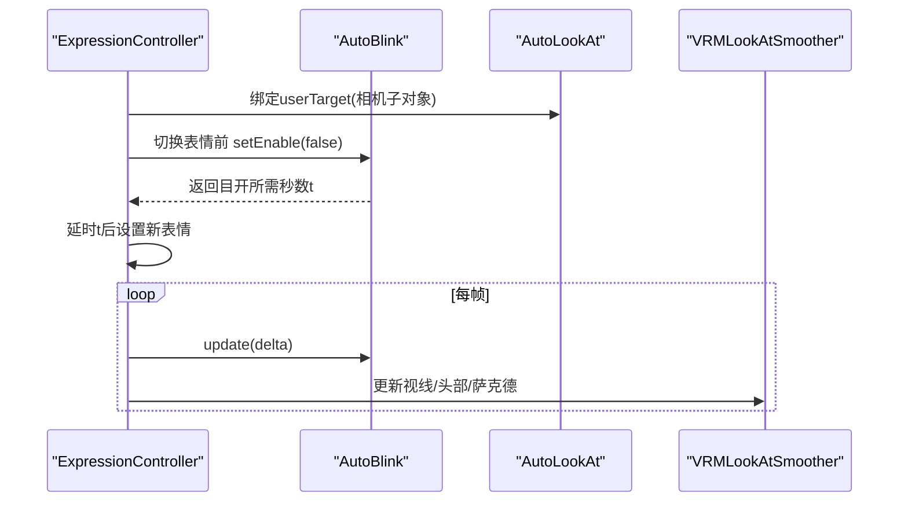
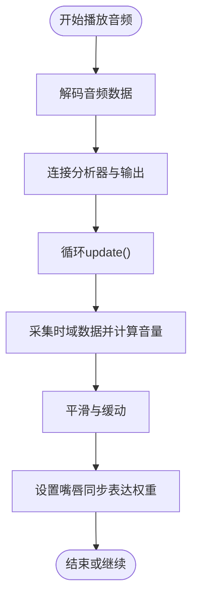
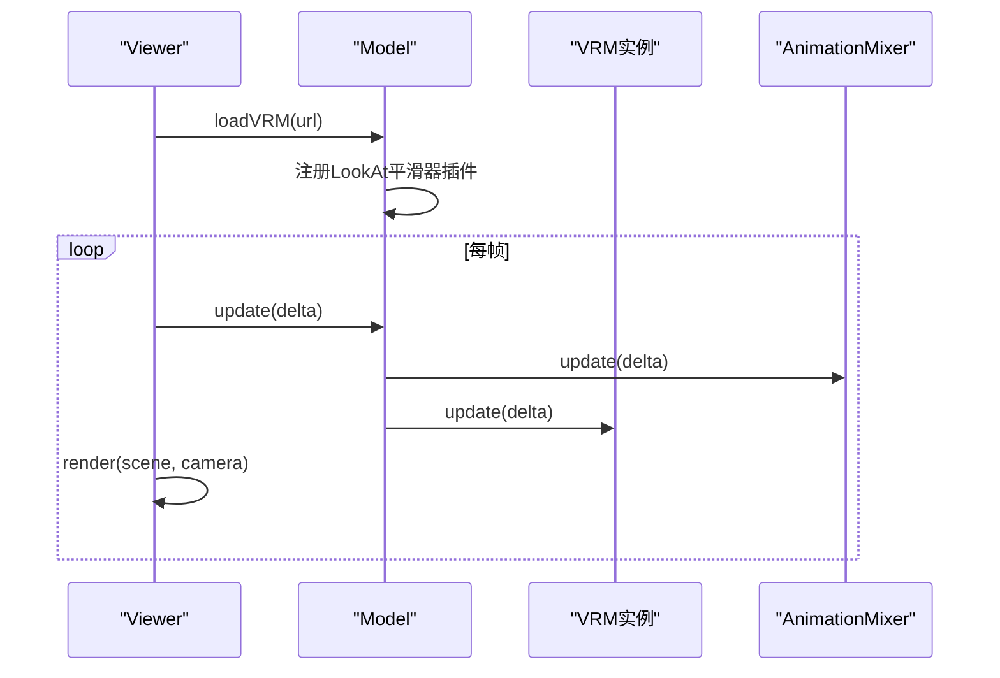
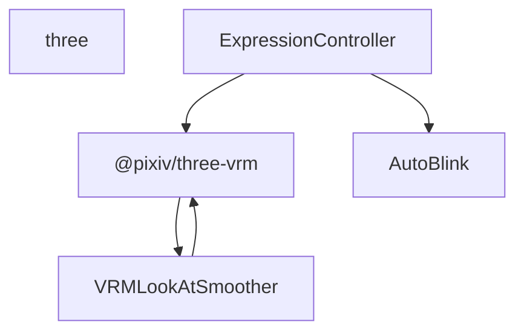

# VRM视线控制系统

<cite>
**本文档引用的文件**
- [autoLookAt.ts](file://domain-chatvrm/src/features/emoteController/autoLookAt.ts)
- [autoBlink.ts](file://domain-chatvrm/src/features/emoteController/autoBlink.ts)
- [emoteController.ts](file://domain-chatvrm/src/features/emoteController/emoteController.ts)
- [expressionController.ts](file://domain-chatvrm/src/features/emoteController/expressionController.ts)
- [emoteConstants.ts](file://domain-chatvrm/src/features/emoteController/emoteConstants.ts)
- [VRMLookAtSmoother.ts](file://domain-chatvrm/src/lib/VRMLookAtSmootherLoaderPlugin/VRMLookAtSmoother.ts)
- [VRMLookAtSmootherLoaderPlugin.ts](file://domain-chatvrm/src/lib/VRMLookAtSmootherLoaderPlugin/VRMLookAtSmootherLoaderPlugin.ts)
- [model.ts](file://domain-chatvrm/src/features/vrmViewer/model.ts)
- [viewer.ts](file://domain-chatvrm/src/features/vrmViewer/viewer.ts)
- [index.tsx](file://domain-chatvrm/src/pages/index.tsx)
- [lipSync.ts](file://domain-chatvrm/src/features/lipSync/lipSync.ts)
- [lipSyncAnalyzeResult.ts](file://domain-chatvrm/src/features/lipSync/lipSyncAnalyzeResult.ts)
- [configApi.ts](file://domain-chatvrm/src/features/config/configApi.ts)
- [package.json](file://domain-chatvrm/package.json)
</cite>

## 目录
1. [简介](#简介)
2. [项目结构](#项目结构)
3. [核心组件](#核心组件)
4. [架构总览](#架构总览)
5. [详细组件分析](#详细组件分析)
6. [依赖关系分析](#依赖关系分析)
7. [性能考虑](#性能考虑)
8. [故障排查指南](#故障排查指南)
9. [结论](#结论)
10. [附录](#附录)

## 简介
本技术文档围绕VRM视线控制系统展开，重点阐述自动视线跟随与自动眨眼两大模块的设计与实现。系统基于Three.js与@pixiv/three-vrm构建，通过自定义的VRMLookAt平滑器实现自然的视线跟随与眼球微运动（萨克德），并通过表达控制器与眨眼控制器协同工作，确保在语音合成与情感表达场景下维持自然的人机交互体验。文档同时覆盖参数调节、性能优化、调试方法与用户体验改进建议。

## 项目结构
本项目采用前端Next.js应用结构，视线控制相关代码主要位于domain-chatvrm/src/features目录中，配合lib中的VRMLookAt平滑器插件与vrmViewer渲染层共同完成。

图表来源
- [index.tsx](file://domain-chatvrm/src/pages/index.tsx#L1-L390)
- [viewer.ts](file://domain-chatvrm/src/features/vrmViewer/viewer.ts#L1-L205)
- [model.ts](file://domain-chatvrm/src/features/vrmViewer/model.ts#L1-L136)
- [emoteController.ts](file://domain-chatvrm/src/features/emoteController/emoteController.ts#L1-L28)
- [expressionController.ts](file://domain-chatvrm/src/features/emoteController/expressionController.ts#L1-L77)
- [autoLookAt.ts](file://domain-chatvrm/src/features/emoteController/autoLookAt.ts#L1-L18)
- [autoBlink.ts](file://domain-chatvrm/src/features/emoteController/autoBlink.ts#L1-L65)
- [emoteConstants.ts](file://domain-chatvrm/src/features/emoteController/emoteConstants.ts#L1-L5)
- [VRMLookAtSmoother.ts](file://domain-chatvrm/src/lib/VRMLookAtSmootherLoaderPlugin/VRMLookAtSmoother.ts#L1-L175)
- [VRMLookAtSmootherLoaderPlugin.ts](file://domain-chatvrm/src/lib/VRMLookAtSmootherLoaderPlugin/VRMLookAtSmootherLoaderPlugin.ts#L1-L27)
- [lipSync.ts](file://domain-chatvrm/src/features/lipSync/lipSync.ts#L1-L80)
- [lipSyncAnalyzeResult.ts](file://domain-chatvrm/src/features/lipSync/lipSyncAnalyzeResult.ts#L1-L4)

章节来源
- [index.tsx](file://domain-chatvrm/src/pages/index.tsx#L1-L390)
- [viewer.ts](file://domain-chatvrm/src/features/vrmViewer/viewer.ts#L1-L205)
- [model.ts](file://domain-chatvrm/src/features/vrmViewer/model.ts#L1-L136)

## 核心组件
- 表情控制器：统一调度表情与嘴唇同步，协调眨眼禁用/启用时机，保证自然度。
- 眼球追踪与平滑：通过VRMLookAt平滑器实现视线跟随、头部转动与萨克德运动。
- 自动眨眼：独立的状态机，按预设闭合/开启时长周期性触发，避免与情感表达冲突。
- 渲染与更新：渲染循环驱动模型、动画与表情更新，确保每帧一致的视觉反馈。

章节来源
- [emoteController.ts](file://domain-chatvrm/src/features/emoteController/emoteController.ts#L1-L28)
- [expressionController.ts](file://domain-chatvrm/src/features/emoteController/expressionController.ts#L1-L77)
- [autoLookAt.ts](file://domain-chatvrm/src/features/emoteController/autoLookAt.ts#L1-L18)
- [autoBlink.ts](file://domain-chatvrm/src/features/emoteController/autoBlink.ts#L1-L65)
- [emoteConstants.ts](file://domain-chatvrm/src/features/emoteController/emoteConstants.ts#L1-L5)
- [VRMLookAtSmoother.ts](file://domain-chatvrm/src/lib/VRMLookAtSmootherLoaderPlugin/VRMLookAtSmoother.ts#L1-L175)
- [viewer.ts](file://domain-chatvrm/src/features/vrmViewer/viewer.ts#L177-L203)

## 架构总览
系统采用“渲染循环驱动+插件化平滑器”的架构。渲染循环在每帧获取delta时间，依次更新模型动画、表情与嘴唇同步；表情控制器根据当前状态决定是否启用眨眼；平滑器在目标存在且自动更新时，计算视线方向、头部旋转与萨克德运动，并将结果应用到VRM骨架。

图表来源
- [index.tsx](file://domain-chatvrm/src/pages/index.tsx#L1-L390)
- [viewer.ts](file://domain-chatvrm/src/features/vrmViewer/viewer.ts#L177-L203)
- [model.ts](file://domain-chatvrm/src/features/vrmViewer/model.ts#L125-L134)
- [expressionController.ts](file://domain-chatvrm/src/features/emoteController/expressionController.ts#L63-L75)
- [autoBlink.ts](file://domain-chatvrm/src/features/emoteController/autoBlink.ts#L39-L51)
- [VRMLookAtSmoother.ts](file://domain-chatvrm/src/lib/VRMLookAtSmootherLoaderPlugin/VRMLookAtSmoother.ts#L63-L165)

## 详细组件分析

### 眼球追踪与视线平滑（VRMLookAtSmoother）
- 平滑系数与限制：通过平滑系数控制视线过渡的柔和程度，通过用户视角限制角度避免过度转向。
- 视线融合：在存在用户目标时，将动画指定的视线与用户方向进行加权融合，优先尊重动画的大方向。
- 头部联动：根据平滑后的姿态对头部骨骼进行四元数插值，提升自然度。
- 萨克德运动：周期性概率触发小幅度随机偏移，模拟真实眼球微运动，增强真实感。

图表来源
- [VRMLookAtSmoother.ts](file://domain-chatvrm/src/lib/VRMLookAtSmootherLoaderPlugin/VRMLookAtSmoother.ts#L26-L175)
- [VRMLookAtSmootherLoaderPlugin.ts](file://domain-chatvrm/src/lib/VRMLookAtSmootherLoaderPlugin/VRMLookAtSmootherLoaderPlugin.ts#L9-L26)

章节来源
- [VRMLookAtSmoother.ts](file://domain-chatvrm/src/lib/VRMLookAtSmootherLoaderPlugin/VRMLookAtSmoother.ts#L26-L175)
- [VRMLookAtSmootherLoaderPlugin.ts](file://domain-chatvrm/src/lib/VRMLookAtSmootherLoaderPlugin/VRMLookAtSmootherLoaderPlugin.ts#L9-L26)

### 自动眨眼控制（AutoBlink）
- 状态机：维护“开启/闭合”状态与剩余时间，按预设时长周期性切换。
- 与表情协作：在非中性表情期间禁用自动眨眼，等待目开后再恢复；返回目开所需的时间以供外部协调。
- 参数：闭合时长与开启时长由常量定义，确保自然眨眼节奏。

图表来源
- [autoBlink.ts](file://domain-chatvrm/src/features/emoteController/autoBlink.ts#L39-L63)
- [emoteConstants.ts](file://domain-chatvrm/src/features/emoteController/emoteConstants.ts#L1-L5)

章节来源
- [autoBlink.ts](file://domain-chatvrm/src/features/emoteController/autoBlink.ts#L1-L65)
- [emoteConstants.ts](file://domain-chatvrm/src/features/emoteController/emoteConstants.ts#L1-L5)

### 表情与视线协调（ExpressionController）
- 目标绑定：将相机子对象作为lookAt目标，交由平滑器处理。
- 表情切换：在非中性表情期间临时禁用自动眨眼，等待目开后再恢复，避免不自然。
- 唇语同步：根据当前表情权重动态设置嘴唇同步强度，保证语音与口型匹配。

图表来源
- [expressionController.ts](file://domain-chatvrm/src/features/emoteController/expressionController.ts#L25-L75)
- [autoLookAt.ts](file://domain-chatvrm/src/features/emoteController/autoLookAt.ts#L9-L16)
- [autoBlink.ts](file://domain-chatvrm/src/features/emoteController/autoBlink.ts#L28-L37)
- [VRMLookAtSmoother.ts](file://domain-chatvrm/src/lib/VRMLookAtSmootherLoaderPlugin/VRMLookAtSmoother.ts#L63-L165)

章节来源
- [expressionController.ts](file://domain-chatvrm/src/features/emoteController/expressionController.ts#L1-L77)
- [autoLookAt.ts](file://domain-chatvrm/src/features/emoteController/autoLookAt.ts#L1-L18)
- [autoBlink.ts](file://domain-chatvrm/src/features/emoteController/autoBlink.ts#L1-L65)

### 唇语同步（LipSync）
- 实时分析：使用音频分析节点提取时域能量，计算音量并进行平滑与缓动处理。
- 与表情联动：根据当前表情权重调整嘴唇同步强度，避免在非中性表情时过度夸张。

图表来源
- [lipSync.ts](file://domain-chatvrm/src/features/lipSync/lipSync.ts#L18-L49)
- [expressionController.ts](file://domain-chatvrm/src/features/emoteController/expressionController.ts#L68-L75)

章节来源
- [lipSync.ts](file://domain-chatvrm/src/features/lipSync/lipSync.ts#L1-L80)
- [lipSyncAnalyzeResult.ts](file://domain-chatvrm/src/features/lipSync/lipSyncAnalyzeResult.ts#L1-L4)
- [expressionController.ts](file://domain-chatvrm/src/features/emoteController/expressionController.ts#L63-L75)

### 渲染与更新循环（Viewer/Model）
- 渲染循环：使用时钟获取delta，依次更新模型、动画与渲染。
- 模型加载：注册VRMLookAt平滑器插件，确保加载后的VRM实例使用自定义lookAt。
- 相机重置：根据头骨节点位置调整相机目标，提升观看体验。

图表来源
- [viewer.ts](file://domain-chatvrm/src/features/vrmViewer/viewer.ts#L177-L203)
- [model.ts](file://domain-chatvrm/src/features/vrmViewer/model.ts#L34-L53)
- [model.ts](file://domain-chatvrm/src/features/vrmViewer/model.ts#L125-L134)

章节来源
- [viewer.ts](file://domain-chatvrm/src/features/vrmViewer/viewer.ts#L1-L205)
- [model.ts](file://domain-chatvrm/src/features/vrmViewer/model.ts#L1-L136)

## 依赖关系分析
- 核心依赖：Three.js用于3D渲染与数学运算；@pixiv/three-vrm提供VRM骨架、表情与LookAt能力。
- 插件化扩展：通过VRMLookAt平滑器插件替换默认LookAt，实现自定义平滑与萨克德。
- 模块耦合：表情控制器与平滑器松耦合，仅通过目标对象与表达管理器交互；眨眼控制器独立于视线逻辑，通过状态协调避免冲突。

图表来源
- [package.json](file://domain-chatvrm/package.json#L31-L37)
- [VRMLookAtSmoother.ts](file://domain-chatvrm/src/lib/VRMLookAtSmootherLoaderPlugin/VRMLookAtSmoother.ts#L1-L2)
- [expressionController.ts](file://domain-chatvrm/src/features/emoteController/expressionController.ts#L1-L6)
- [autoBlink.ts](file://domain-chatvrm/src/features/emoteController/autoBlink.ts#L1-L2)

章节来源
- [package.json](file://domain-chatvrm/package.json#L1-L51)

## 性能考虑
- 计算复杂度降低
  - 平滑器内部使用指数阻尼与线性插值，复杂度低且可调；建议仅在需要时启用萨克德，避免额外随机计算。
  - 表情控制器每帧仅做条件判断与表达赋值，成本极低。
- 帧率稳定
  - 使用requestAnimationFrame与Three.Clock获取delta，确保与渲染节拍一致；避免在主线程执行耗时任务。
  - 动画混音器与VRM更新在模型层统一调度，减少重复更新。
- 电池消耗控制
  - 在后台标签页或不可见时停止或降频更新；可通过页面可见性API与resize事件优化渲染频率。
  - 合理设置平滑系数与萨克德概率，避免高频微小运动导致GPU/CPU负载上升。

## 故障排查指南
- 眼球不动或转向异常
  - 检查userTarget是否正确绑定至相机子对象；确认平滑器的userLimitAngle未过小导致被动画方向覆盖。
  - 确认插件已成功替换默认LookAt，查看加载流程中插件注册逻辑。
- 眨眼与表情冲突
  - 当非中性表情时眨眼应被禁用；检查表情切换时是否调用了禁用与延时逻辑。
  - 若出现“闭眼时做表情”的情况，确认返回的剩余时间已在外部正确延时后再应用新表情。
- 唇语不同步
  - 检查音频分析器连接与update调用频率；确认表达权重与当前表情状态匹配。
- 渲染卡顿
  - 检查渲染器像素比与相机投影矩阵更新；确认动画clip数量与crossFade使用合理，避免频繁创建Action。

章节来源
- [expressionController.ts](file://domain-chatvrm/src/features/emoteController/expressionController.ts#L35-L51)
- [autoBlink.ts](file://domain-chatvrm/src/features/emoteController/autoBlink.ts#L28-L37)
- [model.ts](file://domain-chatvrm/src/features/vrmViewer/model.ts#L34-L53)
- [viewer.ts](file://domain-chatvrm/src/features/vrmViewer/viewer.ts#L104-L157)

## 结论
本系统通过插件化的VRMLookAt平滑器实现了自然的视线跟随与头部联动，并结合独立的自动眨眼与表情协调机制，在语音合成与情感表达场景下保持高度自然度。配合实时唇语同步与稳定的渲染循环，能够在桌面端实现流畅的VRM交互体验。后续可在参数化面板中开放平滑系数、萨克德概率与眨眼时长等关键参数，进一步提升可定制性与用户体验。

## 附录

### 参数调节建议
- 平滑系数：根据设备性能与期望的视线响应速度调整，过高会导致抖动，过低则反应迟钝。
- 用户视角限制：避免过度转向，建议在合理范围内（如60°~90°）以兼顾自然与礼貌。
- 萨克德概率与半径：适度的概率与半径可显著提升真实感，但需避免过于频繁。
- 眨眼时长：闭合时长与开启时长应符合人类自然节律，避免过短或过长。
- 唇语权重：根据当前表情动态调整，避免在强烈表情时出现夸张口型。

### 用户交互集成
- 鼠标/触摸：将userTarget绑定至指针射线与相机平面交点，实现视线跟随；注意边界与限制角度。
- VR设备：通过头显追踪数据更新userTarget位置与姿态，结合头部联动获得沉浸式体验。
- 多平台适配：在移动端适当降低平滑系数与萨克德频率，减少功耗与发热。

### 实际应用场景
- 聊天机器人：在对话过程中自然注视用户，配合眨眼与表情提升亲和力。
- 直播互动：弹幕/欢迎信息触发特定表情与动作，同时保持自然的视线与眨眼。
- 教育/演示：根据内容切换表情与动作，配合语音与口型同步，增强表现力。

### 调试方法
- 日志与可视化：打印每帧的yaw/pitch与头部四元数，观察平滑与萨克德效果。
- 参数微调：逐步调整平滑系数与萨克德参数，对比不同设置下的自然度。
- 性能监控：使用浏览器性能面板观察帧率与内存占用，定位瓶颈。