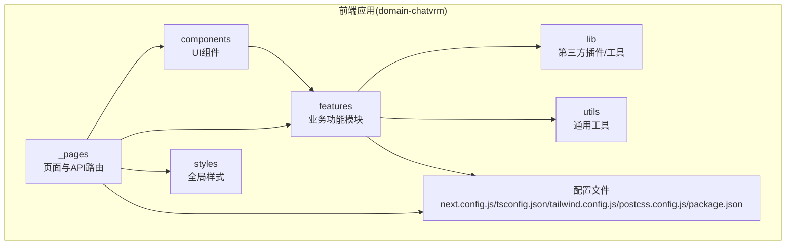
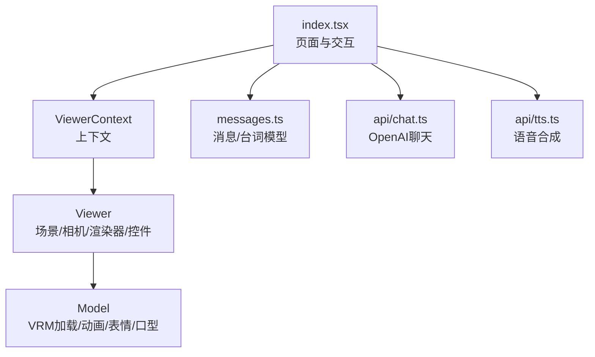
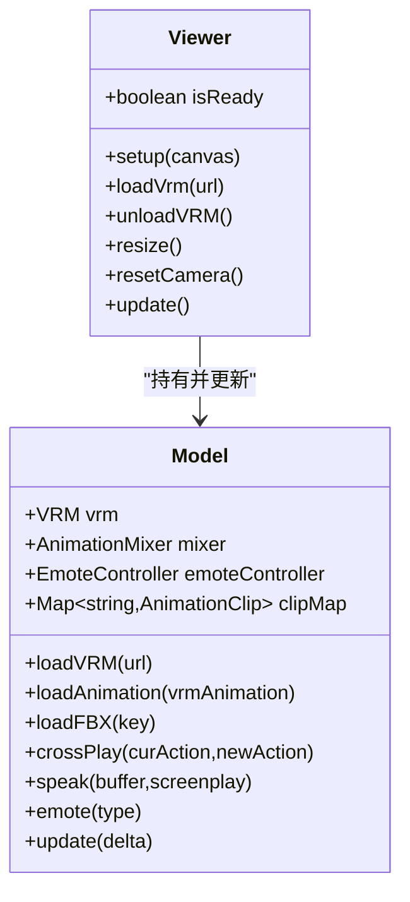
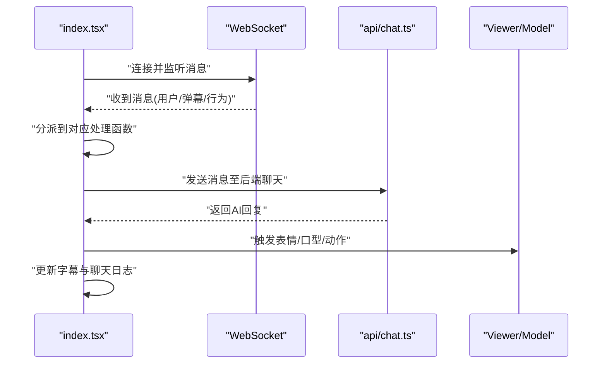
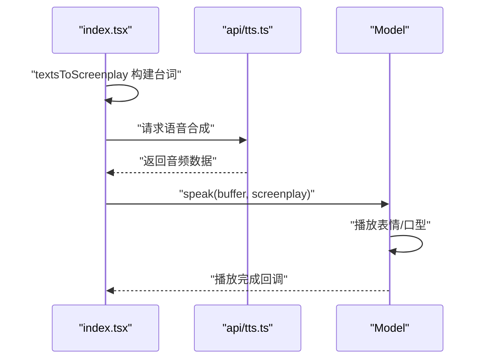
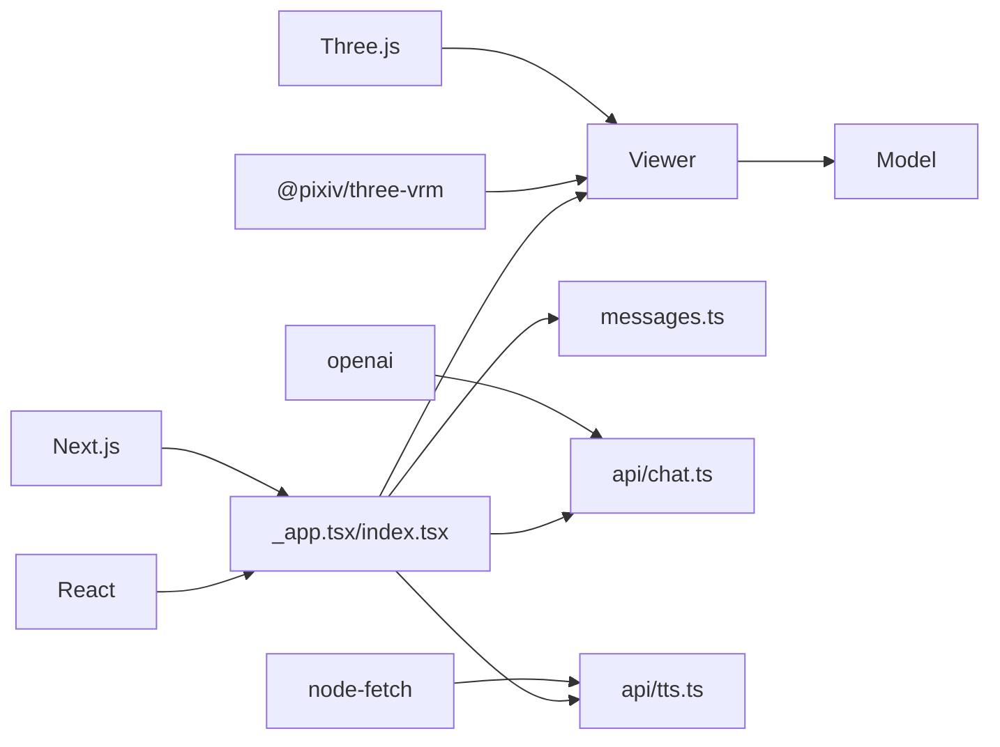

# 前端应用

<cite>
**本文引用的文件**
- [package.json](file://domain-chatvrm/package.json)
- [next.config.js](file://domain-chatvrm/next.config.js)
- [tsconfig.json](file://domain-chatvrm/tsconfig.json)
- [tailwind.config.js](file://domain-chatvrm/tailwind.config.js)
- [postcss.config.js](file://domain-chatvrm/postcss.config.js)
- [_app.tsx](file://domain-chatvrm/src/pages/_app.tsx)
- [_document.tsx](file://domain-chatvrm/src/pages/_document.tsx)
- [index.tsx](file://domain-chatvrm/src/pages/index.tsx)
- [chat.ts](file://domain-chatvrm/src/pages/api/chat.ts)
- [tts.ts](file://domain-chatvrm/src/pages/api/tts.ts)
- [vrmViewer.tsx](file://domain-chatvrm/src/components/vrmViewer.tsx)
- [viewerContext.ts](file://domain-chatvrm/src/features/vrmViewer/viewerContext.ts)
- [viewer.ts](file://domain-chatvrm/src/features/vrmViewer/viewer.ts)
- [model.ts](file://domain-chatvrm/src/features/vrmViewer/model.ts)
- [messages.ts](file://domain-chatvrm/src/features/messages/messages.ts)
</cite>

## 目录
1. [简介](#简介)
2. [项目结构](#项目结构)
3. [核心组件](#核心组件)
4. [架构总览](#架构总览)
5. [详细组件分析](#详细组件分析)
6. [依赖关系分析](#依赖关系分析)
7. [性能考量](#性能考量)
8. [故障排查指南](#故障排查指南)
9. [结论](#结论)
10. [附录](#附录)

## 简介
本文件为 VirtualWife 前端应用（ChatVRM）的技术文档，基于 Next.js + React + TypeScript 构建，采用 Three.js 与 @pixiv/three-vrm 实现 VRM 角色展示系统，并集成 TTS（语音合成）与聊天交互流程。文档覆盖项目结构、组件设计模式、状态管理策略、VRM 展示系统实现、聊天界面设计、语音合成集成、响应式与跨浏览器兼容性等主题，面向前端开发者提供可操作的技术参考与实现指导。

## 项目结构
- 顶层通过多模块组织：domain-chatvrm 为前端 Next.js 应用；domain-chatbot 为后端服务；其余为基础设施与打包配置。
- 前端应用位于 domain-chatvrm，核心目录与职责：
  - src/pages：页面级组件与 Next.js 路由入口（_app.tsx、_document.tsx、index.tsx、api/*）
  - src/components：可复用 UI 组件（如 vrmViewer、messageInputContainer、menu 等）
  - src/features：业务功能模块（vrmViewer、messages、chat、tts、media、config 等）
  - src/lib：第三方插件或工具（如 VRMAnimation、VRMLookAtSmootherLoaderPlugin）
  - src/utils：通用工具（buildUrl、wait 等）
  - styles：全局样式（globals.css）
  - 配置文件：next.config.js、tsconfig.json、tailwind.config.js、postcss.config.js、package.json

图表来源
- [index.tsx](file://domain-chatvrm/src/pages/index.tsx#L1-L390)
- [vrmViewer.tsx](file://domain-chatvrm/src/components/vrmViewer.tsx#L1-L59)
- [viewer.ts](file://domain-chatvrm/src/features/vrmViewer/viewer.ts#L1-L205)
- [messages.ts](file://domain-chatvrm/src/features/messages/messages.ts#L1-L80)

章节来源
- [package.json](file://domain-chatvrm/package.json#L1-L51)
- [next.config.js](file://domain-chatvrm/next.config.js#L1-L13)
- [tsconfig.json](file://domain-chatvrm/tsconfig.json#L1-L25)
- [tailwind.config.js](file://domain-chatvrm/tailwind.config.js#L1-L39)
- [postcss.config.js](file://domain-chatvrm/postcss.config.js#L1-L7)

## 核心组件
- 页面与入口
  - _app.tsx：全局样式与图标引入，Next.js 应用入口包装。
  - _document.tsx：HTML 文档模板，语言设置为 zh。
  - index.tsx：主页面，负责聊天逻辑、WebSocket 接收、VRM 播放、字幕与 TTS 集成。
- VRM 展示组件
  - vrmViewer.tsx：接收全局配置，初始化 Three.js 渲染器与相机，挂载 Viewer 并支持拖拽替换 VRM。
  - viewer.ts：封装 Three.js 场景、渲染循环、相机控制、VRM 加载与动画播放、镜头重置。
  - model.ts：封装 VRM 加载、AnimationMixer、表情控制器、口型同步、动作切换与交叉渐变。
- 功能模块
  - messages.ts：消息类型定义、台词（Screenplay）构建、情感到说话风格映射、句子切分。
- API 路由
  - chat.ts：转发前端请求至 OpenAI Chat Completion，返回 AI 回复。
  - tts.ts：调用后端语音合成服务，返回音频数据。

章节来源
- [_app.tsx](file://domain-chatvrm/src/pages/_app.tsx#L1-L8)
- [_document.tsx](file://domain-chatvrm/src/pages/_document.tsx#L1-L15)
- [index.tsx](file://domain-chatvrm/src/pages/index.tsx#L1-L390)
- [vrmViewer.tsx](file://domain-chatvrm/src/components/vrmViewer.tsx#L1-L59)
- [viewer.ts](file://domain-chatvrm/src/features/vrmViewer/viewer.ts#L1-L205)
- [model.ts](file://domain-chatvrm/src/features/vrmViewer/model.ts#L1-L136)
- [messages.ts](file://domain-chatvrm/src/features/messages/messages.ts#L1-L80)
- [chat.ts](file://domain-chatvrm/src/pages/api/chat.ts#L1-L39)
- [tts.ts](file://domain-chatvrm/src/pages/api/tts.ts#L1-L23)

## 架构总览
前端采用“页面 + 上下文 + 3D 渲染器 + 业务模块”的分层架构：
- 页面层：index.tsx 负责用户交互、状态管理、WebSocket 事件处理、TTS 调用与字幕展示。
- 上下文层：ViewerContext 提供单例 Viewer，贯穿组件树共享 3D 场景。
- 3D 渲染层：Viewer 负责场景、相机、渲染器、控件与渲染循环；Model 负责 VRM 加载、动画混剪、表情与口型同步。
- 业务层：messages.ts 定义消息与台词结构；chat.ts 与 tts.ts 分别对接后端聊天与语音合成。
- 配置与样式：Next.js 配置、TypeScript、TailwindCSS 主题与字体扩展。

图表来源
- [index.tsx](file://domain-chatvrm/src/pages/index.tsx#L1-L390)
- [viewerContext.ts](file://domain-chatvrm/src/features/vrmViewer/viewerContext.ts#L1-L7)
- [viewer.ts](file://domain-chatvrm/src/features/vrmViewer/viewer.ts#L1-L205)
- [model.ts](file://domain-chatvrm/src/features/vrmViewer/model.ts#L1-L136)
- [messages.ts](file://domain-chatvrm/src/features/messages/messages.ts#L1-L80)
- [chat.ts](file://domain-chatvrm/src/pages/api/chat.ts#L1-L39)
- [tts.ts](file://domain-chatvrm/src/pages/api/tts.ts#L1-L23)

## 详细组件分析

### VRM 角色展示系统
- Three.js 集成
  - 初始化场景、光源、相机与轨道控件；渲染器启用透明背景与抗锯齿；根据父容器尺寸自适应。
  - 相机位置与目标基于 VRM 头部节点动态校准，保证观看体验稳定。
- VRM 模型加载
  - 使用 GLTFLoader 注册 VRMLoaderPlugin 与 LookAt 平滑插件，加载 VRM 并旋转至标准姿态。
  - 禁用裁剪剔除，确保模型在任意角度可见。
- 动画控制
  - 通过 AnimationMixer 播放 Mixamo 动作片段，支持动作交叉渐变（fadeOut/fadeIn）避免抖动。
  - 预加载 idle 与 emote 动作，初始播放 idle_01。
- 表情与口型同步
  - EmoteController 控制 VRM 表情；LipSync 基于音频缓冲区驱动口型同步。
  - speak 流程：先播放表情，再播放音频，音频结束回调恢复 neutral 表情。

图表来源
- [viewer.ts](file://domain-chatvrm/src/features/vrmViewer/viewer.ts#L1-L205)
- [model.ts](file://domain-chatvrm/src/features/vrmViewer/model.ts#L1-L136)

章节来源
- [viewer.ts](file://domain-chatvrm/src/features/vrmViewer/viewer.ts#L1-L205)
- [model.ts](file://domain-chatvrm/src/features/vrmViewer/model.ts#L1-L136)

### 聊天界面与消息处理
- 状态管理
  - 页面维护系统提示、OpenAI 密钥、Koeiro 参数、聊天日志、当前助手回复、背景图 URL、字幕文本等状态。
  - 使用 localStorage 持久化部分参数，保障刷新后恢复。
- WebSocket 接收与事件分发
  - 连接建立后监听消息，按消息类型分派到用户消息、弹幕/欢迎消息、行为动作等处理函数。
- 字幕与打字机效果
  - 逐字节更新字幕显示，限制最大长度并滚动截断，营造打字机视觉效果。
- 发送聊天
  - 将用户消息加入日志，调用后端聊天接口获取回复，期间禁用输入并标记处理中。

图表来源
- [index.tsx](file://domain-chatvrm/src/pages/index.tsx#L296-L337)
- [chat.ts](file://domain-chatvrm/src/pages/api/chat.ts#L1-L39)
- [viewer.ts](file://domain-chatvrm/src/features/vrmViewer/viewer.ts#L1-L205)
- [model.ts](file://domain-chatvrm/src/features/vrmViewer/model.ts#L1-L136)

章节来源
- [index.tsx](file://domain-chatvrm/src/pages/index.tsx#L1-L390)

### 语音合成与播放控制
- 前端调用
  - 将台词转换为 Screenplay（含表情与说话风格），调用 speakCharacter（来自 messages/speakCharacter）执行播放。
- 后端 TTS
  - api/tts.ts 调用后端语音合成服务，返回音频数据（Base64 或二进制）。
- 播放与同步
  - Model.speak 先触发表情，再播放音频；音频播放完成回调恢复 neutral 表情。
  - LipSync 基于音频音量驱动口型同步，配合表情控制器实现自然联动。

图表来源
- [messages.ts](file://domain-chatvrm/src/features/messages/messages.ts#L44-L80)
- [tts.ts](file://domain-chatvrm/src/pages/api/tts.ts#L1-L23)
- [model.ts](file://domain-chatvrm/src/features/vrmViewer/model.ts#L111-L119)

章节来源
- [messages.ts](file://domain-chatvrm/src/features/messages/messages.ts#L1-L80)
- [tts.ts](file://domain-chatvrm/src/pages/api/tts.ts#L1-L23)
- [model.ts](file://domain-chatvrm/src/features/vrmViewer/model.ts#L1-L136)

### 组件 API 与使用示例
- VrmViewer(props)
  - 参数：globalConfig（全局配置）
  - 行为：初始化 Three.js 场景，加载 VRM，支持拖拽替换；作为背景 Canvas 使用。
  - 示例路径：[vrmViewer.tsx](file://domain-chatvrm/src/components/vrmViewer.tsx#L1-L59)
- ViewerContext
  - 提供单例 Viewer，供子组件通过 useContext 获取。
  - 示例路径：[viewerContext.ts](file://domain-chatvrm/src/features/vrmViewer/viewerContext.ts#L1-L7)
- Viewer
  - 方法：setup(canvas)、loadVrm(url)、unloadVRM()、resize()、resetCamera()、update()
  - 示例路径：[viewer.ts](file://domain-chatvrm/src/features/vrmViewer/viewer.ts#L1-L205)
- Model
  - 方法：loadVRM(url)、loadAnimation(vrmAnimation)、loadFBX(key)、crossPlay(a,b)、speak(buffer,screenplay)、emote(type)、update(delta)
  - 示例路径：[model.ts](file://domain-chatvrm/src/features/vrmViewer/model.ts#L1-L136)
- Messages
  - 类型：Message、Screenplay、EmotionType、TalkStyle
  - 工具：splitSentence(text)、textsToScreenplay(texts, koeiroParam, emote)
  - 示例路径：[messages.ts](file://domain-chatvrm/src/features/messages/messages.ts#L1-L80)

章节来源
- [vrmViewer.tsx](file://domain-chatvrm/src/components/vrmViewer.tsx#L1-L59)
- [viewerContext.ts](file://domain-chatvrm/src/features/vrmViewer/viewerContext.ts#L1-L7)
- [viewer.ts](file://domain-chatvrm/src/features/vrmViewer/viewer.ts#L1-L205)
- [model.ts](file://domain-chatvrm/src/features/vrmViewer/model.ts#L1-L136)
- [messages.ts](file://domain-chatvrm/src/features/messages/messages.ts#L1-L80)

## 依赖关系分析
- 运行时依赖
  - Next.js、React、Three.js、@pixiv/three-vrm、openai、node-fetch 等。
- 开发依赖
  - TailwindCSS、Autoprefixer、@types/*、ESLint、TypeScript。
- 关键耦合
  - index.tsx 依赖 ViewerContext 与 Viewer；Viewer 依赖 Model；Model 依赖 EmoteController 与 LipSync。
  - 页面通过 API 路由与后端交互，消息流经 messages.ts 的结构化定义。

图表来源
- [package.json](file://domain-chatvrm/package.json#L13-L32)
- [index.tsx](file://domain-chatvrm/src/pages/index.tsx#L1-L390)
- [viewer.ts](file://domain-chatvrm/src/features/vrmViewer/viewer.ts#L1-L205)
- [model.ts](file://domain-chatvrm/src/features/vrmViewer/model.ts#L1-L136)
- [messages.ts](file://domain-chatvrm/src/features/messages/messages.ts#L1-L80)
- [chat.ts](file://domain-chatvrm/src/pages/api/chat.ts#L1-L39)
- [tts.ts](file://domain-chatvrm/src/pages/api/tts.ts#L1-L23)

章节来源
- [package.json](file://domain-chatvrm/package.json#L1-L51)

## 性能考量
- 渲染性能
  - 渲染器启用抗锯齿与 sRGB 输出编码；按设备像素比设置清晰度；窗口 resize 时同步更新相机与渲染尺寸。
  - 禁用 VRM 场景对象的视锥裁剪，避免模型在视角边缘被剔除导致闪烁。
- 动画与混剪
  - 使用 AnimationMixer 的交叉渐变（fadeOut/fadeIn）平滑动作切换，减少突兀。
- 字幕与输入
  - 字幕长度限制与滚动截断，避免 DOM 节点无限增长；输入禁用期间阻止重复提交。
- 资源加载
  - VRM 与动作资源预加载至内存 Map，减少重复网络请求；支持本地拖拽替换 VRM 文件。

章节来源
- [viewer.ts](file://domain-chatvrm/src/features/vrmViewer/viewer.ts#L104-L157)
- [model.ts](file://domain-chatvrm/src/features/vrmViewer/model.ts#L79-L106)
- [index.tsx](file://domain-chatvrm/src/pages/index.tsx#L52-L64)

## 故障排查指南
- WebSocket 连接异常
  - 现象：连接断开后未自动重连。
  - 处理：确认 onclose 回调中重新调用 connect()；检查后端服务可用性与网络策略。
  - 参考路径：[index.tsx](file://domain-chatvrm/src/pages/index.tsx#L326-L337)
- VRM 加载失败
  - 现象：模型不显示或报错“需先加载 VRM”。
  - 处理：确认 loadVrm 成功后再调用 loadAnimation/loadFBX；检查 URL 与文件类型（.vrm）。
  - 参考路径：[viewer.ts](file://domain-chatvrm/src/features/vrmViewer/viewer.ts#L43-L92)
- 动作切换抖动
  - 现象：动作切换时角色抖动或卡顿。
  - 处理：使用 crossPlay 进行动画交叉渐变；确保同一时刻仅有一个动作处于播放。
  - 参考路径：[model.ts](file://domain-chatvrm/src/features/vrmViewer/model.ts#L99-L106)
- 字幕溢出
  - 现象：字幕过长导致性能下降。
  - 处理：限制最大长度并滚动截断；必要时降低逐字节更新频率。
  - 参考路径：[index.tsx](file://domain-chatvrm/src/pages/index.tsx#L52-L64)
- TTS 播放无声
  - 现象：音频数据返回但无声音输出。
  - 处理：确认 LipSync.playFromArrayBuffer 正常工作；检查音频上下文与浏览器静音策略。
  - 参考路径：[model.ts](file://domain-chatvrm/src/features/vrmViewer/model.ts#L111-L119)

章节来源
- [index.tsx](file://domain-chatvrm/src/pages/index.tsx#L326-L337)
- [viewer.ts](file://domain-chatvrm/src/features/vrmViewer/viewer.ts#L43-L92)
- [model.ts](file://domain-chatvrm/src/features/vrmViewer/model.ts#L99-L119)

## 结论
该前端应用以 Next.js 为基础，结合 Three.js 与 @pixiv/three-vrm 实现了高质量的 VRM 角色展示，配合消息结构化与 TTS 集成，提供了流畅的聊天与语音交互体验。通过上下文共享与模块化设计，系统具备良好的可维护性与扩展性。建议后续关注资源懒加载、缓存策略与跨浏览器兼容细节，持续优化性能与稳定性。

## 附录
- 响应式与跨浏览器兼容
  - TailwindCSS 主题与暗色模式；内容扫描范围覆盖 src 下的 tsx/html；line-clamp 插件用于文本截断。
  - Next.js 配置支持 basePath 与 assetPrefix，适配部署路径前缀；严格模式开启以提前暴露潜在问题。
- 最佳实践
  - 使用 ViewerContext 单例管理 3D 场景，避免重复实例化。
  - 对外暴露明确的组件 API（props 类型与方法签名），便于测试与替换。
  - 将消息与台词结构化（messages.ts），统一前后端交互契约。
  - 对动画与音频播放进行生命周期管理，确保播放完成回调与状态清理。

章节来源
- [tailwind.config.js](file://domain-chatvrm/tailwind.config.js#L1-L39)
- [next.config.js](file://domain-chatvrm/next.config.js#L1-L13)
- [messages.ts](file://domain-chatvrm/src/features/messages/messages.ts#L1-L80)