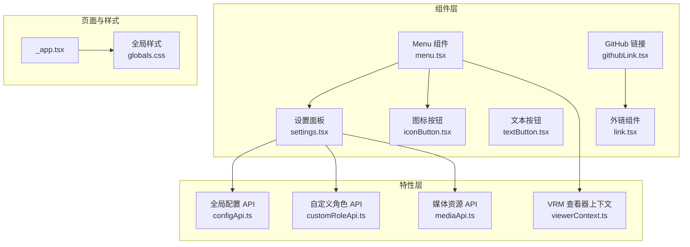
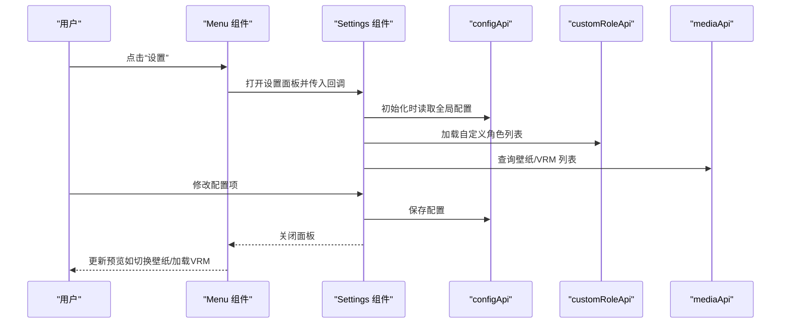
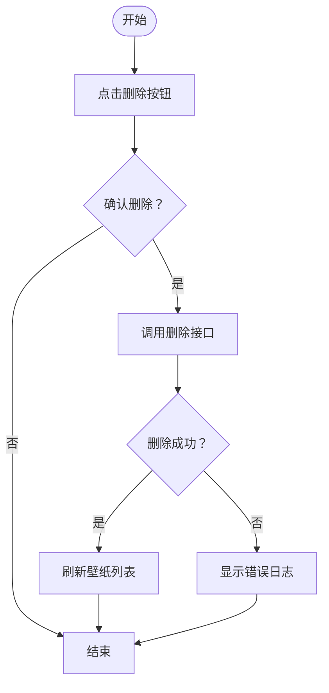
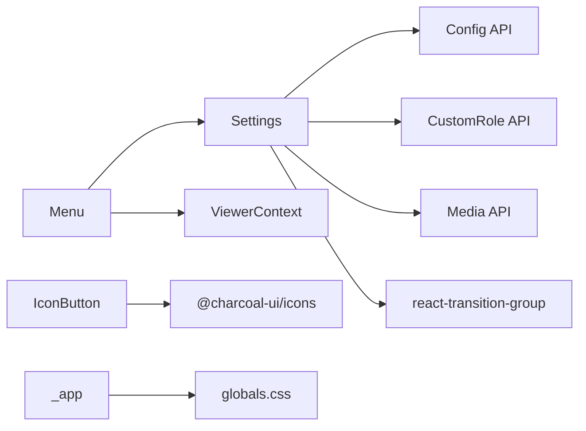

# 界面控制与设置

<cite>
**本文引用的文件**
- [settings.tsx](file://domain-chatvrm/src/components/settings.tsx)
- [menu.tsx](file://domain-chatvrm/src/components/menu.tsx)
- [iconButton.tsx](file://domain-chatvrm/src/components/iconButton.tsx)
- [textButton.tsx](file://domain-chatvrm/src/components/textButton.tsx)
- [githubLink.tsx](file://domain-chatvrm/src/components/githubLink.tsx)
- [link.tsx](file://domain-chatvrm/src/components/link.tsx)
- [configApi.ts](file://domain-chatvrm/src/features/config/configApi.ts)
- [customRoleApi.ts](file://domain-chatvrm/src/features/customRole/customRoleApi.ts)
- [mediaApi.ts](file://domain-chatvrm/src/features/media/mediaApi.ts)
- [viewerContext.ts](file://domain-chatvrm/src/features/vrmViewer/viewerContext.ts)
- [_app.tsx](file://domain-chatvrm/src/pages/_app.tsx)
- [globals.css](file://domain-chatvrm/src/styles/globals.css)
- [package.json](file://domain-chatvrm/package.json)
</cite>

## 目录
1. [简介](#简介)
2. [项目结构](#项目结构)
3. [核心组件](#核心组件)
4. [架构总览](#架构总览)
5. [组件详解](#组件详解)
6. [依赖关系分析](#依赖关系分析)
7. [性能考量](#性能考量)
8. [故障排查指南](#故障排查指南)
9. [结论](#结论)
10. [附录](#附录)

## 简介
本文件面向前端开发者，系统化梳理“界面控制与设置”相关组件的实现与使用方法，涵盖设置面板设计、配置项管理、状态保存、实时预览、菜单导航、图标与文本按钮规范、外链跳转处理、可访问性与国际化建议、主题定制与样式覆盖、扩展开发指导等。目标是提供从架构到细节的完整实现参考。

## 项目结构
本项目采用 Next.js + TypeScript + TailwindCSS 构建，界面控制与设置相关代码集中在 domain-chatvrm 子项目中，按“组件-特性-页面-样式”的层次组织。

图表来源
- [menu.tsx](file://domain-chatvrm/src/components/menu.tsx#L28-L164)
- [settings.tsx](file://domain-chatvrm/src/components/settings.tsx#L69-L1112)
- [iconButton.tsx](file://domain-chatvrm/src/components/iconButton.tsx#L9-L31)
- [textButton.tsx](file://domain-chatvrm/src/components/textButton.tsx#L4-L14)
- [githubLink.tsx](file://domain-chatvrm/src/components/githubLink.tsx#L3-L25)
- [link.tsx](file://domain-chatvrm/src/components/link.tsx#L1-L13)
- [configApi.ts](file://domain-chatvrm/src/features/config/configApi.ts#L68-L100)
- [customRoleApi.ts](file://domain-chatvrm/src/features/customRole/customRoleApi.ts#L24-L71)
- [mediaApi.ts](file://domain-chatvrm/src/features/media/mediaApi.ts#L20-L122)
- [viewerContext.ts](file://domain-chatvrm/src/features/vrmViewer/viewerContext.ts#L1-L7)
- [_app.tsx](file://domain-chatvrm/src/pages/_app.tsx#L1-L8)
- [globals.css](file://domain-chatvrm/src/styles/globals.css#L82-L190)

章节来源
- [menu.tsx](file://domain-chatvrm/src/components/menu.tsx#L28-L164)
- [settings.tsx](file://domain-chatvrm/src/components/settings.tsx#L69-L1112)
- [configApi.ts](file://domain-chatvrm/src/features/config/configApi.ts#L68-L100)
- [customRoleApi.ts](file://domain-chatvrm/src/features/customRole/customRoleApi.ts#L24-L71)
- [mediaApi.ts](file://domain-chatvrm/src/features/media/mediaApi.ts#L20-L122)
- [viewerContext.ts](file://domain-chatvrm/src/features/vrmViewer/viewerContext.ts#L1-L7)
- [_app.tsx](file://domain-chatvrm/src/pages/_app.tsx#L1-L8)
- [globals.css](file://domain-chatvrm/src/styles/globals.css#L82-L190)

## 核心组件
- 设置面板（Settings）：多标签页配置中心，负责全局配置读取/保存、角色与模型管理、LLM 参数、记忆模块、代理与直播等高级配置。
- 菜单（Menu）：入口控制面板，承载设置与会话记录的开关，提供 VRM 文件本地/远程加载能力。
- 图标按钮（IconButton）与文本按钮（TextButton）：统一交互反馈与视觉风格的基础按钮组件。
- 外链组件（Link）与 GitHub 链接（GitHubLink）：用于安全外链跳转与项目链接展示。
- 全局样式（globals.css）：提供组件通用样式、Tab 切换动画、输入控件与布局基线。

章节来源
- [settings.tsx](file://domain-chatvrm/src/components/settings.tsx#L69-L1112)
- [menu.tsx](file://domain-chatvrm/src/components/menu.tsx#L28-L164)
- [iconButton.tsx](file://domain-chatvrm/src/components/iconButton.tsx#L9-L31)
- [textButton.tsx](file://domain-chatvrm/src/components/textButton.tsx#L4-L14)
- [link.tsx](file://domain-chatvrm/src/components/link.tsx#L1-L13)
- [githubLink.tsx](file://domain-chatvrm/src/components/githubLink.tsx#L3-L25)
- [globals.css](file://domain-chatvrm/src/styles/globals.css#L82-L190)

## 架构总览
设置与控制组件围绕“状态驱动 + 特性 API + 上下文共享”的模式构建：

图表来源
- [menu.tsx](file://domain-chatvrm/src/components/menu.tsx#L133-L151)
- [settings.tsx](file://domain-chatvrm/src/components/settings.tsx#L117-L135)
- [configApi.ts](file://domain-chatvrm/src/features/config/configApi.ts#L68-L100)
- [customRoleApi.ts](file://domain-chatvrm/src/features/customRole/customRoleApi.ts#L59-L71)
- [mediaApi.ts](file://domain-chatvrm/src/features/media/mediaApi.ts#L42-L106)

## 组件详解

### 设置面板（Settings）
- 功能定位
  - 多标签页配置中心：基础设置、自定义角色设置、大语言模型设置、记忆模块设置、高级设置。
  - 实时预览：壁纸切换、VRM 模型加载、语音引擎与声音选择联动。
  - 状态持久化：通过配置 API 将修改写回后端。
- 数据流与状态
  - 初始状态来自全局配置；内部维护表单数据副本，变更即时更新 UI。
  - 通过副作用监听关键字段变化，触发联动（如语音引擎切换后刷新可用声音列表）。
- 关键交互
  - Tab 切换：基于当前激活 Tab 渲染对应区域，并使用过渡动画提升体验。
  - 表单提交：点击保存后调用保存接口并关闭面板。
  - 文件上传：壁纸、VRM、角色安装包上传，失败/成功日志提示。
- 复杂逻辑示意（壁纸删除流程）

图表来源
- [settings.tsx](file://domain-chatvrm/src/components/settings.tsx#L389-L397)
- [mediaApi.ts](file://domain-chatvrm/src/features/media/mediaApi.ts#L20-L29)

章节来源
- [settings.tsx](file://domain-chatvrm/src/components/settings.tsx#L69-L1112)
- [configApi.ts](file://domain-chatvrm/src/features/config/configApi.ts#L68-L100)
- [customRoleApi.ts](file://domain-chatvrm/src/features/customRole/customRoleApi.ts#L24-L71)
- [mediaApi.ts](file://domain-chatvrm/src/features/media/mediaApi.ts#L20-L122)

### 菜单（Menu）
- 导航与控制
  - 设置与会话记录的开关：根据状态动态切换图标与禁用态。
  - VRM 文件本地加载：隐藏文件输入框，通过按钮触发选择与加载。
  - 远程加载：通过上下文提供的查看器实例加载远端 URL。
- 状态管理
  - 使用局部状态控制设置面板与会话记录面板的显隐。
  - 将系统提示词、AI Key、背景图地址、聊天日志、Koeiro 参数等回调向上游传递。
- 响应式布局
  - 使用绝对定位与网格布局在视口固定区域放置按钮组，适配不同分辨率。

章节来源
- [menu.tsx](file://domain-chatvrm/src/components/menu.tsx#L28-L164)
- [viewerContext.ts](file://domain-chatvrm/src/features/vrmViewer/viewerContext.ts#L1-L7)

### 图标按钮（IconButton）与文本按钮（TextButton）
- 设计规范
  - 统一主题色与圆角尺寸，提供默认 hover/active/disabled 状态样式。
  - 图标按钮支持“处理中”状态（旋转点阵图标），文本按钮强调可点击性与对比度。
- 无障碍与交互
  - 保持原生 button 的可访问性语义，支持键盘聚焦与屏幕阅读器识别。
  - 提供 label 属性用于可读性增强（如设置面板中的“保存/关闭”）。
- 样式覆盖
  - 通过类名拼接实现，可在父组件中追加额外样式，避免破坏主题一致性。

章节来源
- [iconButton.tsx](file://domain-chatvrm/src/components/iconButton.tsx#L9-L31)
- [textButton.tsx](file://domain-chatvrm/src/components/textButton.tsx#L4-L14)
- [globals.css](file://domain-chatvrm/src/styles/globals.css#L175-L190)

### GitHub 链接与外链组件（GitHubLink、Link）
- 外部跳转处理
  - 使用 rel="noopener noreferrer" 防止新页面访问 opener，target="_blank" 在新窗口打开。
  - 保留链接可读性与颜色主题的一致性。
- 项目链接
  - GitHubLink 当前处于注释状态，可按需启用并替换为实际仓库地址。

章节来源
- [githubLink.tsx](file://domain-chatvrm/src/components/githubLink.tsx#L3-L25)
- [link.tsx](file://domain-chatvrm/src/components/link.tsx#L1-L13)

### 配置项管理与状态保存
- 配置结构
  - 初始配置包含角色、对话、记忆、代理、直播、语音、LLM 等子配置段。
- 读取与保存
  - 初始化时通过 GET 接口读取；提交时通过 POST 接口保存，返回码校验异常时抛出错误。
- 实时预览
  - 壁纸与 VRM 切换通过回调即时应用到场景或背景，无需刷新页面。

章节来源
- [configApi.ts](file://domain-chatvrm/src/features/config/configApi.ts#L4-L63)
- [configApi.ts](file://domain-chatvrm/src/features/config/configApi.ts#L68-L100)
- [settings.tsx](file://domain-chatvrm/src/components/settings.tsx#L314-L367)
- [menu.tsx](file://domain-chatvrm/src/components/menu.tsx#L100-L102)

### 主题定制与样式覆盖
- 主题变量
  - 项目使用 @charcoal-ui/tailwind-config 提供的主题变量，确保按钮、图标、文字等元素风格一致。
- 样式覆盖建议
  - 通过在父容器上追加类名的方式覆盖默认样式，避免直接修改组件内部类名。
  - 若需调整尺寸与间距，优先使用 Tailwind 工具类进行微调。
- 动画与过渡
  - 设置面板 Tab 内容使用过渡动画，提升切换体验；可按需调整动画时长与缓动曲线。

章节来源
- [package.json](file://domain-chatvrm/package.json#L35-L35)
- [globals.css](file://domain-chatvrm/src/styles/globals.css#L82-L116)

### 国际化与可访问性
- 可访问性
  - 按钮具备原生可访问性语义；图标按钮可提供 label 辅助说明。
  - 下拉选择与单选框提供清晰的标签与布局，避免视觉与语义脱节。
- 国际化
  - 文案集中于组件内，便于翻译；建议将文案抽离为 i18n 字典并在组件中按语言注入。
  - 对日期、数字等格式化建议使用 Intl API 或第三方库统一处理。

章节来源
- [iconButton.tsx](file://domain-chatvrm/src/components/iconButton.tsx#L18-L28)
- [globals.css](file://domain-chatvrm/src/styles/globals.css#L142-L147)

### 组件使用示例与扩展开发
- 使用示例
  - 在页面中引入 Menu 并传入必要的回调与状态；在设置面板中通过按钮触发保存与关闭。
  - 通过 Link 组件安全地打开外部链接；在需要时启用 GitHubLink。
- 扩展开发
  - 新增配置项时，先在配置 API 中定义结构与默认值，再在设置面板中添加表单项与联动逻辑。
  - 新增文件上传能力时，遵循现有 API 约定（FormData、headers），并在 UI 中提供进度与结果反馈。
  - 新增 Tab 时，按现有结构新增渲染函数并在 Tab 列表中注册名称。

章节来源
- [menu.tsx](file://domain-chatvrm/src/components/menu.tsx#L133-L151)
- [settings.tsx](file://domain-chatvrm/src/components/settings.tsx#L1090-L1106)
- [link.tsx](file://domain-chatvrm/src/components/link.tsx#L1-L13)

## 依赖关系分析
- 组件耦合
  - Menu 依赖 Settings、ViewerContext、图标按钮；Settings 依赖配置、自定义角色、媒体资源 API。
- 外部依赖
  - @charcoal-ui/icons 提供图标；react-transition-group 提供过渡动画；TailwindCSS 提供样式基线。
- 潜在风险
  - 配置保存失败时未做降级处理，建议增加重试与错误提示。
  - 文件上传未显示进度条，建议在 UI 中增加上传进度反馈。

图表来源
- [menu.tsx](file://domain-chatvrm/src/components/menu.tsx#L1-L164)
- [settings.tsx](file://domain-chatvrm/src/components/settings.tsx#L1-L1112)
- [iconButton.tsx](file://domain-chatvrm/src/components/iconButton.tsx#L1-L31)
- [_app.tsx](file://domain-chatvrm/src/pages/_app.tsx#L1-L8)
- [globals.css](file://domain-chatvrm/src/styles/globals.css#L1-L190)

章节来源
- [menu.tsx](file://domain-chatvrm/src/components/menu.tsx#L1-L164)
- [settings.tsx](file://domain-chatvrm/src/components/settings.tsx#L1-L1112)
- [iconButton.tsx](file://domain-chatvrm/src/components/iconButton.tsx#L1-L31)
- [_app.tsx](file://domain-chatvrm/src/pages/_app.tsx#L1-L8)
- [globals.css](file://domain-chatvrm/src/styles/globals.css#L1-L190)

## 性能考量
- 渲染优化
  - 设置面板使用 Tab 分片渲染，减少一次性渲染压力。
  - 下拉选择与单选框使用受控组件，避免不必要的重渲染。
- 网络请求
  - 配置读取与保存采用异步请求，建议在 UI 中增加加载态与错误提示。
  - 文件上传建议分块或带进度条，避免长时间无反馈。
- 资源加载
  - VRM 与壁纸加载采用 URL 直链或本地 Blob，注意内存释放与跨域策略。

## 故障排查指南
- 配置保存失败
  - 现象：点击保存后无响应或报错。
  - 排查：检查返回码与网络状态；确认 headers 与 body 结构正确。
- 壁纸/VRM 删除失败
  - 现象：删除后列表未刷新或显示错误日志。
  - 排查：确认 ID 正确、接口返回码为 200；检查刷新逻辑是否执行。
- 语音引擎切换无效
  - 现象：切换引擎后声音列表未更新。
  - 排查：确认监听了引擎字段变化并重新请求声音列表。

章节来源
- [configApi.ts](file://domain-chatvrm/src/features/config/configApi.ts#L68-L100)
- [mediaApi.ts](file://domain-chatvrm/src/features/media/mediaApi.ts#L20-L122)
- [settings.tsx](file://domain-chatvrm/src/components/settings.tsx#L139-L142)

## 结论
本套界面控制与设置组件以清晰的职责划分、稳定的 API 交互与一致的视觉风格为基础，提供了从配置读取、表单编辑、文件上传到实时预览的完整闭环。通过合理的状态管理与样式覆盖机制，既满足快速迭代需求，也为后续国际化与主题定制留足空间。

## 附录
- 快速清单
  - 新增配置项：在配置 API 定义默认值 → 在设置面板添加表单项 → 绑定回调 → 测试保存与读取。
  - 新增文件上传：封装 API → 在 UI 中绑定事件 → 显示结果与日志 → 优化加载态。
  - 新增 Tab：新增渲染函数 → 注册 Tab 名称 → 绑定切换逻辑 → 应用过渡动画。
- 参考路径
  - 设置面板主入口：[settings.tsx](file://domain-chatvrm/src/components/settings.tsx#L69-L1112)
  - 菜单入口与 VRM 加载：[menu.tsx](file://domain-chatvrm/src/components/menu.tsx#L28-L164)
  - 配置读取与保存：[configApi.ts](file://domain-chatvrm/src/features/config/configApi.ts#L68-L100)
  - 自定义角色 API：[customRoleApi.ts](file://domain-chatvrm/src/features/customRole/customRoleApi.ts#L24-L71)
  - 媒体资源 API：[mediaApi.ts](file://domain-chatvrm/src/features/media/mediaApi.ts#L20-L122)
  - 全局样式与动画：[globals.css](file://domain-chatvrm/src/styles/globals.css#L82-L190)
  - 应用入口与图标初始化：[_app.tsx](file://domain-chatvrm/src/pages/_app.tsx#L1-L8)