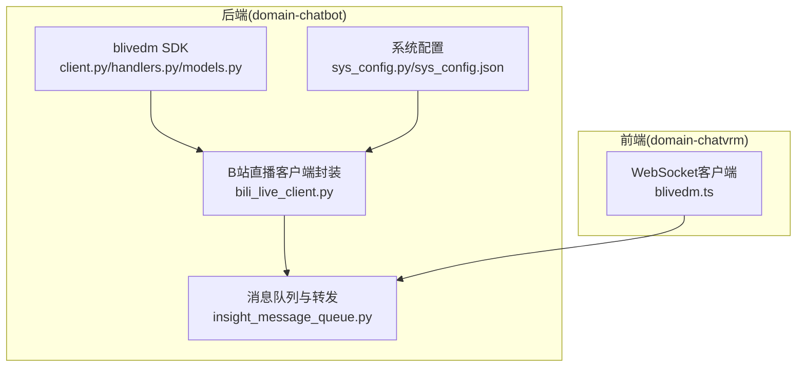
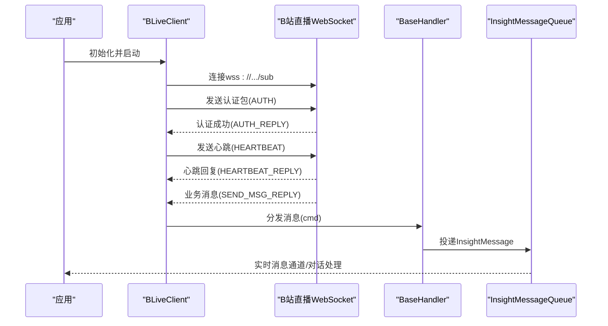
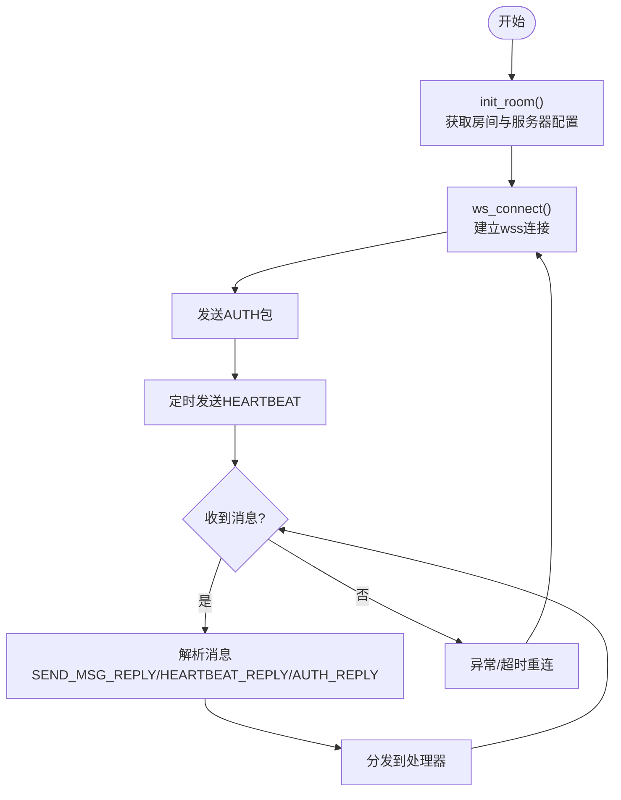
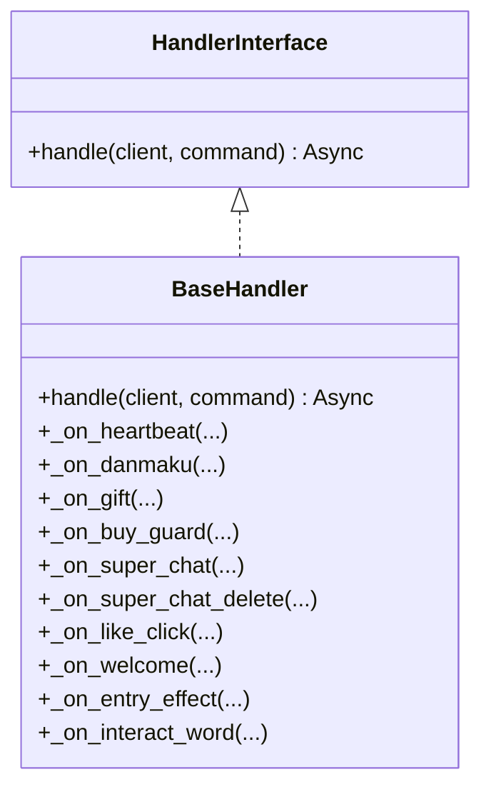
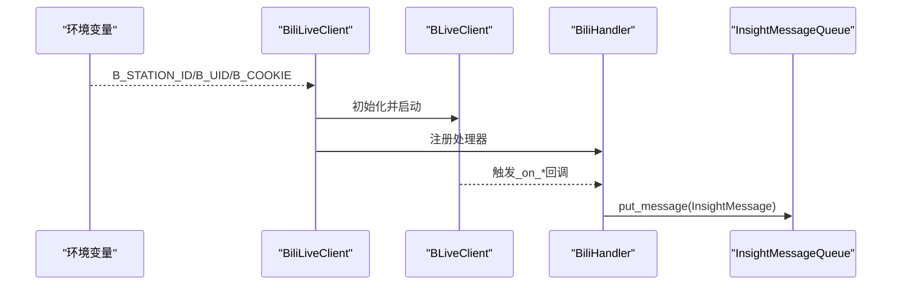
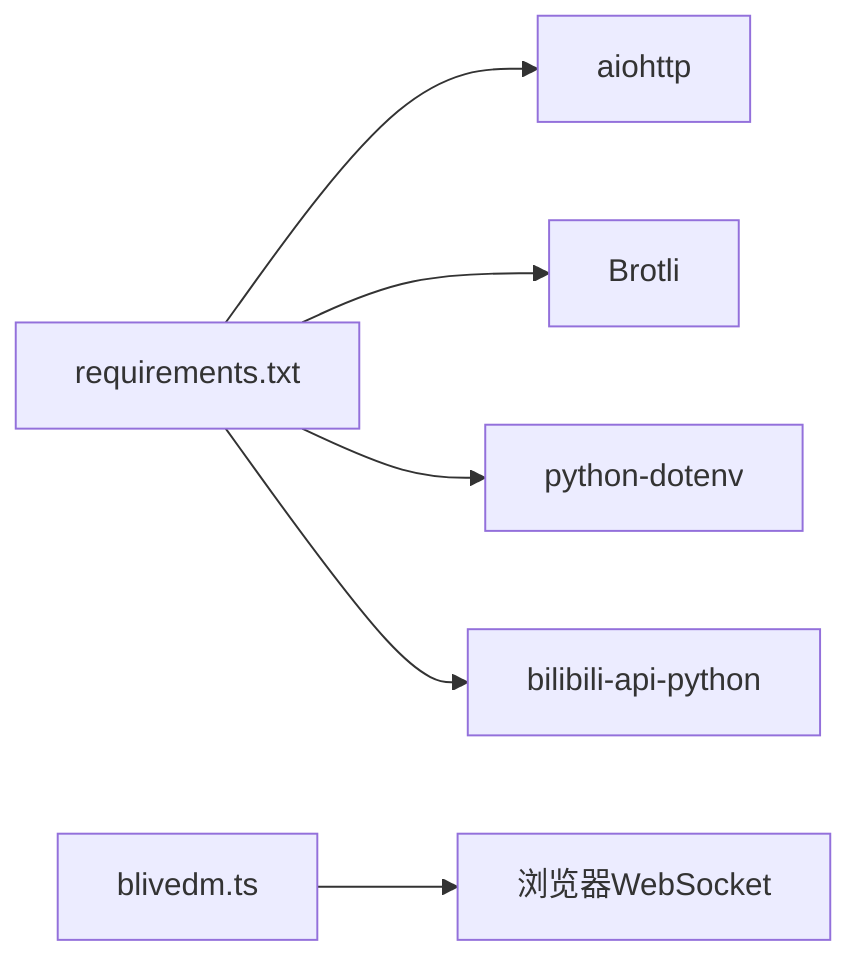

# B站直播客户端

<cite>
**本文引用的文件**
- [client.py](file://domain-chatbot/apps/chatbot/insight/bilibili/sdk/client.py)
- [handlers.py](file://domain-chatbot/apps/chatbot/insight/bilibili/sdk/handlers.py)
- [models.py](file://domain-chatbot/apps/chatbot/insight/bilibili/sdk/models.py)
- [bili_live_client.py](file://domain-chatbot/apps/chatbot/insight/bilibili/bili_live_client.py)
- [bili_live_client.py](file://domain-chatbot/apps/chatbot/insight/bilibili_api/bili_live_client.py)
- [insight_message_queue.py](file://domain-chatbot/apps/chatbot/insight/insight_message_queue.py)
- [sys_config.py](file://domain-chatbot/apps/chatbot/config/sys_config.py)
- [sys_config.json](file://domain-chatbot/apps/chatbot/config/sys_config.json)
- [requirements.txt](file://domain-chatbot/requirements.txt)
- [bilibili_api_test.py](file://domain-chatbot/tests/bilibili_api_test.py)
- [blivedm.ts](file://domain-chatvrm/src/features/blivedm/blivedm.ts)
</cite>

## 目录
1. [简介](#简介)
2. [项目结构](#项目结构)
3. [核心组件](#核心组件)
4. [架构总览](#架构总览)
5. [详细组件分析](#详细组件分析)
6. [依赖关系分析](#依赖关系分析)
7. [性能考量](#性能考量)
8. [故障排查指南](#故障排查指南)
9. [结论](#结论)
10. [附录](#附录)

## 简介
本技术文档面向开发者，系统性介绍B站直播客户端在本项目的集成与使用，重点覆盖以下方面：
- blivedm库的集成与使用：直播房间连接、弹幕监听机制、礼物消息处理
- WebSocket连接管理：连接建立、断线重连、心跳保持
- 弹幕消息的数据结构、解析规则、过滤策略
- 直播客户端的配置参数、环境变量处理、错误处理机制
- 直播功能的初始化流程、消息订阅方式、实时数据处理示例
- 面向开发者的完整B站直播集成实现指南与最佳实践

## 项目结构
本项目采用多模块分层设计，直播相关能力主要集中在domain-chatbot应用内，同时提供Web前端blivedm适配层：
- domain-chatbot：后端直播SDK与业务集成
  - insight/bilibili/sdk：基于blivedm的WebSocket协议实现
  - insight/bilibili：封装BLiveClient与消息处理器
  - insight/bilibili_api：基于bilibili-api-python的另一种直播监听方案
  - insight/insight_message_queue.py：统一消息队列与转发
  - config：系统配置与环境变量
- domain-chatvrm：前端Web端通过WebSocket接入后端消息流

图表来源
- [client.py](file://domain-chatbot/apps/chatbot/insight/bilibili/sdk/client.py#L87-L610)
- [handlers.py](file://domain-chatbot/apps/chatbot/insight/bilibili/sdk/handlers.py#L45-L190)
- [models.py](file://domain-chatbot/apps/chatbot/insight/bilibili/sdk/models.py#L16-L441)
- [bili_live_client.py](file://domain-chatbot/apps/chatbot/insight/bilibili/bili_live_client.py#L17-L129)
- [insight_message_queue.py](file://domain-chatbot/apps/chatbot/insight/insight_message_queue.py#L14-L83)
- [sys_config.py](file://domain-chatbot/apps/chatbot/config/sys_config.py#L32-L208)
- [sys_config.json](file://domain-chatbot/apps/chatbot/config/sys_config.json#L1-L60)
- [blivedm.ts](file://domain-chatvrm/src/features/blivedm/blivedm.ts#L15-L31)

章节来源
- [client.py](file://domain-chatbot/apps/chatbot/insight/bilibili/sdk/client.py#L1-L610)
- [bili_live_client.py](file://domain-chatbot/apps/chatbot/insight/bilibili/bili_live_client.py#L1-L129)
- [insight_message_queue.py](file://domain-chatbot/apps/chatbot/insight/insight_message_queue.py#L1-L83)
- [sys_config.py](file://domain-chatbot/apps/chatbot/config/sys_config.py#L1-L208)
- [sys_config.json](file://domain-chatbot/apps/chatbot/config/sys_config.json#L1-L60)
- [blivedm.ts](file://domain-chatvrm/src/features/blivedm/blivedm.ts#L1-L32)

## 核心组件
- BLiveClient：基于WebSocket的B站直播弹幕客户端，负责房间初始化、连接、认证、心跳、消息分发
- BaseHandler：消息处理器基类，内置对弹幕、礼物、舰长、醒目留言、点赞、入场特效等命令的分发与回调
- 数据模型：HeartbeatMessage、DanmakuMessage、GiftMessage、GuardBuyMessage、SuperChatMessage、LikeInfoV3ClickMessage、EntryEffectMessage、InteractWordMessage
- B站直播客户端封装：BiliLiveClient，负责从环境变量读取配置、启动/停止客户端、注册消息处理器并将消息投递到统一队列
- 消息队列：InsightMessageQueue，统一接收来自直播客户端的消息并转发至实时消息通道与对话处理链路
- 配置系统：SysConfig/SysConfigJson，集中管理直播开关、房间ID、Cookie等配置项

章节来源
- [client.py](file://domain-chatbot/apps/chatbot/insight/bilibili/sdk/client.py#L87-L610)
- [handlers.py](file://domain-chatbot/apps/chatbot/insight/bilibili/sdk/handlers.py#L45-L190)
- [models.py](file://domain-chatbot/apps/chatbot/insight/bilibili/sdk/models.py#L16-L441)
- [bili_live_client.py](file://domain-chatbot/apps/chatbot/insight/bilibili/bili_live_client.py#L17-L129)
- [insight_message_queue.py](file://domain-chatbot/apps/chatbot/insight/insight_message_queue.py#L14-L83)
- [sys_config.py](file://domain-chatbot/apps/chatbot/config/sys_config.py#L32-L208)
- [sys_config.json](file://domain-chatbot/apps/chatbot/config/sys_config.json#L1-L60)

## 架构总览
后端通过BLiveClient与B站直播WebSocket服务建立连接，完成房间初始化与认证后进入消息循环；消息到达后按协议版本与操作码解析，分发到各消息处理器；处理器将关键消息封装为InsightMessage并投递到统一队列，由队列消费者触发实时消息通道与对话处理。

图表来源
- [client.py](file://domain-chatbot/apps/chatbot/insight/bilibili/sdk/client.py#L377-L594)
- [handlers.py](file://domain-chatbot/apps/chatbot/insight/bilibili/sdk/handlers.py#L124-L140)
- [insight_message_queue.py](file://domain-chatbot/apps/chatbot/insight/insight_message_queue.py#L47-L70)

## 详细组件分析

### BLiveClient：WebSocket连接与消息处理
- 房间初始化：通过REST接口获取房间信息与弹幕服务器配置，支持降级策略
- 连接与认证：选择可用的弹幕服务器，建立wss连接并发送认证包
- 心跳保持：定时发送心跳包，处理服务器心跳回复
- 消息解析：根据协议头解析业务消息，支持Brotli压缩与普通JSON两种格式
- 断线重连：捕获连接异常与认证失败，按服务器列表轮询重连

图表来源
- [client.py](file://domain-chatbot/apps/chatbot/insight/bilibili/sdk/client.py#L250-L429)

章节来源
- [client.py](file://domain-chatbot/apps/chatbot/insight/bilibili/sdk/client.py#L87-L610)

### BaseHandler：消息分发与过滤
- 内置命令映射：将常见业务命令映射到对应回调，如弹幕(DANMU_MSG)、礼物(SEND_GIFT)、舰长(GUARD_BUY)、醒目留言(SUPER_CHAT_MESSAGE)、点赞(LIKE_INFO_V3_CLICK)、入场特效(ENTRY_EFFECT_MUST_RECEIVE)、互动词(INTERACT_WORD)
- 可忽略命令：对大量冗余命令进行过滤，减少处理开销
- 回调扩展：子类可重写对应_on_*方法实现自定义处理逻辑

图表来源
- [handlers.py](file://domain-chatbot/apps/chatbot/insight/bilibili/sdk/handlers.py#L45-L190)

章节来源
- [handlers.py](file://domain-chatbot/apps/chatbot/insight/bilibili/sdk/handlers.py#L15-L190)

### 数据模型：消息结构与解析
- HeartbeatMessage：心跳消息，包含人气值
- DanmakuMessage：弹幕消息，包含显示样式、用户信息、勋章信息、等级信息等
- GiftMessage：礼物消息，包含礼物名、数量、用户信息、价格、币种等
- GuardBuyMessage：舰长购买消息
- SuperChatMessage：醒目留言消息，包含价格、消息、背景信息等
- LikeInfoV3ClickMessage：点赞消息
- EntryEffectMessage：入场特效消息
- InteractWordMessage：互动词消息

图表来源
- [models.py](file://domain-chatbot/apps/chatbot/insight/bilibili/sdk/models.py#L16-L441)

章节来源
- [models.py](file://domain-chatbot/apps/chatbot/insight/bilibili/sdk/models.py#L16-L441)

### B站直播客户端封装：BiliLiveClient
- 环境变量读取：从环境变量加载房间ID、UID、Cookie
- 客户端启动：创建BLiveClient实例，注册BiliHandler，启动客户端
- 生命周期管理：提供start/stop方法，确保协程正确停止与资源释放
- 消息处理：将弹幕、礼物、舰长、点赞、入场特效等消息封装为InsightMessage并投递到队列

图表来源
- [bili_live_client.py](file://domain-chatbot/apps/chatbot/insight/bilibili/bili_live_client.py#L24-L51)
- [client.py](file://domain-chatbot/apps/chatbot/insight/bilibili/sdk/client.py#L178-L208)
- [handlers.py](file://domain-chatbot/apps/chatbot/insight/bilibili/sdk/handlers.py#L124-L140)
- [insight_message_queue.py](file://domain-chatbot/apps/chatbot/insight/insight_message_queue.py#L47-L70)

章节来源
- [bili_live_client.py](file://domain-chatbot/apps/chatbot/insight/bilibili/bili_live_client.py#L17-L129)

### 消息队列与转发：InsightMessageQueue
- 统一消息结构：InsightMessage包含类型、用户ID/名称、内容、表情、动作等字段
- 线程安全队列：SimpleQueue保证多线程安全
- 实时转发：消费者线程从队列取出消息，格式化后投递到实时消息通道并触发对话处理

章节来源
- [insight_message_queue.py](file://domain-chatbot/apps/chatbot/insight/insight_message_queue.py#L14-L83)

### 配置系统：SysConfig与SysConfigJson
- 系统配置：集中管理直播开关、房间ID、Cookie、代理、LLM配置、记忆存储等
- 环境变量：通过dotenv加载，供BLiveClient读取
- 动态加载：SysConfig从数据库或本地JSON加载配置，支持懒加载记忆模块

章节来源
- [sys_config.py](file://domain-chatbot/apps/chatbot/config/sys_config.py#L32-L208)
- [sys_config.json](file://domain-chatbot/apps/chatbot/config/sys_config.json#L1-L60)

### 前端WebSocket接入：blivedm.ts
- 环境区分：根据NODE_ENV选择不同基础URL
- 连接建立：WebSocket连接后发送确认消息
- 断线重连：连接关闭时每秒重连一次

章节来源
- [blivedm.ts](file://domain-chatvrm/src/features/blivedm/blivedm.ts#L15-L31)

## 依赖关系分析
- 后端依赖
  - aiohttp：用于HTTP请求与WebSocket连接
  - Brotli：解压业务消息
  - python-dotenv：加载环境变量
  - bilibili-api-python：另一种直播监听方案
- 前端依赖
  - 浏览器原生WebSocket API

图表来源
- [requirements.txt](file://domain-chatbot/requirements.txt#L1-L33)
- [blivedm.ts](file://domain-chatvrm/src/features/blivedm/blivedm.ts#L1-L32)

章节来源
- [requirements.txt](file://domain-chatbot/requirements.txt#L1-L33)

## 性能考量
- 协程与并发：BLiveClient使用asyncio协程处理网络与消息，处理器并发执行，注意避免长时间阻塞
- 压缩解压：业务消息支持Brotli压缩，解析时使用线程池执行解压，避免阻塞事件循环
- 心跳与超时：合理设置心跳间隔与接收超时，确保在网络波动时快速恢复
- 消息过滤：对高频冗余命令进行过滤，降低处理压力
- 资源释放：停止客户端时需join并关闭会话，防止资源泄漏

## 故障排查指南
- 连接失败
  - 检查房间ID与Cookie是否正确
  - 确认网络可达与SSL配置
  - 查看init_room与_get_host_server的日志
- 认证失败
  - 更新Cookie或重新获取Token
  - 观察AUTH_REPLY返回码
- 心跳异常
  - 检查心跳定时器与发送逻辑
  - 关注HEARTBEAT_REPLY的人气值解析
- 消息解析错误
  - 检查协议版本与压缩标志
  - 确认JSON解析与异常处理
- 断线重连
  - 观察重连计数与服务器列表轮询
  - 遇到SSLError时需检查证书配置

章节来源
- [client.py](file://domain-chatbot/apps/chatbot/insight/bilibili/sdk/client.py#L410-L429)
- [client.py](file://domain-chatbot/apps/chatbot/insight/bilibili/sdk/client.py#L508-L594)

## 结论
本项目提供了两套B站直播监听方案：基于blivedm的WebSocket实现与基于bilibili-api-python的事件监听。前者更贴近底层协议，具备更强的可控性与扩展性；后者简化了事件订阅与解析流程。结合统一消息队列与配置系统，开发者可以灵活地集成直播功能并将其无缝接入到对话与情感表达链路中。

## 附录

### 配置参数与环境变量
- 环境变量
  - B_STATION_ID：直播房间ID
  - B_UID：用户ID（可选）
  - B_COOKIE：Cookie字符串
- 系统配置
  - liveStreamingConfig：房间ID与Cookie
  - enableLive：是否启用直播
  - languageModelConfig：大语言模型相关配置
  - memoryStorageConfig：记忆存储配置

章节来源
- [bili_live_client.py](file://domain-chatbot/apps/chatbot/insight/bilibili/bili_live_client.py#L24-L35)
- [sys_config.json](file://domain-chatbot/apps/chatbot/config/sys_config.json#L1-L60)
- [sys_config.py](file://domain-chatbot/apps/chatbot/config/sys_config.py#L194-L208)

### 初始化流程与消息订阅示例
- 初始化流程
  - 读取环境变量与配置
  - 创建BLiveClient并注册处理器
  - 启动客户端并进入消息循环
- 消息订阅
  - 弹幕：DANMU_MSG
  - 礼物：SEND_GIFT
  - 舰长：GUARD_BUY
  - 醒目留言：SUPER_CHAT_MESSAGE
  - 点赞：LIKE_INFO_V3_CLICK
  - 入场特效：ENTRY_EFFECT_MUST_RECEIVE
  - 互动词：INTERACT_WORD

章节来源
- [bili_live_client.py](file://domain-chatbot/apps/chatbot/insight/bilibili/bili_live_client.py#L37-L51)
- [handlers.py](file://domain-chatbot/apps/chatbot/insight/bilibili/sdk/handlers.py#L89-L122)

### 错误处理机制
- 异常分类
  - InitError：初始化失败
  - AuthError：认证失败
  - 网络异常：连接错误与超时
- 处理策略
  - 认证失败：重新init_room并重连
  - 连接异常：按服务器列表轮询重连
  - 日志记录：对未知命令与异常进行日志记录

章节来源
- [client.py](file://domain-chatbot/apps/chatbot/insight/bilibili/sdk/client.py#L79-L85)
- [client.py](file://domain-chatbot/apps/chatbot/insight/bilibili/sdk/client.py#L410-L429)

### 最佳实践
- 使用独立的ClientSession并复用连接池
- 合理设置心跳间隔，避免过于频繁导致资源消耗
- 对处理器进行限流与去重，避免重复消息影响体验
- 在生产环境中启用SSL校验，确保连接安全
- 将消息处理逻辑拆分为轻量处理器，必要时使用队列异步处理