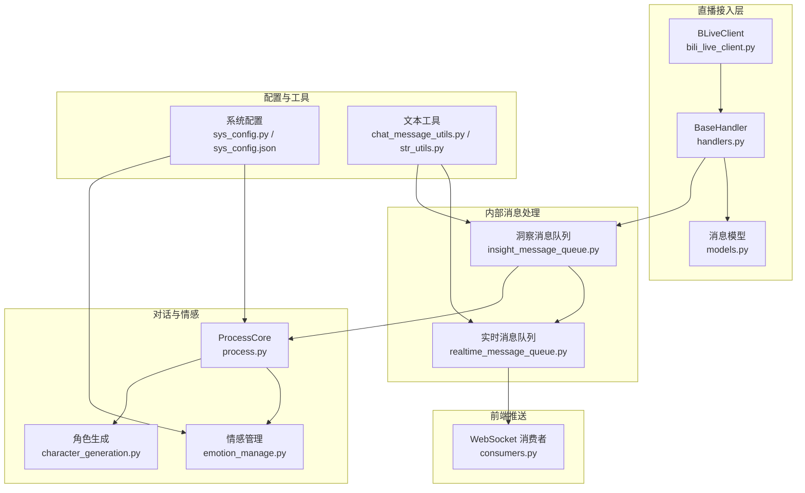
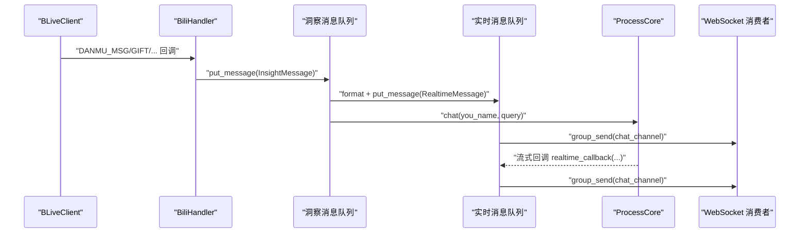
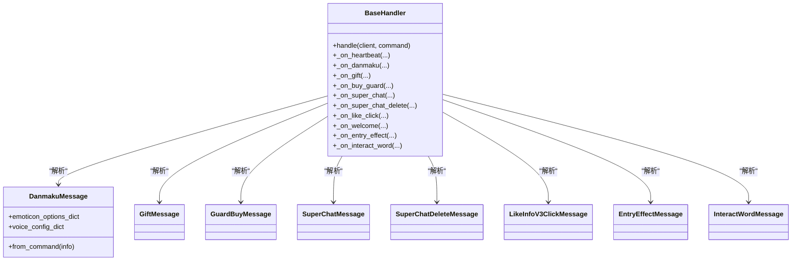
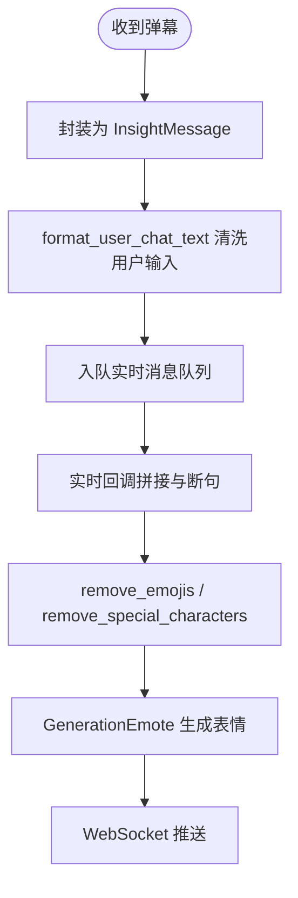
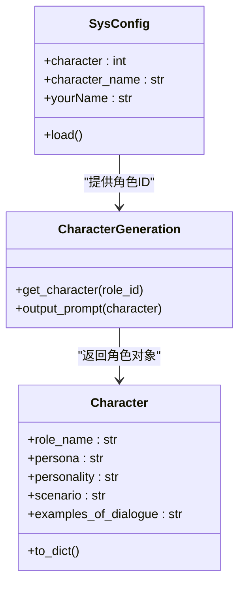
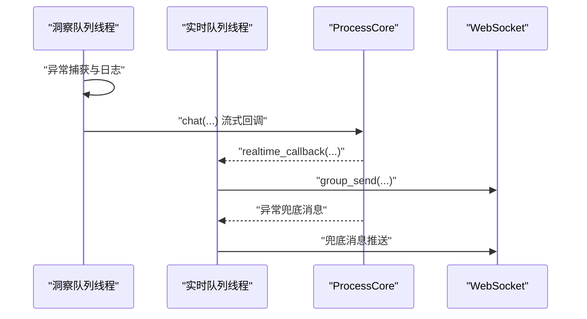
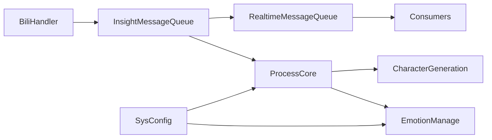

# 消息处理系统

<cite>
**本文引用的文件**
- [handlers.py](file://domain-chatbot/apps/chatbot/insight/bilibili/sdk/handlers.py)
- [models.py](file://domain-chatbot/apps/chatbot/insight/bilibili/sdk/models.py)
- [bili_live_client.py](file://domain-chatbot/apps/chatbot/insight/bilibili/bili_live_client.py)
- [insight_message_queue.py](file://domain-chatbot/apps/chatbot/insight/insight_message_queue.py)
- [realtime_message_queue.py](file://domain-chatbot/apps/chatbot/output/realtime_message_queue.py)
- [consumers.py](file://domain-chatbot/apps/chatbot/output/consumers.py)
- [process.py](file://domain-chatbot/apps/chatbot/process/process.py)
- [emotion_manage.py](file://domain-chatbot/apps/chatbot/emotion/emotion_manage.py)
- [chat_message_utils.py](file://domain-chatbot/apps/chatbot/utils/chat_message_utils.py)
- [str_utils.py](file://domain-chatbot/apps/chatbot/utils/str_utils.py)
- [sys_config.py](file://domain-chatbot/apps/chatbot/config/sys_config.py)
- [sys_config.json](file://domain-chatbot/apps/chatbot/config/sys_config.json)
- [character_generation.py](file://domain-chatbot/apps/chatbot/character/character_generation.py)
- [character.py](file://domain-chatbot/apps/chatbot/character/character.py)
</cite>

## 目录
1. [简介](#简介)
2. [项目结构](#项目结构)
3. [核心组件](#核心组件)
4. [架构总览](#架构总览)
5. [详细组件分析](#详细组件分析)
6. [依赖关系分析](#依赖关系分析)
7. [性能考虑](#性能考虑)
8. [故障排查指南](#故障排查指南)
9. [结论](#结论)
10. [附录](#附录)

## 简介
本技术文档围绕消息处理系统展开，覆盖从直播弹幕等实时消息的接收、解析、标准化、过滤与格式转换，到消息分发、异步处理与并发控制、错误恢复策略，再到消息队列的缓冲、优先级与批量处理机制，并提供配置项、性能优化建议、监控指标以及实际使用示例、调试方法与扩展开发指导。系统以 Django Channels 为基础，结合 B 站直播 SDK，完成从弹幕到对话生成、表情生成与实时推送的完整链路。

## 项目结构
消息处理系统主要分布在以下模块：
- 直播 SDK 与消息模型：负责弹幕、礼物、舰长、醒目留言等消息的解析与标准化
- 直播客户端与处理器：负责连接直播房间、注册处理器、转发消息到内部队列
- 内部洞察消息队列：负责消息入队、格式化、派发至实时消息队列与对话处理
- 实时消息队列与 WebSocket 推送：负责消息缓冲、格式清理、表情生成与前端推送
- 对话处理与情感模块：负责角色生成、提示词构建、LLM 流式对话、情感识别与表情生成
- 配置与工具：负责系统配置加载、文本清洗、字符串处理等

图表来源
- [bili_live_client.py](file://domain-chatbot/apps/chatbot/insight/bilibili/bili_live_client.py#L1-L129)
- [handlers.py](file://domain-chatbot/apps/chatbot/insight/bilibili/sdk/handlers.py#L1-L190)
- [models.py](file://domain-chatbot/apps/chatbot/insight/bilibili/sdk/models.py#L1-L441)
- [insight_message_queue.py](file://domain-chatbot/apps/chatbot/insight/insight_message_queue.py#L1-L83)
- [realtime_message_queue.py](file://domain-chatbot/apps/chatbot/output/realtime_message_queue.py#L1-L107)
- [consumers.py](file://domain-chatbot/apps/chatbot/output/consumers.py#L1-L38)
- [process.py](file://domain-chatbot/apps/chatbot/process/process.py#L1-L77)
- [emotion_manage.py](file://domain-chatbot/apps/chatbot/emotion/emotion_manage.py#L1-L182)
- [sys_config.py](file://domain-chatbot/apps/chatbot/config/sys_config.py#L1-L208)
- [sys_config.json](file://domain-chatbot/apps/chatbot/config/sys_config.json#L1-L60)
- [chat_message_utils.py](file://domain-chatbot/apps/chatbot/utils/chat_message_utils.py#L1-L27)
- [str_utils.py](file://domain-chatbot/apps/chatbot/utils/str_utils.py#L1-L33)

章节来源
- [bili_live_client.py](file://domain-chatbot/apps/chatbot/insight/bilibili/bili_live_client.py#L1-L129)
- [handlers.py](file://domain-chatbot/apps/chatbot/insight/bilibili/sdk/handlers.py#L1-L190)
- [models.py](file://domain-chatbot/apps/chatbot/insight/bilibili/sdk/models.py#L1-L441)
- [insight_message_queue.py](file://domain-chatbot/apps/chatbot/insight/insight_message_queue.py#L1-L83)
- [realtime_message_queue.py](file://domain-chatbot/apps/chatbot/output/realtime_message_queue.py#L1-L107)
- [consumers.py](file://domain-chatbot/apps/chatbot/output/consumers.py#L1-L38)
- [process.py](file://domain-chatbot/apps/chatbot/process/process.py#L1-L77)
- [emotion_manage.py](file://domain-chatbot/apps/chatbot/emotion/emotion_manage.py#L1-L182)
- [sys_config.py](file://domain-chatbot/apps/chatbot/config/sys_config.py#L1-L208)
- [sys_config.json](file://domain-chatbot/apps/chatbot/config/sys_config.json#L1-L60)
- [chat_message_utils.py](file://domain-chatbot/apps/chatbot/utils/chat_message_utils.py#L1-L27)
- [str_utils.py](file://domain-chatbot/apps/chatbot/utils/str_utils.py#L1-L33)

## 核心组件
- 直播消息处理器与模型
  - BaseHandler 提供命令分发与回调映射，屏蔽不同消息类型的差异，统一转交到具体 _on_xxx 方法
  - 消息模型（DanmakuMessage、GiftMessage、GuardBuyMessage、SuperChatMessage 等）提供字段化结构与 from_command 解析
- 直播客户端与处理器
  - BiliLiveClient 负责初始化 BLiveClient、注册 BiliHandler 并启动循环
  - BiliHandler 将收到的消息封装为 InsightMessage 并入队
- 内部洞察消息队列
  - 将 danmaku 类型消息进行格式化，入队至实时消息队列，同时触发对话处理
- 实时消息队列与 WebSocket
  - 线程安全队列 + 后台线程轮询发送；对文本进行表情与特殊字符清理；调用 GenerationEmote 生成表情；通过 Channel Layer 推送至前端
- 对话处理与情感模块
  - ProcessCore 构建角色 Prompt、检索记忆、调用 LLM 流式生成，并通过回调将中间结果推送到实时队列
  - EmotionRecognition 与 GenerationEmote 负责情感识别与表情生成
- 配置与工具
  - SysConfig 加载系统配置、环境变量与角色配置；SysConfig.json 提供默认配置
  - 字符串与聊天文本工具用于格式化与清洗

章节来源
- [handlers.py](file://domain-chatbot/apps/chatbot/insight/bilibili/sdk/handlers.py#L45-L190)
- [models.py](file://domain-chatbot/apps/chatbot/insight/bilibili/sdk/models.py#L16-L441)
- [bili_live_client.py](file://domain-chatbot/apps/chatbot/insight/bilibili/bili_live_client.py#L17-L129)
- [insight_message_queue.py](file://domain-chatbot/apps/chatbot/insight/insight_message_queue.py#L14-L83)
- [realtime_message_queue.py](file://domain-chatbot/apps/chatbot/output/realtime_message_queue.py#L21-L107)
- [process.py](file://domain-chatbot/apps/chatbot/process/process.py#L19-L77)
- [emotion_manage.py](file://domain-chatbot/apps/chatbot/emotion/emotion_manage.py#L9-L182)
- [sys_config.py](file://domain-chatbot/apps/chatbot/config/sys_config.py#L32-L208)
- [sys_config.json](file://domain-chatbot/apps/chatbot/config/sys_config.json#L1-L60)
- [chat_message_utils.py](file://domain-chatbot/apps/chatbot/utils/chat_message_utils.py#L4-L27)
- [str_utils.py](file://domain-chatbot/apps/chatbot/utils/str_utils.py#L4-L33)

## 架构总览
消息从直播房间到达，经由 SDK 解析为结构化消息，再由处理器封装为 InsightMessage 入队；随后由队列消费者进行格式化与派发，触发对话处理与情感生成，最终通过 WebSocket 推送至前端。

图表来源
- [bili_live_client.py](file://domain-chatbot/apps/chatbot/insight/bilibili/bili_live_client.py#L70-L109)
- [insight_message_queue.py](file://domain-chatbot/apps/chatbot/insight/insight_message_queue.py#L52-L69)
- [realtime_message_queue.py](file://domain-chatbot/apps/chatbot/output/realtime_message_queue.py#L54-L95)
- [process.py](file://domain-chatbot/apps/chatbot/process/process.py#L33-L70)
- [consumers.py](file://domain-chatbot/apps/chatbot/output/consumers.py#L10-L38)

## 详细组件分析

### 直播消息接收与解析
- 命令分发：BaseHandler 维护 cmd -> 回调映射表，忽略列表中的常见无关命令，未知命令仅首次记录告警
- 模型解析：各消息模型提供 from_command 将原始数据结构映射为字段化对象，便于后续处理
- 处理器扩展：继承 BaseHandler 并重写 _on_xxx 方法，即可实现对特定消息类型的定制处理

图表来源
- [handlers.py](file://domain-chatbot/apps/chatbot/insight/bilibili/sdk/handlers.py#L54-L190)
- [models.py](file://domain-chatbot/apps/chatbot/insight/bilibili/sdk/models.py#L16-L441)

章节来源
- [handlers.py](file://domain-chatbot/apps/chatbot/insight/bilibili/sdk/handlers.py#L15-L140)
- [models.py](file://domain-chatbot/apps/chatbot/insight/bilibili/sdk/models.py#L16-L200)

### 弹幕消息的标准化处理、内容过滤与格式转换
- 标准化：将弹幕内容与用户信息封装为 InsightMessage，统一字段结构
- 过滤与清洗：在入队前对用户输入进行格式化，去除方括号等干扰字符；在实时推送前进一步删除表情与特殊字符，避免 TTS 合成异常
- 格式转换：将角色名、用户名等前缀替换为干净文本，保证对话一致性

图表来源
- [insight_message_queue.py](file://domain-chatbot/apps/chatbot/insight/insight_message_queue.py#L52-L69)
- [realtime_message_queue.py](file://domain-chatbot/apps/chatbot/output/realtime_message_queue.py#L70-L95)
- [chat_message_utils.py](file://domain-chatbot/apps/chatbot/utils/chat_message_utils.py#L24-L27)
- [str_utils.py](file://domain-chatbot/apps/chatbot/utils/str_utils.py#L4-L33)

章节来源
- [insight_message_queue.py](file://domain-chatbot/apps/chatbot/insight/insight_message_queue.py#L52-L69)
- [realtime_message_queue.py](file://domain-chatbot/apps/chatbot/output/realtime_message_queue.py#L70-L95)
- [chat_message_utils.py](file://domain-chatbot/apps/chatbot/utils/chat_message_utils.py#L4-L27)
- [str_utils.py](file://domain-chatbot/apps/chatbot/utils/str_utils.py#L4-L33)

### 说话角色的动态切换机制
- 角色来源：SysConfig 从配置文件与数据库加载角色配置；CharacterGeneration 根据角色 ID 获取角色定义并格式化 Prompt
- 动态对话示例：若角色安装包存在，ProcessCore 会动态生成对话示例并注入 Prompt
- 角色切换条件：通过更新 SysConfig 中的角色配置或角色 ID，重启相关服务后生效；当前代码未实现运行时热切换逻辑

图表来源
- [sys_config.py](file://domain-chatbot/apps/chatbot/config/sys_config.py#L32-L121)
- [character_generation.py](file://domain-chatbot/apps/chatbot/character/character_generation.py#L10-L45)
- [character.py](file://domain-chatbot/apps/chatbot/character/character.py#L1-L39)

章节来源
- [sys_config.py](file://domain-chatbot/apps/chatbot/config/sys_config.py#L83-L121)
- [character_generation.py](file://domain-chatbot/apps/chatbot/character/character_generation.py#L19-L42)
- [character.py](file://domain-chatbot/apps/chatbot/character/character.py#L19-L39)

### 消息处理的异步处理模式、并发控制与错误恢复
- 异步模式：BLiveClient 采用异步事件循环；实时消息队列与洞察消息队列均通过后台线程轮询消费，避免阻塞主事件循环
- 并发控制：SimpleQueue 线程安全；每个任务独立线程执行，避免锁争用；WebSocket 推送通过 Channel Layer 的 group_send 异步广播
- 错误恢复：各处理环节均包裹 try/except 并打印堆栈；对话异常时向实时队列推送兜底消息，保证前端可见性

图表来源
- [insight_message_queue.py](file://domain-chatbot/apps/chatbot/insight/insight_message_queue.py#L52-L69)
- [realtime_message_queue.py](file://domain-chatbot/apps/chatbot/output/realtime_message_queue.py#L54-L95)
- [process.py](file://domain-chatbot/apps/chatbot/process/process.py#L71-L77)

章节来源
- [insight_message_queue.py](file://domain-chatbot/apps/chatbot/insight/insight_message_queue.py#L52-L69)
- [realtime_message_queue.py](file://domain-chatbot/apps/chatbot/output/realtime_message_queue.py#L54-L95)
- [process.py](file://domain-chatbot/apps/chatbot/process/process.py#L71-L77)

### 消息队列的实现原理：缓冲、优先级与批量处理
- 缓冲：SimpleQueue 提供 FIFO 缓冲；实时队列与洞察队列分别维护独立队列，降低耦合
- 优先级：当前未实现显式优先级；可通过在 put_message 前增加业务判定或引入更高优通道实现
- 批量处理：当前为逐条处理；如需提升吞吐，可在队列消费侧引入批量拉取与批量推送策略

章节来源
- [insight_message_queue.py](file://domain-chatbot/apps/chatbot/insight/insight_message_queue.py#L9-L11)
- [realtime_message_queue.py](file://domain-chatbot/apps/chatbot/output/realtime_message_queue.py#L14-L18)

### 配置选项、性能优化与监控指标
- 配置项
  - 直播配置：房间号、Cookie、UID
  - 代理配置：HTTP/HTTPS/SOCKS5
  - 大模型配置：OpenAI/Ollama/ZhipuAI 的密钥与地址
  - 记忆配置：Milvus/Zep 等存储与摘要/反思开关
  - 角色配置：角色 ID、角色名、你的昵称
  - TTS 配置：TTS 类型与语音 ID
- 性能优化
  - 禁用 tokenizer 并行以避免多线程冲突
  - 合理设置 LLM 流式回调频率，减少前端渲染压力
  - 对高频弹幕进行去重与节流（可在 BiliHandler 或 InsightMessageQueue 增加）
- 监控指标
  - 队列长度与消费速率
  - LLM 调用耗时与成功率
  - 弹幕到达率与丢弃率
  - WebSocket 推送延迟与断连次数

章节来源
- [sys_config.py](file://domain-chatbot/apps/chatbot/config/sys_config.py#L83-L192)
- [sys_config.json](file://domain-chatbot/apps/chatbot/config/sys_config.json#L1-L60)

### 实际使用示例与调试方法
- 启动直播监听
  - 通过环境变量配置房间号、UID、Cookie，启动 BiliLiveClient 后端线程
  - 在 BiliHandler 中可扩展更多消息类型的处理逻辑
- 启动消息队列与 WebSocket
  - 启动实时消息队列后台线程，确保消息持续推送
  - 前端连接 WebSocket 并加入 chat_channel 频道
- 调试要点
  - 查看日志中未知命令告警与异常堆栈
  - 检查 SysConfig 加载是否成功、角色配置是否正确
  - 校验 TTS 与 LLM 服务可用性与网络代理设置

章节来源
- [bili_live_client.py](file://domain-chatbot/apps/chatbot/insight/bilibili/bili_live_client.py#L114-L129)
- [realtime_message_queue.py](file://domain-chatbot/apps/chatbot/output/realtime_message_queue.py#L101-L107)
- [consumers.py](file://domain-chatbot/apps/chatbot/output/consumers.py#L10-L38)
- [sys_config.py](file://domain-chatbot/apps/chatbot/config/sys_config.py#L83-L121)

### 扩展开发指导
- 新增消息类型
  - 在 SDK models 中新增消息模型并在 handlers 中扩展回调映射
  - 在 BiliHandler 中实现 _on_your_cmd 并封装为 InsightMessage
- 新增对话策略
  - 在 ProcessCore 中扩展 Prompt 构建逻辑，或新增情感策略模块
- 新增 TTS/翻译/表情驱动
  - 在 TTS/翻译模块中扩展驱动接口，替换或组合现有实现
- 性能与稳定性
  - 引入限流与去重策略，避免突发流量冲击
  - 增加队列背压与熔断保护，防止下游过载

章节来源
- [handlers.py](file://domain-chatbot/apps/chatbot/insight/bilibili/sdk/handlers.py#L89-L122)
- [models.py](file://domain-chatbot/apps/chatbot/insight/bilibili/sdk/models.py#L300-L367)
- [bili_live_client.py](file://domain-chatbot/apps/chatbot/insight/bili_live_client.py#L54-L110)
- [process.py](file://domain-chatbot/apps/chatbot/process/process.py#L19-L77)

## 依赖关系分析
- 组件耦合
  - BiliHandler 依赖 SDK 模型与 InsightMessage 队列
  - InsightMessageQueue 依赖实时消息队列与 ProcessCore
  - RealtimeMessageQueue 依赖 Channel Layer 与表情生成模块
  - ProcessCore 依赖角色生成、情感模块与 LLM 驱动
- 外部依赖
  - Django Channels（Channel Layer、WebSocket）
  - B 站直播 SDK（BLiveClient）
  - LLM 服务（OpenAI/Ollama/ZhipuAI）

图表来源
- [bili_live_client.py](file://domain-chatbot/apps/chatbot/insight/bilibili/bili_live_client.py#L54-L110)
- [insight_message_queue.py](file://domain-chatbot/apps/chatbot/insight/insight_message_queue.py#L52-L83)
- [realtime_message_queue.py](file://domain-chatbot/apps/chatbot/output/realtime_message_queue.py#L54-L107)
- [consumers.py](file://domain-chatbot/apps/chatbot/output/consumers.py#L10-L38)
- [process.py](file://domain-chatbot/apps/chatbot/process/process.py#L19-L77)
- [emotion_manage.py](file://domain-chatbot/apps/chatbot/emotion/emotion_manage.py#L138-L182)
- [sys_config.py](file://domain-chatbot/apps/chatbot/config/sys_config.py#L32-L192)

章节来源
- [bili_live_client.py](file://domain-chatbot/apps/chatbot/insight/bili_live_client.py#L54-L110)
- [insight_message_queue.py](file://domain-chatbot/apps/chatbot/insight/insight_message_queue.py#L52-L83)
- [realtime_message_queue.py](file://domain-chatbot/apps/chatbot/output/realtime_message_queue.py#L54-L107)
- [consumers.py](file://domain-chatbot/apps/chatbot/output/consumers.py#L10-L38)
- [process.py](file://domain-chatbot/apps/chatbot/process/process.py#L19-L77)
- [emotion_manage.py](file://domain-chatbot/apps/chatbot/emotion/emotion_manage.py#L138-L182)
- [sys_config.py](file://domain-chatbot/apps/chatbot/config/sys_config.py#L32-L192)

## 性能考虑
- 队列与线程
  - 使用 SimpleQueue 与后台线程，避免阻塞主事件循环；建议在高并发场景下评估线程池大小与队列容量
- 文本处理
  - 在实时回调中进行表情与特殊字符清理，减少后续 TTS 失败概率；可考虑缓存清洗规则与表情生成结果
- LLM 调用
  - 控制流式回调频率，避免前端过度渲染；合理设置超时与重试策略
- 网络与代理
  - 通过 SysConfig 的代理配置统一出口；在容器环境中确保代理可达性

## 故障排查指南
- 无法接收弹幕
  - 检查房间号、UID、Cookie 是否正确；确认 B 站直播 SDK 版本与网络连通性
- 弹幕未显示或显示异常
  - 查看 format_user_chat_text 与 format_chat_text 的清洗逻辑；检查实时队列是否正常消费
- 对话无响应或报错
  - 检查 LLM 服务可用性与密钥配置；查看 ProcessCore 的异常兜底消息是否推送
- WebSocket 断连
  - 检查 Channel Layer 配置与组播逻辑；确认客户端是否正确加入 chat_channel

章节来源
- [bili_live_client.py](file://domain-chatbot/apps/chatbot/insight/bili_live_client.py#L24-L52)
- [insight_message_queue.py](file://domain-chatbot/apps/chatbot/insight/insight_message_queue.py#L52-L69)
- [realtime_message_queue.py](file://domain-chatbot/apps/chatbot/output/realtime_message_queue.py#L54-L95)
- [process.py](file://domain-chatbot/apps/chatbot/process/process.py#L71-L77)
- [consumers.py](file://domain-chatbot/apps/chatbot/output/consumers.py#L10-L38)

## 结论
该消息处理系统以直播弹幕为入口，通过 SDK 解析与标准化、内部队列分发、对话与情感处理、实时推送的完整链路，实现了从消息到交互的闭环。系统具备良好的扩展性与异步并发特性，适合在高并发直播场景中稳定运行。建议后续增强优先级调度、批量处理与热切换能力，并完善监控与告警体系以提升可观测性与可维护性。

## 附录
- 关键路径参考
  - 直播消息处理：[bili_live_client.py](file://domain-chatbot/apps/chatbot/insight/bilibili/bili_live_client.py#L70-L109)
  - 洞察消息队列：[insight_message_queue.py](file://domain-chatbot/apps/chatbot/insight/insight_message_queue.py#L52-L69)
  - 实时消息队列：[realtime_message_queue.py](file://domain-chatbot/apps/chatbot/output/realtime_message_queue.py#L70-L95)
  - 对话处理：[process.py](file://domain-chatbot/apps/chatbot/process/process.py#L33-L70)
  - 情感模块：[emotion_manage.py](file://domain-chatbot/apps/chatbot/emotion/emotion_manage.py#L138-L182)
  - 配置加载：[sys_config.py](file://domain-chatbot/apps/chatbot/config/sys_config.py#L83-L192)
  - 配置文件：[sys_config.json](file://domain-chatbot/apps/chatbot/config/sys_config.json#L1-L60)