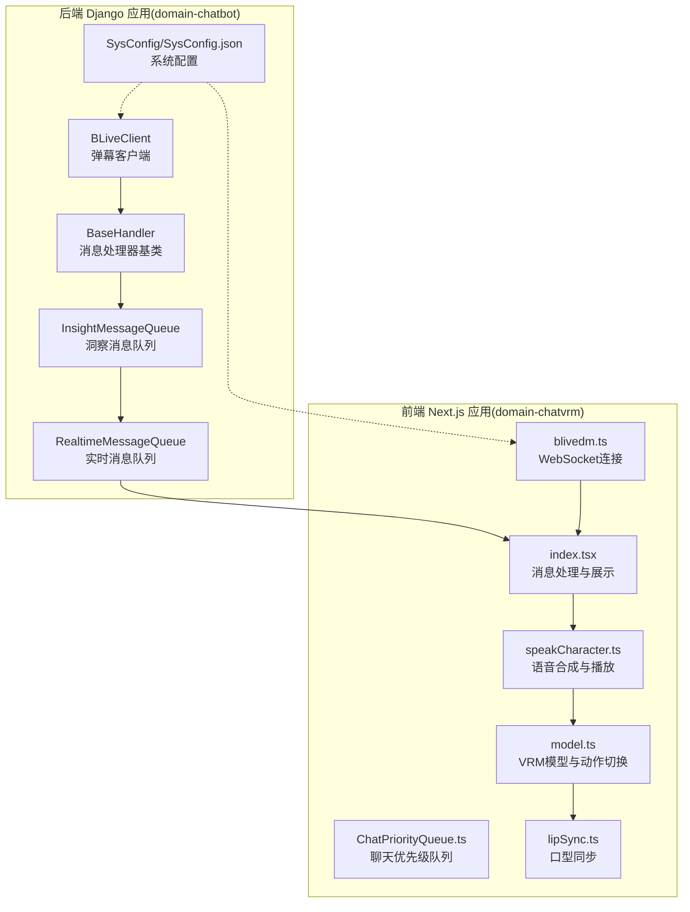
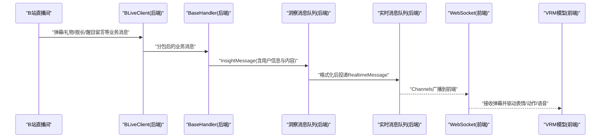
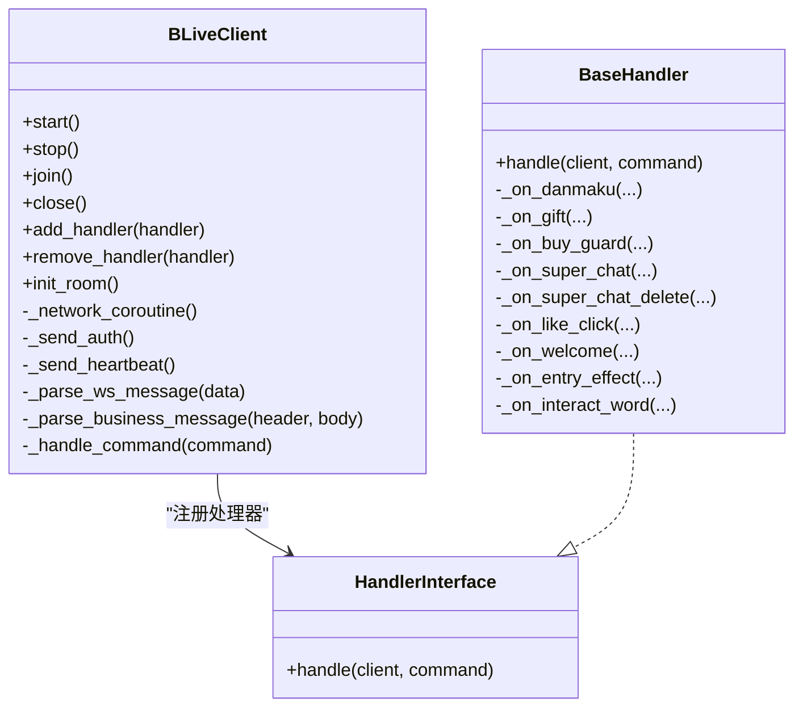
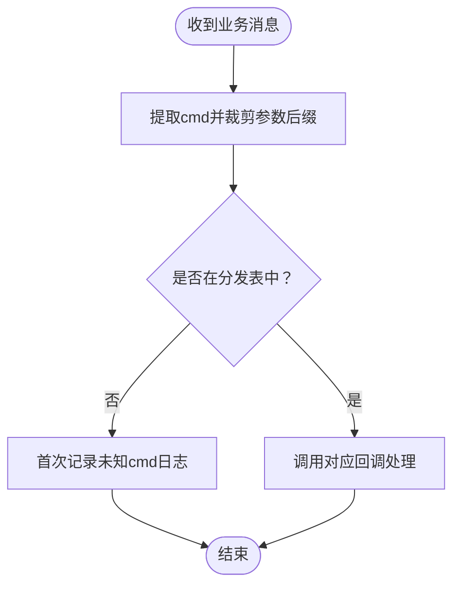
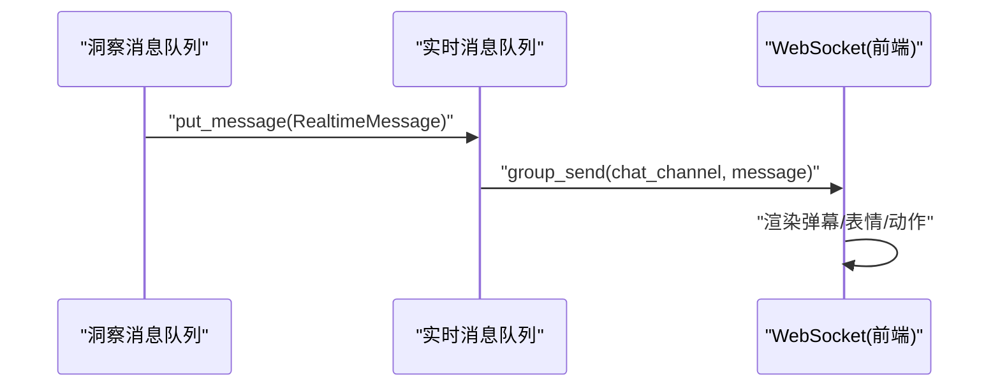
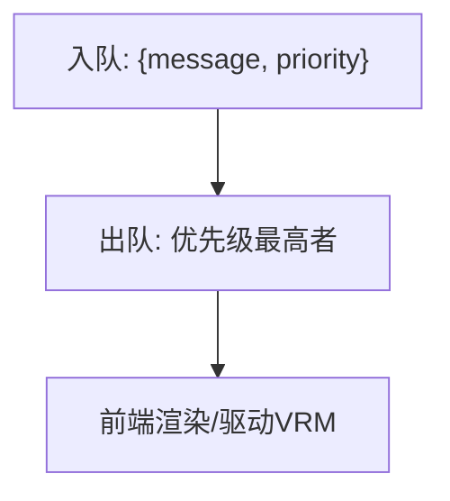
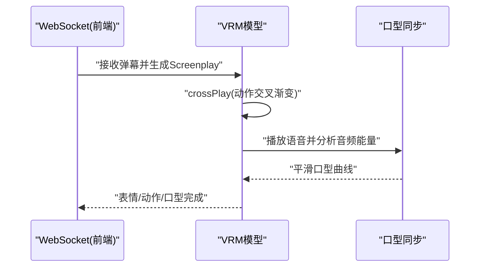
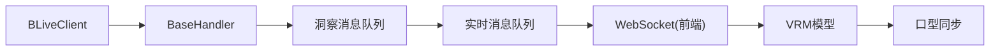

# 直播集成系统

<cite>
**本文引用的文件**
- [domain-chatbot/apps/chatbot/insight/bilibili/sdk/client.py](file://domain-chatbot/apps/chatbot/insight/bilibili/sdk/client.py)
- [domain-chatbot/apps/chatbot/insight/bilibili/sdk/handlers.py](file://domain-chatbot/apps/chatbot/insight/bilibili/sdk/handlers.py)
- [domain-chatbot/apps/chatbot/insight/bilibili/sdk/models.py](file://domain-chatbot/apps/chatbot/insight/bilibili/sdk/models.py)
- [domain-chatbot/apps/chatbot/insight/bilibili_api/bili_live_client.py](file://domain-chatbot/apps/chatbot/insight/bilibili_api/bili_live_client.py)
- [domain-chatbot/apps/chatbot/insight/insight_message_queue.py](file://domain-chatbot/apps/chatbot/insight/insight_message_queue.py)
- [domain-chatbot/apps/chatbot/output/realtime_message_queue.py](file://domain-chatbot/apps/chatbot/output/realtime_message_queue.py)
- [domain-chatbot/apps/chatbot/config/sys_config.py](file://domain-chatbot/apps/chatbot/config/sys_config.py)
- [domain-chatbot/apps/chatbot/config/sys_config.json](file://domain-chatbot/apps/chatbot/config/sys_config.json)
- [domain-chatbot/apps/chatbot/utils/chat_message_utils.py](file://domain-chatbot/apps/chatbot/utils/chat_message_utils.py)
- [domain-chatvrm/src/features/blivedm/blivedm.ts](file://domain-chatvrm/src/features/blivedm/blivedm.ts)
- [domain-chatvrm/src/features/queue/ChatPriorityQueue.ts](file://domain-chatvrm/src/features/queue/ChatPriorityQueue.ts)
- [domain-chatvrm/src/pages/index.tsx](file://domain-chatvrm/src/pages/index.tsx)
- [domain-chatvrm/src/features/messages/speakCharacter.ts](file://domain-chatvrm/src/features/messages/speakCharacter.ts)
- [domain-chatvrm/src/features/vrmViewer/model.ts](file://domain-chatvrm/src/features/vrmViewer/model.ts)
- [domain-chatvrm/src/features/lipSync/lipSync.ts](file://domain-chatvrm/src/features/lipSync/lipSync.ts)
</cite>

## 目录
1. [简介](#简介)
2. [项目结构](#项目结构)
3. [核心组件](#核心组件)
4. [架构总览](#架构总览)
5. [组件详解](#组件详解)
6. [依赖关系分析](#依赖关系分析)
7. [性能考量](#性能考量)
8. [故障排查指南](#故障排查指南)
9. [结论](#结论)
10. [附录](#附录)

## 简介
本技术文档面向开发者，提供直播集成系统的完整实现指南，重点围绕 blivedm 库的使用与二次封装、弹幕监听与连接管理、消息过滤机制、消息处理系统（消息队列、优先级调度、实时转发）、说话角色的动态切换与平滑过渡、聊天优先级队列、配置项、性能监控与错误处理策略，并给出实际使用示例、调试技巧与扩展开发指导。

## 项目结构
本项目由两部分组成：
- 后端 Django 应用（domain-chatbot）：负责直播弹幕接入、消息解析与转发、实时消息队列、LLM 对话与情感生成等。
- 前端 Next.js 应用（domain-chatvrm）：负责 WebSocket 连接、弹幕消息接收、角色动画与口型同步、语音合成与播放、表情与动作控制。

图表来源
- [domain-chatbot/apps/chatbot/insight/bilibili/sdk/client.py](file://domain-chatbot/apps/chatbot/insight/bilibili/sdk/client.py#L87-L610)
- [domain-chatbot/apps/chatbot/insight/bilibili/sdk/handlers.py](file://domain-chatbot/apps/chatbot/insight/bilibili/sdk/handlers.py#L45-L190)
- [domain-chatbot/apps/chatbot/insight/insight_message_queue.py](file://domain-chatbot/apps/chatbot/insight/insight_message_queue.py#L1-L83)
- [domain-chatbot/apps/chatbot/output/realtime_message_queue.py](file://domain-chatbot/apps/chatbot/output/realtime_message_queue.py#L1-L107)
- [domain-chatbot/apps/chatbot/config/sys_config.py](file://domain-chatbot/apps/chatbot/config/sys_config.py#L32-L208)
- [domain-chatbot/apps/chatbot/config/sys_config.json](file://domain-chatbot/apps/chatbot/config/sys_config.json#L1-L60)
- [domain-chatvrm/src/features/blivedm/blivedm.ts](file://domain-chatvrm/src/features/blivedm/blivedm.ts#L15-L32)
- [domain-chatvrm/src/features/queue/ChatPriorityQueue.ts](file://domain-chatvrm/src/features/queue/ChatPriorityQueue.ts#L1-L17)
- [domain-chatvrm/src/pages/index.tsx](file://domain-chatvrm/src/pages/index.tsx#L166-L197)
- [domain-chatvrm/src/features/messages/speakCharacter.ts](file://domain-chatvrm/src/features/messages/speakCharacter.ts#L11-L51)
- [domain-chatvrm/src/features/vrmViewer/model.ts](file://domain-chatvrm/src/features/vrmViewer/model.ts#L78-L119)
- [domain-chatvrm/src/features/lipSync/lipSync.ts](file://domain-chatvrm/src/features/lipSync/lipSync.ts#L1-L53)

章节来源
- [domain-chatbot/apps/chatbot/insight/bilibili/sdk/client.py](file://domain-chatbot/apps/chatbot/insight/bilibili/sdk/client.py#L87-L610)
- [domain-chatbot/apps/chatbot/insight/bilibili/sdk/handlers.py](file://domain-chatbot/apps/chatbot/insight/bilibili/sdk/handlers.py#L45-L190)
- [domain-chatbot/apps/chatbot/insight/insight_message_queue.py](file://domain-chatbot/apps/chatbot/insight/insight_message_queue.py#L1-L83)
- [domain-chatbot/apps/chatbot/output/realtime_message_queue.py](file://domain-chatbot/apps/chatbot/output/realtime_message_queue.py#L1-L107)
- [domain-chatbot/apps/chatbot/config/sys_config.py](file://domain-chatbot/apps/chatbot/config/sys_config.py#L32-L208)
- [domain-chatbot/apps/chatbot/config/sys_config.json](file://domain-chatbot/apps/chatbot/config/sys_config.json#L1-L60)
- [domain-chatvrm/src/features/blivedm/blivedm.ts](file://domain-chatvrm/src/features/blivedm/blivedm.ts#L15-L32)
- [domain-chatvrm/src/features/queue/ChatPriorityQueue.ts](file://domain-chatvrm/src/features/queue/ChatPriorityQueue.ts#L1-L17)
- [domain-chatvrm/src/pages/index.tsx](file://domain-chatvrm/src/pages/index.tsx#L166-L197)
- [domain-chatvrm/src/features/messages/speakCharacter.ts](file://domain-chatvrm/src/features/messages/speakCharacter.ts#L11-L51)
- [domain-chatvrm/src/features/vrmViewer/model.ts](file://domain-chatvrm/src/features/vrmViewer/model.ts#L78-L119)
- [domain-chatvrm/src/features/lipSync/lipSync.ts](file://domain-chatvrm/src/features/lipSync/lipSync.ts#L1-L53)

## 核心组件
- 弹幕客户端与连接管理：基于 blivedm 的 BLiveClient 实现房间初始化、认证、心跳、重连与消息分包处理。
- 消息处理器与过滤：通过 BaseHandler 提供统一的消息分发与过滤，支持心跳、弹幕、礼物、舰长、醒目留言、点赞、入场特效、互动等。
- 消息模型：DanmakuMessage、GiftMessage、GuardBuyMessage、SuperChatMessage、LikeInfoV3ClickMessage、EntryEffectMessage、InteractWordMessage 等数据结构。
- 洞察消息队列：从直播源接收消息，格式化后投递至实时消息队列并触发对话流程。
- 实时消息队列：线程安全队列，将消息通过 Channels 广播到前端。
- 前端 WebSocket 连接：建立与后端的实时通信，接收弹幕并驱动 VRM 表情与动作。
- 优先级队列：前端聊天优先级队列用于调度不同来源的消息。
- 角色切换与平滑过渡：VRM 动作切换采用交叉渐变，口型同步基于音频能量平滑曲线。

章节来源
- [domain-chatbot/apps/chatbot/insight/bilibili/sdk/client.py](file://domain-chatbot/apps/chatbot/insight/bilibili/sdk/client.py#L87-L610)
- [domain-chatbot/apps/chatbot/insight/bilibili/sdk/handlers.py](file://domain-chatbot/apps/chatbot/insight/bilibili/sdk/handlers.py#L45-L190)
- [domain-chatbot/apps/chatbot/insight/bilibili/sdk/models.py](file://domain-chatbot/apps/chatbot/insight/bilibili/sdk/models.py#L16-L441)
- [domain-chatbot/apps/chatbot/insight/insight_message_queue.py](file://domain-chatbot/apps/chatbot/insight/insight_message_queue.py#L1-L83)
- [domain-chatbot/apps/chatbot/output/realtime_message_queue.py](file://domain-chatbot/apps/chatbot/output/realtime_message_queue.py#L1-L107)
- [domain-chatvrm/src/features/blivedm/blivedm.ts](file://domain-chatvrm/src/features/blivedm/blivedm.ts#L15-L32)
- [domain-chatvrm/src/features/queue/ChatPriorityQueue.ts](file://domain-chatvrm/src/features/queue/ChatPriorityQueue.ts#L1-L17)
- [domain-chatvrm/src/features/vrmViewer/model.ts](file://domain-chatvrm/src/features/vrmViewer/model.ts#L78-L119)
- [domain-chatvrm/src/features/lipSync/lipSync.ts](file://domain-chatvrm/src/features/lipSync/lipSync.ts#L1-L53)

## 架构总览
后端负责直播弹幕接入与消息处理，前端负责实时渲染与角色交互。两者通过 WebSocket 实时联动。

图表来源
- [domain-chatbot/apps/chatbot/insight/bilibili/sdk/client.py](file://domain-chatbot/apps/chatbot/insight/bilibili/sdk/client.py#L362-L430)
- [domain-chatbot/apps/chatbot/insight/bilibili/sdk/handlers.py](file://domain-chatbot/apps/chatbot/insight/bilibili/sdk/handlers.py#L124-L140)
- [domain-chatbot/apps/chatbot/insight/insight_message_queue.py](file://domain-chatbot/apps/chatbot/insight/insight_message_queue.py#L52-L70)
- [domain-chatbot/apps/chatbot/output/realtime_message_queue.py](file://domain-chatbot/apps/chatbot/output/realtime_message_queue.py#L54-L68)
- [domain-chatvrm/src/features/blivedm/blivedm.ts](file://domain-chatvrm/src/features/blivedm/blivedm.ts#L15-L32)

## 组件详解

### 弹幕监听与连接管理（BLiveClient）
- 房间初始化：通过房间信息与弹幕服务器配置接口获取真实房间 ID、短 ID、主播 UID 与服务器列表。
- 认证与心跳：发送认证包并通过定时器周期发送心跳包维持连接。
- 重连与异常处理：网络异常、认证失败、SSL 错误等场景下的重连与降级策略。
- 消息分包与解压：对压缩与非压缩消息分别处理，支持多包合并解析。

图表来源
- [domain-chatbot/apps/chatbot/insight/bilibili/sdk/client.py](file://domain-chatbot/apps/chatbot/insight/bilibili/sdk/client.py#L87-L610)
- [domain-chatbot/apps/chatbot/insight/bilibili/sdk/handlers.py](file://domain-chatbot/apps/chatbot/insight/bilibili/sdk/handlers.py#L45-L190)

章节来源
- [domain-chatbot/apps/chatbot/insight/bilibili/sdk/client.py](file://domain-chatbot/apps/chatbot/insight/bilibili/sdk/client.py#L250-L430)
- [domain-chatbot/apps/chatbot/insight/bilibili/sdk/handlers.py](file://domain-chatbot/apps/chatbot/insight/bilibili/sdk/handlers.py#L124-L140)

### 消息过滤机制（BaseHandler）
- 常见可忽略命令集合：如热门榜单、直播状态、公告等高频但低价值事件。
- 命令分发表：将不同 cmd 映射到对应回调，未识别命令仅首次记录日志。
- 回调扩展：子类只需覆盖对应回调方法即可实现自定义处理。

图表来源
- [domain-chatbot/apps/chatbot/insight/bilibili/sdk/handlers.py](file://domain-chatbot/apps/chatbot/insight/bilibili/sdk/handlers.py#L124-L140)

章节来源
- [domain-chatbot/apps/chatbot/insight/bilibili/sdk/handlers.py](file://domain-chatbot/apps/chatbot/insight/bilibili/sdk/handlers.py#L15-L122)

### 消息处理系统（洞察消息队列与实时消息队列）
- 洞察消息队列：接收来自直播源的消息，格式化用户输入文本，投递到实时消息队列，并触发对话流程。
- 实时消息队列：线程安全队列，通过 Channels 广播到前端聊天通道，支持表情与动作扩展字段。

图表来源
- [domain-chatbot/apps/chatbot/insight/insight_message_queue.py](file://domain-chatbot/apps/chatbot/insight/insight_message_queue.py#L52-L70)
- [domain-chatbot/apps/chatbot/output/realtime_message_queue.py](file://domain-chatbot/apps/chatbot/output/realtime_message_queue.py#L54-L68)

章节来源
- [domain-chatbot/apps/chatbot/insight/insight_message_queue.py](file://domain-chatbot/apps/chatbot/insight/insight_message_queue.py#L47-L70)
- [domain-chatbot/apps/chatbot/output/realtime_message_queue.py](file://domain-chatbot/apps/chatbot/output/realtime_message_queue.py#L49-L95)

### 聊天优先级队列（前端）
- 数据结构：使用 js-priority-queue，按优先级调度消息。
- 适用场景：当多路输入（弹幕、系统提示、运营消息）同时到达时，确保重要消息优先展示。

图表来源
- [domain-chatvrm/src/features/queue/ChatPriorityQueue.ts](file://domain-chatvrm/src/features/queue/ChatPriorityQueue.ts#L1-L17)

章节来源
- [domain-chatvrm/src/features/queue/ChatPriorityQueue.ts](file://domain-chatvrm/src/features/queue/ChatPriorityQueue.ts#L1-L17)

### 说话角色的动态切换与平滑过渡
- WebSocket 连接：根据环境变量选择后端 API 地址，断线自动重连。
- 消息处理：前端接收弹幕后，生成口型同步与表情动作，必要时播放指定动作。
- 动作切换：采用交叉渐变 fadeOut/fadeIn，避免角色抖动。
- 语音合成：限制最小间隔，串行语音请求与播放，结束后恢复 neutral 表情。

图表来源
- [domain-chatvrm/src/features/blivedm/blivedm.ts](file://domain-chatvrm/src/features/blivedm/blivedm.ts#L15-L32)
- [domain-chatvrm/src/pages/index.tsx](file://domain-chatvrm/src/pages/index.tsx#L166-L197)
- [domain-chatvrm/src/features/vrmViewer/model.ts](file://domain-chatvrm/src/features/vrmViewer/model.ts#L78-L119)
- [domain-chatvrm/src/features/lipSync/lipSync.ts](file://domain-chatvrm/src/features/lipSync/lipSync.ts#L18-L49)
- [domain-chatvrm/src/features/messages/speakCharacter.ts](file://domain-chatvrm/src/features/messages/speakCharacter.ts#L11-L51)

章节来源
- [domain-chatvrm/src/features/blivedm/blivedm.ts](file://domain-chatvrm/src/features/blivedm/blivedm.ts#L15-L32)
- [domain-chatvrm/src/features/vrmViewer/model.ts](file://domain-chatvrm/src/features/vrmViewer/model.ts#L78-L119)
- [domain-chatvrm/src/features/lipSync/lipSync.ts](file://domain-chatvrm/src/features/lipSync/lipSync.ts#L1-L53)
- [domain-chatvrm/src/features/messages/speakCharacter.ts](file://domain-chatvrm/src/features/messages/speakCharacter.ts#L11-L51)

### 配置选项与系统集成
- 后端配置：直播开关、房间 ID、Cookie；代理配置；大模型与记忆模块配置。
- 前端配置：直播开关、房间 ID、Cookie 输入界面，保存到系统配置。
- 系统启动：懒加载直播监听器，线程池管理生命周期。

章节来源
- [domain-chatbot/apps/chatbot/config/sys_config.py](file://domain-chatbot/apps/chatbot/config/sys_config.py#L32-L208)
- [domain-chatbot/apps/chatbot/config/sys_config.json](file://domain-chatbot/apps/chatbot/config/sys_config.json#L1-L60)
- [domain-chatbot/apps/chatbot/insight/bilibili_api/bili_live_client.py](file://domain-chatbot/apps/chatbot/insight/bilibili_api/bili_live_client.py#L110-L139)

## 依赖关系分析
- 后端依赖：aiohttp、brotli、channels、asgiref，负责网络、压缩与实时通信。
- 前端依赖：js-priority-queue、events，负责消息优先级与事件派发。
- 模块耦合：BLiveClient 与 BaseHandler 通过接口解耦；消息队列通过 Channels 松耦合；前端通过 WebSocket 与后端解耦。

图表来源
- [domain-chatbot/apps/chatbot/insight/bilibili/sdk/client.py](file://domain-chatbot/apps/chatbot/insight/bilibili/sdk/client.py#L87-L610)
- [domain-chatbot/apps/chatbot/insight/bilibili/sdk/handlers.py](file://domain-chatbot/apps/chatbot/insight/bilibili/sdk/handlers.py#L45-L190)
- [domain-chatbot/apps/chatbot/insight/insight_message_queue.py](file://domain-chatbot/apps/chatbot/insight/insight_message_queue.py#L1-L83)
- [domain-chatbot/apps/chatbot/output/realtime_message_queue.py](file://domain-chatbot/apps/chatbot/output/realtime_message_queue.py#L1-L107)
- [domain-chatvrm/src/features/blivedm/blivedm.ts](file://domain-chatvrm/src/features/blivedm/blivedm.ts#L15-L32)

章节来源
- [domain-chatbot/apps/chatbot/insight/bilibili/sdk/client.py](file://domain-chatbot/apps/chatbot/insight/bilibili/sdk/client.py#L87-L610)
- [domain-chatbot/apps/chatbot/insight/bilibili/sdk/handlers.py](file://domain-chatbot/apps/chatbot/insight/bilibili/sdk/handlers.py#L45-L190)
- [domain-chatbot/apps/chatbot/insight/insight_message_queue.py](file://domain-chatbot/apps/chatbot/insight/insight_message_queue.py#L1-L83)
- [domain-chatbot/apps/chatbot/output/realtime_message_queue.py](file://domain-chatbot/apps/chatbot/output/realtime_message_queue.py#L1-L107)
- [domain-chatvrm/src/features/blivedm/blivedm.ts](file://domain-chatvrm/src/features/blivedm/blivedm.ts#L15-L32)

## 性能考量
- 网络与压缩：对压缩消息使用线程池解压，避免阻塞主循环；心跳与重连间隔合理设置，降低带宽与 CPU 占用。
- 队列与并发：后端使用线程安全队列与 Channels 广播，前端使用优先级队列保证关键消息优先；语音合成串行化，限制最小间隔，避免并发音频冲突。
- 前端渲染：动作切换采用交叉渐变，口型同步使用平滑曲线与缓动函数，提升观感稳定性。
- 日志与可观测：对未知命令仅首次记录日志，减少噪声；异常捕获与重试策略明确，便于定位问题。

## 故障排查指南
- 连接失败/认证失败：检查 Cookie 有效性与房间 ID；确认 SSL 配置；查看重连日志。
- 心跳异常：确认心跳间隔设置与服务器返回的人气值解析。
- 消息未显示：检查洞察消息队列与实时消息队列线程是否启动；确认 Channels 组名一致。
- 前端不渲染：确认 WebSocket 连接成功与消息通道订阅；检查表情/动作映射。
- 语音卡顿：检查 speakCharacter 的最小间隔与串行化逻辑；确认音频缓冲区与口型同步更新频率。

章节来源
- [domain-chatbot/apps/chatbot/insight/bilibili/sdk/client.py](file://domain-chatbot/apps/chatbot/insight/bilibili/sdk/client.py#L410-L428)
- [domain-chatbot/apps/chatbot/insight/insight_message_queue.py](file://domain-chatbot/apps/chatbot/insight/insight_message_queue.py#L52-L70)
- [domain-chatbot/apps/chatbot/output/realtime_message_queue.py](file://domain-chatbot/apps/chatbot/output/realtime_message_queue.py#L54-L68)
- [domain-chatvrm/src/features/blivedm/blivedm.ts](file://domain-chatvrm/src/features/blivedm/blivedm.ts#L15-L32)
- [domain-chatvrm/src/features/messages/speakCharacter.ts](file://domain-chatvrm/src/features/messages/speakCharacter.ts#L11-L51)

## 结论
本直播集成系统通过 blivedm 客户端实现稳定的弹幕接入与消息分发，结合后端洞察与实时消息队列完成高效的消息处理与转发，前端通过 WebSocket 与 VRM 动画系统实现自然的表情、动作与口型同步。系统具备良好的扩展性与可维护性，适合在多角色、多场景的直播互动中部署与迭代。

## 附录

### 实际使用示例（步骤指引）
- 后端启用直播监听：在系统配置中开启直播开关与填写房间 ID、Cookie；调用懒加载函数启动监听器与线程池。
- 前端接入弹幕：根据环境变量选择后端 API，建立 WebSocket 连接；订阅聊天通道，接收消息并驱动 VRM。
- 消息处理：在前端页面中解析弹幕内容，生成表情与动作，触发语音合成与口型同步。
- 扩展开发：新增消息类型时，在后端 Handler 中添加回调并在前端队列中增加优先级策略。

章节来源
- [domain-chatbot/apps/chatbot/config/sys_config.py](file://domain-chatbot/apps/chatbot/config/sys_config.py#L110-L139)
- [domain-chatbot/apps/chatbot/insight/bilibili_api/bili_live_client.py](file://domain-chatbot/apps/chatbot/insight/bilibili_api/bili_live_client.py#L110-L139)
- [domain-chatvrm/src/features/blivedm/blivedm.ts](file://domain-chatvrm/src/features/blivedm/blivedm.ts#L15-L32)
- [domain-chatvrm/src/pages/index.tsx](file://domain-chatvrm/src/pages/index.tsx#L166-L197)

### 调试技巧
- 后端：开启 DEBUG 日志，关注未知命令与网络异常；检查队列线程状态。
- 前端：在浏览器控制台查看 WebSocket 连接状态与消息通道；逐步断点验证表情/动作/语音链路。
- 性能：监控心跳间隔与消息吞吐量，避免过度日志与重复渲染。

### 错误处理策略
- 连接异常：自动重连，指数退避与最大重试次数控制。
- 认证失败：重新初始化房间与令牌，必要时提示用户更新 Cookie。
- 消息解析：对异常包进行日志记录与丢弃，不影响整体流程。
- 前端渲染：对空内容与重复内容进行过滤，避免无效渲染。