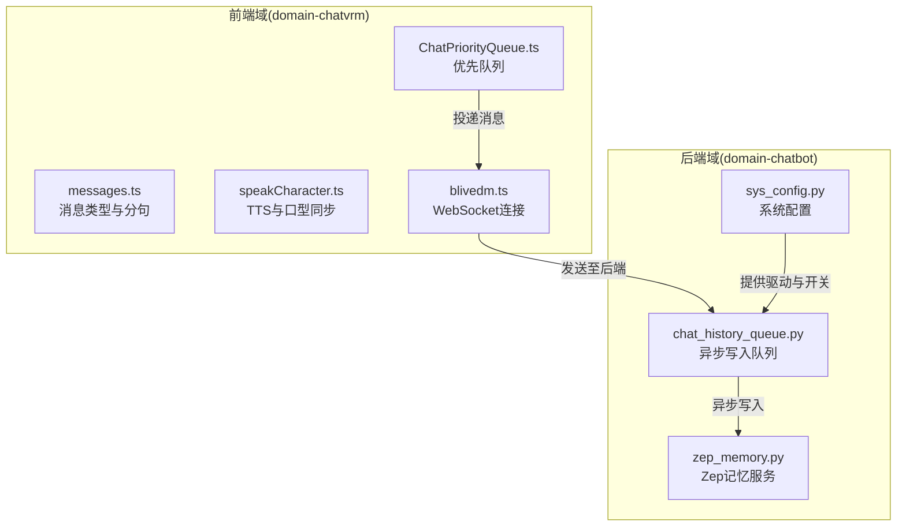
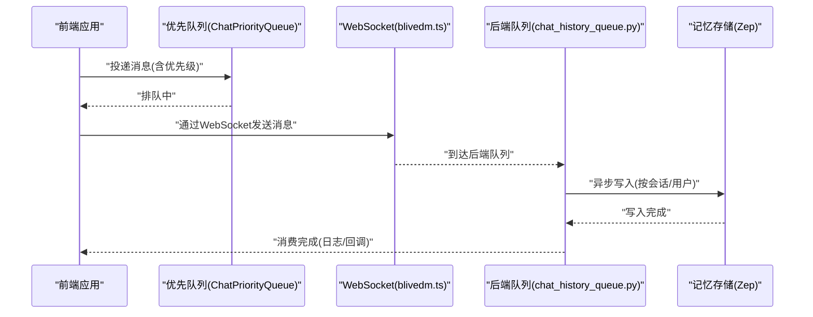
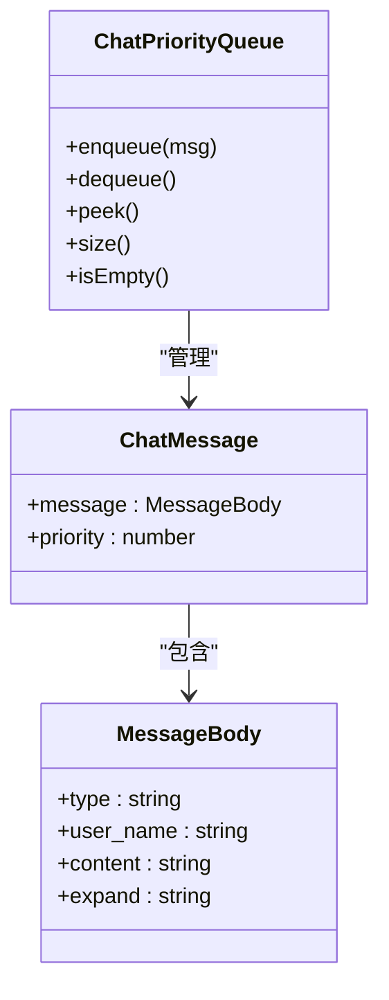
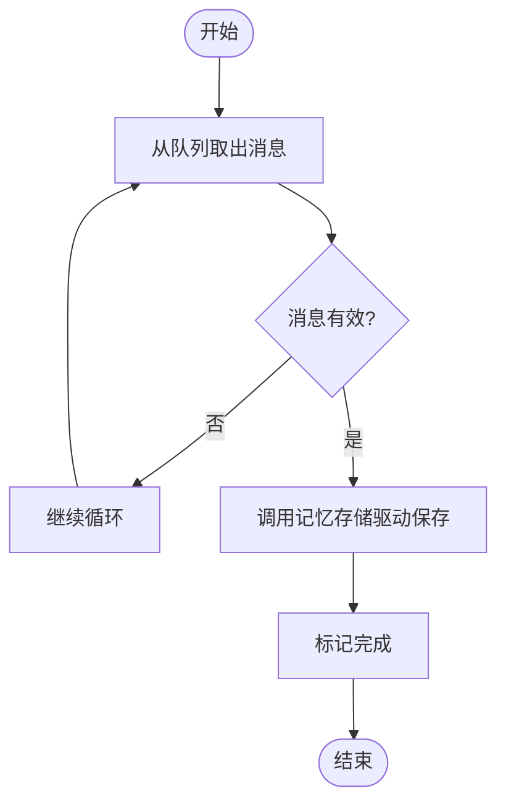
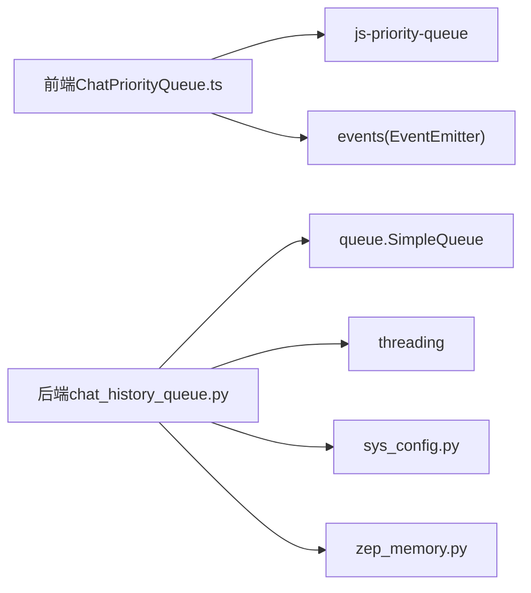

# 聊天优先级队列

<cite>
**本文引用的文件**
- [domain-chatbot/apps/chatbot/chat/chat_history_queue.py](file://domain-chatbot/apps/chatbot/chat/chat_history_queue.py)
- [domain-chatbot/apps/chatbot/memory/zep/zep_memory.py](file://domain-chatbot/apps/chatbot/memory/zep/zep_memory.py)
- [domain-chatbot/apps/chatbot/config/sys_config.py](file://domain-chatbot/apps/chatbot/config/sys_config.py)
- [domain-chatvrm/src/features/queue/ChatPriorityQueue.ts](file://domain-chatvrm/src/features/queue/ChatPriorityQueue.ts)
- [domain-chatvrm/src/features/messages/messages.ts](file://domain-chatvrm/src/features/messages/messages.ts)
- [domain-chatvrm/src/features/messages/speakCharacter.ts](file://domain-chatvrm/src/features/messages/speakCharacter.ts)
- [domain-chatvrm/src/features/blivedm/blivedm.ts](file://domain-chatvrm/src/features/blivedm/blivedm.ts)
- [domain-chatvrm/src/pages/api/chat.ts](file://domain-chatvrm/src/pages/api/chat.ts)
</cite>

## 目录
1. [引言](#引言)
2. [项目结构](#项目结构)
3. [核心组件](#核心组件)
4. [架构总览](#架构总览)
5. [详细组件分析](#详细组件分析)
6. [依赖分析](#依赖分析)
7. [性能考虑](#性能考虑)
8. [故障排查指南](#故障排查指南)
9. [结论](#结论)
10. [附录](#附录)

## 引言
本技术文档围绕“聊天优先级队列”展开，目标是为开发者提供一套完整、可操作的实现与优化建议。文档将从设计理念、实现原理、数据结构与算法、容量与超时管理、内存优化、调度公平性与饥饿避免、状态管理与异常处理、性能监控与调优、扩展接口以及实际使用示例等方面进行系统化阐述。  
本仓库中存在两条与“聊天优先级队列”相关的关键路径：
- 前端（React/Next.js）侧：基于第三方优先队列库的聊天消息优先级队列实现。
- 后端（Django）侧：用于异步持久化聊天历史的记忆写入队列。

由于后端侧未实现“优先级比较器”或“去重/容量/超时/公平性”等高级特性，本文将以前端优先队列为基准，结合后端队列的异步写入能力，给出统一的架构建议与最佳实践。

## 项目结构
本项目由三个主要子域构成：
- domain-chatbot：后端服务，负责对话、记忆、LLM 等业务逻辑，包含聊天历史写入队列与记忆存储。
- domain-chatvrm：前端交互域，负责 VRM 动画、TTS、表情控制与聊天消息的优先级调度。
- infrastructure-*：网关与打包部署相关配置。

图表来源
- [domain-chatvrm/src/features/queue/ChatPriorityQueue.ts](file://domain-chatvrm/src/features/queue/ChatPriorityQueue.ts#L1-L17)
- [domain-chatvrm/src/features/messages/messages.ts](file://domain-chatvrm/src/features/messages/messages.ts#L1-L80)
- [domain-chatvrm/src/features/messages/speakCharacter.ts](file://domain-chatvrm/src/features/messages/speakCharacter.ts#L1-L82)
- [domain-chatvrm/src/features/blivedm/blivedm.ts](file://domain-chatvrm/src/features/blivedm/blivedm.ts#L1-L32)
- [domain-chatbot/apps/chatbot/chat/chat_history_queue.py](file://domain-chatbot/apps/chatbot/chat/chat_history_queue.py#L1-L119)
- [domain-chatbot/apps/chatbot/memory/zep/zep_memory.py](file://domain-chatbot/apps/chatbot/memory/zep/zep_memory.py#L82-L168)
- [domain-chatbot/apps/chatbot/config/sys_config.py](file://domain-chatbot/apps/chatbot/config/sys_config.py#L1-L208)

章节来源
- [domain-chatvrm/src/features/queue/ChatPriorityQueue.ts](file://domain-chatvrm/src/features/queue/ChatPriorityQueue.ts#L1-L17)
- [domain-chatbot/apps/chatbot/chat/chat_history_queue.py](file://domain-chatbot/apps/chatbot/chat/chat_history_queue.py#L1-L119)

## 核心组件
- 前端优先队列（ChatPriorityQueue）
  - 使用第三方优先队列库，以“优先级数值越小优先级越高”的方式组织消息。
  - 消息体包含类型、用户名、内容与扩展字段，便于后续路由与处理。
- 后端异步写入队列（SimpleQueue + 后台线程）
  - 通过 SimpleQueue 实现线程安全的消息传递；后台线程循环消费消息并写入记忆存储。
  - 支持未来扩展“优先级比较器”“去重”“容量限制”“超时淘汰”等高级特性。
- 记忆存储（Zep）
  - 提供用户、会话、记忆列表的增删查能力，支持按会话拉取最近记忆。
- 配置系统（SysConfig）
  - 提供长期记忆开关、摘要开关、反射开关、LLM 驱动选择等全局配置项，影响记忆写入策略。

章节来源
- [domain-chatvrm/src/features/queue/ChatPriorityQueue.ts](file://domain-chatvrm/src/features/queue/ChatPriorityQueue.ts#L1-L17)
- [domain-chatbot/apps/chatbot/chat/chat_history_queue.py](file://domain-chatbot/apps/chatbot/chat/chat_history_queue.py#L1-L119)
- [domain-chatbot/apps/chatbot/memory/zep/zep_memory.py](file://domain-chatbot/apps/chatbot/memory/zep/zep_memory.py#L82-L168)
- [domain-chatbot/apps/chatbot/config/sys_config.py](file://domain-chatbot/apps/chatbot/config/sys_config.py#L32-L51)

## 架构总览
下图展示了从前端消息投递到后端异步写入的整体流程，以及与记忆存储的交互。

图表来源
- [domain-chatvrm/src/features/queue/ChatPriorityQueue.ts](file://domain-chatvrm/src/features/queue/ChatPriorityQueue.ts#L1-L17)
- [domain-chatvrm/src/features/blivedm/blivedm.ts](file://domain-chatvrm/src/features/blivedm/blivedm.ts#L15-L31)
- [domain-chatbot/apps/chatbot/chat/chat_history_queue.py](file://domain-chatbot/apps/chatbot/chat/chat_history_queue.py#L38-L52)
- [domain-chatbot/apps/chatbot/memory/zep/zep_memory.py](file://domain-chatbot/apps/chatbot/memory/zep/zep_memory.py#L105-L159)

## 详细组件分析

### 组件一：前端优先队列（ChatPriorityQueue）
- 设计理念
  - 以“优先级数值越小优先级越高”作为排序准则，便于业务侧灵活分配权重。
  - 消息体包含类型、用户名、内容与扩展字段，满足多场景路由与处理需求。
- 数据结构与复杂度
  - 基于第三方优先队列库，插入与弹出的时间复杂度通常为 O(log n)，适合高频消息场景。
- 排序算法
  - 通过 comparator(a, b) => a.priority - b.priority 实现升序优先级排序。
- 去重机制
  - 当前实现未内置去重逻辑，建议在上层业务或队列封装中增加“消息指纹”去重。
- 容量管理
  - 当前实现未内置容量上限，建议引入最大长度限制与“尾部淘汰”策略。
- 超时处理
  - 当前实现未内置消息超时淘汰，建议增加 TTL 字段与定时清理任务。
- 内存优化
  - 对重复内容进行归并或压缩，减少冗余；对长文本进行分片处理。
- 公平性与饥饿避免
  - 可引入“老化因子”或“优先级回退”，确保低优先级消息最终被处理。
- 状态管理与异常处理
  - 建议增加队列状态（运行/暂停）、统计指标（入队/出队/丢弃/延迟）与错误上报。
- 扩展接口
  - 提供“批量投递”“优先级调整”“消息过滤”“回调钩子”等扩展点。

图表来源
- [domain-chatvrm/src/features/queue/ChatPriorityQueue.ts](file://domain-chatvrm/src/features/queue/ChatPriorityQueue.ts#L1-L17)

章节来源
- [domain-chatvrm/src/features/queue/ChatPriorityQueue.ts](file://domain-chatvrm/src/features/queue/ChatPriorityQueue.ts#L1-L17)

### 组件二：后端异步写入队列（chat_history_queue.py）
- 设计理念
  - 使用线程安全的 SimpleQueue 作为消息通道，后台线程持续消费并写入记忆存储。
- 处理逻辑
  - 循环阻塞式获取消息，调用记忆存储驱动保存，异常时打印堆栈但不中断线程。
- 去重机制
  - 当前未实现去重，建议在消息体中加入唯一标识并在入队前检查。
- 容量管理
  - SimpleQueue 无显式容量限制，建议在上层加限流或背压策略。
- 超时处理
  - 未内置超时淘汰，建议增加消息 TTL 与过期清理。
- 内存优化
  - 将消息序列化为字典后再入队，减少对象引用开销。
- 公平性与饥饿避免
  - 顺序消费，无优先级调度；建议引入优先级比较器与公平轮转。
- 状态管理与异常处理
  - 已有异常捕获与日志输出，建议增加队列状态监控与重试策略。
- 扩展接口
  - 可扩展为带优先级的队列，支持动态优先级调整与批量处理。

图表来源
- [domain-chatbot/apps/chatbot/chat/chat_history_queue.py](file://domain-chatbot/apps/chatbot/chat/chat_history_queue.py#L42-L52)

章节来源
- [domain-chatbot/apps/chatbot/chat/chat_history_queue.py](file://domain-chatbot/apps/chatbot/chat/chat_history_queue.py#L1-L119)

### 组件三：记忆存储（Zep）
- 能力概述
  - 用户查询/创建、会话查询/创建、记忆追加与最近 N 条拉取。
- 使用要点
  - 在写入前检查用户与会话是否存在，缺失则先初始化。
  - 最近记忆列表需反转以保证时间顺序正确。

章节来源
- [domain-chatbot/apps/chatbot/memory/zep/zep_memory.py](file://domain-chatbot/apps/chatbot/memory/zep/zep_memory.py#L82-L168)

### 组件四：系统配置（SysConfig）
- 关键配置项
  - enable_summary、enable_longMemory、enable_reflection 等，决定记忆写入策略与是否启用摘要/长期记忆/反思。
- 作用范围
  - 影响后端队列写入行为与记忆存储的调用策略。

章节来源
- [domain-chatbot/apps/chatbot/config/sys_config.py](file://domain-chatbot/apps/chatbot/config/sys_config.py#L32-L51)

## 依赖分析
- 前端依赖
  - js-priority-queue：提供优先队列实现。
  - events：提供事件发射器能力（可用于扩展状态通知）。
- 后端依赖
  - queue.SimpleQueue：线程安全队列。
  - threading：后台线程执行。
  - 自定义记忆存储驱动：通过配置注入。

图表来源
- [domain-chatvrm/src/features/queue/ChatPriorityQueue.ts](file://domain-chatvrm/src/features/queue/ChatPriorityQueue.ts#L1-L2)
- [domain-chatbot/apps/chatbot/chat/chat_history_queue.py](file://domain-chatbot/apps/chatbot/chat/chat_history_queue.py#L1-L8)
- [domain-chatbot/apps/chatbot/config/sys_config.py](file://domain-chatbot/apps/chatbot/config/sys_config.py#L1-L9)
- [domain-chatbot/apps/chatbot/memory/zep/zep_memory.py](file://domain-chatbot/apps/chatbot/memory/zep/zep_memory.py#L1-L10)

章节来源
- [domain-chatvrm/src/features/queue/ChatPriorityQueue.ts](file://domain-chatvrm/src/features/queue/ChatPriorityQueue.ts#L1-L17)
- [domain-chatbot/apps/chatbot/chat/chat_history_queue.py](file://domain-chatbot/apps/chatbot/chat/chat_history_queue.py#L1-L119)

## 性能考虑
- 前端优先队列
  - 采用第三方库保证稳定性；建议在高频场景下合并小消息、限制最大长度、增加批量出队。
  - 为消息体增加“去重指纹”字段，避免重复消息进入队列。
- 后端异步写入
  - 使用后台线程避免阻塞主线程；建议引入优先级比较器与公平轮转，防止高优先级消息饿死低优先级。
  - 增加容量上限与超时淘汰，防止队列无限增长导致内存压力。
  - 对写入失败进行指数退避重试与告警上报。
- 记忆存储
  - 按会话批量写入，减少网络往返；对最近记忆列表进行缓存与增量更新。
- 配置与策略
  - 通过 SysConfig 控制是否启用摘要/长期记忆/反思，平衡吞吐与质量。

[本节为通用性能建议，无需特定文件引用]

## 故障排查指南
- 前端消息未被处理
  - 检查优先队列是否正常投递、WebSocket 连接是否稳定、后端是否启动。
- 后端队列堆积
  - 查看后台线程是否存活、异常日志、磁盘/网络是否可用。
- 记忆写入失败
  - 检查 Zep 服务连通性、用户/会话是否存在、请求格式是否正确。
- 配置问题
  - 确认 SysConfig 中的记忆开关与 LLM 驱动配置是否正确。

章节来源
- [domain-chatvrm/src/features/blivedm/blivedm.ts](file://domain-chatvrm/src/features/blivedm/blivedm.ts#L15-L31)
- [domain-chatbot/apps/chatbot/chat/chat_history_queue.py](file://domain-chatbot/apps/chatbot/chat/chat_history_queue.py#L42-L52)
- [domain-chatbot/apps/chatbot/memory/zep/zep_memory.py](file://domain-chatbot/apps/chatbot/memory/zep/zep_memory.py#L82-L168)

## 结论
本项目在前端实现了基于优先级的消息队列，在后端实现了异步写入队列与记忆存储。当前后端队列尚未实现优先级、去重、容量与超时等高级特性，建议在此基础上进行增强，以满足高并发、低延迟、可扩展的聊天优先级调度需求。通过合理的配置与监控，可进一步提升系统的稳定性与用户体验。

[本节为总结性内容，无需特定文件引用]

## 附录

### 实际使用示例（步骤说明）
- 前端投递消息
  - 在业务层构造消息体，设置优先级，调用优先队列入队。
- 后端接收与写入
  - WebSocket 接收消息后入队，后台线程循环消费并调用记忆存储驱动保存。
- 记忆检索
  - 按用户/会话 ID 拉取最近 N 条记忆，用于上下文构建。

章节来源
- [domain-chatvrm/src/features/queue/ChatPriorityQueue.ts](file://domain-chatvrm/src/features/queue/ChatPriorityQueue.ts#L1-L17)
- [domain-chatvrm/src/features/blivedm/blivedm.ts](file://domain-chatvrm/src/features/blivedm/blivedm.ts#L15-L31)
- [domain-chatbot/apps/chatbot/chat/chat_history_queue.py](file://domain-chatbot/apps/chatbot/chat/chat_history_queue.py#L38-L52)
- [domain-chatbot/apps/chatbot/memory/zep/zep_memory.py](file://domain-chatbot/apps/chatbot/memory/zep/zep_memory.py#L111-L168)

### 性能测试建议
- 前端
  - 测试不同优先级分布下的平均延迟、吞吐量与内存占用。
- 后端
  - 测试队列长度与写入延迟的关系，评估批处理与重试策略的效果。
- 记忆存储
  - 测试按会话写入与读取的 RTT 与成功率。

[本节为通用测试建议，无需特定文件引用]

### 扩展接口建议
- 前端
  - 批量投递、优先级调整、消息过滤、回调钩子、状态订阅。
- 后端
  - 优先级比较器、去重策略、容量限制、超时淘汰、重试与熔断、统计指标导出。

[本节为通用扩展建议，无需特定文件引用]