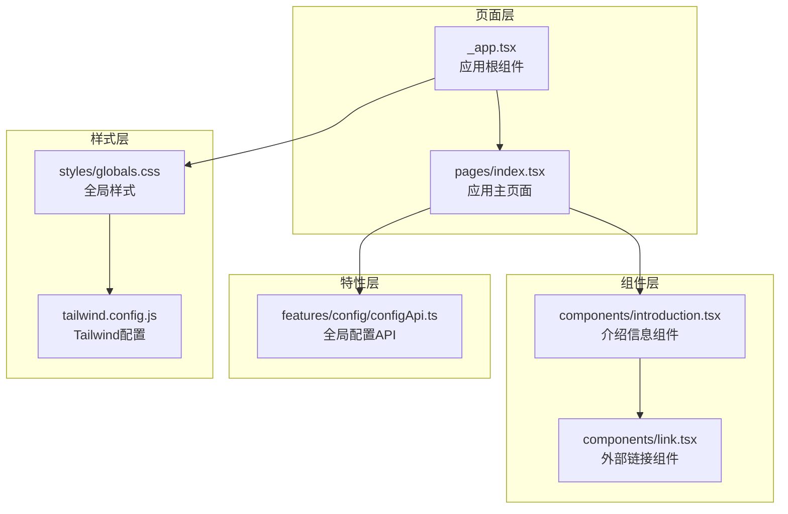
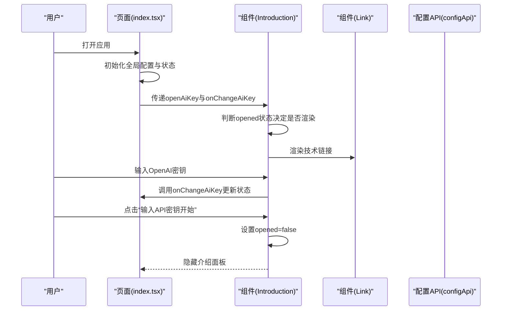
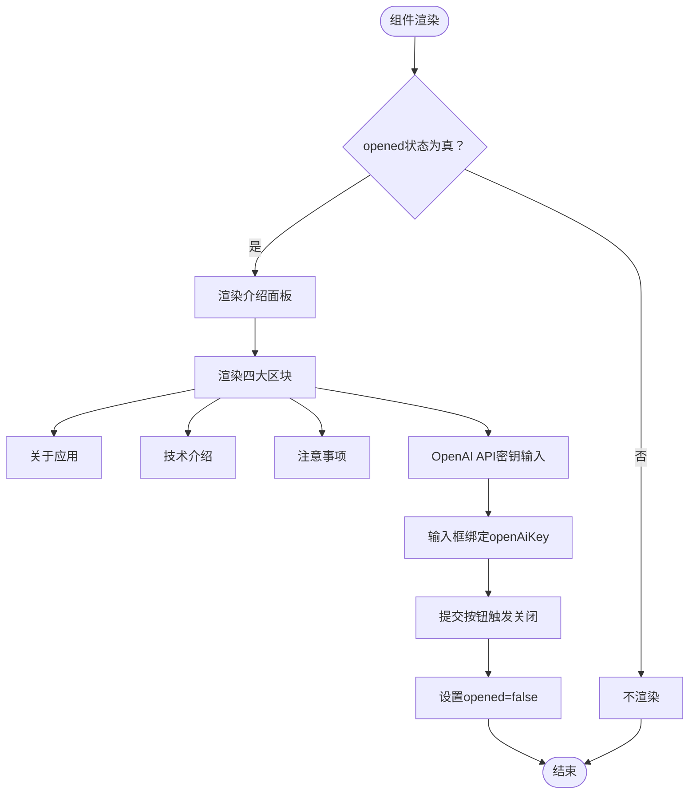
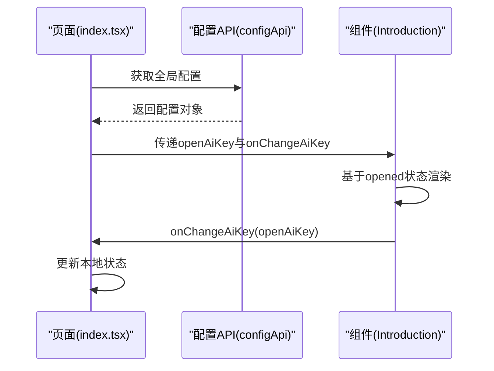
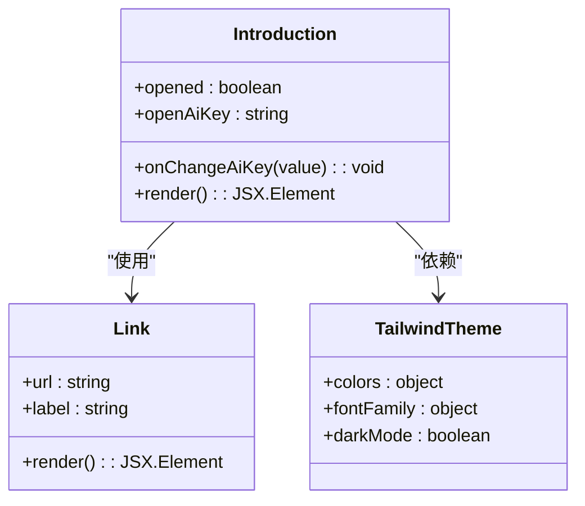
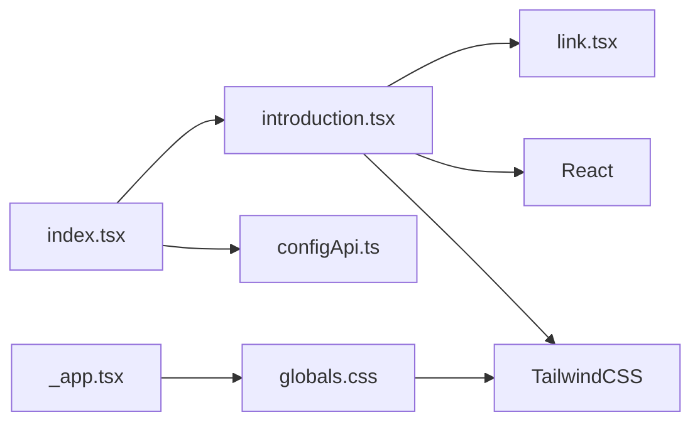

# 介绍信息组件

<cite>
**本文档引用的文件**
- [introduction.tsx](file://domain-chatvrm/src/components/introduction.tsx)
- [index.tsx](file://domain-chatvrm/src/pages/index.tsx)
- [link.tsx](file://domain-chatvrm/src/components/link.tsx)
- [configApi.ts](file://domain-chatvrm/src/features/config/configApi.ts)
- [globals.css](file://domain-chatvrm/src/styles/globals.css)
- [tailwind.config.js](file://domain-chatvrm/src/tailwind.config.js)
- [package.json](file://domain-chatvrm/package.json)
- [_app.tsx](file://domain-chatvrm/src/pages/_app.tsx)
- [next.config.js](file://domain-chatvrm/next.config.js)
</cite>

## 目录
1. [简介](#简介)
2. [项目结构](#项目结构)
3. [核心组件](#核心组件)
4. [架构总览](#架构总览)
5. [详细组件分析](#详细组件分析)
6. [依赖关系分析](#依赖关系分析)
7. [性能考虑](#性能考虑)
8. [故障排除指南](#故障排除指南)
9. [结论](#结论)
10. [附录](#附录)

## 简介
本文件为“介绍信息组件”提供完整的UI组件文档。该组件用于在应用启动阶段展示欢迎信息、技术介绍、注意事项以及API密钥输入入口，承担用户首次交互的引导职责。文档涵盖组件角色定位、内容组织结构、动态内容加载机制、样式设计与视觉效果、属性接口、数据结构与配置管理、响应式设计与主题适配、国际化支持现状与扩展建议，以及组件集成示例与内容定制指导。

## 项目结构
介绍信息组件位于前端Next.js工程中，采用按功能分层的目录组织方式：页面入口负责全局状态与配置加载，组件层提供可复用UI部件，特性层封装业务API与配置管理，样式层通过TailwindCSS与Charcoal主题提供一致的设计系统。

图表来源
- [index.tsx](file://domain-chatvrm/src/pages/index.tsx#L1-L390)
- [introduction.tsx](file://domain-chatvrm/src/components/introduction.tsx#L1-L90)
- [link.tsx](file://domain-chatvrm/src/components/link.tsx#L1-L13)
- [configApi.ts](file://domain-chatvrm/src/features/config/configApi.ts#L1-L100)
- [globals.css](file://domain-chatvrm/src/styles/globals.css#L1-L190)
- [tailwind.config.js](file://domain-chatvrm/src/tailwind.config.js#L1-L39)
- [_app.tsx](file://domain-chatvrm/src/pages/_app.tsx#L1-L8)

章节来源
- [index.tsx](file://domain-chatvrm/src/pages/index.tsx#L1-L390)
- [introduction.tsx](file://domain-chatvrm/src/components/introduction.tsx#L1-L90)
- [link.tsx](file://domain-chatvrm/src/components/link.tsx#L1-L13)
- [configApi.ts](file://domain-chatvrm/src/features/config/configApi.ts#L1-L100)
- [globals.css](file://domain-chatvrm/src/styles/globals.css#L1-L190)
- [tailwind.config.js](file://domain-chatvrm/src/tailwind.config.js#L1-L39)
- [_app.tsx](file://domain-chatvrm/src/pages/_app.tsx#L1-L8)

## 核心组件
- 组件名称：Introduction（介绍信息组件）
- 角色定位：应用启动引导，提供应用概述、技术栈说明、使用注意事项与API密钥输入入口
- 功能要点：
  - 条件渲染：仅在未打开状态下显示，点击按钮关闭后不再显示
  - 内容组织：包含“关于应用”、“技术介绍”、“注意事项”、“OpenAI API密钥”四个区块
  - 动态内容：通过props接收OpenAI密钥值与变更回调，支持实时更新
  - 外部链接：使用Link组件承载外部技术文档与资源链接
  - 样式体系：基于TailwindCSS类名与Charcoal主题色板，具备深浅色主题支持

章节来源
- [introduction.tsx](file://domain-chatvrm/src/components/introduction.tsx#L1-L90)
- [link.tsx](file://domain-chatvrm/src/components/link.tsx#L1-L13)

## 架构总览
介绍信息组件在页面入口中被引入，并通过全局状态与配置API进行初始化与交互。其渲染受opened状态控制，内容通过props注入的openAiKey与onChangeAiKey进行双向绑定。

图表来源
- [index.tsx](file://domain-chatvrm/src/pages/index.tsx#L34-L390)
- [introduction.tsx](file://domain-chatvrm/src/components/introduction.tsx#L1-L90)
- [link.tsx](file://domain-chatvrm/src/components/link.tsx#L1-L13)
- [configApi.ts](file://domain-chatvrm/src/features/config/configApi.ts#L1-L100)

## 详细组件分析

### 组件结构与内容组织
- 标题层级：使用语义化的段落与加粗文本构建层次，突出各区块标题
- 段落布局：采用统一的外边距与内边距，保证阅读节奏与留白
- 列表格式：技术介绍部分使用有序列表形式，清晰罗列技术栈与参考链接
- 外部链接：通过Link组件统一处理跳转行为与样式，确保一致性与无障碍访问

图表来源
- [introduction.tsx](file://domain-chatvrm/src/components/introduction.tsx#L1-L90)

章节来源
- [introduction.tsx](file://domain-chatvrm/src/components/introduction.tsx#L1-L90)

### 动态内容加载机制
- 角色配置读取：组件本身不直接读取角色配置，但页面入口通过configApi获取全局配置并传入组件
- 内容模板化：组件内部硬编码中文文案，便于快速展示；如需国际化，可在页面层进行翻译映射
- 条件渲染：通过opened状态控制组件显示/隐藏，避免重复渲染与干扰主界面

图表来源
- [index.tsx](file://domain-chatvrm/src/pages/index.tsx#L67-L91)
- [configApi.ts](file://domain-chatvrm/src/features/config/configApi.ts#L68-L100)
- [introduction.tsx](file://domain-chatvrm/src/components/introduction.tsx#L1-L90)

章节来源
- [index.tsx](file://domain-chatvrm/src/pages/index.tsx#L67-L91)
- [configApi.ts](file://domain-chatvrm/src/features/config/configApi.ts#L1-L100)
- [introduction.tsx](file://domain-chatvrm/src/components/introduction.tsx#L1-L90)

### 样式设计与视觉效果
- 渐变背景：容器使用半透明黑色覆盖层，提升内容可读性
- 卡片布局：白色卡片配合圆角与内边距，形成清晰的信息区块
- 阴影效果：卡片与按钮采用圆角与阴影，增强立体感
- 字体系统：通过Tailwind扩展字体族，统一中英文排版风格
- 主题适配：基于Charcoal主题色板，支持深浅色模式自动切换

图表来源
- [introduction.tsx](file://domain-chatvrm/src/components/introduction.tsx#L1-L90)
- [link.tsx](file://domain-chatvrm/src/components/link.tsx#L1-L13)
- [tailwind.config.js](file://domain-chatvrm/src/tailwind.config.js#L1-L39)

章节来源
- [introduction.tsx](file://domain-chatvrm/src/components/introduction.tsx#L1-L90)
- [globals.css](file://domain-chatvrm/src/styles/globals.css#L1-L190)
- [tailwind.config.js](file://domain-chatvrm/src/tailwind.config.js#L1-L39)

### 组件属性接口与数据结构
- 属性接口（Props）
  - openAiKey: string（当前OpenAI API密钥）
  - onChangeAiKey: (key: string) => void（密钥变更回调）

- 角色数据结构（间接关联）
  - 全局配置对象包含characterConfig，其中包含角色名称等字段，供页面层使用

- 配置管理
  - initialFormData提供默认配置结构
  - getConfig/saveConfig提供远程配置读写能力

章节来源
- [introduction.tsx](file://domain-chatvrm/src/components/introduction.tsx#L4-L7)
- [configApi.ts](file://domain-chatvrm/src/features/config/configApi.ts#L4-L66)
- [configApi.ts](file://domain-chatvrm/src/features/config/configApi.ts#L68-L100)

### 响应式设计与国际化支持
- 响应式设计
  - 使用Tailwind的响应式前缀与flex布局，适配不同屏幕尺寸
  - 页面背景图覆盖全屏，结合相对定位与z-index确保层级关系

- 国际化支持
  - 当前组件文案为中文硬编码；若需国际化，建议在页面层引入翻译映射，并将文案抽取为可配置项
  - Next.js基础配置支持路径前缀与静态导出，便于多语言部署策略

章节来源
- [index.tsx](file://domain-chatvrm/src/pages/index.tsx#L340-L390)
- [next.config.js](file://domain-chatvrm/next.config.js#L1-L13)

### 主题切换适配
- 主题来源：Tailwind配置继承Charcoal主题，定义primary、secondary等品牌色
- 深浅色模式：通过darkMode启用，自动切换颜色变量
- 组件适配：组件使用主题色与字体族，无需额外修改即可随主题变化

章节来源
- [tailwind.config.js](file://domain-chatvrm/src/tailwind.config.js#L1-L39)
- [globals.css](file://domain-chatvrm/src/styles/globals.css#L1-L190)

### 组件集成示例与内容定制指导
- 集成步骤
  - 在页面入口引入组件并传入openAiKey与onChangeAiKey
  - 在应用根组件中引入全局样式
  - 如需自定义文案，建议在页面层进行翻译映射或抽取为可配置项

- 内容定制
  - 技术介绍：可扩展为从配置或远程资源动态加载
  - 注意事项：可根据合规要求动态更新
  - API密钥：建议增加校验逻辑与错误提示

章节来源
- [index.tsx](file://domain-chatvrm/src/pages/index.tsx#L13-L351)
- [_app.tsx](file://domain-chatvrm/src/pages/_app.tsx#L1-L8)

## 依赖关系分析
- 组件依赖
  - React Hooks：useState、useCallback用于状态与事件处理
  - Link组件：统一外部链接样式与行为
- 页面依赖
  - configApi：获取与保存全局配置
  - TailwindCSS：提供原子化样式与主题系统
- 工程依赖
  - Next.js：页面路由与SSR/CSR支持
  - Charcoal UI：主题与图标系统

图表来源
- [introduction.tsx](file://domain-chatvrm/src/components/introduction.tsx#L1-L90)
- [link.tsx](file://domain-chatvrm/src/components/link.tsx#L1-L13)
- [index.tsx](file://domain-chatvrm/src/pages/index.tsx#L1-L390)
- [configApi.ts](file://domain-chatvrm/src/features/config/configApi.ts#L1-L100)
- [_app.tsx](file://domain-chatvrm/src/pages/_app.tsx#L1-L8)
- [globals.css](file://domain-chatvrm/src/styles/globals.css#L1-L190)

章节来源
- [introduction.tsx](file://domain-chatvrm/src/components/introduction.tsx#L1-L90)
- [index.tsx](file://domain-chatvrm/src/pages/index.tsx#L1-L390)
- [configApi.ts](file://domain-chatvrm/src/features/config/configApi.ts#L1-L100)
- [_app.tsx](file://domain-chatvrm/src/pages/_app.tsx#L1-L8)
- [globals.css](file://domain-chatvrm/src/styles/globals.css#L1-L190)

## 性能考虑
- 渲染优化：组件采用条件渲染，避免不必要的DOM节点创建
- 事件处理：使用useCallback减少重渲染，提升交互流畅度
- 样式体积：Tailwind原子类按需使用，避免全局样式冗余
- 图片与背景：页面背景图覆盖全屏，注意图片大小与缓存策略

## 故障排除指南
- 密钥输入无效
  - 检查onChangeAiKey回调是否正确更新父级状态
  - 确认页面层openAiKey状态与组件props同步
- 链接无法打开
  - 检查Link组件的href与target属性
  - 确保外部域名允许在新窗口打开
- 样式异常
  - 检查Tailwind配置与Charcoal主题是否正确引入
  - 确认全局样式顺序与覆盖规则

章节来源
- [introduction.tsx](file://domain-chatvrm/src/components/introduction.tsx#L1-L90)
- [link.tsx](file://domain-chatvrm/src/components/link.tsx#L1-L13)
- [tailwind.config.js](file://domain-chatvrm/src/tailwind.config.js#L1-L39)

## 结论
介绍信息组件通过简洁的结构与明确的功能边界，为应用提供了良好的启动引导体验。其与页面层、配置API及样式系统的协作体现了清晰的分层架构。未来可在国际化、内容动态化与错误处理方面进一步完善，以提升用户体验与可维护性。

## 附录
- 相关依赖版本
  - Next.js: 13.2.4
  - TailwindCSS: 3.3.1
  - @charcoal-ui/tailwind-config: 2.6.0
  - React: 18.2.0

章节来源
- [package.json](file://domain-chatvrm/package.json#L1-L51)