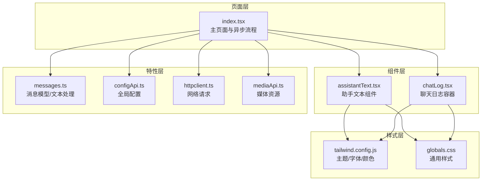
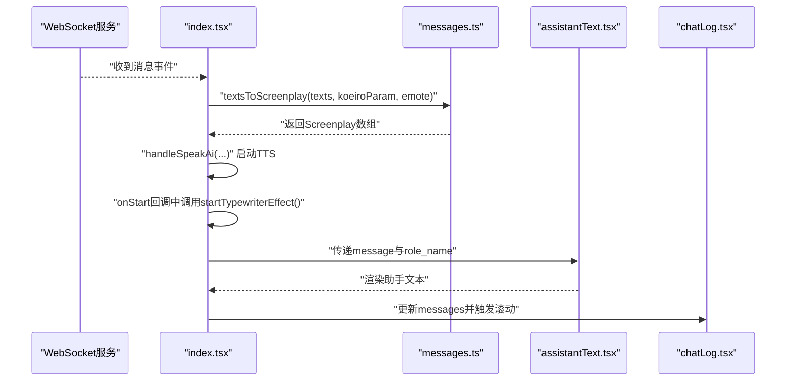
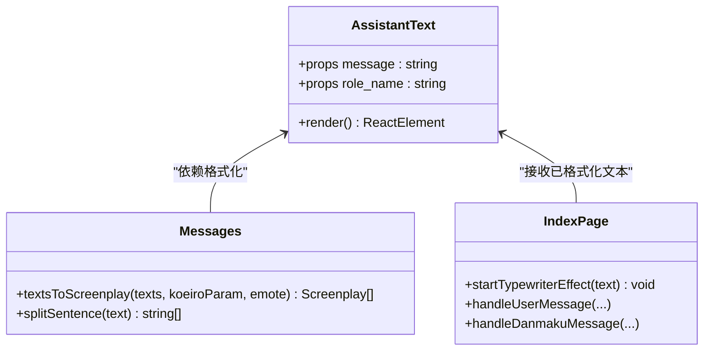
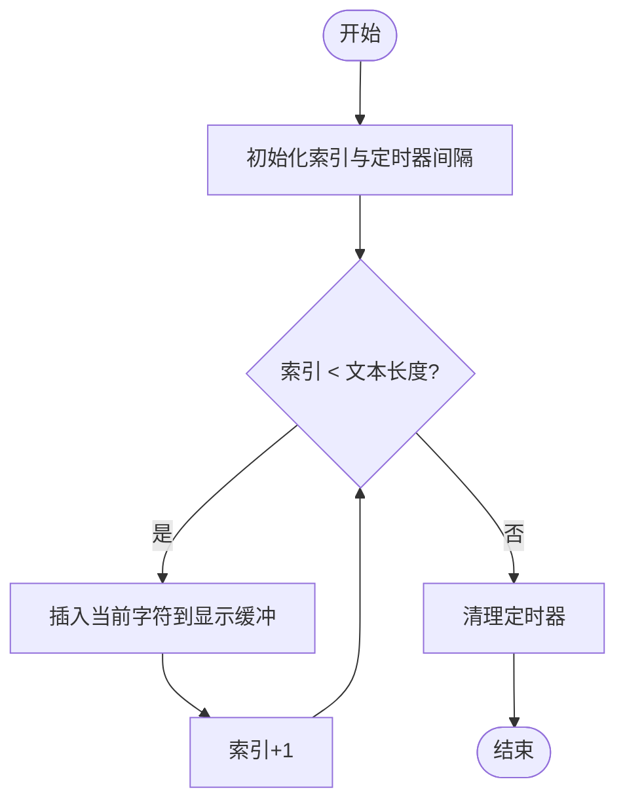
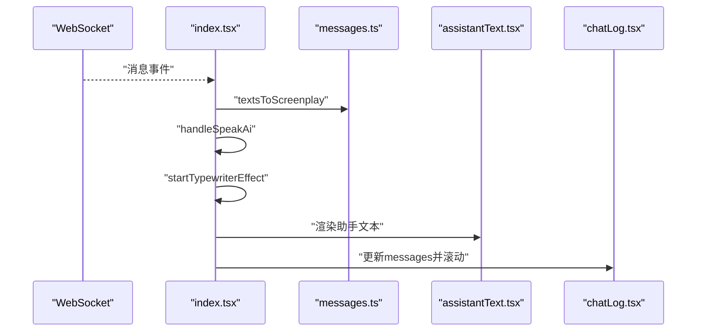
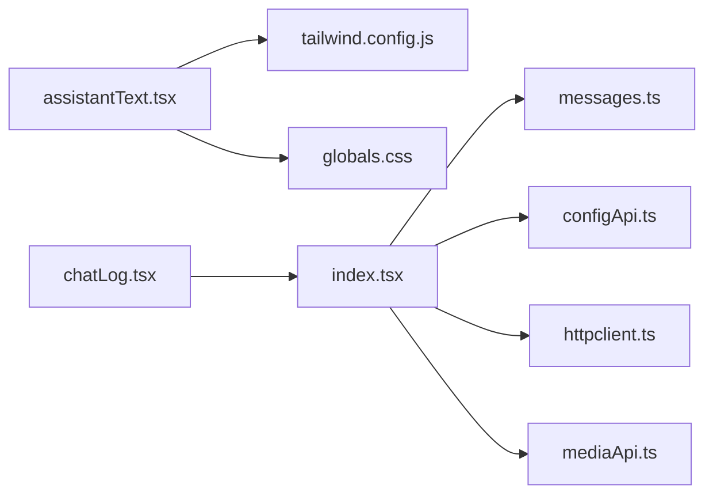

# 助手文本组件

<cite>
**本文引用的文件**
- [assistantText.tsx](file://domain-chatvrm/src/components/assistantText.tsx)
- [chatLog.tsx](file://domain-chatvrm/src/components/chatLog.tsx)
- [messages.ts](file://domain-chatvrm/src/features/messages/messages.ts)
- [index.tsx](file://domain-chatvrm/src/pages/index.tsx)
- [configApi.ts](file://domain-chatvrm/src/features/config/configApi.ts)
- [globals.css](file://domain-chatvrm/src/styles/globals.css)
- [tailwind.config.js](file://domain-chatvrm/src/tailwind.config.js)
- [next.config.js](file://domain-chatvrm/src/next.config.js)
- [httpclient.ts](file://domain-chatvrm/src/features/httpclient/httpclient.ts)
- [mediaApi.ts](file://domain-chatvrm/src/features/media/mediaApi.ts)
- [buildUrl.ts](file://domain-chatvrm/src/utils/buildUrl.ts)
- [_app.tsx](file://domain-chatvrm/src/pages/_app.tsx)
</cite>

## 目录
1. [简介](#简介)
2. [项目结构](#项目结构)
3. [核心组件](#核心组件)
4. [架构总览](#架构总览)
5. [详细组件分析](#详细组件分析)
6. [依赖分析](#依赖分析)
7. [性能考虑](#性能考虑)
8. [故障排查指南](#故障排查指南)
9. [结论](#结论)
10. [附录](#附录)

## 简介
本文件为助手文本组件（assistantText）的详细UI组件文档，聚焦于组件的动态文本渲染能力与集成使用方式。根据仓库现有实现，组件支持：
- 文本流式输出：通过逐字节更新实现“打字机”效果
- 字符逐字显示：按固定时间间隔插入下一个字符
- 动画效果控制：结合全局配置与表情动作联动
- 文本状态管理：加载中、完成、错误状态的处理与展示
- 文本内容格式化与安全处理：去除特定标记、避免HTML注入风险
- 样式控制与主题适配：基于Tailwind与Charcoal主题的颜色、字体、行高体系
- 属性配置与数据结构：消息体、角色名称、全局配置
- 异步处理流程：WebSocket接收消息、LLM调用、TTS播放、字幕滚动
- 性能优化与内存管理：定时器清理、本地存储持久化、滚动优化
- 使用示例与自定义动画指导：在页面中集成与扩展

## 项目结构
助手文本组件位于前端Next.js工程中，采用组件分层与特性模块化组织：
- 组件层：assistantText.tsx、chatLog.tsx等
- 特性层：messages.ts（消息模型与文本处理）、configApi.ts（全局配置）、httpclient.ts（网络请求）
- 样式层：globals.css、tailwind.config.js（主题与字体）
- 页面层：index.tsx（主页面，集成组件与异步流程）
- 工具层：buildUrl.ts、mediaApi.ts（资源路径与媒体处理）

图表来源
- [index.tsx](file://domain-chatvrm/src/pages/index.tsx#L1-L390)
- [assistantText.tsx](file://domain-chatvrm/src/components/assistantText.tsx#L1-L19)
- [chatLog.tsx](file://domain-chatvrm/src/components/chatLog.tsx#L1-L60)
- [messages.ts](file://domain-chatvrm/src/features/messages/messages.ts#L1-L80)
- [configApi.ts](file://domain-chatvrm/src/features/config/configApi.ts#L1-L100)
- [httpclient.ts](file://domain-chatvrm/src/features/httpclient/httpclient.ts#L1-L43)
- [mediaApi.ts](file://domain-chatvrm/src/features/media/mediaApi.ts#L1-L122)
- [tailwind.config.js](file://domain-chatvrm/src/tailwind.config.js#L1-L39)
- [globals.css](file://domain-chatvrm/src/styles/globals.css#L1-L190)

章节来源
- [index.tsx](file://domain-chatvrm/src/pages/index.tsx#L1-L390)
- [assistantText.tsx](file://domain-chatvrm/src/components/assistantText.tsx#L1-L19)
- [chatLog.tsx](file://domain-chatvrm/src/components/chatLog.tsx#L1-L60)
- [messages.ts](file://domain-chatvrm/src/features/messages/messages.ts#L1-L80)
- [configApi.ts](file://domain-chatvrm/src/features/config/configApi.ts#L1-L100)
- [httpclient.ts](file://domain-chatvrm/src/features/httpclient/httpclient.ts#L1-L43)
- [mediaApi.ts](file://domain-chatvrm/src/features/media/mediaApi.ts#L1-L122)
- [tailwind.config.js](file://domain-chatvrm/src/tailwind.config.js#L1-L39)
- [globals.css](file://domain-chatvrm/src/styles/globals.css#L1-L190)

## 核心组件
- 组件名称：assistantText
- 文件位置：domain-chatvrm/src/components/assistantText.tsx
- 职责概述：
  - 渲染助手消息的标题栏与正文区域
  - 基于传入的角色名称与消息文本进行展示
  - 对消息文本执行基础格式化（去除特定标记）
  - 应用主题色板与字体族，控制行高与排版
- 关键点：
  - 使用Tailwind类名控制布局、圆角、内边距、颜色与字体
  - 文本内容通过正则移除特定标记，避免渲染异常
  - 采用行截断（line-clamp）限制显示行数

章节来源
- [assistantText.tsx](file://domain-chatvrm/src/components/assistantText.tsx#L1-L19)

## 架构总览
助手文本组件在页面中的工作流如下：
- 页面通过WebSocket接收消息
- 将消息转换为屏幕剧本（Screenplay），并触发TTS播放
- 在TTS开始回调中启动逐字显示（打字机）效果
- 将最终消息写入聊天日志，并滚动至底部
- 全局配置用于决定角色名称、背景图等

图表来源
- [index.tsx](file://domain-chatvrm/src/pages/index.tsx#L116-L244)
- [messages.ts](file://domain-chatvrm/src/features/messages/messages.ts#L44-L66)
- [assistantText.tsx](file://domain-chatvrm/src/components/assistantText.tsx#L1-L19)
- [chatLog.tsx](file://domain-chatvrm/src/components/chatLog.tsx#L1-L60)

章节来源
- [index.tsx](file://domain-chatvrm/src/pages/index.tsx#L116-L244)
- [messages.ts](file://domain-chatvrm/src/features/messages/messages.ts#L44-L66)
- [assistantText.tsx](file://domain-chatvrm/src/components/assistantText.tsx#L1-L19)
- [chatLog.tsx](file://domain-chatvrm/src/components/chatLog.tsx#L1-L60)

## 详细组件分析

### assistantText 组件
- 组件职责
  - 接收消息文本与角色名称
  - 渲染带标题栏与正文的卡片式布局
  - 对消息文本进行基础格式化（去除特定标记）
  - 应用主题颜色、字体与行高
- 数据结构
  - 属性：message（字符串）、role_name（字符串）
  - 文本格式化：使用正则移除特定标记，避免渲染异常
- 样式与主题
  - 使用Tailwind类名控制布局与外观
  - 颜色来自Charcoal主题与自定义扩展
  - 字体族来自Tailwind主题扩展
- 动画与交互
  - 逐字显示由父组件在TTS开始回调中触发
  - 组件本身不直接管理动画，仅负责渲染

图表来源
- [assistantText.tsx](file://domain-chatvrm/src/components/assistantText.tsx#L1-L19)
- [messages.ts](file://domain-chatvrm/src/features/messages/messages.ts#L44-L66)
- [index.tsx](file://domain-chatvrm/src/pages/index.tsx#L234-L244)

章节来源
- [assistantText.tsx](file://domain-chatvrm/src/components/assistantText.tsx#L1-L19)
- [messages.ts](file://domain-chatvrm/src/features/messages/messages.ts#L44-L66)
- [index.tsx](file://domain-chatvrm/src/pages/index.tsx#L234-L244)

### 打字机逐字显示算法
- 触发时机：TTS播放开始回调中调用
- 实现要点：
  - 使用定时器按固定间隔插入下一个字符
  - 维护当前索引，达到长度时清理定时器
  - 更新显示字幕，配合页面字幕区域渲染
- 复杂度与性能
  - 时间复杂度：O(n)，n为文本长度
  - 空间复杂度：O(1)，仅维护索引与定时器句柄
  - 注意：及时清理定时器，避免内存泄漏

图表来源
- [index.tsx](file://domain-chatvrm/src/pages/index.tsx#L234-L244)

章节来源
- [index.tsx](file://domain-chatvrm/src/pages/index.tsx#L234-L244)

### 文本状态管理机制
- 加载状态
  - 页面在发起LLM请求或等待TTS播放时设置加载标志
  - 可用于禁用输入或显示占位符
- 完成状态
  - TTS播放完成后，将最终消息写入聊天日志并触发滚动
- 错误状态
  - LLM请求失败时捕获异常并记录日志
  - 可扩展为错误提示组件或重试机制

章节来源
- [index.tsx](file://domain-chatvrm/src/pages/index.tsx#L249-L286)

### 文本内容格式化与安全处理
- 格式化
  - 移除特定标记：使用正则替换，确保渲染整洁
  - 分句处理：按标点与换行拆分，便于后续逐句播放
- 安全处理
  - 当前实现未对HTML进行显式转义；建议在上游或组件内增加HTML转义与白名单校验
  - 特殊字符过滤：可结合正则进一步限制非法字符

章节来源
- [messages.ts](file://domain-chatvrm/src/features/messages/messages.ts#L39-L42)
- [messages.ts](file://domain-chatvrm/src/features/messages/messages.ts#L52-L52)
- [assistantText.tsx](file://domain-chatvrm/src/components/assistantText.tsx#L11-L11)

### 样式控制与主题适配
- 颜色方案
  - 主题色：secondary、primary、base、text-primary
  - 组件标题使用secondary背景与白色文字
- 字体大小与行高
  - 使用Tailwind工具类控制字体族与字号
  - 行高通过line-clamp限制显示行数
- 主题适配
  - Tailwind主题来自Charcoal，支持明暗模式
  - 自定义颜色与字体族在tailwind.config.js中扩展

章节来源
- [tailwind.config.js](file://domain-chatvrm/src/tailwind.config.js#L17-L38)
- [globals.css](file://domain-chatvrm/src/styles/globals.css#L1-L190)
- [assistantText.tsx](file://domain-chatvrm/src/components/assistantText.tsx#L5-L11)

### 组件属性配置与数据结构
- 属性
  - message: string（助手消息文本）
  - role_name: string（角色名称，用于标题栏显示）
- 数据结构
  - Message：包含role、content、user_name
  - Screenplay：包含表情与说话内容
- 全局配置
  - GlobalConfig：包含角色信息、语言模型、背景等

章节来源
- [assistantText.tsx](file://domain-chatvrm/src/components/assistantText.tsx#L1-L19)
- [messages.ts](file://domain-chatvrm/src/features/messages/messages.ts#L5-L9)
- [messages.ts](file://domain-chatvrm/src/features/messages/messages.ts#L34-L37)
- [configApi.ts](file://domain-chatvrm/src/features/config/configApi.ts#L65-L66)

### 异步处理流程
- WebSocket接收消息
- 文本转屏幕剧本
- TTS播放与回调
- 逐字显示与日志更新
- 滚动至最新消息

图表来源
- [index.tsx](file://domain-chatvrm/src/pages/index.tsx#L296-L337)
- [messages.ts](file://domain-chatvrm/src/features/messages/messages.ts#L44-L66)
- [assistantText.tsx](file://domain-chatvrm/src/components/assistantText.tsx#L1-L19)
- [chatLog.tsx](file://domain-chatvrm/src/components/chatLog.tsx#L1-L60)

章节来源
- [index.tsx](file://domain-chatvrm/src/pages/index.tsx#L296-L337)
- [messages.ts](file://domain-chatvrm/src/features/messages/messages.ts#L44-L66)
- [assistantText.tsx](file://domain-chatvrm/src/components/assistantText.tsx#L1-L19)
- [chatLog.tsx](file://domain-chatvrm/src/components/chatLog.tsx#L1-L60)

## 依赖分析
- 组件依赖
  - assistantText 依赖 Tailwind 类名与主题颜色
  - index.tsx 依赖 messages.ts 的文本处理与 configApi.ts 的全局配置
  - chatLog.tsx 依赖消息列表与滚动逻辑
- 外部依赖
  - Next.js、React、TailwindCSS、Charcoal主题
  - axios（httpclient.ts）
  - three.js、@pixiv/three-vrm（页面中VRM相关，非组件直接依赖）

图表来源
- [assistantText.tsx](file://domain-chatvrm/src/components/assistantText.tsx#L1-L19)
- [tailwind.config.js](file://domain-chatvrm/src/tailwind.config.js#L1-L39)
- [globals.css](file://domain-chatvrm/src/styles/globals.css#L1-L190)
- [index.tsx](file://domain-chatvrm/src/pages/index.tsx#L1-L390)
- [messages.ts](file://domain-chatvrm/src/features/messages/messages.ts#L1-L80)
- [configApi.ts](file://domain-chatvrm/src/features/config/configApi.ts#L1-L100)
- [httpclient.ts](file://domain-chatvrm/src/features/httpclient/httpclient.ts#L1-L43)
- [mediaApi.ts](file://domain-chatvrm/src/features/media/mediaApi.ts#L1-L122)
- [chatLog.tsx](file://domain-chatvrm/src/components/chatLog.tsx#L1-L60)

章节来源
- [assistantText.tsx](file://domain-chatvrm/src/components/assistantText.tsx#L1-L19)
- [tailwind.config.js](file://domain-chatvrm/src/tailwind.config.js#L1-L39)
- [globals.css](file://domain-chatvrm/src/styles/globals.css#L1-L190)
- [index.tsx](file://domain-chatvrm/src/pages/index.tsx#L1-L390)
- [messages.ts](file://domain-chatvrm/src/features/messages/messages.ts#L1-L80)
- [configApi.ts](file://domain-chatvrm/src/features/config/configApi.ts#L1-L100)
- [httpclient.ts](file://domain-chatvrm/src/features/httpclient/httpclient.ts#L1-L43)
- [mediaApi.ts](file://domain-chatvrm/src/features/media/mediaApi.ts#L1-L122)
- [chatLog.tsx](file://domain-chatvrm/src/components/chatLog.tsx#L1-L60)

## 性能考虑
- 渲染优化
  - 使用line-clamp限制显示行数，减少长文本渲染开销
  - 滚动使用平滑与自动两种策略，避免频繁强制布局
- 内存管理
  - 逐字显示使用定时器，需在组件卸载或文本变更时清理
  - 本地存储持久化参数，减少重复计算与网络请求
- 异步处理
  - 请求失败时及时捕获并停止后续流程
  - WebSocket断线重连，避免阻塞主线程

章节来源
- [assistantText.tsx](file://domain-chatvrm/src/components/assistantText.tsx#L10-L11)
- [chatLog.tsx](file://domain-chatvrm/src/components/chatLog.tsx#L11-L23)
- [index.tsx](file://domain-chatvrm/src/pages/index.tsx#L67-L91)
- [index.tsx](file://domain-chatvrm/src/pages/index.tsx#L234-L244)

## 故障排查指南
- 文本未显示或显示异常
  - 检查消息是否被正则移除标记
  - 确认角色名称与消息文本是否正确传入
- 逐字显示不生效
  - 确认TTS回调是否触发startTypewriterEffect
  - 检查定时器是否被清理或未创建
- 样式错乱
  - 检查Tailwind类名拼写与主题颜色是否正确
  - 确认字体族是否正确加载
- 网络请求失败
  - 查看httpclient.ts中的环境变量与基础URL
  - 检查后端接口返回码与跨域配置

章节来源
- [assistantText.tsx](file://domain-chatvrm/src/components/assistantText.tsx#L1-L19)
- [index.tsx](file://domain-chatvrm/src/pages/index.tsx#L234-L244)
- [httpclient.ts](file://domain-chatvrm/src/features/httpclient/httpclient.ts#L11-L19)

## 结论
助手文本组件通过简洁的结构与明确的职责，实现了从消息接收、文本格式化、TTS联动到逐字显示的完整链路。其样式与主题体系清晰，易于扩展与定制。建议在未来增强HTML转义与特殊字符过滤，完善错误状态反馈，并在逐字显示中加入更精细的动画控制与性能监控。

## 附录

### 使用示例与最佳实践
- 基本用法
  - 在页面中接收消息后，先进行文本格式化与分句处理
  - 启动TTS播放，在回调中调用逐字显示
  - 将最终消息写入聊天日志并滚动至底部
- 自定义动画
  - 可在startTypewriterEffect中调整时间间隔与插入策略
  - 结合表情动作与字幕区域实现更丰富的表现

章节来源
- [index.tsx](file://domain-chatvrm/src/pages/index.tsx#L116-L244)
- [messages.ts](file://domain-chatvrm/src/features/messages/messages.ts#L39-L66)