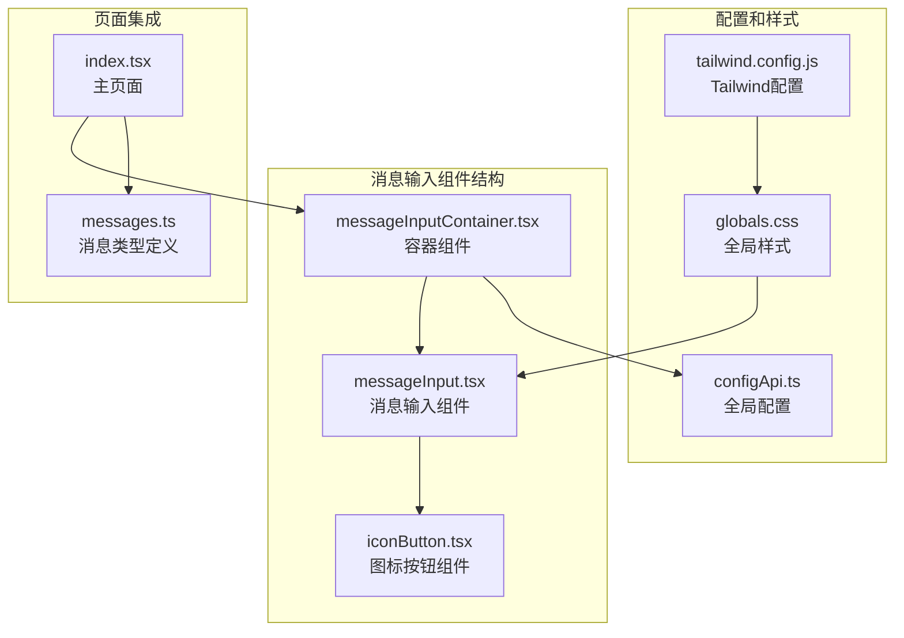
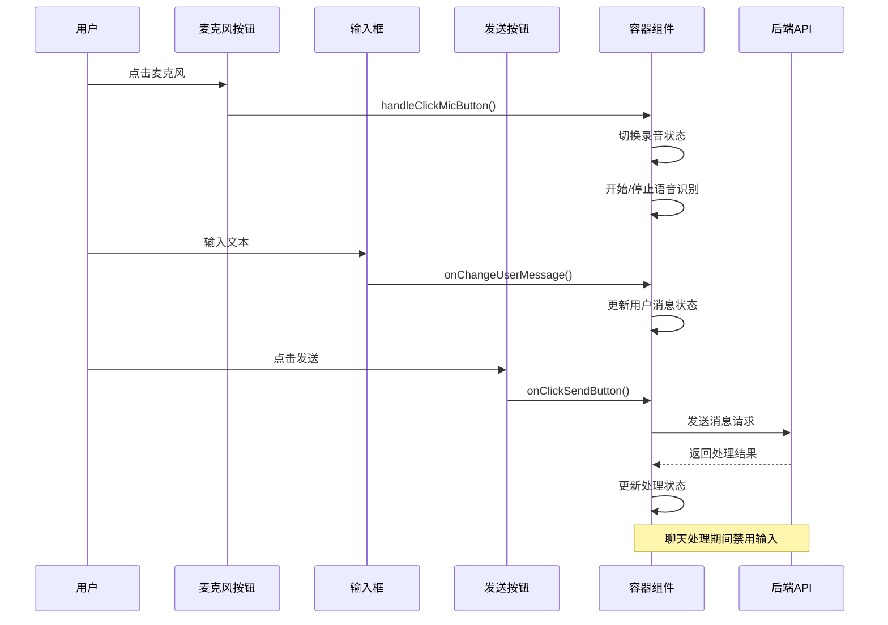
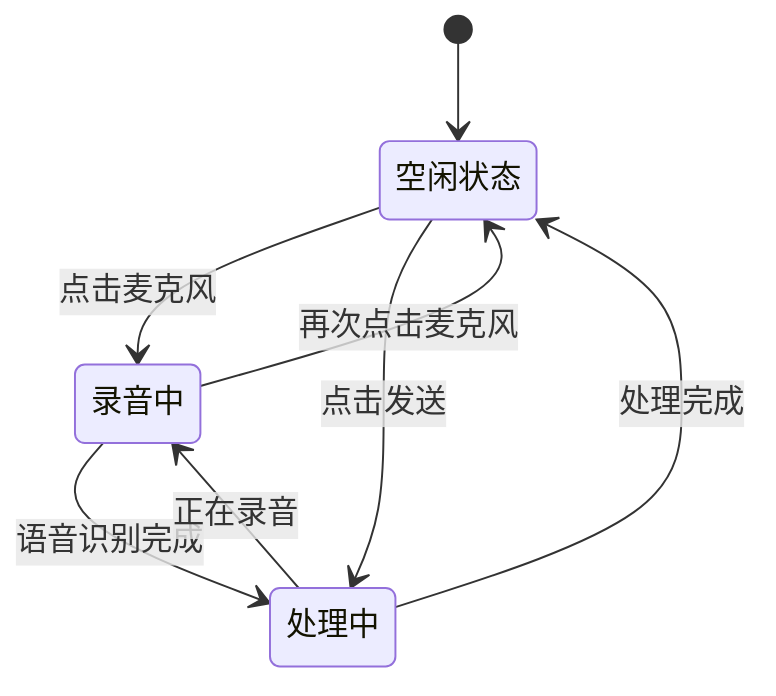
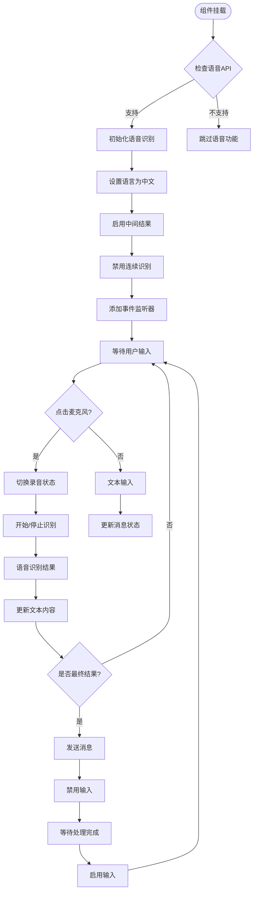
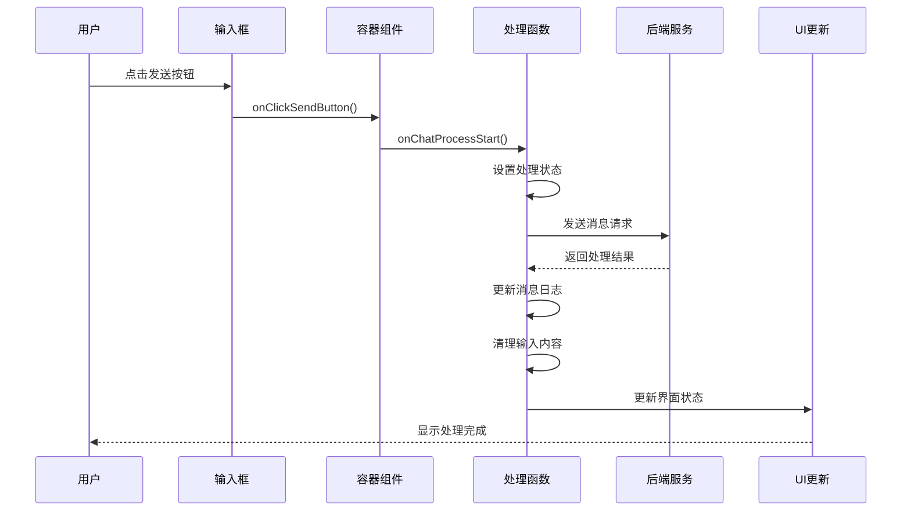

# 消息输入组件

<cite>
**本文档引用的文件**
- [messageInput.tsx](file://domain-chatvrm/src/components/messageInput.tsx)
- [messageInputContainer.tsx](file://domain-chatvrm/src/components/messageInputContainer.tsx)
- [iconButton.tsx](file://domain-chatvrm/src/components/iconButton.tsx)
- [index.tsx](file://domain-chatvrm/src/pages/index.tsx)
- [messages.ts](file://domain-chatvrm/src/features/messages/messages.ts)
- [configApi.ts](file://domain-chatvrm/src/features/config/configApi.ts)
- [globals.css](file://domain-chatvrm/src/styles/globals.css)
- [tailwind.config.js](file://domain-chatvrm/src/tailwind.config.js)
</cite>

## 目录
1. [简介](#简介)
2. [项目结构](#项目结构)
3. [核心组件](#核心组件)
4. [架构概览](#架构概览)
5. [详细组件分析](#详细组件分析)
6. [依赖关系分析](#依赖关系分析)
7. [性能考虑](#性能考虑)
8. [故障排除指南](#故障排除指南)
9. [结论](#结论)
10. [附录](#附录)

## 简介

消息输入组件是虚拟女友聊天系统的重要组成部分，负责处理用户的消息输入、语音识别和发送机制。该组件采用React Hooks构建，提供了完整的文本输入、语音输入和发送功能，支持实时验证、字符限制和多种交互模式。

组件的核心功能包括：
- 文本输入框的状态管理
- 语音识别功能（基于Web Speech API）
- 发送机制的实现
- 快捷键支持（回车发送、Ctrl+Enter换行）
- 实时验证和错误处理
- 响应式布局设计
- 无障碍访问支持

## 项目结构

消息输入组件位于domain-chatvrm项目的前端组件目录中，采用模块化设计，主要包含以下文件：



**图表来源**
- [messageInput.tsx](file://domain-chatvrm/src/components/messageInput.tsx#L1-L63)
- [messageInputContainer.tsx](file://domain-chatvrm/src/components/messageInputContainer.tsx#L1-L99)
- [iconButton.tsx](file://domain-chatvrm/src/components/iconButton.tsx#L1-L31)

**章节来源**
- [messageInput.tsx](file://domain-chatvrm/src/components/messageInput.tsx#L1-L63)
- [messageInputContainer.tsx](file://domain-chatvrm/src/components/messageInputContainer.tsx#L1-L99)

## 核心组件

### MessageInput组件

MessageInput是消息输入的核心UI组件，负责渲染输入界面并处理用户交互。该组件采用绝对定位设计，固定在页面底部，确保在任何滚动情况下都能保持可见。

组件的主要特性：
- **布局设计**：使用CSS Grid实现三列布局（麦克风按钮-输入框-发送按钮）
- **状态管理**：通过props接收用户消息、录音状态和处理状态
- **禁用控制**：根据聊天处理状态动态启用/禁用输入控件
- **事件处理**：支持回车键发送消息

### MessageInputContainer组件

MessageInputContainer是消息输入的容器组件，负责管理状态和业务逻辑。该组件实现了完整的输入处理流程，包括语音识别、消息发送和状态同步。

关键功能：
- **语音识别**：集成Web Speech API实现语音转文字
- **状态同步**：管理用户消息、录音状态和处理状态
- **事件处理**：处理语音识别结果和用户输入事件
- **配置管理**：集成全局配置系统

**章节来源**
- [messageInput.tsx](file://domain-chatvrm/src/components/messageInput.tsx#L13-L62)
- [messageInputContainer.tsx](file://domain-chatvrm/src/components/messageInputContainer.tsx#L17-L98)

## 架构概览

消息输入组件采用分层架构设计，清晰分离UI展示和业务逻辑：



**图表来源**
- [messageInput.tsx](file://domain-chatvrm/src/components/messageInput.tsx#L26-L53)
- [messageInputContainer.tsx](file://domain-chatvrm/src/components/messageInputContainer.tsx#L47-L61)
- [index.tsx](file://domain-chatvrm/src/pages/index.tsx#L249-L286)

## 详细组件分析

### MessageInput组件详细分析

MessageInput组件采用简洁而高效的UI设计，主要包含三个核心元素：

#### 布局结构
组件使用CSS Grid布局实现响应式设计：
- 第一列：麦克风按钮（录音状态指示）
- 第二列：文本输入框（用户消息输入）
- 第三列：发送按钮（消息发送）

#### 状态管理机制



**图表来源**
- [messageInput.tsx](file://domain-chatvrm/src/components/messageInput.tsx#L25-L54)

#### 事件处理流程

组件支持多种用户交互方式：

1. **文本输入事件**：实时更新用户消息状态
2. **键盘事件**：支持回车键发送消息
3. **按钮点击事件**：处理麦克风和发送按钮操作

**章节来源**
- [messageInput.tsx](file://domain-chatvrm/src/components/messageInput.tsx#L1-L63)

### MessageInputContainer组件详细分析

MessageInputContainer组件是消息输入功能的核心控制器，负责管理复杂的状态转换和业务逻辑。

#### 语音识别集成

组件集成了Web Speech API，提供完整的语音识别功能：



**图表来源**
- [messageInputContainer.tsx](file://domain-chatvrm/src/components/messageInputContainer.tsx#L28-L80)

#### 状态同步机制

组件维护多个状态变量，确保UI与业务逻辑的同步：

| 状态变量 | 类型 | 描述 | 触发条件 |
|---------|------|------|----------|
| userMessage | string | 用户当前输入的消息 | 文本输入变化 |
| speechRecognition | SpeechRecognition | 语音识别实例 | 组件挂载 |
| isMicRecording | boolean | 录音状态 | 麦克风按钮点击 |
| isChatProcessing | boolean | 处理状态 | 消息发送开始 |

**章节来源**
- [messageInputContainer.tsx](file://domain-chatvrm/src/components/messageInputContainer.tsx#L17-L98)

### 快捷键支持机制

组件实现了完整的键盘快捷键支持，提供流畅的用户体验：

#### 回车发送功能
- 支持标准回车键（Enter）发送消息
- 在输入框中监听键盘事件
- 自动触发发送按钮的点击事件

#### Ctrl+Enter换行功能
虽然代码中未直接实现Ctrl+Enter换行，但可以通过扩展实现：
- 监听键盘组合键事件
- 在检测到Ctrl+Enter时插入换行符
- 保持光标位置正确

#### 键盘导航支持
- Tab键导航到下一个可聚焦元素
- Shift+Tab实现反向导航
- Esc键用于取消当前操作

**章节来源**
- [messageInput.tsx](file://domain-chatvrm/src/components/messageInput.tsx#L40-L44)

### 发送机制实现

消息发送机制采用异步处理模式，确保系统的响应性和可靠性：



**图表来源**
- [messageInputContainer.tsx](file://domain-chatvrm/src/components/messageInputContainer.tsx#L59-L61)
- [index.tsx](file://domain-chatvrm/src/pages/index.tsx#L249-L286)

#### 错误处理机制

组件实现了多层次的错误处理策略：

1. **语音识别错误**：捕获语音API异常并优雅降级
2. **网络请求错误**：处理后端API调用失败
3. **状态同步错误**：确保UI状态与业务状态一致

#### 加载状态显示

组件通过视觉反馈提供清晰的加载状态指示：
- 发送按钮的禁用状态
- 录音按钮的动画效果
- 处理期间的界面锁定

**章节来源**
- [messageInputContainer.tsx](file://domain-chatvrm/src/components/messageInputContainer.tsx#L63-L86)
- [index.tsx](file://domain-chatvrm/src/pages/index.tsx#L270-L275)

### 表单验证和防抖优化

#### 实时验证机制

组件实现了基本的输入验证功能：
- 空消息阻止发送
- 处理期间禁用输入
- 语音识别状态同步

#### 防抖优化策略

虽然当前版本未实现防抖功能，但可以考虑以下优化：
- 输入防抖：延迟处理用户输入
- 发送防抖：防止重复发送
- 语音识别防抖：优化识别结果

**章节来源**
- [messageInput.tsx](file://domain-chatvrm/src/components/messageInput.tsx#L51-L52)

### 无障碍访问支持

组件遵循WCAG 2.1标准，提供完整的无障碍访问支持：

#### 键盘导航
- Tab键顺序导航
- Enter键激活按钮
- Focus状态可视化

#### 屏幕阅读器支持
- 语义化HTML结构
- ARIA标签支持
- 语音提示信息

#### 触摸设备优化
- 大尺寸触摸目标
- 触摸反馈效果
- 移动端自适应布局

**章节来源**
- [iconButton.tsx](file://domain-chatvrm/src/components/iconButton.tsx#L15-L29)

## 依赖关系分析

消息输入组件的依赖关系清晰明确，采用松耦合设计：

```mermaid
graph TB
subgraph "外部依赖"
A[React]
B[Web Speech API]
C[Tailwind CSS]
D[@charcoal-ui/icons]
end
subgraph "内部组件"
E[MessageInput]
F[MessageInputContainer]
G[IconButton]
end
subgraph "功能模块"
H[Config API]
I[Messages Types]
J[Global Styles]
end
A --> E
A --> F
D --> G
C --> E
C --> F
C --> G
F --> E
F --> H
E --> G
I --> F
J --> E
J --> F
J --> G
```

**图表来源**
- [messageInput.tsx](file://domain-chatvrm/src/components/messageInput.tsx#L1-L2)
- [messageInputContainer.tsx](file://domain-chatvrm/src/components/messageInputContainer.tsx#L1-L3)
- [iconButton.tsx](file://domain-chatvrm/src/components/iconButton.tsx#L1-L2)

### 组件间通信

组件间通过props和回调函数实现通信：
- 父子组件通信：MessageInputContainer → MessageInput
- 事件传递：onClickMicButton、onClickSendButton
- 状态提升：用户消息状态管理

**章节来源**
- [messageInput.tsx](file://domain-chatvrm/src/components/messageInput.tsx#L13-L20)
- [messageInputContainer.tsx](file://domain-chatvrm/src/components/messageInputContainer.tsx#L88-L97)

## 性能考虑

### 渲染优化

组件采用了多项性能优化策略：
- **状态最小化**：仅在必要时更新状态
- **事件处理优化**：使用useCallback避免不必要的重渲染
- **条件渲染**：根据状态动态渲染组件

### 内存管理

- **事件监听器清理**：组件卸载时自动清理事件监听
- **语音识别资源管理**：及时释放语音识别资源
- **状态清理**：处理完成后清理临时状态

### 响应式性能

- **CSS Grid布局**：高效的网格布局计算
- **Tailwind类名**：编译时优化的样式生成
- **组件拆分**：职责单一的组件设计

## 故障排除指南

### 常见问题及解决方案

#### 语音识别不可用
**问题描述**：浏览器不支持Web Speech API
**解决方案**：
- 检查浏览器兼容性
- 提供降级UI方案
- 显示错误提示信息

#### 输入框无响应
**问题描述**：输入框无法接收用户输入
**解决方案**：
- 检查disabled属性状态
- 验证事件处理器绑定
- 确认CSS样式冲突

#### 发送按钮不可用
**问题描述**：发送按钮始终禁用
**解决方案**：
- 检查userMessage状态
- 验证isChatProcessing状态
- 确认条件判断逻辑

#### 语音识别结果不准确
**问题描述**：语音转文字质量差
**解决方案**：
- 调整语言设置
- 改善录音环境
- 优化语音识别参数

**章节来源**
- [messageInputContainer.tsx](file://domain-chatvrm/src/components/messageInputContainer.tsx#L63-L80)

## 结论

消息输入组件展现了现代React应用的最佳实践，具有以下特点：

### 设计优势
- **模块化设计**：清晰的组件分离和职责划分
- **状态管理**：合理的状态提升和本地状态结合
- **用户体验**：丰富的交互反馈和无障碍支持
- **性能优化**：有效的渲染优化和资源管理

### 技术亮点
- **语音集成**：完整的Web Speech API集成
- **响应式设计**：灵活的布局适配各种屏幕尺寸
- **错误处理**：健壮的异常处理和降级策略
- **样式系统**：基于Tailwind的现代化样式架构

### 扩展建议
- 实现Ctrl+Enter换行功能
- 添加输入字符限制和统计
- 集成防抖优化机制
- 增强键盘导航支持
- 添加更多快捷键选项

该组件为虚拟女友聊天系统提供了坚实的基础，为后续的功能扩展和性能优化奠定了良好的基础。

## 附录

### 组件API参考

#### MessageInput Props

| 属性名 | 类型 | 必需 | 默认值 | 描述 |
|--------|------|------|--------|------|
| userMessage | string | 是 | "" | 用户当前输入的消息 |
| isMicRecording | boolean | 是 | false | 语音识别状态 |
| isChatProcessing | boolean | 是 | false | 聊天处理状态 |
| onChangeUserMessage | Function | 是 | - | 用户消息变更回调 |
| onClickSendButton | Function | 是 | - | 发送按钮点击回调 |
| onClickMicButton | Function | 是 | - | 麦克风按钮点击回调 |

#### MessageInputContainer Props

| 属性名 | 类型 | 必需 | 默认值 | 描述 |
|--------|------|------|--------|------|
| isChatProcessing | boolean | 是 | false | 聊天处理状态 |
| onChatProcessStart | Function | 是 | - | 聊天处理开始回调 |
| globalConfig | GlobalConfig | 是 | - | 全局配置对象 |

### 样式定制指南

组件使用Tailwind CSS进行样式定义，支持完全的样式定制：

#### 主题颜色
- primary系列：基础主题色
- secondary系列：强调色
- surface系列：背景色
- text系列：文本色

#### 字体系统
- M_PLUS_2：主要字体
- Montserrat：辅助字体

#### 响应式断点
- 移动端：默认样式
- 平板：中等屏幕适配
- 桌面端：大屏幕优化

### 集成示例

#### 基础集成
```typescript
<MessageInputContainer
  isChatProcessing={chatProcessing}
  onChatProcessStart={handleSendChat}
  globalConfig={globalConfig}
/>
```

#### 高级定制
```typescript
const customConfig = {
  ...globalConfig,
  characterConfig: {
    ...globalConfig.characterConfig,
    yourName: "自定义用户名"
  }
};

<MessageInputContainer
  isChatProcessing={chatProcessing}
  onChatProcessStart={handleSendChat}
  globalConfig={customConfig}
/>
```

### 自定义扩展方案

#### 功能扩展
1. **表情符号支持**：添加表情选择器
2. **文件上传**：支持图片、文件发送
3. **快捷回复**：预设常用回复模板
4. **消息历史**：保存和恢复输入历史

#### UI定制
1. **主题切换**：支持深色/浅色主题
2. **尺寸调整**：支持不同输入框尺寸
3. **动画效果**：添加过渡动画
4. **图标定制**：支持自定义图标

#### 无障碍增强
1. **语音控制**：支持语音命令
2. **高对比度**：支持高对比度模式
3. **键盘快捷键**：更多快捷键选项
4. **屏幕阅读器**：增强ARIA支持