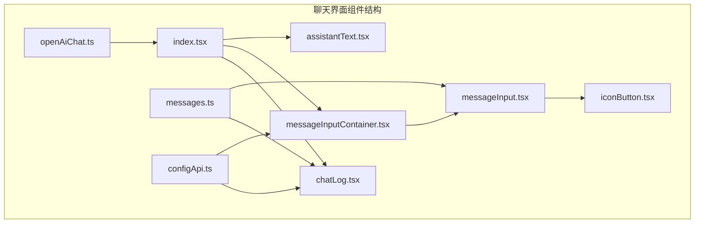
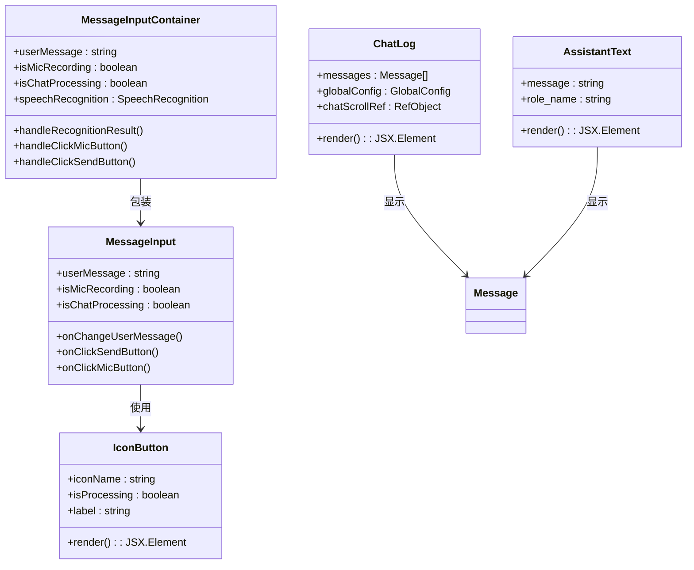
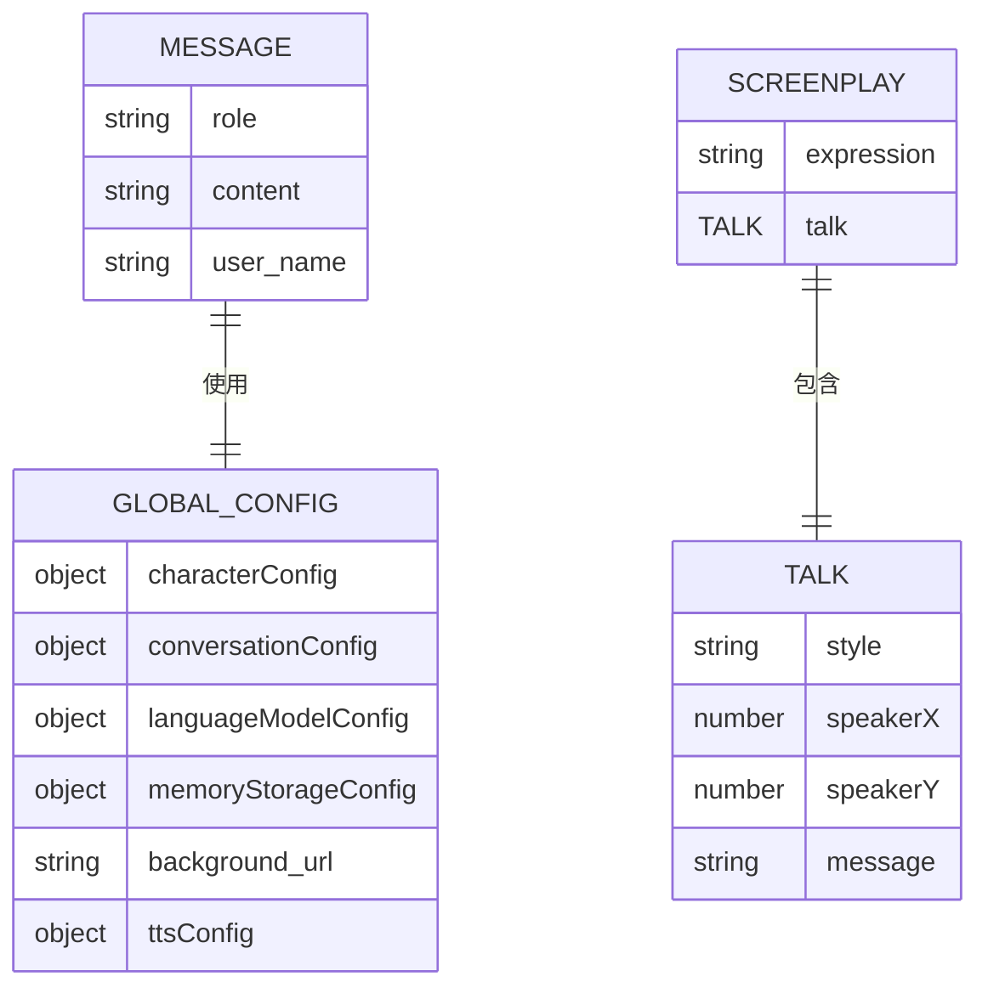
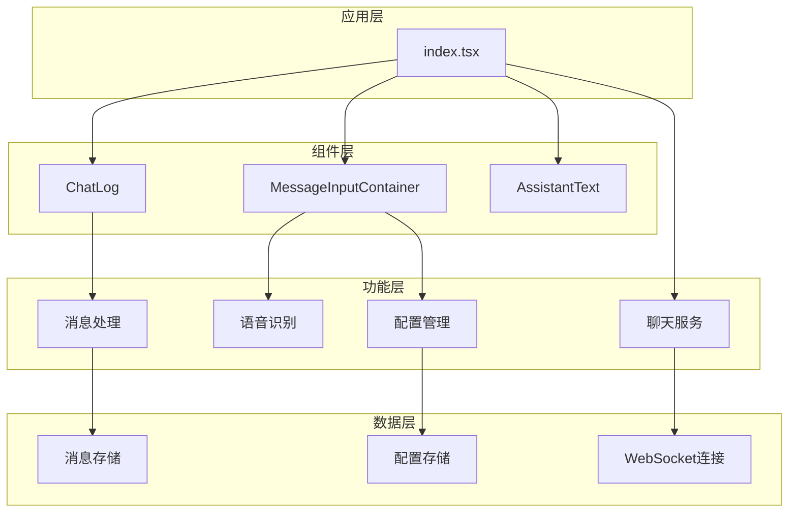
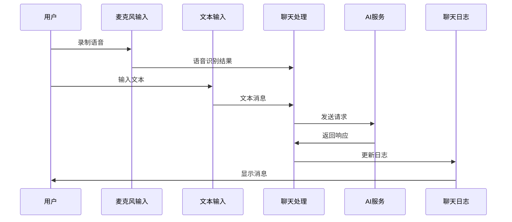
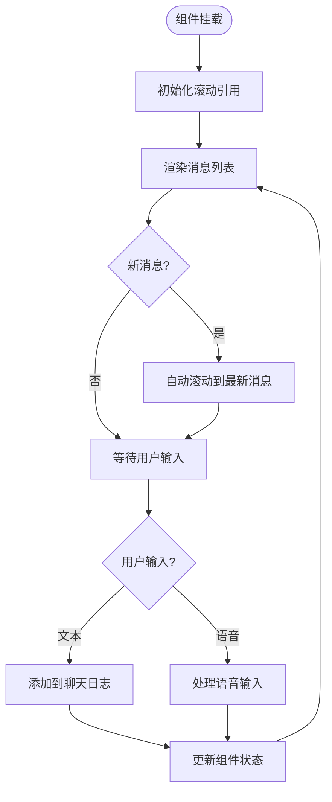
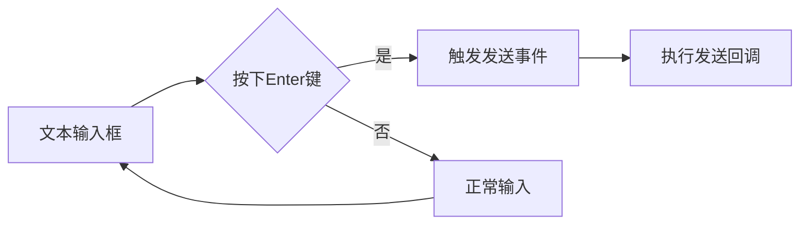
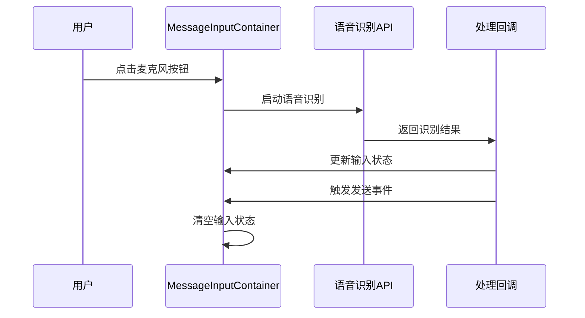
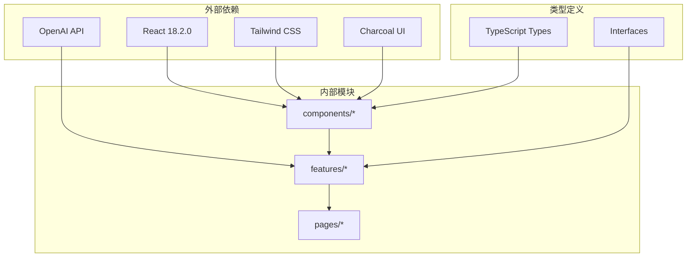

# 聊天界面组件

<cite>
**本文档引用的文件**
- [chatLog.tsx](file://domain-chatvrm/src/components/chatLog.tsx)
- [messageInput.tsx](file://domain-chatvrm/src/components/messageInput.tsx)
- [messageInputContainer.tsx](file://domain-chatvrm/src/components/messageInputContainer.tsx)
- [assistantText.tsx](file://domain-chatvrm/src/components/assistantText.tsx)
- [iconButton.tsx](file://domain-chatvrm/src/components/iconButton.tsx)
- [messages.ts](file://domain-chatvrm/src/features/messages/messages.ts)
- [configApi.ts](file://domain-chatvrm/src/features/config/configApi.ts)
- [index.tsx](file://domain-chatvrm/src/pages/index.tsx)
- [openAiChat.ts](file://domain-chatvrm/src/features/chat/openAiChat.ts)
- [globals.css](file://domain-chatvrm/src/styles/globals.css)
- [tailwind.config.js](file://domain-chatvrm/src/tailwind.config.js)
- [package.json](file://domain-chatvrm/package.json)
</cite>

## 目录
1. [简介](#简介)
2. [项目结构](#项目结构)
3. [核心组件](#核心组件)
4. [架构概览](#架构概览)
5. [详细组件分析](#详细组件分析)
6. [依赖关系分析](#依赖关系分析)
7. [性能考虑](#性能考虑)
8. [故障排除指南](#故障排除指南)
9. [结论](#结论)
10. [附录](#附录)

## 简介

聊天界面组件是VirtualWife项目中的核心交互模块，负责提供完整的聊天体验，包括消息显示、用户输入、语音识别和实时通信。该组件系统基于React和TypeScript构建，采用现代化的UI设计原则，支持响应式布局和无障碍访问。

本组件系统集成了多种功能特性：
- 实时消息显示和自动滚动
- 文本输入和快捷键支持
- 语音识别和麦克风录制
- 助手文本动态更新
- 响应式设计和主题定制
- 跨浏览器兼容性支持

## 项目结构

聊天界面组件位于`domain-chatvrm/src/components/`目录下，采用按功能分层的组织方式：



**图表来源**
- [index.tsx](file://domain-chatvrm/src/pages/index.tsx#L1-L390)
- [chatLog.tsx](file://domain-chatvrm/src/components/chatLog.tsx#L1-L60)
- [messageInputContainer.tsx](file://domain-chatvrm/src/components/messageInputContainer.tsx#L1-L99)

**章节来源**
- [index.tsx](file://domain-chatvrm/src/pages/index.tsx#L1-L390)
- [package.json](file://domain-chatvrm/package.json#L1-L51)

## 核心组件

聊天界面组件系统由以下核心组件构成：

### 组件层次结构



**图表来源**
- [chatLog.tsx](file://domain-chatvrm/src/components/chatLog.tsx#L1-L60)
- [messageInputContainer.tsx](file://domain-chatvrm/src/components/messageInputContainer.tsx#L1-L99)
- [messageInput.tsx](file://domain-chatvrm/src/components/messageInput.tsx#L1-L63)
- [assistantText.tsx](file://domain-chatvrm/src/components/assistantText.tsx#L1-L19)
- [iconButton.tsx](file://domain-chatvrm/src/components/iconButton.tsx#L1-L31)

### 数据模型



**图表来源**
- [messages.ts](file://domain-chatvrm/src/features/messages/messages.ts#L1-L80)
- [configApi.ts](file://domain-chatvrm/src/features/config/configApi.ts#L1-L100)

**章节来源**
- [messages.ts](file://domain-chatvrm/src/features/messages/messages.ts#L1-L80)
- [configApi.ts](file://domain-chatvrm/src/features/config/configApi.ts#L1-L100)

## 架构概览

聊天界面组件采用分层架构设计，实现了清晰的关注点分离：



**图表来源**
- [index.tsx](file://domain-chatvrm/src/pages/index.tsx#L1-L390)
- [chatLog.tsx](file://domain-chatvrm/src/components/chatLog.tsx#L1-L60)
- [messageInputContainer.tsx](file://domain-chatvrm/src/components/messageInputContainer.tsx#L1-L99)

### 控制流序列



**图表来源**
- [messageInputContainer.tsx](file://domain-chatvrm/src/components/messageInputContainer.tsx#L1-L99)
- [openAiChat.ts](file://domain-chatvrm/src/features/chat/openAiChat.ts#L1-L113)
- [index.tsx](file://domain-chatvrm/src/pages/index.tsx#L1-L390)

## 详细组件分析

### 聊天记录显示组件 (ChatLog)

ChatLog组件负责渲染聊天历史记录，提供智能滚动和样式定制功能。

#### 核心功能特性

1. **自动滚动控制**：新消息到达时自动滚动到底部
2. **角色样式区分**：根据消息角色应用不同样式
3. **响应式布局**：适配不同屏幕尺寸
4. **时间戳处理**：支持消息时间显示

#### 实现细节



**图表来源**
- [chatLog.tsx](file://domain-chatvrm/src/components/chatLog.tsx#L1-L60)

#### 样式系统

组件使用Tailwind CSS类名实现响应式设计：

| 类名 | 功能 | 响应式特性 |
|------|------|------------|
| `absolute` | 绝对定位 | 固定在页面底部 |
| `w-screen` | 全宽 | 响应式宽度 |
| `h-[100svh]` | 视口高度 | 支持现代浏览器 |
| `max-w-4xl` | 最大宽度 | 居中布局 |
| `scroll-hidden` | 隐藏滚动条 | 跨浏览器兼容 |

**章节来源**
- [chatLog.tsx](file://domain-chatvrm/src/components/chatLog.tsx#L1-L60)
- [globals.css](file://domain-chatvrm/src/styles/globals.css#L42-L51)

### 消息输入组件 (MessageInput)

MessageInput组件提供完整的消息输入功能，包括文本输入和语音输入。

#### 组件接口

| 属性名 | 类型 | 必需 | 描述 |
|--------|------|------|------|
| `userMessage` | string | 是 | 当前输入的文本内容 |
| `isMicRecording` | boolean | 是 | 麦克风录制状态指示 |
| `isChatProcessing` | boolean | 是 | 聊天处理状态指示 |
| `onChangeUserMessage` | function | 是 | 文本变更回调 |
| `onClickSendButton` | function | 是 | 发送按钮点击回调 |
| `onClickMicButton` | function | 是 | 麦克风按钮点击回调 |

#### 快捷键支持

组件支持键盘快捷键操作：



**图表来源**
- [messageInput.tsx](file://domain-chatvrm/src/components/messageInput.tsx#L40-L44)

#### 状态管理

组件通过props接收状态，确保状态管理的单一职责：

- **只读状态**：从父组件传递的配置和状态
- **受控组件**：通过回调函数更新父组件状态
- **禁用逻辑**：根据聊天处理状态动态启用/禁用

**章节来源**
- [messageInput.tsx](file://domain-chatvrm/src/components/messageInput.tsx#L1-L63)

### 消息输入容器组件 (MessageInputContainer)

MessageInputContainer是消息输入功能的容器组件，负责处理复杂的输入逻辑。

#### 核心功能

1. **语音识别集成**：支持浏览器原生语音识别API
2. **状态同步**：维护本地输入状态并与父组件同步
3. **错误处理**：优雅处理不支持的浏览器环境
4. **生命周期管理**：正确管理语音识别实例的创建和销毁

#### 语音识别流程



**图表来源**
- [messageInputContainer.tsx](file://domain-chatvrm/src/components/messageInputContainer.tsx#L28-L40)

#### 浏览器兼容性

组件实现了多浏览器支持策略：

| 浏览器 | 支持情况 | 备注 |
|--------|----------|------|
| Chrome | ✅ 完全支持 | WebKit语音识别 |
| Firefox | ⚠️ 部分支持 | 需要polyfill |
| Safari | ❌ 不支持 | 无原生支持 |
| Edge | ✅ 完全支持 | WebKit语音识别 |

**章节来源**
- [messageInputContainer.tsx](file://domain-chatvrm/src/components/messageInputContainer.tsx#L1-L99)

### 助手文本组件 (AssistantText)

AssistantText组件用于显示助手的当前回复文本，支持动态更新和样式控制。

#### 功能特性

1. **文本截断**：使用CSS `line-clamp` 实现多行文本截断
2. **动态更新**：支持实时文本内容更新
3. **样式定制**：提供统一的视觉样式
4. **无障碍支持**：支持屏幕阅读器访问

#### 样式实现

组件使用CSS `line-clamp` 属性实现文本截断：

```css
.line-clamp-4 {
  display: -webkit-box;
  -webkit-line-clamp: 4;
  -webkit-box-orient: vertical;
  overflow: hidden;
}
```

**章节来源**
- [assistantText.tsx](file://domain-chatvrm/src/components/assistantText.tsx#L1-L19)

### 图标按钮组件 (IconButton)

IconButton是基础的图标按钮组件，为其他组件提供统一的按钮样式。

#### 组件特性

1. **图标支持**：集成Charcoal UI图标系统
2. **状态指示**：支持处理中状态的视觉反馈
3. **可访问性**：支持aria-label等无障碍属性
4. **样式继承**：支持自定义样式类名

**章节来源**
- [iconButton.tsx](file://domain-chatvrm/src/components/iconButton.tsx#L1-L31)

## 依赖关系分析

聊天界面组件的依赖关系体现了清晰的分层架构：



**图表来源**
- [package.json](file://domain-chatvrm/package.json#L13-L32)
- [tailwind.config.js](file://domain-chatvrm/src/tailwind.config.js#L1-L39)

### 关键依赖

| 依赖包 | 版本 | 用途 | 重要性 |
|--------|------|------|--------|
| react | 18.2.0 | 核心框架 | ⭐⭐⭐⭐⭐ |
| next | 13.2.4 | SSR框架 | ⭐⭐⭐⭐ |
| @charcoal-ui/icons | ^2.6.0 | 图标系统 | ⭐⭐⭐⭐ |
| @tailwindcss/line-clamp | ^0.4.4 | 文本截断 | ⭐⭐⭐ |
| openai | ^3.2.1 | AI服务集成 | ⭐⭐⭐⭐ |

**章节来源**
- [package.json](file://domain-chatvrm/package.json#L13-L32)

## 性能考虑

### 渲染优化

1. **虚拟滚动**：对于大量消息的历史记录，建议实现虚拟滚动
2. **防抖处理**：输入框变更事件使用防抖减少重渲染
3. **记忆化**：使用useMemo和useCallback优化昂贵计算

### 内存管理

1. **语音识别实例**：正确清理SpeechRecognition实例避免内存泄漏
2. **事件监听器**：组件卸载时移除所有事件监听器
3. **定时器清理**：及时清理计时器和WebSocket连接

### 网络优化

1. **流式响应**：支持AI服务的流式响应处理
2. **缓存策略**：实现消息内容的本地缓存
3. **连接池**：WebSocket连接的复用和管理

## 故障排除指南

### 常见问题及解决方案

#### 语音识别不工作

**问题症状**：麦克风按钮不可用或无响应

**可能原因**：
1. 浏览器不支持SpeechRecognition API
2. HTTPS环境缺失
3. 权限未授权

**解决步骤**：
1. 检查浏览器控制台错误信息
2. 确认使用HTTPS协议
3. 授权麦克风权限
4. 尝试Chrome或Edge浏览器

#### 消息不显示

**问题症状**：新消息发送后不显示在聊天记录中

**排查步骤**：
1. 检查消息数组是否正确更新
2. 确认组件重新渲染
3. 验证滚动逻辑
4. 检查样式冲突

#### 样式问题

**问题症状**：组件样式异常或布局错乱

**解决方法**：
1. 检查Tailwind CSS配置
2. 验证CSS类名拼写
3. 确认响应式断点设置
4. 检查全局样式覆盖

**章节来源**
- [messageInputContainer.tsx](file://domain-chatvrm/src/components/messageInputContainer.tsx#L63-L80)
- [index.tsx](file://domain-chatvrm/src/pages/index.tsx#L67-L91)

## 结论

聊天界面组件系统展现了现代React应用的最佳实践，通过合理的组件拆分、清晰的接口设计和完善的错误处理，提供了稳定可靠的聊天体验。

### 主要优势

1. **模块化设计**：组件职责明确，易于维护和测试
2. **响应式支持**：适配各种设备和屏幕尺寸
3. **无障碍访问**：支持屏幕阅读器和键盘导航
4. **跨浏览器兼容**：提供降级方案和错误处理
5. **性能优化**：合理的渲染策略和资源管理

### 扩展建议

1. **国际化支持**：添加多语言切换功能
2. **主题系统**：实现动态主题切换
3. **消息持久化**：添加本地存储和同步功能
4. **多媒体支持**：扩展图片、视频等媒体消息类型
5. **通知系统**：实现桌面通知和声音提示

## 附录

### API参考

#### ChatLog组件

| 属性 | 类型 | 必需 | 默认值 | 描述 |
|------|------|------|--------|------|
| messages | Message[] | 是 | - | 聊天消息数组 |
| globalConfig | GlobalConfig | 是 | - | 全局配置对象 |

#### MessageInput组件

| 属性 | 类型 | 必需 | 默认值 | 描述 |
|------|------|------|--------|------|
| userMessage | string | 是 | - | 当前输入文本 |
| isMicRecording | boolean | 是 | - | 麦克风录制状态 |
| isChatProcessing | boolean | 是 | - | 聊天处理状态 |
| onChangeUserMessage | function | 是 | - | 文本变更回调 |
| onClickSendButton | function | 是 | - | 发送按钮回调 |
| onClickMicButton | function | 是 | - | 麦克风按钮回调 |

#### MessageInputContainer组件

| 属性 | 类型 | 必需 | 默认值 | 描述 |
|------|------|------|--------|------|
| isChatProcessing | boolean | 是 | - | 聊天处理状态 |
| onChatProcessStart | function | 是 | - | 开始聊天处理回调 |
| globalConfig | GlobalConfig | 是 | - | 全局配置对象 |

### 配置选项

#### 全局配置结构

```typescript
interface GlobalConfig {
  characterConfig: {
    character: number;
    character_name: string;
    yourName: string;
    vrmModel: string;
    vrmModelType: string;
  };
  conversationConfig: {
    conversationType: string;
    languageModel: string;
  };
  languageModelConfig: {
    openai: {
      OPENAI_API_KEY: string;
      OPENAI_BASE_URL: string;
    };
    ollama: {
      OLLAMA_API_BASE: string;
      OLLAMA_API_MODEL_NAME: string;
    };
    zhipuai: {
      ZHIPUAI_API_KEY: string;
    };
  };
  memoryStorageConfig: {
    milvusMemory: {
      host: string;
      port: string;
      user: string;
      password: string;
      dbName: string;
    };
    zep_memory: {
      zep_url: string;
      zep_optional_api_key: string;
    };
    enableLongMemory: boolean;
    enableSummary: boolean;
    languageModelForSummary: string;
    enableReflection: boolean;
    languageModelForReflection: string;
  };
  background_id: number;
  background_url: string;
  ttsConfig: {
    ttsType: string;
    ttsVoiceId: string;
  };
}
```

### 样式定制

#### Tailwind配置要点

1. **颜色系统**：基于Charcoal UI主题
2. **字体系统**：Montserrat和M PLUS 2字体
3. **响应式断点**：移动端优先设计
4. **动画支持**：过渡效果和动画类

#### 自定义样式建议

1. **主题定制**：通过Tailwind配置文件修改颜色变量
2. **组件样式**：为特定组件添加专用样式类
3. **响应式设计**：使用断点类名适配不同设备
4. **无障碍样式**：确保高对比度和可访问性