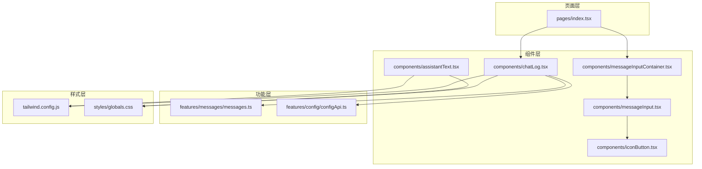
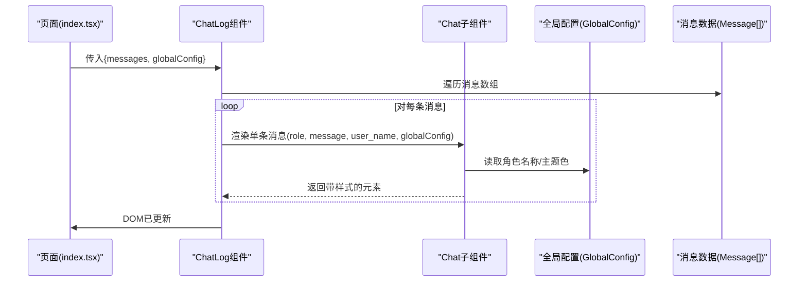
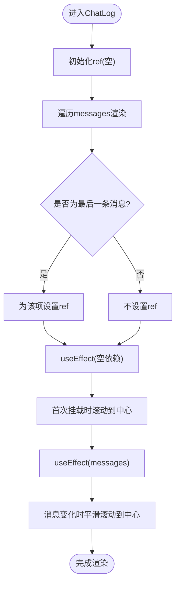
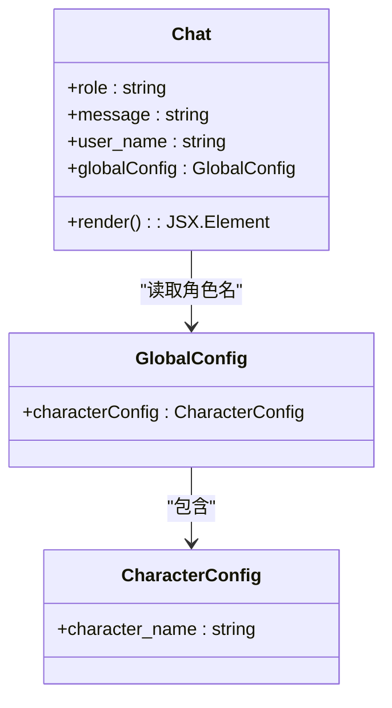
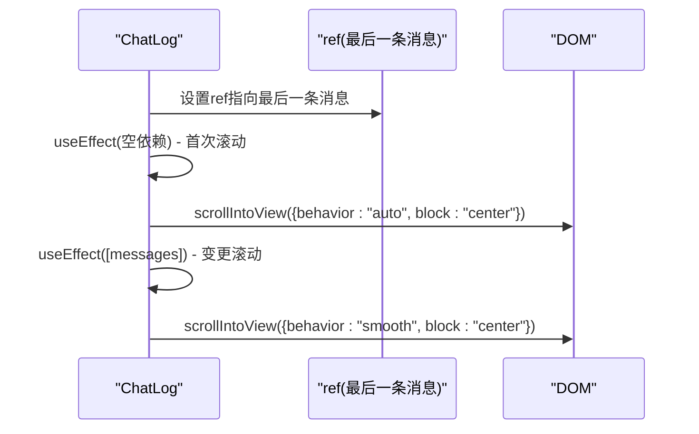
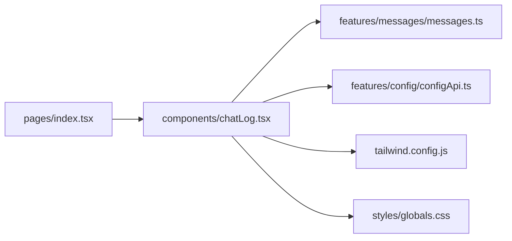

# 聊天记录组件

<cite>
**本文档引用的文件**
- [chatLog.tsx](file://domain-chatvrm/src/components/chatLog.tsx)
- [messages.ts](file://domain-chatvrm/src/features/messages/messages.ts)
- [configApi.ts](file://domain-chatvrm/src/features/config/configApi.ts)
- [tailwind.config.js](file://domain-chatvrm/tailwind.config.js)
- [globals.css](file://domain-chatvrm/src/styles/globals.css)
- [index.tsx](file://domain-chatvrm/src/pages/index.tsx)
- [messageInputContainer.tsx](file://domain-chatvrm/src/components/messageInputContainer.tsx)
- [assistantText.tsx](file://domain-chatvrm/src/components/assistantText.tsx)
- [messageInput.tsx](file://domain-chatvrm/src/components/messageInput.tsx)
- [iconButton.tsx](file://domain-chatvrm/src/components/iconButton.tsx)
- [_app.tsx](file://domain-chatvrm/src/pages/_app.tsx)
- [_document.tsx](file://domain-chatvrm/src/pages/_document.tsx)
- [package.json](file://domain-chatvrm/package.json)
</cite>

## 目录
1. [简介](#简介)
2. [项目结构](#项目结构)
3. [核心组件](#核心组件)
4. [架构总览](#架构总览)
5. [详细组件分析](#详细组件分析)
6. [依赖关系分析](#依赖关系分析)
7. [性能考虑](#性能考虑)
8. [故障排除指南](#故障排除指南)
9. [结论](#结论)
10. [附录](#附录)

## 简介
本文件为聊天记录组件（ChatLog）的详细UI组件文档，聚焦于消息渲染机制、样式与主题配置、角色区分逻辑、自动滚动实现、布局设计、组件属性与数据结构、全局配置集成、响应式设计与性能优化策略，以及内存泄漏防护与自定义样式扩展指导。目标是帮助开发者快速理解并正确使用该组件，同时在保持可维护性与可扩展性的前提下进行定制。

## 项目结构
聊天记录组件位于前端Next.js项目domain-chatvrm中，采用按功能分层的组织方式：
- 组件层：domain-chatvrm/src/components
- 功能层：domain-chatvrm/src/features
- 样式层：domain-chatvrm/src/styles
- 页面层：domain-chatvrm/src/pages

图表来源
- [index.tsx](file://domain-chatvrm/src/pages/index.tsx#L339-L389)
- [chatLog.tsx](file://domain-chatvrm/src/components/chatLog.tsx#L1-L60)
- [messages.ts](file://domain-chatvrm/src/features/messages/messages.ts#L1-L80)
- [configApi.ts](file://domain-chatvrm/src/features/config/configApi.ts#L1-L100)
- [tailwind.config.js](file://domain-chatvrm/tailwind.config.js#L1-L39)
- [globals.css](file://domain-chatvrm/src/styles/globals.css#L1-L190)

章节来源
- [index.tsx](file://domain-chatvrm/src/pages/index.tsx#L339-L389)
- [chatLog.tsx](file://domain-chatvrm/src/components/chatLog.tsx#L1-L60)

## 核心组件
- ChatLog：负责消息列表的渲染与自动滚动控制，内部嵌套Chat子组件用于单条消息展示。
- Chat：根据消息角色（助手/用户）应用不同样式，包含头像区与内容区。
- 全局配置：通过GlobalConfig注入角色名称等主题信息，影响消息标题显示与整体风格。

章节来源
- [chatLog.tsx](file://domain-chatvrm/src/components/chatLog.tsx#L8-L37)
- [messages.ts](file://domain-chatvrm/src/features/messages/messages.ts#L5-L9)
- [configApi.ts](file://domain-chatvrm/src/features/config/configApi.ts#L66-L66)

## 架构总览
聊天记录组件在页面中由Home组件驱动，Home负责维护消息历史、全局配置与WebSocket事件处理，并将消息数组与全局配置传递给ChatLog。

图表来源
- [index.tsx](file://domain-chatvrm/src/pages/index.tsx#L44-L48)
- [chatLog.tsx](file://domain-chatvrm/src/components/chatLog.tsx#L27-L33)
- [messages.ts](file://domain-chatvrm/src/features/messages/messages.ts#L5-L9)
- [configApi.ts](file://domain-chatvrm/src/features/config/configApi.ts#L27-L33)

## 详细组件分析

### ChatLog组件
- 职责
  - 接收消息数组与全局配置，渲染消息列表。
  - 通过useEffect实现自动滚动至最新消息。
- 关键点
  - 使用ref在最后一条消息处挂载引用，触发滚动。
  - 两个useEffect分别处理初次挂载与消息变更时的滚动行为。
  - 列表渲染时仅对最后一条消息设置ref，避免每次渲染都创建新的引用。
- 样式与主题
  - 通过角色判断应用背景色、文字色与左右偏移。
  - 字体族与字号来自Tailwind扩展配置。
- 响应式与布局
  - 外层容器占满视口高度，内层容器支持纵向滚动且隐藏滚动条。
  - 消息卡片宽度限制与圆角、内边距统一控制。

图表来源
- [chatLog.tsx](file://domain-chatvrm/src/components/chatLog.tsx#L8-L37)

章节来源
- [chatLog.tsx](file://domain-chatvrm/src/components/chatLog.tsx#L8-L37)

### Chat子组件（单条消息）
- 角色区分逻辑
  - 助手消息：使用次级色背景与白色文字，标题显示角色名。
  - 用户消息：使用基础色背景与主色调文字，标题显示用户名。
- 样式应用
  - 标题区：圆角顶部、内边距、字体与字重、字距。
  - 内容区：圆角底部、内边距、字体与字重。
  - 左右偏移：用户消息向右偏移，助手消息向左偏移，形成对话气泡视觉方向。
- 数据来源
  - 角色名来自全局配置中的角色名称；用户名来自消息对象。

图表来源
- [chatLog.tsx](file://domain-chatvrm/src/components/chatLog.tsx#L39-L59)
- [configApi.ts](file://domain-chatvrm/src/features/config/configApi.ts#L27-L33)

章节来源
- [chatLog.tsx](file://domain-chatvrm/src/components/chatLog.tsx#L39-L59)

### 自动滚动实现原理
- 钩子与引用
  - 使用useRef获取最后一个消息节点的DOM引用。
  - 第一个useEffect在组件挂载时执行一次滚动（行为为“自动”）。
  - 第二个useEffect监听消息数组变化，在消息新增时执行平滑滚动（行为为“平滑”）。
- 滚动行为控制
  - 使用scrollIntoView并指定block为“center”，确保最新消息出现在可视区域中央。
- 性能与内存
  - 仅在最后一条消息设置ref，避免频繁创建或销毁引用。
  - 依赖数组合理，减少不必要的重渲染与滚动调用。

图表来源
- [chatLog.tsx](file://domain-chatvrm/src/components/chatLog.tsx#L11-L23)

章节来源
- [chatLog.tsx](file://domain-chatvrm/src/components/chatLog.tsx#L11-L23)

### 消息容器布局设计
- 外层容器
  - 绝对定位、跨列跨度、最大宽度、占满视口高度、底部内边距。
- 内层容器
  - 最大高度、左右内边距、顶部内边距、底部内边距、纵向滚动、隐藏滚动条。
- 单条消息卡片
  - 居中、最大宽度、上下外边距、根据角色设置左右内边距。
  - 标题区：内边距、圆角顶部、字体族与字重、字距。
  - 内容区：内边距、圆角底部、背景色。
- 字体与字号
  - 标题使用Montserrat字体与粗体字重。
  - 内容使用M PLUS 2字体与粗体字重。

章节来源
- [chatLog.tsx](file://domain-chatvrm/src/components/chatLog.tsx#L24-L59)
- [tailwind.config.js](file://domain-chatvrm/tailwind.config.js#L31-L34)

### 组件属性接口与消息数据结构
- ChatLog属性
  - messages: Message[]
  - globalConfig: GlobalConfig
- Chat属性
  - role: "assistant" | "system" | "user"
  - message: string
  - user_name: string
  - globalConfig: GlobalConfig
- 消息数据结构
  - role: "assistant" | "system" | "user"
  - content: string
  - user_name: string
- 全局配置
  - characterConfig.character_name: 用于助手消息标题显示

章节来源
- [chatLog.tsx](file://domain-chatvrm/src/components/chatLog.tsx#L4-L7)
- [chatLog.tsx](file://domain-chatvrm/src/components/chatLog.tsx#L39-L42)
- [messages.ts](file://domain-chatvrm/src/features/messages/messages.ts#L5-L9)
- [configApi.ts](file://domain-chatvrm/src/features/config/configApi.ts#L27-L33)

### 全局配置集成
- 角色名称注入
  - Chat组件从globalConfig.characterConfig.character_name读取角色名，用于助手消息的标题显示。
- 主题色与字体
  - Tailwind扩展配置提供primary、secondary、base等颜色变量与Montserrat、M PLUS 2字体族。
  - globals.css中定义scroll-hidden类以隐藏滚动条。

章节来源
- [chatLog.tsx](file://domain-chatvrm/src/components/chatLog.tsx#L50-L50)
- [configApi.ts](file://domain-chatvrm/src/features/config/configApi.ts#L27-L33)
- [tailwind.config.js](file://domain-chatvrm/tailwind.config.js#L18-L35)
- [globals.css](file://domain-chatvrm/src/styles/globals.css#L42-L51)

### 响应式设计实现
- 视口适配
  - 外层容器使用视口单位与绝对定位，适配不同屏幕尺寸。
- 滚动体验
  - 内层容器纵向滚动，隐藏滚动条提升视觉一致性。
- 字体与排版
  - 字体族与字号在Tailwind配置中集中管理，保证跨组件一致性。

章节来源
- [chatLog.tsx](file://domain-chatvrm/src/components/chatLog.tsx#L24-L26)
- [tailwind.config.js](file://domain-chatvrm/tailwind.config.js#L31-L34)
- [globals.css](file://domain-chatvrm/src/styles/globals.css#L42-L51)

### 性能优化策略
- 列表渲染优化
  - 仅对最后一条消息设置ref，避免每次渲染都创建新引用。
  - 使用key为索引，结合条件ref赋值，减少DOM操作。
- 滚动触发优化
  - 首次挂载使用“自动”滚动，消息变更使用“平滑”滚动，兼顾性能与体验。
- 样式复用
  - 通过Tailwind类名复用，减少内联样式的计算开销。
- 字体加载
  - 项目中未直接使用Next/font，避免额外字体资源阻塞主线程。

章节来源
- [chatLog.tsx](file://domain-chatvrm/src/components/chatLog.tsx#L27-L33)
- [chatLog.tsx](file://domain-chatvrm/src/components/chatLog.tsx#L11-L23)
- [tailwind.config.js](file://domain-chatvrm/tailwind.config.js#L31-L34)
- [package.json](file://domain-chatvrm/package.json#L22-L32)

### 内存泄漏防护
- 引用管理
  - 仅在最后一条消息设置ref，避免在长列表中累积大量引用。
- 依赖数组
  - useEffect依赖数组合理设置，避免无限循环或重复订阅。
- DOM清理
  - 组件卸载时无需手动清理ref，React会在必要时自动释放。

章节来源
- [chatLog.tsx](file://domain-chatvrm/src/components/chatLog.tsx#L8-L23)

### 组件使用示例与自定义样式扩展
- 使用示例
  - 在页面中将消息数组与全局配置作为props传入ChatLog。
  - 示例路径参考：[index.tsx](file://domain-chatvrm/src/pages/index.tsx#L339-L389)
- 自定义样式扩展
  - 颜色主题：通过Tailwind扩展配置修改primary、secondary、base等颜色。
  - 字体：在tailwind.config.js中添加或替换字体族。
  - 滚动条：如需显示滚动条，可在globals.css中移除scroll-hidden类或覆盖其样式。
  - 消息卡片：通过修改圆角、内边距、最大宽度等类名实现个性化布局。

章节来源
- [index.tsx](file://domain-chatvrm/src/pages/index.tsx#L339-L389)
- [tailwind.config.js](file://domain-chatvrm/tailwind.config.js#L18-L35)
- [globals.css](file://domain-chatvrm/src/styles/globals.css#L42-L51)

## 依赖关系分析
- 组件依赖
  - ChatLog依赖消息数据与全局配置，内部组合Chat子组件。
- 外部依赖
  - Tailwind CSS提供原子化样式与主题变量。
  - 全局样式文件提供滚动条隐藏等通用样式。
- 页面集成
  - Home组件负责维护消息历史与全局配置，并将其传递给ChatLog。

图表来源
- [index.tsx](file://domain-chatvrm/src/pages/index.tsx#L339-L389)
- [chatLog.tsx](file://domain-chatvrm/src/components/chatLog.tsx#L1-L60)
- [messages.ts](file://domain-chatvrm/src/features/messages/messages.ts#L1-L80)
- [configApi.ts](file://domain-chatvrm/src/features/config/configApi.ts#L1-L100)
- [tailwind.config.js](file://domain-chatvrm/tailwind.config.js#L1-L39)
- [globals.css](file://domain-chatvrm/src/styles/globals.css#L1-L190)

章节来源
- [index.tsx](file://domain-chatvrm/src/pages/index.tsx#L339-L389)
- [chatLog.tsx](file://domain-chatvrm/src/components/chatLog.tsx#L1-L60)

## 性能考虑
- 列表渲染
  - 仅对最后一条消息设置ref，避免每次渲染都创建新引用。
- 滚动策略
  - 首次挂载使用“自动”滚动，消息变更使用“平滑”滚动，平衡性能与用户体验。
- 样式系统
  - Tailwind原子类减少CSS解析与计算成本，提升渲染效率。
- 字体加载
  - 未使用Next/font，避免字体资源阻塞主线程。

章节来源
- [chatLog.tsx](file://domain-chatvrm/src/components/chatLog.tsx#L27-L33)
- [chatLog.tsx](file://domain-chatvrm/src/components/chatLog.tsx#L11-L23)
- [tailwind.config.js](file://domain-chatvrm/tailwind.config.js#L31-L34)
- [package.json](file://domain-chatvrm/package.json#L22-L32)

## 故障排除指南
- 滚动未生效
  - 检查是否正确为最后一条消息设置了ref。
  - 确认useEffect依赖数组是否包含messages。
- 样式异常
  - 确认Tailwind配置中颜色与字体族已正确扩展。
  - 检查globals.css中的scroll-hidden类是否影响了滚动条显示。
- 角色名称未显示
  - 确认globalConfig.characterConfig.character_name已正确传入Chat组件。

章节来源
- [chatLog.tsx](file://domain-chatvrm/src/components/chatLog.tsx#L27-L33)
- [chatLog.tsx](file://domain-chatvrm/src/components/chatLog.tsx#L11-L23)
- [tailwind.config.js](file://domain-chatvrm/tailwind.config.js#L18-L35)
- [globals.css](file://domain-chatvrm/src/styles/globals.css#L42-L51)
- [configApi.ts](file://domain-chatvrm/src/features/config/configApi.ts#L27-L33)

## 结论
ChatLog组件通过简洁的渲染逻辑与合理的自动滚动策略，实现了高效、美观的聊天记录展示。借助全局配置与Tailwind主题系统，组件具备良好的可定制性与一致性。遵循本文档的性能与内存保护建议，可在复杂场景下保持稳定表现。

## 附录
- 相关组件与文件
  - ChatLog与Chat：[chatLog.tsx](file://domain-chatvrm/src/components/chatLog.tsx#L1-L60)
  - 消息数据结构：[messages.ts](file://domain-chatvrm/src/features/messages/messages.ts#L5-L9)
  - 全局配置接口：[configApi.ts](file://domain-chatvrm/src/features/config/configApi.ts#L66-L66)
  - Tailwind主题配置：[tailwind.config.js](file://domain-chatvrm/tailwind.config.js#L18-L35)
  - 全局样式：[globals.css](file://domain-chatvrm/src/styles/globals.css#L42-L51)
  - 页面集成示例：[index.tsx](file://domain-chatvrm/src/pages/index.tsx#L339-L389)
  - 输入组件与图标：[messageInputContainer.tsx](file://domain-chatvrm/src/components/messageInputContainer.tsx#L1-L99)、[messageInput.tsx](file://domain-chatvrm/src/components/messageInput.tsx#L1-L63)、[iconButton.tsx](file://domain-chatvrm/src/components/iconButton.tsx#L1-L31)
  - 页面入口与文档：[_app.tsx](file://domain-chatvrm/src/pages/_app.tsx#L1-L8)、[_document.tsx](file://domain-chatvrm/src/pages/_document.tsx#L1-L15)
  - 项目依赖：[package.json](file://domain-chatvrm/package.json#L13-L32)