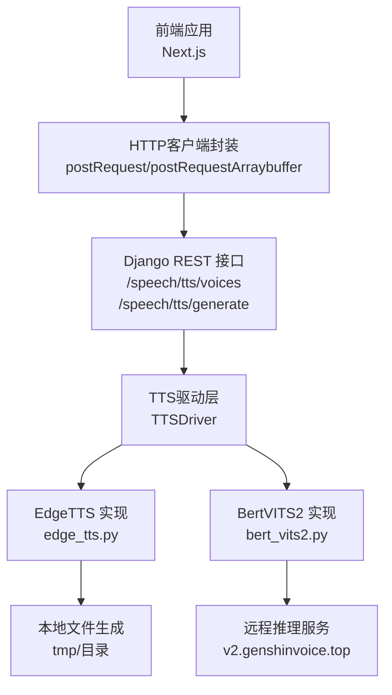
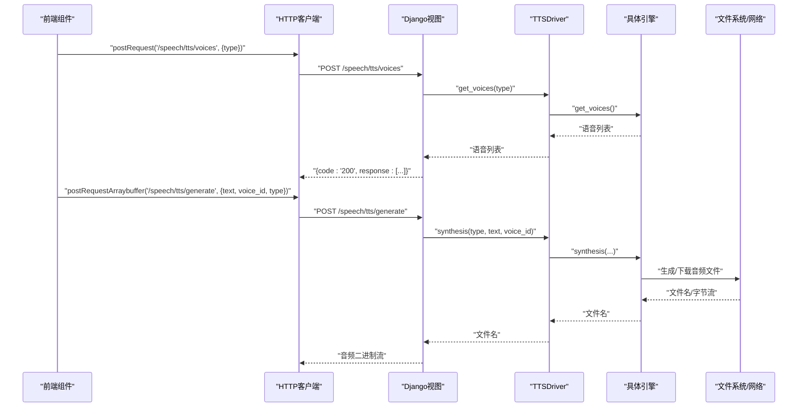
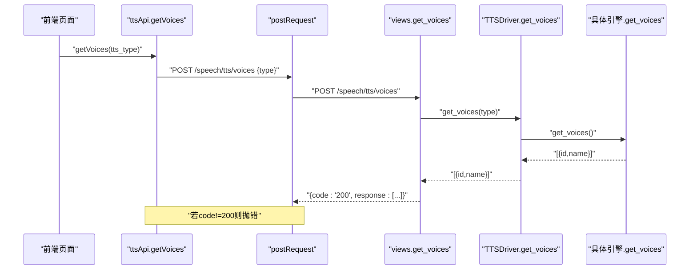
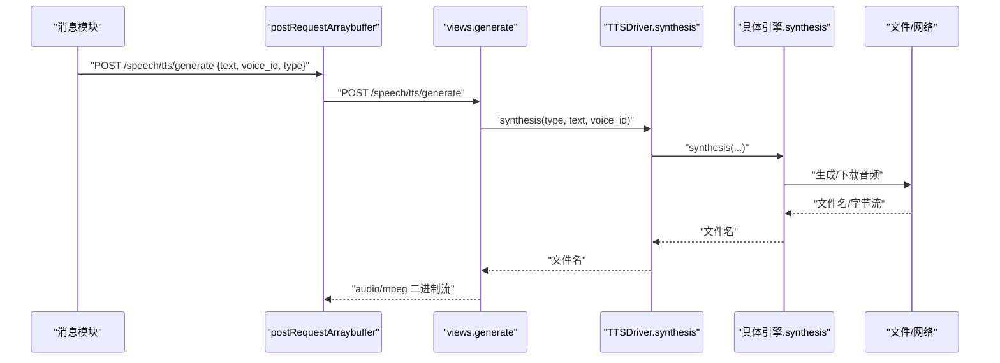
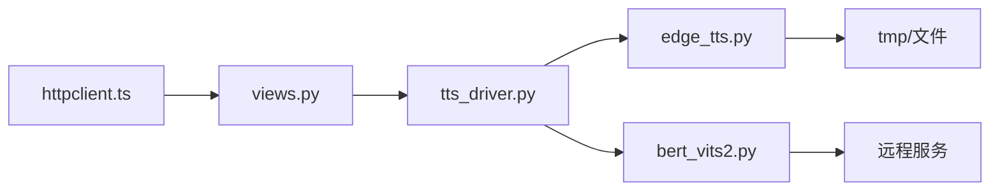

# TTS API集成

<cite>
**本文引用的文件**
- [domain-chatvrm/src/features/tts/ttsApi.ts](file://domain-chatvrm/src/features/tts/ttsApi.ts)
- [domain-chatvrm/src/features/httpclient/httpclient.ts](file://domain-chatvrm/src/features/httpclient/httpclient.ts)
- [domain-chatvrm/src/features/messages/speakCharacter.ts](file://domain-chatvrm/src/features/messages/speakCharacter.ts)
- [domain-chatvrm/src/pages/api/tts.ts](file://domain-chatvrm/src/pages/api/tts.ts)
- [domain-chatbot/apps/speech/views.py](file://domain-chatbot/apps/speech/views.py)
- [domain-chatbot/apps/speech/urls.py](file://domain-chatbot/apps/speech/urls.py)
- [domain-chatbot/apps/speech/tts/tts_driver.py](file://domain-chatbot/apps/speech/tts/tts_driver.py)
- [domain-chatbot/apps/speech/tts/edge_tts.py](file://domain-chatbot/apps/speech/tts/edge_tts.py)
- [domain-chatbot/apps/speech/tts/bert_vits2.py](file://domain-chatbot/apps/speech/tts/bert_vits2.py)
- [domain-chatbot/apps/speech/utils/uuid_generator.py](file://domain-chatbot/apps/speech/utils/uuid_generator.py)
- [domain-chatvrm/src/features/config/configApi.ts](file://domain-chatvrm/src/features/config/configApi.ts)
- [domain-chatvrm/src/components/settings.tsx](file://domain-chatvrm/src/components/settings.tsx)
- [domain-chatvrm/src/features/translation/translationApi.ts](file://domain-chatvrm/src/features/translation/translationApi.ts)
</cite>

## 目录
1. [简介](#简介)
2. [项目结构](#项目结构)
3. [核心组件](#核心组件)
4. [架构总览](#架构总览)
5. [详细组件分析](#详细组件分析)
6. [依赖分析](#依赖分析)
7. [性能考虑](#性能考虑)
8. [故障排查指南](#故障排查指南)
9. [结论](#结论)
10. [附录](#附录)

## 简介
本技术文档面向前端开发者，系统性讲解虚拟女友项目的TTS（语音合成）API集成方案。内容覆盖语音列表获取与语音合成调用机制，包括：
- getVoices 函数的实现原理与调用流程
- HTTP 请求构建、响应数据处理与类型安全
- 语音数据结构定义与异步处理模式
- 错误处理、重试策略、超时与并发控制建议
- 调试技巧与最佳实践

## 项目结构
前端通过 Next.js 应用发起HTTP请求，后端使用 Django REST Framework 提供TTS服务接口；TTS内部通过驱动层适配不同引擎（Edge、Bert-VITS2），并进行本地或远程语音生成。

图表来源
- [domain-chatvrm/src/features/httpclient/httpclient.ts](file://domain-chatvrm/src/features/httpclient/httpclient.ts#L21-L39)
- [domain-chatbot/apps/speech/views.py](file://domain-chatbot/apps/speech/views.py#L16-L47)
- [domain-chatbot/apps/speech/tts/tts_driver.py](file://domain-chatbot/apps/speech/tts/tts_driver.py#L54-L73)
- [domain-chatbot/apps/speech/tts/edge_tts.py](file://domain-chatbot/apps/speech/tts/edge_tts.py#L27-L50)
- [domain-chatbot/apps/speech/tts/bert_vits2.py](file://domain-chatbot/apps/speech/tts/bert_vits2.py#L621-L644)

章节来源
- [domain-chatvrm/src/features/httpclient/httpclient.ts](file://domain-chatvrm/src/features/httpclient/httpclient.ts#L1-L43)
- [domain-chatbot/apps/speech/urls.py](file://domain-chatbot/apps/speech/urls.py#L1-L8)

## 核心组件
- 前端HTTP客户端：封装POST/GET与ArrayBuffer响应能力，自动根据环境变量拼接基础URL。
- 语音列表获取：getVoices(tts_type) → /speech/tts/voices，返回语音数组。
- 语音合成：fetchAudio(talk, globalConfig) → /speech/tts/generate，返回音频二进制。
- 后端视图：接收JSON请求体，调用单例驱动层，返回统一格式响应。
- 驱动层：根据type选择具体引擎（Edge或Bert-VITS2），统一暴露synthesis与get_voices接口。
- 引擎实现：
  - EdgeTTS：本地edge-tts命令行生成MP3，写入tmp目录。
  - BertVITS2：向远程推理服务提交请求，下载生成的音频文件。

章节来源
- [domain-chatvrm/src/features/tts/ttsApi.ts](file://domain-chatvrm/src/features/tts/ttsApi.ts#L11-L25)
- [domain-chatvrm/src/features/messages/speakCharacter.ts](file://domain-chatvrm/src/features/messages/speakCharacter.ts#L53-L81)
- [domain-chatbot/apps/speech/views.py](file://domain-chatbot/apps/speech/views.py#L16-L47)
- [domain-chatbot/apps/speech/tts/tts_driver.py](file://domain-chatbot/apps/speech/tts/tts_driver.py#L54-L73)

## 架构总览
从前端到后端再到引擎的完整链路如下：

图表来源
- [domain-chatvrm/src/features/httpclient/httpclient.ts](file://domain-chatvrm/src/features/httpclient/httpclient.ts#L21-L39)
- [domain-chatbot/apps/speech/views.py](file://domain-chatbot/apps/speech/views.py#L16-L47)
- [domain-chatbot/apps/speech/tts/tts_driver.py](file://domain-chatbot/apps/speech/tts/tts_driver.py#L54-L73)
- [domain-chatbot/apps/speech/tts/edge_tts.py](file://domain-chatbot/apps/speech/tts/edge_tts.py#L35-L50)
- [domain-chatbot/apps/speech/tts/bert_vits2.py](file://domain-chatbot/apps/speech/tts/bert_vits2.py#L621-L644)

## 详细组件分析

### 1) 语音列表获取：getVoices
- 功能：按引擎类型获取可用语音列表。
- 请求参数：
  - 头部：Content-Type: application/json
  - 请求体：{"type": "Edge" | "Bert-VITS2"}
- 响应结构：{"code":"200","response":[{id,name}]}
- 类型安全：前端定义了Voice类型，确保UI渲染与后续调用一致。
- 错误处理：非200时抛出异常，调用方需捕获。

图表来源
- [domain-chatvrm/src/features/tts/ttsApi.ts](file://domain-chatvrm/src/features/tts/ttsApi.ts#L11-L25)
- [domain-chatbot/apps/speech/views.py](file://domain-chatbot/apps/speech/views.py#L53-L57)
- [domain-chatbot/apps/speech/tts/tts_driver.py](file://domain-chatbot/apps/speech/tts/tts_driver.py#L63-L65)
- [domain-chatbot/apps/speech/tts/edge_tts.py](file://domain-chatbot/apps/speech/tts/edge_tts.py#L33-L34)
- [domain-chatbot/apps/speech/tts/bert_vits2.py](file://domain-chatbot/apps/speech/tts/bert_vits2.py#L662-L663)

章节来源
- [domain-chatvrm/src/features/tts/ttsApi.ts](file://domain-chatvrm/src/features/tts/ttsApi.ts#L1-L25)
- [domain-chatbot/apps/speech/views.py](file://domain-chatbot/apps/speech/views.py#L53-L57)
- [domain-chatbot/apps/speech/tts/tts_driver.py](file://domain-chatbot/apps/speech/tts/tts_driver.py#L54-L73)

### 2) 语音合成：fetchAudio
- 功能：根据全局配置与对白文本生成音频并返回二进制。
- 请求参数：
  - 头部：Content-Type: application/json
  - 请求体：{"text": "...", "voice_id": "...", "type": "Edge"|"Bert-VITS2"}
- 响应：ArrayBuffer（音频二进制），用于播放或缓存。
- 并发控制：内部通过Promise串行队列避免频繁I/O与并发冲突。

图表来源
- [domain-chatvrm/src/features/messages/speakCharacter.ts](file://domain-chatvrm/src/features/messages/speakCharacter.ts#L53-L81)
- [domain-chatbot/apps/speech/views.py](file://domain-chatbot/apps/speech/views.py#L16-L47)
- [domain-chatbot/apps/speech/tts/tts_driver.py](file://domain-chatbot/apps/speech/tts/tts_driver.py#L57-L61)
- [domain-chatbot/apps/speech/tts/edge_tts.py](file://domain-chatbot/apps/speech/tts/edge_tts.py#L35-L50)
- [domain-chatbot/apps/speech/tts/bert_vits2.py](file://domain-chatbot/apps/speech/tts/bert_vits2.py#L621-L644)

章节来源
- [domain-chatvrm/src/features/messages/speakCharacter.ts](file://domain-chatvrm/src/features/messages/speakCharacter.ts#L1-L82)
- [domain-chatbot/apps/speech/views.py](file://domain-chatbot/apps/speech/views.py#L16-L47)

### 3) HTTP客户端与环境配置
- 基础URL根据NODE_ENV自动切换：
  - development: http://localhost:8000
  - production: /api/chatbot
- 支持：
  - postRequest(endpoint, headers, data) → 返回JSON
  - postRequestArraybuffer(endpoint, headers, data) → 返回ArrayBuffer
  - getRequest(endpoint, headers) → 返回JSON
- 媒体资源URL：buildMediaUrl用于拼接静态资源路径。

章节来源
- [domain-chatvrm/src/features/httpclient/httpclient.ts](file://domain-chatvrm/src/features/httpclient/httpclient.ts#L1-L43)

### 4) 数据模型与类型安全
- 语音项类型：id与name字符串，前端通过类型别名约束。
- 全局配置：包含ttsType与ttsVoiceId，用于决定引擎与语音。
- 建议：
  - 在调用前校验globalConfig.ttsConfig.ttsType与ttsVoiceId是否有效。
  - 对返回的response进行空值与字段存在性检查。

章节来源
- [domain-chatvrm/src/features/tts/ttsApi.ts](file://domain-chatvrm/src/features/tts/ttsApi.ts#L5-L9)
- [domain-chatvrm/src/features/config/configApi.ts](file://domain-chatvrm/src/features/config/configApi.ts#L59-L62)
- [domain-chatvrm/src/components/settings.tsx](file://domain-chatvrm/src/components/settings.tsx#L232-L273)

### 5) 引擎实现与差异
- EdgeTTS：
  - 本地命令行生成MP3，写入tmp目录，返回文件名。
  - 适合Windows/Mac平台，无需外部Token。
- Bert-VITS2：
  - 远程推理服务，提交参数后下载音频文件。
  - 需要网络访问，支持大量角色。
- 驱动层统一接口，便于扩展其他引擎。

章节来源
- [domain-chatbot/apps/speech/tts/edge_tts.py](file://domain-chatbot/apps/speech/tts/edge_tts.py#L27-L50)
- [domain-chatbot/apps/speech/tts/bert_vits2.py](file://domain-chatbot/apps/speech/tts/bert_vits2.py#L621-L644)
- [domain-chatbot/apps/speech/tts/tts_driver.py](file://domain-chatbot/apps/speech/tts/tts_driver.py#L23-L51)

### 6) 辅助接口与工具
- 配置接口：获取/保存全局配置（含TTS设置）。
- 设置界面：支持选择TTS引擎与语音模型，并联动更新配置。
- 翻译接口：预留翻译能力（当前直接返回原文）。

章节来源
- [domain-chatvrm/src/features/config/configApi.ts](file://domain-chatvrm/src/features/config/configApi.ts#L68-L100)
- [domain-chatvrm/src/components/settings.tsx](file://domain-chatvrm/src/components/settings.tsx#L232-L273)
- [domain-chatvrm/src/features/translation/translationApi.ts](file://domain-chatvrm/src/features/translation/translationApi.ts#L1-L23)

## 依赖分析
- 前端依赖axios，运行时根据环境变量选择后端地址。
- 后端依赖rest_framework与自定义驱动层，路由集中在speech应用。
- 引擎侧依赖：
  - EdgeTTS：edge-tts命令行与本地文件系统。
  - BertVITS2：第三方推理服务与网络请求库。

图表来源
- [domain-chatvrm/src/features/httpclient/httpclient.ts](file://domain-chatvrm/src/features/httpclient/httpclient.ts#L1-L43)
- [domain-chatbot/apps/speech/views.py](file://domain-chatbot/apps/speech/views.py#L1-L14)
- [domain-chatbot/apps/speech/tts/tts_driver.py](file://domain-chatbot/apps/speech/tts/tts_driver.py#L1-L74)
- [domain-chatbot/apps/speech/tts/edge_tts.py](file://domain-chatbot/apps/speech/tts/edge_tts.py#L1-L51)
- [domain-chatbot/apps/speech/tts/bert_vits2.py](file://domain-chatbot/apps/speech/tts/bert_vits2.py#L1-L669)

章节来源
- [domain-chatbot/apps/speech/urls.py](file://domain-chatbot/apps/speech/urls.py#L1-L8)
- [domain-chatbot/apps/speech/views.py](file://domain-chatbot/apps/speech/views.py#L1-L14)

## 性能考虑
- 并发控制
  - 消息模块内部已通过Promise串行队列限制并发，避免频繁I/O与重复请求。
  - 建议在业务层避免同时触发多个合成任务，优先串行或合并请求。
- 缓存策略
  - 可对相同文本+语音组合的结果进行本地缓存（基于文件名），命中则直接复用。
- 超时与重试
  - HTTP客户端未内置超时/重试，可在调用处包装一层，设置合理超时（如5-10秒）与指数退避重试（最多2-3次）。
- 文件清理
  - 后端生成的临时文件会在读取后删除，注意避免并发读取导致的文件不存在错误。

章节来源
- [domain-chatvrm/src/features/messages/speakCharacter.ts](file://domain-chatvrm/src/features/messages/speakCharacter.ts#L11-L49)
- [domain-chatbot/apps/speech/views.py](file://domain-chatbot/apps/speech/views.py#L49-L51)

## 故障排查指南
- 常见错误与定位
  - getVoices返回非200：检查type参数是否为"Edge"或"Bert-VITS2"，确认后端路由与驱动层映射。
  - fetchAudio失败：检查globalConfig.ttsConfig.ttsType与ttsVoiceId是否匹配；确认引擎可用性（Edge需要edge-tts命令，Bert-VITS2需要网络）。
  - 404/路由错误：确认Django路由包含speech应用，且URL包含speech前缀。
- 日志与调试
  - 后端视图记录异常日志，前端捕获异常并提示用户。
  - 使用浏览器Network面板查看请求头、请求体与响应体；确认Content-Type与响应类型。
- 环境变量
  - NODE_ENV影响基础URL，开发环境需确保后端服务在本地8000端口可用。

章节来源
- [domain-chatbot/apps/speech/views.py](file://domain-chatbot/apps/speech/views.py#L45-L47)
- [domain-chatvrm/src/features/httpclient/httpclient.ts](file://domain-chatvrm/src/features/httpclient/httpclient.ts#L11-L19)

## 结论
本方案以清晰的前后端分层与统一的驱动接口实现了多引擎TTS能力。前端通过HTTP客户端与后端REST接口交互，后端再委派给具体引擎完成语音生成。建议在生产环境中完善超时/重试、并发控制与缓存策略，并持续监控日志与网络依赖稳定性。

## 附录

### A. API定义与调用示例（路径参考）
- 获取语音列表
  - 方法：POST
  - 路径：/speech/tts/voices
  - 请求体：{"type":"Edge"|"Bert-VITS2"}
  - 响应：{"code":"200","response":[{"id":"...","name":"..."}]}
  - 调用位置：[domain-chatvrm/src/features/tts/ttsApi.ts](file://domain-chatvrm/src/features/tts/ttsApi.ts#L11-L25)
- 语音合成
  - 方法：POST
  - 路径：/speech/tts/generate
  - 请求体：{"text":"...","voice_id":"...","type":"Edge"|"Bert-VITS2"}
  - 响应：audio/mpeg（二进制）
  - 调用位置：[domain-chatvrm/src/features/messages/speakCharacter.ts](file://domain-chatvrm/src/features/messages/speakCharacter.ts#L53-L81)
- 后端路由
  - 路由注册：[domain-chatbot/apps/speech/urls.py](file://domain-chatbot/apps/speech/urls.py#L1-L8)
- 驱动层与引擎
  - 驱动：[domain-chatbot/apps/speech/tts/tts_driver.py](file://domain-chatbot/apps/speech/tts/tts_driver.py#L54-L73)
  - Edge实现：[domain-chatbot/apps/speech/tts/edge_tts.py](file://domain-chatbot/apps/speech/tts/edge_tts.py#L27-L50)
  - Bert-VITS2实现：[domain-chatbot/apps/speech/tts/bert_vits2.py](file://domain-chatbot/apps/speech/tts/bert_vits2.py#L621-L644)

### B. 错误码与状态码
- 统一响应结构：{"code":"200","response":...}
- 成功：code为"200"
- 失败：后端视图返回500或抛出异常，前端需捕获并提示

章节来源
- [domain-chatbot/apps/speech/views.py](file://domain-chatbot/apps/speech/views.py#L53-L57)
- [domain-chatbot/apps/speech/views.py](file://domain-chatbot/apps/speech/views.py#L64-L73)