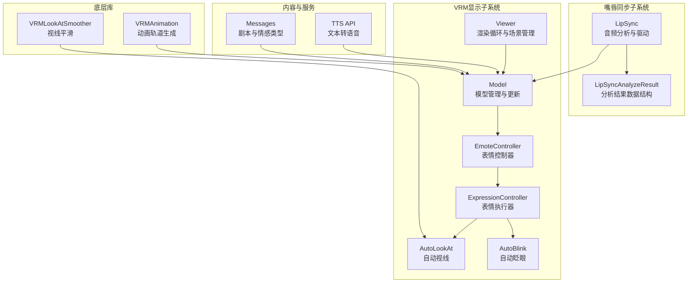
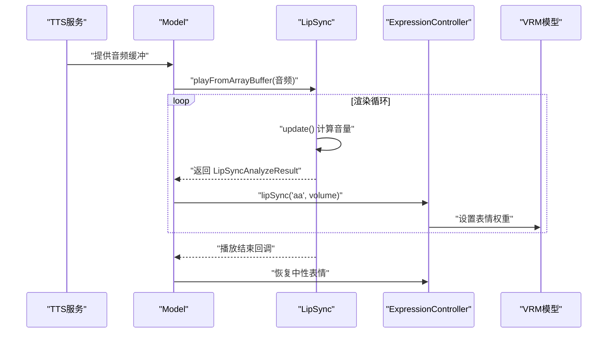
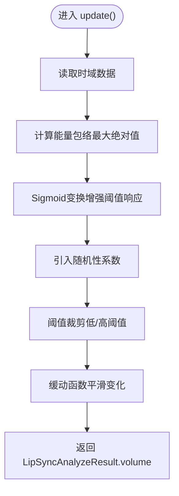
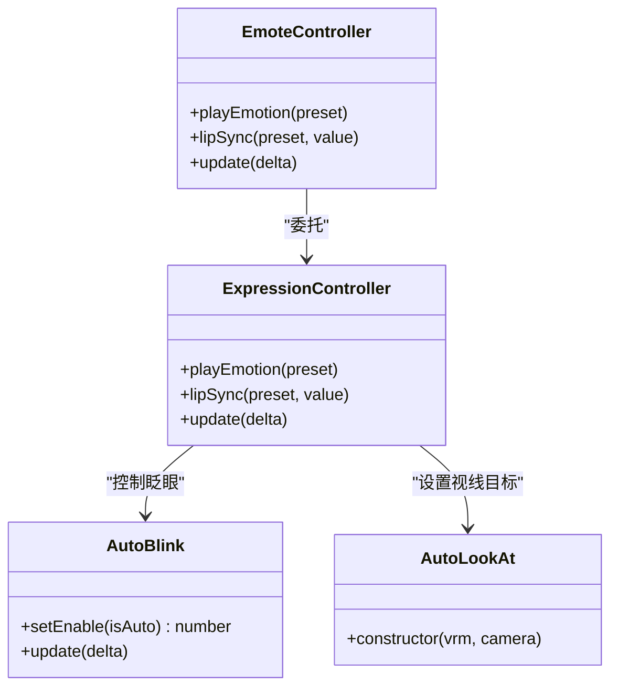
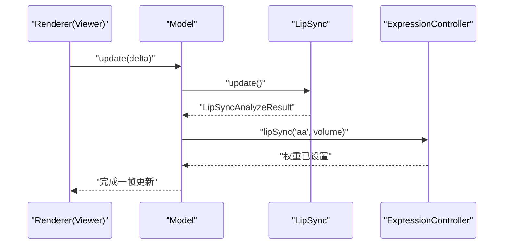
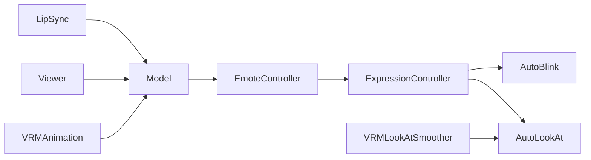

# 嘴唇同步系统

<cite>
**本文档引用的文件**
- [lipSync.ts](file://domain-chatvrm/src/features/lipSync/lipSync.ts)
- [lipSyncAnalyzeResult.ts](file://domain-chatvrm/src/features/lipSync/lipSyncAnalyzeResult.ts)
- [model.ts](file://domain-chatvrm/src/features/vrmViewer/model.ts)
- [viewer.ts](file://domain-chatvrm/src/features/vrmViewer/viewer.ts)
- [expressionController.ts](file://domain-chatvrm/src/features/emoteController/expressionController.ts)
- [emoteController.ts](file://domain-chatvrm/src/features/emoteController/emoteController.ts)
- [autoBlink.ts](file://domain-chatvrm/src/features/emoteController/autoBlink.ts)
- [autoLookAt.ts](file://domain-chatvrm/src/features/emoteController/autoLookAt.ts)
- [emoteConstants.ts](file://domain-chatvrm/src/features/emoteController/emoteConstants.ts)
- [messages.ts](file://domain-chatvrm/src/features/messages/messages.ts)
- [ttsApi.ts](file://domain-chatvrm/src/features/tts/ttsApi.ts)
- [VRMLookAtSmoother.ts](file://domain-chatvrm/src/lib/VRMLookAtSmootherLoaderPlugin/VRMLookAtSmoother.ts)
- [VRMAnimation.ts](file://domain-chatvrm/src/lib/VRMAnimation/VRMAnimation.ts)
- [package.json](file://domain-chatvrm/package.json)
</cite>

## 目录
1. [简介](#简介)
2. [项目结构](#项目结构)
3. [核心组件](#核心组件)
4. [架构总览](#架构总览)
5. [详细组件分析](#详细组件分析)
6. [依赖关系分析](#依赖关系分析)
7. [性能考虑](#性能考虑)
8. [故障排除指南](#故障排除指南)
9. [结论](#结论)
10. [附录](#附录)

## 简介
本技术文档针对嘴唇同步系统进行全面解析，涵盖从音频到面部动画的完整同步链路：音频特征提取（基于时域数据分析）、时间轴对齐策略、帧率匹配与插值、口型关键帧生成与权重映射、同步精度控制、实时处理流程（音频缓冲、延迟补偿）以及性能优化策略。同时提供配置参数建议、调试工具与监控方法、常见问题解决方案，并给出面向开发者的集成实现指南。

## 项目结构
嘴唇同步系统位于前端聊天VRM模块中，采用功能域划分清晰的组织方式：
- lipSync：音频分析与嘴唇同步驱动
- vrmViewer：VRM模型加载、动画混播与渲染循环
- emoteController：表情控制（含自动眨眼、自动视线）
- messages：剧本与情感表达类型定义
- tts：文本转语音接口
- lib：VRM动画与视线平滑插件

图表来源
- [lipSync.ts](file://domain-chatvrm/src/features/lipSync/lipSync.ts#L1-L80)
- [lipSyncAnalyzeResult.ts](file://domain-chatvrm/src/features/lipSync/lipSyncAnalyzeResult.ts#L1-L4)
- [model.ts](file://domain-chatvrm/src/features/vrmViewer/model.ts#L1-L135)
- [viewer.ts](file://domain-chatvrm/src/features/vrmViewer/viewer.ts#L1-L205)
- [expressionController.ts](file://domain-chatvrm/src/features/emoteController/expressionController.ts#L1-L77)
- [emoteController.ts](file://domain-chatvrm/src/features/emoteController/emoteController.ts#L1-L27)
- [autoBlink.ts](file://domain-chatvrm/src/features/emoteController/autoBlink.ts#L1-L65)
- [autoLookAt.ts](file://domain-chatvrm/src/features/emoteController/autoLookAt.ts#L1-L18)
- [messages.ts](file://domain-chatvrm/src/features/messages/messages.ts#L1-L80)
- [ttsApi.ts](file://domain-chatvrm/src/features/tts/ttsApi.ts#L1-L26)
- [VRMLookAtSmoother.ts](file://domain-chatvrm/src/lib/VRMLookAtSmootherLoaderPlugin/VRMLookAtSmoother.ts#L73-L154)
- [VRMAnimation.ts](file://domain-chatvrm/src/lib/VRMAnimation/VRMAnimation.ts#L40-L87)

章节来源
- [lipSync.ts](file://domain-chatvrm/src/features/lipSync/lipSync.ts#L1-L80)
- [model.ts](file://domain-chatvrm/src/features/vrmViewer/model.ts#L1-L135)
- [viewer.ts](file://domain-chatvrm/src/features/vrmViewer/viewer.ts#L1-L205)

## 核心组件
- 嘴唇同步分析器（LipSync）：负责从Web Audio API获取时域数据，计算能量包络并应用非线性变换与缓动，输出同步强度值。
- 分析结果数据结构（LipSyncAnalyzeResult）：标准化输出字段，当前包含音量强度。
- 表情控制器（EmoteController/ExpressionController）：接收同步强度，映射到VRM表情预设（如"aa"），并结合当前情绪状态进行权重融合。
- 自动眨眼（AutoBlink）：在表情切换时避免不自然的闭眼状态，确保眨眼自然过渡。
- 自动视线（AutoLookAt）：配合VRMLookAtSmoother实现头部自然转动与萨克斯德运动。
- VRM模型与渲染（Model/Viewer）：统一管理VRM加载、动画混播、更新循环与渲染。
- 剧本与TTS（Messages/TTS API）：定义情感表达类型，提供文本转语音能力以驱动嘴唇同步。

章节来源
- [lipSync.ts](file://domain-chatvrm/src/features/lipSync/lipSync.ts#L1-L80)
- [lipSyncAnalyzeResult.ts](file://domain-chatvrm/src/features/lipSync/lipSyncAnalyzeResult.ts#L1-L4)
- [emoteController.ts](file://domain-chatvrm/src/features/emoteController/emoteController.ts#L1-L27)
- [expressionController.ts](file://domain-chatvrm/src/features/emoteController/expressionController.ts#L1-L77)
- [autoBlink.ts](file://domain-chatvrm/src/features/emoteController/autoBlink.ts#L1-L65)
- [autoLookAt.ts](file://domain-chatvrm/src/features/emoteController/autoLookAt.ts#L1-L18)
- [model.ts](file://domain-chatvrm/src/features/vrmViewer/model.ts#L1-L135)
- [viewer.ts](file://domain-chatvrm/src/features/vrmViewer/viewer.ts#L1-L205)
- [messages.ts](file://domain-chatvrm/src/features/messages/messages.ts#L1-L80)
- [ttsApi.ts](file://domain-chatvrm/src/features/tts/ttsApi.ts#L1-L26)

## 架构总览
嘴唇同步系统通过Web Audio API采集音频，经LipSync分析得到音量强度，再由ExpressionController映射到VRM表情权重，最终在每帧渲染循环中更新模型表情。TTS服务提供音频源，Model封装播放与同步逻辑，Viewer维持渲染循环。

图表来源
- [model.ts](file://domain-chatvrm/src/features/vrmViewer/model.ts#L111-L119)
- [lipSync.ts](file://domain-chatvrm/src/features/lipSync/lipSync.ts#L51-L78)
- [expressionController.ts](file://domain-chatvrm/src/features/emoteController/expressionController.ts#L53-L75)

## 详细组件分析

### 嘴唇同步分析器（LipSync）
- 功能职责
  - 创建AudioContext与AnalyserNode，分配时域数据缓冲区
  - 每帧读取时域数据，计算最大绝对值作为能量包络
  - 应用Sigmoid类非线性变换增强阈值响应
  - 引入随机性系数避免机械式同步
  - 对输出进行阈值裁剪与缓动平滑，提升自然度
  - 提供从ArrayBuffer与URL播放音频的能力，并在播放结束后触发回调
- 数据结构
  - 输入：Float32Array时域样本
  - 输出：LipSyncAnalyzeResult（当前仅包含volume）
- 复杂度
  - 单帧O(N)，N为时域样本长度（固定窗口大小）
- 关键路径
  - update()：时域采样 → 能量包络 → Sigmoid变换 → 随机性 → 阈值裁剪 → 缓动 → 返回结果
  - playFromArrayBuffer()/playFromURL()：解码音频 → 连接destination与analyser → 播放 → ended事件回调

图表来源
- [lipSync.ts](file://domain-chatvrm/src/features/lipSync/lipSync.ts#L18-L41)

章节来源
- [lipSync.ts](file://domain-chatvrm/src/features/lipSync/lipSync.ts#L1-L80)
- [lipSyncAnalyzeResult.ts](file://domain-chatvrm/src/features/lipSync/lipSyncAnalyzeResult.ts#L1-L4)

### 表情控制器（EmoteController/ExpressionController）
- 功能职责
  - 接收preset与value，维护当前嘴唇同步状态
  - 结合当前情绪状态动态计算权重（中性时更强，其他情绪时减弱）
  - 控制自动眨眼启用/禁用时机，避免闭眼时的表情切换造成不自然
  - 将权重写入VRM表情管理器
- 关键路径
  - lipSync(preset, value)：保存当前嘴唇同步状态
  - update(delta)：根据当前情绪与嘴唇同步值设置表情权重

图表来源
- [emoteController.ts](file://domain-chatvrm/src/features/emoteController/emoteController.ts#L1-L27)
- [expressionController.ts](file://domain-chatvrm/src/features/emoteController/expressionController.ts#L1-L77)
- [autoBlink.ts](file://domain-chatvrm/src/features/emoteController/autoBlink.ts#L1-L65)
- [autoLookAt.ts](file://domain-chatvrm/src/features/emoteController/autoLookAt.ts#L1-L18)

章节来源
- [emoteController.ts](file://domain-chatvrm/src/features/emoteController/emoteController.ts#L1-L27)
- [expressionController.ts](file://domain-chatvrm/src/features/emoteController/expressionController.ts#L1-L77)
- [autoBlink.ts](file://domain-chatvrm/src/features/emoteController/autoBlink.ts#L1-L65)
- [autoLookAt.ts](file://domain-chatvrm/src/features/emoteController/autoLookAt.ts#L1-L18)

### VRM模型与渲染循环（Model/Viewer）
- 功能职责
  - 加载VRM模型与动画资源，建立动画混播器
  - 在每帧update中调用LipSync.update()获取音量，传递给表情控制器
  - 控制表情切换与中性恢复，维持动画与表情更新
  - Viewer维持渲染循环，驱动模型与场景更新
- 关键路径
  - Model.update()：读取volume → 表情控制器lipSync → 更新表情/动画/VRM
  - Viewer.update()：requestAnimationFrame循环 → 调用Model.update() → 渲染

图表来源
- [viewer.ts](file://domain-chatvrm/src/features/vrmViewer/viewer.ts#L177-L183)
- [model.ts](file://domain-chatvrm/src/features/vrmViewer/model.ts#L125-L134)

章节来源
- [model.ts](file://domain-chatvrm/src/features/vrmViewer/model.ts#L1-L135)
- [viewer.ts](file://domain-chatvrm/src/features/vrmViewer/viewer.ts#L1-L205)

### 剧本与TTS集成（Messages/TTS API）
- 功能职责
  - Messages定义屏幕剧本文本、情感类型与说话风格
  - TTS API提供声音列表与语音数据获取能力
  - Model.speak()将音频缓冲与剧本情感结合，驱动嘴唇同步
- 关键路径
  - textsToScreenplay()：文本切分与情感映射
  - getVoices()/voiceData：获取可用语音
  - Model.speak()：播放音频 → 同步结束 → 恢复中性表情

章节来源
- [messages.ts](file://domain-chatvrm/src/features/messages/messages.ts#L1-L80)
- [ttsApi.ts](file://domain-chatvrm/src/features/tts/ttsApi.ts#L1-L26)
- [model.ts](file://domain-chatvrm/src/features/vrmViewer/model.ts#L111-L119)

### 视线与动画平滑（VRMLookAtSmoother/VRMAnimation）
- 功能职责
  - VRMLookAtSmoother：实现头部自然转动、萨克斯德运动与阻尼平滑
  - VRMAnimation：生成Humanoid动画轨道（旋转/位移），适配不同版本元数据
- 与嘴唇同步的关系
  - 通过AutoLookAt与LookAtSmoother提升整体自然度，避免同步过程中的僵硬感

章节来源
- [VRMLookAtSmoother.ts](file://domain-chatvrm/src/lib/VRMLookAtSmootherLoaderPlugin/VRMLookAtSmoother.ts#L73-L154)
- [VRMAnimation.ts](file://domain-chatvrm/src/lib/VRMAnimation/VRMAnimation.ts#L40-L87)

## 依赖关系分析
- 内部耦合
  - Model依赖LipSync与EmoteController；EmoteController依赖ExpressionController与AutoBlink/AutoLookAt
  - Viewer依赖Model维持渲染循环
- 外部依赖
  - Web Audio API（AudioContext/AnalyserNode）
  - Three.js与@pixiv/three-vrm
  - Next.js（前端框架）

图表来源
- [lipSync.ts](file://domain-chatvrm/src/features/lipSync/lipSync.ts#L1-L80)
- [model.ts](file://domain-chatvrm/src/features/vrmViewer/model.ts#L1-L135)
- [emoteController.ts](file://domain-chatvrm/src/features/emoteController/emoteController.ts#L1-L27)
- [expressionController.ts](file://domain-chatvrm/src/features/emoteController/expressionController.ts#L1-L77)
- [autoBlink.ts](file://domain-chatvrm/src/features/emoteController/autoBlink.ts#L1-L65)
- [autoLookAt.ts](file://domain-chatvrm/src/features/emoteController/autoLookAt.ts#L1-L18)
- [viewer.ts](file://domain-chatvrm/src/features/vrmViewer/viewer.ts#L1-L205)
- [VRMLookAtSmoother.ts](file://domain-chatvrm/src/lib/VRMLookAtSmootherLoaderPlugin/VRMLookAtSmoother.ts#L73-L154)
- [VRMAnimation.ts](file://domain-chatvrm/src/lib/VRMAnimation/VRMAnimation.ts#L40-L87)

章节来源
- [package.json](file://domain-chatvrm/package.json#L13-L32)

## 性能考虑
- 时间复杂度优化
  - LipSync.update()为O(N)扫描，N为固定窗口大小，可通过减少采样长度或降低调用频率进一步优化
- 缓冲与延迟
  - 使用AnalyserNode连接到播放源，确保音频与分析在同一上下文中进行
  - 通过缓动函数减少高频抖动，降低VRM表情更新频率波动
- 渲染循环
  - Viewer使用requestAnimationFrame维持60fps（约16.7ms），Model.update()在每帧调用，确保同步与渲染节奏一致
- 资源管理
  - 动画切换使用fadeIn/fadeOut避免突变，减少视觉闪烁
- 建议
  - 在移动端可适当降低采样窗口或缓动因子
  - 对于长音频，考虑分段播放与预缓冲策略

[本节为通用性能指导，无需特定文件引用]

## 故障排除指南
- 嘴唇同步无响应
  - 检查AudioContext是否正确初始化与连接AnalyserNode
  - 确认playFromArrayBuffer()已成功解码并开始播放
  - 查看update()返回的volume是否被正确传递至表情控制器
- 同步不自然
  - 调整缓动因子与随机性系数，观察smoothness变化
  - 检查当前情绪状态对权重的影响（中性时权重更高）
- 播放结束后表情未恢复
  - 确认Model.speak()的onEnded回调是否触发
  - 检查表情控制器是否在回调中恢复中性表情
- 性能问题
  - 减少Analyser采样长度或降低update频率
  - 检查渲染循环中是否存在额外重计算
  - 使用浏览器性能面板定位瓶颈

章节来源
- [lipSync.ts](file://domain-chatvrm/src/features/lipSync/lipSync.ts#L51-L78)
- [model.ts](file://domain-chatvrm/src/features/vrmViewer/model.ts#L111-L119)
- [expressionController.ts](file://domain-chatvrm/src/features/emoteController/expressionController.ts#L63-L75)

## 结论
该嘴唇同步系统以Web Audio API为核心，通过时域数据分析与非线性变换提取音频能量，结合缓动与阈值裁剪生成平滑的同步信号，并将其映射到VRM表情权重，实现了较为自然的音频到面部动画同步。系统在表情控制器层面充分考虑了情绪状态与眨眼时机，配合视线平滑与动画混播，提升了整体表现。通过合理的参数调节与性能优化策略，可在不同设备上获得稳定且流畅的同步体验。

[本节为总结性内容，无需特定文件引用]

## 附录

### 数据结构与配置参数
- LipSyncAnalyzeResult
  - 字段：volume（数值范围经阈值裁剪与缓动后）
- 配置参数建议
  - 采样窗口长度：根据实时性与精度平衡选择（当前固定窗口）
  - 随机性系数：控制阈值抖动程度，建议0.95~1.05区间微调
  - 缓动因子：控制变化速度，建议0.1~0.5区间
  - 阈值裁剪：低阈值用于静音抑制，高阈值用于饱和控制
  - 权重融合：中性情绪下嘴唇权重更大，其他情绪下适当降低
- 同步精度控制
  - 通过Analyser采样率与update频率控制时间分辨率
  - 使用缓动与平滑函数减少高频噪声
- 实时处理流程
  - 音频缓冲：ArrayBuffer/URL → 解码 → 播放 → 连接Analyser
  - 延迟补偿：在播放开始时记录时间戳，结合渲染循环进行微调
  - 性能优化：降低update频率、减少表情写入次数、使用淡入淡出

章节来源
- [lipSyncAnalyzeResult.ts](file://domain-chatvrm/src/features/lipSync/lipSyncAnalyzeResult.ts#L1-L4)
- [lipSync.ts](file://domain-chatvrm/src/features/lipSync/lipSync.ts#L18-L41)
- [expressionController.ts](file://domain-chatvrm/src/features/emoteController/expressionController.ts#L68-L74)
- [emoteConstants.ts](file://domain-chatvrm/src/features/emoteController/emoteConstants.ts#L1-L5)

### 集成实现指南
- 步骤
  - 初始化AudioContext与AnalyserNode（由LipSync内部完成）
  - 准备VRM模型与表情管理器（由Model完成）
  - 通过TTS获取音频缓冲或直接传入ArrayBuffer
  - 调用Model.speak()播放音频并驱动嘴唇同步
  - 在渲染循环中确保Model.update()被持续调用
- 注意事项
  - 确保音频与Analyser在同一上下文中
  - 在表情切换时考虑眨眼状态，避免不自然
  - 根据设备性能调整update频率与缓动参数

章节来源
- [model.ts](file://domain-chatvrm/src/features/vrmViewer/model.ts#L111-L119)
- [lipSync.ts](file://domain-chatvrm/src/features/lipSync/lipSync.ts#L51-L78)
- [emoteController.ts](file://domain-chatvrm/src/features/emoteController/emoteController.ts#L16-L22)