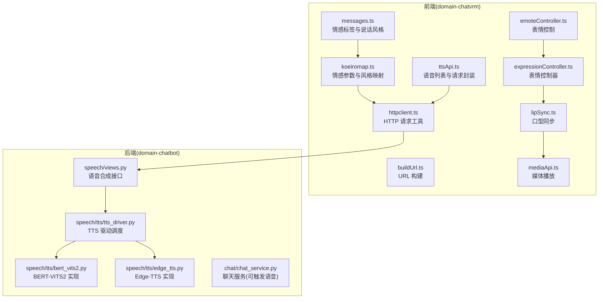
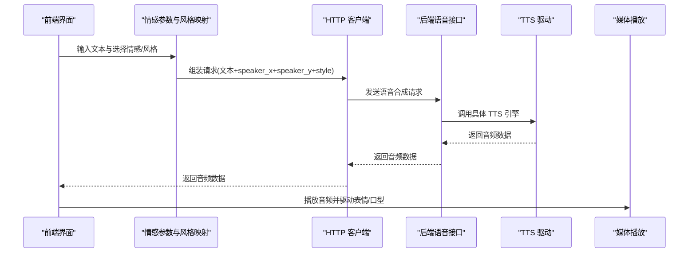
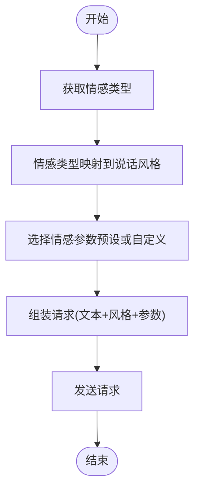
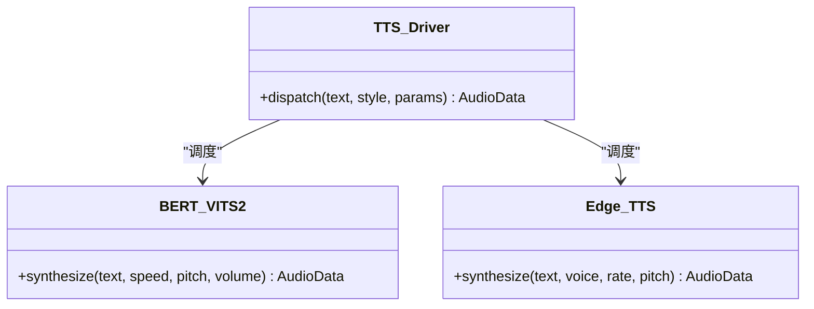
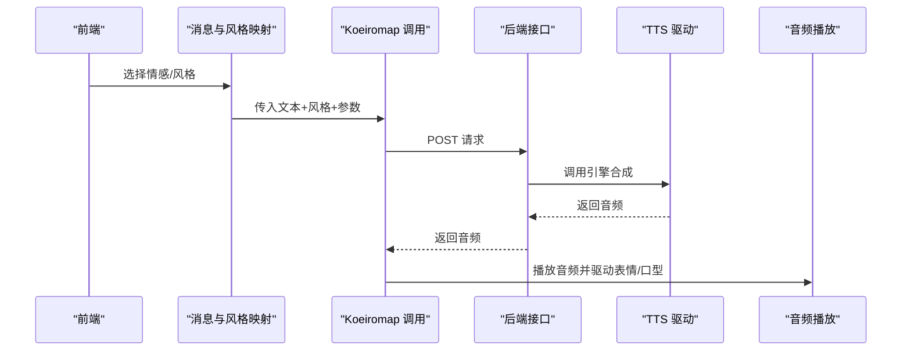
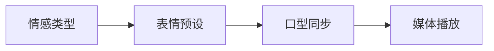
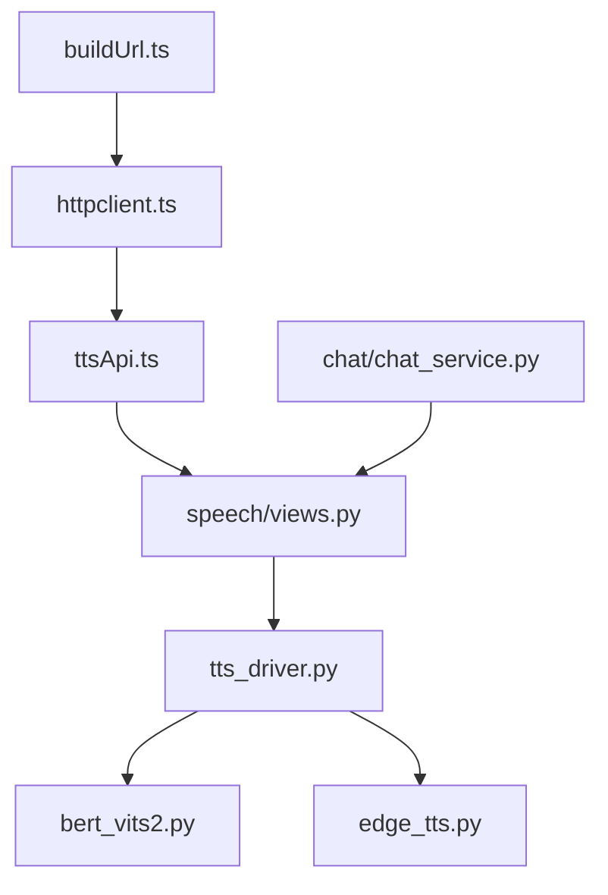

# 情感语音合成

<cite>
**本文引用的文件**
- [koeiromap.ts](file://domain-chatvrm/src/features/koeiromap/koeiromap.ts)
- [koeiroParam.ts](file://domain-chatvrm/src/features/constants/koeiroParam.ts)
- [messages.ts](file://domain-chatvrm/src/features/messages/messages.ts)
- [ttsApi.ts](file://domain-chatvrm/src/features/tts/ttsApi.ts)
- [httpclient.ts](file://domain-chatvrm/src/features/httpclient/httpclient.ts)
- [buildUrl.ts](file://domain-chatvrm/src/utils/buildUrl.ts)
- [tts/views.py](file://domain-chatbot/apps/speech/views.py)
- [tts_driver.py](file://domain-chatbot/apps/speech/tts/tts_driver.py)
- [bert_vits2.py](file://domain-chatbot/apps/speech/tts/bert_vits2.py)
- [edge_tts.py](file://domain-chatbot/apps/speech/tts/edge_tts.py)
- [chat_service.py](file://domain-chatbot/apps/chatbot/chat/chat_service.py)
- [emoteController.ts](file://domain-chatvrm/src/features/emoteController/emoteController.ts)
- [expressionController.ts](file://domain-chatvrm/src/features/emoteController/expressionController.ts)
- [lipSync.ts](file://domain-chatvrm/src/features/lipSync/lipSync.ts)
- [mediaApi.ts](file://domain-chatvrm/src/features/media/mediaApi.ts)
</cite>

## 目录
1. [简介](#简介)
2. [项目结构](#项目结构)
3. [核心组件](#核心组件)
4. [架构总览](#架构总览)
5. [详细组件分析](#详细组件分析)
6. [依赖关系分析](#依赖关系分析)
7. [性能考虑](#性能考虑)
8. [故障排除指南](#故障排除指南)
9. [结论](#结论)
10. [附录](#附录)

## 简介
本技术文档围绕情感语音合成系统展开，重点解析基于 Koeiromap 的情感语音合成实现原理与集成路径。系统通过前端定义情感参数与风格映射，后端进行语音合成与媒体分发，最终驱动 VRM 角色的表情与口型同步。本文将从情感参数映射机制、语音质量控制、情感强度调节、语速与音调控制、情感标签系统、质量评估与调优、个性化配置、集成示例与性能优化等方面进行全面阐述。

## 项目结构
该系统由两部分组成：
- 前端（domain-chatvrm）：负责情感参数与说话风格的定义、请求构建、TTS 语音获取与媒体播放，以及 VRM 表情与口型同步。
- 后端（domain-chatbot）：提供语音合成服务接口，支持多种 TTS 驱动（如 BERT-VITS2、Edge-TTS），并统一对外暴露语音资源。

图表来源
- [koeiromap.ts](file://domain-chatvrm/src/features/koeiromap/koeiromap.ts#L1-L32)
- [messages.ts](file://domain-chatvrm/src/features/messages/messages.ts#L1-L80)
- [ttsApi.ts](file://domain-chatvrm/src/features/tts/ttsApi.ts#L1-L26)
- [httpclient.ts](file://domain-chatvrm/src/features/httpclient/httpclient.ts)
- [buildUrl.ts](file://domain-chatvrm/src/utils/buildUrl.ts)
- [tts/views.py](file://domain-chatbot/apps/speech/views.py)
- [tts_driver.py](file://domain-chatbot/apps/speech/tts/tts_driver.py)
- [bert_vits2.py](file://domain-chatbot/apps/speech/tts/bert_vits2.py)
- [edge_tts.py](file://domain-chatbot/apps/speech/tts/edge_tts.py)
- [emoteController.ts](file://domain-chatvrm/src/features/emoteController/emoteController.ts)
- [expressionController.ts](file://domain-chatvrm/src/features/emoteController/expressionController.ts)
- [lipSync.ts](file://domain-chatvrm/src/features/lipSync/lipSync.ts)
- [mediaApi.ts](file://domain-chatvrm/src/features/media/mediaApi.ts)

章节来源
- [koeiromap.ts](file://domain-chatvrm/src/features/koeiromap/koeiromap.ts#L1-L32)
- [messages.ts](file://domain-chatvrm/src/features/messages/messages.ts#L1-L80)
- [ttsApi.ts](file://domain-chatvrm/src/features/tts/ttsApi.ts#L1-L26)
- [tts/views.py](file://domain-chatbot/apps/speech/views.py)
- [tts_driver.py](file://domain-chatbot/apps/speech/tts/tts_driver.py)
- [bert_vits2.py](file://domain-chatbot/apps/speech/tts/bert_vits2.py)
- [edge_tts.py](file://domain-chatbot/apps/speech/tts/edge_tts.py)

## 核心组件
- 情感参数与风格映射：前端通过情感类型映射到说话风格，并以 speaker_x/speaker_y 参数表达情感强度与音色特征。
- 语音合成驱动：后端统一调度不同 TTS 引擎，提供语音资源。
- 表情与口型同步：根据情感与语音内容驱动 VRM 表情与口型动画。
- 媒体播放：前端接收音频数据并进行播放与渲染。

章节来源
- [koeiroParam.ts](file://domain-chatvrm/src/features/constants/koeiroParam.ts#L1-L30)
- [messages.ts](file://domain-chatvrm/src/features/messages/messages.ts#L11-L79)
- [tts_driver.py](file://domain-chatbot/apps/speech/tts/tts_driver.py)
- [emoteController.ts](file://domain-chatvrm/src/features/emoteController/emoteController.ts)
- [lipSync.ts](file://domain-chatvrm/src/features/lipSync/lipSync.ts)

## 架构总览
系统采用前后端分离架构，前端负责情感与风格的可视化表达，后端负责语音合成与资源管理，最终通过媒体播放器完成声音与视觉的协同输出。

图表来源
- [koeiromap.ts](file://domain-chatvrm/src/features/koeiromap/koeiromap.ts#L3-L31)
- [messages.ts](file://domain-chatvrm/src/features/messages/messages.ts#L44-L66)
- [httpclient.ts](file://domain-chatvrm/src/features/httpclient/httpclient.ts)
- [tts/views.py](file://domain-chatbot/apps/speech/views.py)
- [tts_driver.py](file://domain-chatbot/apps/speech/tts/tts_driver.py)
- [mediaApi.ts](file://domain-chatvrm/src/features/media/mediaApi.ts)

## 详细组件分析

### 情感参数与风格映射
- 情感类型：前端定义了中性、快乐、愤怒、悲伤、放松等情感类型，用于驱动 VRM 表情。
- 说话风格：将情感类型映射到“日常/快乐/悲伤/愤怒/恐惧/惊讶”等风格，作为语音合成的风格输入。
- 情感参数：通过 speaker_x/speaker_y 表达情感强度与音色特征，系统提供默认与多组预设参数，便于快速适配不同角色。

图表来源
- [messages.ts](file://domain-chatvrm/src/features/messages/messages.ts#L28-L79)
- [koeiroParam.ts](file://domain-chatvrm/src/features/constants/koeiroParam.ts#L6-L29)

章节来源
- [messages.ts](file://domain-chatvrm/src/features/messages/messages.ts#L11-L79)
- [koeiroParam.ts](file://domain-chatvrm/src/features/constants/koeiroParam.ts#L1-L30)

### 语音合成驱动与质量控制
- 后端统一调度多种 TTS 引擎，前端通过语音列表接口获取可用语音资源，后端根据请求选择对应引擎生成音频。
- 质量控制可通过情感参数与风格共同影响，同时结合后端引擎的参数（如语速、音调、音色）进行微调。

图表来源
- [tts_driver.py](file://domain-chatbot/apps/speech/tts/tts_driver.py)
- [bert_vits2.py](file://domain-chatbot/apps/speech/tts/bert_vits2.py)
- [edge_tts.py](file://domain-chatbot/apps/speech/tts/edge_tts.py)

章节来源
- [tts/views.py](file://domain-chatbot/apps/speech/views.py)
- [tts_driver.py](file://domain-chatbot/apps/speech/tts/tts_driver.py)
- [bert_vits2.py](file://domain-chatbot/apps/speech/tts/bert_vits2.py)
- [edge_tts.py](file://domain-chatbot/apps/speech/tts/edge_tts.py)

### 前端语音合成流程
- 前端将情感类型转换为说话风格，并携带情感参数发起语音合成请求；后端返回音频数据，前端进行播放与表情/口型同步。

图表来源
- [koeiromap.ts](file://domain-chatvrm/src/features/koeiromap/koeiromap.ts#L3-L31)
- [messages.ts](file://domain-chatvrm/src/features/messages/messages.ts#L44-L66)
- [tts/views.py](file://domain-chatbot/apps/speech/views.py)
- [tts_driver.py](file://domain-chatbot/apps/speech/tts/tts_driver.py)
- [mediaApi.ts](file://domain-chatvrm/src/features/media/mediaApi.ts)

章节来源
- [koeiromap.ts](file://domain-chatvrm/src/features/koeiromap/koeiromap.ts#L1-L32)
- [messages.ts](file://domain-chatvrm/src/features/messages/messages.ts#L1-L80)

### 表情与口型同步
- 表情控制：根据情感类型设置 VRM 表情预设，配合口型同步提升自然度。
- 口型同步：根据语音内容与节奏驱动口型动画，使角色说话更真实。

图表来源
- [messages.ts](file://domain-chatvrm/src/features/messages/messages.ts#L28-L37)
- [emoteController.ts](file://domain-chatvrm/src/features/emoteController/emoteController.ts)
- [expressionController.ts](file://domain-chatvrm/src/features/emoteController/expressionController.ts)
- [lipSync.ts](file://domain-chatvrm/src/features/lipSync/lipSync.ts)
- [mediaApi.ts](file://domain-chatvrm/src/features/media/mediaApi.ts)

章节来源
- [messages.ts](file://domain-chatvrm/src/features/messages/messages.ts#L28-L37)
- [emoteController.ts](file://domain-chatvrm/src/features/emoteController/emoteController.ts)
- [expressionController.ts](file://domain-chatvrm/src/features/emoteController/expressionController.ts)
- [lipSync.ts](file://domain-chatvrm/src/features/lipSync/lipSync.ts)

## 依赖关系分析
- 前端依赖：情感参数与风格映射依赖 URL 构建与 HTTP 请求工具；语音合成依赖后端接口；媒体播放依赖前端媒体 API。
- 后端依赖：语音合成接口依赖 TTS 驱动与具体引擎实现；聊天服务可触发语音合成。

图表来源
- [buildUrl.ts](file://domain-chatvrm/src/utils/buildUrl.ts)
- [httpclient.ts](file://domain-chatvrm/src/features/httpclient/httpclient.ts)
- [ttsApi.ts](file://domain-chatvrm/src/features/tts/ttsApi.ts#L1-L26)
- [tts/views.py](file://domain-chatbot/apps/speech/views.py)
- [tts_driver.py](file://domain-chatbot/apps/speech/tts/tts_driver.py)
- [bert_vits2.py](file://domain-chatbot/apps/speech/tts/bert_vits2.py)
- [edge_tts.py](file://domain-chatbot/apps/speech/tts/edge_tts.py)
- [chat_service.py](file://domain-chatbot/apps/chatbot/chat/chat_service.py)

章节来源
- [ttsApi.ts](file://domain-chatvrm/src/features/tts/ttsApi.ts#L1-L26)
- [tts/views.py](file://domain-chatbot/apps/speech/views.py)
- [tts_driver.py](file://domain-chatbot/apps/speech/tts/tts_driver.py)

## 性能考虑
- 请求批量化：将长文本按句号、换行等断句，减少单次请求时长与失败重试成本。
- 缓存与复用：对常用情感参数与风格组合进行缓存，避免重复计算与网络请求。
- 并发控制：限制并发语音合成请求数，防止后端资源耗尽。
- 媒体预加载：在播放前预加载音频片段，降低首帧延迟。
- 参数调优：根据角色与场景调整 speaker_x/speaker_y 与风格，平衡情感表达与清晰度。

## 故障排除指南
- 语音合成失败：检查后端接口状态与 TTS 引擎可用性；确认请求参数（文本、风格、情感参数）是否合法。
- 媒体播放异常：检查音频格式与播放器兼容性；确认跨域与权限问题。
- 表情/口型不匹配：核对情感类型与风格映射是否一致；检查口型同步算法与音频节拍对齐。
- 网络超时：增加超时时间与重试策略；必要时启用本地缓存。

## 结论
该情感语音合成系统通过明确的情感参数与风格映射、灵活的 TTS 驱动调度、完善的前端媒体与表情同步机制，实现了高质量、可定制的情感语音输出。通过合理的参数调优与性能优化策略，可在不同场景下获得稳定且自然的用户体验。

## 附录
- 集成示例（步骤概述）
  - 前端：选择情感类型，映射为说话风格，组装请求参数（文本、风格、speaker_x/speaker_y），调用语音合成接口。
  - 后端：接收请求，选择 TTS 引擎，生成音频并返回。
  - 媒体：前端播放音频并驱动表情与口型同步。
- 个性化配置
  - 使用预设情感参数或自定义 speaker_x/speaker_y 以适配不同角色。
  - 在后端切换或扩展 TTS 引擎，满足不同语言与音色需求。
- 质量评估与调优
  - 通过主观评测与客观指标（如清晰度、情感一致性、流畅度）持续优化参数与算法。