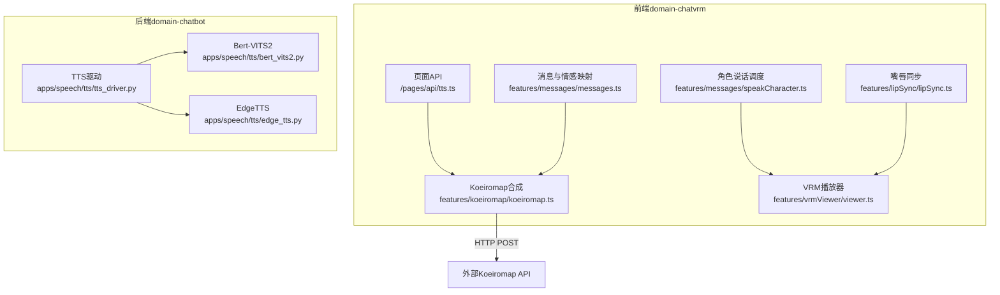
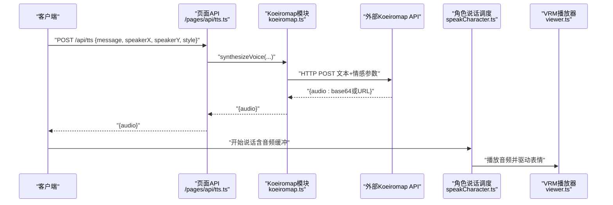
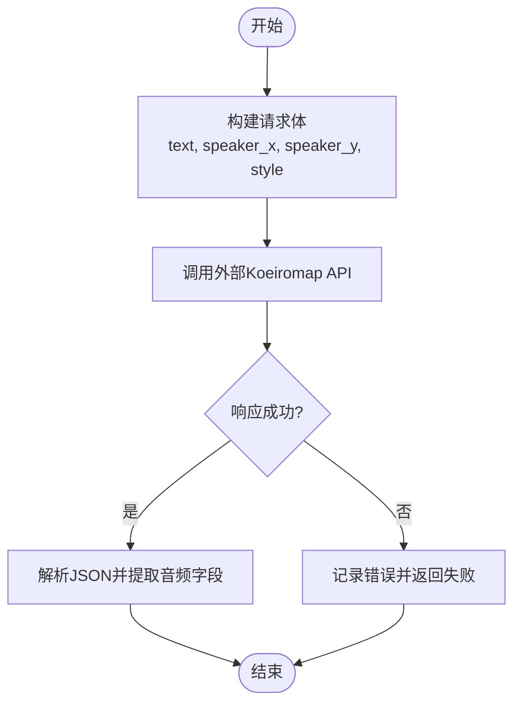
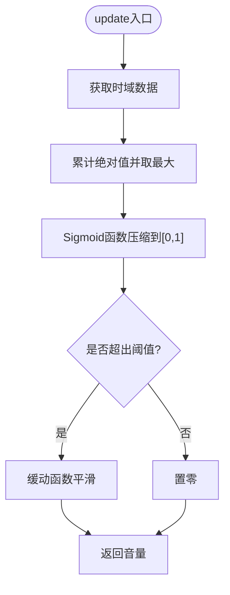
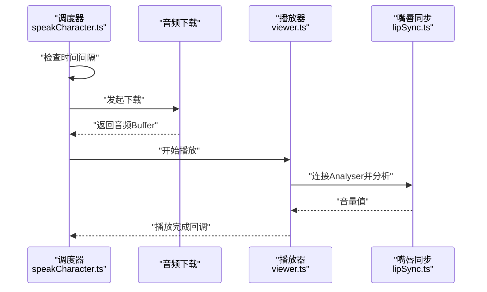
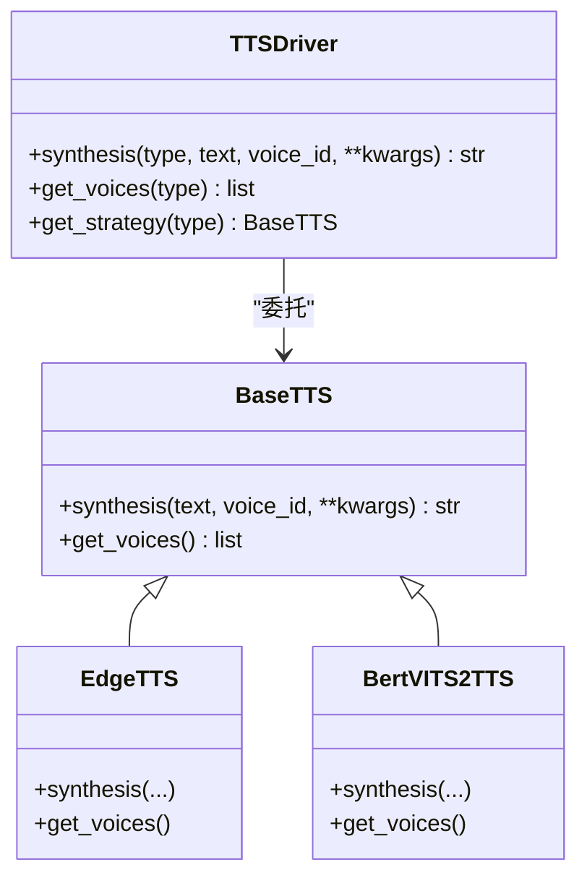
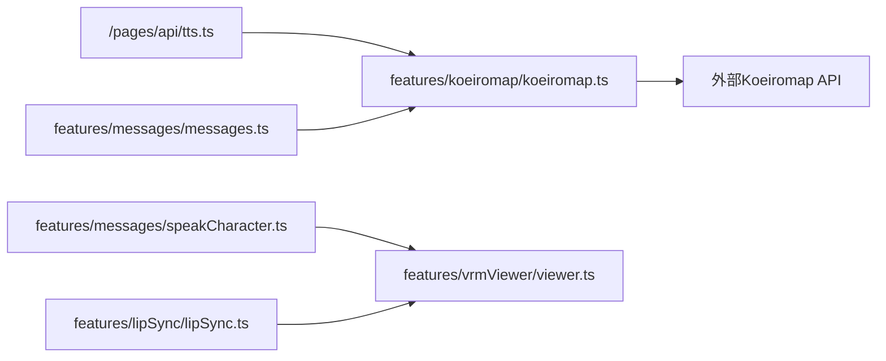

# 语音合成集成

<cite>
**本文引用的文件**
- [domain-chatvrm/src/pages/api/tts.ts](file://domain-chatvrm/src/pages/api/tts.ts)
- [domain-chatvrm/src/features/koeiromap/koeiromap.ts](file://domain-chatvrm/src/features/koeiromap/koeiromap.ts)
- [domain-chatvrm/src/features/messages/messages.ts](file://domain-chatvrm/src/features/messages/messages.ts)
- [domain-chatvrm/src/features/constants/koeiroParam.ts](file://domain-chatvrm/src/features/constants/koeiroParam.ts)
- [domain-chatvrm/src/features/lipSync/lipSync.ts](file://domain-chatvrm/src/features/lipSync/lipSync.ts)
- [domain-chatvrm/src/features/lipSync/lipSyncAnalyzeResult.ts](file://domain-chatvrm/src/features/lipSync/lipSyncAnalyzeResult.ts)
- [domain-chatvrm/src/features/messages/speakCharacter.ts](file://domain-chatvrm/src/features/messages/speakCharacter.ts)
- [domain-chatvrm/src/features/vrmViewer/viewer.ts](file://domain-chatvrm/src/features/vrmViewer/viewer.ts)
- [domain-chatbot/apps/speech/tts/tts_driver.py](file://domain-chatbot/apps/speech/tts/tts_driver.py)
- [domain-chatbot/apps/speech/tts/bert_vits2.py](file://domain-chatbot/apps/speech/tts/bert_vits2.py)
- [domain-chatbot/apps/speech/tts/edge_tts.py](file://domain-chatbot/apps/speech/tts/edge_tts.py)
</cite>

## 目录
1. [简介](#简介)
2. [项目结构](#项目结构)
3. [核心组件](#核心组件)
4. [架构总览](#架构总览)
5. [详细组件分析](#详细组件分析)
6. [依赖分析](#依赖分析)
7. [性能考虑](#性能考虑)
8. [故障排除指南](#故障排除指南)
9. [结论](#结论)
10. [附录](#附录)

## 简介
本技术文档面向前端开发者，系统化介绍虚拟女友（VirtualWife）项目的语音合成集成方案。内容覆盖：
- TTS API 的调用机制、请求参数与响应处理
- Koeiromap 情感语音合成的实现原理与情感参数映射
- 嘴唇同步系统的工作流程：音频分析、帧率匹配、面部动画同步
- 语音播放控制、缓冲管理与并发处理机制
- 性能优化策略：预加载、内存与网络优化
- 实际集成示例、调试工具与故障排除

## 项目结构
本项目采用前后端分离架构：
- 前端（Next.js）位于 domain-chatvrm，负责消息编排、情感映射、TTS 请求、嘴唇同步与 VRM 动画播放
- 后端（Python/Django）位于 domain-chatbot，提供本地 TTS 驱动与第三方服务封装

图表来源
- [domain-chatvrm/src/pages/api/tts.ts](file://domain-chatvrm/src/pages/api/tts.ts#L1-L22)
- [domain-chatvrm/src/features/koeiromap/koeiromap.ts](file://domain-chatvrm/src/features/koeiromap/koeiromap.ts#L1-L32)
- [domain-chatvrm/src/features/messages/messages.ts](file://domain-chatvrm/src/features/messages/messages.ts#L1-L80)
- [domain-chatvrm/src/features/lipSync/lipSync.ts](file://domain-chatvrm/src/features/lipSync/lipSync.ts#L1-L80)
- [domain-chatvrm/src/features/messages/speakCharacter.ts](file://domain-chatvrm/src/features/messages/speakCharacter.ts#L1-L51)
- [domain-chatvrm/src/features/vrmViewer/viewer.ts](file://domain-chatvrm/src/features/vrmViewer/viewer.ts#L1-L205)
- [domain-chatbot/apps/speech/tts/tts_driver.py](file://domain-chatbot/apps/speech/tts/tts_driver.py#L1-L74)
- [domain-chatbot/apps/speech/tts/bert_vits2.py](file://domain-chatbot/apps/speech/tts/bert_vits2.py#L1-L669)
- [domain-chatbot/apps/speech/tts/edge_tts.py](file://domain-chatbot/apps/speech/tts/edge_tts.py#L1-L51)

章节来源
- [domain-chatvrm/src/pages/api/tts.ts](file://domain-chatvrm/src/pages/api/tts.ts#L1-L22)
- [domain-chatbot/apps/speech/tts/tts_driver.py](file://domain-chatbot/apps/speech/tts/tts_driver.py#L1-L74)

## 核心组件
- TTS 页面 API：接收前端请求，转发到 Koeiromap 合成并返回音频数据
- Koeiromap 合成模块：构造请求体，调用外部 API 并解析响应
- 消息与情感映射：将情绪类型映射为说话风格，并生成剧本
- 嘴唇同步：基于 Web Audio Analyser 分析音频能量，驱动面部表情
- 角色说话调度：串行/并发控制音频下载与播放，协调 VRM 表情
- VRM 播放器：渲染与更新 VRM 动画，承载嘴唇同步结果
- 后端 TTS 驱动：统一抽象与策略模式，支持 Edge 与 Bert-VITS2

章节来源
- [domain-chatvrm/src/features/koeiromap/koeiromap.ts](file://domain-chatvrm/src/features/koeiromap/koeiromap.ts#L1-L32)
- [domain-chatvrm/src/features/messages/messages.ts](file://domain-chatvrm/src/features/messages/messages.ts#L1-L80)
- [domain-chatvrm/src/features/lipSync/lipSync.ts](file://domain-chatvrm/src/features/lipSync/lipSync.ts#L1-L80)
- [domain-chatvrm/src/features/messages/speakCharacter.ts](file://domain-chatvrm/src/features/messages/speakCharacter.ts#L1-L51)
- [domain-chatvrm/src/features/vrmViewer/viewer.ts](file://domain-chatvrm/src/features/vrmViewer/viewer.ts#L1-L205)
- [domain-chatbot/apps/speech/tts/tts_driver.py](file://domain-chatbot/apps/speech/tts/tts_driver.py#L1-L74)

## 架构总览
下图展示从前端到后端再到外部服务的整体调用链路与数据流。

图表来源
- [domain-chatvrm/src/pages/api/tts.ts](file://domain-chatvrm/src/pages/api/tts.ts#L1-L22)
- [domain-chatvrm/src/features/koeiromap/koeiromap.ts](file://domain-chatvrm/src/features/koeiromap/koeiromap.ts#L1-L32)
- [domain-chatvrm/src/features/messages/speakCharacter.ts](file://domain-chatvrm/src/features/messages/speakCharacter.ts#L1-L51)
- [domain-chatvrm/src/features/vrmViewer/viewer.ts](file://domain-chatvrm/src/features/vrmViewer/viewer.ts#L1-L205)

## 详细组件分析

### TTS 页面 API（Next.js）
- 输入参数：message、speakerX、speakerY、style
- 处理流程：调用合成函数，返回包含音频字段的 JSON
- 错误处理：当前实现未显式捕获异常；建议在生产环境增加 try/catch 与状态码返回

章节来源
- [domain-chatvrm/src/pages/api/tts.ts](file://domain-chatvrm/src/pages/api/tts.ts#L1-L22)

### Koeiromap 情感语音合成
- 请求参数：text、speaker_x、speaker_y、style
- 调用方式：HTTP POST 到外部 API
- 响应处理：解析 JSON，提取音频字段
- 情感参数映射：通过 messages.ts 中的映射函数将情绪类型转换为说话风格

图表来源
- [domain-chatvrm/src/features/koeiromap/koeiromap.ts](file://domain-chatvrm/src/features/koeiromap/koeiromap.ts#L1-L32)
- [domain-chatvrm/src/features/messages/messages.ts](file://domain-chatvrm/src/features/messages/messages.ts#L68-L79)

章节来源
- [domain-chatvrm/src/features/koeiromap/koeiromap.ts](file://domain-chatvrm/src/features/koeiromap/koeiromap.ts#L1-L32)
- [domain-chatvrm/src/features/messages/messages.ts](file://domain-chatvrm/src/features/messages/messages.ts#L1-L80)

### 消息与情感映射
- 支持的情绪类型与说话风格映射：angry→angry，happy→happy，sad→sad，其余→talk
- 剧本生成：从文本数组生成包含表达与说话信息的剧本序列
- 参数默认值：提供多个 KoeiroParam 预设，便于快速切换

章节来源
- [domain-chatvrm/src/features/messages/messages.ts](file://domain-chatvrm/src/features/messages/messages.ts#L1-L80)
- [domain-chatvrm/src/features/constants/koeiroParam.ts](file://domain-chatvrm/src/features/constants/koeiroParam.ts#L1-L30)

### 嘴唇同步系统
- 音频分析：使用 AnalyserNode 获取时域数据，计算峰值能量
- 平滑处理：应用缓动函数减少突变，提升自然度
- 结果输出：返回音量值，供 VRM 表情驱动使用

图表来源
- [domain-chatvrm/src/features/lipSync/lipSync.ts](file://domain-chatvrm/src/features/lipSync/lipSync.ts#L1-L80)
- [domain-chatvrm/src/features/lipSync/lipSyncAnalyzeResult.ts](file://domain-chatvrm/src/features/lipSync/lipSyncAnalyzeResult.ts#L1-L4)

章节来源
- [domain-chatvrm/src/features/lipSync/lipSync.ts](file://domain-chatvrm/src/features/lipSync/lipSync.ts#L1-L80)
- [domain-chatvrm/src/features/lipSync/lipSyncAnalyzeResult.ts](file://domain-chatvrm/src/features/lipSync/lipSyncAnalyzeResult.ts#L1-L4)

### 角色说话调度与并发控制
- 串行下载：限制单位时间内请求次数，避免过载
- 并发播放：同时等待音频下载与上一次播放完成，确保连续性
- 生命周期回调：开始与完成事件用于驱动 UI 与动画

图表来源
- [domain-chatvrm/src/features/messages/speakCharacter.ts](file://domain-chatvrm/src/features/messages/speakCharacter.ts#L1-L51)
- [domain-chatvrm/src/features/vrmViewer/viewer.ts](file://domain-chatvrm/src/features/vrmViewer/viewer.ts#L1-L205)
- [domain-chatvrm/src/features/lipSync/lipSync.ts](file://domain-chatvrm/src/features/lipSync/lipSync.ts#L1-L80)

章节来源
- [domain-chatvrm/src/features/messages/speakCharacter.ts](file://domain-chatvrm/src/features/messages/speakCharacter.ts#L1-L51)

### VRM 播放器与动画同步
- 场景与渲染：初始化场景、光源、相机与渲染器
- 动画加载：加载 Mixamo 动作与 VRM 动画，设置循环与过渡
- 相机与对焦：根据头部节点动态调整相机位置
- 更新循环：每帧更新 VRM 组件并渲染

章节来源
- [domain-chatvrm/src/features/vrmViewer/viewer.ts](file://domain-chatvrm/src/features/vrmViewer/viewer.ts#L1-L205)

### 后端 TTS 驱动（本地/第三方）
- 抽象接口：统一 synthesis 与 get_voices
- 策略模式：Edge 与 Bert-VITS2 两种实现
- 参数传递：噪声、音色等参数透传至具体实现

图表来源
- [domain-chatbot/apps/speech/tts/tts_driver.py](file://domain-chatbot/apps/speech/tts/tts_driver.py#L1-L74)
- [domain-chatbot/apps/speech/tts/bert_vits2.py](file://domain-chatbot/apps/speech/tts/bert_vits2.py#L1-L669)
- [domain-chatbot/apps/speech/tts/edge_tts.py](file://domain-chatbot/apps/speech/tts/edge_tts.py#L1-L51)

章节来源
- [domain-chatbot/apps/speech/tts/tts_driver.py](file://domain-chatbot/apps/speech/tts/tts_driver.py#L1-L74)
- [domain-chatbot/apps/speech/tts/bert_vits2.py](file://domain-chatbot/apps/speech/tts/bert_vits2.py#L1-L669)
- [domain-chatbot/apps/speech/tts/edge_tts.py](file://domain-chatbot/apps/speech/tts/edge_tts.py#L1-L51)

## 依赖分析
- 前端模块间耦合：页面 API 依赖 Koeiromap 合成；消息模块提供情感映射；嘴唇同步与 VRM 播放器相互独立但共同被调度模块使用
- 外部依赖：Koeiromap 外部 API；Edge-TTS 依赖系统命令行工具；Bert-VITS2 依赖远程服务
- 可能的循环依赖：当前模块划分清晰，未发现循环导入

图表来源
- [domain-chatvrm/src/pages/api/tts.ts](file://domain-chatvrm/src/pages/api/tts.ts#L1-L22)
- [domain-chatvrm/src/features/koeiromap/koeiromap.ts](file://domain-chatvrm/src/features/koeiromap/koeiromap.ts#L1-L32)
- [domain-chatvrm/src/features/messages/messages.ts](file://domain-chatvrm/src/features/messages/messages.ts#L1-L80)
- [domain-chatvrm/src/features/messages/speakCharacter.ts](file://domain-chatvrm/src/features/messages/speakCharacter.ts#L1-L51)
- [domain-chatvrm/src/features/vrmViewer/viewer.ts](file://domain-chatvrm/src/features/vrmViewer/viewer.ts#L1-L205)
- [domain-chatvrm/src/features/lipSync/lipSync.ts](file://domain-chatvrm/src/features/lipSync/lipSync.ts#L1-L80)

## 性能考虑
- 预加载策略
  - 将常用语音片段与表情动画提前加载，降低首帧延迟
  - 对高频情感风格进行缓存，减少重复合成
- 缓冲管理
  - 使用音频解码与播放队列，避免阻塞主线程
  - 控制并发请求数，防止带宽与服务器压力过大
- 网络优化
  - 合并请求、启用压缩与持久连接
  - 对外部 API 设置超时与重试策略
- 内存管理
  - 及时释放不再使用的音频与纹理资源
  - 控制 Analyser 数据长度，避免内存膨胀

## 故障排除指南
- 外部 API 调用失败
  - 检查网络连通性与鉴权配置
  - 查看响应状态码与错误日志
- 音频播放无声或卡顿
  - 确认浏览器允许自动播放策略
  - 检查音频格式与解码错误
- 嘴唇同步不自然
  - 调整 Sigmoid 与缓动参数，适配不同音色
  - 确保 Analyser 正确连接与采样率匹配
- VRM 动画异常
  - 核对骨骼映射与动画文件路径
  - 检查帧率与更新频率一致性

## 结论
本项目通过清晰的模块划分与前后端协作，实现了从文本到语音再到面部动画的完整链路。Koeiromap 提供情感合成能力，前端负责调度与同步；后端提供本地 TTS 策略扩展。建议在生产环境中完善错误处理、引入重试与缓存策略，并持续优化音频与动画的帧率匹配，以获得更流畅的用户体验。

## 附录
- 集成示例（步骤概述）
  - 前端：调用 /api/tts，传入 message、speakerX、speakerY、style
  - 后端：Koeiromap 合成返回音频，前端下载并播放
  - 同步：播放过程中使用 Analyser 分析音量，驱动 VRM 表情
- 调试工具
  - 浏览器开发者工具：网络面板查看 API 响应，控制台观察错误
  - Web Audio Inspector：验证 Analyser 数据与连接
- 最佳实践
  - 严格区分开发与生产环境的 API 地址与鉴权
  - 对外部服务添加超时与重试逻辑
  - 对高频操作进行节流与去抖