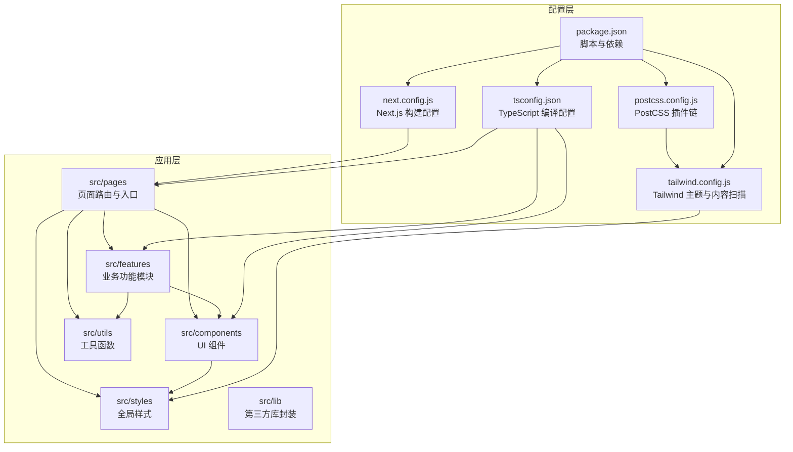
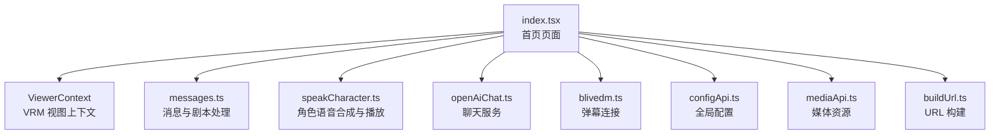
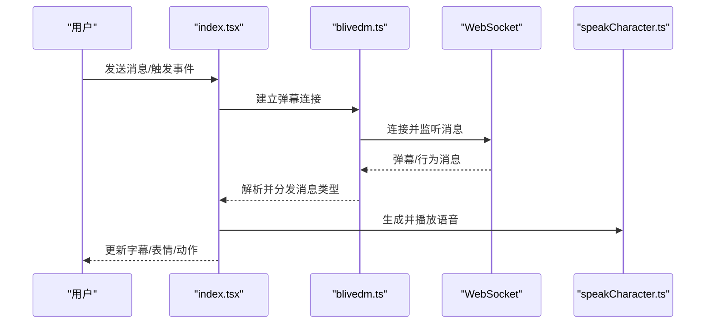
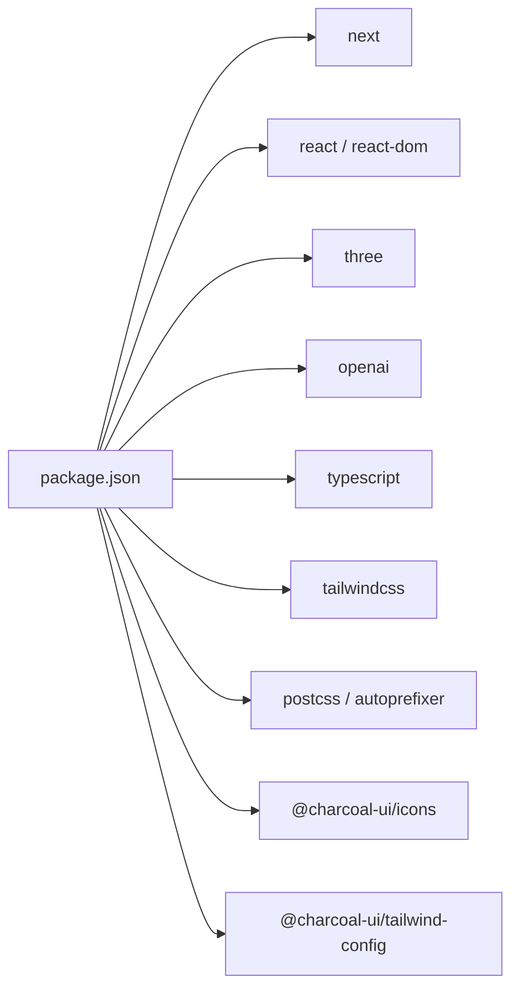

# 项目结构与配置

<cite>
**本文引用的文件**
- [package.json](file://domain-chatvrm/package.json)
- [next.config.js](file://domain-chatvrm/next.config.js)
- [tsconfig.json](file://domain-chatvrm/tsconfig.json)
- [tailwind.config.js](file://domain-chatvrm/tailwind.config.js)
- [postcss.config.js](file://domain-chatvrm/postcss.config.js)
- [_app.tsx](file://domain-chatvrm/src/pages/_app.tsx)
- [index.tsx](file://domain-chatvrm/src/pages/index.tsx)
- [_document.tsx](file://domain-chatvrm/src/pages/_document.tsx)
- [buildUrl.ts](file://domain-chatvrm/src/utils/buildUrl.ts)
</cite>

## 目录
1. [简介](#简介)
2. [项目结构](#项目结构)
3. [核心组件](#核心组件)
4. [架构总览](#架构总览)
5. [详细组件分析](#详细组件分析)
6. [依赖关系分析](#依赖关系分析)
7. [性能考虑](#性能考虑)
8. [故障排查指南](#故障排查指南)
9. [结论](#结论)
10. [附录](#附录)

## 简介
本文件为 VirtualWife 前端项目（ChatVRM）的结构与配置详解，聚焦于 Next.js 应用的整体架构、目录组织、路由系统、组件与功能模块设计、TypeScript 与 Tailwind CSS 的配置与使用、构建与开发流程、环境变量管理以及最佳实践与扩展指导。内容面向前端开发者，提供从初始化到部署的完整参考。

## 项目结构
ChatVRM 采用标准 Next.js 结构，核心目录如下：
- src/pages：页面级路由与应用入口
- src/components：可复用 UI 组件
- src/features：业务功能模块（聊天、VRM 视图、TTS、表情控制等）
- src/utils：工具函数
- src/styles：全局样式
- src/lib：第三方库或插件封装
- 配置文件：next.config.js、tsconfig.json、tailwind.config.js、postcss.config.js、package.json

图表来源
- [package.json](file://domain-chatvrm/package.json#L1-L51)
- [next.config.js](file://domain-chatvrm/next.config.js#L1-L13)
- [tsconfig.json](file://domain-chatvrm/tsconfig.json#L1-L25)
- [tailwind.config.js](file://domain-chatvrm/tailwind.config.js#L1-L39)
- [postcss.config.js](file://domain-chatvrm/postcss.config.js#L1-L7)

章节来源
- [package.json](file://domain-chatvrm/package.json#L1-L51)
- [next.config.js](file://domain-chatvrm/next.config.js#L1-L13)
- [tsconfig.json](file://domain-chatvrm/tsconfig.json#L1-L25)
- [tailwind.config.js](file://domain-chatvrm/tailwind.config.js#L1-L39)
- [postcss.config.js](file://domain-chatvrm/postcss.config.js#L1-L7)

## 核心组件
- 页面路由与入口
  - _app.tsx：应用根组件，引入全局样式与图标资源，作为所有页面的容器。
  - _document.tsx：自定义文档结构，设置语言属性与主容器。
  - index.tsx：首页页面，负责聊天交互、VRM 视图、字幕与 TTS 播放、WebSocket 接收弹幕与行为指令等。

- 全局样式与主题
  - globals.css：全局样式入口，配合 Tailwind 使用。
  - tailwind.config.js：启用深色模式、内容扫描范围、Charcoal 主题预设与自定义颜色/字体族。

- 构建与运行
  - next.config.js：启用严格模式、支持 basePath/assetPrefix、尾随斜杠、运行时公共配置。
  - package.json：定义开发、构建、导出、代码检查等脚本与依赖版本。

章节来源
- [_app.tsx](file://domain-chatvrm/src/pages/_app.tsx#L1-L8)
- [_document.tsx](file://domain-chatvrm/src/pages/_document.tsx#L1-L15)
- [index.tsx](file://domain-chatvrm/src/pages/index.tsx#L1-L390)
- [tailwind.config.js](file://domain-chatvrm/tailwind.config.js#L1-L39)
- [next.config.js](file://domain-chatvrm/next.config.js#L1-L13)
- [package.json](file://domain-chatvrm/package.json#L1-L51)

## 架构总览
下图展示首页页面与核心模块的交互关系：页面通过上下文与功能模块协作，调用聊天、TTS、VRM 视图、媒体与配置等能力，并通过 WebSocket 实时接收弹幕与行为指令。

图表来源
- [index.tsx](file://domain-chatvrm/src/pages/index.tsx#L1-L390)
- [buildUrl.ts](file://domain-chatvrm/src/utils/buildUrl.ts)

章节来源
- [index.tsx](file://domain-chatvrm/src/pages/index.tsx#L1-L390)

## 详细组件分析

### 页面路由与入口
- _app.tsx
  - 引入全局样式与图标资源，作为所有页面的根容器。
  - 适合放置全局 Provider、状态管理或第三方库初始化。
- _document.tsx
  - 自定义 HTML 结构，设置语言属性与主容器。
  - 可用于注入额外的 meta、link 或脚本。
- index.tsx（首页）
  - 负责聊天状态管理、WebSocket 连接与消息分发、VRM 表情与动作控制、字幕打字机效果、TTS 播放与回调。
  - 使用 ViewerContext 提供 VRM 模型实例，结合媒体与配置模块实现动态背景与角色参数。

图表来源
- [index.tsx](file://domain-chatvrm/src/pages/index.tsx#L296-L337)
- [index.tsx](file://domain-chatvrm/src/pages/index.tsx#L116-L126)
- [index.tsx](file://domain-chatvrm/src/pages/index.tsx#L223-L232)

章节来源
- [_app.tsx](file://domain-chatvrm/src/pages/_app.tsx#L1-L8)
- [_document.tsx](file://domain-chatvrm/src/pages/_document.tsx#L1-L15)
- [index.tsx](file://domain-chatvrm/src/pages/index.tsx#L1-L390)

### 组件库与功能模块
- 组件（components）
  - 包含对话输入、菜单、介绍、链接、按钮、VRM 查看器等 UI 组件，采用相对路径别名 @/* 引入。
- 功能模块（features）
  - 聊天：openAiChat.ts
  - 弹幕：blivedm.ts
  - 配置：configApi.ts
  - 媒体：mediaApi.ts
  - 消息与语音：messages.ts、speakCharacter.ts
  - VRM 视图：viewer.ts、model.ts、viewerContext.ts
  - 表情与动作：emoteController、expressionController、autoBlink、autoLookAt
  - TTS：ttsApi.ts
  - 翻译：translationApi.ts
  - HTTP 客户端：httpclient.ts
  - 常量：koeiroParam.ts、systemPromptConstants.ts

章节来源
- [index.tsx](file://domain-chatvrm/src/pages/index.tsx#L1-L390)

### TypeScript 配置
- 编译目标与模块解析
  - 目标：ES2015；模块：ESNext；解析：Node；严格模式开启；跳过库检查；禁止输出 JS（仅类型检查）。
- 路径映射
  - baseUrl: "."；paths: "@/*" -> ["src/*"]，便于统一相对路径引用。
- JSX 处理
  - preserve，交由 Next.js 在构建阶段处理。
- 包含与排除
  - 包含 next-env.d.ts 与所有 ts/tsx 文件；排除 node_modules。

章节来源
- [tsconfig.json](file://domain-chatvrm/tsconfig.json#L1-L25)

### Tailwind CSS 与 PostCSS
- Tailwind 配置
  - 启用深色模式；内容扫描范围覆盖 src 下的 tsx 与 html；使用 Charcoal 主题预设并扩展颜色与字体族；启用 line-clamp 插件。
- PostCSS 插件链
  - tailwindcss 与 autoprefixer；无需额外插件，保持最小化配置。
- 全局样式
  - 在 _app.tsx 中引入 globals.css，确保 Tailwind 指令生效。

章节来源
- [tailwind.config.js](file://domain-chatvrm/tailwind.config.js#L1-L39)
- [postcss.config.js](file://domain-chatvrm/postcss.config.js#L1-L7)
- [_app.tsx](file://domain-chatvrm/src/pages/_app.tsx#L1-L8)

### 构建配置与开发服务器
- Next.js 配置
  - reactStrictMode：启用 React 严格模式，帮助发现副作用。
  - basePath/assetPrefix：支持通过环境变量设置基础路径，便于多环境部署。
  - trailingSlash：启用尾随斜杠，提升 SEO 一致性。
  - publicRuntimeConfig.root：向客户端暴露基础路径。
- 脚本命令
  - 开发：next dev；构建：next build；启动：next start；静态导出：next export；代码检查：next lint。
- Node 版本
  - engines.node：16.14.2，确保本地与 CI 环境一致。

章节来源
- [next.config.js](file://domain-chatvrm/next.config.js#L1-L13)
- [package.json](file://domain-chatvrm/package.json#L1-L51)

### 环境变量管理
- 基础路径
  - BASE_PATH：用于设置 basePath 与 assetPrefix，适配反向代理或子路径部署。
- 运行时配置
  - publicRuntimeConfig.root：在浏览器端可用的基础路径值。
- 建议
  - 将敏感信息放入 .env.local 并通过环境变量注入；避免硬编码在源码中。

章节来源
- [next.config.js](file://domain-chatvrm/next.config.js#L4-L9)

### 目录结构最佳实践与扩展指导
- 目录组织
  - pages：仅存放页面级组件与 API 路由；避免在 pages 中放置通用组件。
  - components：纯 UI 组件，无副作用；可按功能拆分子目录。
  - features：业务功能模块，包含服务、常量、API、工具；保持高内聚低耦合。
  - utils：纯函数工具；避免引入副作用或外部依赖。
  - styles：全局样式；按需引入，避免污染作用域。
  - lib：第三方库或插件封装；集中管理复杂依赖。
- 路由扩展
  - 新增页面：在 src/pages 下新增文件即路由；API 路由置于 src/pages/api。
  - 动态路由：使用方括号命名文件夹，如 [id].tsx。
  - 嵌套路由：使用 group 名称，如 (group)/layout.tsx。
- 组件与功能模块扩展
  - 组件：优先使用受控组件与 hooks 抽象；避免在组件中直接发起网络请求。
  - 功能模块：围绕单一职责划分；通过 context 或 provider 管理共享状态。
- 样式扩展
  - 使用 Tailwind 工具类；必要时在 globals.css 中添加自定义样式。
  - 通过 theme.extend 扩展颜色与字体，保持设计一致性。
- 性能扩展
  - 图片优化：使用 next/image；懒加载与响应式尺寸。
  - 代码分割：利用动态导入与 suspense；拆分大组件。
  - 缓存策略：合理使用 revalidate 与缓存头；静态导出时注意增量更新。

章节来源
- [index.tsx](file://domain-chatvrm/src/pages/index.tsx#L1-L390)
- [tailwind.config.js](file://domain-chatvrm/tailwind.config.js#L17-L36)

## 依赖关系分析
- 依赖分层
  - 运行时依赖：Next.js、React、Three.js、openai、node-fetch 等。
  - 开发依赖：Tailwind CSS、PostCSS、Autoprefixer、TypeScript、ESLint 及相关类型声明。
  - 主题与图标：@charcoal-ui/tailwind-config 与 @charcoal-ui/icons。
- 关键依赖作用
  - Next.js：页面路由、SSR/SSG、构建与运行时。
  - Tailwind CSS：原子化样式与主题系统。
  - Three.js：VRM 模型渲染与动画。
  - openai：LLM 对话能力。
  - @charcoal-ui：品牌主题与图标规范。

图表来源
- [package.json](file://domain-chatvrm/package.json#L13-L46)

章节来源
- [package.json](file://domain-chatvrm/package.json#L1-L51)

## 性能考虑
- 构建与打包
  - 使用 next build 生成生产包；开启 incremental 类型检查减少编译时间。
  - 利用 basePath/assetPrefix 与 trailingSlash 提升部署一致性。
- 运行时性能
  - React 严格模式有助于早期发现性能问题；避免不必要的重渲染。
  - 使用 useCallback/useMemo 缓存回调与计算结果。
  - VRM 渲染：控制帧率与动画队列，避免频繁切换模型与材质。
- 样式与资源
  - Tailwind 按需扫描 content，避免生成冗余样式。
  - 图片与媒体资源使用 buildUrl 统一前缀，减少重复请求。
- 网络与并发
  - ChatPriorityQueue 控制消息队列，避免并发过高导致卡顿。
  - WebSocket 断线重连与消息去重，保证实时性与稳定性。

章节来源
- [index.tsx](file://domain-chatvrm/src/pages/index.tsx#L1-L390)
- [buildUrl.ts](file://domain-chatvrm/src/utils/buildUrl.ts)

## 故障排查指南
- 构建失败
  - 检查 Node 版本是否满足 engines.node 要求。
  - 确认 TypeScript 编译配置与路径映射正确。
- 样式异常
  - 确保 Tailwind 内容扫描范围包含 tsx/html 文件。
  - 检查 postcss.config 是否正确加载 tailwindcss 与 autoprefixer。
- 路由与部署问题
  - 若使用子路径部署，设置 BASE_PATH 并确认 basePath/assetPrefix 生效。
  - trailingSlash 与链接一致性可能导致 404，确保内部链接与静态导出兼容。
- WebSocket 与弹幕
  - 检查连接逻辑与断线重连；确保消息类型判断与去重。
- 字幕与语音
  - 字幕长度限制与打字机效果需与 TTS 播放节奏匹配，避免越界或卡顿。

章节来源
- [next.config.js](file://domain-chatvrm/next.config.js#L4-L9)
- [tailwind.config.js](file://domain-chatvrm/tailwind.config.js#L8-L8)
- [postcss.config.js](file://domain-chatvrm/postcss.config.js#L1-L7)
- [index.tsx](file://domain-chatvrm/src/pages/index.tsx#L326-L337)

## 结论
本项目以 Next.js 为核心，结合 Tailwind CSS 与 TypeScript，构建了具备聊天、VRM 视图、TTS 与弹幕交互的前端应用。通过清晰的目录结构、严格的类型约束与主题化样式体系，实现了良好的可维护性与扩展性。建议在后续迭代中持续完善模块边界、优化渲染性能与资源加载，并加强测试与可观测性建设。

## 附录
- 初始化与运行步骤
  - 安装依赖：使用包管理器安装依赖。
  - 开发运行：执行开发脚本启动本地服务器。
  - 构建与导出：按需执行构建或静态导出脚本。
  - 代码检查：运行 lint 脚本修复风格与类型问题。
- 部署建议
  - 使用 basePath/assetPrefix 支持反向代理与子路径部署。
  - 静态导出场景下注意链接与资源路径一致性。
  - 生产环境建议启用 HTTPS 与安全头配置。

章节来源
- [package.json](file://domain-chatvrm/package.json#L5-L12)
- [next.config.js](file://domain-chatvrm/next.config.js#L4-L9)