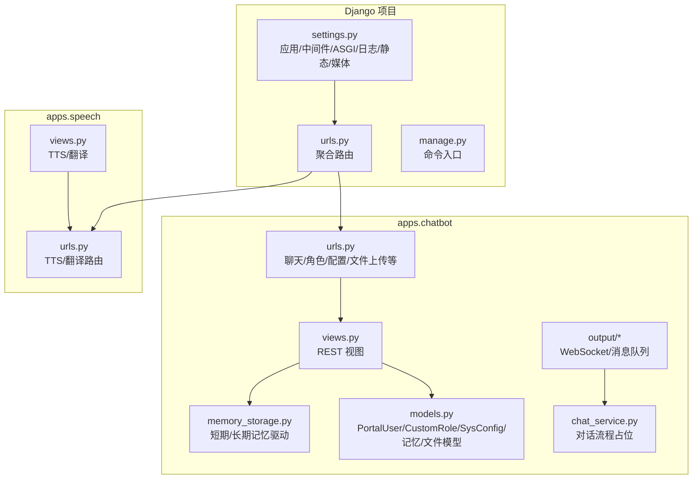
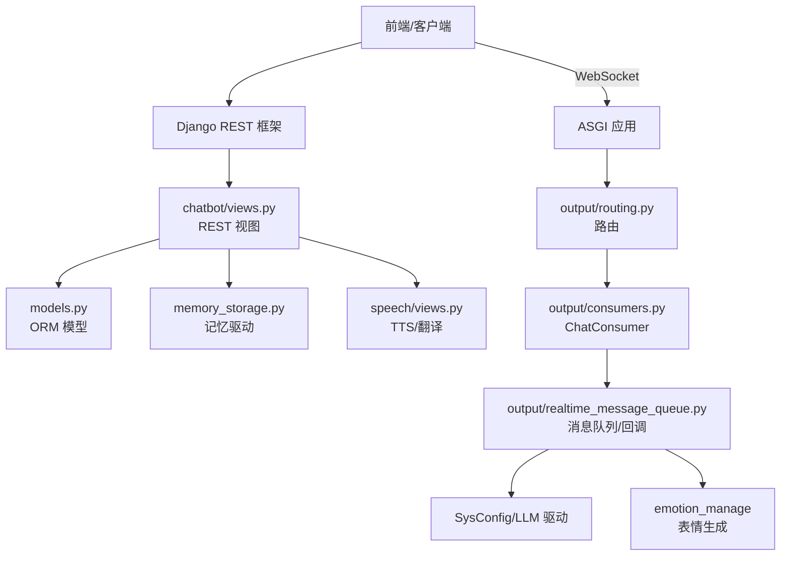
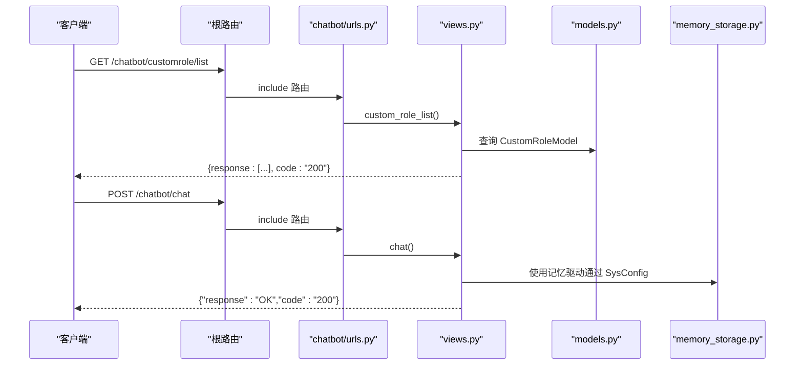
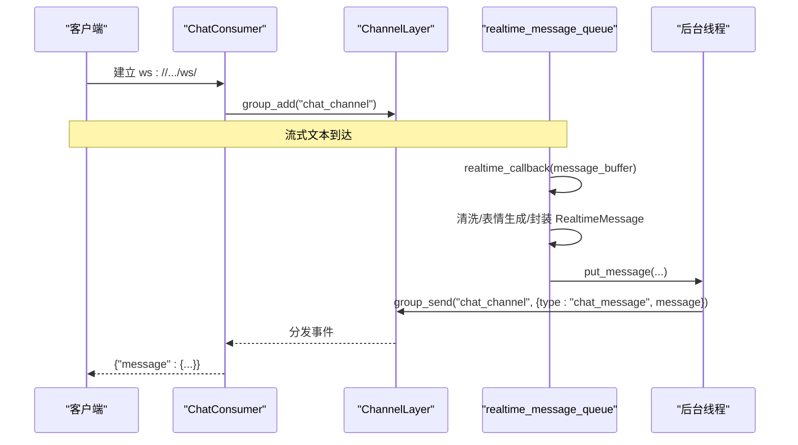
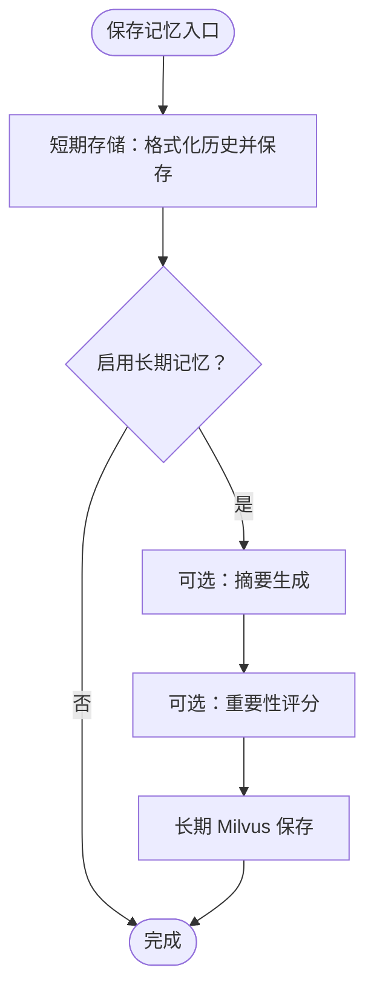
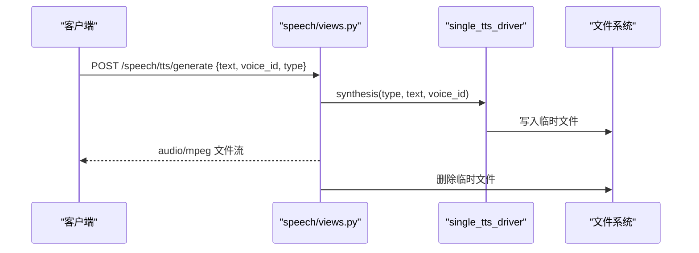
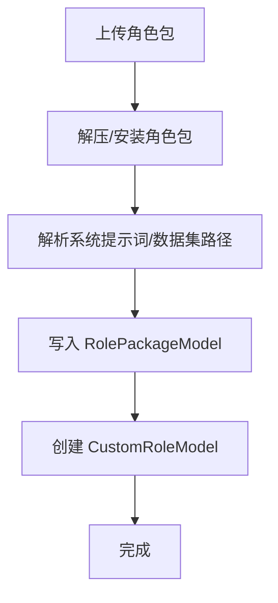
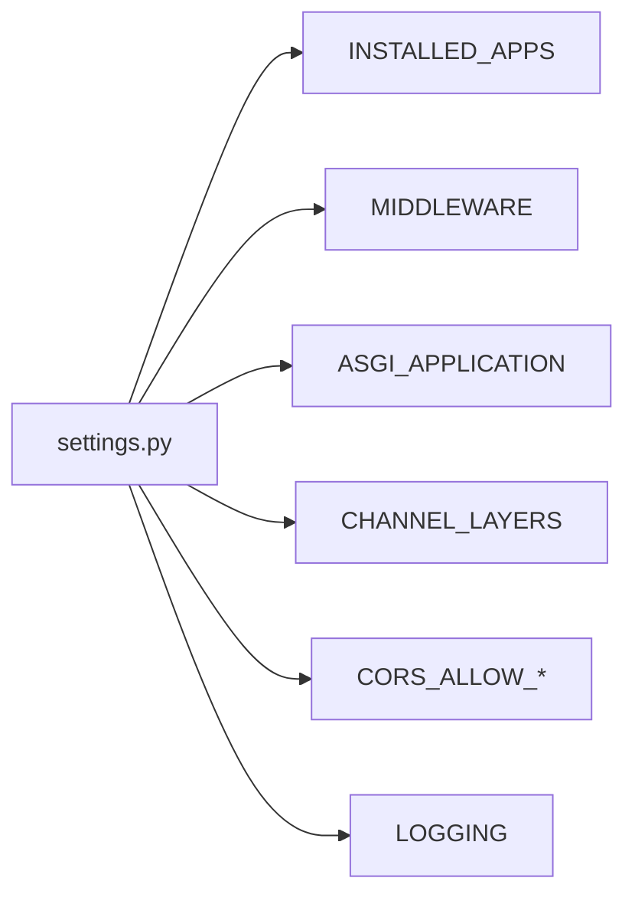

# 后端服务

<cite>
**本文引用的文件**
- [settings.py](file://domain-chatbot/VirtualWife/settings.py)
- [urls.py](file://domain-chatbot/VirtualWife/urls.py)
- [manage.py](file://domain-chatbot/manage.py)
- [models.py](file://domain-chatbot/apps/chatbot/models.py)
- [views.py](file://domain-chatbot/apps/chatbot/views.py)
- [urls.py](file://domain-chatbot/apps/chatbot/urls.py)
- [serializers.py](file://domain-chatbot/apps/chatbot/serializers.py)
- [character.py](file://domain-chatbot/apps/chatbot/character/character.py)
- [chat_service.py](file://domain-chatbot/apps/chatbot/chat/chat_service.py)
- [memory_storage.py](file://domain-chatbot/apps/chatbot/memory/memory_storage.py)
- [consumers.py](file://domain-chatbot/apps/chatbot/output/consumers.py)
- [routing.py](file://domain-chatbot/apps/chatbot/output/routing.py)
- [realtime_message_queue.py](file://domain-chatbot/apps/chatbot/output/realtime_message_queue.py)
- [speech_views.py](file://domain-chatbot/apps/speech/views.py)
- [speech_urls.py](file://domain-chatbot/apps/speech/urls.py)
</cite>

## 目录
1. [简介](#简介)
2. [项目结构](#项目结构)
3. [核心组件](#核心组件)
4. [架构总览](#架构总览)
5. [详细组件分析](#详细组件分析)
6. [依赖分析](#依赖分析)
7. [性能考虑](#性能考虑)
8. [故障排查指南](#故障排查指南)
9. [结论](#结论)
10. [附录](#附录)

## 简介
本文件为 VirtualWife 后端服务的技术文档，基于 Django/Channels/DRF 技术栈构建，覆盖 RESTful API 设计与实现、WebSocket 实时通信、角色与记忆管理、语音合成与翻译等核心能力。文档面向不同层次读者，既提供高层架构概览，也给出代码级依赖与调用流程图示，并附带性能优化与最佳实践建议。

## 项目结构
后端采用多应用分层组织：
- VirtualWife 应用：Django 项目配置、ASGI/WSGI、路由聚合、静态资源与媒体文件配置
- apps.chatbot 应用：聊天、角色、记忆、情感、洞察、LLM 策略、调度、工具等子模块
- apps.speech 应用：TTS、翻译等语音相关接口
- 输出通道与 WebSocket：实时消息推送、消息队列与消费者

图表来源
- [settings.py](file://domain-chatbot/VirtualWife/settings.py#L1-L208)
- [urls.py](file://domain-chatbot/VirtualWife/urls.py#L1-L44)
- [manage.py](file://domain-chatbot/manage.py#L1-L28)
- [views.py](file://domain-chatbot/apps/chatbot/views.py#L1-L346)
- [urls.py](file://domain-chatbot/apps/chatbot/urls.py#L1-L26)
- [models.py](file://domain-chatbot/apps/chatbot/models.py#L1-L92)
- [chat_service.py](file://domain-chatbot/apps/chatbot/chat/chat_service.py#L1-L61)
- [memory_storage.py](file://domain-chatbot/apps/chatbot/memory/memory_storage.py#L1-L176)
- [speech_views.py](file://domain-chatbot/apps/speech/views.py#L1-L74)
- [speech_urls.py](file://domain-chatbot/apps/speech/urls.py#L1-L9)

章节来源
- [settings.py](file://domain-chatbot/VirtualWife/settings.py#L1-L208)
- [urls.py](file://domain-chatbot/VirtualWife/urls.py#L1-L44)
- [manage.py](file://domain-chatbot/manage.py#L1-L28)

## 核心组件
- 配置与中间件：CORS、跨域、Django 中间件链、ASGI/Channels、日志与静态/媒体
- REST 接口：聊天、角色 CRUD、系统配置、背景图与 VRM 文件上传/展示、角色包安装
- 记忆系统：短期本地存储 + 可选长期 Milvus 存储；支持摘要与重要性评分
- 实时通信：WebSocket 消费者、消息队列、表情生成回调
- 语音与翻译：TTS 合成、语音列表查询、多源翻译客户端封装

章节来源
- [settings.py](file://domain-chatbot/VirtualWife/settings.py#L56-L152)
- [views.py](file://domain-chatbot/apps/chatbot/views.py#L1-L346)
- [memory_storage.py](file://domain-chatbot/apps/chatbot/memory/memory_storage.py#L1-L176)
- [consumers.py](file://domain-chatbot/apps/chatbot/output/consumers.py#L1-L38)
- [realtime_message_queue.py](file://domain-chatbot/apps/chatbot/output/realtime_message_queue.py#L1-L107)
- [speech_views.py](file://domain-chatbot/apps/speech/views.py#L1-L74)

## 架构总览
整体采用 Django + Channels 提供 WebSocket，REST API 由 DRF 提供，ASGI 作为统一入口。系统通过 SysConfig 统一注入 LLM 驱动、记忆驱动、情感与调度策略等可插拔组件。

图表来源
- [settings.py](file://domain-chatbot/VirtualWife/settings.py#L146-L152)
- [urls.py](file://domain-chatbot/VirtualWife/urls.py#L35-L41)
- [views.py](file://domain-chatbot/apps/chatbot/views.py#L1-L346)
- [memory_storage.py](file://domain-chatbot/apps/chatbot/memory/memory_storage.py#L1-L176)
- [consumers.py](file://domain-chatbot/apps/chatbot/output/consumers.py#L1-L38)
- [routing.py](file://domain-chatbot/apps/chatbot/output/routing.py#L1-L9)
- [realtime_message_queue.py](file://domain-chatbot/apps/chatbot/output/realtime_message_queue.py#L1-L107)
- [speech_views.py](file://domain-chatbot/apps/speech/views.py#L1-L74)

## 详细组件分析

### REST API 设计与实现
- 路由聚合：根路由 include chatbot 与 speech 子应用
- chatbot 路由：聊天、记忆清理、角色 CRUD、配置读写、背景图/VRM 文件上传与展示、角色包安装
- serializers：基于 ModelSerializer 的序列化器，用于文件上传与角色模型
- views：统一返回结构 {response, code}，异常通过 DRF/框架默认处理或显式 HttpResponse

图表来源
- [urls.py](file://domain-chatbot/VirtualWife/urls.py#L35-L41)
- [urls.py](file://domain-chatbot/apps/chatbot/urls.py#L1-L26)
- [views.py](file://domain-chatbot/apps/chatbot/views.py#L1-L346)
- [models.py](file://domain-chatbot/apps/chatbot/models.py#L1-L92)
- [memory_storage.py](file://domain-chatbot/apps/chatbot/memory/memory_storage.py#L1-L176)

章节来源
- [urls.py](file://domain-chatbot/VirtualWife/urls.py#L35-L41)
- [urls.py](file://domain-chatbot/apps/chatbot/urls.py#L1-L26)
- [views.py](file://domain-chatbot/apps/chatbot/views.py#L1-L346)
- [serializers.py](file://domain-chatbot/apps/chatbot/serializers.py#L1-L37)
- [models.py](file://domain-chatbot/apps/chatbot/models.py#L1-L92)

### WebSocket 实时通信
- 连接管理：ChatConsumer 在 connect 时加入组 chat_channel，在 disconnect 时移除
- 消息发送：realtime_message_queue 维护线程安全队列，后台线程循环从队列取消息并通过 channel_layer.group_send 广播
- 回调集成：realtime_callback 将流式文本按句号/换行/长度阈值切分，清洗文本、生成表情、封装 RealtimeMessage 并入队

图表来源
- [consumers.py](file://domain-chatbot/apps/chatbot/output/consumers.py#L1-L38)
- [routing.py](file://domain-chatbot/apps/chatbot/output/routing.py#L1-L9)
- [realtime_message_queue.py](file://domain-chatbot/apps/chatbot/output/realtime_message_queue.py#L1-L107)

章节来源
- [consumers.py](file://domain-chatbot/apps/chatbot/output/consumers.py#L1-L38)
- [routing.py](file://domain-chatbot/apps/chatbot/output/routing.py#L1-L9)
- [realtime_message_queue.py](file://domain-chatbot/apps/chatbot/output/realtime_message_queue.py#L1-L107)

### 记忆存储与检索
- MemoryStorageDriver：组合短期本地存储与可选长期 Milvus 存储；支持按角色/发送者检索、保存、清理
- MemorySummary/MemoryImportance：通过 LLM 生成摘要与重要性评分，用于长期记忆入库
- ID 生成：SnowFlake 保证全局唯一主键

图表来源
- [memory_storage.py](file://domain-chatbot/apps/chatbot/memory/memory_storage.py#L56-L106)

章节来源
- [memory_storage.py](file://domain-chatbot/apps/chatbot/memory/memory_storage.py#L1-L176)

### 语音合成与翻译
- TTS：接收 text、voice_id、type，调用 single_tts_driver 合成音频，返回二进制流并删除临时文件
- 语音列表：根据 type 返回可用声音列表
- 翻译：调用 translationClient 执行多源翻译

图表来源
- [speech_views.py](file://domain-chatbot/apps/speech/views.py#L16-L47)

章节来源
- [speech_views.py](file://domain-chatbot/apps/speech/views.py#L1-L74)
- [speech_urls.py](file://domain-chatbot/apps/speech/urls.py#L1-L9)

### 角色与角色包管理
- 角色模型：CustomRoleModel 统一自定义角色定义字段
- 角色包上传：上传压缩包后解压安装，解析系统提示词与数据集路径，回写 RolePackageModel 并创建 CustomRoleModel
- 文件模型：BackgroundImageModel、VrmModel、RolePackageModel 支持上传与删除

图表来源
- [views.py](file://domain-chatbot/apps/chatbot/views.py#L250-L293)
- [models.py](file://domain-chatbot/apps/chatbot/models.py#L16-L92)

章节来源
- [views.py](file://domain-chatbot/apps/chatbot/views.py#L1-L346)
- [models.py](file://domain-chatbot/apps/chatbot/models.py#L1-L92)

## 依赖分析
- 应用与中间件：Django、daphne、channels、corsheaders、rest_framework、drf_yasg
- ASGI/WSGI：ASGI_APPLICATION 指向 VirtualWife.asgi.application，ChannelLayer 使用内存实现
- CORS：允许所有来源/方法/头
- 日志：RotatingFileHandler + 控制台，INFO 级别以上输出

图表来源
- [settings.py](file://domain-chatbot/VirtualWife/settings.py#L37-L70)
- [settings.py](file://domain-chatbot/VirtualWife/settings.py#L146-L152)
- [settings.py](file://domain-chatbot/VirtualWife/settings.py#L160-L207)

章节来源
- [settings.py](file://domain-chatbot/VirtualWife/settings.py#L1-L208)

## 性能考虑
- WebSocket 后台线程：实时消息队列使用守护线程持续消费队列，避免阻塞主线程；建议在生产环境替换为持久化 ChannelLayer（如 Redis）以支持多实例扩展
- 记忆检索：短期本地存储使用分页查询；长期 Milvus 检索建议预建索引、控制返回 topK、缓存热点角色的最近历史
- LLM 调用：摘要与重要性评分可配置是否启用；建议对频繁调用进行限流与缓存
- 文件上传：图片/VRM/角色包上传后及时清理临时文件，避免磁盘膨胀
- 日志：INFO 级别以上滚动日志，注意磁盘配额与备份策略

## 故障排查指南
- WebSocket 不通：检查 ASGI 应用与路由是否正确挂载，确认 ChannelLayer 配置与网络可达
- CORS 问题：确认 CORS_ALLOW_ALL_ORIGINS/CORS_ALLOW_HEADERS/CORS_ALLOW_METHODS 设置
- 记忆异常：查看 MemoryStorageDriver 的异常捕获与日志输出，确认 Milvus 连接状态与索引是否存在
- TTS 失败：检查 single_tts_driver 的类型与语音 ID 参数，确认临时目录权限
- 文件删除：删除背景图/VRM 时需同时清理 MEDIA_ROOT 下的物理文件

章节来源
- [settings.py](file://domain-chatbot/VirtualWife/settings.py#L67-L70)
- [settings.py](file://domain-chatbot/VirtualWife/settings.py#L146-L152)
- [memory_storage.py](file://domain-chatbot/apps/chatbot/memory/memory_storage.py#L49-L54)
- [views.py](file://domain-chatbot/apps/chatbot/views.py#L173-L185)
- [speech_views.py](file://domain-chatbot/apps/speech/views.py#L45-L47)

## 结论
本后端服务以 Django/Channels 为基础，结合 DRF 提供 REST 接口，通过可插拔的记忆与 LLM 驱动实现对话、角色与记忆管理，并以 WebSocket 实现实时消息推送。建议在生产环境中完善日志与监控、替换内存 ChannelLayer、优化 Milvus 索引与检索策略，并对高频 LLM 调用进行限流与缓存。

## 附录
- 项目启动：通过 manage.py 设置 DJANGO_SETTINGS_MODULE 后执行命令行管理任务
- Swagger 文档：根路由已集成 drf_yasg，访问 /swagger 或 /redoc 查看 API 文档

章节来源
- [manage.py](file://domain-chatbot/manage.py#L1-L28)
- [urls.py](file://domain-chatbot/VirtualWife/urls.py#L25-L41)