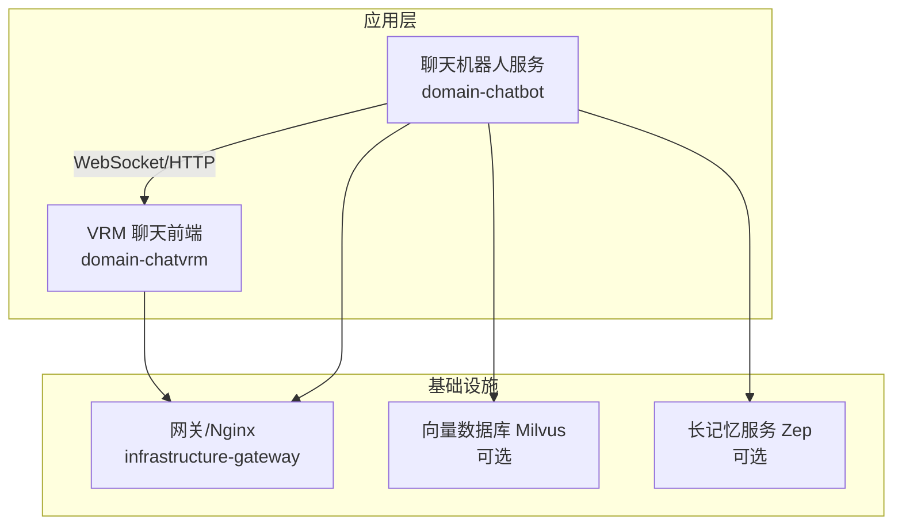
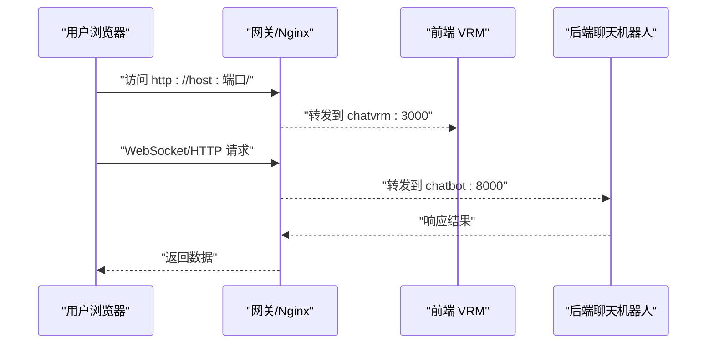
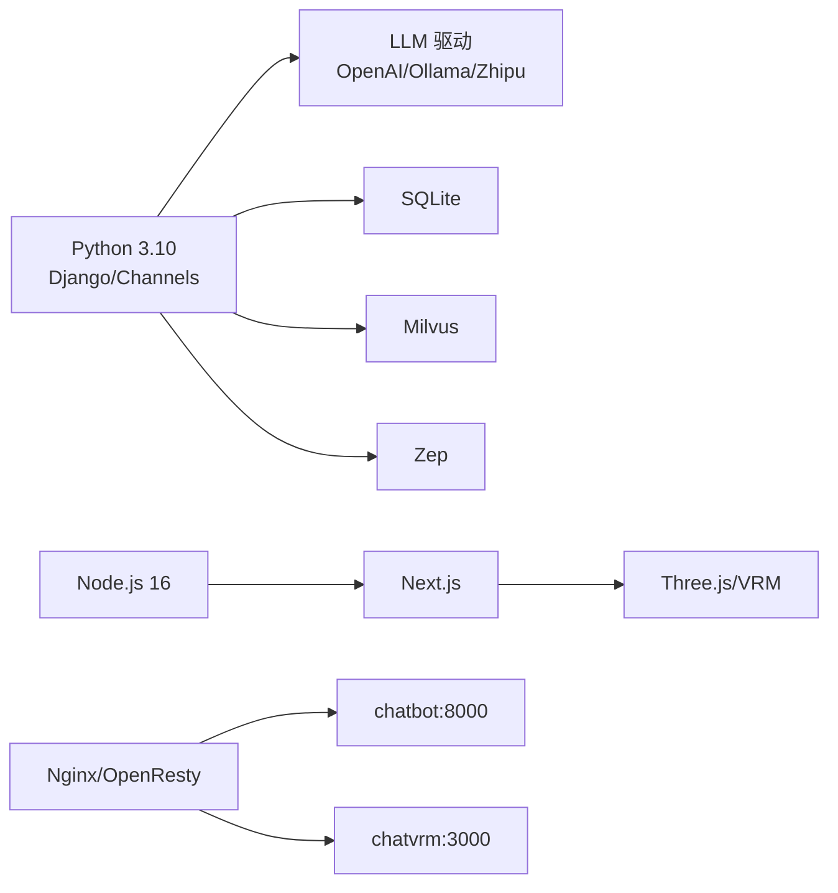

# 快速开始

<cite>
**本文引用的文件**
- [requirements.txt](file://domain-chatbot/requirements.txt)
- [manage.py](file://domain-chatbot/manage.py)
- [settings.py](file://domain-chatbot/VirtualWife/settings.py)
- [sys_config.py](file://domain-chatbot/apps/chatbot/config/sys_config.py)
- [sys_config.json](file://domain-chatbot/apps/chatbot/config/sys_config.json)
- [docker-compose.yaml](file://installer/docker-compose.yaml)
- [start.sh](file://installer/linux/start.sh)
- [start.bat](file://installer/windows/start.bat)
- [Dockerfile.ChatBot](file://infrastructure-packaging/Dockerfile.ChatBot)
- [Dockerfile.ChatVRM](file://infrastructure-packaging/Dockerfile.ChatVRM)
- [Dockerfile.Gateway](file://infrastructure-packaging/Dockerfile.Gateway)
- [package.json](file://domain-chatvrm/package.json)
- [develop.md](file://develop.md)
- [FAQ.md](file://FAQ.md)
- [product.md](file://product.md)
</cite>

## 目录
1. [简介](#简介)
2. [项目结构](#项目结构)
3. [核心组件](#核心组件)
4. [架构总览](#架构总览)
5. [详细组件分析](#详细组件分析)
6. [依赖关系分析](#依赖关系分析)
7. [性能注意事项](#性能注意事项)
8. [故障排除指南](#故障排除指南)
9. [结论](#结论)
10. [附录](#附录)

## 简介
本指南面向首次接触 VirtualWife 的用户，帮助你在最短时间内完成环境准备、依赖安装、配置与启动。内容覆盖：
- 环境要求（Python 3.8+/3.10、Node.js、Docker 等）
- 依赖安装与数据库初始化
- Docker 部署与 docker-compose 使用
- 本地开发环境搭建（数据库、LLM 模型、语音服务）
- 常见安装问题与排障
- 完整启动流程示例（从克隆到成功运行）

## 项目结构
VirtualWife 由三个主要子系统组成：
- 后端聊天机器人服务（Django + Channels）：domain-chatbot
- 前端 VRM 聊天界面（Next.js）：domain-chatvrm
- 网关与反向代理（OpenResty/Nginx）：infrastructure-gateway

**图表来源**
- [docker-compose.yaml](file://installer/docker-compose.yaml#L1-L44)
- [Dockerfile.ChatBot](file://infrastructure-packaging/Dockerfile.ChatBot#L1-L31)
- [Dockerfile.ChatVRM](file://infrastructure-packaging/Dockerfile.ChatVRM#L1-L29)
- [Dockerfile.Gateway](file://infrastructure-packaging/Dockerfile.Gateway#L1-L4)

**章节来源**
- [docker-compose.yaml](file://installer/docker-compose.yaml#L1-L44)
- [develop.md](file://develop.md#L1-L73)

## 核心组件
- 聊天机器人服务（domain-chatbot）
  - 基于 Django + Channels，提供 WebSocket/HTTP 接口
  - 内置多 LLM 驱动（OpenAI、Ollama、智谱），可选 Milvus/Zep 记忆
  - 默认 SQLite 数据库存储配置与角色数据
- VRM 聊天前端（domain-chatvrm）
  - Next.js 应用，提供 VRM 模型展示与交互
  - 与后端通过 API 通信
- 网关（infrastructure-gateway）
  - Nginx/OpenResty 配置，统一入口与静态资源分发

**章节来源**
- [requirements.txt](file://domain-chatbot/requirements.txt#L1-L33)
- [settings.py](file://domain-chatbot/VirtualWife/settings.py#L92-L104)
- [sys_config.json](file://domain-chatbot/apps/chatbot/config/sys_config.json#L1-L60)
- [package.json](file://domain-chatvrm/package.json#L1-L51)

## 架构总览
整体采用“网关 + 微服务”的部署模式。Docker Compose 启动 chatbot、chatvrm、gateway 三个容器；chatbot 可选连接 Milvus 和 Zep。

**图表来源**
- [docker-compose.yaml](file://installer/docker-compose.yaml#L1-L44)
- [Dockerfile.ChatBot](file://infrastructure-packaging/Dockerfile.ChatBot#L27-L31)
- [Dockerfile.ChatVRM](file://infrastructure-packaging/Dockerfile.ChatVRM#L27-L29)

## 详细组件分析

### 环境与依赖准备
- Python 环境
  - 推荐版本：3.10.x（开发文档建议）
  - 若使用 Conda，可按开发文档创建并激活虚拟环境
- Node.js 环境
  - 前端推荐版本：16.x（package.json engines 字段）
- Docker
  - 用于一键部署 chatbot、chatvrm、gateway
  - Windows 用户需启用 WSL2（FAQ 提及）

**章节来源**
- [develop.md](file://develop.md#L3-L20)
- [package.json](file://domain-chatvrm/package.json#L47-L49)
- [FAQ.md](file://FAQ.md#L52-L54)

### 依赖安装
- 后端依赖（Python）
  - 进入 domain-chatbot 目录，安装 requirements.txt 中的依赖
- 前端依赖（Node.js）
  - 进入 domain-chatvrm 目录，删除旧的 package-lock.json 并执行安装
- Docker 镜像构建
  - ChatBot 镜像在构建时会执行迁移
  - ChatVRM 镜像在构建阶段先安装依赖并执行构建

**章节来源**
- [requirements.txt](file://domain-chatbot/requirements.txt#L1-L33)
- [develop.md](file://develop.md#L38-L41)
- [develop.md](file://develop.md#L59-L63)
- [Dockerfile.ChatBot](file://infrastructure-packaging/Dockerfile.ChatBot#L9-L20)
- [Dockerfile.ChatVRM](file://infrastructure-packaging/Dockerfile.ChatVRM#L8-L12)

### 配置文件设置
- 系统配置（sys_config.json）
  - LLM 配置：OpenAI/Ollama/智谱 的密钥与基础 URL
  - 记忆模块：Milvus/Zep 的连接参数
  - 角色与对话：角色 ID、名称、你的昵称、对话模型类型
  - TTS：语音类型与语音 ID
  - 代理：HTTP/HTTPS/SOCKS5 代理开关与地址
- 环境变量（.env 或 docker-compose env_file）
  - 时区（TIMEZONE）
  - B站直播房间与 Cookie（可选）
  - OpenAI/Ollama/Zep 等密钥（可在 sys_config.json 中设置）

**章节来源**
- [sys_config.json](file://domain-chatbot/apps/chatbot/config/sys_config.json#L1-L60)
- [sys_config.py](file://domain-chatbot/apps/chatbot/config/sys_config.py#L122-L156)
- [docker-compose.yaml](file://installer/docker-compose.yaml#L12-L15)

### 数据库初始化（本地开发）
- 进入 domain-chatbot 目录
- 生成并执行迁移脚本，创建初始表结构
- 启动开发服务器

**章节来源**
- [develop.md](file://develop.md#L42-L52)
- [manage.py](file://domain-chatbot/manage.py#L1-L28)
- [settings.py](file://domain-chatbot/VirtualWife/settings.py#L92-L104)

### LLM 模型配置
- OpenAI
  - 在 sys_config.json 中设置 OPENAI_API_KEY 与 OPENAI_BASE_URL
- Ollama
  - 在 sys_config.json 中设置 OLLAMA_API_BASE 与模型名
- 智谱清言
  - 在 sys_config.json 中设置 ZHIPUAI_API_KEY
- 代理
  - 如需通过代理访问外部 LLM，开启 enableProxy 并配置代理地址

**章节来源**
- [sys_config.json](file://domain-chatbot/apps/chatbot/config/sys_config.json#L11-L23)
- [sys_config.py](file://domain-chatbot/apps/chatbot/config/sys_config.py#L122-L156)
- [FAQ.md](file://FAQ.md#L42-L44)

### 语音服务设置
- TTS 类型与语音 ID
  - 在 sys_config.json 的 ttsConfig 中设置
  - 支持 Edge 等类型
- 语音翻译
  - 支持多种翻译客户端（Google、火山、有道），可按需启用

**章节来源**
- [sys_config.json](file://domain-chatbot/apps/chatbot/config/sys_config.json#L56-L59)
- [sys_config.py](file://domain-chatbot/apps/chatbot/config/sys_config.py#L17-L29)

### Docker 部署流程
- 使用 docker-compose 启动
  - Linux：执行 start.sh
  - Windows：执行 start.bat
  - 或直接使用 docker-compose -f installer/docker-compose.yaml up -d
- 端口映射
  - chatbot: 8000
  - chatvrm: 3000
  - gateway: 80/443（可通过环境变量 NGINX_HTTP_PORT/NGINX_HTTPS_PORT 自定义）
- 网络
  - 三个服务加入名为 virtualwife 的自定义桥接网络
- 环境变量
  - TIMEZONE：容器内时区
  - ENV_FILE：指向 .env 文件路径

**章节来源**
- [docker-compose.yaml](file://installer/docker-compose.yaml#L1-L44)
- [start.sh](file://installer/linux/start.sh#L1-L2)
- [start.bat](file://installer/windows/start.bat#L1-L3)

### 本地开发环境搭建
- 启动后端
  - 进入 domain-chatbot，安装依赖、执行迁移、启动开发服务器
- 启动前端
  - 进入 domain-chatvrm，删除 package-lock.json、安装依赖、启动开发服务器
  - 访问 http://localhost:3000/

**章节来源**
- [develop.md](file://develop.md#L22-L71)
- [package.json](file://domain-chatvrm/package.json#L5-L12)

## 依赖关系分析
- 后端对 LLM 的依赖
  - OpenAI、Ollama、智谱清言、LiteLLM 等
- 后端对存储的依赖
  - SQLite（默认）、可选 Milvus（向量检索）、可选 Zep（长记忆）
- 前端对渲染与模型的依赖
  - Next.js、React、Three.js、VRM 模型加载
- 网关对上游服务的依赖
  - 反向代理 chatbot 与 chatvrm

**图表来源**
- [requirements.txt](file://domain-chatbot/requirements.txt#L1-L33)
- [package.json](file://domain-chatvrm/package.json#L13-L32)
- [docker-compose.yaml](file://installer/docker-compose.yaml#L1-L44)

**章节来源**
- [requirements.txt](file://domain-chatbot/requirements.txt#L1-L33)
- [package.json](file://domain-chatvrm/package.json#L1-L51)

## 性能注意事项
- 禁用 tokenizer 并行以避免多进程冲突（已在配置中设置）
- 合理设置内存与向量索引参数（Milvus/Zep）
- 使用生产级 WSGI/HTTP 服务器（如 gunicorn）替代开发服务器
- 前端构建产物缓存与静态资源优化

**章节来源**
- [sys_config.py](file://domain-chatbot/apps/chatbot/config/sys_config.py#L90-L90)

## 故障排除指南
- npm run dev 报错
  - 删除 package-lock.json 并重新安装依赖
- 无法访问 OpenAI
  - 检查代理是否开启与地址是否正确（host.docker.internal:端口）
- 通过 Docker 访问 host 服务网络异常
  - 使用 host.docker.internal 作为宿主机域名
- Windows 安装 Docker
  - 需要安装并启用 WSL2
- B站弹幕监听失败
  - 检查房间 ID、UID 与 Cookie 是否完整正确

**章节来源**
- [FAQ.md](file://FAQ.md#L56-L69)
- [FAQ.md](file://FAQ.md#L42-L44)
- [FAQ.md](file://FAQ.md#L47-L49)
- [FAQ.md](file://FAQ.md#L52-L54)
- [FAQ.md](file://FAQ.md#L71-L85)

## 结论
按照本指南，你可以快速完成环境准备、依赖安装、配置与启动。若采用 Docker 方式，仅需准备 Docker 环境并执行一次 docker-compose 即可完成部署；若采用本地开发，需分别启动前后端服务并完成数据库初始化。

## 附录

### 完整启动流程示例（Docker）
- 克隆仓库后，进入根目录
- 启动容器
  - Linux：执行 start.sh
  - Windows：执行 start.bat
- 访问
  - 前端：http://localhost:3000
  - 网关：http://localhost:80（或映射端口）

**章节来源**
- [start.sh](file://installer/linux/start.sh#L1-L2)
- [start.bat](file://installer/windows/start.bat#L1-L3)
- [docker-compose.yaml](file://installer/docker-compose.yaml#L31-L33)

### 完整启动流程示例（本地开发）
- 后端
  - 进入 domain-chatbot，安装依赖、执行迁移、启动开发服务器
- 前端
  - 进入 domain-chatvrm，删除 package-lock.json、安装依赖、启动开发服务器
- 访问
  - http://localhost:3000

**章节来源**
- [develop.md](file://develop.md#L22-L71)