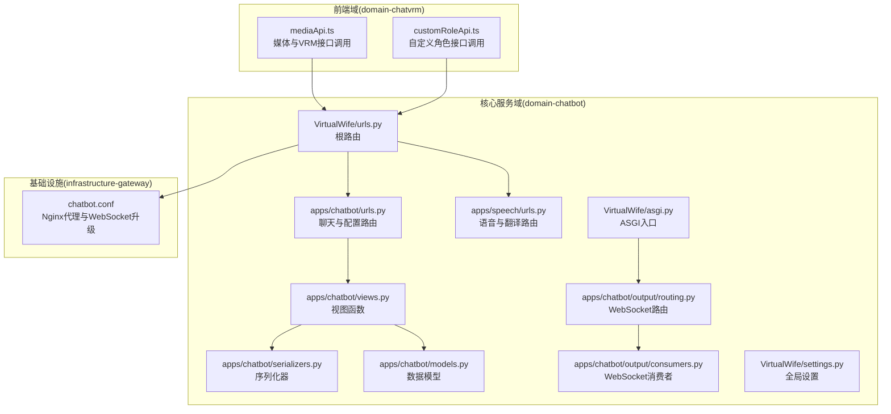
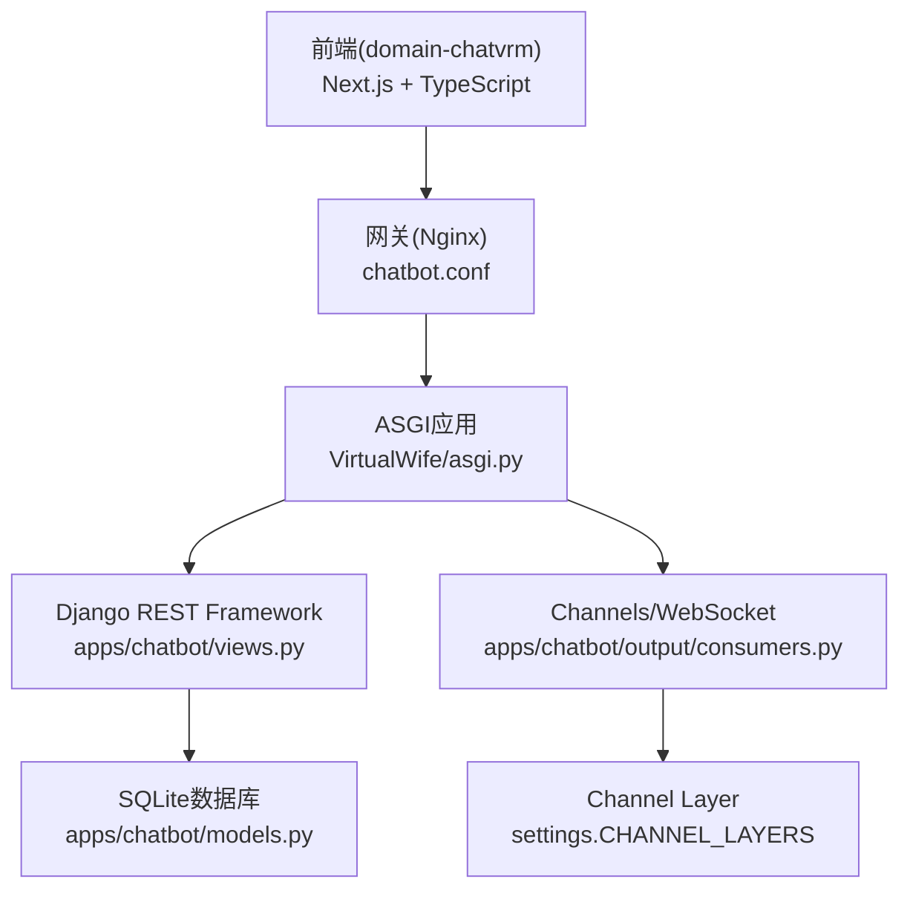
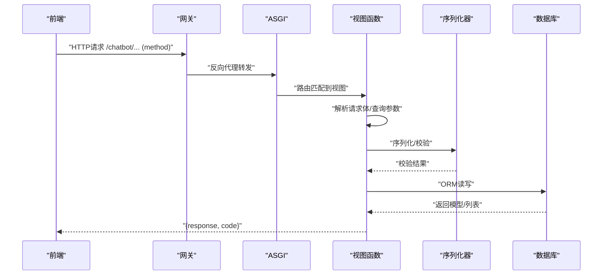
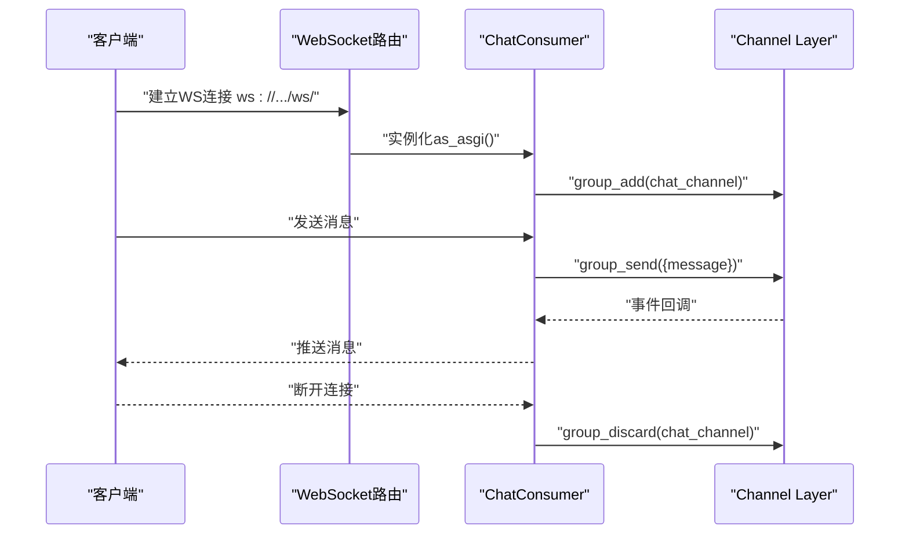
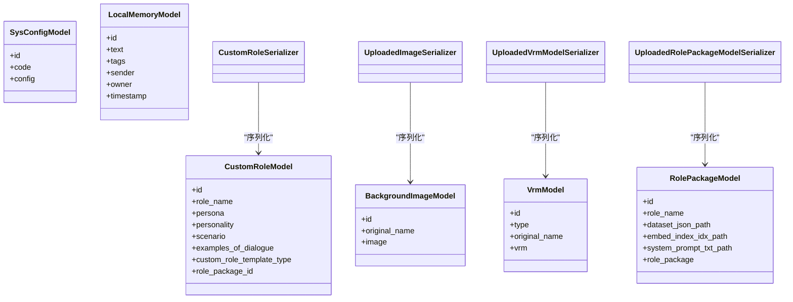
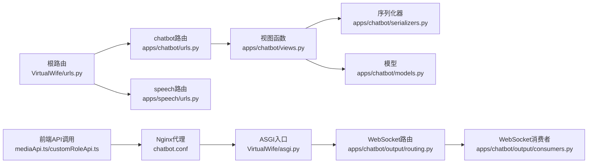

# API扩展开发

<cite>
**本文引用的文件**
- [VirtualWife/urls.py](file://domain-chatbot/VirtualWife/urls.py)
- [VirtualWife/settings.py](file://domain-chatbot/VirtualWife/settings.py)
- [VirtualWife/asgi.py](file://domain-chatbot/VirtualWife/asgi.py)
- [apps/chatbot/urls.py](file://domain-chatbot/apps/chatbot/urls.py)
- [apps/chatbot/views.py](file://domain-chatbot/apps/chatbot/views.py)
- [apps/chatbot/serializers.py](file://domain-chatbot/apps/chatbot/serializers.py)
- [apps/chatbot/models.py](file://domain-chatbot/apps/chatbot/models.py)
- [apps/chatbot/output/routing.py](file://domain-chatbot/apps/chatbot/output/routing.py)
- [apps/chatbot/output/consumers.py](file://domain-chatbot/apps/chatbot/output/consumers.py)
- [apps/speech/urls.py](file://domain-chatbot/apps/speech/urls.py)
- [apps/speech/views.py](file://domain-chatbot/apps/speech/views.py)
- [infrastructure-gateway/conf.d/server/chatbot.conf](file://infrastructure-gateway/conf.d/server/chatbot.conf)
- [domain-chatvrm/src/features/media/mediaApi.ts](file://domain-chatvrm/src/features/media/mediaApi.ts)
- [domain-chatvrm/src/features/customRole/customRoleApi.ts](file://domain-chatvrm/src/features/customRole/customRoleApi.ts)
</cite>

## 目录
1. [简介](#简介)
2. [项目结构](#项目结构)
3. [核心组件](#核心组件)
4. [架构总览](#架构总览)
5. [详细组件分析](#详细组件分析)
6. [依赖关系分析](#依赖关系分析)
7. [性能考虑](#性能考虑)
8. [故障排查指南](#故障排查指南)
9. [结论](#结论)
10. [附录](#附录)

## 简介
本指南面向API开发者，系统化阐述VirtualWife项目的API扩展开发方法，覆盖RESTful API与WebSocket API的扩展流程、路由与视图函数开发、序列化器使用、权限与安全机制、版本控制策略、文档生成与维护、性能优化与最佳实践。文档基于实际代码进行分析，确保可落地实施。

## 项目结构
项目采用多应用分层架构：
- 核心服务域：domain-chatbot（Django + Django REST Framework + Channels）
- 前端交互域：domain-chatvrm（Next.js + TypeScript）
- 网关与上游：infrastructure-gateway（Nginx配置）

**图表来源**
- [VirtualWife/urls.py](file://domain-chatbot/VirtualWife/urls.py#L35-L44)
- [apps/chatbot/urls.py](file://domain-chatbot/apps/chatbot/urls.py#L1-L26)
- [apps/speech/urls.py](file://domain-chatbot/apps/speech/urls.py#L1-L9)
- [apps/chatbot/views.py](file://domain-chatbot/apps/chatbot/views.py#L1-L346)
- [apps/chatbot/serializers.py](file://domain-chatbot/apps/chatbot/serializers.py#L1-L37)
- [apps/chatbot/models.py](file://domain-chatbot/apps/chatbot/models.py#L1-L92)
- [apps/chatbot/output/routing.py](file://domain-chatbot/apps/chatbot/output/routing.py#L1-L9)
- [apps/chatbot/output/consumers.py](file://domain-chatbot/apps/chatbot/output/consumers.py#L1-L38)
- [VirtualWife/asgi.py](file://domain-chatbot/VirtualWife/asgi.py#L1-L42)
- [VirtualWife/settings.py](file://domain-chatbot/VirtualWife/settings.py#L37-L70)
- [infrastructure-gateway/conf.d/server/chatbot.conf](file://infrastructure-gateway/conf.d/server/chatbot.conf#L1-L21)
- [domain-chatvrm/src/features/media/mediaApi.ts](file://domain-chatvrm/src/features/media/mediaApi.ts#L42-L121)
- [domain-chatvrm/src/features/customRole/customRoleApi.ts](file://domain-chatvrm/src/features/customRole/customRoleApi.ts#L1-L71)

**章节来源**
- [VirtualWife/urls.py](file://domain-chatbot/VirtualWife/urls.py#L35-L44)
- [VirtualWife/settings.py](file://domain-chatbot/VirtualWife/settings.py#L37-L70)
- [VirtualWife/asgi.py](file://domain-chatbot/VirtualWife/asgi.py#L36-L41)

## 核心组件
- 路由系统：根路由包含chatbot与speech子应用，并集成Swagger文档路由；各子应用内部定义具体API路径。
- 视图层：基于函数式视图（@api_view装饰器）实现REST接口，统一返回{"response": ..., "code": "..."}结构。
- 序列化器：使用DRF ModelSerializer简化模型到JSON的转换与校验。
- WebSocket：基于Channels，定义ws路由与消费者，支持组播消息推送。
- 网关：Nginx代理转发HTTP与WebSocket请求，配置跨域与升级头。

**章节来源**
- [apps/chatbot/urls.py](file://domain-chatbot/apps/chatbot/urls.py#L1-L26)
- [apps/speech/urls.py](file://domain-chatbot/apps/speech/urls.py#L1-L9)
- [apps/chatbot/views.py](file://domain-chatbot/apps/chatbot/views.py#L20-L346)
- [apps/chatbot/serializers.py](file://domain-chatbot/apps/chatbot/serializers.py#L1-L37)
- [apps/chatbot/output/routing.py](file://domain-chatbot/apps/chatbot/output/routing.py#L1-L9)
- [apps/chatbot/output/consumers.py](file://domain-chatbot/apps/chatbot/output/consumers.py#L1-L38)
- [infrastructure-gateway/conf.d/server/chatbot.conf](file://infrastructure-gateway/conf.d/server/chatbot.conf#L1-L21)

## 架构总览
整体架构分为三层：前端调用层、后端服务层、基础设施层。前端通过HTTP与WebSocket访问后端；后端通过ASGI承载HTTP与WebSocket；网关负责反向代理与协议升级。

**图表来源**
- [VirtualWife/asgi.py](file://domain-chatbot/VirtualWife/asgi.py#L36-L41)
- [VirtualWife/settings.py](file://domain-chatbot/VirtualWife/settings.py#L146-L152)
- [apps/chatbot/views.py](file://domain-chatbot/apps/chatbot/views.py#L1-L346)
- [apps/chatbot/models.py](file://domain-chatbot/apps/chatbot/models.py#L1-L92)
- [apps/chatbot/output/consumers.py](file://domain-chatbot/apps/chatbot/output/consumers.py#L1-L38)
- [infrastructure-gateway/conf.d/server/chatbot.conf](file://infrastructure-gateway/conf.d/server/chatbot.conf#L1-L21)

## 详细组件分析

### RESTful API扩展方法
- 新增URL模式：在子应用urls.py中添加path或re_path条目，映射到对应的视图函数。
- HTTP方法映射：使用@api_view装饰器声明允许的方法集合，如['GET']、['POST']等。
- 请求响应处理：从request.data或request.body解析参数，调用业务逻辑，统一返回{"response": ..., "code": "200"/"500"}。
- 状态码管理：建议遵循REST语义，成功2xx，客户端错误4xx，服务器错误5xx；当前项目统一返回code字段便于前端判断。

**图表来源**
- [apps/chatbot/urls.py](file://domain-chatbot/apps/chatbot/urls.py#L1-L26)
- [apps/chatbot/views.py](file://domain-chatbot/apps/chatbot/views.py#L20-L346)
- [apps/chatbot/serializers.py](file://domain-chatbot/apps/chatbot/serializers.py#L1-L37)
- [apps/chatbot/models.py](file://domain-chatbot/apps/chatbot/models.py#L1-L92)
- [infrastructure-gateway/conf.d/server/chatbot.conf](file://infrastructure-gateway/conf.d/server/chatbot.conf#L1-L21)

**章节来源**
- [apps/chatbot/urls.py](file://domain-chatbot/apps/chatbot/urls.py#L1-L26)
- [apps/chatbot/views.py](file://domain-chatbot/apps/chatbot/views.py#L20-L346)
- [apps/chatbot/serializers.py](file://domain-chatbot/apps/chatbot/serializers.py#L1-L37)
- [apps/chatbot/models.py](file://domain-chatbot/apps/chatbot/models.py#L1-L92)

### WebSocket API扩展实现
- 通道配置：在output/routing.py中定义re_path，将/ws/映射到ChatConsumer.as_asgi()。
- 连接管理：在connect中accept并加入组，disconnect中从组移除，保证消息广播范围可控。
- 消息处理：receive接收客户端消息；通过channel_layer.group_send向组内广播；消费者定义chat_message回调向客户端发送消息。
- 实时通信：结合后台任务队列（如实时消息、聊天历史、洞察消息）与WebSocket推送，实现事件驱动的实时更新。

**图表来源**
- [apps/chatbot/output/routing.py](file://domain-chatbot/apps/chatbot/output/routing.py#L1-L9)
- [apps/chatbot/output/consumers.py](file://domain-chatbot/apps/chatbot/output/consumers.py#L1-L38)
- [VirtualWife/asgi.py](file://domain-chatbot/VirtualWife/asgi.py#L36-L41)
- [VirtualWife/settings.py](file://domain-chatbot/VirtualWife/settings.py#L146-L152)

**章节来源**
- [apps/chatbot/output/routing.py](file://domain-chatbot/apps/chatbot/output/routing.py#L1-L9)
- [apps/chatbot/output/consumers.py](file://domain-chatbot/apps/chatbot/output/consumers.py#L10-L38)
- [VirtualWife/asgi.py](file://domain-chatbot/VirtualWife/asgi.py#L10-L41)
- [VirtualWife/settings.py](file://domain-chatbot/VirtualWife/settings.py#L146-L152)

### 权限控制与安全机制
- CORS：全局允许所有来源、请求头与方法，便于开发调试；生产环境建议按需收紧。
- CSRF：启用CSRF中间件，保障表单类请求安全。
- 认证授权：当前未引入自定义认证类，建议在需要时接入Token或Session认证，并在视图层增加权限类。
- 输入验证与过滤：使用DRF序列化器进行字段校验；对文件上传场景使用Serializer的save与错误收集。
- 防攻击措施：建议增加速率限制、输入长度限制、白名单IP、HTTPS强制跳转等。

**章节来源**
- [VirtualWife/settings.py](file://domain-chatbot/VirtualWife/settings.py#L56-L70)
- [apps/chatbot/serializers.py](file://domain-chatbot/apps/chatbot/serializers.py#L1-L37)
- [apps/chatbot/views.py](file://domain-chatbot/apps/chatbot/views.py#L188-L201)

### API版本控制策略
- 版本号管理：当前Swagger默认版本为v1；可在根路由schema_view中调整默认版本。
- 向后兼容：新增接口采用新路径或命名空间隔离，避免破坏既有行为。
- 弃用通知：对即将下线的接口，保留一段时间并返回弃用提示，同时提供迁移指引。
- 迁移指南：建议在文档中明确版本间差异与迁移步骤，前端按版本切换调用地址。

**章节来源**
- [VirtualWife/urls.py](file://domain-chatbot/VirtualWife/urls.py#L25-L33)

### API文档生成与维护
- Swagger集成：通过drf-yasg在根路由注册swagger/redoc页面，自动扫描视图生成接口文档。
- 接口测试：前端通过mediaApi.ts与customRoleApi.ts调用后端接口，建议补充单元测试与集成测试。
- 变更记录：配合release-log.md维护版本与变更摘要，确保文档与代码同步更新。

**章节来源**
- [VirtualWife/urls.py](file://domain-chatbot/VirtualWife/urls.py#L25-L41)
- [domain-chatvrm/src/features/media/mediaApi.ts](file://domain-chatvrm/src/features/media/mediaApi.ts#L42-L121)
- [domain-chatvrm/src/features/customRole/customRoleApi.ts](file://domain-chatvrm/src/features/customRole/customRoleApi.ts#L1-L71)

### 数据模型与序列化

**图表来源**
- [apps/chatbot/models.py](file://domain-chatbot/apps/chatbot/models.py#L16-L92)
- [apps/chatbot/serializers.py](file://domain-chatbot/apps/chatbot/serializers.py#L1-L37)

**章节来源**
- [apps/chatbot/models.py](file://domain-chatbot/apps/chatbot/models.py#L1-L92)
- [apps/chatbot/serializers.py](file://domain-chatbot/apps/chatbot/serializers.py#L1-L37)

## 依赖关系分析
- 组件耦合：视图函数依赖序列化器与模型；ASGI路由依赖WebSocket路由与消费者；前端通过网关访问后端。
- 外部依赖：REST依赖Django REST Framework；WebSocket依赖Channels；文档依赖drf-yasg；网关依赖Nginx。

**图表来源**
- [VirtualWife/urls.py](file://domain-chatbot/VirtualWife/urls.py#L35-L44)
- [apps/chatbot/urls.py](file://domain-chatbot/apps/chatbot/urls.py#L1-L26)
- [apps/speech/urls.py](file://domain-chatbot/apps/speech/urls.py#L1-L9)
- [apps/chatbot/views.py](file://domain-chatbot/apps/chatbot/views.py#L1-L346)
- [apps/chatbot/serializers.py](file://domain-chatbot/apps/chatbot/serializers.py#L1-L37)
- [apps/chatbot/models.py](file://domain-chatbot/apps/chatbot/models.py#L1-L92)
- [VirtualWife/asgi.py](file://domain-chatbot/VirtualWife/asgi.py#L10-L41)
- [apps/chatbot/output/routing.py](file://domain-chatbot/apps/chatbot/output/routing.py#L1-L9)
- [apps/chatbot/output/consumers.py](file://domain-chatbot/apps/chatbot/output/consumers.py#L1-L38)
- [infrastructure-gateway/conf.d/server/chatbot.conf](file://infrastructure-gateway/conf.d/server/chatbot.conf#L1-L21)
- [domain-chatvrm/src/features/media/mediaApi.ts](file://domain-chatvrm/src/features/media/mediaApi.ts#L42-L121)
- [domain-chatvrm/src/features/customRole/customRoleApi.ts](file://domain-chatvrm/src/features/customRole/customRoleApi.ts#L1-L71)

**章节来源**
- [VirtualWife/urls.py](file://domain-chatbot/VirtualWife/urls.py#L35-L44)
- [VirtualWife/asgi.py](file://domain-chatbot/VirtualWife/asgi.py#L10-L41)
- [apps/chatbot/output/routing.py](file://domain-chatbot/apps/chatbot/output/routing.py#L1-L9)
- [apps/chatbot/output/consumers.py](file://domain-chatbot/apps/chatbot/output/consumers.py#L1-L38)
- [infrastructure-gateway/conf.d/server/chatbot.conf](file://infrastructure-gateway/conf.d/server/chatbot.conf#L1-L21)

## 性能考虑
- 缓存策略：对静态资源与热点配置使用缓存；对频繁读取的系统配置可加内存缓存。
- 异步处理：WebSocket与后台任务队列已存在，建议将耗时操作放入队列，避免阻塞主流程。
- 批量操作：对列表查询与文件上传，建议分页与流式处理，降低内存占用。
- 资源限制：在Nginx与Django层面设置请求大小限制与超时时间，防止资源滥用。

[本节为通用指导，无需特定文件分析]

## 故障排查指南
- CORS问题：确认settings中CORS_ALLOW_ALL_ORIGINS与CORS_ALLOW_METHODS配置；检查网关是否正确透传跨域头。
- WebSocket无法连接：检查ASGI路由与AllowedHostsOriginValidator配置；确认Nginx Upgrade与Connection头设置。
- 文件上传失败：核对序列化器校验与错误日志；确认MEDIA_ROOT与上传路径权限。
- 文档不可见：确认drf-yasg注册路由与public权限设置。

**章节来源**
- [VirtualWife/settings.py](file://domain-chatbot/VirtualWife/settings.py#L67-L69)
- [infrastructure-gateway/conf.d/server/chatbot.conf](file://infrastructure-gateway/conf.d/server/chatbot.conf#L8-L11)
- [apps/chatbot/views.py](file://domain-chatbot/apps/chatbot/views.py#L188-L201)

## 结论
本指南提供了VirtualWife项目API扩展的完整方法论：从路由与视图扩展，到序列化器与模型配合，再到WebSocket实时通信与网关代理；并给出了版本控制、安全机制、文档维护与性能优化的实践建议。开发者可据此快速构建稳定、可维护、可扩展的API体系。

## 附录
- 开发规范建议
  - 路由命名：使用语义化路径，如/resource/action，避免过深嵌套。
  - 视图职责：单一职责，尽量将复杂逻辑下沉至服务层或工具模块。
  - 错误处理：捕获异常并返回统一结构，记录日志便于追踪。
  - 测试覆盖：为关键接口编写单元测试与集成测试，确保回归质量。
  - 文档同步：每次接口变更同步更新Swagger与前端调用示例。

[本节为通用指导，无需特定文件分析]