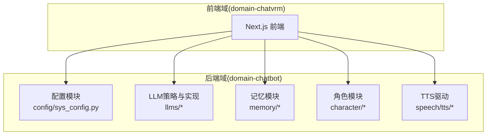
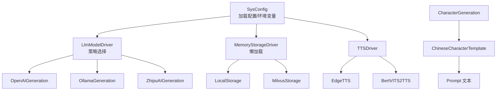
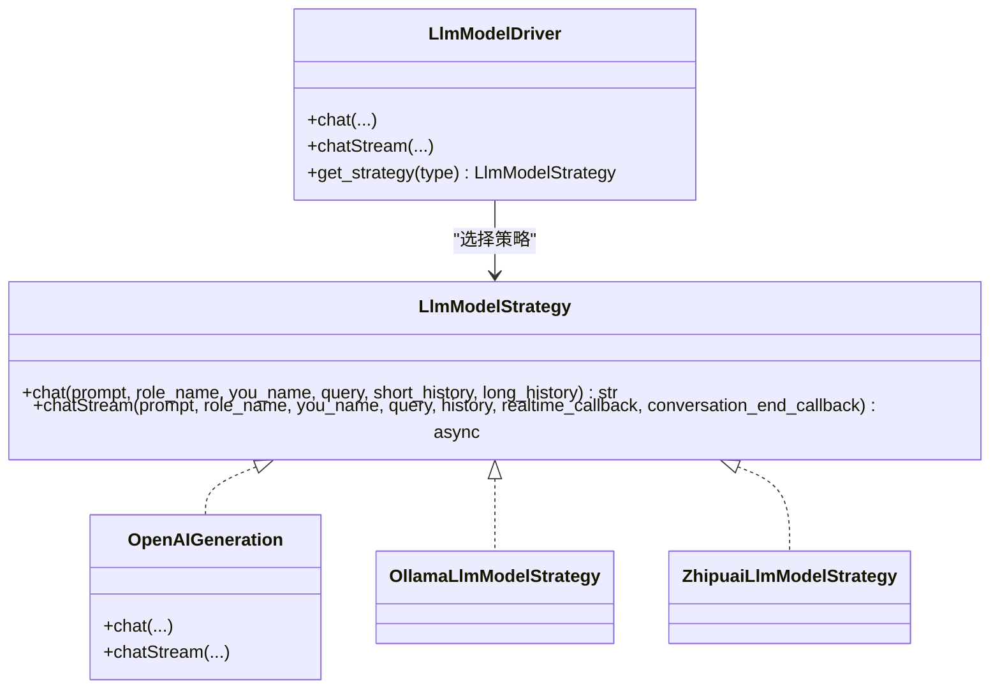
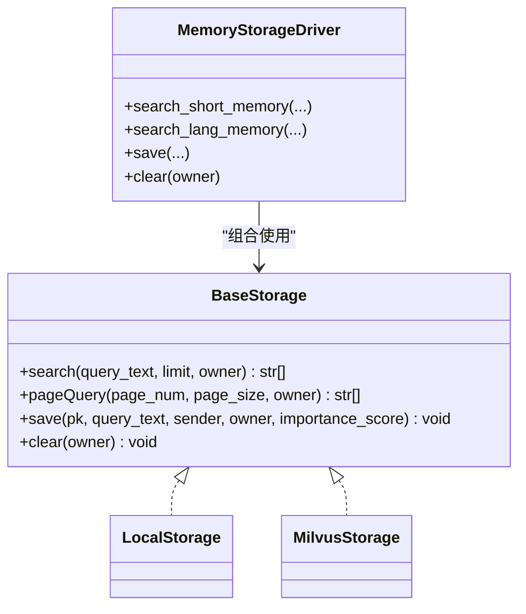
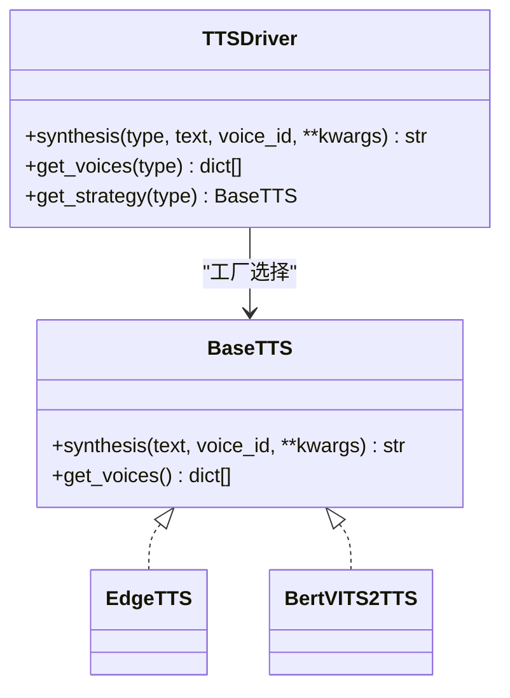
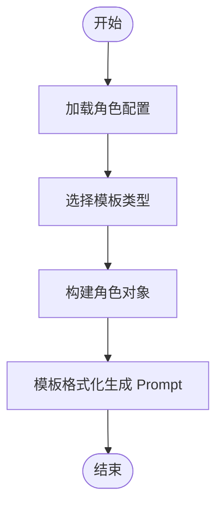
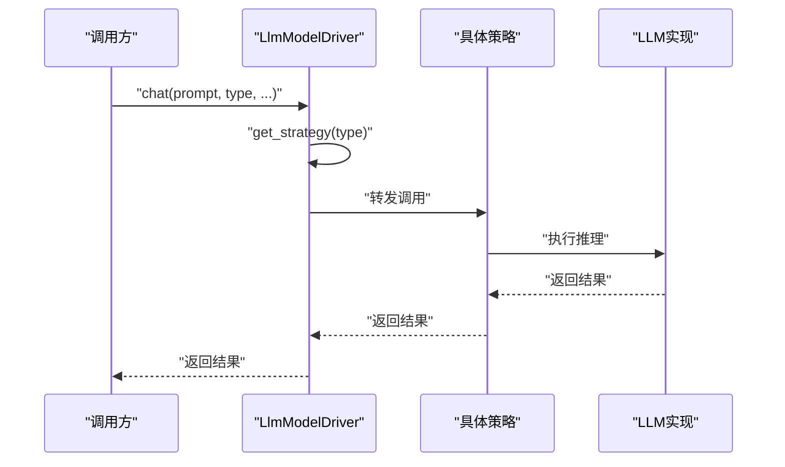
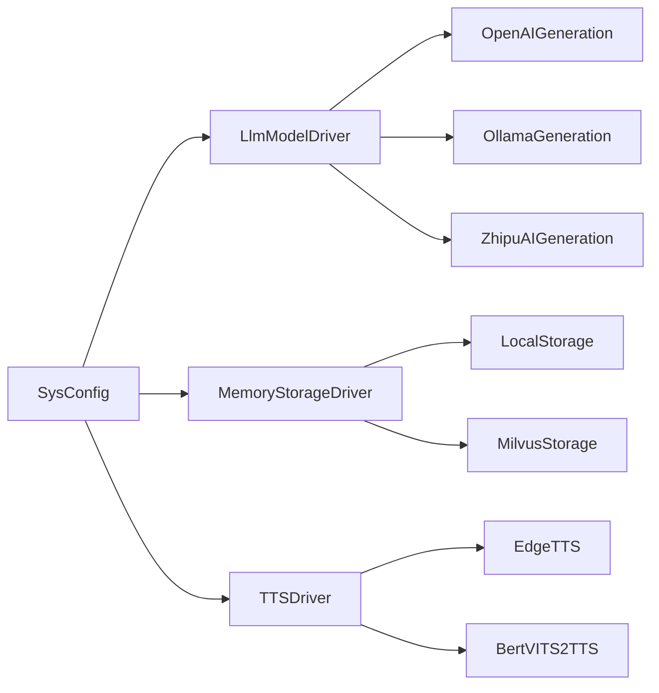

# 扩展开发

<cite>
**本文引用的文件**
- [llm_model_strategy.py](file://domain-chatbot/apps/chatbot/llms/llm_model_strategy.py)
- [openai_chat_robot.py](file://domain-chatbot/apps/chatbot/llms/openai/openai_chat_robot.py)
- [sys_config.py](file://domain-chatbot/apps/chatbot/config/sys_config.py)
- [base_character_template.py](file://domain-chatbot/apps/chatbot/character/base_character_template.py)
- [character.py](file://domain-chatbot/apps/chatbot/character/character.py)
- [character_template_zh.py](file://domain-chatbot/apps/chatbot/character/character_template_zh.py)
- [character_generation.py](file://domain-chatbot/apps/chatbot/character/character_generation.py)
- [role_package_manage.py](file://domain-chatbot/apps/chatbot/character/role_package_manage.py)
- [base_storage.py](file://domain-chatbot/apps/chatbot/memory/base_storage.py)
- [local_storage_impl.py](file://domain-chatbot/apps/chatbot/memory/local/local_storage_impl.py)
- [milvus_storage_impl.py](file://domain-chatbot/apps/chatbot/memory/milvus/milvus_storage_impl.py)
- [memory_storage.py](file://domain-chatbot/apps/chatbot/memory/memory_storage.py)
- [tts_driver.py](file://domain-chatbot/apps/speech/tts/tts_driver.py)
</cite>

## 目录
1. [简介](#简介)
2. [项目结构](#项目结构)
3. [核心组件](#核心组件)
4. [架构总览](#架构总览)
5. [详细组件分析](#详细组件分析)
6. [依赖分析](#依赖分析)
7. [性能考虑](#性能考虑)
8. [故障排查指南](#故障排查指南)
9. [结论](#结论)
10. [附录](#附录)

## 简介
本指南面向插件开发者与系统扩展者，围绕 VirtualWife 的扩展开发机制提供系统化技术参考。内容涵盖：
- LLM 模型插件、存储驱动插件、TTS 引擎插件的开发方法
- 自定义角色包的创建流程（角色模板设计、对话逻辑编写、外观配置）
- 新 LLM 模型的集成过程（接口适配、配置管理、性能优化）
- 第三方服务集成（外部 API 调用、数据格式转换、错误处理）
- 扩展点设计原理（策略模式、工厂模式、观察者模式思想）
- 单元测试、集成测试、性能测试的最佳实践与示例路径

## 项目结构
VirtualWife 采用多域分层与功能模块化组织：
- domain-chatbot：核心聊天机器人域，包含 LLM、记忆、角色、TTS、配置等子模块
- domain-chatvrm：前端交互域（Next.js），负责与后端 API 通信
- infrastructure-*：网关与打包部署配置
- installer：安装与启动脚本

图表来源
- [sys_config.py](file://domain-chatbot/apps/chatbot/config/sys_config.py#L32-L208)
- [llm_model_strategy.py](file://domain-chatbot/apps/chatbot/llms/llm_model_strategy.py#L107-L149)
- [memory_storage.py](file://domain-chatbot/apps/chatbot/memory/memory_storage.py#L14-L176)
- [character_generation.py](file://domain-chatbot/apps/chatbot/character/character_generation.py#L10-L45)
- [tts_driver.py](file://domain-chatbot/apps/speech/tts/tts_driver.py#L54-L74)

章节来源
- [sys_config.py](file://domain-chatbot/apps/chatbot/config/sys_config.py#L32-L208)

## 核心组件
- LLM 模型策略与驱动：通过策略模式封装不同 LLM 实现，统一对外接口；通过驱动器按类型选择策略。
- 记忆存储抽象与实现：抽象基类定义统一接口，本地与 Milvus 两种实现满足短期与长期记忆需求。
- 角色模板与生成：抽象模板定义格式化规范，具体模板（如中文）实现 Prompt 组装；角色生成器按模板类型输出 Prompt。
- TTS 驱动：抽象 TTS 接口，支持多种引擎（如 Edge、Bert-VITS2），通过驱动器按类型选择。

章节来源
- [llm_model_strategy.py](file://domain-chatbot/apps/chatbot/llms/llm_model_strategy.py#L13-L149)
- [base_storage.py](file://domain-chatbot/apps/chatbot/memory/base_storage.py#L4-L27)
- [local_storage_impl.py](file://domain-chatbot/apps/chatbot/memory/local/local_storage_impl.py#L14-L71)
- [milvus_storage_impl.py](file://domain-chatbot/apps/chatbot/memory/milvus/milvus_storage_impl.py#L5-L61)
- [character_template_zh.py](file://domain-chatbot/apps/chatbot/character/character_template_zh.py#L30-L67)
- [character_generation.py](file://domain-chatbot/apps/chatbot/character/character_generation.py#L10-L45)
- [tts_driver.py](file://domain-chatbot/apps/speech/tts/tts_driver.py#L9-L74)

## 架构总览
下图展示扩展点与关键交互：SysConfig 负责加载配置与懒加载记忆驱动；LLM 驱动按类型选择具体策略；记忆模块同时维护短期与长期记忆；角色模板生成 Prompt；TTS 驱动按类型选择具体引擎。

图表来源
- [sys_config.py](file://domain-chatbot/apps/chatbot/config/sys_config.py#L122-L191)
- [llm_model_strategy.py](file://domain-chatbot/apps/chatbot/llms/llm_model_strategy.py#L107-L149)
- [memory_storage.py](file://domain-chatbot/apps/chatbot/memory/memory_storage.py#L20-L25)
- [local_storage_impl.py](file://domain-chatbot/apps/chatbot/memory/local/local_storage_impl.py#L14-L71)
- [milvus_storage_impl.py](file://domain-chatbot/apps/chatbot/memory/milvus/milvus_storage_impl.py#L5-L61)
- [character_generation.py](file://domain-chatbot/apps/chatbot/character/character_generation.py#L19-L42)
- [character_template_zh.py](file://domain-chatbot/apps/chatbot/character/character_template_zh.py#L30-L67)
- [tts_driver.py](file://domain-chatbot/apps/speech/tts/tts_driver.py#L54-L74)

## 详细组件分析

### LLM 模型插件开发指南
- 设计原则
  - 抽象接口：实现统一的同步与异步对话接口，确保与上层调用一致。
  - 环境变量与配置：通过环境变量注入密钥与基础地址，便于多平台部署。
  - 流式输出：支持流式回调，实现实时文本推送与会话结束回调。
- 开发步骤
  1) 定义实现类，继承抽象接口或遵循统一签名
  2) 在 LLM 策略类中注册新策略
  3) 在 LLM 驱动中增加类型分支，完成工厂选择
  4) 在配置模块中新增对应环境变量与开关
  5) 编写单元测试与集成测试，覆盖正常与异常路径
- 示例路径
  - 策略与驱动：[llm_model_strategy.py](file://domain-chatbot/apps/chatbot/llms/llm_model_strategy.py#L13-L149)
  - OpenAI 实现：[openai_chat_robot.py](file://domain-chatbot/apps/chatbot/llms/openai/openai_chat_robot.py#L14-L101)
  - 配置加载与环境变量：[sys_config.py](file://domain-chatbot/apps/chatbot/config/sys_config.py#L122-L139)

图表来源
- [llm_model_strategy.py](file://domain-chatbot/apps/chatbot/llms/llm_model_strategy.py#L13-L149)
- [openai_chat_robot.py](file://domain-chatbot/apps/chatbot/llms/openai/openai_chat_robot.py#L14-L101)

章节来源
- [llm_model_strategy.py](file://domain-chatbot/apps/chatbot/llms/llm_model_strategy.py#L13-L149)
- [openai_chat_robot.py](file://domain-chatbot/apps/chatbot/llms/openai/openai_chat_robot.py#L14-L101)
- [sys_config.py](file://domain-chatbot/apps/chatbot/config/sys_config.py#L122-L139)

### 存储驱动插件开发指南
- 设计原则
  - 抽象接口：统一 search/pageQuery/save/clear 四大能力，保证实现一致性
  - 多实现并存：短期本地存储与长期向量存储可独立扩展
  - 可配置初始化：通过配置字典传入连接信息
- 开发步骤
  1) 实现 BaseStorage 抽象接口
  2) 在 MemoryStorageDriver 中注册新实现
  3) 在 SysConfig 中增加配置项与懒加载逻辑
  4) 编写单元测试与集成测试，覆盖检索、分页、保存、清理
- 示例路径
  - 抽象接口：[base_storage.py](file://domain-chatbot/apps/chatbot/memory/base_storage.py#L4-L27)
  - 本地实现：[local_storage_impl.py](file://domain-chatbot/apps/chatbot/memory/local/local_storage_impl.py#L14-L71)
  - Milvus 实现：[milvus_storage_impl.py](file://domain-chatbot/apps/chatbot/memory/milvus/milvus_storage_impl.py#L5-L61)
  - 驱动与懒加载：[memory_storage.py](file://domain-chatbot/apps/chatbot/memory/memory_storage.py#L14-L25), [sys_config.py](file://domain-chatbot/apps/chatbot/config/sys_config.py#L17-L29)

图表来源
- [base_storage.py](file://domain-chatbot/apps/chatbot/memory/base_storage.py#L4-L27)
- [local_storage_impl.py](file://domain-chatbot/apps/chatbot/memory/local/local_storage_impl.py#L14-L71)
- [milvus_storage_impl.py](file://domain-chatbot/apps/chatbot/memory/milvus/milvus_storage_impl.py#L5-L61)
- [memory_storage.py](file://domain-chatbot/apps/chatbot/memory/memory_storage.py#L14-L107)

章节来源
- [base_storage.py](file://domain-chatbot/apps/chatbot/memory/base_storage.py#L4-L27)
- [local_storage_impl.py](file://domain-chatbot/apps/chatbot/memory/local/local_storage_impl.py#L14-L71)
- [milvus_storage_impl.py](file://domain-chatbot/apps/chatbot/memory/milvus/milvus_storage_impl.py#L5-L61)
- [memory_storage.py](file://domain-chatbot/apps/chatbot/memory/memory_storage.py#L14-L107)
- [sys_config.py](file://domain-chatbot/apps/chatbot/config/sys_config.py#L17-L29)

### TTS 引擎插件开发指南
- 设计原则
  - 抽象接口：统一 synthesis 与 get_voices，保证引擎可替换
  - 驱动器工厂：按类型选择具体引擎实例
  - 参数透传：允许按引擎特性传递额外参数（如噪声、比例等）
- 开发步骤
  1) 实现 BaseTTS 抽象类
  2) 在 TTSDriver 中注册新引擎类型
  3) 在前端或后端调用时通过类型参数选择引擎
  4) 编写单元测试与集成测试，验证音频生成与声音列表
- 示例路径
  - 抽象与实现：[tts_driver.py](file://domain-chatbot/apps/speech/tts/tts_driver.py#L9-L74)

图表来源
- [tts_driver.py](file://domain-chatbot/apps/speech/tts/tts_driver.py#L9-L74)

章节来源
- [tts_driver.py](file://domain-chatbot/apps/speech/tts/tts_driver.py#L9-L74)

### 自定义角色包创建流程
- 角色模板设计
  - 定义 BaseCharacterTemplate 抽象类，约束 format 方法
  - 具体模板（如 ChineseCharacterTemplate）实现 Prompt 组装逻辑
- 对话逻辑编写
  - 角色生成器根据模板类型选择模板，输出最终 Prompt
  - 支持从数据库加载角色或回退默认角色
- 外观配置
  - 角色数据结构包含角色名、Persona、个性、场景、对话样例等字段
  - 角色包管理器支持安装/卸载 ZIP 包，解析系统提示与检索索引
- RAG 示例生成
  - 基于 FAISS 向量检索与重排序，生成对话样例
- 示例路径
  - 抽象模板：[base_character_template.py](file://domain-chatbot/apps/chatbot/character/base_character_template.py#L5-L12)
  - 角色数据结构：[character.py](file://domain-chatbot/apps/chatbot/character/character.py#L1-L39)
  - 中文模板实现：[character_template_zh.py](file://domain-chatbot/apps/chatbot/character/character_template_zh.py#L30-L67)
  - 角色生成器：[character_generation.py](file://domain-chatbot/apps/chatbot/character/character_generation.py#L10-L45)
  - 角色包管理与 RAG：[role_package_manage.py](file://domain-chatbot/apps/chatbot/character/role_package_manage.py#L103-L163)

图表来源
- [character_generation.py](file://domain-chatbot/apps/chatbot/character/character_generation.py#L19-L42)
- [character_template_zh.py](file://domain-chatbot/apps/chatbot/character/character_template_zh.py#L30-L67)

章节来源
- [base_character_template.py](file://domain-chatbot/apps/chatbot/character/base_character_template.py#L5-L12)
- [character.py](file://domain-chatbot/apps/chatbot/character/character.py#L1-L39)
- [character_template_zh.py](file://domain-chatbot/apps/chatbot/character/character_template_zh.py#L30-L67)
- [character_generation.py](file://domain-chatbot/apps/chatbot/character/character_generation.py#L10-L45)
- [role_package_manage.py](file://domain-chatbot/apps/chatbot/character/role_package_manage.py#L103-L163)

### 新 LLM 模型集成流程
- 接口适配
  - 实现同步 chat 与异步 chatStream 接口，保持参数与返回约定一致
  - 读取环境变量（如 API Key、Base URL）进行认证与路由
- 配置管理
  - 在 SysConfig 中新增配置项与环境变量映射
  - 在 LlmModelDriver 中增加类型分支
- 性能优化
  - 使用流式输出减少首字延迟
  - 合理缓存与连接复用，避免频繁握手
  - 控制历史长度与上下文截断，降低 Token 消耗
- 示例路径
  - OpenAI 实现：[openai_chat_robot.py](file://domain-chatbot/apps/chatbot/llms/openai/openai_chat_robot.py#L14-L101)
  - 配置加载：[sys_config.py](file://domain-chatbot/apps/chatbot/config/sys_config.py#L122-L139)
  - 策略与驱动：[llm_model_strategy.py](file://domain-chatbot/apps/chatbot/llms/llm_model_strategy.py#L107-L149)

图表来源
- [llm_model_strategy.py](file://domain-chatbot/apps/chatbot/llms/llm_model_strategy.py#L115-L120)
- [openai_chat_robot.py](file://domain-chatbot/apps/chatbot/llms/openai/openai_chat_robot.py#L26-L44)

章节来源
- [openai_chat_robot.py](file://domain-chatbot/apps/chatbot/llms/openai/openai_chat_robot.py#L14-L101)
- [sys_config.py](file://domain-chatbot/apps/chatbot/config/sys_config.py#L122-L139)
- [llm_model_strategy.py](file://domain-chatbot/apps/chatbot/llms/llm_model_strategy.py#L107-L149)

### 第三方服务集成指导
- 外部 API 调用
  - 通过环境变量注入凭据与端点，避免硬编码
  - 统一封装请求与响应，提供超时与重试策略
- 数据格式转换
  - 明确输入输出结构，必要时进行 JSON/文本解析与校验
- 错误处理
  - 捕获网络异常与业务异常，记录日志并降级处理
- 示例路径
  - LLM 实现中的请求封装与回调：[openai_chat_robot.py](file://domain-chatbot/apps/chatbot/llms/openai/openai_chat_robot.py#L26-L101)
  - 记忆模块异常捕获与日志记录：[memory_storage.py](file://domain-chatbot/apps/chatbot/memory/memory_storage.py#L49-L54)

章节来源
- [openai_chat_robot.py](file://domain-chatbot/apps/chatbot/llms/openai/openai_chat_robot.py#L26-L101)
- [memory_storage.py](file://domain-chatbot/apps/chatbot/memory/memory_storage.py#L49-L54)

### 扩展点设计原理
- 策略模式
  - LLM 策略类与驱动器：按类型切换不同实现，便于横向扩展
- 工厂模式
  - LLM 驱动与 TTS 驱动：通过 get_strategy/type 工厂方法创建实例
- 观察者模式思想
  - 流式回调：实时回调与会话结束回调，体现事件驱动与观察者思想

章节来源
- [llm_model_strategy.py](file://domain-chatbot/apps/chatbot/llms/llm_model_strategy.py#L107-L149)
- [tts_driver.py](file://domain-chatbot/apps/speech/tts/tts_driver.py#L54-L74)

### 测试最佳实践
- 单元测试
  - 针对策略与驱动的分支逻辑进行断言
  - Mock 外部依赖（如 LLM API、存储实现）
- 集成测试
  - 覆盖角色模板生成、记忆检索与保存、TTS 合成等端到端流程
- 性能测试
  - 压测流式输出延迟与吞吐，评估连接池与缓存效果
- 示例路径
  - 角色生成器与模板：[character_generation.py](file://domain-chatbot/apps/chatbot/character/character_generation.py#L19-L42)
  - 记忆保存与检索：[memory_storage.py](file://domain-chatbot/apps/chatbot/memory/memory_storage.py#L56-L83)
  - TTS 合成与声音列表：[tts_driver.py](file://domain-chatbot/apps/speech/tts/tts_driver.py#L57-L65)

章节来源
- [character_generation.py](file://domain-chatbot/apps/chatbot/character/character_generation.py#L19-L42)
- [memory_storage.py](file://domain-chatbot/apps/chatbot/memory/memory_storage.py#L56-L83)
- [tts_driver.py](file://domain-chatbot/apps/speech/tts/tts_driver.py#L57-L65)

## 依赖分析
- 组件耦合
  - SysConfig 与各模块存在配置耦合，建议通过依赖注入或惰性初始化降低耦合度
  - LLM 驱动与具体实现松耦合，便于新增模型
  - 记忆模块通过抽象接口与实现解耦，支持多后端
- 外部依赖
  - LLM：litellm
  - 向量库：Milvus
  - RAG：FAISS、FlagEmbedding
- 潜在循环依赖
  - 当前结构清晰，未发现直接循环依赖

图表来源
- [sys_config.py](file://domain-chatbot/apps/chatbot/config/sys_config.py#L159-L191)
- [llm_model_strategy.py](file://domain-chatbot/apps/chatbot/llms/llm_model_strategy.py#L107-L149)
- [memory_storage.py](file://domain-chatbot/apps/chatbot/memory/memory_storage.py#L14-L25)
- [tts_driver.py](file://domain-chatbot/apps/speech/tts/tts_driver.py#L54-L74)

章节来源
- [sys_config.py](file://domain-chatbot/apps/chatbot/config/sys_config.py#L159-L191)
- [llm_model_strategy.py](file://domain-chatbot/apps/chatbot/llms/llm_model_strategy.py#L107-L149)
- [memory_storage.py](file://domain-chatbot/apps/chatbot/memory/memory_storage.py#L14-L25)
- [tts_driver.py](file://domain-chatbot/apps/speech/tts/tts_driver.py#L54-L74)

## 性能考虑
- LLM
  - 使用流式输出降低首字延迟
  - 控制历史长度与上下文截断，减少 Token 消耗
  - 合理设置温度与模型参数
- 记忆
  - 短期记忆使用本地存储，长期记忆使用 Milvus 向量检索
  - 摘要与重要性评分可选启用，平衡性能与质量
- TTS
  - 预热引擎实例，避免首次调用冷启动开销
  - 音频参数（如噪声、比例）按需调整

## 故障排查指南
- LLM 无法连接
  - 检查 OPENAI_API_KEY、OPENAI_BASE_URL 等环境变量是否正确
  - 查看流式回调是否正确触发与结束
- 记忆异常
  - 捕获异常并记录堆栈，确认 Milvus 连接与权限
  - 检查启用开关与配置项
- TTS 问题
  - 确认引擎类型与声音列表可用
  - 检查音频文件生成路径与权限

章节来源
- [openai_chat_robot.py](file://domain-chatbot/apps/chatbot/llms/openai/openai_chat_robot.py#L26-L101)
- [memory_storage.py](file://domain-chatbot/apps/chatbot/memory/memory_storage.py#L49-L54)
- [tts_driver.py](file://domain-chatbot/apps/speech/tts/tts_driver.py#L57-L65)

## 结论
通过策略模式、工厂模式与抽象接口，VirtualWife 提供了清晰的扩展点，使开发者能够以最小改动集成新的 LLM、存储与 TTS 引擎，并构建自定义角色包。建议在扩展过程中严格遵循接口契约、完善测试与监控，确保系统的稳定性与可维护性。

## 附录
- 快速检查清单
  - 实现抽象接口并通过单元测试
  - 在 SysConfig 中添加配置项与环境变量
  - 在驱动器中注册新类型
  - 编写集成测试覆盖关键流程
  - 记录日志并设置告警阈值