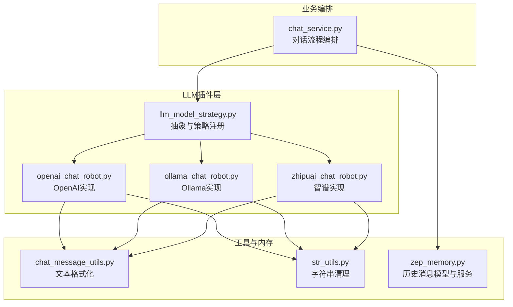
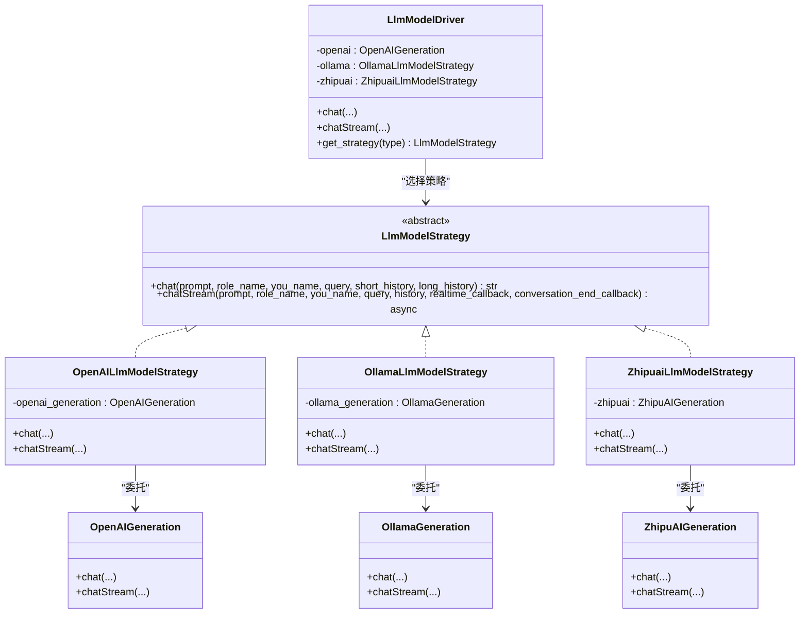
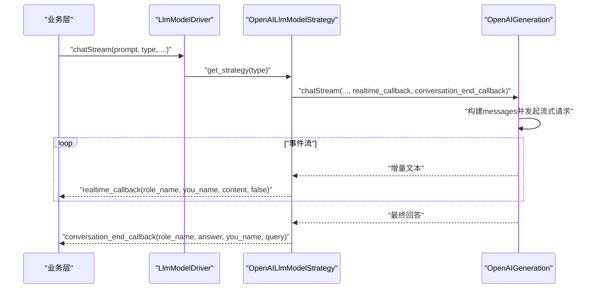
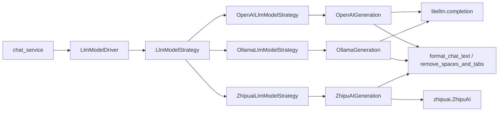

# LLM模型插件

<cite>
**本文引用的文件**   
- [llm_model_strategy.py](file://domain-chatbot/apps/chatbot/llms/llm_model_strategy.py)
- [openai_chat_robot.py](file://domain-chatbot/apps/chatbot/llms/openai/openai_chat_robot.py)
- [ollama_chat_robot.py](file://domain-chatbot/apps/chatbot/llms/ollama/ollama_chat_robot.py)
- [zhipuai_chat_robot.py](file://domain-chatbot/apps/chatbot/llms/zhipuai/zhipuai_chat_robot.py)
- [chat_message_utils.py](file://domain-chatbot/apps/chatbot/utils/chat_message_utils.py)
- [str_utils.py](file://domain-chatbot/apps/chatbot/utils/str_utils.py)
- [zep_memory.py](file://domain-chatbot/apps/chatbot/memory/zep/zep_memory.py)
- [chat_service.py](file://domain-chatbot/apps/chatbot/chat/chat_service.py)
</cite>

## 目录
1. [引言](#引言)
2. [项目结构](#项目结构)
3. [核心组件](#核心组件)
4. [架构总览](#架构总览)
5. [详细组件分析](#详细组件分析)
6. [依赖分析](#依赖分析)
7. [性能考虑](#性能考虑)
8. [故障排查指南](#故障排查指南)
9. [结论](#结论)
10. [附录](#附录)

## 引言
本指南面向VirtualWife项目的LLM模型插件开发者，系统讲解策略模式在LLM插件系统中的应用，覆盖抽象基类设计、具体策略实现、插件注册与调用、配置加载、错误处理与性能优化，并提供自定义插件的完整开发流程与最佳实践。文档以实际源码为依据，配合图示帮助不同技术背景的读者快速上手。

## 项目结构
LLM插件位于后端Python工程domain-chatbot中，采用按功能域分层的组织方式：
- 抽象与策略：llms目录下定义统一接口与具体策略实现
- 具体插件：openai、ollama、zhipuai子目录分别封装第三方LLM接入
- 工具与内存：utils提供文本格式化与字符串处理；memory/zep提供历史消息存取
- 服务编排：chat_service负责业务流程编排，调用LLM驱动执行对话

图表来源
- [llm_model_strategy.py](file://domain-chatbot/apps/chatbot/llms/llm_model_strategy.py#L13-L149)
- [openai_chat_robot.py](file://domain-chatbot/apps/chatbot/llms/openai/openai_chat_robot.py#L14-L101)
- [ollama_chat_robot.py](file://domain-chatbot/apps/chatbot/llms/ollama/ollama_chat_robot.py#L14-L100)
- [zhipuai_chat_robot.py](file://domain-chatbot/apps/chatbot/llms/zhipuai/zhipuai_chat_robot.py#L13-L71)
- [chat_message_utils.py](file://domain-chatbot/apps/chatbot/utils/chat_message_utils.py#L4-L27)
- [str_utils.py](file://domain-chatbot/apps/chatbot/utils/str_utils.py#L21-L23)
- [zep_memory.py](file://domain-chatbot/apps/chatbot/memory/zep/zep_memory.py#L11-L169)
- [chat_service.py](file://domain-chatbot/apps/chatbot/chat/chat_service.py#L15-L45)

章节来源
- [llm_model_strategy.py](file://domain-chatbot/apps/chatbot/llms/llm_model_strategy.py#L1-L149)
- [chat_service.py](file://domain-chatbot/apps/chatbot/chat/chat_service.py#L15-L45)

## 核心组件
- 抽象基类与策略注册
  - LlmModelStrategy定义两个核心接口：同步chat与异步chatStream，确保所有插件实现一致的调用契约
  - LlmModelDriver负责根据type选择具体策略，提供统一入口
- 具体策略实现
  - OpenAILlmModelStrategy、OllamaLlmModelStrategy、ZhipuaiLlmModelStrategy分别委托底层生成器完成对话
- 底层生成器
  - OpenAIGeneration、OllamaGeneration、ZhipuAIGeneration封装具体SDK调用与流式处理
- 工具与数据模型
  - ChatHistroy用于内存历史消息的结构化表示
  - 文本处理工具提供格式化与清洗能力

章节来源
- [llm_model_strategy.py](file://domain-chatbot/apps/chatbot/llms/llm_model_strategy.py#L13-L149)
- [openai_chat_robot.py](file://domain-chatbot/apps/chatbot/llms/openai/openai_chat_robot.py#L14-L101)
- [ollama_chat_robot.py](file://domain-chatbot/apps/chatbot/llms/ollama/ollama_chat_robot.py#L14-L100)
- [zhipuai_chat_robot.py](file://domain-chatbot/apps/chatbot/llms/zhipuai/zhipuai_chat_robot.py#L13-L71)
- [zep_memory.py](file://domain-chatbot/apps/chatbot/memory/zep/zep_memory.py#L11-L18)

## 架构总览
策略模式将“对话协议”与“具体实现”解耦，业务层仅依赖抽象，通过类型标识动态选择策略。流式对话通过异步回调实现边生成边输出，支持实时渲染与最终汇总。

图表来源
- [llm_model_strategy.py](file://domain-chatbot/apps/chatbot/llms/llm_model_strategy.py#L13-L149)
- [openai_chat_robot.py](file://domain-chatbot/apps/chatbot/llms/openai/openai_chat_robot.py#L14-L101)
- [ollama_chat_robot.py](file://domain-chatbot/apps/chatbot/llms/ollama/ollama_chat_robot.py#L14-L100)
- [zhipuai_chat_robot.py](file://domain-chatbot/apps/chatbot/llms/zhipuai/zhipuai_chat_robot.py#L13-L71)

## 详细组件分析

### 抽象基类与驱动器
- 设计要点
  - 统一接口：chat与chatStream的参数与职责边界清晰，便于替换与扩展
  - 动态选择：LlmModelDriver依据type映射到具体策略，支持未来新增插件无需修改业务层
- 关键行为
  - chat：返回完整回复文本
  - chatStream：异步流式生成，通过回调实现实时与结束通知

章节来源
- [llm_model_strategy.py](file://domain-chatbot/apps/chatbot/llms/llm_model_strategy.py#L13-L29)
- [llm_model_strategy.py](file://domain-chatbot/apps/chatbot/llms/llm_model_strategy.py#L107-L149)

### OpenAI插件实现
- 同步对话(chat)
  - 参数：prompt、role_name、you_name、query、short_history、long_history
  - 行为：构造messages，调用completion，提取choices[0].message.content
- 异步流式对话(chatStream)
  - 参数：prompt、role_name、you_name、query、history、realtime_callback、conversation_end_callback
  - 行为：构建system+历史+当前用户消息，开启stream=true，逐块读取delta.content，经字符串清理与格式化后回调

图表来源
- [llm_model_strategy.py](file://domain-chatbot/apps/chatbot/llms/llm_model_strategy.py#L45-L60)
- [openai_chat_robot.py](file://domain-chatbot/apps/chatbot/llms/openai/openai_chat_robot.py#L46-L101)

章节来源
- [openai_chat_robot.py](file://domain-chatbot/apps/chatbot/llms/openai/openai_chat_robot.py#L26-L44)
- [openai_chat_robot.py](file://domain-chatbot/apps/chatbot/llms/openai/openai_chat_robot.py#L46-L101)

### Ollama插件实现
- 同步对话(chat)
  - 参数与行为与OpenAI类似，但model前缀为"ollama/"，通过OLLAMA_API_BASE与OLLAMA_API_MODEL_NAME配置
- 异步流式对话(chatStream)
  - 与OpenAI一致的流式处理流程，适用于本地或私有部署的Ollama服务

章节来源
- [ollama_chat_robot.py](file://domain-chatbot/apps/chatbot/llms/ollama/ollama_chat_robot.py#L25-L43)
- [ollama_chat_robot.py](file://domain-chatbot/apps/chatbot/llms/ollama/ollama_chat_robot.py#L45-L100)

### 智谱清言插件实现
- 同步对话(chat)
  - 使用ZhipuAI SDK，构造messages并调用chat.completions.create，非流式
- 异步流式对话(chatStream)
  - 流式响应逐块读取delta.content，进行内容清洗与格式化，回调通知

章节来源
- [zhipuai_chat_robot.py](file://domain-chatbot/apps/chatbot/llms/zhipuai/zhipuai_chat_robot.py#L24-L36)
- [zhipuai_chat_robot.py](file://domain-chatbot/apps/chatbot/llms/zhipuai/zhipuai_chat_robot.py#L38-L71)

### 数据模型与工具
- ChatHistroy
  - 角色与内容的简单结构，用于历史消息的序列化与反序列化
- 文本处理工具
  - format_chat_text：去除多余标记与称呼，统一输出格式
  - remove_spaces_and_tabs：过滤空白字符，提升实时显示质量

章节来源
- [zep_memory.py](file://domain-chatbot/apps/chatbot/memory/zep/zep_memory.py#L11-L18)
- [chat_message_utils.py](file://domain-chatbot/apps/chatbot/utils/chat_message_utils.py#L4-L22)
- [str_utils.py](file://domain-chatbot/apps/chatbot/utils/str_utils.py#L21-L23)

### 业务编排与调用链
- chat_service通过角色生成与配置加载，拼装prompt与历史，调用LlmModelDriver执行对话，并在必要时保存记忆
- 该流程体现了策略模式在真实业务中的落地：业务层不关心具体LLM实现，仅依赖统一接口

章节来源
- [chat_service.py](file://domain-chatbot/apps/chatbot/chat/chat_service.py#L15-L45)

## 依赖分析
- 组件内聚与耦合
  - 策略层与生成器层松耦合：策略仅暴露接口，生成器封装SDK细节
  - 工具层独立：文本处理与历史模型可复用，降低重复逻辑
- 外部依赖
  - OpenAI/Ollama使用litellm的completion接口
  - 智谱使用官方zhipuai SDK
  - 内存服务依赖zep-python客户端

图表来源
- [llm_model_strategy.py](file://domain-chatbot/apps/chatbot/llms/llm_model_strategy.py#L13-L149)
- [openai_chat_robot.py](file://domain-chatbot/apps/chatbot/llms/openai/openai_chat_robot.py#L5-L24)
- [ollama_chat_robot.py](file://domain-chatbot/apps/chatbot/llms/ollama/ollama_chat_robot.py#L5-L23)
- [zhipuai_chat_robot.py](file://domain-chatbot/apps/chatbot/llms/zhipuai/zhipuai_chat_robot.py#L4-L22)
- [chat_message_utils.py](file://domain-chatbot/apps/chatbot/utils/chat_message_utils.py#L4-L22)
- [str_utils.py](file://domain-chatbot/apps/chatbot/utils/str_utils.py#L21-L23)
- [chat_service.py](file://domain-chatbot/apps/chatbot/chat/chat_service.py#L15-L45)

## 性能考虑
- 流式输出优化
  - 实时回调减少等待时间，建议前端按增量拼接，避免全量重绘
  - 字符串清理在事件粒度进行，降低UI渲染压力
- 请求与连接
  - OpenAI/Ollama均支持stream=true，合理利用以提升感知速度
  - 私有部署建议固定api_base与model名称，减少参数解析开销
- 文本格式化
  - 在流式过程中尽早去除非必要字符，减少最终格式化成本
- 并发与锁
  - 当前驱动未见显式并发控制，若需多线程/多实例，请评估回调一致性与状态隔离

[本节为通用指导，不直接分析特定文件]

## 故障排查指南
- 环境变量缺失
  - OpenAI：检查OPENAI_API_KEY与OPENAI_BASE_URL是否正确加载
  - Ollama：检查OLLAMA_API_BASE与OLLAMA_API_MODEL_NAME
  - 智谱：检查ZHIPUAI_API_KEY
- 流式回调异常
  - 确认realtime_callback与conversation_end_callback签名一致，且在事件循环中正确调度
- 历史消息为空
  - 若Zep服务不可用或会话不存在，历史列表可能为空，需在业务层做降级处理
- 输出格式异常
  - 检查format_chat_text与remove_spaces_and_tabs的调用顺序与输入内容

章节来源
- [openai_chat_robot.py](file://domain-chatbot/apps/chatbot/llms/openai/openai_chat_robot.py#L20-L24)
- [ollama_chat_robot.py](file://domain-chatbot/apps/chatbot/llms/ollama/ollama_chat_robot.py#L19-L23)
- [zhipuai_chat_robot.py](file://domain-chatbot/apps/chatbot/llms/zhipuai/zhipuai_chat_robot.py#L18-L22)
- [zep_memory.py](file://domain-chatbot/apps/chatbot/memory/zep/zep_memory.py#L105-L117)

## 结论
通过策略模式，VirtualWife实现了对多厂商LLM的统一接入与灵活切换。开发者只需遵循统一接口，即可快速扩展新插件；同时，流式回调与文本处理工具保证了良好的用户体验与可维护性。建议在新增插件时严格遵守参数契约、回调约定与错误处理规范，确保系统稳定性与一致性。

[本节为总结性内容，不直接分析特定文件]

## 附录

### 自定义LLM插件开发流程
- 步骤
  - 新建生成器类，实现chat与chatStream方法，封装SDK调用与流式处理
  - 新建策略类，继承LlmModelStrategy，将生成器作为成员并转发调用
  - 在LlmModelDriver中注册新策略，并在get_strategy中添加类型分支
  - 在业务层通过LlmModelDriver.chat或chatStream调用
- 最佳实践
  - 明确参数语义与返回格式，保持与现有插件一致
  - 流式场景务必在事件循环中调用回调，避免阻塞
  - 对输出进行必要的格式化与清洗，提升前端渲染质量
  - 提供完善的错误处理与日志记录，便于定位问题

章节来源
- [llm_model_strategy.py](file://domain-chatbot/apps/chatbot/llms/llm_model_strategy.py#L13-L29)
- [llm_model_strategy.py](file://domain-chatbot/apps/chatbot/llms/llm_model_strategy.py#L107-L149)
- [openai_chat_robot.py](file://domain-chatbot/apps/chatbot/llms/openai/openai_chat_robot.py#L26-L44)
- [ollama_chat_robot.py](file://domain-chatbot/apps/chatbot/llms/ollama/ollama_chat_robot.py#L25-L43)
- [zhipuai_chat_robot.py](file://domain-chatbot/apps/chatbot/llms/zhipuai/zhipuai_chat_robot.py#L24-L36)

### 参数与返回规范（参考）
- chat
  - 输入：prompt、role_name、you_name、query、short_history、long_history
  - 返回：str（完整回复文本）
- chatStream
  - 输入：prompt、role_name、you_name、query、history、realtime_callback、conversation_end_callback
  - 行为：增量回调realtime_callback，结束时回调conversation_end_callback

章节来源
- [llm_model_strategy.py](file://domain-chatbot/apps/chatbot/llms/llm_model_strategy.py#L16-L29)
- [openai_chat_robot.py](file://domain-chatbot/apps/chatbot/llms/openai/openai_chat_robot.py#L46-L101)
- [ollama_chat_robot.py](file://domain-chatbot/apps/chatbot/llms/ollama/ollama_chat_robot.py#L45-L100)
- [zhipuai_chat_robot.py](file://domain-chatbot/apps/chatbot/llms/zhipuai/zhipuai_chat_robot.py#L38-L71)