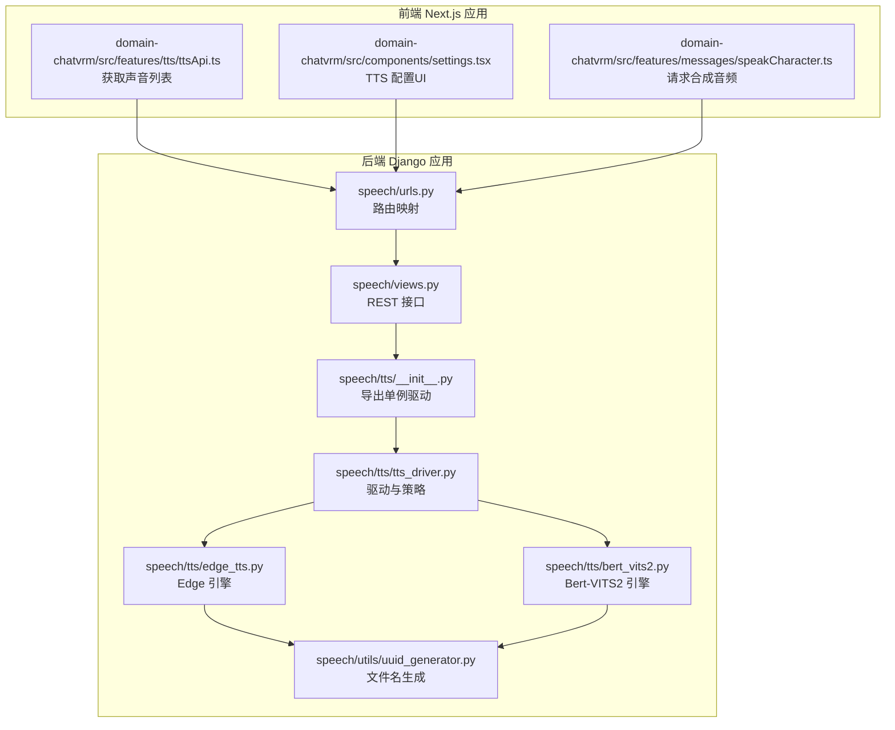
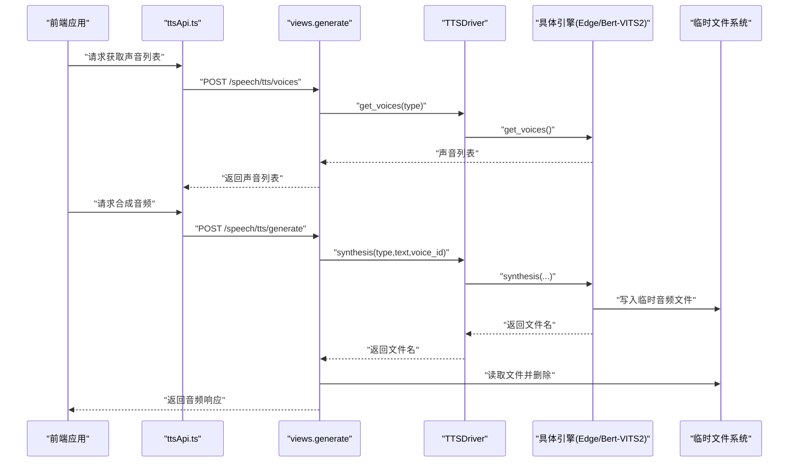
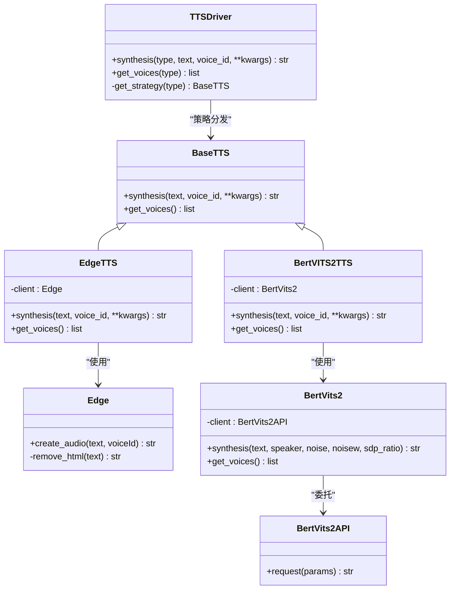
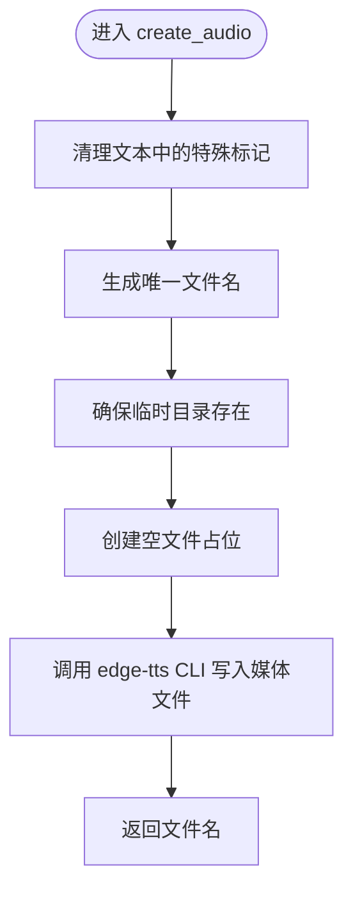
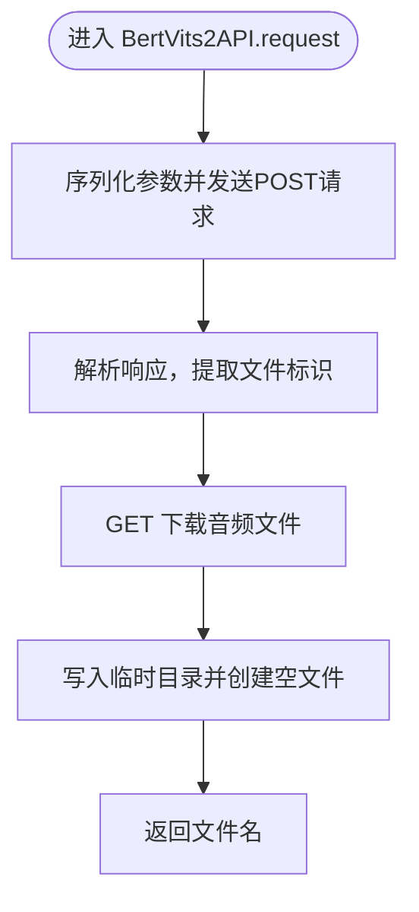
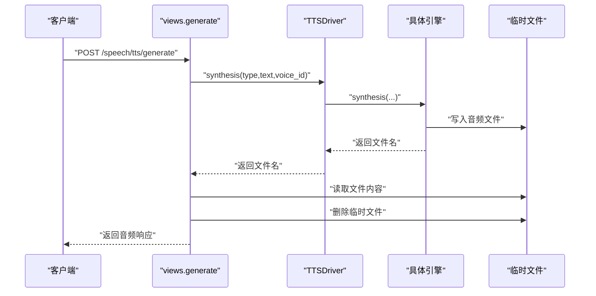
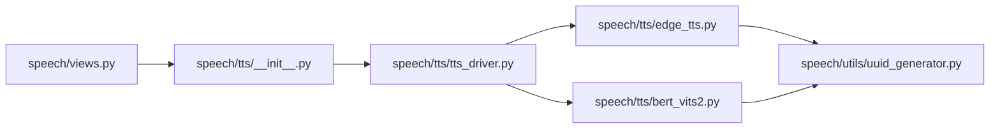

# TTS引擎插件

<cite>
**本文引用的文件**
- [domain-chatbot/apps/speech/tts/tts_driver.py](file://domain-chatbot/apps/speech/tts/tts_driver.py)
- [domain-chatbot/apps/speech/tts/edge_tts.py](file://domain-chatbot/apps/speech/tts/edge_tts.py)
- [domain-chatbot/apps/speech/tts/bert_vits2.py](file://domain-chatbot/apps/speech/tts/bert_vits2.py)
- [domain-chatbot/apps/speech/views.py](file://domain-chatbot/apps/speech/views.py)
- [domain-chatbot/apps/speech/urls.py](file://domain-chatbot/apps/speech/urls.py)
- [domain-chatbot/apps/speech/tts/__init__.py](file://domain-chatbot/apps/speech/tts/__init__.py)
- [domain-chatbot/apps/speech/utils/uuid_generator.py](file://domain-chatbot/apps/speech/utils/uuid_generator.py)
- [domain-chatvrm/src/features/tts/ttsApi.ts](file://domain-chatvrm/src/features/tts/ttsApi.ts)
- [domain-chatvrm/src/components/settings.tsx](file://domain-chatvrm/src/components/settings.tsx)
- [domain-chatvrm/src/features/messages/speakCharacter.ts](file://domain-chatvrm/src/features/messages/speakCharacter.ts)
</cite>

## 目录
1. [简介](#简介)
2. [项目结构](#项目结构)
3. [核心组件](#核心组件)
4. [架构总览](#架构总览)
5. [组件详解](#组件详解)
6. [依赖关系分析](#依赖关系分析)
7. [性能与优化](#性能与优化)
8. [故障排查指南](#故障排查指南)
9. [结论](#结论)
10. [附录：自定义TTS引擎插件开发流程](#附录自定义tts引擎插件开发流程)

## 简介
本指南面向VirtualWife项目的TTS引擎插件开发者，系统性讲解TTS驱动层的设计与实现，覆盖抽象接口规范、具体引擎适配、参数配置、音频格式处理、实时流式输出支持建议、初始化与配置管理、错误处理与资源清理，以及性能优化与扩展实践。文档同时给出Edge TTS与Bert-VITS2两种引擎的集成要点，并提供自定义引擎的完整开发流程与关键实现参考。

## 项目结构
TTS能力主要位于后端Django应用的speech模块中，前端Next.js应用通过HTTP接口调用后端TTS服务；TTS驱动层采用策略模式，按类型分发到不同引擎实现。

图表来源
- [domain-chatbot/apps/speech/views.py](file://domain-chatbot/apps/speech/views.py#L1-L74)
- [domain-chatbot/apps/speech/urls.py](file://domain-chatbot/apps/speech/urls.py#L1-L9)
- [domain-chatbot/apps/speech/tts/__init__.py](file://domain-chatbot/apps/speech/tts/__init__.py#L2-L4)
- [domain-chatbot/apps/speech/tts/tts_driver.py](file://domain-chatbot/apps/speech/tts/tts_driver.py#L54-L74)
- [domain-chatbot/apps/speech/tts/edge_tts.py](file://domain-chatbot/apps/speech/tts/edge_tts.py#L27-L51)
- [domain-chatbot/apps/speech/tts/bert_vits2.py](file://domain-chatbot/apps/speech/tts/bert_vits2.py#L647-L664)
- [domain-chatbot/apps/speech/utils/uuid_generator.py](file://domain-chatbot/apps/speech/utils/uuid_generator.py#L4-L11)
- [domain-chatvrm/src/features/tts/ttsApi.ts](file://domain-chatvrm/src/features/tts/ttsApi.ts#L11-L25)
- [domain-chatvrm/src/components/settings.tsx](file://domain-chatvrm/src/components/settings.tsx#L232-L273)
- [domain-chatvrm/src/features/messages/speakCharacter.ts](file://domain-chatvrm/src/features/messages/speakCharacter.ts#L51-L81)

章节来源
- [domain-chatbot/apps/speech/views.py](file://domain-chatbot/apps/speech/views.py#L1-L74)
- [domain-chatbot/apps/speech/urls.py](file://domain-chatbot/apps/speech/urls.py#L1-L9)
- [domain-chatbot/apps/speech/tts/__init__.py](file://domain-chatbot/apps/speech/tts/__init__.py#L2-L4)

## 核心组件
- 抽象接口与驱动
  - BaseTTS：定义统一的合成接口与声音列表接口。
  - TTSDriver：根据类型选择具体引擎，封装调用与日志记录。
- 引擎实现
  - EdgeTTS：基于edge-tts命令行工具进行本地合成，返回临时文件名。
  - BertVITS2TTS：封装远程API请求，下载音频文件，返回临时文件名。
- 视图与路由
  - generate：接收文本、声音ID与引擎类型，返回音频文件。
  - get_voices：返回指定引擎的声音列表。
- 前端对接
  - ttsApi.ts：获取声音列表。
  - settings.tsx：TTS类型与声音选择UI。
  - speakCharacter.ts：向后端发起合成请求并获取音频缓冲区。

章节来源
- [domain-chatbot/apps/speech/tts/tts_driver.py](file://domain-chatbot/apps/speech/tts/tts_driver.py#L9-L74)
- [domain-chatbot/apps/speech/tts/edge_tts.py](file://domain-chatbot/apps/speech/tts/edge_tts.py#L27-L51)
- [domain-chatbot/apps/speech/tts/bert_vits2.py](file://domain-chatbot/apps/speech/tts/bert_vits2.py#L647-L664)
- [domain-chatbot/apps/speech/views.py](file://domain-chatbot/apps/speech/views.py#L16-L58)
- [domain-chatvrm/src/features/tts/ttsApi.ts](file://domain-chatvrm/src/features/tts/ttsApi.ts#L11-L25)
- [domain-chatvrm/src/components/settings.tsx](file://domain-chatvrm/src/components/settings.tsx#L232-L273)
- [domain-chatvrm/src/features/messages/speakCharacter.ts](file://domain-chatvrm/src/features/messages/speakCharacter.ts#L51-L81)

## 架构总览
下图展示从前端到后端TTS服务的整体调用链路与数据流向。

图表来源
- [domain-chatbot/apps/speech/views.py](file://domain-chatbot/apps/speech/views.py#L16-L58)
- [domain-chatbot/apps/speech/tts/tts_driver.py](file://domain-chatbot/apps/speech/tts/tts_driver.py#L54-L74)
- [domain-chatbot/apps/speech/tts/edge_tts.py](file://domain-chatbot/apps/speech/tts/edge_tts.py#L35-L51)
- [domain-chatbot/apps/speech/tts/bert_vits2.py](file://domain-chatbot/apps/speech/tts/bert_vits2.py#L621-L644)
- [domain-chatvrm/src/features/tts/ttsApi.ts](file://domain-chatvrm/src/features/tts/ttsApi.ts#L11-L25)
- [domain-chatvrm/src/features/messages/speakCharacter.ts](file://domain-chatvrm/src/features/messages/speakCharacter.ts#L51-L81)

## 组件详解

### 抽象与驱动层
- BaseTTS
  - 职责：定义统一的合成与声音列表接口，确保不同引擎实现的一致性。
  - 关键点：合成接口接收文本与声音ID，声音列表接口返回标准化的{id,name}结构。
- EdgeTTS
  - 实现：调用外部edge-tts命令行工具，写入临时目录，返回文件名。
  - 参数：直接透传声音ID；内部对HTML标记进行简单清理。
- BertVITS2TTS
  - 实现：构造远程请求参数，调用API并下载音频文件，返回文件名。
  - 参数：噪声、音色波动、SDP比例等超参通过关键字参数传入。
- TTSDriver
  - 策略分发：根据type返回对应引擎实例；未知类型抛出异常。
  - 日志：记录合成输入与输出，便于追踪问题。

图表来源
- [domain-chatbot/apps/speech/tts/tts_driver.py](file://domain-chatbot/apps/speech/tts/tts_driver.py#L9-L74)
- [domain-chatbot/apps/speech/tts/edge_tts.py](file://domain-chatbot/apps/speech/tts/edge_tts.py#L27-L51)
- [domain-chatbot/apps/speech/tts/bert_vits2.py](file://domain-chatbot/apps/speech/tts/bert_vits2.py#L647-L664)

章节来源
- [domain-chatbot/apps/speech/tts/tts_driver.py](file://domain-chatbot/apps/speech/tts/tts_driver.py#L9-L74)
- [domain-chatbot/apps/speech/tts/edge_tts.py](file://domain-chatbot/apps/speech/tts/edge_tts.py#L27-L51)
- [domain-chatbot/apps/speech/tts/bert_vits2.py](file://domain-chatbot/apps/speech/tts/bert_vits2.py#L647-L664)

### Edge TTS 引擎
- 处理流程
  - 文本预处理：移除特定HTML标记，避免命令行参数解析异常。
  - 文件命名：使用UUID生成器生成唯一文件名，避免冲突。
  - 临时文件：确保目录存在，必要时创建空文件占位。
  - 调用外部命令：通过edge-tts CLI写入媒体文件。
- 音频格式
  - 默认输出MP3格式，由CLI工具决定。
- 并发与流式
  - 当前实现为同步阻塞调用；如需流式输出，可在视图层改为分块读取与StreamingHttpResponse。

图表来源
- [domain-chatbot/apps/speech/tts/edge_tts.py](file://domain-chatbot/apps/speech/tts/edge_tts.py#L29-L51)
- [domain-chatbot/apps/speech/utils/uuid_generator.py](file://domain-chatbot/apps/speech/utils/uuid_generator.py#L4-L11)

章节来源
- [domain-chatbot/apps/speech/tts/edge_tts.py](file://domain-chatbot/apps/speech/tts/edge_tts.py#L27-L51)
- [domain-chatbot/apps/speech/utils/uuid_generator.py](file://domain-chatbot/apps/speech/utils/uuid_generator.py#L4-L11)

### Bert-VITS2 引擎
- 处理流程
  - 请求构建：构造JSON参数，包含文本、说话人、噪声、音色波动、SAP比例等。
  - 远程调用：向远端预测接口提交请求，解析返回的文件标识。
  - 下载与保存：根据文件标识下载音频，写入临时目录，返回文件名。
- 音频格式
  - 默认输出WAV格式，由远端服务决定。
- 并发与流式
  - 当前实现为同步阻塞；可考虑在视图层使用分块读取或异步任务队列。

图表来源
- [domain-chatbot/apps/speech/tts/bert_vits2.py](file://domain-chatbot/apps/speech/tts/bert_vits2.py#L621-L644)
- [domain-chatbot/apps/speech/utils/uuid_generator.py](file://domain-chatbot/apps/speech/utils/uuid_generator.py#L4-L11)

章节来源
- [domain-chatbot/apps/speech/tts/bert_vits2.py](file://domain-chatbot/apps/speech/tts/bert_vits2.py#L621-L644)
- [domain-chatbot/apps/speech/utils/uuid_generator.py](file://domain-chatbot/apps/speech/utils/uuid_generator.py#L4-L11)

### 视图与路由
- generate
  - 输入：text、voice_id、type。
  - 流程：调用单例驱动合成，读取临时文件，删除文件，返回HTTP响应。
  - 错误处理：捕获异常并返回500。
- get_voices
  - 输入：type。
  - 流程：调用驱动获取声音列表，返回JSON。
- 路由
  - /speech/tts/generate
  - /speech/tts/voices

图表来源
- [domain-chatbot/apps/speech/views.py](file://domain-chatbot/apps/speech/views.py#L16-L58)
- [domain-chatbot/apps/speech/urls.py](file://domain-chatbot/apps/speech/urls.py#L4-L8)
- [domain-chatbot/apps/speech/tts/__init__.py](file://domain-chatbot/apps/speech/tts/__init__.py#L2-L4)

章节来源
- [domain-chatbot/apps/speech/views.py](file://domain-chatbot/apps/speech/views.py#L16-L58)
- [domain-chatbot/apps/speech/urls.py](file://domain-chatbot/apps/speech/urls.py#L4-L8)
- [domain-chatbot/apps/speech/tts/__init__.py](file://domain-chatbot/apps/speech/tts/__init__.py#L2-L4)

### 前端对接
- 获取声音列表
  - ttsApi.ts：向后端POST /speech/tts/voices，解析返回的{id,name}列表。
- 设置与选择
  - settings.tsx：提供TTS类型（Edge、Bert-VITS2）与声音选择UI。
- 合成请求
  - speakCharacter.ts：向后端POST /speech/tts/generate，接收ArrayBuffer并播放。

章节来源
- [domain-chatvrm/src/features/tts/ttsApi.ts](file://domain-chatvrm/src/features/tts/ttsApi.ts#L11-L25)
- [domain-chatvrm/src/components/settings.tsx](file://domain-chatvrm/src/components/settings.tsx#L232-L273)
- [domain-chatvrm/src/features/messages/speakCharacter.ts](file://domain-chatvrm/src/features/messages/speakCharacter.ts#L51-L81)

## 依赖关系分析
- 模块耦合
  - views依赖TTSDriver单例；TTSDriver依赖具体引擎实现；引擎依赖UUID生成器。
  - 前端通过HTTP接口与后端解耦，便于替换或扩展。
- 可能的循环依赖
  - 当前文件未见循环导入；若新增共享配置模块，需避免双向依赖。
- 外部依赖
  - Edge引擎依赖edge-tts CLI；Bert-VITS2引擎依赖远端API与网络访问。

图表来源
- [domain-chatbot/apps/speech/views.py](file://domain-chatbot/apps/speech/views.py#L11)
- [domain-chatbot/apps/speech/tts/__init__.py](file://domain-chatbot/apps/speech/tts/__init__.py#L2-L4)
- [domain-chatbot/apps/speech/tts/tts_driver.py](file://domain-chatbot/apps/speech/tts/tts_driver.py#L54-L74)
- [domain-chatbot/apps/speech/tts/edge_tts.py](file://domain-chatbot/apps/speech/tts/edge_tts.py#L27-L51)
- [domain-chatbot/apps/speech/tts/bert_vits2.py](file://domain-chatbot/apps/speech/tts/bert_vits2.py#L647-L664)
- [domain-chatbot/apps/speech/utils/uuid_generator.py](file://domain-chatbot/apps/speech/utils/uuid_generator.py#L4-L11)

章节来源
- [domain-chatbot/apps/speech/views.py](file://domain-chatbot/apps/speech/views.py#L11)
- [domain-chatbot/apps/speech/tts/__init__.py](file://domain-chatbot/apps/speech/tts/__init__.py#L2-L4)
- [domain-chatbot/apps/speech/tts/tts_driver.py](file://domain-chatbot/apps/speech/tts/tts_driver.py#L54-L74)
- [domain-chatbot/apps/speech/tts/edge_tts.py](file://domain-chatbot/apps/speech/tts/edge_tts.py#L27-L51)
- [domain-chatbot/apps/speech/tts/bert_vits2.py](file://domain-chatbot/apps/speech/tts/bert_vits2.py#L647-L664)
- [domain-chatbot/apps/speech/utils/uuid_generator.py](file://domain-chatbot/apps/speech/utils/uuid_generator.py#L4-L11)

## 性能与优化
- 并发与流式
  - 使用线程池或异步任务队列处理多个合成请求，避免阻塞主请求线程。
  - 视图层可改用StreamingHttpResponse分块传输，减少内存占用。
- 缓存策略
  - 对相同{text, voice_id, type, 参数}组合进行结果缓存，命中则直接返回文件名或字节流。
  - 结合LRU或TTL策略，控制缓存大小与过期时间。
- 资源管理
  - 合成完成后及时删除临时文件，防止磁盘膨胀。
  - 对edge-tts CLI与网络请求设置超时与重试，提升鲁棒性。
- 质量调优
  - Bert-VITS2：调整noise、noisew、sdp_ratio等参数以匹配情感与语速需求。
  - Edge：根据目标语言选择合适的声音ID，确保发音自然度。

[本节为通用指导，不直接分析具体文件]

## 故障排查指南
- 常见问题
  - edge-tts不可用：确认已安装edge-tts CLI且在PATH中；检查权限与临时目录可写。
  - Bert-VITS2网络失败：检查网络连通性与远端API可用性；关注SSL证书验证与代理设置。
  - 文件无法删除：确认文件句柄已关闭；在视图层读取后立即删除。
- 日志定位
  - 视图层捕获异常并记录错误信息；驱动层记录输入与输出文件名，便于回溯。
- 容错建议
  - 对未知引擎类型抛出明确异常；对空声音列表或无效参数返回友好提示。

章节来源
- [domain-chatbot/apps/speech/views.py](file://domain-chatbot/apps/speech/views.py#L45-L47)
- [domain-chatbot/apps/speech/tts/tts_driver.py](file://domain-chatbot/apps/speech/tts/tts_driver.py#L72-L74)

## 结论
本插件体系以抽象接口与策略模式为核心，实现了对多种TTS引擎的统一接入。Edge与Bert-VITS2分别适用于本地与云端场景，具备清晰的参数配置与文件管理机制。通过引入并发、缓存与流式输出等优化手段，可进一步提升用户体验与系统稳定性。后续扩展新引擎时，遵循BaseTTS接口规范与TTSDriver策略分发即可快速集成。

[本节为总结性内容，不直接分析具体文件]

## 附录：自定义TTS引擎插件开发流程
- 步骤一：实现BaseTTS接口
  - 定义synthesis与get_voices方法，确保返回标准化的声音列表结构。
  - 参考路径：[domain-chatbot/apps/speech/tts/tts_driver.py](file://domain-chatbot/apps/speech/tts/tts_driver.py#L12-L20)
- 步骤二：实现具体引擎
  - 若依赖外部CLI，确保命令可用、参数安全与临时文件管理。
  - 若依赖远程API，处理鉴权、超时、重试与下载逻辑。
  - 参考路径：[domain-chatbot/apps/speech/tts/edge_tts.py](file://domain-chatbot/apps/speech/tts/edge_tts.py#L27-L51)、[domain-chatbot/apps/speech/tts/bert_vits2.py](file://domain-chatbot/apps/speech/tts/bert_vits2.py#L621-L644)
- 步骤三：注册到驱动
  - 在TTSDriver.get_strategy中添加类型分支，返回新引擎实例。
  - 参考路径：[domain-chatbot/apps/speech/tts/tts_driver.py](file://domain-chatbot/apps/speech/tts/tts_driver.py#L67-L73)
- 步骤四：集成视图与前端
  - 在views中保持输入参数一致；前端settings与ttsApi配合完成类型与声音选择。
  - 参考路径：[domain-chatbot/apps/speech/views.py](file://domain-chatbot/apps/speech/views.py#L16-L58)、[domain-chatvrm/src/components/settings.tsx](file://domain-chatvrm/src/components/settings.tsx#L232-L273)、[domain-chatvrm/src/features/tts/ttsApi.ts](file://domain-chatvrm/src/features/tts/ttsApi.ts#L11-L25)
- 步骤五：性能与质量优化
  - 引入缓存、并发与流式输出；根据业务场景调优参数。
- 步骤六：测试与监控
  - 单元测试覆盖合成与声音列表；日志与指标监控异常与耗时。

章节来源
- [domain-chatbot/apps/speech/tts/tts_driver.py](file://domain-chatbot/apps/speech/tts/tts_driver.py#L9-L74)
- [domain-chatbot/apps/speech/tts/edge_tts.py](file://domain-chatbot/apps/speech/tts/edge_tts.py#L27-L51)
- [domain-chatbot/apps/speech/tts/bert_vits2.py](file://domain-chatbot/apps/speech/tts/bert_vits2.py#L621-L644)
- [domain-chatbot/apps/speech/views.py](file://domain-chatbot/apps/speech/views.py#L16-L58)
- [domain-chatvrm/src/components/settings.tsx](file://domain-chatvrm/src/components/settings.tsx#L232-L273)
- [domain-chatvrm/src/features/tts/ttsApi.ts](file://domain-chatvrm/src/features/tts/ttsApi.ts#L11-L25)