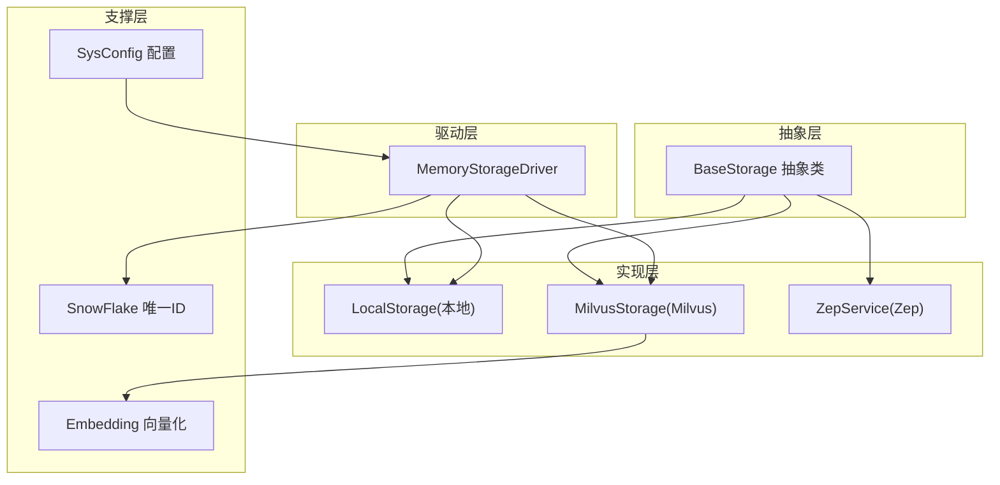
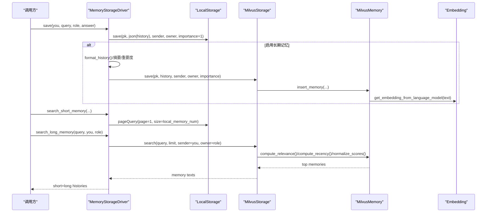
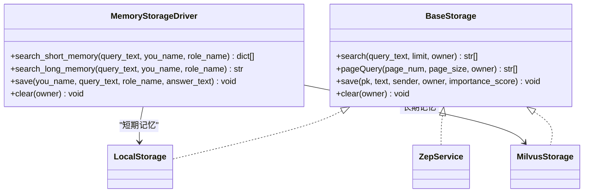
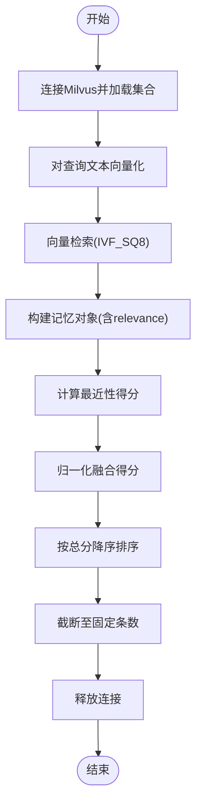
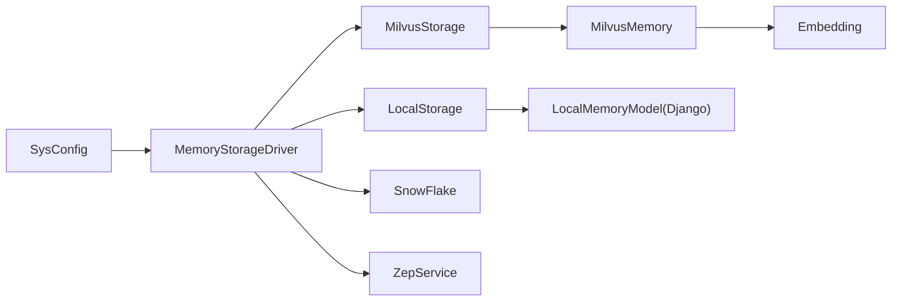

# 存储驱动插件

<cite>
**本文引用的文件列表**
- [base_storage.py](file://domain-chatbot/apps/chatbot/memory/base_storage.py)
- [memory_storage.py](file://domain-chatbot/apps/chatbot/memory/memory_storage.py)
- [local_storage_impl.py](file://domain-chatbot/apps/chatbot/memory/local/local_storage_impl.py)
- [milvus_storage_impl.py](file://domain-chatbot/apps/chatbot/memory/milvus/milvus_storage_impl.py)
- [milvus_memory.py](file://domain-chatbot/apps/chatbot/memory/milvus/milvus_memory.py)
- [zep_memory.py](file://domain-chatbot/apps/chatbot/memory/zep/zep_memory.py)
- [embedding.py](file://domain-chatbot/apps/chatbot/memory/embedding.py)
- [sys_config.py](file://domain-chatbot/apps/chatbot/config/sys_config.py)
- [sys_config.json](file://domain-chatbot/apps/chatbot/config/sys_config.json)
- [models.py](file://domain-chatbot/apps/chatbot/models.py)
- [snowflake_utils.py](file://domain-chatbot/apps/chatbot/utils/snowflake_utils.py)
</cite>

## 目录
1. [简介](#简介)
2. [项目结构](#项目结构)
3. [核心组件](#核心组件)
4. [架构总览](#架构总览)
5. [详细组件分析](#详细组件分析)
6. [依赖关系分析](#依赖关系分析)
7. [性能与调优](#性能与调优)
8. [故障排查](#故障排查)
9. [结论](#结论)
10. [附录：自定义存储驱动开发指南](#附录自定义存储驱动开发指南)

## 简介
本指南面向VirtualWife项目的“存储驱动插件”开发，围绕工厂模式与抽象基类设计，系统讲解MemoryStorage驱动如何通过统一接口对接本地存储、Milvus向量库与Zep记忆服务；并提供自定义存储驱动的开发步骤、数据模型、索引策略、批量操作与并发控制等关键实践，帮助开发者快速扩展新的存储后端。

## 项目结构
- 抽象层：定义统一的BaseStorage接口，约束所有存储实现必须提供的能力（搜索、分页、保存、清空）。
- 驱动层：MemoryStorageDriver负责根据系统配置选择并协调短期与长期记忆存储，封装历史格式化、摘要与重要度评分等流程。
- 实现层：
  - 本地存储：LocalStorage基于Django ORM，使用MySQL/PostgreSQL等持久化短期记忆。
  - Milvus向量存储：MilvusStorage通过MilvusMemory完成向量化、相似度检索、相关性/最近性/重要度融合评分与分页查询。
  - Zep记忆服务：ZepService封装ZepClient，提供用户、会话、消息与MMR检索等能力。
- 支撑层：Embedding提供中文句子向量化；SnowFlake提供全局唯一ID；SysConfig/SysConfig.json提供系统级配置与懒加载记忆驱动。

图表来源
- [base_storage.py](file://domain-chatbot/apps/chatbot/memory/base_storage.py#L4-L27)
- [memory_storage.py](file://domain-chatbot/apps/chatbot/memory/memory_storage.py#L14-L107)
- [local_storage_impl.py](file://domain-chatbot/apps/chatbot/memory/local/local_storage_impl.py#L14-L71)
- [milvus_storage_impl.py](file://domain-chatbot/apps/chatbot/memory/milvus/milvus_storage_impl.py#L5-L61)
- [milvus_memory.py](file://domain-chatbot/apps/chatbot/memory/milvus/milvus_memory.py#L15-L184)
- [zep_memory.py](file://domain-chatbot/apps/chatbot/memory/zep/zep_memory.py#L20-L169)
- [embedding.py](file://domain-chatbot/apps/chatbot/memory/embedding.py#L4-L19)
- [sys_config.py](file://domain-chatbot/apps/chatbot/config/sys_config.py#L32-L208)

章节来源
- [base_storage.py](file://domain-chatbot/apps/chatbot/memory/base_storage.py#L1-L27)
- [memory_storage.py](file://domain-chatbot/apps/chatbot/memory/memory_storage.py#L1-L176)
- [local_storage_impl.py](file://domain-chatbot/apps/chatbot/memory/local/local_storage_impl.py#L1-L71)
- [milvus_storage_impl.py](file://domain-chatbot/apps/chatbot/memory/milvus/milvus_storage_impl.py#L1-L61)
- [milvus_memory.py](file://domain-chatbot/apps/chatbot/memory/milvus/milvus_memory.py#L1-L184)
- [zep_memory.py](file://domain-chatbot/apps/chatbot/memory/zep/zep_memory.py#L1-L169)
- [embedding.py](file://domain-chatbot/apps/chatbot/memory/embedding.py#L1-L19)
- [sys_config.py](file://domain-chatbot/apps/chatbot/config/sys_config.py#L1-L208)
- [sys_config.json](file://domain-chatbot/apps/chatbot/config/sys_config.json#L1-L60)
- [models.py](file://domain-chatbot/apps/chatbot/models.py#L53-L69)
- [snowflake_utils.py](file://domain-chatbot/apps/chatbot/utils/snowflake_utils.py#L23-L107)

## 核心组件
- 抽象基类 BaseStorage：定义统一接口，确保不同存储实现具备一致的行为契约。
- MemoryStorageDriver：工厂+编排器，负责按配置选择短期/长期存储，封装保存、检索与清理逻辑。
- LocalStorage：基于Django ORM的本地存储实现，支持关键词抽取、分页与按拥有者过滤。
- MilvusStorage/MilvusMemory：向量检索实现，结合相关性、重要度与最近性评分，支持分页与批量插入。
- ZepService：第三方记忆服务封装，提供用户、会话、消息与MMR检索。
- Embedding：中文句子向量化工具，用于Milvus的向量索引与相似度计算。
- SysConfig/SysConfig.json：系统配置入口，懒加载MemoryStorageDriver并读取各模块开关与参数。

章节来源
- [base_storage.py](file://domain-chatbot/apps/chatbot/memory/base_storage.py#L4-L27)
- [memory_storage.py](file://domain-chatbot/apps/chatbot/memory/memory_storage.py#L14-L107)
- [local_storage_impl.py](file://domain-chatbot/apps/chatbot/memory/local/local_storage_impl.py#L14-L71)
- [milvus_storage_impl.py](file://domain-chatbot/apps/chatbot/memory/milvus/milvus_storage_impl.py#L5-L61)
- [milvus_memory.py](file://domain-chatbot/apps/chatbot/memory/milvus/milvus_memory.py#L15-L184)
- [zep_memory.py](file://domain-chatbot/apps/chatbot/memory/zep/zep_memory.py#L20-L169)
- [embedding.py](file://domain-chatbot/apps/chatbot/memory/embedding.py#L4-L19)
- [sys_config.py](file://domain-chatbot/apps/chatbot/config/sys_config.py#L17-L29)
- [sys_config.json](file://domain-chatbot/apps/chatbot/config/sys_config.json#L35-L52)

## 架构总览
MemoryStorageDriver作为工厂与编排器，依据SysConfig决定是否启用长期记忆（Milvus），并将短期记忆写入LocalStorage。保存流程中可选地对对话历史进行摘要与重要度评分，再写入Milvus。检索时先取LocalStorage的近期记忆，再按需从Milvus检索长期记忆并融合排序。

图表来源
- [memory_storage.py](file://domain-chatbot/apps/chatbot/memory/memory_storage.py#L56-L106)
- [local_storage_impl.py](file://domain-chatbot/apps/chatbot/memory/local/local_storage_impl.py#L53-L66)
- [milvus_storage_impl.py](file://domain-chatbot/apps/chatbot/memory/milvus/milvus_storage_impl.py#L51-L55)
- [milvus_memory.py](file://domain-chatbot/apps/chatbot/memory/milvus/milvus_memory.py#L57-L65)
- [embedding.py](file://domain-chatbot/apps/chatbot/memory/embedding.py#L12-L18)

## 详细组件分析

### 抽象基类 BaseStorage
- 职责：定义统一接口，保证所有存储实现具备相同的对外行为。
- 方法：
  - search(query_text, limit, owner): 返回最相关的记忆片段列表
  - pageQuery(page_num, page_size, owner): 分页返回记忆
  - save(pk, text, sender, owner, importance_score): 保存记忆
  - clear(owner): 清空某拥有者的记忆

章节来源
- [base_storage.py](file://domain-chatbot/apps/chatbot/memory/base_storage.py#L4-L27)

### MemoryStorageDriver（工厂+编排）
- 工厂职责：根据配置构造LocalStorage与MilvusStorage实例。
- 编排职责：
  - 保存：短期记忆直接写入LocalStorage；长期记忆可选摘要与重要度评分后写入Milvus。
  - 检索：短期记忆优先，长期记忆按需检索并合并。
  - 清理：同时清理短期与长期记忆。
- 关键点：
  - 使用SnowFlake生成全局唯一ID
  - 历史格式化：将“你”和“角色”的对话拼接为统一格式
  - 摘要与重要度：通过LLM模型生成摘要与评分（由SysConfig控制）

图表来源
- [base_storage.py](file://domain-chatbot/apps/chatbot/memory/base_storage.py#L4-L27)
- [memory_storage.py](file://domain-chatbot/apps/chatbot/memory/memory_storage.py#L14-L107)
- [local_storage_impl.py](file://domain-chatbot/apps/chatbot/memory/local/local_storage_impl.py#L14-L71)
- [milvus_storage_impl.py](file://domain-chatbot/apps/chatbot/memory/milvus/milvus_storage_impl.py#L5-L61)
- [zep_memory.py](file://domain-chatbot/apps/chatbot/memory/zep/zep_memory.py#L20-L169)

章节来源
- [memory_storage.py](file://domain-chatbot/apps/chatbot/memory/memory_storage.py#L14-L107)
- [snowflake_utils.py](file://domain-chatbot/apps/chatbot/utils/snowflake_utils.py#L23-L107)

### 本地存储 LocalStorage
- 数据模型：LocalMemoryModel，字段包含id、text、tags、sender、owner、timestamp。
- 功能特性：
  - 搜索：按owner过滤并按时间倒序取前N条
  - 分页：支持按页码与页大小分页查询
  - 保存：使用jieba进行分词与关键词抽取，写入数据库
  - 清空：按owner删除记录
- 适用场景：轻量短期记忆、无需向量检索、低成本部署

章节来源
- [local_storage_impl.py](file://domain-chatbot/apps/chatbot/memory/local/local_storage_impl.py#L14-L71)
- [models.py](file://domain-chatbot/apps/chatbot/models.py#L53-L69)

### Milvus向量存储 MilvusStorage/MilvusMemory
- 数据模型：Milvus集合包含id、text、sender、owner、timestamp、importance_score、embedding等字段。
- 索引策略：IVF_SQ8索引，L2距离度量，nlist=768。
- 检索流程：
  - compute_relevance：向量化查询文本，执行向量检索，计算相关性得分
  - compute_recency：指数衰减计算最近性得分
  - normalize_scores：归一化融合相关性、重要度与最近性
  - pageQuery：按表达式与分页查询
- 批量与并发：
  - insert_memory：单条插入
  - clear：按条件查询ID并批量删除
- 适用场景：需要语义相似检索、长期记忆规模较大、支持跨会话检索

图表来源
- [milvus_memory.py](file://domain-chatbot/apps/chatbot/memory/milvus/milvus_memory.py#L67-L128)
- [milvus_storage_impl.py](file://domain-chatbot/apps/chatbot/memory/milvus/milvus_storage_impl.py#L18-L40)

章节来源
- [milvus_storage_impl.py](file://domain-chatbot/apps/chatbot/memory/milvus/milvus_storage_impl.py#L5-L61)
- [milvus_memory.py](file://domain-chatbot/apps/chatbot/memory/milvus/milvus_memory.py#L15-L184)
- [embedding.py](file://domain-chatbot/apps/chatbot/memory/embedding.py#L4-L19)

### Zep记忆服务 ZepService
- 能力范围：用户管理、会话管理、消息追加、最近N条消息检索、MMR重排检索。
- 使用建议：
  - 用户与会话存在性校验后再写入
  - MMR检索适合跨主题、跨轮次的语义检索
- 适用场景：需要第三方记忆服务、跨会话长程记忆、MMR重排提升多样性与相关性

章节来源
- [zep_memory.py](file://domain-chatbot/apps/chatbot/memory/zep/zep_memory.py#L20-L169)

## 依赖关系分析
- MemoryStorageDriver依赖SysConfig读取配置，按需实例化LocalStorage与MilvusStorage。
- MilvusStorage依赖MilvusMemory完成向量化与检索；MilvusMemory依赖Embedding与Pymilvus。
- LocalStorage依赖Django ORM与LocalMemoryModel。
- ZepService依赖zep_python客户端。
- SnowFlake为全局ID生成器，贯穿保存流程。

图表来源
- [sys_config.py](file://domain-chatbot/apps/chatbot/config/sys_config.py#L32-L208)
- [memory_storage.py](file://domain-chatbot/apps/chatbot/memory/memory_storage.py#L14-L107)
- [local_storage_impl.py](file://domain-chatbot/apps/chatbot/memory/local/local_storage_impl.py#L14-L71)
- [milvus_storage_impl.py](file://domain-chatbot/apps/chatbot/memory/milvus/milvus_storage_impl.py#L5-L61)
- [milvus_memory.py](file://domain-chatbot/apps/chatbot/memory/milvus/milvus_memory.py#L15-L184)
- [embedding.py](file://domain-chatbot/apps/chatbot/memory/embedding.py#L4-L19)
- [models.py](file://domain-chatbot/apps/chatbot/models.py#L53-L69)
- [snowflake_utils.py](file://domain-chatbot/apps/chatbot/utils/snowflake_utils.py#L23-L107)
- [zep_memory.py](file://domain-chatbot/apps/chatbot/memory/zep/zep_memory.py#L20-L169)

章节来源
- [sys_config.py](file://domain-chatbot/apps/chatbot/config/sys_config.py#L17-L29)
- [sys_config.json](file://domain-chatbot/apps/chatbot/config/sys_config.json#L35-L52)

## 性能与调优
- Milvus索引与查询参数
  - 索引类型：IVF_SQ8，nlist建议与向量维度匹配；L2度量
  - nprobe：控制候选集大小，越大召回越高但延迟上升
  - 分页：offset+limit，注意大偏移的性能开销
- 向量化模型
  - Embedding采用中文RoBERTa模型，推理时尽量批量化以减少重复初始化
- 本地存储
  - 分词与关键词抽取成本可控，建议缓存常用关键词或预处理
- 全局ID
  - SnowFlake避免跨节点冲突，适合高并发写入
- 摘要与重要度
  - 可配置开关，避免不必要的LLM调用；建议异步化或批处理

[本节为通用性能建议，不直接分析具体文件]

## 故障排查
- Milvus连接失败
  - 检查host/port/user/password/db_name配置
  - 确认Milvus服务可用与网络连通
- 向量检索无结果
  - 确认集合已load、索引已创建
  - 检查nprobe与表达式过滤条件
- 本地存储异常
  - 检查Django数据库连接与LocalMemoryModel表结构
- Zep服务异常
  - 校验zep_url与api_key
  - 确认用户与会话存在性后再写入
- 日志与错误处理
  - MemoryStorageDriver在长期记忆检索失败时记录错误日志并返回空

章节来源
- [milvus_memory.py](file://domain-chatbot/apps/chatbot/memory/milvus/milvus_memory.py#L22-L31)
- [milvus_storage_impl.py](file://domain-chatbot/apps/chatbot/memory/milvus/milvus_storage_impl.py#L18-L28)
- [memory_storage.py](file://domain-chatbot/apps/chatbot/memory/memory_storage.py#L35-L54)
- [zep_memory.py](file://domain-chatbot/apps/chatbot/memory/zep/zep_memory.py#L23-L28)

## 结论
通过抽象基类与工厂编排，VirtualWife实现了可插拔的记忆存储体系：LocalStorage满足轻量短期记忆需求，Milvus提供强语义检索能力，Zep提供第三方记忆服务。开发者可遵循统一接口与配置约定，快速扩展新的存储后端。

[本节为总结性内容，不直接分析具体文件]

## 附录：自定义存储驱动开发指南

### 1. 实现BaseStorage接口
- 必须实现的方法：search、pageQuery、save、clear
- 参数约定：query_text、limit、page_num、page_size、owner、sender、importance_score
- 返回约定：search/pageQuery返回文本片段列表；save/clear无返回

章节来源
- [base_storage.py](file://domain-chatbot/apps/chatbot/memory/base_storage.py#L8-L26)

### 2. 数据模型与序列化
- 数据模型：建议包含id、text、sender、owner、timestamp、importance_score等字段
- 序列化：保存前将历史对象序列化为字符串；检索时反序列化为对象
- 示例路径参考：
  - [memory_storage.py](file://domain-chatbot/apps/chatbot/memory/memory_storage.py#L60-L65)
  - [milvus_storage_impl.py](file://domain-chatbot/apps/chatbot/memory/milvus/milvus_storage_impl.py#L51-L55)

### 3. 查询优化与索引策略
- 向量检索：为文本字段建立向量索引，设置合适的nprobe与nlist
- 表达式过滤：按owner与sender过滤，减少无效检索
- 分页：避免大offset，必要时使用游标或基于时间戳的分页
- 示例路径参考：
  - [milvus_memory.py](file://domain-chatbot/apps/chatbot/memory/milvus/milvus_memory.py#L46-L52)
  - [milvus_storage_impl.py](file://domain-chatbot/apps/chatbot/memory/milvus/milvus_storage_impl.py#L42-L49)

### 4. 连接管理与并发控制
- 连接池：复用连接，避免频繁创建销毁
- 并发：写入时使用事务或队列；读取时考虑缓存与去重
- 资源释放：查询完成后及时释放资源（如Milvus的release）
- 示例路径参考：
  - [milvus_memory.py](file://domain-chatbot/apps/chatbot/memory/milvus/milvus_memory.py#L140-L144)

### 5. 注册机制与配置参数
- 注册方式：在SysConfig中新增配置项，通过lazy_memory_storage懒加载
- 配置参数：host/port/user/password/db_name（Milvus）；zep_url/zep_optional_api_key（Zep）
- 示例路径参考：
  - [sys_config.py](file://domain-chatbot/apps/chatbot/config/sys_config.py#L17-L29)
  - [sys_config.json](file://domain-chatbot/apps/chatbot/config/sys_config.json#L35-L52)

### 6. 批量操作与性能调优
- 批量插入：将多条记录合并为批量请求，降低网络往返
- 批量查询：分页时控制每页大小，避免一次性返回过多数据
- 异步化：摘要与重要度评分可异步执行，减少主流程阻塞
- 示例路径参考：
  - [milvus_memory.py](file://domain-chatbot/apps/chatbot/memory/milvus/milvus_memory.py#L57-L65)
  - [memory_storage.py](file://domain-chatbot/apps/chatbot/memory/memory_storage.py#L73-L82)

### 7. 故障恢复策略
- 重试与熔断：对远程服务增加重试与熔断机制
- 降级：当长期记忆不可用时，仅使用短期记忆
- 备份：定期导出Milvus或Zep数据，防止丢失
- 日志：记录关键操作与异常堆栈，便于追踪

章节来源
- [memory_storage.py](file://domain-chatbot/apps/chatbot/memory/memory_storage.py#L35-L54)