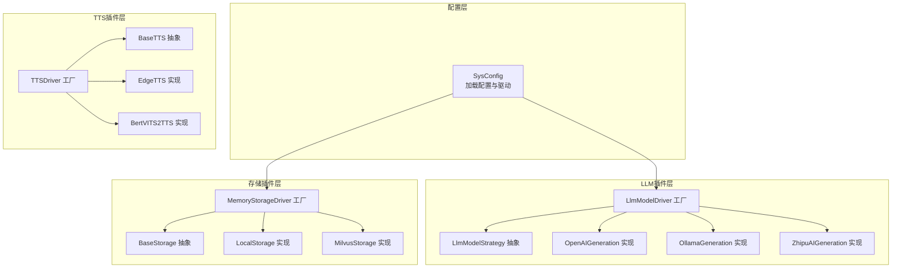
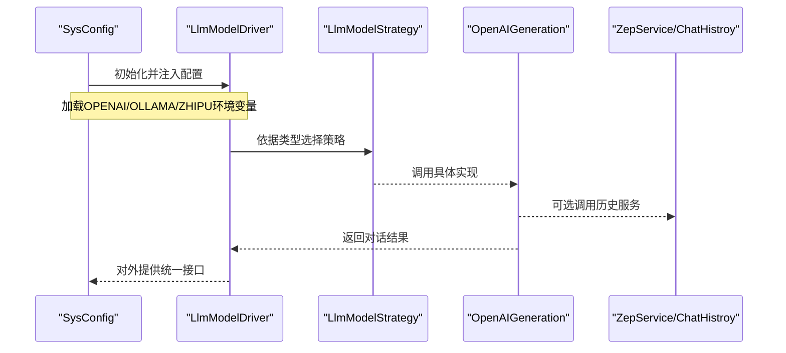
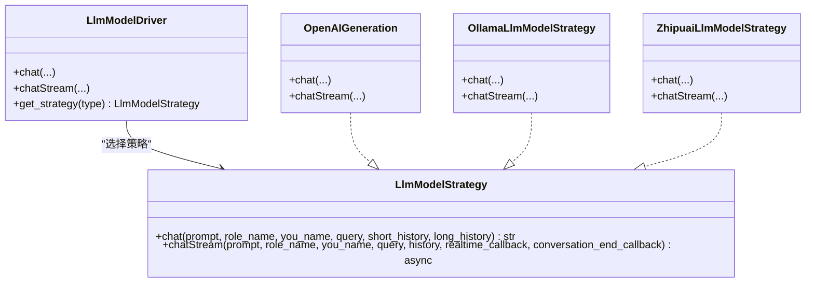
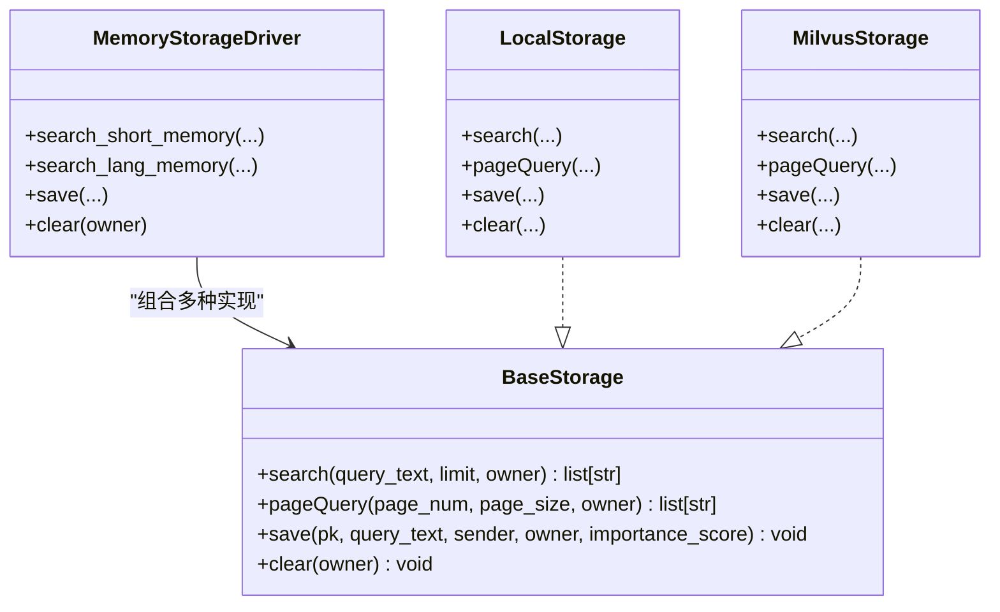
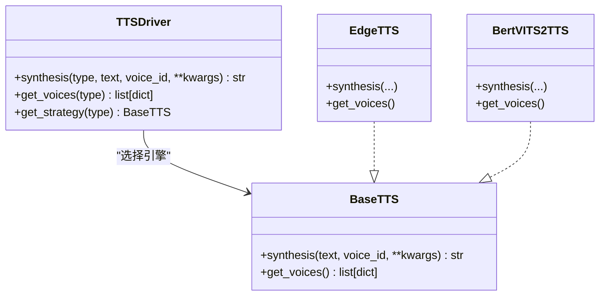
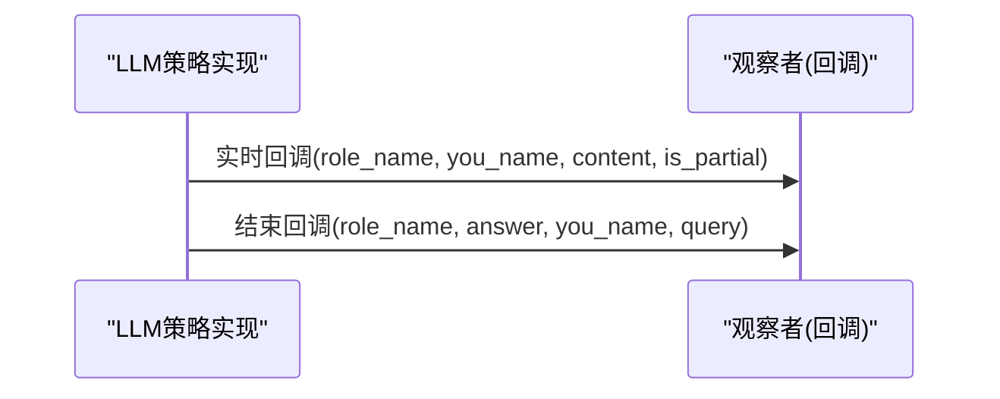
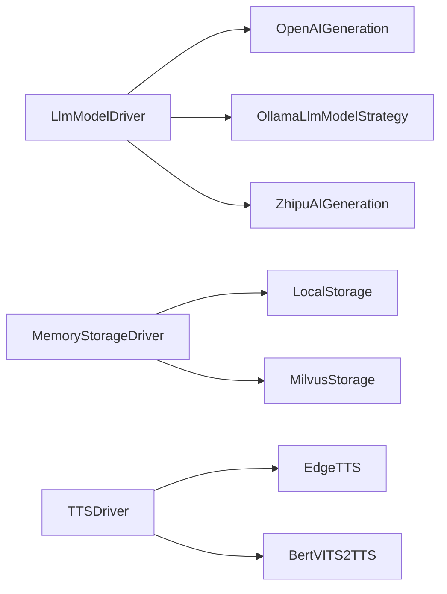
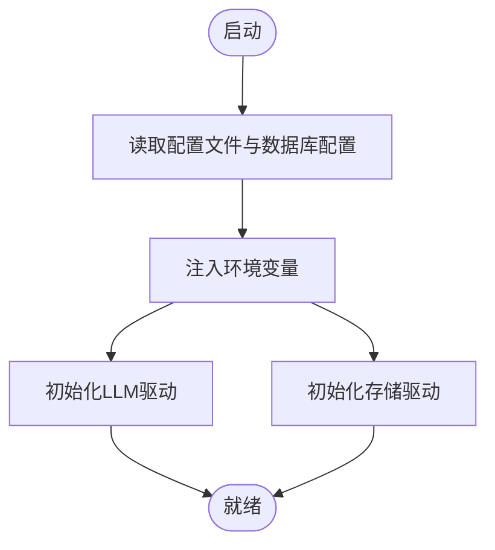

# 插件开发

<cite>
**本文引用的文件**
- [llm_model_strategy.py](file://domain-chatbot/apps/chatbot/llms/llm_model_strategy.py)
- [openai_chat_robot.py](file://domain-chatbot/apps/chatbot/llms/openai/openai_chat_robot.py)
- [base_storage.py](file://domain-chatbot/apps/chatbot/memory/base_storage.py)
- [local_storage_impl.py](file://domain-chatbot/apps/chatbot/memory/local/local_storage_impl.py)
- [milvus_storage_impl.py](file://domain-chatbot/apps/chatbot/memory/milvus/milvus_storage_impl.py)
- [memory_storage.py](file://domain-chatbot/apps/chatbot/memory/memory_storage.py)
- [zep_memory.py](file://domain-chatbot/apps/chatbot/memory/zep/zep_memory.py)
- [tts_driver.py](file://domain-chatbot/apps/speech/tts/tts_driver.py)
- [sys_config.py](file://domain-chatbot/apps/chatbot/config/sys_config.py)
- [chat_message_utils.py](file://domain-chatbot/apps/chatbot/utils/chat_message_utils.py)
- [str_utils.py](file://domain-chatbot/apps/chatbot/utils/str_utils.py)
</cite>

## 目录
1. [简介](#简介)
2. [项目结构](#项目结构)
3. [核心组件](#核心组件)
4. [架构总览](#架构总览)
5. [组件详解](#组件详解)
6. [依赖关系分析](#依赖关系分析)
7. [性能考量](#性能考量)
8. [故障排查指南](#故障排查指南)
9. [结论](#结论)
10. [附录](#附录)

## 简介
本指南面向VirtualWife项目的插件开发者，系统讲解插件体系的架构设计与实现要点，覆盖以下主题：
- 策略模式在LLM模型插件中的应用
- 工厂模式在存储驱动插件中的实现
- 观察者模式在事件驱动插件中的使用
- 插件接口规范：抽象基类、方法签名、参数传递规则
- 具体开发示例：自定义LLM模型插件、存储驱动插件、TTS引擎插件
- 插件注册机制、生命周期管理、配置加载流程
- 插件间依赖关系、冲突解决、版本兼容性处理
- 测试方法、调试技巧、性能优化建议

## 项目结构
VirtualWife的插件化能力主要分布在以下子系统：
- LLM模型插件：通过策略模式封装不同模型供应商的对话能力
- 存储驱动插件：通过工厂模式选择本地或向量数据库等不同存储后端
- TTS引擎插件：通过策略+工厂模式提供多引擎语音合成能力
- 配置与生命周期：SysConfig集中加载与初始化插件驱动

图表来源
- [sys_config.py](file://domain-chatbot/apps/chatbot/config/sys_config.py#L32-L192)
- [llm_model_strategy.py](file://domain-chatbot/apps/chatbot/llms/llm_model_strategy.py#L13-L149)
- [base_storage.py](file://domain-chatbot/apps/chatbot/memory/base_storage.py#L4-L27)
- [tts_driver.py](file://domain-chatbot/apps/speech/tts/tts_driver.py#L9-L74)

章节来源
- [sys_config.py](file://domain-chatbot/apps/chatbot/config/sys_config.py#L32-L192)

## 核心组件
本节从插件视角梳理三大核心组件及其职责边界。

- LLM模型策略组件
  - 抽象接口：定义同步与异步对话方法，统一输入输出契约
  - 策略实现：针对不同供应商的具体实现
  - 驱动工厂：按类型选择策略实例，屏蔽外部差异

- 存储驱动组件
  - 抽象接口：统一检索、分页、保存、清空等操作
  - 多实现：本地与向量数据库等不同后端
  - 驱动工厂：根据配置动态装配具体存储实现

- TTS引擎组件
  - 抽象接口：统一语音合成与声音列表获取
  - 多实现：Edge与Bert-VITS2等引擎
  - 驱动工厂：按类型选择引擎实例

章节来源
- [llm_model_strategy.py](file://domain-chatbot/apps/chatbot/llms/llm_model_strategy.py#L13-L149)
- [base_storage.py](file://domain-chatbot/apps/chatbot/memory/base_storage.py#L4-L27)
- [tts_driver.py](file://domain-chatbot/apps/speech/tts/tts_driver.py#L9-L74)

## 架构总览
下图展示插件系统在运行期的交互关系与数据流：

图表来源
- [sys_config.py](file://domain-chatbot/apps/chatbot/config/sys_config.py#L122-L139)
- [llm_model_strategy.py](file://domain-chatbot/apps/chatbot/llms/llm_model_strategy.py#L107-L149)
- [openai_chat_robot.py](file://domain-chatbot/apps/chatbot/llms/openai/openai_chat_robot.py#L20-L44)
- [zep_memory.py](file://domain-chatbot/apps/chatbot/memory/zep/zep_memory.py#L20-L117)

## 组件详解

### LLM模型插件：策略模式
- 设计要点
  - 抽象基类定义统一接口，确保不同模型供应商具备一致的调用体验
  - 具体策略类封装供应商SDK细节，隐藏认证、URL、模型名等差异
  - 驱动工厂负责类型到策略的映射，支持扩展新供应商

- 接口规范
  - 同步对话：接收系统提示、角色名、你的名字、问题、短历史、长历史，返回文本
  - 异步流式对话：接收相同上下文，支持实时回调与会话结束回调

- 开发步骤
  1) 新建实现类，继承抽象策略基类
  2) 在驱动工厂中增加类型分支
  3) 在配置加载处注入环境变量或密钥
  4) 编写单元测试与集成测试

图表来源
- [llm_model_strategy.py](file://domain-chatbot/apps/chatbot/llms/llm_model_strategy.py#L13-L149)
- [openai_chat_robot.py](file://domain-chatbot/apps/chatbot/llms/openai/openai_chat_robot.py#L14-L101)

章节来源
- [llm_model_strategy.py](file://domain-chatbot/apps/chatbot/llms/llm_model_strategy.py#L13-L149)
- [openai_chat_robot.py](file://domain-chatbot/apps/chatbot/llms/openai/openai_chat_robot.py#L14-L101)

### 存储驱动插件：工厂模式
- 设计要点
  - 抽象基类定义统一的检索、分页、保存、清空接口
  - 不同实现封装各自存储后端（如本地数据库、向量数据库）
  - 驱动工厂根据配置动态创建具体实现，支持懒加载与开关控制

- 接口规范
  - search/pageQuery/save/clear：统一签名，便于替换与扩展
  - 配置参数：主机、端口、用户名、密码、数据库名等

- 开发步骤
  1) 实现BaseStorage接口
  2) 在驱动工厂中注册类型映射
  3) 在配置中新增对应键值
  4) 编写适配器以对接第三方SDK

图表来源
- [base_storage.py](file://domain-chatbot/apps/chatbot/memory/base_storage.py#L4-L27)
- [local_storage_impl.py](file://domain-chatbot/apps/chatbot/memory/local/local_storage_impl.py#L14-L71)
- [milvus_storage_impl.py](file://domain-chatbot/apps/chatbot/memory/milvus/milvus_storage_impl.py#L5-L61)
- [memory_storage.py](file://domain-chatbot/apps/chatbot/memory/memory_storage.py#L14-L107)

章节来源
- [base_storage.py](file://domain-chatbot/apps/chatbot/memory/base_storage.py#L4-L27)
- [local_storage_impl.py](file://domain-chatbot/apps/chatbot/memory/local/local_storage_impl.py#L14-L71)
- [milvus_storage_impl.py](file://domain-chatbot/apps/chatbot/memory/milvus/milvus_storage_impl.py#L5-L61)
- [memory_storage.py](file://domain-chatbot/apps/chatbot/memory/memory_storage.py#L14-L107)

### TTS引擎插件：策略+工厂
- 设计要点
  - 抽象基类定义统一的合成与声音列表接口
  - 多实现分别对接不同引擎（如Edge、Bert-VITS2）
  - 驱动工厂按类型选择引擎，支持参数透传（如噪声、语速）

- 接口规范
  - synthesis(text, voice_id, **kwargs) -> 文件路径
  - get_voices() -> 声音列表

- 开发步骤
  1) 实现BaseTTS接口
  2) 在驱动工厂中注册类型与构造逻辑
  3) 在配置中新增引擎开关与参数
  4) 编写播放与回放测试

图表来源
- [tts_driver.py](file://domain-chatbot/apps/speech/tts/tts_driver.py#L9-L74)

章节来源
- [tts_driver.py](file://domain-chatbot/apps/speech/tts/tts_driver.py#L9-L74)

### 事件驱动插件：观察者模式
- 设计要点
  - 事件源：对话流式响应中的实时回调与会话结束回调
  - 观察者：UI渲染、消息队列、日志记录等可插拔模块
  - 解耦：通过回调接口将“何时发生”与“如何处理”分离

- 使用示例
  - 在异步对话中，逐块推送增量文本给观察者
  - 会话结束时触发收尾动作（如持久化、统计）

图表来源
- [openai_chat_robot.py](file://domain-chatbot/apps/chatbot/llms/openai/openai_chat_robot.py#L46-L101)

章节来源
- [openai_chat_robot.py](file://domain-chatbot/apps/chatbot/llms/openai/openai_chat_robot.py#L46-L101)

## 依赖关系分析
- 组件内聚与耦合
  - LLM策略与具体供应商解耦，通过驱动工厂聚合
  - 存储驱动组合多种实现，通过配置切换
  - TTS驱动统一合成入口，便于替换引擎

- 外部依赖
  - LLM：第三方SDK（如litellm）、环境变量
  - 存储：本地数据库ORM、向量数据库客户端
  - TTS：第三方引擎SDK

图表来源
- [llm_model_strategy.py](file://domain-chatbot/apps/chatbot/llms/llm_model_strategy.py#L107-L149)
- [memory_storage.py](file://domain-chatbot/apps/chatbot/memory/memory_storage.py#L14-L25)
- [tts_driver.py](file://domain-chatbot/apps/speech/tts/tts_driver.py#L54-L74)

## 性能考量
- LLM流式输出
  - 使用异步流式接口，边生成边回调，降低首帧延迟
  - 在回调中进行必要的文本清洗与格式化，避免阻塞

- 存储检索
  - 向量检索结合相关性、重要性、近期性评分，合理裁剪返回条数
  - 分页查询避免一次性加载过多数据

- TTS合成
  - 参数预设（噪声、语速等）减少运行时计算
  - 合成结果缓存与复用，避免重复生成

章节来源
- [openai_chat_robot.py](file://domain-chatbot/apps/chatbot/llms/openai/openai_chat_robot.py#L46-L101)
- [milvus_storage_impl.py](file://domain-chatbot/apps/chatbot/memory/milvus/milvus_storage_impl.py#L18-L61)
- [tts_driver.py](file://domain-chatbot/apps/speech/tts/tts_driver.py#L44-L48)

## 故障排查指南
- LLM插件
  - 确认环境变量已正确注入（如API Key、Base URL）
  - 检查异步流式回调是否被正确调用，关注空片段过滤逻辑

- 存储插件
  - 本地存储依赖ORM模型，确认迁移与权限
  - 向量库需检查连接参数与索引状态

- TTS插件
  - 确认引擎可用与声音列表可获取
  - 检查合成参数是否符合引擎要求

- 配置加载
  - SysConfig负责集中加载与初始化，若某驱动初始化失败，应记录错误并降级或提示

章节来源
- [sys_config.py](file://domain-chatbot/apps/chatbot/config/sys_config.py#L122-L139)
- [openai_chat_robot.py](file://domain-chatbot/apps/chatbot/llms/openai/openai_chat_robot.py#L20-L44)
- [milvus_storage_impl.py](file://domain-chatbot/apps/chatbot/memory/milvus/milvus_storage_impl.py#L10-L16)
- [tts_driver.py](file://domain-chatbot/apps/speech/tts/tts_driver.py#L67-L74)

## 结论
VirtualWife通过策略、工厂与观察者模式构建了高扩展性的插件体系：
- 策略模式让LLM供应商可插拔
- 工厂模式让存储与TTS引擎可替换
- 观察者模式让事件处理可扩展
配合SysConfig的集中配置与初始化，开发者可以快速、安全地扩展新插件并保持系统稳定。

## 附录

### 插件接口规范与参数约定
- LLM策略接口
  - 方法：同步对话、异步流式对话
  - 输入：系统提示、角色名、你的名字、问题、短历史、长历史
  - 输出：文本结果；流式场景通过回调推送增量内容

- 存储接口
  - 方法：search、pageQuery、save、clear
  - 输入：查询文本、分页参数、拥有者、重要度分数等
  - 输出：文本列表或None

- TTS接口
  - 方法：synthesis、get_voices
  - 输入：文本、声音ID、可选参数（如噪声、语速）
  - 输出：音频文件路径或声音列表

章节来源
- [llm_model_strategy.py](file://domain-chatbot/apps/chatbot/llms/llm_model_strategy.py#L15-L29)
- [base_storage.py](file://domain-chatbot/apps/chatbot/memory/base_storage.py#L9-L26)
- [tts_driver.py](file://domain-chatbot/apps/speech/tts/tts_driver.py#L12-L20)

### 插件开发示例（步骤指引）
- 自定义LLM模型插件
  1) 新建实现类，实现策略接口
  2) 在驱动工厂中添加类型映射
  3) 在SysConfig中注入必要环境变量
  4) 编写单测与集成测试

- 存储驱动插件
  1) 实现BaseStorage接口
  2) 在驱动工厂中注册类型
  3) 在配置中新增连接参数
  4) 编写检索与保存测试

- TTS引擎插件
  1) 实现BaseTTS接口
  2) 在驱动工厂中注册类型
  3) 在配置中新增开关与参数
  4) 编写合成与声音列表测试

章节来源
- [llm_model_strategy.py](file://domain-chatbot/apps/chatbot/llms/llm_model_strategy.py#L107-L149)
- [base_storage.py](file://domain-chatbot/apps/chatbot/memory/base_storage.py#L4-L27)
- [tts_driver.py](file://domain-chatbot/apps/speech/tts/tts_driver.py#L54-L74)
- [sys_config.py](file://domain-chatbot/apps/chatbot/config/sys_config.py#L122-L139)

### 生命周期与配置加载流程
- SysConfig负责：
  - 读取系统配置与数据库配置
  - 注入环境变量（如API Key、代理）
  - 初始化LLM驱动与存储驱动
  - 支持懒加载与异常降级

图表来源
- [sys_config.py](file://domain-chatbot/apps/chatbot/config/sys_config.py#L83-L192)

### 插件间依赖、冲突与版本兼容
- 依赖关系
  - LLM策略依赖SysConfig提供的驱动类型
  - 存储驱动依赖SysConfig的开关与参数
  - TTS驱动依赖SysConfig的引擎类型

- 冲突解决
  - 类型冲突：在工厂中严格区分类型字符串，避免重复
  - 资源冲突：为不同插件分配独立资源（端口、令牌、目录）

- 版本兼容
  - 通过抽象接口约束，避免直接依赖具体SDK版本
  - 在SysConfig中集中管理SDK版本与参数映射

章节来源
- [sys_config.py](file://domain-chatbot/apps/chatbot/config/sys_config.py#L158-L188)
- [llm_model_strategy.py](file://domain-chatbot/apps/chatbot/llms/llm_model_strategy.py#L140-L149)
- [tts_driver.py](file://domain-chatbot/apps/speech/tts/tts_driver.py#L67-L74)

### 测试方法与调试技巧
- 单元测试
  - LLM：Mock供应商SDK，验证接口签名与参数传递
  - 存储：使用内存数据库或测试专用表，验证CRUD
  - TTS：Mock引擎，验证合成与声音列表

- 集成测试
  - SysConfig：验证配置注入与驱动初始化
  - 流式对话：验证回调顺序与完整性
  - 存储检索：验证相关性排序与裁剪

- 调试技巧
  - 使用日志定位插件初始化与调用链
  - 在回调中打印关键上下文，辅助排错
  - 对接第三方SDK时，先用最小参数集验证通路

章节来源
- [openai_chat_robot.py](file://domain-chatbot/apps/chatbot/llms/openai/openai_chat_robot.py#L46-L101)
- [chat_message_utils.py](file://domain-chatbot/apps/chatbot/utils/chat_message_utils.py#L4-L22)
- [str_utils.py](file://domain-chatbot/apps/chatbot/utils/str_utils.py#L21-L33)