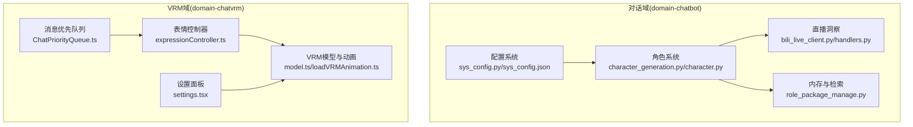
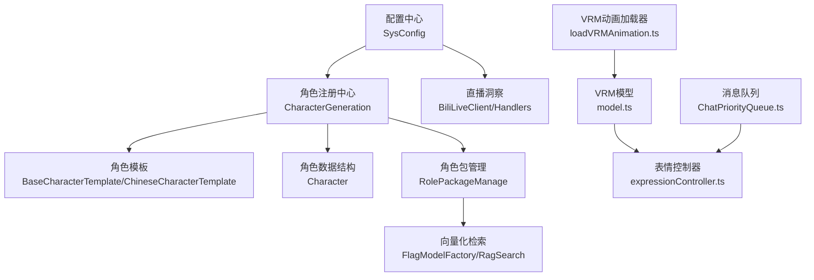
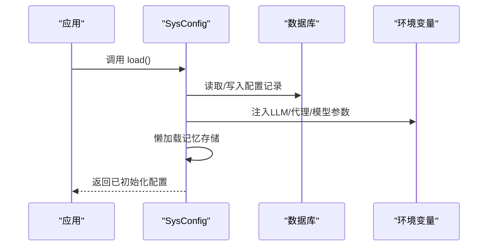
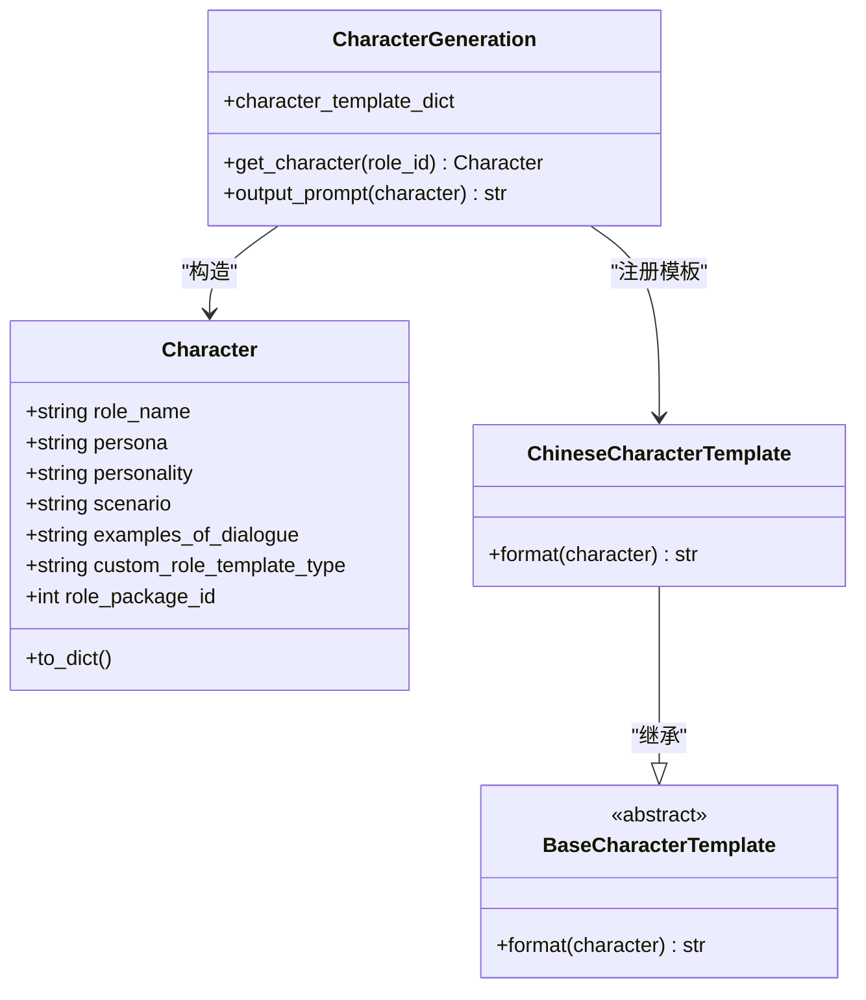
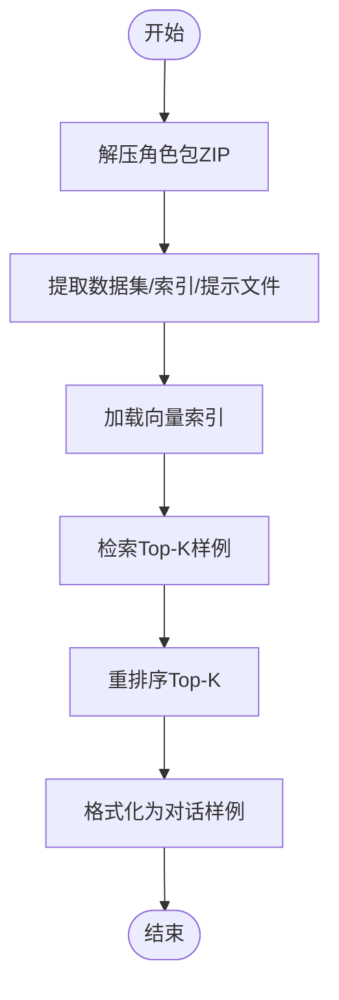
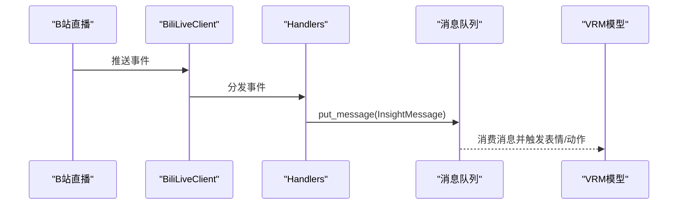
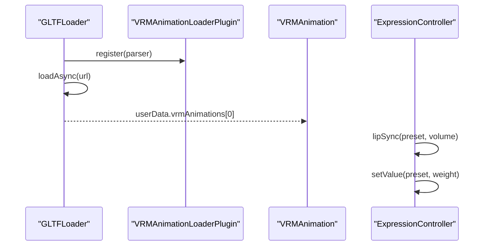
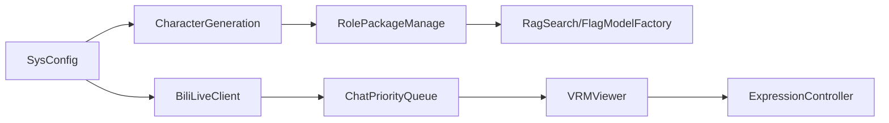

# 插件注册与管理

<cite>
**本文引用的文件**
- [sys_config.py](file://domain-chatbot/apps/chatbot/config/sys_config.py)
- [sys_config.json](file://domain-chatbot/apps/chatbot/config/sys_config.json)
- [__init__.py（配置包）](file://domain-chatbot/apps/chatbot/config/__init__.py)
- [character_generation.py](file://domain-chatbot/apps/chatbot/character/character_generation.py)
- [base_character_template.py](file://domain-chatbot/apps/chatbot/character/base_character_template.py)
- [character.py](file://domain-chatbot/apps/chatbot/character/character.py)
- [character_template_zh.py](file://domain-chatbot/apps/chatbot/character/character_template_zh.py)
- [role_package_manage.py](file://domain-chatbot/apps/chatbot/character/role_package_manage.py)
- [bili_live_client.py（聊天洞察）](file://domain-chatbot/apps/chatbot/insight/bilibili_api/bili_live_client.py)
- [handlers.py（聊天洞察SDK）](file://domain-chatbot/apps/chatbot/insight/bilibili/sdk/handlers.py)
- [ChatPriorityQueue.ts](file://domain-chatvrm/src/features/queue/ChatPriorityQueue.ts)
- [expressionController.ts](file://domain-chatvrm/src/features/emoteController/expressionController.ts)
- [model.ts（VRM Viewer）](file://domain-chatvrm/src/features/vrmViewer/model.ts)
- [loadVRMAnimation.ts](file://domain-chatvrm/src/lib/VRMAnimation/loadVRMAnimation.ts)
- [VRMAnimationLoaderPluginOptions.ts](file://domain-chatvrm/src/lib/VRMAnimation/VRMAnimationLoaderPluginOptions.ts)
- [settings.tsx](file://domain-chatvrm/src/components/settings.tsx)
- [docker-compose.yaml（安装器）](file://installer/docker-compose.yaml)
- [start.sh（Linux启动）](file://installer/linux/start.sh)
- [stop.sh（Linux停止）](file://installer/linux/stop.sh)
- [start.bat（Windows启动）](file://installer/windows/start.bat)
- [stop.bat（Windows停止）](file://installer/windows/stop.bat)
</cite>

## 目录
1. [引言](#引言)
2. [项目结构](#项目结构)
3. [核心组件](#核心组件)
4. [架构总览](#架构总览)
5. [详细组件分析](#详细组件分析)
6. [依赖分析](#依赖分析)
7. [性能考虑](#性能考虑)
8. [故障排查指南](#故障排查指南)
9. [结论](#结论)
10. [附录](#附录)

## 引言
本指南面向VirtualWife项目的“插件注册与管理系统”，聚焦以下目标：
- 插件发现机制：如何定位与识别可用插件（含角色包、动画插件等）
- 动态加载流程：运行时加载与初始化策略
- 生命周期管理：加载、启用、卸载、重启与回滚
- 插件配置文件格式与元数据：JSON配置、环境变量注入、模板化参数
- 插件注册中心：注册表、版本管理、冲突检测与回滚
- 插件间通信协议：事件订阅、消息队列、状态同步
- 实战示例：热重载、性能监控、安全校验与调试工具

本指南既提供高层架构视图，也给出可直接落地的实现步骤与最佳实践。

## 项目结构
VirtualWife由两个主要域组成：
- 域：domain-chatbot（Python/Django），负责对话、角色、内存、LLM与直播洞察
- 域：domain-chatvrm（Next.js/TypeScript），负责VRM模型加载、表情控制、语音合成与前端交互

图表来源
- [sys_config.py](file://domain-chatbot/apps/chatbot/config/sys_config.py#L32-L208)
- [sys_config.json](file://domain-chatbot/apps/chatbot/config/sys_config.json#L1-L60)
- [character_generation.py](file://domain-chatbot/apps/chatbot/character/character_generation.py#L10-L44)
- [bili_live_client.py](file://domain-chatbot/apps/chatbot/insight/bilibili_api/bili_live_client.py#L39-L72)
- [ChatPriorityQueue.ts](file://domain-chatvrm/src/features/queue/ChatPriorityQueue.ts#L1-L16)
- [expressionController.ts](file://domain-chatvrm/src/features/emoteController/expressionController.ts#L40-L76)
- [model.ts](file://domain-chatvrm/src/features/vrmViewer/model.ts#L121-L135)
- [loadVRMAnimation.ts](file://domain-chatvrm/src/lib/VRMAnimation/loadVRMAnimation.ts#L1-L15)

章节来源
- [sys_config.py](file://domain-chatbot/apps/chatbot/config/sys_config.py#L32-L208)
- [sys_config.json](file://domain-chatbot/apps/chatbot/config/sys_config.json#L1-L60)
- [character_generation.py](file://domain-chatbot/apps/chatbot/character/character_generation.py#L10-L44)
- [ChatPriorityQueue.ts](file://domain-chatvrm/src/features/queue/ChatPriorityQueue.ts#L1-L16)

## 核心组件
- 配置系统：集中式配置加载、持久化与环境变量注入，支撑插件运行时参数
- 角色系统：角色模板与生成器，支持多语言模板与角色数据结构
- 直播洞察：基于B站直播事件的实时消息分发
- 内存与检索：角色包安装/卸载、向量化索引与重排序
- VRM动画与表情：GLTF加载器插件注册、表情与口型同步
- 消息队列：按优先级的消息处理队列

章节来源
- [sys_config.py](file://domain-chatbot/apps/chatbot/config/sys_config.py#L32-L208)
- [character.py](file://domain-chatbot/apps/chatbot/character/character.py#L1-L38)
- [role_package_manage.py](file://domain-chatbot/apps/chatbot/character/role_package_manage.py#L103-L163)
- [loadVRMAnimation.ts](file://domain-chatvrm/src/lib/VRMAnimation/loadVRMAnimation.ts#L1-L15)

## 架构总览
下图展示插件注册与管理在系统中的位置与交互：

图表来源
- [sys_config.py](file://domain-chatbot/apps/chatbot/config/sys_config.py#L32-L208)
- [character_generation.py](file://domain-chatbot/apps/chatbot/character/character_generation.py#L10-L44)
- [base_character_template.py](file://domain-chatbot/apps/chatbot/character/base_character_template.py#L5-L11)
- [character.py](file://domain-chatbot/apps/chatbot/character/character.py#L1-L38)
- [role_package_manage.py](file://domain-chatbot/apps/chatbot/character/role_package_manage.py#L103-L163)
- [bili_live_client.py](file://domain-chatbot/apps/chatbot/insight/bilibili_api/bili_live_client.py#L39-L72)
- [loadVRMAnimation.ts](file://domain-chatvrm/src/lib/VRMAnimation/loadVRMAnimation.ts#L1-L15)
- [model.ts](file://domain-chatvrm/src/features/vrmViewer/model.ts#L121-L135)
- [expressionController.ts](file://domain-chatvrm/src/features/emoteController/expressionController.ts#L40-L76)
- [ChatPriorityQueue.ts](file://domain-chatvrm/src/features/queue/ChatPriorityQueue.ts#L1-L16)

## 详细组件分析

### 配置系统与插件发现
- 发现机制
  - 通过配置文件路径定位与读取，支持数据库持久化与本地JSON双写
  - 环境变量注入：如LLM密钥、代理、模型基地址等
  - 角色与对话配置：角色ID、角色名、你的名字、对话类型与语言模型
- 动态加载
  - 在SysConfig.load中按需初始化各子系统（如记忆存储懒加载）
  - 代理开关与值动态注入，便于在不同网络环境下切换
- 生命周期
  - 初始化：加载配置、注入环境变量、默认角色落库
  - 运行期：按需启用/禁用摘要、长期记忆、反思
  - 卸载：未实现显式卸载逻辑，建议在应用重启或容器重建时回收资源

图表来源
- [sys_config.py](file://domain-chatbot/apps/chatbot/config/sys_config.py#L57-L208)
- [sys_config.json](file://domain-chatbot/apps/chatbot/config/sys_config.json#L1-L60)

章节来源
- [sys_config.py](file://domain-chatbot/apps/chatbot/config/sys_config.py#L32-L208)
- [sys_config.json](file://domain-chatbot/apps/chatbot/config/sys_config.json#L1-L60)

### 角色系统与插件注册中心
- 角色注册中心
  - 角色模板字典：按模板类型（如zh）注册模板实例
  - 角色生成：从数据库或默认模板构造Character对象
- 元数据定义
  - 角色字段：角色名、人物设定、性格、场景、对话样例、模板类型、角色包ID
- 版本管理与冲突检测
  - 当前未实现版本号字段；建议在CustomRoleModel中新增version字段
  - 冲突检测：同一模板类型仅保留最新版本，旧版本迁移或标记为废弃
- 回滚机制
  - 未实现；建议在SysConfig.save前后记录快照，失败时回滚

图表来源
- [character.py](file://domain-chatbot/apps/chatbot/character/character.py#L1-L38)
- [base_character_template.py](file://domain-chatbot/apps/chatbot/character/base_character_template.py#L5-L11)
- [character_template_zh.py](file://domain-chatbot/apps/chatbot/character/character_template_zh.py#L30-L42)
- [character_generation.py](file://domain-chatbot/apps/chatbot/character/character_generation.py#L10-L44)

章节来源
- [character.py](file://domain-chatbot/apps/chatbot/character/character.py#L1-L38)
- [base_character_template.py](file://domain-chatbot/apps/chatbot/character/base_character_template.py#L5-L11)
- [character_template_zh.py](file://domain-chatbot/apps/chatbot/character/character_template_zh.py#L30-L42)
- [character_generation.py](file://domain-chatbot/apps/chatbot/character/character_generation.py#L10-L44)

### 角色包管理与插件安装
- 安装流程
  - 解压ZIP至同名目录，提取dataset.json、embed_index.idx、system_prompt.txt
  - 提供卸载接口删除目录与压缩包
- 检索与提示增强
  - 使用FlagModel进行嵌入编码与重排序
  - 从索引召回Top-K，再重排序，最终格式化为对话样例
- 插件间通信
  - 角色包内system_prompt.txt可被角色模板读取，形成提示链路
  - RAG结果作为角色对话样例注入，提升个性化

图表来源
- [role_package_manage.py](file://domain-chatbot/apps/chatbot/character/role_package_manage.py#L103-L163)

章节来源
- [role_package_manage.py](file://domain-chatbot/apps/chatbot/character/role_package_manage.py#L103-L163)

### 直播洞察与事件订阅
- 事件订阅
  - 订阅B站直播事件：欢迎、点赞、醒目留言、房间信息更新等
  - 将事件转换为InsightMessage并入队，驱动VRM表情与动作
- 插件间通信
  - 事件通过消息队列传递给VRM域，实现跨域联动

图表来源
- [bili_live_client.py](file://domain-chatbot/apps/chatbot/insight/bilibili_api/bili_live_client.py#L39-L72)
- [handlers.py](file://domain-chatbot/apps/chatbot/insight/bilibili/sdk/handlers.py#L161-L189)
- [ChatPriorityQueue.ts](file://domain-chatvrm/src/features/queue/ChatPriorityQueue.ts#L1-L16)
- [model.ts](file://domain-chatvrm/src/features/vrmViewer/model.ts#L121-L135)

章节来源
- [bili_live_client.py](file://domain-chatbot/apps/chatbot/insight/bilibili_api/bili_live_client.py#L39-L72)
- [handlers.py](file://domain-chatbot/apps/chatbot/insight/bilibili/sdk/handlers.py#L161-L189)
- [ChatPriorityQueue.ts](file://domain-chatvrm/src/features/queue/ChatPriorityQueue.ts#L1-L16)
- [model.ts](file://domain-chatvrm/src/features/vrmViewer/model.ts#L121-L135)

### VRM动画加载与表情同步
- 插件注册
  - GLTFLoader通过register注册VRMAnimationLoaderPlugin
  - 加载完成后从userData中提取VRMAnimation
- 表情与口型同步
  - ExpressionController根据预设切换表情与眨眼
  - LipSync根据音频音量权重驱动口型

图表来源
- [loadVRMAnimation.ts](file://domain-chatvrm/src/lib/VRMAnimation/loadVRMAnimation.ts#L1-L15)
- [VRMAnimationLoaderPluginOptions.ts](file://domain-chatvrm/src/lib/VRMAnimation/VRMAnimationLoaderPluginOptions.ts#L1-L2)
- [expressionController.ts](file://domain-chatvrm/src/features/emoteController/expressionController.ts#L40-L76)
- [model.ts](file://domain-chatvrm/src/features/vrmViewer/model.ts#L121-L135)

章节来源
- [loadVRMAnimation.ts](file://domain-chatvrm/src/lib/VRMAnimation/loadVRMAnimation.ts#L1-L15)
- [expressionController.ts](file://domain-chatvrm/src/features/emoteController/expressionController.ts#L40-L76)
- [model.ts](file://domain-chatvrm/src/features/vrmViewer/model.ts#L121-L135)

## 依赖分析
- 配置系统对角色系统与内存系统的耦合度较低，采用懒加载降低启动成本
- 角色系统与角色包管理存在强耦合（RAG检索依赖角色包内的索引与提示）
- VRM域内部组件高内聚：动画加载器、表情控制器与模型协同工作
- 直播洞察与VRM域通过消息队列松耦合连接

图表来源
- [sys_config.py](file://domain-chatbot/apps/chatbot/config/sys_config.py#L32-L208)
- [character_generation.py](file://domain-chatbot/apps/chatbot/character/character_generation.py#L10-L44)
- [role_package_manage.py](file://domain-chatbot/apps/chatbot/character/role_package_manage.py#L103-L163)
- [bili_live_client.py](file://domain-chatbot/apps/chatbot/insight/bilibili_api/bili_live_client.py#L39-L72)
- [ChatPriorityQueue.ts](file://domain-chatvrm/src/features/queue/ChatPriorityQueue.ts#L1-L16)
- [model.ts](file://domain-chatvrm/src/features/vrmViewer/model.ts#L121-L135)
- [expressionController.ts](file://domain-chatvrm/src/features/emoteController/expressionController.ts#L40-L76)

章节来源
- [sys_config.py](file://domain-chatbot/apps/chatbot/config/sys_config.py#L32-L208)
- [character_generation.py](file://domain-chatbot/apps/chatbot/character/character_generation.py#L10-L44)
- [role_package_manage.py](file://domain-chatbot/apps/chatbot/character/role_package_manage.py#L103-L163)
- [ChatPriorityQueue.ts](file://domain-chatvrm/src/features/queue/ChatPriorityQueue.ts#L1-L16)

## 性能考虑
- 懒加载策略：记忆存储与LLM驱动按需初始化，减少冷启动时间
- 向量化检索：建议在角色包安装时预构建索引并缓存，避免重复计算
- 事件队列：使用优先队列确保高优先级消息（如欢迎/点赞）及时响应
- VRM渲染：表情与口型权重应结合帧率平滑过渡，避免高频更新导致CPU占用过高

## 故障排查指南
- 配置加载失败
  - 确认sys_config.json存在且格式正确
  - 检查数据库中是否存在对应配置记录，必要时重新初始化
- LLM调用异常
  - 核对环境变量是否注入成功（如OPENAI_API_KEY、OLLAMA_API_BASE等）
  - 检查代理配置是否与网络环境匹配
- 角色包安装失败
  - 确认ZIP包完整，解压目录权限正常
  - 检查dataset.json、embed_index.idx、system_prompt.txt是否存在
- VRM动画加载失败
  - 确认GLTFLoader已注册VRMAnimationLoaderPlugin
  - 检查模型文件路径与格式
- 直播事件未触发
  - 检查B站房间ID与Cookie配置
  - 确认事件回调函数已注册

章节来源
- [sys_config.py](file://domain-chatbot/apps/chatbot/config/sys_config.py#L57-L208)
- [sys_config.json](file://domain-chatbot/apps/chatbot/config/sys_config.json#L1-L60)
- [role_package_manage.py](file://domain-chatbot/apps/chatbot/character/role_package_manage.py#L103-L163)
- [loadVRMAnimation.ts](file://domain-chatvrm/src/lib/VRMAnimation/loadVRMAnimation.ts#L1-L15)
- [bili_live_client.py](file://domain-chatbot/apps/chatbot/insight/bilibili_api/bili_live_client.py#L39-L72)

## 结论
VirtualWife的插件体系以“配置中心—角色系统—消息队列—VRM域”为主线，实现了低耦合、可扩展的插件化架构。建议后续完善版本管理、冲突检测与回滚机制，以支撑更复杂的插件生态。同时，持续优化懒加载与事件队列策略，保障系统在高并发场景下的稳定性与性能。

## 附录

### 插件配置文件格式与元数据
- 配置文件位置与加载顺序
  - 本地JSON文件与数据库记录双向同步
  - 环境变量注入优先于配置文件
- 关键元数据字段
  - 角色配置：角色ID、角色名、你的名字、VRM模型路径与类型
  - 对话配置：对话类型、语言模型类型
  - 记忆配置：是否启用长期记忆/摘要/反思、对应的语言模型
  - LLM配置：OpenAI、Ollama、智谱等API密钥与基地址
  - 代理配置：HTTP/HTTPS/SOCKS5代理地址
  - TTS配置：TTS类型与语音ID

章节来源
- [sys_config.json](file://domain-chatbot/apps/chatbot/config/sys_config.json#L1-L60)
- [sys_config.py](file://domain-chatbot/apps/chatbot/config/sys_config.py#L83-L208)

### 插件注册中心实现要点
- 注册表设计
  - 字典式注册：模板类型→模板实例
  - 角色包注册：角色包ID→数据集/索引/提示文件路径
- 版本管理
  - 建议在角色模型中增加version字段
  - 冲突检测：同一模板类型仅保留最新版本
- 回滚机制
  - 保存前备份配置快照，失败时恢复

章节来源
- [character_generation.py](file://domain-chatbot/apps/chatbot/character/character_generation.py#L10-L44)
- [character.py](file://domain-chatbot/apps/chatbot/character/character.py#L1-L38)
- [role_package_manage.py](file://domain-chatbot/apps/chatbot/character/role_package_manage.py#L103-L163)

### 插件间通信协议与状态同步
- 事件订阅协议
  - 直播事件→消息队列→VRM表情/动作
- 状态同步
  - VRM模型状态（表情、口型、混合器）在每帧更新
  - 表情权重与口型音量按规则叠加

章节来源
- [bili_live_client.py](file://domain-chatbot/apps/chatbot/insight/bilibili_api/bili_live_client.py#L39-L72)
- [ChatPriorityQueue.ts](file://domain-chatvrm/src/features/queue/ChatPriorityQueue.ts#L1-L16)
- [expressionController.ts](file://domain-chatvrm/src/features/emoteController/expressionController.ts#L40-L76)
- [model.ts](file://domain-chatvrm/src/features/vrmViewer/model.ts#L121-L135)

### 热重载、性能监控、安全验证与调试工具
- 热重载
  - 使用watch.json监听配置与依赖变更，触发Next.js热重载
- 性能监控
  - 建议在消息队列与VRM渲染处埋点，统计延迟与丢帧
- 安全验证
  - LLM密钥与代理凭据通过环境变量注入，避免硬编码
- 调试工具
  - 日志级别：INFO/DEBUG/ERROR按模块区分
  - 前端设置面板：角色卡、VRM模型、TTS参数可视化调整

章节来源
- [watch.json](file://domain-chatvrm/watch.json#L1-L9)
- [settings.tsx](file://domain-chatvrm/src/components/settings.tsx#L173-L890)
- [sys_config.py](file://domain-chatbot/apps/chatbot/config/sys_config.py#L14-L14)

### 安装与运维脚本
- Linux
  - 启动：./installer/linux/start.sh
  - 停止：./installer/linux/stop.sh
- Windows
  - 启动：installer/windows/start.bat
  - 停止：installer/windows/stop.bat
- Compose
  - docker-compose.yaml：统一编排服务

章节来源
- [start.sh](file://installer/linux/start.sh)
- [stop.sh](file://installer/linux/stop.sh)
- [start.bat](file://installer/windows/start.bat)
- [stop.bat](file://installer/windows/stop.bat)
- [docker-compose.yaml](file://installer/docker-compose.yaml)