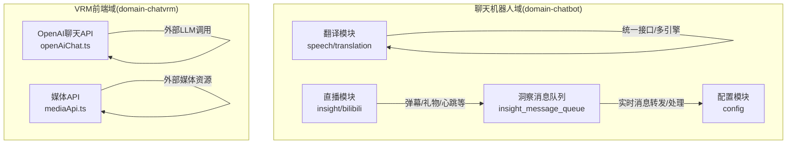
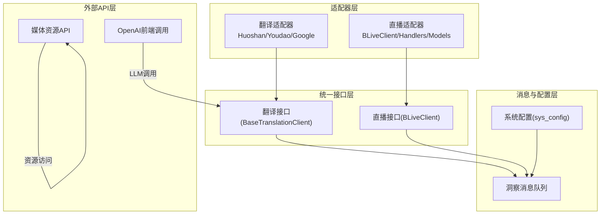
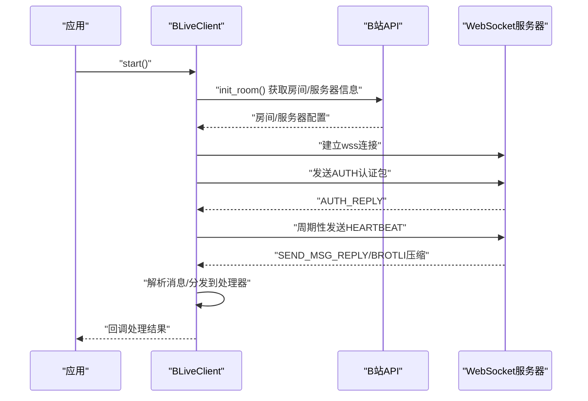
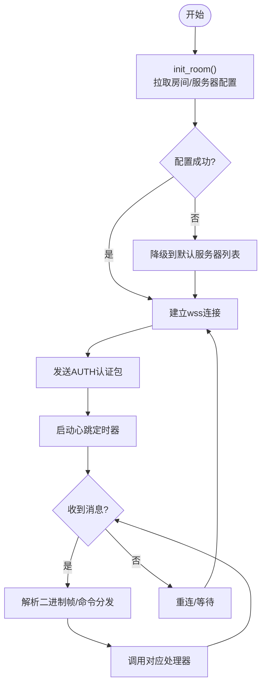
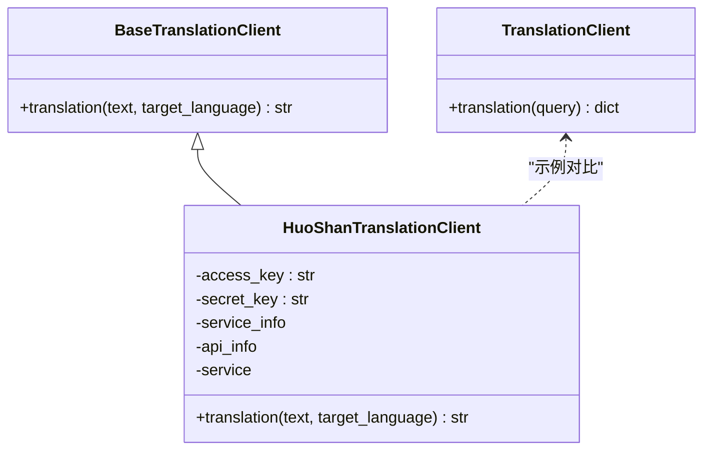
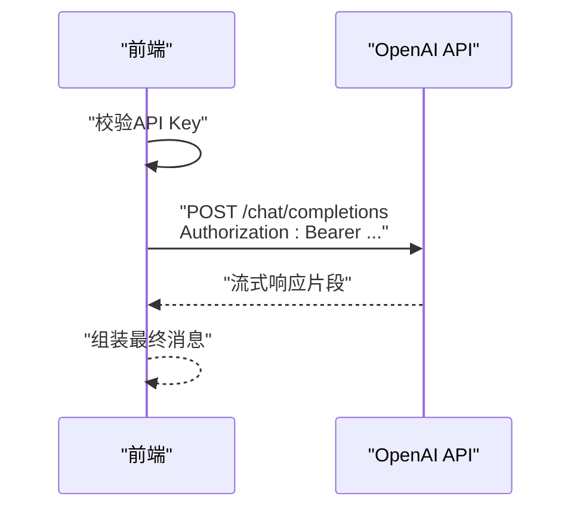
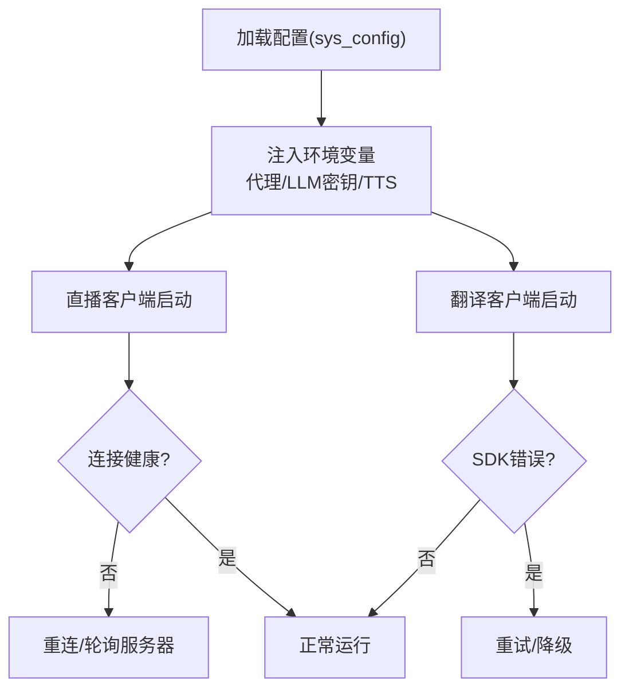
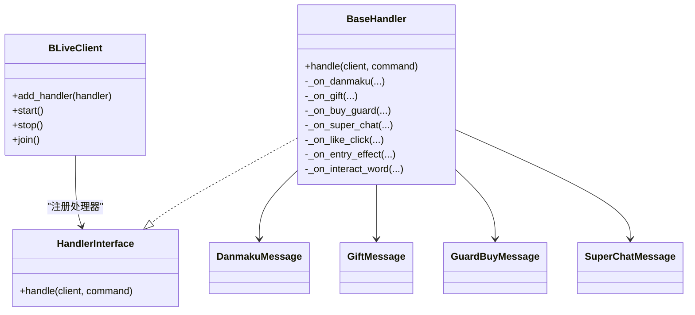
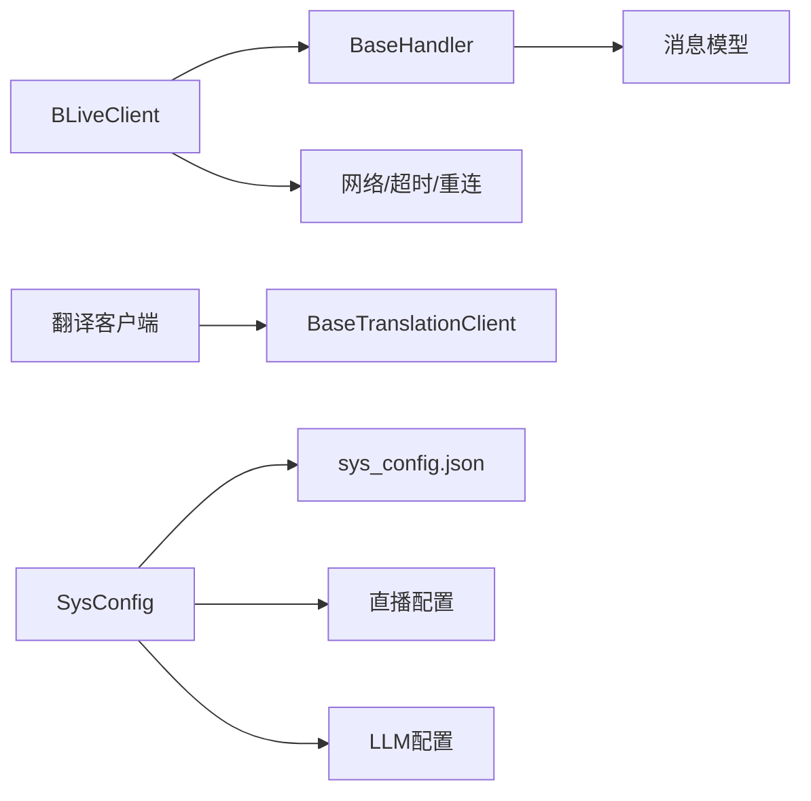

# 第三方服务集成

<cite>
**本文引用的文件**
- [domain-chatbot/apps/speech/translation/base_translation_client.py](file://domain-chatbot/apps/speech/translation/base_translation_client.py)
- [domain-chatbot/apps/speech/translation/huoshan/huoshan_translation_client.py](file://domain-chatbot/apps/speech/translation/huoshan/huoshan_translation_client.py)
- [domain-chatbot/apps/speech/translation/youdao/youdao_translation_client.py](file://domain-chatbot/apps/speech/translation/youdao/youdao_translation_client.py)
- [domain-chatbot/apps/speech/translation/google/google_translation_client.py](file://domain-chatbot/apps/speech/translation/google/google_translation_client.py)
- [domain-chatbot/apps/speech/translation/__init__.py](file://domain-chatbot/apps/speech/translation/__init__.py)
- [domain-chatbot/apps/chatbot/insight/bilibili/sdk/client.py](file://domain-chatbot/apps/chatbot/insight/bilibili/sdk/client.py)
- [domain-chatbot/apps/chatbot/insight/bilibili/sdk/handlers.py](file://domain-chatbot/apps/chatbot/insight/bilibili/sdk/handlers.py)
- [domain-chatbot/apps/chatbot/insight/bilibili/sdk/models.py](file://domain-chatbot/apps/chatbot/insight/bilibili/sdk/models.py)
- [domain-chatbot/apps/chatbot/insight/bilibili/bili_live_client.py](file://domain-chatbot/apps/chatbot/insight/bilibili/bili_live_client.py)
- [domain-chatbot/apps/chatbot/insight/insight_message_queue.py](file://domain-chatbot/apps/chatbot/insight/insight_message_queue.py)
- [domain-chatbot/apps/chatbot/config/sys_config.py](file://domain-chatbot/apps/chatbot/config/sys_config.py)
- [domain-chatbot/apps/chatbot/config/sys_config.json](file://domain-chatbot/apps/chatbot/config/sys_config.json)
- [domain-chatbot/apps/chatbot/insight/insight.py](file://domain-chatbot/apps/chatbot/insight/insight.py)
- [domain-chatvrm/src/features/chat/openAiChat.ts](file://domain-chatvrm/src/features/chat/openAiChat.ts)
- [domain-chatvrm/src/features/media/mediaApi.ts](file://domain-chatvrm/src/features/media/mediaApi.ts)
</cite>

## 目录
1. [简介](#简介)
2. [项目结构](#项目结构)
3. [核心组件](#核心组件)
4. [架构总览](#架构总览)
5. [组件详解](#组件详解)
6. [依赖关系分析](#依赖关系分析)
7. [性能与可靠性](#性能与可靠性)
8. [故障排查指南](#故障排查指南)
9. [结论](#结论)
10. [附录](#附录)

## 简介
本指南面向系统集成开发者，系统化阐述VirtualWife项目在第三方服务集成方面的架构与实践，覆盖以下主题：
- 服务适配器模式与统一接口设计
- 错误处理与重连机制
- 直播服务集成（B站直播SDK、弹幕监听、实时消息处理、连接管理）
- 翻译服务集成（多引擎支持、API封装、语言检测、结果缓存）
- 外部API集成方法论（认证、限流、超时、重试）
- 服务发现与配置管理（动态注册、热更新、健康检查、故障转移）
- 数据格式转换与协议适配（JSON/XML解析、编码转换、数据校验）
- 集成测试与监控（可用性检测、性能指标、告警）

## 项目结构
项目采用按领域划分的多应用结构，第三方服务集成主要分布在以下模块：
- 翻译服务：domain-chatbot/apps/speech/translation
- 直播服务：domain-chatbot/apps/chatbot/insight/bilibili
- 配置与消息：domain-chatbot/apps/chatbot/config、insight
- 前端聊天与媒体API：domain-chatvrm/src/features

**图表来源**
- [domain-chatbot/apps/speech/translation/__init__.py](file://domain-chatbot/apps/speech/translation/__init__.py#L1-L4)
- [domain-chatbot/apps/chatbot/insight/bilibili/bili_live_client.py](file://domain-chatbot/apps/chatbot/insight/bilibili/bili_live_client.py#L1-L129)
- [domain-chatbot/apps/chatbot/insight/insight_message_queue.py](file://domain-chatbot/apps/chatbot/insight/insight_message_queue.py#L1-L83)
- [domain-chatvrm/src/features/chat/openAiChat.ts](file://domain-chatvrm/src/features/chat/openAiChat.ts#L1-L51)
- [domain-chatvrm/src/features/media/mediaApi.ts](file://domain-chatvrm/src/features/media/mediaApi.ts#L42-L121)

**章节来源**
- [domain-chatbot/apps/speech/translation/__init__.py](file://domain-chatbot/apps/speech/translation/__init__.py#L1-L4)
- [domain-chatbot/apps/chatbot/insight/bilibili/bili_live_client.py](file://domain-chatbot/apps/chatbot/insight/bilibili/bili_live_client.py#L1-L129)
- [domain-chatbot/apps/chatbot/insight/insight_message_queue.py](file://domain-chatbot/apps/chatbot/insight/insight_message_queue.py#L1-L83)
- [domain-chatvrm/src/features/chat/openAiChat.ts](file://domain-chatvrm/src/features/chat/openAiChat.ts#L1-L51)
- [domain-chatvrm/src/features/media/mediaApi.ts](file://domain-chatvrm/src/features/media/mediaApi.ts#L42-L121)

## 核心组件
- 翻译服务适配器
  - 抽象基类：统一翻译接口，便于扩展新引擎
  - 具体实现：火山翻译、有道翻译、谷歌翻译等
- 直播服务适配器
  - B站直播客户端：WebSocket连接、鉴权、心跳、消息分发
  - 消息处理器：按命令类型分发至不同回调
  - 模型定义：弹幕、礼物、舰长、醒目留言等消息结构
- 配置与消息
  - 系统配置：加载/保存配置、环境变量注入、代理设置
  - 洞察消息队列：线程安全队列、消息格式化、实时消息转发
- 外部API集成
  - 前端OpenAI调用：API Key校验、请求头、流式响应
  - 媒体资源API：上传/下载/查询

**章节来源**
- [domain-chatbot/apps/speech/translation/base_translation_client.py](file://domain-chatbot/apps/speech/translation/base_translation_client.py#L1-L12)
- [domain-chatbot/apps/speech/translation/huoshan/huoshan_translation_client.py](file://domain-chatbot/apps/speech/translation/huoshan/huoshan_translation_client.py#L1-L47)
- [domain-chatbot/apps/speech/translation/youdao/youdao_translation_client.py](file://domain-chatbot/apps/speech/translation/youdao/youdao_translation_client.py#L1-L24)
- [domain-chatbot/apps/speech/translation/google/google_translation_client.py](file://domain-chatbot/apps/speech/translation/google/google_translation_client.py#L1-L11)
- [domain-chatbot/apps/chatbot/insight/bilibili/sdk/client.py](file://domain-chatbot/apps/chatbot/insight/bilibili/sdk/client.py#L1-L610)
- [domain-chatbot/apps/chatbot/insight/bilibili/sdk/handlers.py](file://domain-chatbot/apps/chatbot/insight/bilibili/sdk/handlers.py#L1-L190)
- [domain-chatbot/apps/chatbot/insight/bilibili/sdk/models.py](file://domain-chatbot/apps/chatbot/insight/bilibili/sdk/models.py#L1-L441)
- [domain-chatbot/apps/chatbot/insight/insight_message_queue.py](file://domain-chatbot/apps/chatbot/insight/insight_message_queue.py#L1-L83)
- [domain-chatbot/apps/chatbot/config/sys_config.py](file://domain-chatbot/apps/chatbot/config/sys_config.py#L1-L208)
- [domain-chatvrm/src/features/chat/openAiChat.ts](file://domain-chatvrm/src/features/chat/openAiChat.ts#L1-L51)
- [domain-chatvrm/src/features/media/mediaApi.ts](file://domain-chatvrm/src/features/media/mediaApi.ts#L42-L121)

## 架构总览
第三方服务集成采用“适配器 + 统一接口 + 消息队列”的分层架构：
- 适配器层：对各第三方服务进行封装，屏蔽差异
- 统一接口层：抽象统一的调用契约，便于替换与扩展
- 消息与配置层：通过队列与配置中心协调内部模块
- 外部API层：前端或独立服务对外提供能力

**图表来源**
- [domain-chatbot/apps/speech/translation/base_translation_client.py](file://domain-chatbot/apps/speech/translation/base_translation_client.py#L1-L12)
- [domain-chatbot/apps/speech/translation/huoshan/huoshan_translation_client.py](file://domain-chatbot/apps/speech/translation/huoshan/huoshan_translation_client.py#L1-L47)
- [domain-chatbot/apps/chatbot/insight/bilibili/sdk/client.py](file://domain-chatbot/apps/chatbot/insight/bilibili/sdk/client.py#L1-L610)
- [domain-chatbot/apps/chatbot/insight/insight_message_queue.py](file://domain-chatbot/apps/chatbot/insight/insight_message_queue.py#L1-L83)
- [domain-chatbot/apps/chatbot/config/sys_config.py](file://domain-chatbot/apps/chatbot/config/sys_config.py#L1-L208)
- [domain-chatvrm/src/features/chat/openAiChat.ts](file://domain-chatvrm/src/features/chat/openAiChat.ts#L1-L51)
- [domain-chatvrm/src/features/media/mediaApi.ts](file://domain-chatvrm/src/features/media/mediaApi.ts#L42-L121)

## 组件详解

### 直播服务集成（B站直播SDK）
- 连接与初始化
  - 房间初始化与弹幕服务器配置拉取
  - 失败降级：回退到默认服务器列表
- 认证与心跳
  - 认证参数构造与发送
  - 心跳定时器与异常处理
- 消息分发
  - 二进制帧解析、压缩解压、命令分发
  - 处理器接口与回调映射
- 实时消息处理
  - 弹幕、礼物、舰长、醒目留言、点赞、进入效果等事件
  - 统一转为洞察消息并入队，供后续处理

**图表来源**
- [domain-chatbot/apps/chatbot/insight/bilibili/sdk/client.py](file://domain-chatbot/apps/chatbot/insight/bilibili/sdk/client.py#L250-L429)
- [domain-chatbot/apps/chatbot/insight/bilibili/sdk/handlers.py](file://domain-chatbot/apps/chatbot/insight/bilibili/sdk/handlers.py#L124-L140)
- [domain-chatbot/apps/chatbot/insight/bilibili/sdk/models.py](file://domain-chatbot/apps/chatbot/insight/bilibili/sdk/models.py#L1-L441)

**图表来源**
- [domain-chatbot/apps/chatbot/insight/bilibili/sdk/client.py](file://domain-chatbot/apps/chatbot/insight/bilibili/sdk/client.py#L362-L429)
- [domain-chatbot/apps/chatbot/insight/bilibili/sdk/handlers.py](file://domain-chatbot/apps/chatbot/insight/bilibili/sdk/handlers.py#L124-L140)

**章节来源**
- [domain-chatbot/apps/chatbot/insight/bilibili/sdk/client.py](file://domain-chatbot/apps/chatbot/insight/bilibili/sdk/client.py#L1-L610)
- [domain-chatbot/apps/chatbot/insight/bilibili/sdk/handlers.py](file://domain-chatbot/apps/chatbot/insight/bilibili/sdk/handlers.py#L1-L190)
- [domain-chatbot/apps/chatbot/insight/bilibili/sdk/models.py](file://domain-chatbot/apps/chatbot/insight/bilibili/sdk/models.py#L1-L441)
- [domain-chatbot/apps/chatbot/insight/bilibili/bili_live_client.py](file://domain-chatbot/apps/chatbot/insight/bilibili/bili_live_client.py#L1-L129)
- [domain-chatbot/apps/chatbot/insight/insight_message_queue.py](file://domain-chatbot/apps/chatbot/insight/insight_message_queue.py#L1-L83)

### 翻译服务集成
- 统一接口
  - 抽象类定义翻译方法，确保多引擎一致性
- 具体实现
  - 火山引擎：基于SDK封装，构造ServiceInfo与ApiInfo，调用translate接口
  - 有道引擎：基于HTTP请求，签名参数拼装，返回JSON解析
  - 谷歌引擎：示例展示，实际需结合库使用
- 使用入口
  - 通过模块导出统一实例，便于全局复用

**图表来源**
- [domain-chatbot/apps/speech/translation/base_translation_client.py](file://domain-chatbot/apps/speech/translation/base_translation_client.py#L1-L12)
- [domain-chatbot/apps/speech/translation/huoshan/huoshan_translation_client.py](file://domain-chatbot/apps/speech/translation/huoshan/huoshan_translation_client.py#L1-L47)
- [domain-chatbot/apps/speech/translation/youdao/youdao_translation_client.py](file://domain-chatbot/apps/speech/translation/youdao/youdao_translation_client.py#L1-L24)
- [domain-chatbot/apps/speech/translation/google/google_translation_client.py](file://domain-chatbot/apps/speech/translation/google/google_translation_client.py#L1-L11)

**章节来源**
- [domain-chatbot/apps/speech/translation/base_translation_client.py](file://domain-chatbot/apps/speech/translation/base_translation_client.py#L1-L12)
- [domain-chatbot/apps/speech/translation/huoshan/huoshan_translation_client.py](file://domain-chatbot/apps/speech/translation/huoshan/huoshan_translation_client.py#L1-L47)
- [domain-chatbot/apps/speech/translation/youdao/youdao_translation_client.py](file://domain-chatbot/apps/speech/translation/youdao/youdao_translation_client.py#L1-L24)
- [domain-chatbot/apps/speech/translation/google/google_translation_client.py](file://domain-chatbot/apps/speech/translation/google/google_translation_client.py#L1-L11)
- [domain-chatbot/apps/speech/translation/__init__.py](file://domain-chatbot/apps/speech/translation/__init__.py#L1-L4)

### 外部API集成方法论
- 认证机制
  - OpenAI：前端校验API Key，构造Authorization头
  - 有道翻译：通过工具函数拼装签名参数
- 请求限流与超时
  - 火山翻译：ServiceInfo中设置超时与重试参数
  - B站直播：WebSocket receive_timeout与心跳间隔控制
- 重试策略
  - B站直播：连接异常自动重连，指数退避与服务器列表轮询
  - 火山翻译：根据SDK行为与业务需求在调用侧实现重试
- 流式响应
  - OpenAI前端支持流式响应，提升交互体验

**图表来源**
- [domain-chatvrm/src/features/chat/openAiChat.ts](file://domain-chatvrm/src/features/chat/openAiChat.ts#L1-L51)

**章节来源**
- [domain-chatvrm/src/features/chat/openAiChat.ts](file://domain-chatvrm/src/features/chat/openAiChat.ts#L1-L51)
- [domain-chatbot/apps/speech/translation/huoshan/huoshan_translation_client.py](file://domain-chatbot/apps/speech/translation/huoshan/huoshan_translation_client.py#L20-L36)
- [domain-chatbot/apps/chatbot/insight/bilibili/sdk/client.py](file://domain-chatbot/apps/chatbot/insight/bilibili/sdk/client.py#L390-L429)

### 服务发现与配置管理
- 动态服务注册
  - 直播模块通过环境变量注入房间ID、UID、Cookie
  - 翻译模块通过统一入口导出实例
- 配置热更新
  - 系统配置加载/保存，支持从数据库与本地JSON读取
  - 代理设置、LLM密钥与基础地址、TTS配置等集中管理
- 健康检查与故障转移
  - 直播：连接异常自动重连；认证失败触发房间初始化重试
  - 翻译：SDK内部错误时可在调用侧增加重试与降级
- 故障转移
  - 直播：多服务器列表轮询；失败降级到默认服务器

**图表来源**
- [domain-chatbot/apps/chatbot/config/sys_config.py](file://domain-chatbot/apps/chatbot/config/sys_config.py#L57-L192)
- [domain-chatbot/apps/chatbot/config/sys_config.json](file://domain-chatbot/apps/chatbot/config/sys_config.json#L1-L60)
- [domain-chatbot/apps/chatbot/insight/bilibili/bili_live_client.py](file://domain-chatbot/apps/chatbot/insight/bilibili/bili_live_client.py#L24-L51)

**章节来源**
- [domain-chatbot/apps/chatbot/config/sys_config.py](file://domain-chatbot/apps/chatbot/config/sys_config.py#L1-L208)
- [domain-chatbot/apps/chatbot/config/sys_config.json](file://domain-chatbot/apps/chatbot/config/sys_config.json#L1-L60)
- [domain-chatbot/apps/chatbot/insight/bilibili/bili_live_client.py](file://domain-chatbot/apps/chatbot/insight/bilibili/bili_live_client.py#L1-L129)

### 数据格式转换与协议适配
- 协议适配
  - B站直播：二进制帧头部结构、压缩解压、命令枚举与版本控制
  - 消息模型：弹幕、礼物、舰长、醒目留言等结构化数据
- 编码转换
  - JSON解析与异常捕获，兼容不同字段类型
- 数据验证
  - 字段存在性与类型检查，必要时进行默认值填充

**图表来源**
- [domain-chatbot/apps/chatbot/insight/bilibili/sdk/client.py](file://domain-chatbot/apps/chatbot/insight/bilibili/sdk/client.py#L178-L200)
- [domain-chatbot/apps/chatbot/insight/bilibili/sdk/handlers.py](file://domain-chatbot/apps/chatbot/insight/bilibili/sdk/handlers.py#L45-L190)
- [domain-chatbot/apps/chatbot/insight/bilibili/sdk/models.py](file://domain-chatbot/apps/chatbot/insight/bilibili/sdk/models.py#L16-L441)

**章节来源**
- [domain-chatbot/apps/chatbot/insight/bilibili/sdk/client.py](file://domain-chatbot/apps/chatbot/insight/bilibili/sdk/client.py#L1-L610)
- [domain-chatbot/apps/chatbot/insight/bilibili/sdk/handlers.py](file://domain-chatbot/apps/chatbot/insight/bilibili/sdk/handlers.py#L1-L190)
- [domain-chatbot/apps/chatbot/insight/bilibili/sdk/models.py](file://domain-chatbot/apps/chatbot/insight/bilibili/sdk/models.py#L1-L441)

### 集成测试与监控方案
- 可用性检测
  - 直播：连接状态、认证状态、心跳频率
  - 翻译：接口可达性、签名参数正确性、返回JSON结构
- 性能指标
  - 直播：消息延迟、丢包率、重连次数
  - 翻译：请求耗时、错误率、吞吐量
- 告警机制
  - 连续重连失败、认证失败、SDK异常抛出时触发告警
  - 前端OpenAI调用：API Key无效、网络超时、流式响应中断

**章节来源**
- [domain-chatbot/apps/chatbot/insight/bilibili/sdk/client.py](file://domain-chatbot/apps/chatbot/insight/bilibili/sdk/client.py#L410-L429)
- [domain-chatvrm/src/features/chat/openAiChat.ts](file://domain-chatvrm/src/features/chat/openAiChat.ts#L1-L51)

## 依赖关系分析
- 组件耦合
  - 直播模块内部高内聚：Client/Handlers/Models协同工作
  - 翻译模块通过抽象接口解耦具体引擎
- 外部依赖
  - aiohttp、brotli、volcengine、requests等
- 循环依赖
  - 当前文件未见循环导入；若扩展需避免模块间相互导入

**图表来源**
- [domain-chatbot/apps/chatbot/insight/bilibili/sdk/client.py](file://domain-chatbot/apps/chatbot/insight/bilibili/sdk/client.py#L1-L610)
- [domain-chatbot/apps/chatbot/insight/bilibili/sdk/handlers.py](file://domain-chatbot/apps/chatbot/insight/bilibili/sdk/handlers.py#L1-L190)
- [domain-chatbot/apps/chatbot/insight/bilibili/sdk/models.py](file://domain-chatbot/apps/chatbot/insight/bilibili/sdk/models.py#L1-L441)
- [domain-chatbot/apps/speech/translation/base_translation_client.py](file://domain-chatbot/apps/speech/translation/base_translation_client.py#L1-L12)
- [domain-chatbot/apps/chatbot/config/sys_config.py](file://domain-chatbot/apps/chatbot/config/sys_config.py#L1-L208)
- [domain-chatbot/apps/chatbot/config/sys_config.json](file://domain-chatbot/apps/chatbot/config/sys_config.json#L1-L60)

**章节来源**
- [domain-chatbot/apps/chatbot/insight/bilibili/sdk/client.py](file://domain-chatbot/apps/chatbot/insight/bilibili/sdk/client.py#L1-L610)
- [domain-chatbot/apps/speech/translation/base_translation_client.py](file://domain-chatbot/apps/speech/translation/base_translation_client.py#L1-L12)
- [domain-chatbot/apps/chatbot/config/sys_config.py](file://domain-chatbot/apps/chatbot/config/sys_config.py#L1-L208)

## 性能与可靠性
- 连接与重连
  - 直播：合理设置receive_timeout与心跳间隔，避免频繁断线
  - 翻译：SDK超时与重试策略结合业务SLA
- 并发与阻塞
  - 直播：处理器并发处理消息，耗时操作建议异步化
  - 翻译：网络请求异步化，避免阻塞主线程
- 缓存与降级
  - 翻译：可引入结果缓存减少重复请求
  - 直播：认证失败或网络异常时降级到默认服务器

[本节为通用建议，无需特定文件引用]

## 故障排查指南
- 直播连接问题
  - 检查房间ID、Cookie、UID是否正确
  - 关注认证失败与重连日志，确认服务器列表可用
- 翻译接口问题
  - 火山：核对AccessKey/SecretKey与ServiceInfo配置
  - 有道：核对APP_KEY/APP_SECRET与签名参数
- 前端调用问题
  - OpenAI：确认API Key有效，请求头Authorization正确
  - 媒体API：检查Content-Type与跨域配置

**章节来源**
- [domain-chatbot/apps/chatbot/insight/bilibili/sdk/client.py](file://domain-chatbot/apps/chatbot/insight/bilibili/sdk/client.py#L410-L429)
- [domain-chatbot/apps/speech/translation/huoshan/huoshan_translation_client.py](file://domain-chatbot/apps/speech/translation/huoshan/huoshan_translation_client.py#L19-L36)
- [domain-chatbot/apps/speech/translation/youdao/youdao_translation_client.py](file://domain-chatbot/apps/speech/translation/youdao/youdao_translation_client.py#L6-L24)
- [domain-chatvrm/src/features/chat/openAiChat.ts](file://domain-chatvrm/src/features/chat/openAiChat.ts#L5-L28)
- [domain-chatvrm/src/features/media/mediaApi.ts](file://domain-chatvrm/src/features/media/mediaApi.ts#L42-L121)

## 结论
VirtualWife项目的第三方服务集成以“适配器 + 统一接口 + 消息队列”为核心，实现了直播与翻译两大领域的稳健集成。通过抽象接口与清晰的错误处理、重连与降级策略，系统具备良好的可扩展性与可靠性。建议在生产环境中进一步完善缓存、限流与监控体系，持续优化用户体验。

[本节为总结性内容，无需特定文件引用]

## 附录
- 关键配置项
  - 直播：房间ID、UID、Cookie
  - 翻译：火山AccessKey/SecretKey、有道APP_KEY/APP_SECRET
  - LLM：OpenAI密钥与基础URL、Ollama/ZhipuAI配置
- 建议的扩展点
  - 翻译：引入结果缓存、多引擎负载均衡
  - 直播：消息持久化、事件审计
  - 监控：埋点采集、告警规则、仪表盘

**章节来源**
- [domain-chatbot/apps/chatbot/config/sys_config.json](file://domain-chatbot/apps/chatbot/config/sys_config.json#L1-L60)
- [domain-chatbot/apps/chatbot/insight/bilibili/bili_live_client.py](file://domain-chatbot/apps/chatbot/insight/bilibili/bili_live_client.py#L24-L35)
- [domain-chatbot/apps/speech/translation/huoshan/huoshan_translation_client.py](file://domain-chatbot/apps/speech/translation/huoshan/huoshan_translation_client.py#L20-L36)
- [domain-chatbot/apps/speech/translation/youdao/youdao_translation_client.py](file://domain-chatbot/apps/speech/translation/youdao/youdao_translation_client.py#L6-L24)