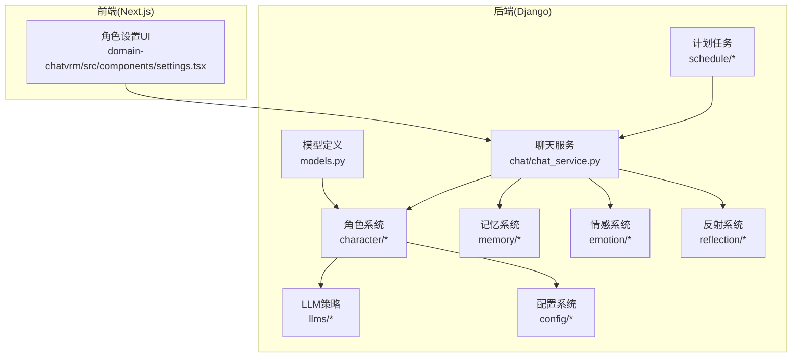
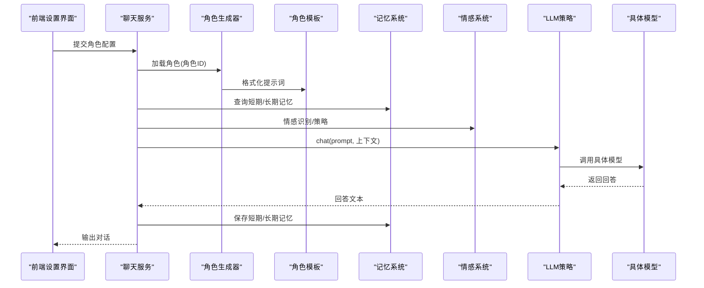
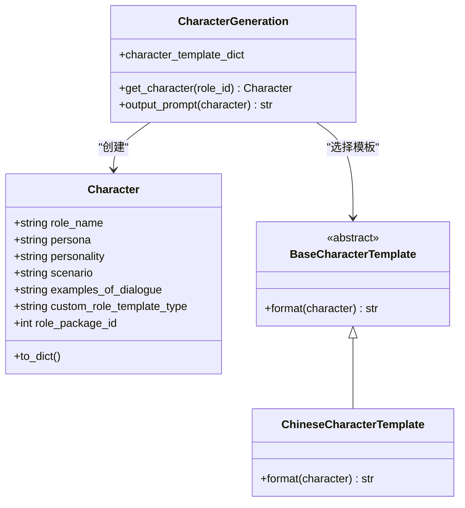
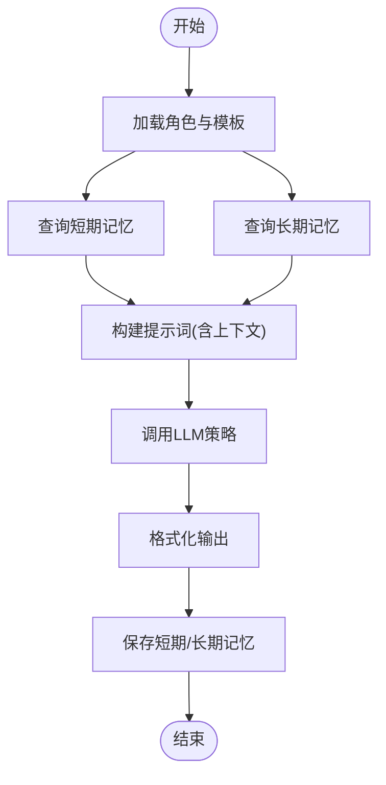
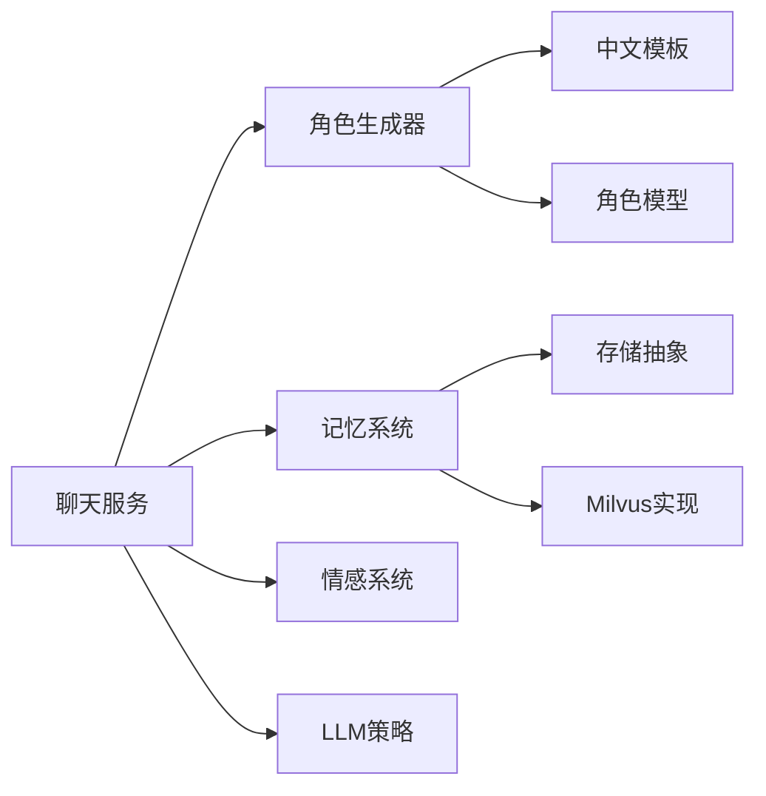

# 自定义角色开发

<cite>
**本文引用的文件**
- [domain-chatbot/apps/chatbot/character/base_character_template.py](file://domain-chatbot/apps/chatbot/character/base_character_template.py)
- [domain-chatbot/apps/chatbot/character/character.py](file://domain-chatbot/apps/chatbot/character/character.py)
- [domain-chatbot/apps/chatbot/character/character_template_zh.py](file://domain-chatbot/apps/chatbot/character/character_template_zh.py)
- [domain-chatbot/apps/chatbot/character/character_generation.py](file://domain-chatbot/apps/chatbot/character/character_generation.py)
- [domain-chatbot/apps/chatbot/character/role_package_manage.py](file://domain-chatbot/apps/chatbot/character/role_package_manage.py)
- [domain-chatbot/apps/chatbot/reflection/reflection_template.py](file://domain-chatbot/apps/chatbot/reflection/reflection_template.py)
- [domain-chatbot/apps/chatbot/memory/memory_storage.py](file://domain-chatbot/apps/chatbot/memory/memory_storage.py)
- [domain-chatbot/apps/chatbot/memory/milvus/milvus_storage_impl.py](file://domain-chatbot/apps/chatbot/memory/milvus/milvus_storage_impl.py)
- [domain-chatbot/apps/chatbot/memory/base_storage.py](file://domain-chatbot/apps/chatbot/memory/base_storage.py)
- [domain-chatbot/apps/chatbot/emotion/emotion_manage.py](file://domain-chatbot/apps/chatbot/emotion/emotion_manage.py)
- [domain-chatbot/apps/chatbot/llms/llm_model_strategy.py](file://domain-chatbot/apps/chatbot/llms/llm_model_strategy.py)
- [domain-chatbot/apps/chatbot/config/sys_config.py](file://domain-chatbot/apps/chatbot/config/sys_config.py)
- [domain-chatbot/apps/chatbot/schedule/observe_memory.py](file://domain-chatbot/apps/chatbot/schedule/observe_memory.py)
- [domain-chatbot/apps/chatbot/models.py](file://domain-chatbot/apps/chatbot/models.py)
- [domain-chatbot/apps/chatbot/chat/chat_service.py](file://domain-chatbot/apps/chatbot/chat/chat_service.py)
- [domain-chatvrm/src/components/settings.tsx](file://domain-chatvrm/src/components/settings.tsx)
</cite>

## 目录
1. [简介](#简介)
2. [项目结构](#项目结构)
3. [核心组件](#核心组件)
4. [架构总览](#架构总览)
5. [详细组件分析](#详细组件分析)
6. [依赖分析](#依赖分析)
7. [性能考虑](#性能考虑)
8. [故障排查指南](#故障排查指南)
9. [结论](#结论)
10. [附录](#附录)

## 简介
本指南面向角色开发者，系统讲解VirtualWife项目的自定义角色开发流程与架构设计，涵盖角色模型定义、对话逻辑编写、行为模式配置；角色创建流程（基础信息、外观、性格、对话风格）；角色模板系统（模板继承、参数化、动态内容生成）；对话系统（上下文管理、记忆调用、情感表达、行为控制）；角色反射机制（自我认知、学习能力、适应性调整）；与LLM模型的集成（提示词工程、输出格式化、响应策略）；以及测试与调试（对话模拟、行为追踪、性能监控）。文档提供从入门到进阶的完整开发框架与创作指导。

## 项目结构
VirtualWife采用前后端分离架构：
- 后端（Django）：负责角色定义、模板渲染、记忆与反思、LLM调度、情感处理等核心业务。
- 前端（Next.js）：提供角色编辑界面，支持角色基础信息与对话风格的可视化配置。

图表来源
- [domain-chatbot/apps/chatbot/character/character_generation.py](file://domain-chatbot/apps/chatbot/character/character_generation.py#L10-L44)
- [domain-chatbot/apps/chatbot/chat/chat_service.py](file://domain-chatbot/apps/chatbot/chat/chat_service.py#L1-L61)
- [domain-chatbot/apps/chatbot/config/sys_config.py](file://domain-chatbot/apps/chatbot/config/sys_config.py#L32-L208)
- [domain-chatbot/apps/chatbot/memory/memory_storage.py](file://domain-chatbot/apps/chatbot/memory/memory_storage.py#L14-L176)
- [domain-chatbot/apps/chatbot/emotion/emotion_manage.py](file://domain-chatbot/apps/chatbot/emotion/emotion_manage.py#L1-L182)
- [domain-chatbot/apps/chatbot/reflection/reflection_template.py](file://domain-chatbot/apps/chatbot/reflection/reflection_template.py#L1-L42)
- [domain-chatbot/apps/chatbot/schedule/observe_memory.py](file://domain-chatbot/apps/chatbot/schedule/observe_memory.py#L1-L40)
- [domain-chatbot/apps/chatbot/models.py](file://domain-chatbot/apps/chatbot/models.py#L16-L36)
- [domain-chatvrm/src/components/settings.tsx](file://domain-chatvrm/src/components/settings.tsx#L989-L1018)

章节来源
- [domain-chatbot/apps/chatbot/character/character_generation.py](file://domain-chatbot/apps/chatbot/character/character_generation.py#L10-L44)
- [domain-chatbot/apps/chatbot/chat/chat_service.py](file://domain-chatbot/apps/chatbot/chat/chat_service.py#L1-L61)
- [domain-chatbot/apps/chatbot/config/sys_config.py](file://domain-chatbot/apps/chatbot/config/sys_config.py#L32-L208)

## 核心组件
- 角色模型与模板
  - 角色数据结构：角色名称、人物设定、性格、场景、对话样例、模板类型、角色包ID。
  - 模板抽象与中文模板：通过模板类将角色数据格式化为LLM可读的提示词。
  - 角色生成器：按角色ID加载角色模型，生成Character对象，并输出对应模板格式化的提示词。
- 记忆系统
  - 短期记忆：本地存储，按页查询最近对话。
  - 长期记忆：Milvus向量数据库，支持相似度检索、分页查询、重要性评分与摘要。
  - 记忆摘要与重要性：通过LLM生成摘要与重要性打分，提升检索效率与质量。
- 情感系统
  - 情感识别：将用户输入映射到常见情感分类。
  - 情感响应策略：基于识别结果与上下文生成简短对话策略。
  - 表情生成：根据文本生成五种基础表情标签。
- LLM策略
  - 统一接口：定义同步与异步聊天接口，支持OpenAI、Ollama、智谱等多提供商策略。
  - 策略选择：根据配置选择具体LLM实现。
- 反射机制
  - 反射模板：基于历史对话生成高级洞察，输出固定格式列表。
- 配置系统
  - 动态加载：从JSON与数据库加载系统配置，初始化LLM驱动、记忆驱动、代理等。
  - 默认角色：若无角色数据则写入默认角色。
- 计划任务
  - 观察记忆：周期性拉取短期记忆，生成主题并触发内部建议回复。

章节来源
- [domain-chatbot/apps/chatbot/character/character.py](file://domain-chatbot/apps/chatbot/character/character.py#L1-L39)
- [domain-chatbot/apps/chatbot/character/base_character_template.py](file://domain-chatbot/apps/chatbot/character/base_character_template.py#L5-L12)
- [domain-chatbot/apps/chatbot/character/character_template_zh.py](file://domain-chatbot/apps/chatbot/character/character_template_zh.py#L30-L66)
- [domain-chatbot/apps/chatbot/character/character_generation.py](file://domain-chatbot/apps/chatbot/character/character_generation.py#L10-L44)
- [domain-chatbot/apps/chatbot/memory/memory_storage.py](file://domain-chatbot/apps/chatbot/memory/memory_storage.py#L14-L176)
- [domain-chatbot/apps/chatbot/memory/milvus/milvus_storage_impl.py](file://domain-chatbot/apps/chatbot/memory/milvus/milvus_storage_impl.py#L29-L60)
- [domain-chatbot/apps/chatbot/memory/base_storage.py](file://domain-chatbot/apps/chatbot/memory/base_storage.py#L4-L26)
- [domain-chatbot/apps/chatbot/emotion/emotion_manage.py](file://domain-chatbot/apps/chatbot/emotion/emotion_manage.py#L9-L182)
- [domain-chatbot/apps/chatbot/llms/llm_model_strategy.py](file://domain-chatbot/apps/chatbot/llms/llm_model_strategy.py#L13-L149)
- [domain-chatbot/apps/chatbot/reflection/reflection_template.py](file://domain-chatbot/apps/chatbot/reflection/reflection_template.py#L15-L42)
- [domain-chatbot/apps/chatbot/config/sys_config.py](file://domain-chatbot/apps/chatbot/config/sys_config.py#L32-L208)
- [domain-chatbot/apps/chatbot/schedule/observe_memory.py](file://domain-chatbot/apps/chatbot/schedule/observe_memory.py#L12-L40)

## 架构总览
下图展示角色开发与运行的关键交互：前端编辑角色信息，后端通过角色生成器与模板生成提示词，结合记忆与情感模块，经由LLM策略调用具体模型，最终输出对话并写回记忆。

图表来源
- [domain-chatbot/apps/chatbot/chat/chat_service.py](file://domain-chatbot/apps/chatbot/chat/chat_service.py#L15-L61)
- [domain-chatbot/apps/chatbot/character/character_generation.py](file://domain-chatbot/apps/chatbot/character/character_generation.py#L19-L44)
- [domain-chatbot/apps/chatbot/character/character_template_zh.py](file://domain-chatbot/apps/chatbot/character/character_template_zh.py#L32-L66)
- [domain-chatbot/apps/chatbot/memory/memory_storage.py](file://domain-chatbot/apps/chatbot/memory/memory_storage.py#L26-L106)
- [domain-chatbot/apps/chatbot/emotion/emotion_manage.py](file://domain-chatbot/apps/chatbot/emotion/emotion_manage.py#L62-L121)
- [domain-chatbot/apps/chatbot/llms/llm_model_strategy.py](file://domain-chatbot/apps/chatbot/llms/llm_model_strategy.py#L107-L149)

## 详细组件分析

### 角色模型与模板系统
- 角色数据结构
  - 字段：角色名、人物设定(persona)、性格(personality)、场景(scenario)、对话样例、模板类型、角色包ID。
  - 序列化：提供to_dict便于持久化或传输。
- 模板抽象与中文模板
  - 抽象类：定义format(character)规范，确保不同语言模板的一致输出。
  - 中文模板：将角色字段注入系统提示词，支持性格与场景的条件化拼接，保留上下文记忆与当前时间信息。
- 角色生成器
  - 依据角色ID加载数据库中的CustomRoleModel，构造Character对象；若无角色则回退默认角色。
  - 根据模板类型选择对应模板，输出格式化提示词。

图表来源
- [domain-chatbot/apps/chatbot/character/character.py](file://domain-chatbot/apps/chatbot/character/character.py#L1-L39)
- [domain-chatbot/apps/chatbot/character/base_character_template.py](file://domain-chatbot/apps/chatbot/character/base_character_template.py#L5-L12)
- [domain-chatbot/apps/chatbot/character/character_template_zh.py](file://domain-chatbot/apps/chatbot/character/character_template_zh.py#L30-L66)
- [domain-chatbot/apps/chatbot/character/character_generation.py](file://domain-chatbot/apps/chatbot/character/character_generation.py#L10-L44)

章节来源
- [domain-chatbot/apps/chatbot/character/character.py](file://domain-chatbot/apps/chatbot/character/character.py#L1-L39)
- [domain-chatbot/apps/chatbot/character/base_character_template.py](file://domain-chatbot/apps/chatbot/character/base_character_template.py#L5-L12)
- [domain-chatbot/apps/chatbot/character/character_template_zh.py](file://domain-chatbot/apps/chatbot/character/character_template_zh.py#L30-L66)
- [domain-chatbot/apps/chatbot/character/character_generation.py](file://domain-chatbot/apps/chatbot/character/character_generation.py#L10-L44)

### 角色创建流程
- 基础信息设置
  - 角色名、人物设定(persona)、场景(scenario)、对话样例、模板类型、角色包ID。
- 外观配置
  - VRM模型与背景图片通过模型定义与文件上传字段管理，角色包模型支持打包与安装卸载。
- 性格特征定义
  - 在前端设置界面可直接编辑性格描述，模板会将其注入系统提示词。
- 对话风格设计
  - 通过对话样例与场景描述影响模板生成的提示词，从而引导LLM的语域与风格。

章节来源
- [domain-chatbot/apps/chatbot/models.py](file://domain-chatbot/apps/chatbot/models.py#L16-L92)
- [domain-chatvrm/src/components/settings.tsx](file://domain-chatvrm/src/components/settings.tsx#L989-L1018)

### 角色模板系统工作原理
- 模板继承机制
  - 通过抽象模板类约束格式化方法，新增语言模板只需实现format。
- 参数化配置
  - 模板使用占位符接收角色字段与上下文变量，如角色名、场景、性格、当前时间、长期记忆等。
- 动态内容生成
  - 场景与性格为空时进行条件化拼接，避免冗余；将历史记忆拼接到提示词中，增强上下文连贯性。

章节来源
- [domain-chatbot/apps/chatbot/character/base_character_template.py](file://domain-chatbot/apps/chatbot/character/base_character_template.py#L5-L12)
- [domain-chatbot/apps/chatbot/character/character_template_zh.py](file://domain-chatbot/apps/chatbot/character/character_template_zh.py#L32-L66)

### 角色对话系统开发方法
- 上下文管理
  - 短期记忆：最近N条对话，用于本次会话上下文。
  - 长期记忆：向量检索，按相似度排序，限制数量。
- 记忆调用
  - 生成提示词前先检索短期与长期记忆，拼接到模板中。
- 情感表达与行为控制
  - 情感识别：将用户输入映射到情感分类。
  - 情感响应策略：基于识别结果与上下文生成简短策略。
  - 表情生成：输出基础表情标签，供前端动画/表情模块使用。
- 输出格式化
  - 对LLM输出进行清洗与格式化，去除多余标记，保留自然口语化表达。

图表来源
- [domain-chatbot/apps/chatbot/chat/chat_service.py](file://domain-chatbot/apps/chatbot/chat/chat_service.py#L15-L61)
- [domain-chatbot/apps/chatbot/memory/memory_storage.py](file://domain-chatbot/apps/chatbot/memory/memory_storage.py#L26-L106)
- [domain-chatbot/apps/chatbot/emotion/emotion_manage.py](file://domain-chatbot/apps/chatbot/emotion/emotion_manage.py#L62-L121)
- [domain-chatbot/apps/chatbot/llms/llm_model_strategy.py](file://domain-chatbot/apps/chatbot/llms/llm_model_strategy.py#L107-L149)

章节来源
- [domain-chatbot/apps/chatbot/chat/chat_service.py](file://domain-chatbot/apps/chatbot/chat/chat_service.py#L15-L61)
- [domain-chatbot/apps/chatbot/memory/memory_storage.py](file://domain-chatbot/apps/chatbot/memory/memory_storage.py#L26-L106)
- [domain-chatbot/apps/chatbot/emotion/emotion_manage.py](file://domain-chatbot/apps/chatbot/emotion/emotion_manage.py#L62-L121)
- [domain-chatbot/apps/chatbot/llms/llm_model_strategy.py](file://domain-chatbot/apps/chatbot/llms/llm_model_strategy.py#L107-L149)

### 角色反射机制
- 自我认知与洞察生成
  - 使用反射模板将历史对话汇总为洞察，输出固定格式列表，便于后续行为优化与主题提炼。
- 与记忆系统的协作
  - 反射通常基于长期记忆与近期对话，形成更高层的认知摘要。

章节来源
- [domain-chatbot/apps/chatbot/reflection/reflection_template.py](file://domain-chatbot/apps/chatbot/reflection/reflection_template.py#L15-L42)

### 角色与LLM模型的集成
- 提示词工程
  - 模板将角色设定、场景、性格、历史记忆、当前时间等注入提示词，保证一致性与情境贴合。
- 输出格式化
  - 对LLM输出进行清洗，去除多余标记，确保口语化与可读性。
- 响应策略
  - 支持同步与异步两种调用方式，适配不同前端交互需求。

章节来源
- [domain-chatbot/apps/chatbot/character/character_template_zh.py](file://domain-chatbot/apps/chatbot/character/character_template_zh.py#L32-L66)
- [domain-chatbot/apps/chatbot/llms/llm_model_strategy.py](file://domain-chatbot/apps/chatbot/llms/llm_model_strategy.py#L107-L149)

### 角色包与RAG示例生成
- 角色包管理
  - 支持角色包的安装与卸载，解压后读取数据集、嵌入索引与系统提示词。
- RAG示例生成
  - 基于Faiss向量检索与交叉重排，生成与用户查询最相关的问答样例，注入到角色模板中。

章节来源
- [domain-chatbot/apps/chatbot/character/role_package_manage.py](file://domain-chatbot/apps/chatbot/character/role_package_manage.py#L103-L163)

## 依赖分析
- 组件耦合
  - 角色生成器依赖模板抽象与具体模板；聊天服务依赖生成器、记忆系统、情感系统与LLM策略。
  - 记忆系统通过抽象基类解耦本地与Milvus实现，便于替换与扩展。
- 外部依赖
  - LLM提供商（OpenAI/Ollama/智谱）、Milvus向量库、Faiss检索、FlagEmbedding嵌入与重排模型。

图表来源
- [domain-chatbot/apps/chatbot/character/character_generation.py](file://domain-chatbot/apps/chatbot/character/character_generation.py#L10-L44)
- [domain-chatbot/apps/chatbot/character/character_template_zh.py](file://domain-chatbot/apps/chatbot/character/character_template_zh.py#L30-L66)
- [domain-chatbot/apps/chatbot/memory/memory_storage.py](file://domain-chatbot/apps/chatbot/memory/memory_storage.py#L14-L176)
- [domain-chatbot/apps/chatbot/memory/base_storage.py](file://domain-chatbot/apps/chatbot/memory/base_storage.py#L4-L26)
- [domain-chatbot/apps/chatbot/memory/milvus/milvus_storage_impl.py](file://domain-chatbot/apps/chatbot/memory/milvus/milvus_storage_impl.py#L29-L60)
- [domain-chatbot/apps/chatbot/emotion/emotion_manage.py](file://domain-chatbot/apps/chatbot/emotion/emotion_manage.py#L1-L182)
- [domain-chatbot/apps/chatbot/llms/llm_model_strategy.py](file://domain-chatbot/apps/chatbot/llms/llm_model_strategy.py#L107-L149)

章节来源
- [domain-chatbot/apps/chatbot/character/character_generation.py](file://domain-chatbot/apps/chatbot/character/character_generation.py#L10-L44)
- [domain-chatbot/apps/chatbot/memory/base_storage.py](file://domain-chatbot/apps/chatbot/memory/base_storage.py#L4-L26)
- [domain-chatbot/apps/chatbot/memory/milvus/milvus_storage_impl.py](file://domain-chatbot/apps/chatbot/memory/milvus/milvus_storage_impl.py#L29-L60)
- [domain-chatbot/apps/chatbot/llms/llm_model_strategy.py](file://domain-chatbot/apps/chatbot/llms/llm_model_strategy.py#L107-L149)

## 性能考虑
- 记忆检索
  - 控制长期记忆检索数量与短期记忆页大小，避免提示词过长导致延迟。
  - 启用摘要与重要性评分可减少长期存储与检索开销。
- LLM调用
  - 优先使用异步流式接口，提升前端交互体验；合理设置模型参数与温度，平衡创造性与稳定性。
- 向量检索
  - Faiss索引与重排模型需评估内存与CPU占用，必要时降低召回/重排K值或启用更轻量模型。

## 故障排查指南
- 角色未生效
  - 检查角色ID是否正确；确认系统配置中角色ID与角色名一致；首次启动会写入默认角色，确认数据库是否存在记录。
- 记忆无法检索
  - 确认长期记忆开关已开启；检查Milvus连接参数与索引；查看日志异常堆栈。
- LLM调用失败
  - 检查环境变量（API密钥、代理设置）；确认所选模型类型与策略匹配。
- 情感识别/表情生成异常
  - 查看LLM输出是否包含JSON片段；确保输出解析逻辑能正确提取字段。

章节来源
- [domain-chatbot/apps/chatbot/config/sys_config.py](file://domain-chatbot/apps/chatbot/config/sys_config.py#L83-L208)
- [domain-chatbot/apps/chatbot/memory/memory_storage.py](file://domain-chatbot/apps/chatbot/memory/memory_storage.py#L35-L54)
- [domain-chatbot/apps/chatbot/emotion/emotion_manage.py](file://domain-chatbot/apps/chatbot/emotion/emotion_manage.py#L62-L121)

## 结论
VirtualWife的角色系统通过清晰的模板抽象、可插拔的LLM策略、可扩展的记忆与情感模块，为角色开发者提供了强大的创作与集成框架。遵循本文档的流程与最佳实践，开发者可以快速构建具备个性化性格、丰富上下文与情感表达的虚拟角色，并通过反射与RAG进一步提升角色的学习与适应能力。

## 附录
- 开发步骤建议
  - 设计角色基础信息与场景，编写对话样例，选择合适的模板类型。
  - 通过前端设置界面或后端模型导入角色数据。
  - 配置系统参数（LLM提供商、代理、记忆策略），验证提示词与输出格式。
  - 使用计划任务观察记忆与主题，持续优化角色表现。
- 测试与调试
  - 使用聊天服务接口进行对话模拟，结合日志与异常堆栈定位问题。
  - 通过角色包安装/卸载验证RAG示例生成与系统提示词加载。
  - 监控内存与向量检索性能，按需调整K值与模型配置。