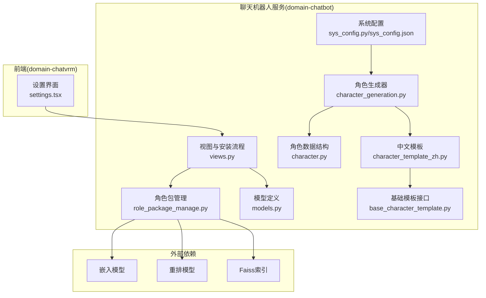
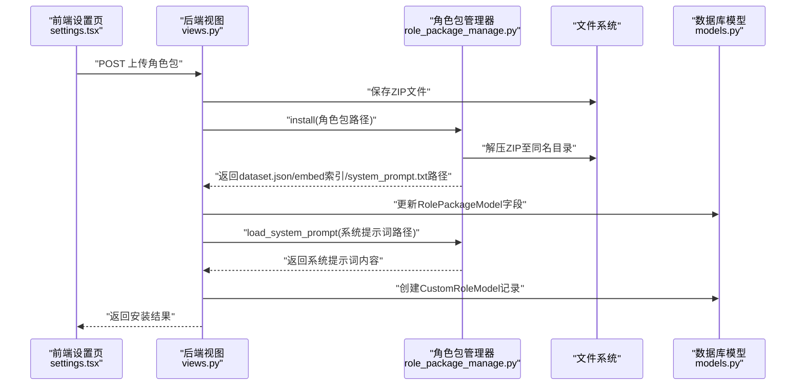
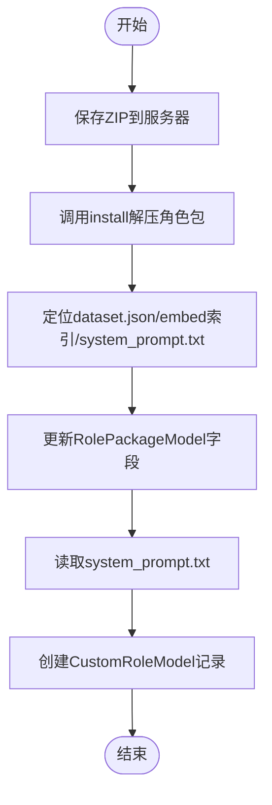
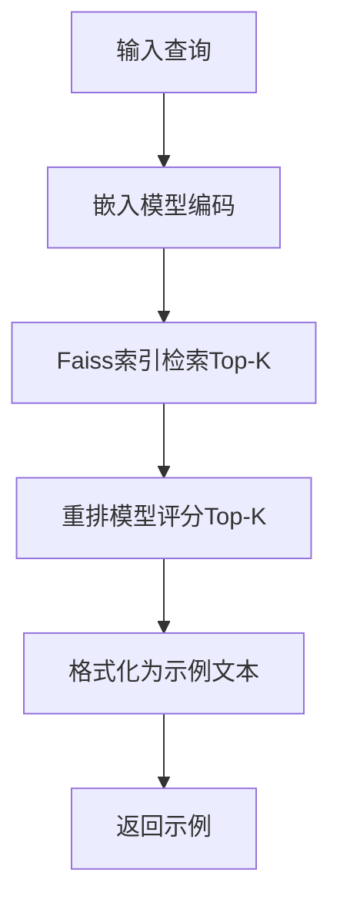
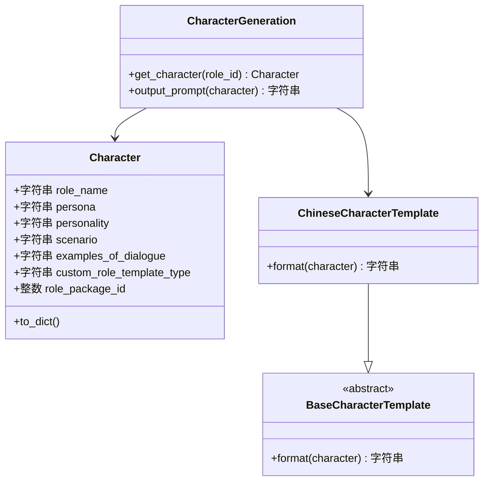
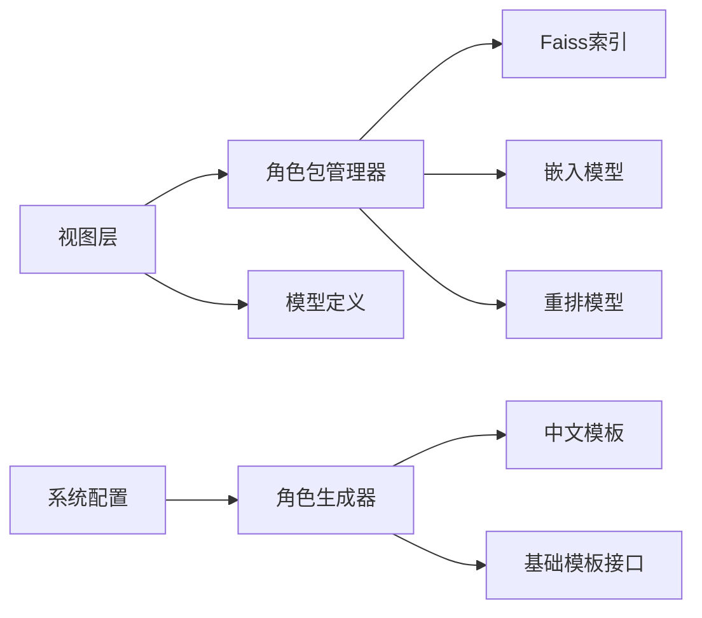

# 角色包管理

<cite>
**本文引用的文件**
- [role_package_manage.py](file://domain-chatbot/apps/chatbot/character/role_package_manage.py)
- [character.py](file://domain-chatbot/apps/chatbot/character/character.py)
- [character_generation.py](file://domain-chatbot/apps/chatbot/character/character_generation.py)
- [character_template_zh.py](file://domain-chatbot/apps/chatbot/character/character_template_zh.py)
- [base_character_template.py](file://domain-chatbot/apps/chatbot/character/base_character_template.py)
- [models.py](file://domain-chatbot/apps/chatbot/models.py)
- [sys_config.py](file://domain-chatbot/apps/chatbot/config/sys_config.py)
- [sys_config.json](file://domain-chatbot/apps/chatbot/config/sys_config.json)
- [views.py](file://domain-chatbot/apps/chatbot/views.py)
- [settings.tsx](file://domain-chatvrm/src/components/settings.tsx)
- [milvus_memory.py](file://domain-chatbot/apps/chatbot/memory/milvus/milvus_memory.py)
</cite>

## 目录
1. [简介](#简介)
2. [项目结构](#项目结构)
3. [核心组件](#核心组件)
4. [架构总览](#架构总览)
5. [组件详解](#组件详解)
6. [依赖关系分析](#依赖关系分析)
7. [性能考量](#性能考量)
8. [故障排除指南](#故障排除指南)
9. [结论](#结论)
10. [附录](#附录)

## 简介
本指南面向角色包开发者与维护者，系统化阐述VirtualWife项目中“角色包”的结构设计、安装与卸载流程、元数据管理、RAG检索应用、以及创建与测试方法。角色包用于封装角色的系统提示词、对话示例库与向量检索索引，支持通过ZIP包形式分发与安装。

## 项目结构
角色包管理相关能力主要分布在以下模块：
- 角色包安装与RAG检索：domain-chatbot/apps/chatbot/character/role_package_manage.py
- 角色数据结构与模板：domain-chatbot/apps/chatbot/character/*.py
- 角色持久化与角色包元数据：domain-chatbot/apps/chatbot/models.py
- 系统配置与默认角色加载：domain-chatbot/apps/chatbot/config/*
- 角色包上传与安装流程入口：domain-chatbot/apps/chatbot/views.py
- 前端角色包上传交互：domain-chatvrm/src/components/settings.tsx
- 向量检索参考实现：domain-chatbot/apps/chatbot/memory/milvus/milvus_memory.py

图表来源
- [role_package_manage.py](file://domain-chatbot/apps/chatbot/character/role_package_manage.py#L103-L163)
- [character.py](file://domain-chatbot/apps/chatbot/character/character.py#L1-L39)
- [character_generation.py](file://domain-chatbot/apps/chatbot/character/character_generation.py#L1-L45)
- [character_template_zh.py](file://domain-chatbot/apps/chatbot/character/character_template_zh.py#L1-L67)
- [base_character_template.py](file://domain-chatbot/apps/chatbot/character/base_character_template.py#L1-L12)
- [models.py](file://domain-chatbot/apps/chatbot/models.py#L85-L92)
- [sys_config.py](file://domain-chatbot/apps/chatbot/config/sys_config.py#L32-L208)
- [sys_config.json](file://domain-chatbot/apps/chatbot/config/sys_config.json#L1-L60)
- [views.py](file://domain-chatbot/apps/chatbot/views.py#L250-L293)
- [settings.tsx](file://domain-chatvrm/src/components/settings.tsx#L422-L438)

章节来源
- [role_package_manage.py](file://domain-chatbot/apps/chatbot/character/role_package_manage.py#L103-L163)
- [models.py](file://domain-chatbot/apps/chatbot/models.py#L85-L92)
- [views.py](file://domain-chatbot/apps/chatbot/views.py#L250-L293)
- [settings.tsx](file://domain-chatvrm/src/components/settings.tsx#L422-L438)

## 核心组件
- 角色包管理器：负责角色包ZIP解压、必要文件定位、系统提示词加载。
- RAG检索器：基于嵌入模型召回候选问答对，再用重排模型精排，最终格式化为角色示例。
- 角色数据结构与模板：统一角色字段与Prompt模板格式化。
- 角色生成器：根据模板类型选择模板，输出可注入LLM的系统提示词。
- 元数据模型：记录角色包的路径与角色信息，支撑安装后角色的持久化。
- 系统配置：加载默认角色、语言模型与代理等运行时配置。
- 视图层：提供角色包上传接口，完成安装与角色入库。
- 前端交互：提供角色包文件选择与上传按钮。

章节来源
- [role_package_manage.py](file://domain-chatbot/apps/chatbot/character/role_package_manage.py#L103-L163)
- [character.py](file://domain-chatbot/apps/chatbot/character/character.py#L1-L39)
- [character_generation.py](file://domain-chatbot/apps/chatbot/character/character_generation.py#L10-L45)
- [character_template_zh.py](file://domain-chatbot/apps/chatbot/character/character_template_zh.py#L30-L67)
- [models.py](file://domain-chatbot/apps/chatbot/models.py#L85-L92)
- [sys_config.py](file://domain-chatbot/apps/chatbot/config/sys_config.py#L32-L208)
- [views.py](file://domain-chatbot/apps/chatbot/views.py#L250-L293)
- [settings.tsx](file://domain-chatvrm/src/components/settings.tsx#L422-L438)

## 架构总览
角色包的生命周期包含“上传—安装—入库—生成Prompt—对话调用”等环节。前端通过设置页上传ZIP包，后端视图接收并调用角色包管理器进行解压与路径登记，随后读取系统提示词与示例库，生成角色并持久化。

图表来源
- [settings.tsx](file://domain-chatvrm/src/components/settings.tsx#L422-L438)
- [views.py](file://domain-chatbot/apps/chatbot/views.py#L250-L293)
- [role_package_manage.py](file://domain-chatbot/apps/chatbot/character/role_package_manage.py#L103-L148)
- [models.py](file://domain-chatbot/apps/chatbot/models.py#L85-L92)

## 组件详解

### 角色包结构设计
- 包格式：ZIP压缩包，包名即解压目录名。
- 必需文件：
  - dataset.json：问答示例库，包含若干条(question, answer)样本。
  - embed_index.idx：Faiss向量检索索引文件。
  - system_prompt.txt：角色系统提示词文本。
- 安装后路径：ZIP解压到与包名相同的目录；上述三文件位于该目录根部。

章节来源
- [role_package_manage.py](file://domain-chatbot/apps/chatbot/character/role_package_manage.py#L119-L143)

### 角色包安装流程
- 接收角色包文件并保存到服务器。
- 调用安装器解压ZIP，定位三类文件路径。
- 更新角色包元数据模型，写入角色名与三文件路径。
- 读取system_prompt.txt作为角色persona，其余字段留空或占位。
- 创建CustomRoleModel记录，标记role_package_id为该角色包ID。

图表来源
- [views.py](file://domain-chatbot/apps/chatbot/views.py#L250-L293)
- [role_package_manage.py](file://domain-chatbot/apps/chatbot/character/role_package_manage.py#L103-L148)
- [models.py](file://domain-chatbot/apps/chatbot/models.py#L85-L92)

章节来源
- [views.py](file://domain-chatbot/apps/chatbot/views.py#L250-L293)
- [role_package_manage.py](file://domain-chatbot/apps/chatbot/character/role_package_manage.py#L103-L148)
- [models.py](file://domain-chatbot/apps/chatbot/models.py#L85-L92)

### 角色包卸载机制
- 输入角色包文件路径，解析出同名目录。
- 删除该目录与ZIP文件本身。
- 注意：卸载不会回滚数据库中的角色记录，需额外清理角色数据。

章节来源
- [role_package_manage.py](file://domain-chatbot/apps/chatbot/character/role_package_manage.py#L109-L117)

### 角色包元数据管理
- 角色包元数据模型包含：角色名、dataset.json路径、embed索引路径、system_prompt.txt路径、原始ZIP文件。
- 角色模型包含：角色名、persona、personality、scenario、examples_of_dialogue、模板类型、角色包ID。
- 系统配置负责加载默认角色与环境变量，确保模型可用。

章节来源
- [models.py](file://domain-chatbot/apps/chatbot/models.py#L85-L92)
- [sys_config.py](file://domain-chatbot/apps/chatbot/config/sys_config.py#L32-L208)
- [sys_config.json](file://domain-chatbot/apps/chatbot/config/sys_config.json#L1-L60)

### RAG搜索在角色包中的应用
- 回召回：使用嵌入模型对查询编码，在Faiss索引中检索Top-K候选问答对。
- 重排：使用重排模型对候选问答对与查询计算相关性得分，按分数降序取Top-K。
- 示例格式化：将重排后的问答对格式化为“用户说+问题+角色说+回答”的连续文本，供角色模板注入。

图表来源
- [role_package_manage.py](file://domain-chatbot/apps/chatbot/character/role_package_manage.py#L46-L101)

章节来源
- [role_package_manage.py](file://domain-chatbot/apps/chatbot/character/role_package_manage.py#L46-L101)

### 角色模板与Prompt生成
- 角色数据结构包含角色名、persona、personality、scenario、examples_of_dialogue等字段。
- 中文模板将上述字段按固定格式拼接为系统提示词，支持注入当前时间、历史上下文等动态参数。
- 角色生成器根据模板类型选择对应模板，输出可用于LLM的完整Prompt。

图表来源
- [character.py](file://domain-chatbot/apps/chatbot/character/character.py#L1-L39)
- [base_character_template.py](file://domain-chatbot/apps/chatbot/character/base_character_template.py#L5-L12)
- [character_template_zh.py](file://domain-chatbot/apps/chatbot/character/character_template_zh.py#L30-L67)
- [character_generation.py](file://domain-chatbot/apps/chatbot/character/character_generation.py#L10-L45)

章节来源
- [character.py](file://domain-chatbot/apps/chatbot/character/character.py#L1-L39)
- [character_template_zh.py](file://domain-chatbot/apps/chatbot/character/character_template_zh.py#L30-L67)
- [character_generation.py](file://domain-chatbot/apps/chatbot/character/character_generation.py#L10-L45)

### 前端角色包上传与交互
- 设置页提供“加载角色安装包”区域，包含文件选择与上传按钮。
- 上传后触发视图层安装流程，安装完成后刷新角色列表。

章节来源
- [settings.tsx](file://domain-chatvrm/src/components/settings.tsx#L422-L438)
- [views.py](file://domain-chatbot/apps/chatbot/views.py#L250-L293)

## 依赖关系分析
- 角色包管理器依赖Faiss索引与FlagEmbedding嵌入/重排模型，用于RAG检索。
- 角色生成器依赖模板接口与具体模板实现，输出Prompt。
- 视图层依赖角色包管理器与模型定义，完成安装与入库。
- 系统配置负责加载默认角色与环境变量，影响模型可用性。

图表来源
- [role_package_manage.py](file://domain-chatbot/apps/chatbot/character/role_package_manage.py#L11-L43)
- [character_generation.py](file://domain-chatbot/apps/chatbot/character/character_generation.py#L10-L45)
- [views.py](file://domain-chatbot/apps/chatbot/views.py#L250-L293)
- [sys_config.py](file://domain-chatbot/apps/chatbot/config/sys_config.py#L32-L208)

章节来源
- [role_package_manage.py](file://domain-chatbot/apps/chatbot/character/role_package_manage.py#L11-L43)
- [character_generation.py](file://domain-chatbot/apps/chatbot/character/character_generation.py#L10-L45)
- [views.py](file://domain-chatbot/apps/chatbot/views.py#L250-L293)
- [sys_config.py](file://domain-chatbot/apps/chatbot/config/sys_config.py#L32-L208)

## 性能考量
- 嵌入与重排模型推理成本较高，建议在CPU/GPU资源充足时启用，并合理设置召回与重排Top-K。
- Faiss索引规模较大时，注意内存占用与I/O性能，必要时拆分索引或使用稀疏/混合索引策略。
- 对频繁调用的模型采用懒加载与缓存策略，避免重复初始化。
- 角色包安装后尽量复用已加载的索引与模型实例，减少冷启动开销。

## 故障排除指南
- 无法找到角色包文件：确认上传路径与权限，检查视图层保存逻辑。
- Faiss索引读取失败：确认embed_index.idx路径正确且文件未损坏。
- 嵌入/重排模型初始化异常：检查模型路径与环境变量，确保FlagEmbedding与Faiss安装正确。
- Prompt生成为空：检查system_prompt.txt是否正确写入，或examples_of_dialogue是否被占位。
- 默认角色加载失败：检查系统配置与数据库迁移状态。

章节来源
- [role_package_manage.py](file://domain-chatbot/apps/chatbot/character/role_package_manage.py#L119-L148)
- [views.py](file://domain-chatbot/apps/chatbot/views.py#L250-L293)
- [sys_config.py](file://domain-chatbot/apps/chatbot/config/sys_config.py#L83-L109)

## 结论
角色包管理通过标准化的ZIP结构与安装流程，实现了角色系统的快速分发与集成。结合RAG检索与模板化Prompt生成，能够为角色提供高质量的上下文示例与稳定的系统提示词。建议在实际部署中关注模型与索引的性能优化，并完善角色包的元数据与版本管理，以提升可维护性与一致性。

## 附录

### 角色包创建工具使用要点
- 角色模板设计：使用中文模板格式化角色字段，确保persona、personality、scenario与examples_of_dialogue完整。
- 对话示例生成：准备高质量的(question, answer)样本，构建dataset.json。
- 嵌入索引构建：使用嵌入模型对样本编码并建立Faiss索引，导出embed_index.idx。
- 系统提示词配置：编写system_prompt.txt，作为角色的初始persona。
- 打包与命名：将三文件放入ZIP，包名即为解压目录名。

章节来源
- [character_template_zh.py](file://domain-chatbot/apps/chatbot/character/character_template_zh.py#L30-L67)
- [role_package_manage.py](file://domain-chatbot/apps/chatbot/character/role_package_manage.py#L119-L143)

### 角色包测试方法
- 单元测试：针对RAG检索的召回与重排结果进行回归测试，验证示例格式化输出。
- 集成测试：从前端上传角色包到后端安装，再到角色入库与Prompt生成的全流程验证。
- 性能测试：在不同Top-K与索引规模下评估响应时间与资源占用。

### 兼容性与版本控制建议
- 明确角色包版本号与依赖模型版本，避免跨版本不兼容。
- 在dataset.json中保留元信息字段，便于后续升级与迁移。
- 对system_prompt.txt采用版本化命名或目录隔离，支持多版本对比。