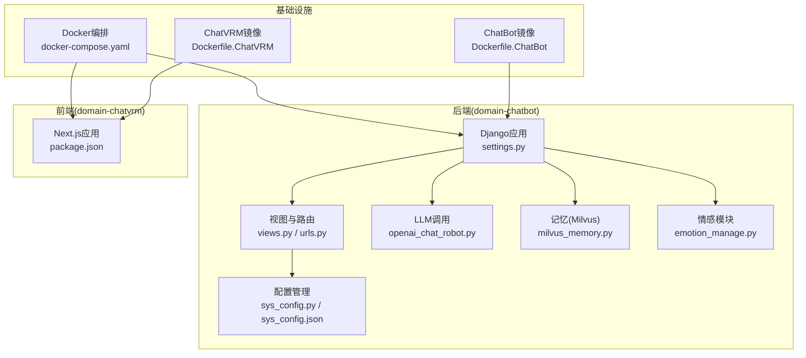
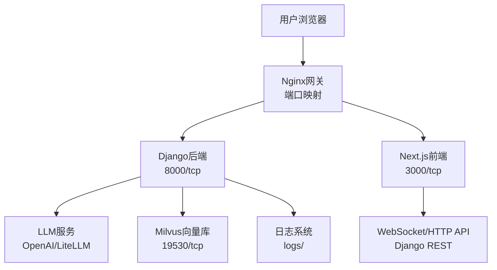
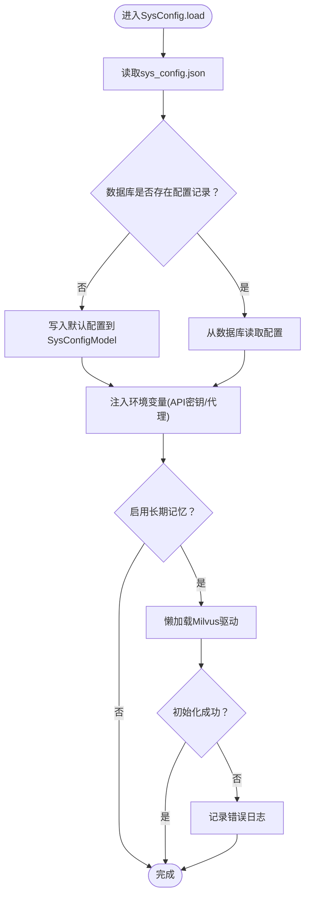
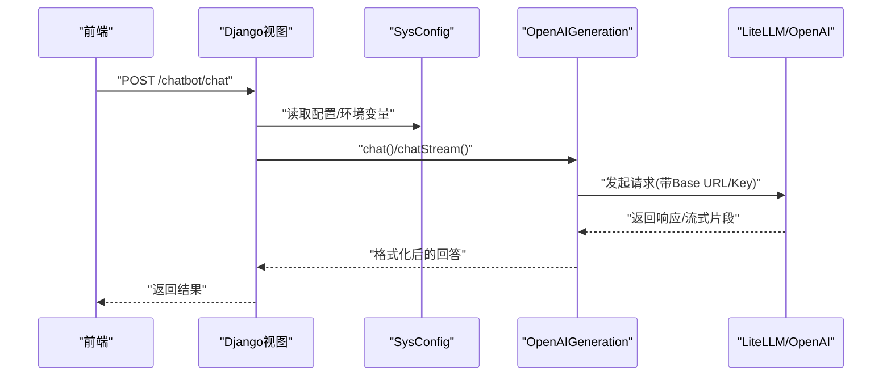
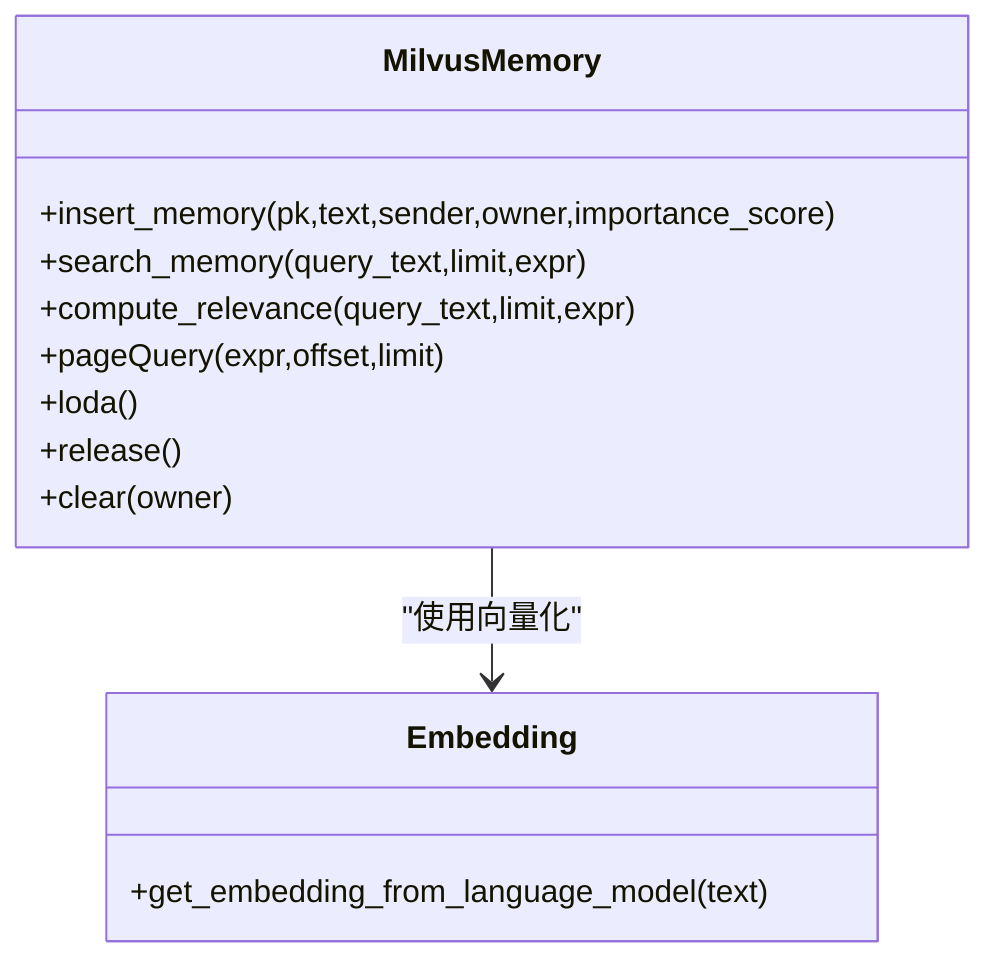
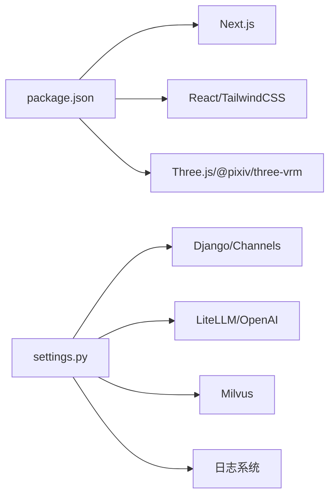

# 故障排除与常见问题

<cite>
**本文引用的文件**
- [FAQ.md](file://FAQ.md)
- [installer/README.md](file://installer/README.md)
- [domain-chatbot/VirtualWife/settings.py](file://domain-chatbot/VirtualWife/settings.py)
- [domain-chatbot/apps/chatbot/config/sys_config.py](file://domain-chatbot/apps/chatbot/config/sys_config.py)
- [domain-chatbot/apps/chatbot/config/sys_config.json](file://domain-chatbot/apps/chatbot/config/sys_config.json)
- [domain-chatbot/apps/chatbot/views.py](file://domain-chatbot/apps/chatbot/views.py)
- [domain-chatbot/apps/chatbot/urls.py](file://domain-chatbot/apps/chatbot/urls.py)
- [domain-chatbot/apps/chatbot/memory/milvus/milvus_memory.py](file://domain-chatbot/apps/chatbot/memory/milvus/milvus_memory.py)
- [domain-chatbot/apps/chatbot/llms/openai/openai_chat_robot.py](file://domain-chatbot/apps/chatbot/llms/openai/openai_chat_robot.py)
- [domain-chatbot/apps/chatbot/emotion/emotion_manage.py](file://domain-chatbot/apps/chatbot/emotion/emotion_manage.py)
- [domain-chatbot/apps/chatbot/utils/chat_message_utils.py](file://domain-chatbot/apps/chatbot/utils/chat_message_utils.py)
- [domain-chatbot/manage.py](file://domain-chatbot/manage.py)
- [domain-chatbot/apps/chatbot/models.py](file://domain-chatbot/apps/chatbot/models.py)
- [domain-chatvrm/package.json](file://domain-chatvrm/package.json)
- [infrastructure-packaging/Dockerfile.ChatBot](file://infrastructure-packaging/Dockerfile.ChatBot)
- [infrastructure-packaging/Dockerfile.ChatVRM](file://infrastructure-packaging/Dockerfile.ChatVRM)
- [installer/docker-compose.yaml](file://installer/docker-compose.yaml)
</cite>

## 目录
1. [简介](#简介)
2. [项目结构](#项目结构)
3. [核心组件](#核心组件)
4. [架构总览](#架构总览)
5. [详细组件分析](#详细组件分析)
6. [依赖关系分析](#依赖关系分析)
7. [性能考虑](#性能考虑)
8. [故障排除指南](#故障排除指南)
9. [结论](#结论)
10. [附录](#附录)

## 简介
本文件面向用户与开发者，提供VirtualWife项目的故障排除与常见问题解答，覆盖安装、配置、部署、运行时错误排查、性能优化与调试技巧。内容基于仓库现有实现与文档，聚焦以下方面：
- 容器部署问题：容器启动失败、端口冲突、跨服务网络连通性
- 配置问题：API密钥校验、代理设置、数据库与长期记忆（Milvus）连接
- 运行时错误：日志分析、流式对话异常、弹幕监听失效
- 性能优化：缓存与并发、向量检索与索引、前端构建与运行
- 调试工具：Python调试器、浏览器开发者工具、网络抓包与日志定位

## 项目结构
项目采用多模块分层组织：
- domain-chatbot：Django/Channels后端，负责聊天、配置、角色、记忆、LLM调用、弹幕监听等
- domain-chatvrm：Next.js前端，负责VRM交互、TTS、翻译、消息队列等
- infrastructure-packaging：Docker镜像构建脚本
- installer：Docker Compose编排与环境变量模板
- docs：文档资源

图表来源
- [domain-chatbot/VirtualWife/settings.py](file://domain-chatbot/VirtualWife/settings.py#L1-L208)
- [domain-chatbot/apps/chatbot/config/sys_config.py](file://domain-chatbot/apps/chatbot/config/sys_config.py#L1-L208)
- [domain-chatbot/apps/chatbot/config/sys_config.json](file://domain-chatbot/apps/chatbot/config/sys_config.json#L1-L60)
- [domain-chatbot/apps/chatbot/views.py](file://domain-chatbot/apps/chatbot/views.py#L1-L346)
- [domain-chatbot/apps/chatbot/urls.py](file://domain-chatbot/apps/chatbot/urls.py#L1-L26)
- [domain-chatbot/apps/chatbot/llms/openai/openai_chat_robot.py](file://domain-chatbot/apps/chatbot/llms/openai/openai_chat_robot.py#L1-L101)
- [domain-chatbot/apps/chatbot/memory/milvus/milvus_memory.py](file://domain-chatbot/apps/chatbot/memory/milvus/milvus_memory.py#L1-L184)
- [domain-chatbot/apps/chatbot/emotion/emotion_manage.py](file://domain-chatbot/apps/chatbot/emotion/emotion_manage.py#L1-L182)
- [domain-chatvrm/package.json](file://domain-chatvrm/package.json#L1-L51)
- [infrastructure-packaging/Dockerfile.ChatBot](file://infrastructure-packaging/Dockerfile.ChatBot#L1-L31)
- [infrastructure-packaging/Dockerfile.ChatVRM](file://infrastructure-packaging/Dockerfile.ChatVRM#L1-L29)
- [installer/docker-compose.yaml](file://installer/docker-compose.yaml#L1-L44)

章节来源
- [domain-chatbot/VirtualWife/settings.py](file://domain-chatbot/VirtualWife/settings.py#L1-L208)
- [domain-chatbot/apps/chatbot/config/sys_config.py](file://domain-chatbot/apps/chatbot/config/sys_config.py#L1-L208)
- [domain-chatbot/apps/chatbot/config/sys_config.json](file://domain-chatbot/apps/chatbot/config/sys_config.json#L1-L60)
- [domain-chatbot/apps/chatbot/views.py](file://domain-chatbot/apps/chatbot/views.py#L1-L346)
- [domain-chatbot/apps/chatbot/urls.py](file://domain-chatbot/apps/chatbot/urls.py#L1-L26)
- [domain-chatvrm/package.json](file://domain-chatvrm/package.json#L1-L51)
- [infrastructure-packaging/Dockerfile.ChatBot](file://infrastructure-packaging/Dockerfile.ChatBot#L1-L31)
- [infrastructure-packaging/Dockerfile.ChatVRM](file://infrastructure-packaging/Dockerfile.ChatVRM#L1-L29)
- [installer/docker-compose.yaml](file://installer/docker-compose.yaml#L1-L44)

## 核心组件
- 配置系统：集中读取与持久化系统配置，注入环境变量（如API密钥、代理），并按需懒加载长期记忆驱动
- LLM调用：封装OpenAI LiteLLM接口，支持流式与非流式对话
- 记忆系统：基于Milvus的向量检索与索引，支持相似度、重要度与时间衰减综合评分
- 弹幕监听：通过配置项启用/禁用，结合Cookie与房间ID进行直播监听
- 前后端通信：Django REST API与Next.js前端通过网关暴露的服务进行交互

章节来源
- [domain-chatbot/apps/chatbot/config/sys_config.py](file://domain-chatbot/apps/chatbot/config/sys_config.py#L1-L208)
- [domain-chatbot/apps/chatbot/config/sys_config.json](file://domain-chatbot/apps/chatbot/config/sys_config.json#L1-L60)
- [domain-chatbot/apps/chatbot/llms/openai/openai_chat_robot.py](file://domain-chatbot/apps/chatbot/llms/openai/openai_chat_robot.py#L1-L101)
- [domain-chatbot/apps/chatbot/memory/milvus/milvus_memory.py](file://domain-chatbot/apps/chatbot/memory/milvus/milvus_memory.py#L1-L184)
- [domain-chatbot/apps/chatbot/views.py](file://domain-chatbot/apps/chatbot/views.py#L1-L346)
- [domain-chatbot/apps/chatbot/urls.py](file://domain-chatbot/apps/chatbot/urls.py#L1-L26)

## 架构总览
后端通过Django Channels提供WebSocket/HTTP能力，前端Next.js提供VRM交互界面；Docker Compose将ChatBot、ChatVRM与网关组合为统一服务；配置由sys_config统一管理，注入到各子系统。

图表来源
- [installer/docker-compose.yaml](file://installer/docker-compose.yaml#L1-L44)
- [infrastructure-packaging/Dockerfile.ChatBot](file://infrastructure-packaging/Dockerfile.ChatBot#L1-L31)
- [infrastructure-packaging/Dockerfile.ChatVRM](file://infrastructure-packaging/Dockerfile.ChatVRM#L1-L29)
- [domain-chatbot/VirtualWife/settings.py](file://domain-chatbot/VirtualWife/settings.py#L154-L208)
- [domain-chatbot/apps/chatbot/llms/openai/openai_chat_robot.py](file://domain-chatbot/apps/chatbot/llms/openai/openai_chat_robot.py#L1-L101)
- [domain-chatbot/apps/chatbot/memory/milvus/milvus_memory.py](file://domain-chatbot/apps/chatbot/memory/milvus/milvus_memory.py#L1-L184)

## 详细组件分析

### 组件A：配置加载与环境注入（SysConfig）
- 功能要点
  - 从sys_config.json读取配置，必要时写入数据库SysConfigModel
  - 注入OPENAI_API_KEY、OPENAI_BASE_URL、OLLAMA_API_BASE、ZHIPUAI_API_KEY等环境变量
  - 支持HTTP/HTTPS/SOCKS5代理开关与地址注入
  - 懒加载Milvus记忆驱动，失败时记录错误日志
- 常见问题
  - 环境变量未生效：确认.env已正确加载，且容器内环境变量优先级
  - 代理配置无效：确认enableProxy为true且代理地址正确
  - Milvus初始化失败：检查host/port/user/password/dbName与Milvus服务连通性

图表来源
- [domain-chatbot/apps/chatbot/config/sys_config.py](file://domain-chatbot/apps/chatbot/config/sys_config.py#L52-L192)
- [domain-chatbot/apps/chatbot/config/sys_config.json](file://domain-chatbot/apps/chatbot/config/sys_config.json#L1-L60)

章节来源
- [domain-chatbot/apps/chatbot/config/sys_config.py](file://domain-chatbot/apps/chatbot/config/sys_config.py#L1-L208)
- [domain-chatbot/apps/chatbot/config/sys_config.json](file://domain-chatbot/apps/chatbot/config/sys_config.json#L1-L60)

### 组件B：LLM对话与流式输出（OpenAI）
- 功能要点
  - 从环境变量读取OPENAI_API_KEY与OPENAI_BASE_URL
  - 支持非流式与流式completion，过滤空白字符并格式化最终回复
- 常见问题
  - API密钥为空或错误：检查OPENAI_API_KEY是否注入，Base URL是否正确
  - 流式回调异常：确认回调函数传入与事件解析逻辑

图表来源
- [domain-chatbot/apps/chatbot/llms/openai/openai_chat_robot.py](file://domain-chatbot/apps/chatbot/llms/openai/openai_chat_robot.py#L20-L101)
- [domain-chatbot/apps/chatbot/config/sys_config.py](file://domain-chatbot/apps/chatbot/config/sys_config.py#L123-L138)

章节来源
- [domain-chatbot/apps/chatbot/llms/openai/openai_chat_robot.py](file://domain-chatbot/apps/chatbot/llms/openai/openai_chat_robot.py#L1-L101)
- [domain-chatbot/apps/chatbot/config/sys_config.py](file://domain-chatbot/apps/chatbot/config/sys_config.py#L120-L140)

### 组件C：长期记忆（Milvus）
- 功能要点
  - 连接Milvus，创建集合与索引（IVF_SQ8）
  - 插入向量与文本，基于嵌入向量进行相似度检索
  - 支持分页查询与清理
- 常见问题
  - 连接失败：核对host/port/user/password/dbName与网络连通
  - 查询无结果：确认集合已load，nprobe与limit参数合理
  - 索引性能差：调整nlist与metric_type

图表来源
- [domain-chatbot/apps/chatbot/memory/milvus/milvus_memory.py](file://domain-chatbot/apps/chatbot/memory/milvus/milvus_memory.py#L15-L184)

章节来源
- [domain-chatbot/apps/chatbot/memory/milvus/milvus_memory.py](file://domain-chatbot/apps/chatbot/memory/milvus/milvus_memory.py#L1-L184)
- [domain-chatbot/apps/chatbot/config/sys_config.py](file://domain-chatbot/apps/chatbot/config/sys_config.py#L185-L190)

### 组件D：弹幕监听与配置入口（B站）
- 功能要点
  - 通过配置项控制是否启用直播监听
  - 提供获取/保存配置的REST接口
- 常见问题
  - Cookie缺失或不完整：需复制完整B站Cookie
  - 房间ID错误：确认房间ID与主播UID有效

章节来源
- [domain-chatbot/apps/chatbot/config/sys_config.json](file://domain-chatbot/apps/chatbot/config/sys_config.json#L2-L5)
- [domain-chatbot/apps/chatbot/views.py](file://domain-chatbot/apps/chatbot/views.py#L34-L60)
- [FAQ.md](file://FAQ.md#L71-L85)

### 组件E：情感识别与响应（Emotion）
- 功能要点
  - 识别用户输入情感分类，生成简短响应策略
  - 输出严格JSON，便于前端解析
- 常见问题
  - JSON解析失败：确认LLM输出符合JSON格式要求
  - 结果为空：检查prompt构造与模型可用性

章节来源
- [domain-chatbot/apps/chatbot/emotion/emotion_manage.py](file://domain-chatbot/apps/chatbot/emotion/emotion_manage.py#L1-L182)

## 依赖关系分析
- 后端依赖
  - Django/Channels：提供WSGI/ASGI、中间件、CORS、日志
  - LiteLLM/OpenAI：用于LLM调用
  - Milvus：用于向量检索
  - Python-dotenv：加载.env环境变量
- 前端依赖
  - Next.js、React、TailwindCSS、Three.js、@pixiv/three-vrm等
- 编排与镜像
  - Docker Compose编排ChatBot/ChatVRM/网关
  - Dockerfile分别构建后端与前端镜像

图表来源
- [domain-chatvrm/package.json](file://domain-chatvrm/package.json#L1-L51)
- [domain-chatbot/VirtualWife/settings.py](file://domain-chatbot/VirtualWife/settings.py#L1-L208)

章节来源
- [domain-chatvrm/package.json](file://domain-chatvrm/package.json#L1-L51)
- [domain-chatbot/VirtualWife/settings.py](file://domain-chatbot/VirtualWife/settings.py#L1-L208)

## 性能考虑
- 缓存策略
  - 环境变量TOKENIZERS_PARALLELISM设为false，避免并行导致的性能抖动
  - 前端Next.js生产构建与静态导出可减少运行时开销
- 数据库与迁移
  - SQLite适合开发，生产建议替换为PostgreSQL并启用连接池
- 向量检索
  - Milvus索引类型与nlist参数影响查询延迟，建议按数据规模调优
- 并发与线程
  - Channels默认InMemoryChannelLayer仅适用于单进程，生产需替换为Redis等后端
- LLM调用
  - 合理设置温度与提示词长度，避免超长上下文导致延迟上升

章节来源
- [domain-chatbot/VirtualWife/settings.py](file://domain-chatbot/VirtualWife/settings.py#L92-L100)
- [domain-chatbot/apps/chatbot/config/sys_config.py](file://domain-chatbot/apps/chatbot/config/sys_config.py#L90-L90)
- [domain-chatbot/apps/chatbot/memory/milvus/milvus_memory.py](file://domain-chatbot/apps/chatbot/memory/milvus/milvus_memory.py#L46-L52)
- [domain-chatbot/apps/chatbot/llms/openai/openai_chat_robot.py](file://domain-chatbot/apps/chatbot/llms/openai/openai_chat_robot.py#L14-L25)

## 故障排除指南

### 一、安装与环境准备
- Windows安装Docker需WSL：若安装失败，先安装WSL并重启再安装Docker
- npm run dev报错：清理锁文件后重新安装依赖，再启动开发服务器

章节来源
- [FAQ.md](file://FAQ.md#L52-L69)
- [installer/README.md](file://installer/README.md#L1-L21)

### 二、Docker容器启动与端口冲突
- 容器启动失败
  - 检查镜像tag与环境变量是否正确
  - 确认端口未被占用（ChatBot:8000、ChatVRM:3000、网关:80/443）
- 端口冲突
  - 修改docker-compose中的端口映射或释放冲突端口
- 跨服务连通性
  - 使用extra_hosts与host.docker.internal访问宿主机服务
  - 确保Milvus、OpenAI等外部服务可达

章节来源
- [installer/docker-compose.yaml](file://installer/docker-compose.yaml#L8-L11)
- [installer/docker-compose.yaml](file://installer/docker-compose.yaml#L31-L33)
- [infrastructure-packaging/Dockerfile.ChatBot](file://infrastructure-packaging/Dockerfile.ChatBot#L22-L28)
- [infrastructure-packaging/Dockerfile.ChatVRM](file://infrastructure-packaging/Dockerfile.ChatVRM#L27-L28)
- [FAQ.md](file://FAQ.md#L42-L50)

### 三、配置问题诊断
- API密钥验证
  - 检查OPENAI_API_KEY是否注入，Base URL是否正确
  - 若使用私有部署，确保OPENAI_BASE_URL指向实际服务
- 代理设置
  - 启用enableProxy并正确填写HTTP/HTTPS/SOCKS5代理地址
  - Docker环境下使用host.docker.internal指向宿主机
- 数据库与迁移
  - 开发环境默认SQLite，如需迁移至其他数据库，需更新settings.py并执行迁移命令
- 长期记忆（Milvus）
  - 核对host/port/user/password/dbName
  - 确认Milvus服务运行且网络可达

章节来源
- [domain-chatbot/apps/chatbot/config/sys_config.py](file://domain-chatbot/apps/chatbot/config/sys_config.py#L123-L156)
- [domain-chatbot/apps/chatbot/config/sys_config.json](file://domain-chatbot/apps/chatbot/config/sys_config.json#L40-L46)
- [domain-chatbot/VirtualWife/settings.py](file://domain-chatbot/VirtualWife/settings.py#L92-L100)
- [domain-chatbot/manage.py](file://domain-chatbot/manage.py#L1-L28)

### 四、运行时错误排查
- 日志分析
  - Django日志输出到logs/django.log，包含详细堆栈与级别
  - 控制台同时输出简单格式日志，便于快速定位
- 流式对话异常
  - 检查LiteLLM返回事件结构，确保回调函数正确解析delta内容
- 弹幕监听不到
  - 核对房间ID与Cookie完整性
  - 确认B站接口可用与网络代理配置

章节来源
- [domain-chatbot/VirtualWife/settings.py](file://domain-chatbot/VirtualWife/settings.py#L154-L208)
- [domain-chatbot/apps/chatbot/llms/openai/openai_chat_robot.py](file://domain-chatbot/apps/chatbot/llms/openai/openai_chat_robot.py#L46-L101)
- [FAQ.md](file://FAQ.md#L71-L85)

### 五、性能瓶颈定位与优化
- 缓存与并发
  - 确认TOKENIZERS_PARALLELISM=false，避免不必要的并行
  - Channels生产环境使用Redis ChannelLayer
- 数据库查询
  - SQLite适合开发，生产建议PostgreSQL并启用连接池
- 向量检索
  - 调整Milvus索引参数（nlist、metric_type）与nprobe
- 前端性能
  - 使用Next.js生产构建与静态导出，减少运行时开销

章节来源
- [domain-chatbot/apps/chatbot/config/sys_config.py](file://domain-chatbot/apps/chatbot/config/sys_config.py#L90-L90)
- [domain-chatbot/VirtualWife/settings.py](file://domain-chatbot/VirtualWife/settings.py#L148-L152)
- [domain-chatbot/apps/chatbot/memory/milvus/milvus_memory.py](file://domain-chatbot/apps/chatbot/memory/milvus/milvus_memory.py#L46-L52)
- [domain-chatvrm/package.json](file://domain-chatvrm/package.json#L1-L51)

### 六、调试技巧与工具使用
- Python调试器
  - 在关键函数入口设置断点，检查环境变量与配置注入
- 浏览器开发者工具
  - Network面板查看API请求/响应，Console查看前端错误
  - WebSocket面板监控实时消息通道
- 网络抓包
  - 使用tcpdump/Charles/Fiddler抓取ChatBot与LLM服务之间的请求，定位超时与鉴权问题
- 日志定位
  - 查看logs/django.log，结合请求ID与时间戳定位问题

章节来源
- [domain-chatbot/VirtualWife/settings.py](file://domain-chatbot/VirtualWife/settings.py#L154-L208)
- [domain-chatbot/apps/chatbot/urls.py](file://domain-chatbot/apps/chatbot/urls.py#L1-L26)
- [domain-chatbot/apps/chatbot/views.py](file://domain-chatbot/apps/chatbot/views.py#L1-L346)

## 结论
本指南围绕VirtualWife项目的安装、配置、部署与运行时问题提供了系统化的排查路径与优化建议。建议在生产环境中：
- 使用PostgreSQL替代SQLite
- 采用Redis作为Channels后端
- 调优Milvus索引参数与查询参数
- 通过网关统一暴露服务并配置代理
- 建立完善的日志与监控体系

## 附录

### A. 常见问题速查
- Docker启动失败：检查镜像tag、端口映射、extra_hosts与宿主机连通性
- OpenAI访问失败：检查API密钥、Base URL与代理设置
- Milvus连接失败：核对host/port/user/password/dbName与网络
- 弹幕监听失败：确认房间ID与Cookie完整
- npm run dev报错：删除锁文件后重新安装依赖

章节来源
- [installer/docker-compose.yaml](file://installer/docker-compose.yaml#L1-L44)
- [FAQ.md](file://FAQ.md#L42-L85)
- [domain-chatbot/apps/chatbot/config/sys_config.py](file://domain-chatbot/apps/chatbot/config/sys_config.py#L123-L156)
- [domain-chatbot/apps/chatbot/config/sys_config.json](file://domain-chatbot/apps/chatbot/config/sys_config.json#L40-L46)
- [domain-chatbot/VirtualWife/settings.py](file://domain-chatbot/VirtualWife/settings.py#L154-L208)