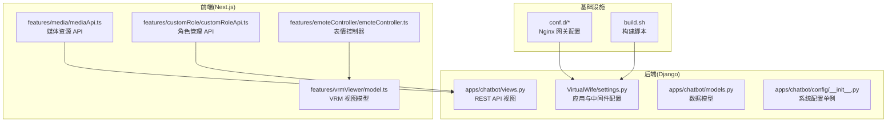
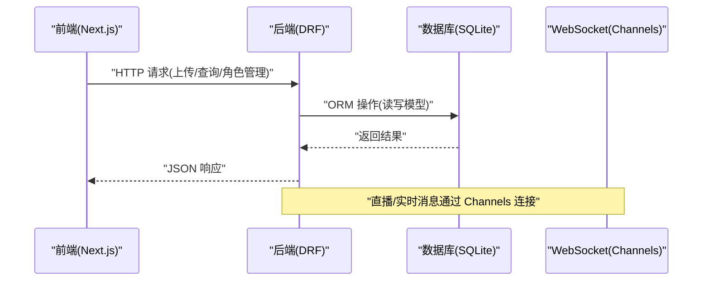
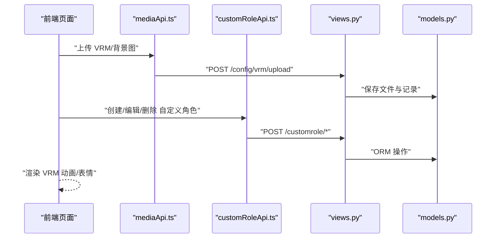
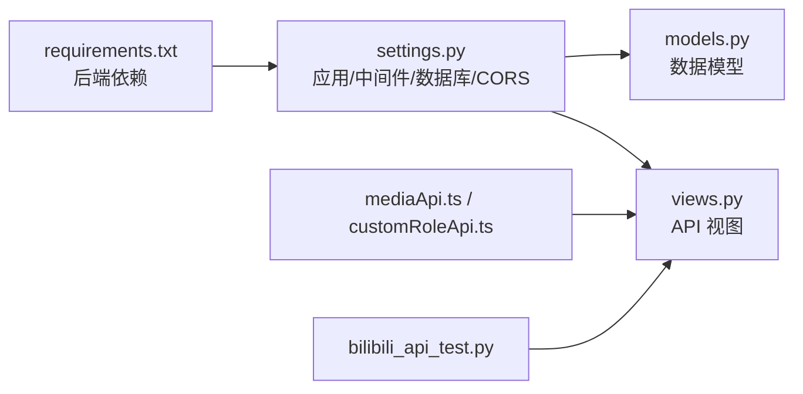

# 测试指南

<cite>
**本文引用的文件**
- [domain-chatbot/tests/bilibili_api_test.py](file://domain-chatbot/tests/bilibili_api_test.py)
- [domain-chatbot/manage.py](file://domain-chatbot/manage.py)
- [domain-chatbot/VirtualWife/settings.py](file://domain-chatbot/VirtualWife/settings.py)
- [domain-chatbot/VirtualWife/wsgi.py](file://domain-chatbot/VirtualWife/wsgi.py)
- [domain-chatbot/requirements.txt](file://domain-chatbot/requirements.txt)
- [domain-chatbot/apps/chatbot/views.py](file://domain-chatbot/apps/chatbot/views.py)
- [domain-chatbot/apps/chatbot/models.py](file://domain-chatbot/apps/chatbot/models.py)
- [domain-chatbot/apps/chatbot/config/__init__.py](file://domain-chatbot/apps/chatbot/config/__init__.py)
- [.gitignore](file://.gitignore)
- [domain-chatvrm/src/features/media/mediaApi.ts](file://domain-chatvrm/src/features/media/mediaApi.ts)
- [domain-chatvrm/src/features/customRole/customRoleApi.ts](file://domain-chatvrm/src/features/customRole/customRoleApi.ts)
- [domain-chatvrm/src/utils/wait.ts](file://domain-chatvrm/src/utils/wait.ts)
- [domain-chatvrm/src/features/emoteController/emoteController.ts](file://domain-chatvrm/src/features/emoteController/emoteController.ts)
- [domain-chatvrm/src/features/vrmViewer/model.ts](file://domain-chatvrm/src/features/vrmViewer/model.ts)
- [build.sh](file://build.sh)
</cite>

## 目录
1. [引言](#引言)
2. [项目结构](#项目结构)
3. [核心组件](#核心组件)
4. [架构总览](#架构总览)
5. [详细组件分析](#详细组件分析)
6. [依赖分析](#依赖分析)
7. [性能考虑](#性能考虑)
8. [故障排查指南](#故障排查指南)
9. [结论](#结论)
10. [附录](#附录)

## 引言
本测试指南面向开发者与测试工程师，围绕 VirtualWife 的聊天机器人后端（Django/DRF）与前端 VRM 交互界面，提供系统化的测试策略与实施方法。内容覆盖测试金字塔的三层：单元测试、集成测试、端到端测试；涵盖测试用例设计、Mock 使用、断言策略、API/数据库/外部服务测试；并给出性能测试（负载、压力、并发）方法、测试环境搭建（含测试数据库与测试数据）、持续集成与自动化测试流程建议，以及最佳实践与质量保障措施。

## 项目结构
VirtualWife 采用前后端分离架构：
- 后端：Django 应用 domain-chatbot，提供 REST API、WebSocket（Channels）、文件上传、配置管理等能力。
- 前端：Next.js 应用 domain-chatvrm，通过 HTTP API 与后端交互，控制 VRM 动画与表情。
- 基础设施：Nginx 网关 conf.d、打包与部署脚本、Dockerfile。

图表来源
- [domain-chatbot/VirtualWife/settings.py](file://domain-chatbot/VirtualWife/settings.py#L37-L50)
- [domain-chatbot/apps/chatbot/views.py](file://domain-chatbot/apps/chatbot/views.py#L20-L346)
- [domain-chatbot/apps/chatbot/models.py](file://domain-chatbot/apps/chatbot/models.py#L1-L92)
- [domain-chatbot/apps/chatbot/config/__init__.py](file://domain-chatbot/apps/chatbot/config/__init__.py#L1-L5)
- [domain-chatvrm/src/features/media/mediaApi.ts](file://domain-chatvrm/src/features/media/mediaApi.ts#L42-L121)
- [domain-chatvrm/src/features/customRole/customRoleApi.ts](file://domain-chatvrm/src/features/customRole/customRoleApi.ts#L24-L71)
- [domain-chatvrm/src/features/emoteController/emoteController.ts](file://domain-chatvrm/src/features/emoteController/emoteController.ts#L9-L27)
- [domain-chatvrm/src/features/vrmViewer/model.ts](file://domain-chatvrm/src/features/vrmViewer/model.ts#L121-L135)
- [build.sh](file://build.sh#L1-L5)

章节来源
- [domain-chatbot/VirtualWife/settings.py](file://domain-chatbot/VirtualWife/settings.py#L37-L50)
- [domain-chatbot/manage.py](file://domain-chatbot/manage.py#L7-L18)
- [domain-chatbot/requirements.txt](file://domain-chatbot/requirements.txt#L1-L33)

## 核心组件
- Django/DRF 应用：提供 REST 接口、跨域支持、日志与静态/媒体文件配置。
- Channels/ASGI：用于 WebSocket 通信（直播弹幕、实时消息队列等）。
- 数据模型：角色、系统配置、本地记忆、背景图、VRM 模型、角色安装包等。
- 前端 API 封装：媒体资源上传/查询、VRM 模型管理、自定义角色 CRUD、表情与口型同步。

章节来源
- [domain-chatbot/VirtualWife/settings.py](file://domain-chatbot/VirtualWife/settings.py#L92-L104)
- [domain-chatbot/VirtualWife/settings.py](file://domain-chatbot/VirtualWife/settings.py#L146-L152)
- [domain-chatbot/apps/chatbot/models.py](file://domain-chatbot/apps/chatbot/models.py#L16-L92)
- [domain-chatbot/apps/chatbot/views.py](file://domain-chatbot/apps/chatbot/views.py#L20-L346)
- [domain-chatvrm/src/features/media/mediaApi.ts](file://domain-chatvrm/src/features/media/mediaApi.ts#L42-L121)
- [domain-chatvrm/src/features/customRole/customRoleApi.ts](file://domain-chatvrm/src/features/customRole/customRoleApi.ts#L24-L71)

## 架构总览
后端通过 DRF 提供 REST API，前端 Next.js 通过 HTTP 请求调用后端接口；同时后端使用 Channels 提供 WebSocket 能力。测试应覆盖：
- 单元测试：视图函数、序列化器、配置加载、工具函数。
- 集成测试：API 行为、数据库事务、文件上传、外部服务（如 bilibili 直播）。
- 端到端测试：从前端发起请求到后端响应，再到 VRM 动画/表情联动。

图表来源
- [domain-chatbot/apps/chatbot/views.py](file://domain-chatbot/apps/chatbot/views.py#L20-L346)
- [domain-chatbot/VirtualWife/settings.py](file://domain-chatbot/VirtualWife/settings.py#L92-L104)
- [domain-chatbot/VirtualWife/settings.py](file://domain-chatbot/VirtualWife/settings.py#L146-L152)

## 详细组件分析

### 单元测试策略与实践
- 测试目标：验证业务逻辑正确性、边界条件、异常路径。
- 测试范围：视图函数、序列化器、配置加载、工具函数、内存/缓存行为。
- Mock 策略：对外部服务（LLM、翻译、TTS、B站直播）进行 Mock，避免真实网络调用；对文件系统进行临时目录隔离。
- 断言策略：断言响应状态码、JSON 字段、错误日志、数据库变更。
- 示例参考：现有 bilibili 测试脚本展示了如何构造凭证与事件回调，可迁移为单元测试中的 Mock 事件流。

章节来源
- [domain-chatbot/tests/bilibili_api_test.py](file://domain-chatbot/tests/bilibili_api_test.py#L1-L44)

### 集成测试策略与实践
- API 测试：使用 Django Test Client 或 pytest + requests，覆盖所有视图函数的 GET/POST 场景，包括文件上传、角色管理、配置读取/保存。
- 数据库测试：使用独立测试数据库（SQLite 内存或临时文件），确保事务回滚与数据隔离；验证 ORM 操作、序列化器校验、多对多/外键关系。
- 外部服务测试：对 LLM、翻译、TTS、B站直播等服务进行 Mock；仅在隔离环境中进行真实调用，避免污染生产数据。
- 配置与日志：验证系统配置加载/保存、日志输出级别与格式、CORS 设置。

章节来源
- [domain-chatbot/apps/chatbot/views.py](file://domain-chatbot/apps/chatbot/views.py#L20-L346)
- [domain-chatbot/apps/chatbot/models.py](file://domain-chatbot/apps/chatbot/models.py#L16-L92)
- [domain-chatbot/VirtualWife/settings.py](file://domain-chatbot/VirtualWife/settings.py#L92-L104)
- [domain-chatbot/VirtualWife/settings.py](file://domain-chatbot/VirtualWife/settings.py#L67-L69)

### 端到端测试策略与实践
- 前后端联调：从前端 API（媒体上传、VRM 列表、角色管理）到后端视图，再到数据库与文件系统，形成完整链路。
- VRM 动画联动：验证表情控制器与口型同步在前端更新时触发，结合后端返回的数据结构进行断言。
- 用户场景：模拟“上传 VRM -> 选择模型 -> 触发表情/口型 -> 查看历史记录”的完整流程。

图表来源
- [domain-chatvrm/src/features/media/mediaApi.ts](file://domain-chatvrm/src/features/media/mediaApi.ts#L64-L84)
- [domain-chatvrm/src/features/customRole/customRoleApi.ts](file://domain-chatvrm/src/features/customRole/customRoleApi.ts#L35-L57)
- [domain-chatbot/apps/chatbot/views.py](file://domain-chatbot/apps/chatbot/views.py#L188-L303)
- [domain-chatbot/apps/chatbot/models.py](file://domain-chatbot/apps/chatbot/models.py#L72-L92)

### 性能测试方法
- 负载测试：使用 Locust 或 k6，模拟多用户并发访问聊天、上传、角色管理等接口，观察响应时间与错误率。
- 压力测试：逐步提升并发数，定位瓶颈（CPU/IO/数据库锁/外部服务超时）。
- 并发测试：重点测试 Channels 的消息广播、直播弹幕事件处理、文件上传并发写入。
- 前端动画：测量 VRM 动画更新频率与帧率，评估 LipSync 与表情同步的性能开销。

章节来源
- [domain-chatbot/VirtualWife/settings.py](file://domain-chatbot/VirtualWife/settings.py#L146-L152)
- [domain-chatvrm/src/features/emoteController/emoteController.ts](file://domain-chatvrm/src/features/emoteController/emoteController.ts#L16-L26)
- [domain-chatvrm/src/features/vrmViewer/model.ts](file://domain-chatvrm/src/features/vrmViewer/model.ts#L125-L134)

### 测试环境搭建
- Python 环境：安装 requirements.txt 中的依赖，确保 Django、DRF、Channels、sqlite3、pytest、coverage 等工具可用。
- 数据库：使用 SQLite（开发默认），测试阶段可使用独立数据库文件或内存数据库；迁移脚本由 Django 管理。
- 媒体文件：设置 MEDIA_ROOT 与 MEDIA_URL，确保上传目录存在且可写。
- 外部服务：为 LLM、翻译、TTS、B站直播等服务准备 Mock 环境变量；必要时使用测试账号与沙盒环境。
- 前端环境：安装 Node.js 与包管理器，运行 Next.js 开发服务器，连接后端 API。

章节来源
- [domain-chatbot/requirements.txt](file://domain-chatbot/requirements.txt#L1-L33)
- [domain-chatbot/VirtualWife/settings.py](file://domain-chatbot/VirtualWife/settings.py#L92-L104)
- [domain-chatbot/VirtualWife/settings.py](file://domain-chatbot/VirtualWife/settings.py#L102-L103)
- [domain-chatbot/manage.py](file://domain-chatbot/manage.py#L7-L18)

### 持续集成与自动化测试
- 测试脚本：使用 pytest 或 Django 的 test 命令，配合覆盖率工具生成报告。
- CI 流水线：在构建镜像前运行单元/集成测试；通过 Docker Compose 启动最小化测试环境（数据库、外部服务 Mock）。
- 测试报告：生成 XML 报告与 HTML 覆盖率报告，供 CI 平台解析。
- 结果分析：基于阈值（行/分支覆盖率）与失败用例进行回归分析。

章节来源
- [build.sh](file://build.sh#L1-L5)
- [.gitignore](file://.gitignore#L123-L137)

### 最佳实践与质量保证
- 测试金字塔：优先编写单元测试，补充必要的集成测试，再进行端到端测试。
- Mock 与假数据：对外部依赖进行 Mock，使用小而明确的假数据集。
- 断言策略：关注业务语义而非实现细节；对异常路径与边界条件进行充分断言。
- 日志与可观测性：在测试中验证关键日志输出，便于问题定位。
- 安全与合规：测试中避免使用真实敏感数据；对外部服务调用进行限流与超时控制。

## 依赖分析
- 后端依赖：Django、DRF、Channels、sqlite3、pytest、coverage、bilibili-api-python、openai、litellm 等。
- 前端依赖：Three.js、@pixiv/three-vrm、Next.js、TypeScript。
- 基础设施：Nginx 网关、Docker 构建脚本。

图表来源
- [domain-chatbot/requirements.txt](file://domain-chatbot/requirements.txt#L1-L33)
- [domain-chatbot/VirtualWife/settings.py](file://domain-chatbot/VirtualWife/settings.py#L37-L50)
- [domain-chatbot/apps/chatbot/views.py](file://domain-chatbot/apps/chatbot/views.py#L20-L346)
- [domain-chatbot/apps/chatbot/models.py](file://domain-chatbot/apps/chatbot/models.py#L16-L92)
- [domain-chatbot/tests/bilibili_api_test.py](file://domain-chatbot/tests/bilibili_api_test.py#L1-L44)
- [domain-chatvrm/src/features/media/mediaApi.ts](file://domain-chatvrm/src/features/media/mediaApi.ts#L42-L121)
- [domain-chatvrm/src/features/customRole/customRoleApi.ts](file://domain-chatvrm/src/features/customRole/customRoleApi.ts#L24-L71)

章节来源
- [domain-chatbot/requirements.txt](file://domain-chatbot/requirements.txt#L1-L33)
- [domain-chatbot/VirtualWife/settings.py](file://domain-chatbot/VirtualWife/settings.py#L37-L50)

## 性能考虑
- 数据库：避免 N+1 查询，批量操作与索引优化；测试中使用小型数据集验证性能。
- 文件上传：限制文件大小与类型，使用异步处理与进度反馈。
- WebSocket：合理设置 Channel 层与消息队列，避免阻塞主线程。
- 外部服务：为 LLM/TTS/翻译设置超时与重试，防止雪崩效应。

## 故障排查指南
- 单元测试失败：检查 Mock 是否覆盖全部分支，确认假数据是否满足模型约束。
- 集成测试失败：核对数据库迁移、CORS 配置、日志级别；使用独立测试数据库。
- 端到端失败：从前端 API 请求开始逐层验证，确认后端响应与前端渲染一致。
- 性能问题：使用性能分析工具定位热点函数，优化数据库查询与外部服务调用。

章节来源
- [domain-chatbot/VirtualWife/settings.py](file://domain-chatbot/VirtualWife/settings.py#L154-L207)
- [domain-chatbot/apps/chatbot/views.py](file://domain-chatbot/apps/chatbot/views.py#L20-L346)

## 结论
通过分层测试策略与完善的测试环境配置，VirtualWife 可在快速迭代的同时保持高质量与稳定性。建议在 CI 中强制执行单元/集成测试与覆盖率门槛，并结合端到端测试与性能测试，确保前后端协同与外部服务依赖的可靠性。

## 附录
- 测试用例设计清单
  - 视图函数：正常路径、缺失参数、非法输入、权限校验、异常捕获。
  - 序列化器：字段校验、反序列化、错误信息。
  - 数据库：新增/更新/删除、关联关系、事务一致性。
  - 文件上传：类型校验、大小限制、路径与命名规则。
  - 外部服务：Mock 成功/失败/超时/限流。
  - WebSocket：连接建立、消息广播、断线重连。
  - 前端联动：表情播放、口型同步、资源加载与错误提示。