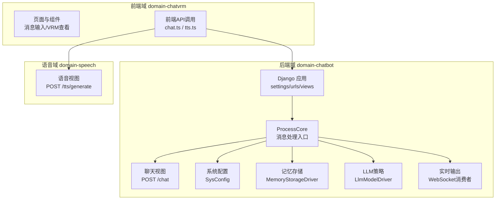
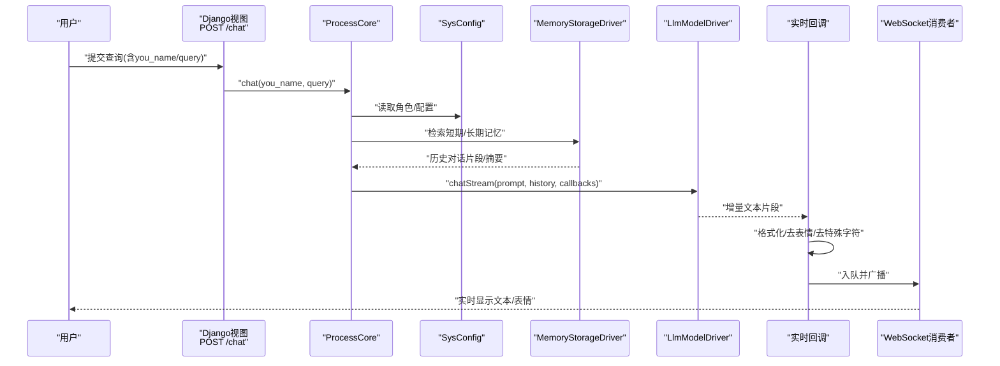
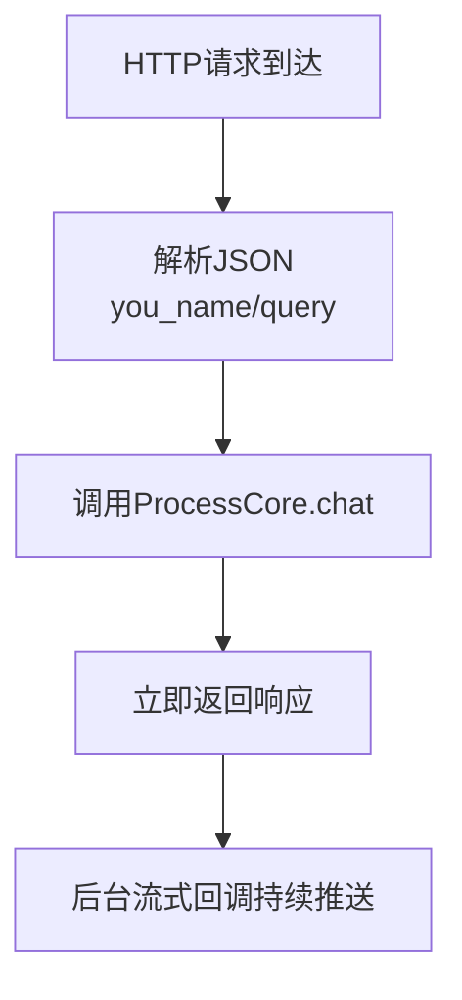
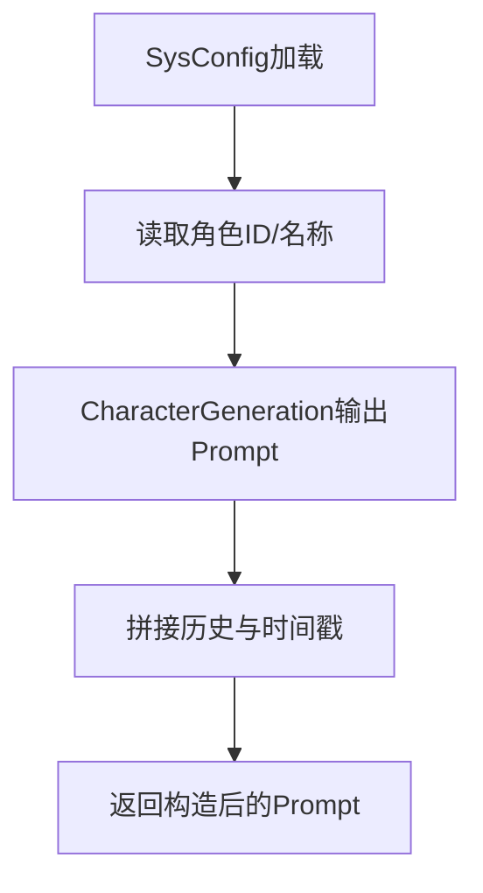
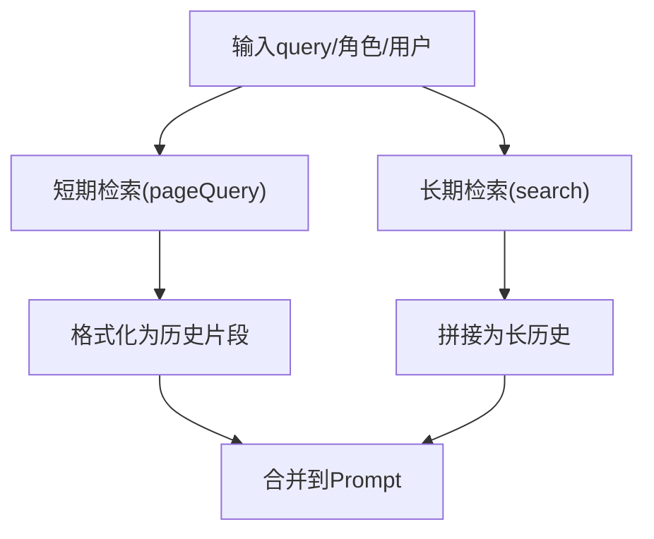
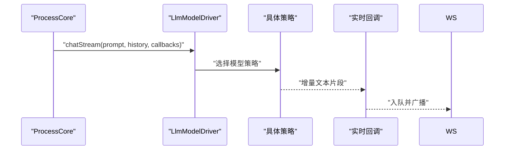
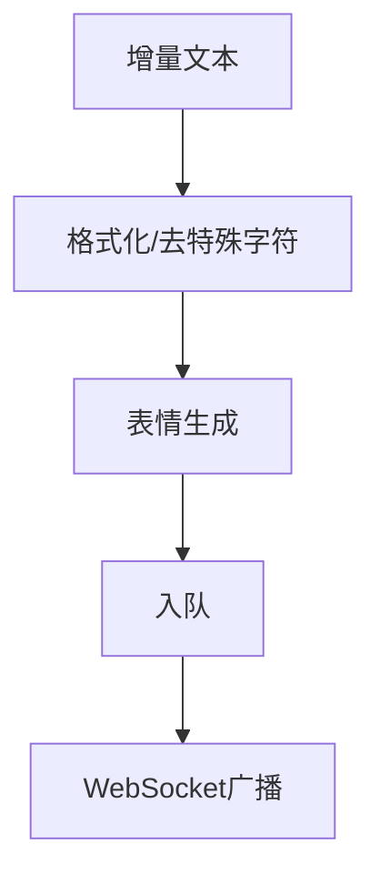
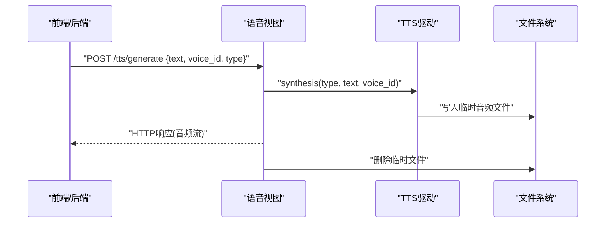
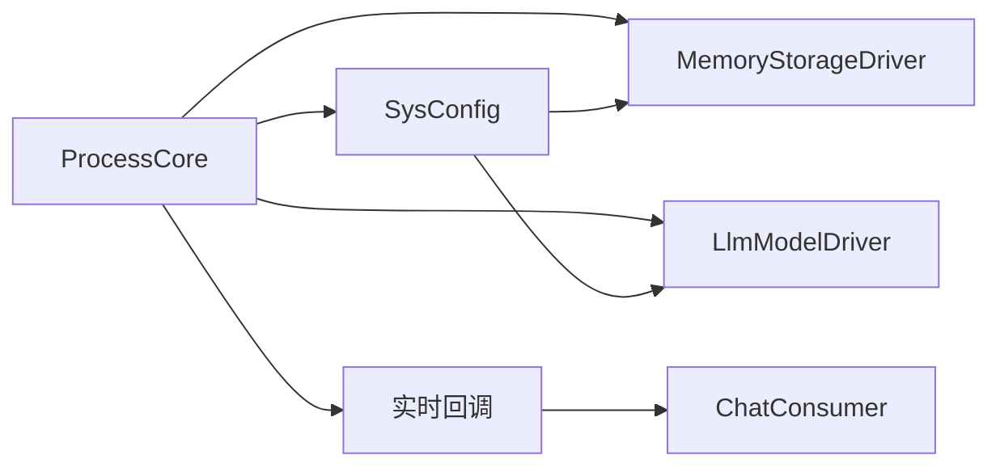

# 数据流分析

<cite>
**本文引用的文件**
- [settings.py](file://domain-chatbot/VirtualWife/settings.py)
- [urls.py](file://domain-chatbot/apps/chatbot/urls.py)
- [views.py](file://domain-chatbot/apps/chatbot/views.py)
- [process.py](file://domain-chatbot/apps/chatbot/process/process.py)
- [character_generation.py](file://domain-chatbot/apps/chatbot/character/character_generation.py)
- [sys_config.py](file://domain-chatbot/apps/chatbot/config/sys_config.py)
- [memory_storage.py](file://domain-chatbot/apps/chatbot/memory/memory_storage.py)
- [llm_model_strategy.py](file://domain-chatbot/apps/chatbot/llms/llm_model_strategy.py)
- [realtime_message_queue.py](file://domain-chatbot/apps/chatbot/output/realtime_message_queue.py)
- [consumers.py](file://domain-chatbot/apps/chatbot/output/consumers.py)
- [chat_message_utils.py](file://domain-chatbot/apps/chatbot/utils/chat_message_utils.py)
- [speech_views.py](file://domain-chatbot/apps/speech/views.py)
- [speech_urls.py](file://domain-chatbot/apps/speech/urls.py)
</cite>

## 目录
1. [简介](#简介)
2. [项目结构](#项目结构)
3. [核心组件](#核心组件)
4. [架构总览](#架构总览)
5. [详细组件分析](#详细组件分析)
6. [依赖关系分析](#依赖关系分析)
7. [性能考量](#性能考量)
8. [故障排查指南](#故障排查指南)
9. [结论](#结论)
10. [附录](#附录)

## 简介
本文件针对 VirtualWife 系统进行端到端的数据流分析，覆盖从用户输入到最终实时输出的完整路径，包括消息预处理、角色识别与 Prompt 构造、短期/长期记忆检索、LLM 推理、情感与表情生成、实时消息分发以及语音合成等环节。文档同时说明数据格式转换链路、缓存与一致性保障机制，并提供数据流图与时序图，帮助开发者快速理解系统处理逻辑与性能特征。

## 项目结构
VirtualWife 采用前后端分离与多子域架构：
- 前端域 domain-chatvrm：负责 VRM 观察、消息展示、TTS/翻译等前端交互。
- 后端域 domain-chatbot：负责聊天、角色、记忆、LLM、输出通道、语音合成等。
- 网关与部署：通过 Nginx/Conf 配置与 Docker 编排，统一接入。

图表来源
- [settings.py](file://domain-chatbot/VirtualWife/settings.py#L146-L152)
- [urls.py](file://domain-chatbot/apps/chatbot/urls.py#L5-L25)
- [views.py](file://domain-chatbot/apps/chatbot/views.py#L20-L31)
- [process.py](file://domain-chatbot/apps/chatbot/process/process.py#L33-L70)
- [sys_config.py](file://domain-chatbot/apps/chatbot/config/sys_config.py#L32-L51)
- [memory_storage.py](file://domain-chatbot/apps/chatbot/memory/memory_storage.py#L14-L25)
- [llm_model_strategy.py](file://domain-chatbot/apps/chatbot/llms/llm_model_strategy.py#L107-L149)
- [consumers.py](file://domain-chatbot/apps/chatbot/output/consumers.py#L10-L37)
- [speech_views.py](file://domain-chatbot/apps/speech/views.py#L16-L47)

章节来源
- [settings.py](file://domain-chatbot/VirtualWife/settings.py#L146-L152)
- [urls.py](file://domain-chatbot/apps/chatbot/urls.py#L5-L25)

## 核心组件
- ProcessCore：消息处理入口，负责角色模板解析、记忆检索、LLM 流式推理、实时回调与异常兜底。
- SysConfig：系统配置加载与懒加载，包含 LLM 驱动、记忆驱动、角色与代理配置。
- MemoryStorageDriver：短期本地记忆与长期 Milvus 记忆的统一接口，支持检索与保存。
- LlmModelDriver/LlmModelStrategy：LLM 抽象与多厂商策略（OpenAI/Ollama/Zhipu），支持同步与异步流式。
- RealtimeMessageQueue：实时消息队列与 WebSocket 分发，负责消息格式化、表情生成与发送。
- ChatConsumer：WebSocket 消费者，将消息广播至前端。
- Speech Views：语音合成接口，接收文本与声线类型，返回音频流。

章节来源
- [process.py](file://domain-chatbot/apps/chatbot/process/process.py#L19-L77)
- [sys_config.py](file://domain-chatbot/apps/chatbot/config/sys_config.py#L32-L51)
- [memory_storage.py](file://domain-chatbot/apps/chatbot/memory/memory_storage.py#L14-L25)
- [llm_model_strategy.py](file://domain-chatbot/apps/chatbot/llms/llm_model_strategy.py#L107-L149)
- [realtime_message_queue.py](file://domain-chatbot/apps/chatbot/output/realtime_message_queue.py#L21-L95)
- [consumers.py](file://domain-chatbot/apps/chatbot/output/consumers.py#L10-L37)
- [speech_views.py](file://domain-chatbot/apps/speech/views.py#L16-L47)

## 架构总览
系统采用“请求-处理-流式输出”的异步架构：
- 请求入口：Django REST API 接收用户输入。
- 处理流程：ProcessCore 组装 Prompt，检索短期/长期记忆，触发 LLM 流式推理。
- 输出通道：实时回调将片段化文本经格式化与表情生成后入队，WebSocket 广播至前端。
- 语音合成：前端或后端可调用语音域接口生成音频。

图表来源
- [views.py](file://domain-chatbot/apps/chatbot/views.py#L20-L31)
- [process.py](file://domain-chatbot/apps/chatbot/process/process.py#L33-L70)
- [memory_storage.py](file://domain-chatbot/apps/chatbot/memory/memory_storage.py#L26-L54)
- [llm_model_strategy.py](file://domain-chatbot/apps/chatbot/llms/llm_model_strategy.py#L122-L138)
- [realtime_message_queue.py](file://domain-chatbot/apps/chatbot/output/realtime_message_queue.py#L70-L95)
- [consumers.py](file://domain-chatbot/apps/chatbot/output/consumers.py#L33-L37)

## 详细组件分析

### 1) 输入接收与路由
- 路由：/chat 对应 chat 视图函数。
- 视图：解析请求体中的 query 与 you_name，调用 ProcessCore.chat。
- 异步：视图返回即时响应，实际推理通过流式回调异步推送。

图表来源
- [urls.py](file://domain-chatbot/apps/chatbot/urls.py#L5-L6)
- [views.py](file://domain-chatbot/apps/chatbot/views.py#L20-L31)

章节来源
- [urls.py](file://domain-chatbot/apps/chatbot/urls.py#L5-L6)
- [views.py](file://domain-chatbot/apps/chatbot/views.py#L20-L31)

### 2) 角色识别与 Prompt 构造
- 角色来源：SysConfig 读取当前角色配置；若存在角色包则动态注入对话示例。
- Prompt 生成：CharacterGeneration 使用模板格式化角色信息，结合时间戳与历史构造最终提示词。

图表来源
- [sys_config.py](file://domain-chatbot/apps/chatbot/config/sys_config.py#L110-L121)
- [character_generation.py](file://domain-chatbot/apps/chatbot/character/character_generation.py#L19-L41)
- [process.py](file://domain-chatbot/apps/chatbot/process/process.py#L36-L60)

章节来源
- [sys_config.py](file://domain-chatbot/apps/chatbot/config/sys_config.py#L110-L121)
- [character_generation.py](file://domain-chatbot/apps/chatbot/character/character_generation.py#L19-L41)
- [process.py](file://domain-chatbot/apps/chatbot/process/process.py#L36-L60)

### 3) 记忆检索与格式化
- 短期记忆：Local 存储按页查询最近若干条，解析为结构化字典列表。
- 长期记忆：Milvus 检索相似语义，拼接为长历史字符串。
- 保存：短期以键值对形式写入；长期可选摘要与重要性评分后写入。

图表来源
- [memory_storage.py](file://domain-chatbot/apps/chatbot/memory/memory_storage.py#L26-L54)
- [process.py](file://domain-chatbot/apps/chatbot/process/process.py#L52-L56)

章节来源
- [memory_storage.py](file://domain-chatbot/apps/chatbot/memory/memory_storage.py#L26-L54)
- [process.py](file://domain-chatbot/apps/chatbot/process/process.py#L52-L56)

### 4) LLM 推理与流式输出
- 策略选择：LlmModelDriver 根据配置选择 OpenAI/Ollama/Zhipu。
- 流式回调：chatStream 将增量文本通过 realtime_callback 传入，逐段推送。
- 异常兜底：ProcessCore 捕获异常，发送错误提示并结束会话。

图表来源
- [llm_model_strategy.py](file://domain-chatbot/apps/chatbot/llms/llm_model_strategy.py#L122-L138)
- [process.py](file://domain-chatbot/apps/chatbot/process/process.py#L62-L70)

章节来源
- [llm_model_strategy.py](file://domain-chatbot/apps/chatbot/llms/llm_model_strategy.py#L122-L138)
- [process.py](file://domain-chatbot/apps/chatbot/process/process.py#L62-L70)

### 5) 实时消息格式化与表情生成
- 文本清洗：去除特殊标记、角色前缀、表情符号与多余符号，确保语音合成稳定。
- 表情生成：基于文本内容调用 LLM 生成表情标签，随消息一并下发。
- 队列与广播：SimpleQueue 线程安全入队，后台线程统一通过 ChannelLayer 广播。

图表来源
- [realtime_message_queue.py](file://domain-chatbot/apps/chatbot/output/realtime_message_queue.py#L70-L95)
- [chat_message_utils.py](file://domain-chatbot/apps/chatbot/utils/chat_message_utils.py#L4-L22)
- [consumers.py](file://domain-chatbot/apps/chatbot/output/consumers.py#L33-L37)

章节来源
- [realtime_message_queue.py](file://domain-chatbot/apps/chatbot/output/realtime_message_queue.py#L70-L95)
- [chat_message_utils.py](file://domain-chatbot/apps/chatbot/utils/chat_message_utils.py#L4-L22)
- [consumers.py](file://domain-chatbot/apps/chatbot/output/consumers.py#L33-L37)

### 6) 语音合成与输出
- 接口：/tts/generate 接收 text、voice_id、type，调用单例 TTS 驱动生成音频文件。
- 返回：将音频文件读入内存，封装为 HTTP 响应并返回二进制流。
- 清理：生成后删除临时文件，避免磁盘占用。

图表来源
- [speech_views.py](file://domain-chatbot/apps/speech/views.py#L16-L47)
- [speech_urls.py](file://domain-chatbot/apps/speech/urls.py#L4-L7)

章节来源
- [speech_views.py](file://domain-chatbot/apps/speech/views.py#L16-L47)
- [speech_urls.py](file://domain-chatbot/apps/speech/urls.py#L4-L7)

## 依赖关系分析
- ProcessCore 依赖 SysConfig（角色/配置）、MemoryStorageDriver（记忆）、LlmModelDriver（推理）、实时回调与 WebSocket 消费者。
- SysConfig 懒加载 MemoryStorageDriver 与 LlmModelDriver，降低启动成本。
- RealtimeMessageQueue 依赖 ChannelLayer 进行组播，依赖工具函数进行文本清洗与表情生成。
- LlmModelStrategy 为抽象层，具体实现解耦不同 LLM 提供商。

图表来源
- [process.py](file://domain-chatbot/apps/chatbot/process/process.py#L19-L32)
- [sys_config.py](file://domain-chatbot/apps/chatbot/config/sys_config.py#L32-L51)
- [realtime_message_queue.py](file://domain-chatbot/apps/chatbot/output/realtime_message_queue.py#L10-L18)
- [consumers.py](file://domain-chatbot/apps/chatbot/output/consumers.py#L10-L18)

章节来源
- [process.py](file://domain-chatbot/apps/chatbot/process/process.py#L19-L32)
- [sys_config.py](file://domain-chatbot/apps/chatbot/config/sys_config.py#L32-L51)
- [realtime_message_queue.py](file://domain-chatbot/apps/chatbot/output/realtime_message_queue.py#L10-L18)
- [consumers.py](file://domain-chatbot/apps/chatbot/output/consumers.py#L10-L18)

## 性能考量
- 异步流式：LLM 推理采用流式回调，前端可边接收边渲染，显著降低首帧延迟。
- 线程与锁：LlmModelDriver 使用线程锁保护 chatStream 并发，避免竞争条件。
- 缓存与懒加载：SysConfig 懒加载记忆与 LLM 驱动，减少初始化开销。
- 记忆检索：短期本地存储命中快，长期 Milvus 检索受向量索引与网络影响，建议合理控制检索规模。
- 文本清洗：实时回调阶段进行去噪与表情生成，降低下游语音合成失败概率，提升稳定性。

章节来源
- [llm_model_strategy.py](file://domain-chatbot/apps/chatbot/llms/llm_model_strategy.py#L113-L114)
- [sys_config.py](file://domain-chatbot/apps/chatbot/config/sys_config.py#L185-L191)
- [realtime_message_queue.py](file://domain-chatbot/apps/chatbot/output/realtime_message_queue.py#L70-L95)

## 故障排查指南
- LLM 推理异常：ProcessCore 捕获异常并发送兜底消息，检查 OPENAI_API_KEY、代理配置与模型可用性。
- 记忆检索失败：确认 Milvus 连接参数与数据库权限，关注日志中的错误堆栈。
- 实时消息未达前端：检查 ChannelLayer 配置与 WebSocket 消费者是否加入组，确认后台线程已启动。
- 语音合成失败：检查 TTS 驱动可用性与临时文件权限，确认生成后清理流程正常执行。

章节来源
- [process.py](file://domain-chatbot/apps/chatbot/process/process.py#L71-L77)
- [settings.py](file://domain-chatbot/VirtualWife/settings.py#L148-L152)
- [realtime_message_queue.py](file://domain-chatbot/apps/chatbot/output/realtime_message_queue.py#L100-L106)
- [speech_views.py](file://domain-chatbot/apps/speech/views.py#L45-L47)

## 结论
VirtualWife 的数据流以“异步流式”为核心设计，从前端输入到实时输出形成闭环。通过角色模板、记忆检索与 LLM 策略的解耦，系统具备良好的扩展性与可维护性。建议在生产环境中进一步优化记忆检索的并发与缓存策略，并完善异常监控与告警，以保障端到端的稳定性与性能。

## 附录
- 关键路径参考
  - 输入路由：[urls.py](file://domain-chatbot/apps/chatbot/urls.py#L5-L6)
  - 请求处理：[views.py](file://domain-chatbot/apps/chatbot/views.py#L20-L31)
  - 处理主流程：[process.py](file://domain-chatbot/apps/chatbot/process/process.py#L33-L70)
  - 角色模板：[character_generation.py](file://domain-chatbot/apps/chatbot/character/character_generation.py#L37-L41)
  - 配置加载：[sys_config.py](file://domain-chatbot/apps/chatbot/config/sys_config.py#L83-L192)
  - 记忆检索/保存：[memory_storage.py](file://domain-chatbot/apps/chatbot/memory/memory_storage.py#L26-L82)
  - LLM 策略与驱动：[llm_model_strategy.py](file://domain-chatbot/apps/chatbot/llms/llm_model_strategy.py#L107-L149)
  - 实时消息与广播：[realtime_message_queue.py](file://domain-chatbot/apps/chatbot/output/realtime_message_queue.py#L54-L95), [consumers.py](file://domain-chatbot/apps/chatbot/output/consumers.py#L10-L37)
  - 语音合成：[speech_views.py](file://domain-chatbot/apps/speech/views.py#L16-L47)