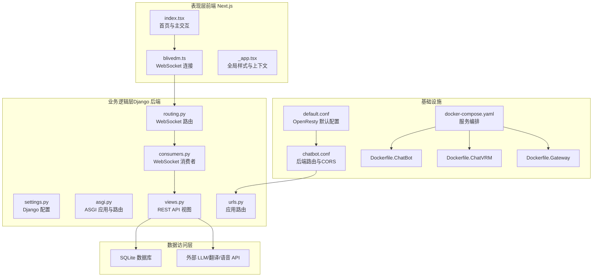
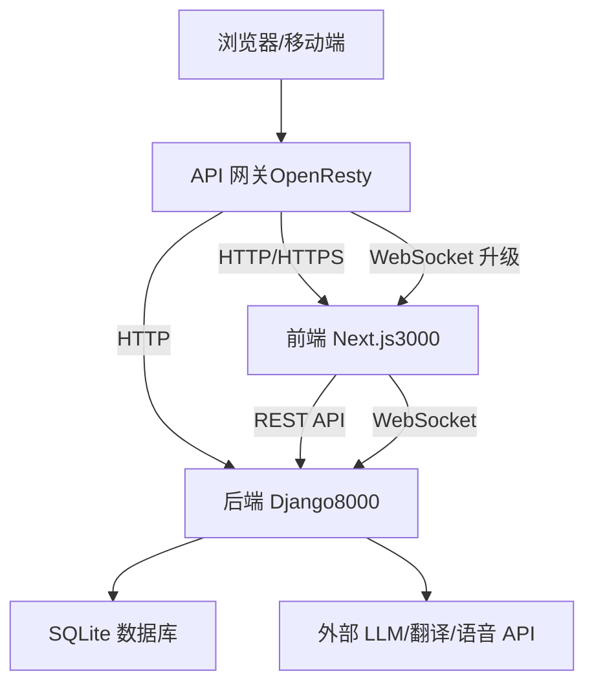
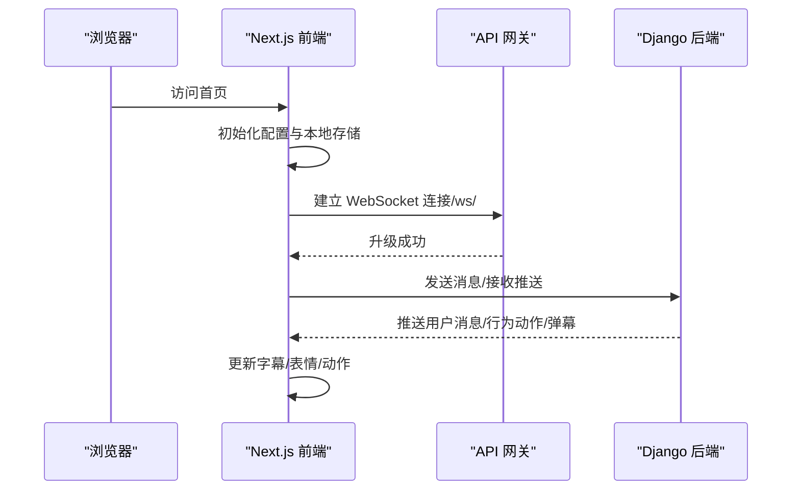
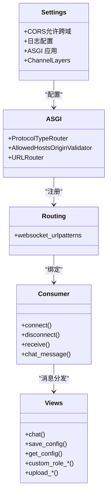
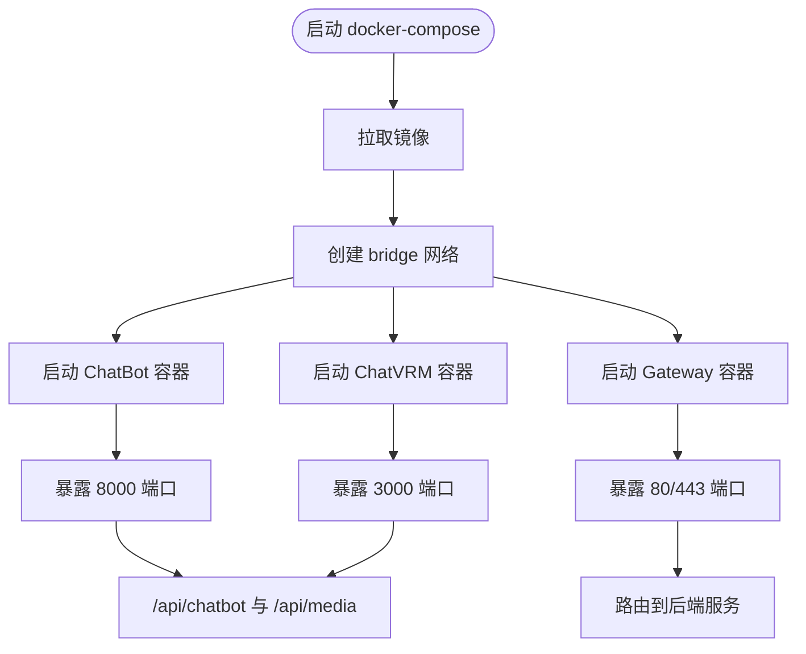
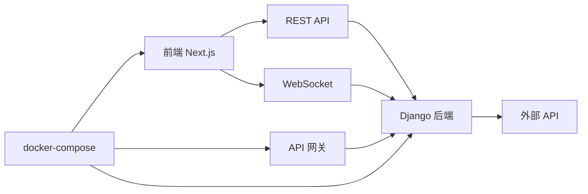

# 整体架构设计

<cite>
**本文档引用的文件**
- [settings.py](file://domain-chatbot/VirtualWife/settings.py)
- [urls.py](file://domain-chatbot/VirtualWife/urls.py)
- [asgi.py](file://domain-chatbot/VirtualWife/asgi.py)
- [views.py](file://domain-chatbot/apps/chatbot/views.py)
- [urls.py](file://domain-chatbot/apps/chatbot/urls.py)
- [urls.py](file://domain-chatbot/apps/speech/urls.py)
- [package.json](file://domain-chatvrm/package.json)
- [next.config.js](file://domain-chatvrm/next.config.js)
- [index.tsx](file://domain-chatvrm/src/pages/index.tsx)
- [_app.tsx](file://domain-chatvrm/src/pages/_app.tsx)
- [blivedm.ts](file://domain-chatvrm/src/features/blivedm/blivedm.ts)
- [routing.py](file://domain-chatbot/apps/chatbot/output/routing.py)
- [consumers.py](file://domain-chatbot/apps/chatbot/output/consumers.py)
- [Dockerfile.ChatBot](file://infrastructure-packaging/Dockerfile.ChatBot)
- [Dockerfile.ChatVRM](file://infrastructure-packaging/Dockerfile.ChatVRM)
- [Dockerfile.Gateway](file://infrastructure-packaging/Dockerfile.Gateway)
- [default.conf](file://infrastructure-gateway/conf.d/default.conf)
- [chatbot.conf](file://infrastructure-gateway/conf.d/server/chatbot.conf)
- [docker-compose.yaml](file://installer/docker-compose.yaml)
</cite>

## 目录
1. [引言](#引言)
2. [项目结构](#项目结构)
3. [核心组件](#核心组件)
4. [架构总览](#架构总览)
5. [详细组件分析](#详细组件分析)
6. [依赖关系分析](#依赖关系分析)
7. [性能考虑](#性能考虑)
8. [故障排除指南](#故障排除指南)
9. [结论](#结论)

## 引言
本架构设计文档面向VirtualWife项目的整体微服务架构，重点阐述前后端分离的设计理念、Django+Next.js技术栈的选择原因、以及基于Docker的容器化部署思路。系统采用三层架构：表现层（前端Next.js）、业务逻辑层（Django后端）、数据访问层（数据库与外部API），并通过WebSocket实现前端与后端的实时通信，通过API网关统一接入与路由。本文档还明确系统边界、外部依赖与集成点，帮助读者快速理解并高效运维该系统。

## 项目结构
VirtualWife项目由三个主要子域构成：
- domain-chatbot：基于Django的后端服务，提供聊天、记忆管理、语音合成、翻译等能力，并通过ASGI支持WebSocket。
- domain-chatvrm：基于Next.js的前端应用，负责VRM模型展示、实时对话、弹幕互动与语音合成播放。
- infrastructure-*：基础设施层，包含网关配置、打包镜像与编排脚本，支撑容器化部署与流量治理。

图表来源
- [index.tsx](file://domain-chatvrm/src/pages/index.tsx#L1-L390)
- [blivedm.ts](file://domain-chatvrm/src/features/blivedm/blivedm.ts#L1-L31)
- [_app.tsx](file://domain-chatvrm/src/pages/_app.tsx#L1-L8)
- [settings.py](file://domain-chatbot/VirtualWife/settings.py#L1-L208)
- [asgi.py](file://domain-chatbot/VirtualWife/asgi.py#L1-L42)
- [routing.py](file://domain-chatbot/apps/chatbot/output/routing.py#L1-L8)
- [consumers.py](file://domain-chatbot/apps/chatbot/output/consumers.py#L1-L37)
- [views.py](file://domain-chatbot/apps/chatbot/views.py#L1-L346)
- [urls.py](file://domain-chatbot/apps/chatbot/urls.py#L1-L26)
- [default.conf](file://infrastructure-gateway/conf.d/default.conf#L1-L56)
- [chatbot.conf](file://infrastructure-gateway/conf.d/server/chatbot.conf#L1-L21)
- [docker-compose.yaml](file://installer/docker-compose.yaml#L1-L44)

章节来源
- [settings.py](file://domain-chatbot/VirtualWife/settings.py#L1-L208)
- [urls.py](file://domain-chatbot/VirtualWife/urls.py#L1-L44)
- [asgi.py](file://domain-chatbot/VirtualWife/asgi.py#L1-L42)
- [views.py](file://domain-chatbot/apps/chatbot/views.py#L1-L346)
- [urls.py](file://domain-chatbot/apps/chatbot/urls.py#L1-L26)
- [urls.py](file://domain-chatbot/apps/speech/urls.py#L1-L9)
- [package.json](file://domain-chatvrm/package.json#L1-L51)
- [next.config.js](file://domain-chatvrm/next.config.js#L1-L13)
- [index.tsx](file://domain-chatvrm/src/pages/index.tsx#L1-L390)
- [_app.tsx](file://domain-chatvrm/src/pages/_app.tsx#L1-L8)
- [blivedm.ts](file://domain-chatvrm/src/features/blivedm/blivedm.ts#L1-L31)
- [routing.py](file://domain-chatbot/apps/chatbot/output/routing.py#L1-L8)
- [consumers.py](file://domain-chatbot/apps/chatbot/output/consumers.py#L1-L37)
- [Dockerfile.ChatBot](file://infrastructure-packaging/Dockerfile.ChatBot#L1-L31)
- [Dockerfile.ChatVRM](file://infrastructure-packaging/Dockerfile.ChatVRM#L1-L29)
- [Dockerfile.Gateway](file://infrastructure-packaging/Dockerfile.Gateway#L1-L4)
- [default.conf](file://infrastructure-gateway/conf.d/default.conf#L1-L56)
- [chatbot.conf](file://infrastructure-gateway/conf.d/server/chatbot.conf#L1-L21)
- [docker-compose.yaml](file://installer/docker-compose.yaml#L1-L44)

## 核心组件
- 表现层（前端Next.js）
  - 主页面负责VRM模型渲染、消息输入、字幕显示与行为动作联动。
  - 通过WebSocket与后端建立实时通信，接收用户消息、行为动作与弹幕等事件。
  - 使用Next.js 13.2.4与TypeScript构建，具备良好的类型安全与开发体验。
- 业务逻辑层（Django后端）
  - 提供REST API与WebSocket服务，支持聊天、角色管理、配置管理、媒体资源上传等。
  - 通过ASGI协议启用Channels，实现WebSocket连接与消息分发。
  - 集成Swagger文档，便于接口调试与联调。
- 数据访问层
  - 默认使用SQLite作为本地数据库，满足开发与演示场景。
  - 支持外部LLM、翻译与语音API，通过策略模式与配置管理解耦。
- API网关（OpenResty/Nginx）
  - 统一入口，负责反向代理、CORS、缓存与WebSocket升级。
  - 将/api/chatbot与/api/media路由至后端服务，同时透传升级头部以支持WebSocket。
- 容器化与编排
  - 分别构建ChatBot、ChatVRM与Gateway三类镜像，通过docker-compose编排运行。
  - 服务间通过自定义bridge网络互通，端口映射可按需调整。

章节来源
- [index.tsx](file://domain-chatvrm/src/pages/index.tsx#L1-L390)
- [blivedm.ts](file://domain-chatvrm/src/features/blivedm/blivedm.ts#L1-L31)
- [package.json](file://domain-chatvrm/package.json#L1-L51)
- [next.config.js](file://domain-chatvrm/next.config.js#L1-L13)
- [settings.py](file://domain-chatbot/VirtualWife/settings.py#L1-L208)
- [asgi.py](file://domain-chatbot/VirtualWife/asgi.py#L1-L42)
- [views.py](file://domain-chatbot/apps/chatbot/views.py#L1-L346)
- [urls.py](file://domain-chatbot/apps/chatbot/urls.py#L1-L26)
- [default.conf](file://infrastructure-gateway/conf.d/default.conf#L1-L56)
- [chatbot.conf](file://infrastructure-gateway/conf.d/server/chatbot.conf#L1-L21)
- [docker-compose.yaml](file://installer/docker-compose.yaml#L1-L44)

## 架构总览
系统采用“前端独立、后端聚合”的微服务架构。前端Next.js通过WebSocket与后端Django建立长连接，后端通过Channels将消息推送给前端；REST API用于配置、资源与管理操作；网关负责统一入口与协议升级；容器化确保跨平台一致性与可扩展性。

图表来源
- [default.conf](file://infrastructure-gateway/conf.d/default.conf#L1-L56)
- [chatbot.conf](file://infrastructure-gateway/conf.d/server/chatbot.conf#L1-L21)
- [docker-compose.yaml](file://installer/docker-compose.yaml#L1-L44)
- [index.tsx](file://domain-chatvrm/src/pages/index.tsx#L1-L390)
- [blivedm.ts](file://domain-chatvrm/src/features/blivedm/blivedm.ts#L1-L31)
- [asgi.py](file://domain-chatbot/VirtualWife/asgi.py#L1-L42)

## 详细组件分析

### 前端组件分析（Next.js）
- 页面与交互
  - 首页负责VRM模型展示、消息输入、字幕滚动与表情/动作联动。
  - 通过本地存储持久化参数，提升用户体验。
- WebSocket集成
  - 根据环境动态拼接WebSocket地址，开发环境指向后端端口，生产环境走/api/chatbot路径。
  - 断线重连机制保障实时性。
- 技术栈
  - Next.js 13.2.4 + TypeScript，TailwindCSS + Three.js + @pixiv/three-vrm，具备良好的模块化与生态支持。

图表来源
- [index.tsx](file://domain-chatvrm/src/pages/index.tsx#L296-L337)
- [blivedm.ts](file://domain-chatvrm/src/features/blivedm/blivedm.ts#L1-L31)
- [chatbot.conf](file://infrastructure-gateway/conf.d/server/chatbot.conf#L1-L21)

章节来源
- [index.tsx](file://domain-chatvrm/src/pages/index.tsx#L1-L390)
- [_app.tsx](file://domain-chatvrm/src/pages/_app.tsx#L1-L8)
- [blivedm.ts](file://domain-chatvrm/src/features/blivedm/blivedm.ts#L1-L31)
- [package.json](file://domain-chatvrm/package.json#L1-L51)
- [next.config.js](file://domain-chatvrm/next.config.js#L1-L13)

### 后端组件分析（Django）
- 配置与中间件
  - 开启CORS允许跨域，支持WebSocket与静态资源。
  - 日志系统输出到控制台与文件，便于问题定位。
- ASGI与WebSocket
  - ASGI应用同时承载HTTP与WebSocket协议，WebSocket路由通过Channels分组广播。
- REST API
  - 提供聊天、角色管理、配置读写、媒体资源上传等接口，统一返回结构便于前端消费。
- 容器化与部署
  - Python基础镜像，预装依赖并执行迁移，暴露8000端口，支持环境变量注入。

图表来源
- [settings.py](file://domain-chatbot/VirtualWife/settings.py#L1-L208)
- [asgi.py](file://domain-chatbot/VirtualWife/asgi.py#L1-L42)
- [routing.py](file://domain-chatbot/apps/chatbot/output/routing.py#L1-L8)
- [consumers.py](file://domain-chatbot/apps/chatbot/output/consumers.py#L1-L37)
- [views.py](file://domain-chatbot/apps/chatbot/views.py#L1-L346)

章节来源
- [settings.py](file://domain-chatbot/VirtualWife/settings.py#L1-L208)
- [asgi.py](file://domain-chatbot/VirtualWife/asgi.py#L1-L42)
- [routing.py](file://domain-chatbot/apps/chatbot/output/routing.py#L1-L8)
- [consumers.py](file://domain-chatbot/apps/chatbot/output/consumers.py#L1-L37)
- [views.py](file://domain-chatbot/apps/chatbot/views.py#L1-L346)
- [urls.py](file://domain-chatbot/apps/chatbot/urls.py#L1-L26)
- [urls.py](file://domain-chatbot/apps/speech/urls.py#L1-L9)

### API网关与容器化
- OpenResty/Nginx
  - 默认日志格式与访问日志输出，开启缓存与升级头透传，支持WebSocket。
  - 将/api/chatbot与/api/media路由至后端服务，设置CORS响应头。
- Docker镜像
  - ChatBot：Python 3.10.12，预装依赖并执行数据库迁移，暴露8000端口。
  - ChatVRM：Node 14.21.3，构建产物复制到生产镜像，暴露3000端口。
  - Gateway：OpenResty，复制配置目录。
- 编排
  - docker-compose定义三服务与自定义bridge网络，端口映射与环境变量注入。

图表来源
- [docker-compose.yaml](file://installer/docker-compose.yaml#L1-L44)
- [Dockerfile.ChatBot](file://infrastructure-packaging/Dockerfile.ChatBot#L1-L31)
- [Dockerfile.ChatVRM](file://infrastructure-packaging/Dockerfile.ChatVRM#L1-L29)
- [Dockerfile.Gateway](file://infrastructure-packaging/Dockerfile.Gateway#L1-L4)
- [default.conf](file://infrastructure-gateway/conf.d/default.conf#L1-L56)
- [chatbot.conf](file://infrastructure-gateway/conf.d/server/chatbot.conf#L1-L21)

章节来源
- [default.conf](file://infrastructure-gateway/conf.d/default.conf#L1-L56)
- [chatbot.conf](file://infrastructure-gateway/conf.d/server/chatbot.conf#L1-L21)
- [Dockerfile.ChatBot](file://infrastructure-packaging/Dockerfile.ChatBot#L1-L31)
- [Dockerfile.ChatVRM](file://infrastructure-packaging/Dockerfile.ChatVRM#L1-L29)
- [Dockerfile.Gateway](file://infrastructure-packaging/Dockerfile.Gateway#L1-L4)
- [docker-compose.yaml](file://installer/docker-compose.yaml#L1-L44)

## 依赖关系分析
- 前端对后端的依赖
  - REST API：配置获取/保存、角色管理、媒体资源上传。
  - WebSocket：实时消息、行为动作与弹幕推送。
- 后端对外部服务的依赖
  - LLM/翻译/语音API：通过配置与策略解耦，便于替换与扩展。
- 网关对后端的依赖
  - 反向代理与CORS，确保跨域与协议升级。
- 容器编排对镜像的依赖
  - 三服务镜像分别构建，docker-compose统一调度。

图表来源
- [index.tsx](file://domain-chatvrm/src/pages/index.tsx#L1-L390)
- [blivedm.ts](file://domain-chatvrm/src/features/blivedm/blivedm.ts#L1-L31)
- [views.py](file://domain-chatbot/apps/chatbot/views.py#L1-L346)
- [default.conf](file://infrastructure-gateway/conf.d/default.conf#L1-L56)
- [docker-compose.yaml](file://installer/docker-compose.yaml#L1-L44)

章节来源
- [index.tsx](file://domain-chatvrm/src/pages/index.tsx#L1-L390)
- [views.py](file://domain-chatbot/apps/chatbot/views.py#L1-L346)
- [default.conf](file://infrastructure-gateway/conf.d/default.conf#L1-L56)
- [docker-compose.yaml](file://installer/docker-compose.yaml#L1-L44)

## 性能考虑
- WebSocket长连接
  - 减少轮询开销，降低延迟，适合弹幕与实时消息场景。
- 网关缓存与升级头
  - 启用代理缓冲与缓存，透传Upgrade/Connection头，保障WebSocket稳定。
- 前端渲染与资源优化
  - 使用Three.js与VRM模型，建议按需加载与LOD优化，减少首屏压力。
- 数据库与外部API
  - SQLite适用于小规模数据，生产建议迁移到高性能数据库；对外部API增加超时与重试策略。

## 故障排除指南
- WebSocket无法连接
  - 检查网关是否正确透传Upgrade/Connection头，确认后端WebSocket路由与CORS配置。
- CORS跨域失败
  - 核对网关与后端CORS配置，确保允许来源与方法匹配。
- 端口冲突或不可达
  - 检查docker-compose端口映射与宿主机占用情况。
- 日志定位
  - 查看Django日志输出与网关访问日志，结合错误码定位问题。

章节来源
- [default.conf](file://infrastructure-gateway/conf.d/default.conf#L1-L56)
- [chatbot.conf](file://infrastructure-gateway/conf.d/server/chatbot.conf#L1-L21)
- [settings.py](file://domain-chatbot/VirtualWife/settings.py#L1-L208)

## 结论
VirtualWife采用清晰的前后端分离与微服务架构，Django+Next.js组合兼顾后端稳定性与前端开发效率，配合OpenResty网关与Docker容器化，形成高内聚、低耦合、易扩展的整体方案。WebSocket实现实时交互，REST API支撑管理与配置，容器化与编排简化部署与运维。后续可在数据库、外部API与前端渲染方面持续优化，以满足更高并发与更丰富的交互需求。